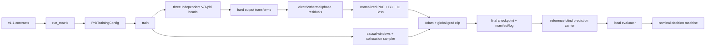

# 2026-08-30 PHK-V2.3 P0 只读审计与拟议合同

## 身份与边界

- `task_id`: `PHK_V23_P0_READ_ONLY_AUDIT`
- `source_conversation_id`: `6a93c493-0068-83ee-a73a-7267af995849`
- `source_role`: `UNTRUSTED_RESEARCH_PLANNING_CONTEXT_VERIFIED_AGAINST_LIVE_REPOSITORY`
- `status`: `P0_AUDIT_COMPLETE`
- `scientific_execution`: `NONE`
- `gpu_used`: `false`
- `checkpoint_loaded`: `false`
- `model_forward_or_backward`: `false`
- `nominal_reference_field_read`: `false`
- `stress_reference_field_or_metric_read`: `false`
- `proposed_next_phase`: `PHK_V23_BOUNDED_COMPETENCE_RECOVERY_AND_PJGR`
- `proposed_next_phase_status`: `PROPOSED_NOT_AUTHORIZED`
- `scientific_claim_change`: `NONE`

本记录是非权威 P0 审计交付，不是新 program/method contract、ADR、live plan、实验记录或研究执行授权。用户本轮只额外授权把必要 P0 交付提交到 GitHub；这不改变 [`active_phase.md`](../../active_phase.md)、[`PROJECT_STATE.md`](../../PROJECT_STATE.md) 或 [`docs/plans/NEXT_ACTIONS.md`](../plans/NEXT_ACTIONS.md) 的科研边界。

审计遵循故障诊断的证据纪律：P0 禁止构造可复现该科学症状的新 forward/backward 或训练循环，因此不能完成 red-capable 根因证伪。下文只确认静态调用关系和既有产物字段；所有竞争根因继续标为 `UNKNOWN`，R0A/R0B 才是后续诊断阶段。

## 1. VERIFIED CURRENT STATE

### 1.1 仓库与授权

| 项目 | 只读核验结果 |
|---|---|
| branch | `main` |
| local HEAD | `f40303eb4025327da10ef7c874c963c59641a8fb` |
| `PINN-PCM-SCI/main` | `f40303eb4025327da10ef7c874c963c59641a8fb` |
| phase | `PHK_V22_ONE_WEEK_SPRINT_TERMINAL_NO_GO` |
| lifecycle | `COMPLETE` |
| claim | `MVP_NO_GO_NO_BASIC_COMPETENCE_ADVISOR_DRAFT_COMPLETE` |
| candidate | `NO_CANDIDATE_ALL_FOUR_ARMS_INELIGIBLE` |
| next research execution | `false` |
| stress | 两份 `SEALED_UNREAD_PENDING_CANDIDATE_FREEZE` |

`VERIFIED`：终局文件相对 HEAD 无修改；工作树中的既有 dirty 内容属于其他会话或用户工作，本次没有覆盖或纳入。它们包括 `docs/governance/EXTERNAL_SKILLS.md`、`.agents/skills/academic-research-suite/`、EAF/R1/thermodynamic/tilted phase-field 代码与测试。

### 1.2 终局科学事实

正式 nominal run 为 `outputs/runs/20260830T112225-phk-v22r-v11-nominal-69109cd/`。四臂均使用 Tesla V100-PCIE-32GB、FP64、seed 17、scratch start、1000 Adam updates；云端训练保持 reference-blind。

nominal 估算费用约 ¥1.1481，历史累计估算约 ¥4.8101；二者均是按展示单价计算的估算，不是平台账单。实例已在终局回收后关闭。

| arm | PDE first → final | primary | phase ROI RMS | competence |
|---|---:|---:|---:|---|
| `STRONG_RAW` | 0.117633 → 0.005137 | 0.005150 | 0.110471 | FAIL |
| `MF_ONLY` | 0.730313 → 0.001452 | 0.005150 | 0.110548 | FAIL |
| `SAMPLER_ONLY` | 0.221026 → 0.004885 | 0.005150 | 0.110408 | FAIL |
| `MF_PLUS_SAMPLER` | 1.033186 → 0.006700 | 0.005150 | 0.110528 | FAIL |

`VERIFIED`：四臂预测均 finite 且 phase in range，最大 phase 均约 0.029993，整个时间轴 `phase >= 0.5` 的预测活动比例为 0。每臂实际六项失败严格是 cycle 1/2 各自的 event missing、ROI peak below minimum、recovery failure。决策机输出：

```text
status=MVP_NO_GO_NO_BASIC_COMPETENCE
reason=ALL_FOUR_ARMS_FAILED_FROZEN_COMPETENCE_GUARDS
selected_arm=null
strongest_comparator=null
confirmation_training_authorized=false
stress_unseal_authorized=false
terminal_no_rescue=true
```

`SUPPORTED_INTERPRETATION`：四臂共同未越过 competence 门，故现有证据只定位到共享 solver/physics/training stack，尚未进入 MF、sampler 或组合增量的可归因比较层。

`UNKNOWN`：共享 failure 的具体根因。现有文件不能在物理/reference 身份、电热驱动、phase output conditioning、loss/head gradient、causal/sampling coverage 或优化刚性之间裁决。

## 2. CODE CALL GRAPH



### 2.1 真实节点、默认值与覆盖

| 节点 | 实际文件与入口 | 当前关键值 | 对训练语义的作用 | 现有测试 |
|---|---|---|---|---|
| contracts | `configs/phk_v22r/program_contract.json`; `configs/phk_v22r/method_contract.json` | four arms、FULL、FP64、seed 17、Band A、1000、512/128/128、final-only | 声明冻结身份；但不是所有值都由执行器单源读取 | 部分：`tests/test_phk_v22r_pinn.py:167-191` |
| runner | `pinn_pcm_sci/phk_v22r_sprint.py:55-107,170-298`, `validate_v11_execution_contract`, `run_matrix` | 只接受 `mode=nominal`；四臂顺序固定 | 构造正式 config、调用训练并生成 carrier | 有，合同子集 |
| config | `pinn_pcm_sci/phk_v22r_training.py:89-158`, `PhkTrainingConfig` | lr `1e-3`、clip `10`、width 64、layers 4、refresh 250、weights `1/5/1` | 训练身份与 config hash | 间接覆盖 |
| physical materialization | `phk_v22r_training.py:173-193`; `phk_v22r_pinn.py:80-165` | FULL fixed-discretization object | 只加载物理合同，不读取 reference | 有结构覆盖 |
| model construction | `phk_v22r_training.py:301-307`; `phk_v22r_pinn.py:314-424` | `STRONG_RAW` 无 MF、无 physics sampler | 三个独立 ModifiedMLP heads；无 shared trunk | arm identity 有 |
| V/T/phase heads | `phk_v22r_pinn.py:266-303,378-387` | hidden 64 × 4；output weight std `1e-3`，bias 0 | 决定各场 latent；物理残差提供跨 head 耦合 | basic forward/backward 有 |
| output transforms | `phk_v22r_pinn.py:479-509`, `diagnostics` | T scale 2.5；phase latent scale 8；startup 0.35 | 硬满足三个 IC；phase 严格落在 `(0,1)` | hard IC/range 有 |
| PDE residuals | `phk_v22r_pinn.py:538-609`, `evaluate_fields`, `interior_residuals` | strong form；二阶空间导数 | 定义 V–QJ–T–phase–sigma 耦合目标 | 导数与 finite backward 有；逐项公式缺失 |
| loss aggregation | `phk_v22r_pinn.py:693-713`; `phk_v22r_training.py:227-245,396-406` | PDE scales `1/4/5`; group weights `1/5/1` | PDE 三项先平均，再与 BC/IC 聚合 | effective-weight 测试缺失 |
| causal schedule | `phk_v22r_training.py:204-214,364-391` | fractions `0/.15/.35/.55` | 依序开放四个物理时间窗 | equal replay 有；真实 switch logging 缺失 |
| sampler | `phk_v22r_pinn.py:716-881`, `PhkCollocationSampler` | 35/25/25/15、pool ×4；raw 实际 pure Sobol | raw 均匀采样；sampler arms 才按 residual/phase/Joule 排名 | uniform floor/equal replay 有 |
| optimizer | `phk_v22r_training.py:308,396-417` | Adam 仅显式冻结 lr `1e-3` | 更新全部三个 heads | 一步 finite backward 有；默认 kwargs 未身份化 |
| gradient clipping | `phk_v22r_training.py:409-417,427-447` | global norm `10` | 在 optimizer step 前裁剪全部参数 | clip/post-clip 测试缺失 |
| checkpoint/manifest | `phk_v22r_training.py:248-272,450-499` | final model + optimizer state；final-only | 保存终局状态与声明；无初始/中间 snapshot | 一步写入测试有 |
| prediction carrier | `pinn_pcm_sci/phk_v22r_prediction.py:58-94,97-127,130-293` | contract-derived extra-fine axes | checkpoint forward；输出 V/T/phase、current、integrated Joule power，不读 reference | fixture 测试有 |
| evaluator | `pinn_pcm_sci/phk_v22r_evaluator.py:71-106,221-318,405-598` | phase threshold 来自 physical event；若干 guards 代码硬编码 | nominal 本地读 reference，计算 competence/metrics | synthetic identical fixture 与 fail-closed 有 |
| decision | `pinn_pcm_sci/phk_v22r_decision.py:88-253` | event-first；only full may advance | 全臂不 eligible 时立即 No-Go | attributable gain/No-Go 有 |

### 2.2 Phase competence 相关实现

三个 heads 独立，但在残差中形成同时求解的闭环，而不是顺序 forward：

\[
V\rightarrow \nabla V,\quad
\sigma(T,\phi)\rightarrow Q_J=\sigma|\nabla V|^2,
\quad Q_J\rightarrow T,
\quad T\rightarrow\phi,
\quad \phi\rightarrow\sigma.
\]

输出变换为：

\[
V=w(t)\,\sigma(h_V),
\]

\[
T=2.5\,[1-e^{-t/0.35}](1-z_f)\,\sigma(h_T),
\]

\[
\phi=\sigma\!\left(\operatorname{logit}(\phi_0)+8[1-e^{-t/0.35}]h_\phi\right).
\]

`VERIFIED`：`ModifiedMLP` 的 output layer 以小权重和零 bias 初始化；在 `t=0`，结构使三个 IC 精确成立。strong-raw 的 41 个日志快照中 `initial_loss` 约为 `3.52e-33`–`4.28e-33`，因此 IC group 在这些快照没有可见训练信号。这是 hard transform 的预期效果，不是根因结论。

普通四臂内部确有 latent 和初始 logit，但 `_latent_fields` 的 latent dict 没有进入日志或 carrier；`diagnostics()` 也只返回 fields，以及 strict-probe 专用 gate/pilot/proxy。现有 API 因而不能无侵入记录普通 strong-raw 的 latent，R0 需要只观察、不改图语义的 hook。

真实物理实现为：

\[
\sigma=\exp\{\log(8)\,\phi^2(3-2\phi)+0.25T\},
\]

\[
r_V=\sigma\nabla^2V+\nabla\sigma\cdot\nabla V,
\]

\[
r_T=T_t+0.05\phi_t-0.10\nabla^2T+4T-4Q_J,
\]

\[
r_\phi=\phi_t-M(T)\,[0.04^2\nabla^2\phi-\partial_\phi W(T,\phi)].
\]

其中 phase-conductivity feedback 在 `PhkV22RPhysics.conductivity` 与 electrical/Joule residual 中调用；latent heat 是 thermal residual 的 `0.05*phi_t`；phase kinetic drive 由 `mobility(T)` 和 `potential_derivative(T,phi)` 实现。

### 2.3 Loss、clip 与 causal schedule 的既有可见事实

`normalized_residual_loss` 对 electric/thermal/phase 的 `(residual/scale)^2` 求均值，因此三项对 PDE scalar 的等效系数为 `1/3`、`1/48`、`1/75`；这不等同于参数梯度贡献。

strong-raw 可由日志重构：

| 时点 | normalized electric | normalized thermal | normalized phase | PDE scalar share E/T/P |
|---|---:|---:|---:|---:|
| update 1 | `2.05e-8` | `0.351221` | `1.679e-3` | `~0.000006% / 99.524% / 0.476%` |
| update 1000 | `1.153e-3` | `1.4257e-2` | `1.987e-6` | `7.482% / 92.506% / 0.0129%` |

`VERIFIED`：aggregate PDE loss 下降时，strong-raw electric RMS 从 `1.433e-4` 上升到 `3.396e-2`，最终 PDE scalar 仍由 thermal 项主导，phase scalar share 极小。这使 loss/gradient conditioning 成为高价值待测项，但没有 per-head gradient，因此不能升级为根因。

clip 是全模型 global norm 10；日志只保存合并的 `gradient_norm_before_clip`。strong-raw 的 41 个记录点范围约 `0.00206`–`0.518`，均未触发 clip；其余 959 个未记录更新和 post-clip/head-specific norm 均 `UNKNOWN`。早期 clipping 在 MF arms 的稀疏日志中可见，却不能解释 raw 与 sampler-only 的共同 failure。

四个物理时间窗是 `[0,.35]`、`[.35,1.25]`、`[1.25,1.60]`、`[1.60,2.50]`。以零基 update index 表示，真实开放区间为 `0–149`、`150–349`、`350–549`、`550–999`；以 optimizer update 表示则是 1–150、151–350、351–550、551–1000。每次 batch 在所有已开放窗口间 equal replay，因此窗口 1/2/3/4 分别参与 1000/850/650/450 个 updates。

实际 collocation refresh 位于 optimizer updates 1、151、251、351、501、551、751；由于 `log_every=25` 与 one-based 记录错位，除 update 1 外都没有被写成日志行。现有日志首次观察到新 active-window 数是在 175、375、575，并不是实际 switch 时点，故无法从日志审计 switch 附近的样本或梯度。

### 2.4 P0 发现的执行身份缺口

这些是工程 finding，不改变已冻结终局结果：

1. `CURRENTLY_ALIGNED_BUT_NOT_FULLY_FAIL_CLOSED`：runner 当前硬编码值与 method contract 一致，但 `validate_v11_execution_contract` 未校验 width/layers、lr、clip、loss scales/weights、window/refresh/mixture。
2. `CURRENTLY_ALIGNED_BUT_DUPLICATED_NOT_FAIL_CLOSED`：evaluator 的 ROI peak/global/locality/recovery 阈值与 decision 的 gain/non-inferiority 阈值在代码中重复硬编码，当前数值吻合，但不是 JSON 单一来源。
3. `MANIFEST_SEMANTIC_MISMATCH`：strong-raw 实际 `physics_aware=false`，只使用 uniform Sobol；manifest 却无条件列出 `SOBOL/PDE_RESIDUAL/PREDICTED_PHASE/PREDICTED_JOULE`。`architecture.physics_sampler=false` 是当前正确身份字段。
4. `CHECKPOINT_IDENTITY_GAP`：temperature scale 2.5、phase latent scale 8、startup 0.35 等 transform defaults 不在 `PhkTrainingConfig`/architecture manifest；prediction reload 依赖当前代码默认值。Adam 除 lr 外的 kwargs 也未展开身份化。

## 3. EXISTING EVIDENCE INVENTORY

| 诊断量 | 当前证据 | 取得下一层证据所需动作 |
|---|---|---|
| terminal identity/competence | manifest、evaluation、decision、closeout 已有 | 无 |
| total/PDE/BC/IC loss | 41-line JSONL 已有 | 若需逐 update，必须 replay |
| electric/thermal/phase RMS | 41-line JSONL 已有，可按固定 scale 重构 scalar share | 不能由此推断 head gradient |
| BC component losses | JSONL 已有 | per-head contribution 需 backward |
| global gradient norm | 仅 41 个 pre-clip 合并值 | post-clip、逐 loss/逐 head 需新 backward/replay |
| final V/T/phase/current | 已存在 prediction carrier；本 P0 未重新打开数组 | carrier-only 离线统计属于 R0A 新分析 |
| Joule | carrier 仅有 integrated `joule_power(t)` | 精确空间 QJ 需 checkpoint input-autograd forward |
| phase max/event topology | closeout/evaluation 已有 | update trajectory 需 replay |
| phase latent/logit/Jacobian | 公式和 final checkpoint 存在；未物化 | final 值需 checkpoint forward/代数反演；轨迹需 replay |
| phase drive decomposition | 没有；代码仅提供合并 residual | 精确分项需 forward/input derivatives |
| per-loss/per-head grad norm/cosine | 没有 | checkpoint backward；轨迹需 replay |
| head update norm | final checkpoint 只有终态；无初始/中间 snapshot | 确定性初态重建或 replay，必须记录身份 |
| actual sampler coordinates/scores | 没有 | observer hook + replay |
| per-window residual/gradient | 没有 | 跨窗口 replay；149-step 不足 |
| nominal teacher substitutions | 没有 | 获 R0A 授权后本地 CPU 诊断 |
| stress diagnostics | sealed/unread | candidate freeze 前不可达 |

prediction carrier schema 已有 `x(160)`、`z(80)`、`time(1001)`、`potential/temperature/phase(1001,12800)`、`top_current(1001)` 和 `joule_power(1001)`。生成器把空间 `local_joule` 求和后丢弃，因此 carrier 无空间 QJ map。

## 4. UNKNOWN / BLOCKERS

1. `UNKNOWN`：reference 温度代入当前真实 phase law 后是否产生足够 kinetic drive；代码没有标准化 `phi_eq(T)` API，不能凭规划文档中的符号替代真实 `potential_derivative`。
2. `UNKNOWN`：预测温度/空间 QJ 是否不足，还是 thermal/phase 方程即使有 drive 也停在近初值解。
3. `UNKNOWN`：phase latent 是否处于低 Jacobian 区、phase head 是否梯度饥饿、各 objective 是否冲突。
4. `UNKNOWN`：未记录 updates 的 clip 行为；现有 strong-raw 快照不支持“clipping 导致 failure”。
5. `UNKNOWN`：真实 collocation 点在 phase susceptibility/Joule hotspot 和各窗口的覆盖；manifest 列表不是实际选点证据。
6. `BLOCKER`：149 post-update replay 只覆盖第一 causal block。在原 1000-step schedule 下首次 switch 发生于 optimizer update 151；因此 149-step 能诊断早期 collapse，但不能证实或排除跨窗饥饿。
7. `BLOCKER`：在 full R0A contract 与显式授权前，checkpoint forward/backward、nominal teacher substitution 和任何 replay 都是新科研执行。

## 5. PROPOSED PHK-V2.3 CONTRACT

本节全部为 `PROPOSED_NOT_AUTHORIZED`，不会自动改变 live phase。

### 5.1 Phase、状态与全局止损

```text
program_id = PHK_V23_BOUNDED_COMPETENCE_RECOVERY_AND_PJGR
pjgr_status = CONDITIONAL_CANDIDATE

p0_audit_status = COMPLETE
r0a_cpu_diagnostic_authorized = false
r0b_v100_replay_authorized = false
r1_training_authorized = false
r2_training_authorized = false
stress_unseal_authorized = false
low_fidelity_pivot_authorized = false
submission_authorized = false

GLOBAL_GPU_HARD_CAP = 34 V100 GPU-hours
GLOBAL_CNY_HARD_CAP = 95 estimated CNY
GLOBAL_CALENDAR_HARD_CAP = 14 natural days from EXECUTE authorization
```

| 阶段 | GPU cap | CNY cap | 计算 |
|---|---:|---:|---|
| P0 | 0 h | 0 | CPU static only |
| R0A | 0 h | 0 | local CPU |
| R0B | 1 h | 5 | one V100 replay |
| R1 | 3 h | 10 | V100 |
| R2 或互斥 low-fidelity pivot | 15 h | 40 | V100 |
| R3 | 15 h | 40 | V100 |
| R4 | 0 h | 0 | local writing |

任一全局上限先到即停；失败阶段余额不得变成额外 seed/module/rescue。付费阶段结果回收后立即关机。只允许一次 competence recovery campaign、一个显式 PJGR 架构家族、一次独立 low-fidelity pivot；三者均失败后固定 `FINAL_BOUNDED_NEGATIVE_RETAINED / FURTHER_RESCUE_FORBIDDEN`。

拟议 ¥95 是 V2.3 新执行的增量估算上限，不抹去历史约 ¥4.8101；项目既有 ¥150 总硬上限若继续有效，也必须并行执行，取最先触发者。费用都只按展示单价估算。

### 5.2 R0A CPU diagnostic

输入冻结为 seed-17 strong-raw final checkpoint、既有 carrier/log/manifest、nominal physical contract、2048 点 frozen diagnostic Sobol pool，以及获授权后才可本地读取的 nominal development reference。

允许：CPU checkpoint forward/input-autograd、residual decomposition、逐 loss/逐 head backward、phase latent/Jacobian、空间 QJ、真实 kinetic-drive 分项、teacher substitutions 与 mixed-field probes。禁止：optimizer step、参数更新、checkpoint 选择、修改 loss/gate/sampler/init/threshold，以及任何 stress 访问。

R0A 必须调用现有 `conductivity`、`mobility`、`potential_derivative` 与 residual 实现，不另造未被代码定义的 `phi_eq`。输出绑定源 run/config/contract hashes，并写 `reference_access_role=NOMINAL_LOCAL_DIAGNOSTIC_ONLY`、`training_semantics_changed=false`、`stress_fields_read=false`。

reference 边界：nominal extra-fine 只可用于本地诊断/评价和 development 决策；不得进入 loss、gate、sampler、初始化、阈值选择或云端。任何由 nominal reference 帮助选择的 method/config 都只能把 nominal 视为 development；最终正向确认必须由冻结后的多 seed 与 sealed cases 承担。stress extra-fine 在六载体 freeze 前不可读、不可上传。stress medium 是否能作为低保真部署输入为 `UNKNOWN`，必须另行冻结。

### 5.3 Root-cause taxonomy 与 R0B

R0 必须只选一个 primary root-cause，可附一个 bounded secondary：

1. `PHYSICAL_MODEL_REFERENCE_IDENTITY_MISMATCH`
2. `UPSTREAM_ELECTROTHERMAL_DRIVE_DEFICIT`
3. `PHASE_OUTPUT_JACOBIAN_OR_GRADIENT_STARVATION`
4. `MULTIOBJECTIVE_GRADIENT_IMBALANCE_OR_CONFLICT`
5. `CAUSAL_OR_SAMPLING_COVERAGE_DEFICIT`
6. `OPTIMIZATION_STIFFNESS_WITH_SIGNAL_PRESENT`
7. `UNRESOLVED_AFTER_BOUNDED_DIAGNOSTIC`

若为类别 1，禁止调网络，先重新资格化 object/reference；若 R0A 缺少训练时轨迹而 unresolved，才允许唯一 R0B：V100、STRONG_RAW、FP64、seed 17、scratch、reference-blind，保持原物理/loss/sampler/optimizer，只增加 observer。

```text
scientific_schedule_total_updates = 1000
executed_post_updates = 149
observation_points = [0,1,5,10,25,50,100,149]
covers_first_causal_switch = false
```

不能把 `config.updates` 改为 149，否则按比例的 causal schedule 会被压缩，训练语义已改变。observer 必须证明 on/off 下坐标、Sobol/RNG 状态、loss、gradient、optimizer step 与最终参数逐位或容差内一致。149-step 结果不能裁决跨窗 failure；若确需越过首次 switch，至少 151 post-updates，必须另行授权，不能静默多跑。

### 5.4 R1 competence recovery

`R1a` 只允许 root-cause taxonomy 映射出的一个 atomic intervention，并比较 `legacy raw` 与 `raw + one intervention`；seed、object、point budget、event evaluator 不变。curriculum、dynamic weighting、continuation、alternating update、L-BFGS 不能合称一个原子干预。

只有 R1a 失败后才可运行唯一 `R1b` 复合 backbone，所有组成与顺序事前冻结：最多 5000 Adam updates；L-BFGS 最多 500 iterations 或预冻结 wall-time；所有 homotopy 参数最终必须回到原 fixed-discretization 物理值；R2 所有 arms 必须共用。它只能称 common solver recovery，不得把其组件分别包装成创新。R1b 失败即停止 pure-scratch recovery。

R1 通过仍由原 event-first competence 决定：两周期 event/ROI peak/recovery、finite/range、locality/no-global-transition 全过，且 T/current 不发生灾难性退化；PDE loss 下降单独无效。

### 5.5 PJGR activation 与 R2

PJGR 只有在 CR_RAW reference-blind 通过完整 competence、排除 identity mismatch、剩余误差预声明地局域于 phase susceptibility/Joule hotspot、且能构造严格参数匹配的 ungated control 时才激活。第一版只允许显式确定性、parameter-free、stop-gradient gate：

\[
s_T=\sigma((T_{bg}-T_c)/\Delta T),\quad \chi_T=4s_T(1-s_T),
\]

\[
\widetilde Q_J=\operatorname{clip}(Q_{J,bg}/(Q_{0.95}+\epsilon),0,1),
\]

\[
g_{PJ}=g_{min}+(1-g_{min})\sigma(a_T\chi_T+a_Q\widetilde Q_J-b).
\]

`T_bg/QJ_bg` 只能来自模型预测并 stop-gradient；`Q0.95` 从 frozen CR_RAW 在 contract-derived coordinates 上的预测 QJ 分布冻结，不得来自 reference；`Tc/DeltaT` 来自物理合同；`g_min/aT/aQ/b` 必须在看到 R2 结果前给出实际值。现有 `STRICT_PHA_PROBE` 使用 pilot phase/heater proxy、可反传 gate，且无 matched ungated arm，不能改名充当 PJGR。

R2A 固定四臂：

```text
CR_RAW
GLOBAL_MF
UNGATED_RESIDUAL
PJ_GATED_RESIDUAL
```

两个 residual arms 必须拥有相同 module graph、state-dict keys/shapes、参数量、初始化、background/correction 输出，唯一差异是 correction multiplier `1` 与 `stopgrad(g_PJ)`；R2A 不启用 physics sampler。only `PJ_GATED_RESIDUAL` may advance。建议沿用既有尺度：PJGR competence 全过；相对 CR_RAW 联合 region/ROI ratio `<=0.90`；相对 UNGATED 的 primary/co-primary 各 `<=0.98`、联合 `<=0.95`；T/I 使用 1.10 ratio 与冻结 absolute floors 做 non-inferiority。

R2A 单 seed 通过后才进入预声明三 seeds（含 17）与 fixed-update/parameter-matched/measured-time fairness；不得只报告最优 seed。sampler synergy 是后续条件子阶段，只有架构先存活才可启用，不能与 gate 主效应混杂。

### 5.6 Stress 与 low-fidelity gate

stress 只在 method、strongest comparator、parameter-matched measured-time raw control、seeds、thresholds、config 和 claim branch 全部冻结，且两个 cases × 三 roles 的六份 reference-blind prediction carriers 已完成并核验 hashes 后，由同一 decision machine 写出 v2.3 candidate freeze。随后才可一次性本地开封；不得上传云端。开封后不重训、不补 seed、不改阈值、不删除 adverse case/metric。

low-fidelity pivot 仅当 R1a 与 R1b 均失败时触发：

```text
PURE_PINN_SCRATCH_NO_GO
LOW_FIDELITY_PIVOT_TRIGGERED_REQUIRES_FROZEN_CONTRACT
```

触发不等于执行授权。pivot 不获得额外预算；nominal medium 可作 development input，nominal extra-fine 只评价，stress extra-fine 继续 sealed。新合同必须预先决定 stress medium 的角色，并至少比较 medium interpolation、data-only correction、conventional MF-PINN、ungated residual PINN、gated residual PINN；完整 PDE residual 仍须承担核心约束。pivot 再失败即全局终止。

## 6. MINIMAL PATCH PLAN

本 P0 未应用以下 patch。获新合同与执行授权后，最小方案是复用当前 trainer/evaluator/decision，不建立平行权威链。

| 文件 | 最小拟议改动 |
|---|---|
| `configs/phk_v23/program_contract.json` | 冻结阶段状态、预算、唯一 R0B/R1/R2/stress/pivot 规则 |
| `configs/phk_v23/method_contract.json` | 冻结 transform/optimizer 全参数、诊断定义、PJGR/matched arms、metric/gate 单一来源 |
| `configs/phk_v23/r0_diagnostic_schema.json` | 固定 tensor/statistic、provenance、root-cause 与 refusal 字段 |
| `pinn_pcm_sci/phk_v23_diagnostics.py` | 只做 R0 汇总；不训练、不评分、不持有第二状态 |
| `pinn_pcm_sci/phk_v22r_pinn.py` | 增加默认关闭的 latent/residual/sampler observer；实现 matched residual routing；默认 forward 不变 |
| `pinn_pcm_sci/phk_v22r_training.py` | 在同一 loop 注入 observer；分离 schedule total 与 executed updates；manifest 记录实际 sampler/optimizer/transform/hook 身份 |
| `pinn_pcm_sci/phk_v22r_sprint.py` | 同一 runner 按新合同 dispatch；把所有训练语义纳入 fail-closed 校验 |
| `pinn_pcm_sci/phk_v22r_prediction.py` | 接受新 arm identity，仍只用 contract-derived axes |
| `pinn_pcm_sci/phk_v22r_evaluator.py` | metric/threshold/role 改为合同驱动，保留 v1.1 回归和 stress fail-closed |
| `pinn_pcm_sci/phk_v22r_decision.py` | 同一机器增加 R0/R1/R2/pivot/stress states；only PJGR advance |
| `tests/test_phk_v23_contract.py` | 完整 contract↔runner↔manifest identity tests |
| `tests/test_phk_v23_boundaries.py` | reference isolation、observer invariance、matched-arm、stress refusal tests |
| ADR + live authority docs | 获授权后用一个 ADR 激活；只更新现有 `active_phase/PROJECT_STATE/NEXT_ACTIONS`，不建第二状态文件 |

必须修正 universal `sampler_inputs`、展开 Adam kwargs 和 output-transform defaults，并让 evaluator/decision 阈值由版本化合同驱动。不得新增 `phk_v23_training.py`、`phk_v23_evaluator.py` 或第二份 ledger/state。

## 7. SAFE CPU TEST RESULTS

本 P0 实际运行以下 7 个 existing focused tests：

```text
test_v11_contract_and_runner_expose_only_the_frozen_four_arm_nominal
test_stress_reference_fails_closed_before_candidate_freeze
test_candidate_freeze_schema_can_be_validated_without_opening_stress
test_confirmation_plan_freezes_measured_time_raw_update_budget
test_final_freeze_requires_exactly_six_verified_prediction_identities
test_nominal_decision_requires_attributable_combined_gain
test_evaluation_write_failure_does_not_leave_partial_json

Ran 7 tests in 0.123s
OK
```

这些测试只读合同或使用临时 synthetic JSON/fixture；没有训练、model forward/backward 或真实 stress field read。整份 `tests/test_phk_v22r_pinn.py` 未运行，因为其中含 one-step backward、one-update training 和 checkpoint prediction。

文档一致性门禁在本记录与索引写入后运行并通过：`DOCUMENT_CONSISTENCY_VALID`。

合同写入后至少新增：

- reference isolation：训练/model/loss/gate/sampler 公共 API 不接受 reference/label/oracle 参数；即使 monkeypatch reference opener 立即失败，训练数据流也不调用它；nominal reference 只在本地 R0A/evaluator 角色可达。
- stress refusal：无 v2.3 六载体 freeze、非 blind carrier、身份/hash drift 均不能打开 stress；训练或 cloud 入口不可达 stress path。
- observer invariance：instrumentation on/off 保持 RNG/Sobol、选点、loss、gradient、optimizer step 和最终参数一致。
- schedule：149 post-updates 不覆盖原 1000-step first switch，短 replay 不压缩 schedule。
- matched PJGR：gated/ungated 的 graph、state-dict keys/shapes、参数量、初始化完全一致；唯一差异是 multiplier；gate parameter-free、stop-gradient、prediction-only，Q0.95 provenance 拒绝 reference。
- physics/loss identity：逐项 residual 公式、latent heat、sigma/QJ feedback、effective loss coefficients、clip pre/post 行为、actual sampler manifest、refresh logging。
- decision/budget：exact four-arm R2、only PJGR advance、R1 one-atomic+one-composite、low-fidelity 双失败触发，以及 34 h/95 CNY/14-day cap fail-closed。

现有 `test_one_update_training_writes_reference_blind_manifest` 只验证 manifest 声明，不能单独证明 reference 在数据流上不可达。

## 8. NEXT AUTHORIZATION REQUIRED

P0 已完成并在此停止。当前明确不启动 GPU，也不自动进入 R0A。

下一科研动作必须由用户批准一个版本化 PHK-V2.3 contract 后，才可执行：

```text
R0A: local CPU checkpoint forward/backward + nominal development diagnostics
GPU: NO
stress: SEALED_UNREAD
parameter update/training: NO
```

R0A 若无法裁决且满足合同中的条件，再单独授权：

```text
R0B: one reference-blind STRONG_RAW 149-post-update instrumented replay
GPU: YES, one V100
cap: 1 GPU-hour / 5 estimated CNY
```

在新的 `active_phase.md`、program/method contracts、ADR、tests 与 consistency gate 全部生效前，`next_research_execution_authorized=false` 继续有效。
