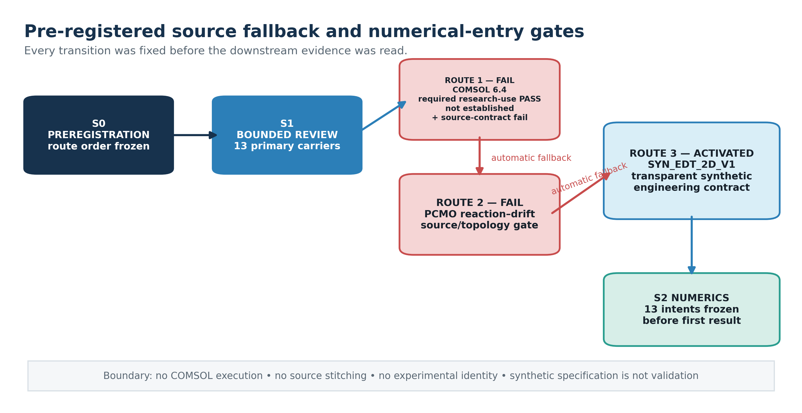
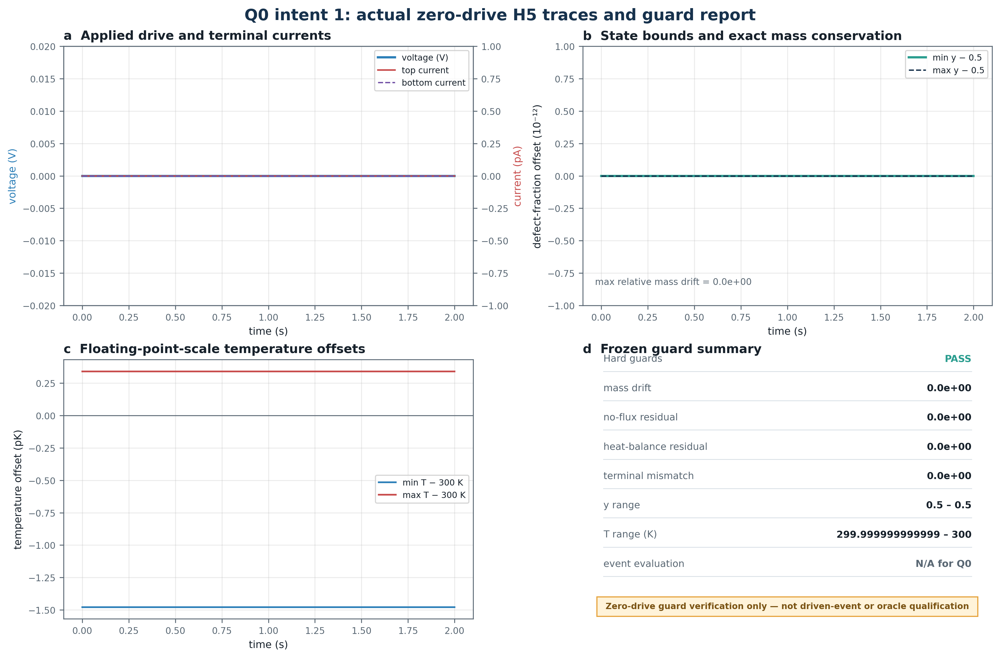
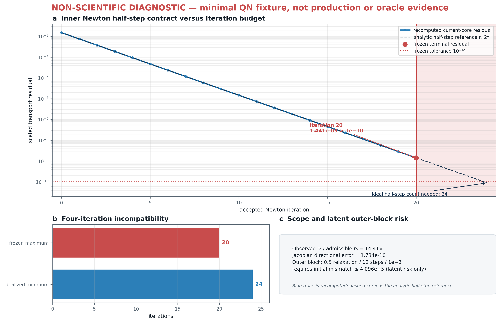

# When the Reference Solver Fails First: Failure-Preserving Qualification Before PINN Training in an Electrothermal Defect-Transport Case Study

**Manuscript type:** Benchmark-qualification and method-limits study  
**Evidence identity:** Fully transparent synthetic engineering object; benchmark candidate not qualified; no source-aligned replay; no experimental validation  
**Authors:** [To be completed by the authors before submission]  
**Affiliations:** [To be completed by the authors before submission]  
**Corresponding author:** [To be completed by the authors before submission]

## Abstract

Physics-informed neural-network studies inherit the validity of the reference process used to train or evaluate them. A plausible multiphysics model is therefore insufficient: the object specification must be usable, the reference solver numerically qualified, the target event stable, and the claim boundary robust to failure. We report a project-local, pre-result-frozen qualification study designed to establish those prerequisites before neural training. Two source-aligned routes were assessed against fixed contracts. A COMSOL 6.4 memristor example did not establish the research-use and independent-reference-output conditions required by this route and left several model-tree fields unresolved. A published PCMO reaction-drift model was a lumped point-device construction whose current response depended on an unavailable Sentaurus lookup table. The preregistered fallback was therefore a fully transparent two-dimensional axisymmetric synthetic electrothermal defect-transport case. Its equations, geometry, parameters, waveform, event criteria, discretization, tolerances, 13-intent qualification ladder, and no-rescue rule were frozen and hash-bound before the first numerical result.

The zero-drive Q0 implementation guard completed 400 time steps, preserved the defect fraction at 0.5, maintained 300 K to floating-point precision, and recorded zero mass drift, no-flux residual, heat-balance residual, and terminal-current mismatch. This was implementation evidence, not an oracle result. The first driven QN qualification intent then stopped before producing a case field because the transport Newton solve exceeded its frozen 20-iteration limit. A separately labeled non-scientific minimal fixture reproduced the failure class: 20 accepted half steps reduced the scaled residual from approximately $1.51\times10^{-3}$ to $1.44\times10^{-9}$, still above the frozen $10^{-10}$ threshold, while a directional finite-difference check did not reveal a large Jacobian mismatch in the tested direction.

The terminal result is a numerical-contract No-Go for this frozen solver configuration. It is not evidence that the equations are unsolvable, that a driven event exists or does not exist, or that any PINN succeeds or fails. No oracle, event, neural training, GPU development, or formal comparison was reached. The study contributes a failure-preserving workflow in which an upstream reference-solver failure is retained rather than repaired after inspection. Stopping before training prevents an unqualified reference process from being repackaged as machine-learning evidence.

**Keywords:** physics-informed neural networks; memristor; electrothermal transport; defect transport; preregistration; numerical qualification; negative results; reproducibility

## 1. Introduction

Physics-informed learning for oxide switching devices sits at a difficult interface. The target systems are multiphysics and history-dependent, while the learning method can only be evaluated against a reference process whose equations, boundary conditions, protocols, numerical uncertainty, and data provenance are sufficiently closed. If those prerequisites are not established first, an apparently successful neural result can instead reflect an undocumented simulator default, a numerically unqualified trajectory, a post hoc event definition, or leakage between development and evaluation cases.

This problem is particularly acute for device models that couple electrical conduction, heat generation, and mobile defects. Public examples can be scientifically informative without providing a complete independent-reconstruction contract. The COMSOL Application Gallery memristor model, for example, documents a coupled oxide-device example with electric currents, heat transfer, charge-carrier transport, and Joule heating [C01, C02]. A separate PCMO study couples reaction-drift dynamics and self-heating but implements the transient response as a point-device model driven by a Sentaurus-generated current lookup table [C05]. These sources motivate the physical setting, yet source visibility is not equivalent to permission, full model identity, machine-readable reference output, or independent reproducibility.

The method literature creates a second risk. Conditional PINNs, hypernetwork-generated PINNs, parameter encoders, adaptive residual weighting, explicit absolute-value cusp features, spline representations, and learned or fixed parameter bases all have direct precedents [C06–C12]. A new application-specific combination must therefore not be called a generally novel neural primitive merely because it is deployed in a different device setting. More fundamentally, architecture comparisons have no scientific meaning until the reference object and its oracle floor are qualified.

We address these problems by treating source access, object closure, numerical qualification, event qualification, and method evaluation as sequential evidence gates. The workflow was frozen locally before source adjudication or numerical execution. It specified three ordered object routes, fixed budgets, immutable case identities, physical guards, a 13-intent qualification ladder, and terminal actions. It also stated in advance that an early hard failure would close the current object contract without time-step reduction, parameter adjustment, threshold relaxation, or replacement intent.

The study asks three research questions:

1. Can a source-aligned oxide-device object be closed under a fixed permission, model-identity, and independent-output contract?
2. If source-aligned routes close, can a transparent synthetic fallback pass a predeclared numerical and event qualification ladder before becoming a neural benchmark?
3. When the reference solver fails upstream, which claims and artifacts remain scientifically admissible?

The study makes four bounded contributions.

1. It gives an executable, failure-preserving pre-oracle workflow in which source and operational access questions are separated from physical-model completeness, numerical validity, event qualification, and machine-learning claims.
2. It specifies a transparent two-dimensional electrothermal conservative defect-transport benchmark candidate whose complete contract can be inspected independently, while explicitly withholding benchmark status until numerical and event qualification pass.
3. It reports the complete terminal record from one frozen qualification attempt: a successful zero-drive guard, the first driven execution failure, exact resource accounting, unreached downstream gates, and a separately classified diagnostic localization.
4. It provides a reusable claim-boundary template for preserving a negative result without expanding it into a claim about physical solvability, event existence, or PINN performance.

This article deliberately does **not** report a trained PINN. That absence is not an omitted experiment: it is the prescribed consequence of the reference-solver gate failing before an oracle was established. Raw neural baselines, conditional architectures, out-of-distribution tests, and sealed formal comparisons were therefore not scientifically admissible under the preregistered contract. The resulting paper is a reference-qualification and method-limits case study, not a positive method paper and not an experimental device study.

## 2. Related work and source context

### 2.1 Source-aligned oxide-device models

COMSOL Application 141181 describes a two-dimensional axisymmetric memristor example built in COMSOL Multiphysics 6.4 [C01, C02]. The documentation identifies palladium electrodes, tantalum-oxide regions, a conductive-filament domain, electric and thermal fields, and mobile charge-carrier transport. It provides several constitutive expressions, a voltage schedule, principal domain dimensions, and a terminal-current definition. A temporary read-only metadata audit of the vendor binary fixed its build as COMSOL 6.4.0.257 and confirmed that solved payload entries existed [C13]. Those facts establish the identity of a vendor asset; they do not establish a license-independent right to execute it, redistribute it, or extract a reference solution.

The applicable COMSOL license materials bind Examples and software use to authorized use and distinguish ordinary licensed output from trial-license results [C03, C04]. We do not offer a legal opinion. For this study, the operational question was narrower: did the evidence available without credentials, paid access, or author contact establish every permission and source field required by the preregistered research route? It did not. In addition, the public model documentation did not close the domain-5 transport initial state, all default feature selections, the exact stabilization settings, interpolation and extrapolation behavior, or an independently usable machine-readable reference output. These missing fields were fatal under the fixed source contract even if licensing were set aside.

Saraswat et al. reported a reaction-drift model for switching transients in PCMO resistive RAM [C05]. The paper provides a physically motivated connection among hole transport, defect reaction-drift, and self-heating. However, the published dynamic model uses spatially uniform trap density and temperature. The current is obtained from a quasi-static Sentaurus TCAD lookup table, and MATLAB advances lumped state and thermal equations. The TCAD deck, material files, lookup table, and machine-readable transients were not part of the reviewed carrier. This is a useful point-device precedent, but it is not a complete two-dimensional conservative defect-transport reference object.

### 2.2 Parameterized and structured physics-informed representations

The planned method screen originally considered parameter-conditioned transport representations. Broad parameter conditioning is already established by conditional PINNs [C06], HyperPINN [C07], and parameter-encoder approaches for parameterized PDEs [C08]. Residual-adaptive weighting has also been studied independently [C09]. Explicit non-smooth structure is not without precedent: cusp-capturing PINNs introduce an absolute-value level-set feature to represent derivative discontinuities at an interface [C10]. Spline-PINN [C11] and physics-informed B-spline networks [C12] provide additional precedents for fixed structured bases, trainable control representations, and parameterized PDE families. The reviewed PI-BSNet identity now includes its March 2026 TMLR version as the primary publication record, while retaining the ICLR 2026 AI&PDE workshop carrier as provenance.

Our bounded prior-art review found no exact match to the project-specific transport expression that had been proposed for later testing. Nevertheless, the load-bearing ingredients had direct precedents. The architecture therefore did not receive clearance for a general novelty claim. It remained, at most, a conditional application-specific transport adaptation that could only be evaluated as a diagnostic or comparison arm. Because the oracle gate failed, that comparison was never run, and no method conclusion is drawn here.

### 2.3 Why pre-oracle negative results matter

Negative results in physics-informed learning are often difficult to interpret because several layers can fail independently: source closure, implementation, numerical solution, event generation, oracle uncertainty, baseline competence, or the learned method itself. A solver failure before reference fields exist cannot be converted into evidence about a neural model. Conversely, suppressing the failed intent and rerunning with relaxed settings erases information about the actual frozen protocol. Our design treats the failed intent as a budget-consuming result and preserves it alongside the successful guard, while explicitly allowing future work to define a new contract rather than silently rewriting the present one.

## 3. Methods

### 3.1 Pre-result registration and evidence layers

The study used two machine-readable contracts. The S0 contract froze route order, source requirements, synthetic physical equations, case definitions, method gates, budgets, failure semantics, and manuscript endpoints. Its SHA-256 digest was

`947E737A255D27A7BB2553286809ADB98219FD4E48B932B170CB06608A2E3A75`.

After both source-aligned routes closed, the S2 contract froze the discretization, nonlinear solver, evaluator, uncertainty-floor construction, control semantics, and intent order. Its SHA-256 digest was

`D059AA2261CC227C3B16B7965A75C461AD64110C2A20C3700B62E54FDE25E8E6`.

Both contracts existed before the first production result for the synthetic object. The word *preregistered* in this article means project-local and pre-result frozen; it does not imply registration with an external registry or acceptance as a registered report.

Evidence was separated into four layers:

- **Verified run evidence:** facts directly recorded in immutable run manifests and hashed artifacts.
- **Supported interpretation:** a bounded inference from verified sources or runs, with the inference stated.
- **Non-scientific diagnostic:** a reduced fixture used only to localize an implementation or numerical failure class; it cannot vote on the physical object, event, oracle, or method.
- **Unknown:** a question not reached or not identifiable from the completed evidence.

The study also distinguished implementation success, execution success, numerical validity, and scientific claims. A completed program or passing unit test was not treated as a physical result.

### 3.2 Ordered source and object gates

Three object routes were frozen in order:

1. the COMSOL 6.4 Application 141181 source-aligned route;
2. the PCMO reaction-drift source route;
3. `SYN_EDT_2D_V1`, a fully transparent synthetic fallback.

Route 1 required, among other fields, the exact build and asset identity, all domain selections, the domain-5 initial state, complete electrical, thermal, and transport initial and boundary conditions, constitutive interpolation and extrapolation behavior, transport stabilization, terminal-current integration, lawful research access, and machine-readable reference outputs. Route 2 required a two-dimensional device object with a complete conservative defect field, complete initial and boundary conditions, exact absolute protocols, output data, solver identity, and a usable code/data license. A missing topology-defining or reference-defining field was not inferred from defaults or stitched from another source.

The source search was bounded to 12 new primary carriers and two deep candidate reviews. Thirteen carriers were actually reviewed because three were pre-existing carriers reused in the audit; ten counted against the new-carrier budget. The complete carrier list is reproduced in the References.

**Figure 1. Preregistered source fallback and numerical-entry gates.** The diagram ends at the S2 numerical freeze; execution outcomes appear in Figure 3. Red denotes a route-specific source stop, blue the activated synthetic route, and teal the frozen numerical-entry contract.

**Figure 2. Source-route qualification matrix.** The matrix records bounded route outcomes, not universal legal conclusions, physical-model failures, source validation, or global prior-art exhaustion.

### 3.3 Synthetic electrothermal defect-transport contract

The fallback object was defined independently as an engineering benchmark rather than a material-calibrated model. It used a two-dimensional axisymmetric $(r,z)$ domain. The active mixed conductor occupied $0\le r\le80$ nm and $0\le z\le30$ nm. A bottom electrode occupied $0\le r\le80$ nm and $-15\le z\le0$ nm. A centered top contact occupied $0\le r\le25$ nm and $30\le z\le45$ nm.

The electric field obeyed

\[
\nabla\cdot\mathbf J_e=0,
\qquad
\mathbf J_e=-\sigma(y,T)\nabla\phi .
\]

The normalized lattice-gas defect fraction $y\in(0,1)$ obeyed conservation with Nernst–Planck-type flux,

\[
\partial_t y+\nabla\cdot\mathbf j_y=0,
\qquad
\mathbf j_y=-D(T)\left[\nabla y+
\frac{e}{k_{\mathrm B}T}y(1-y)\nabla\phi\right].
\]

Temperature was quasi-steady,

\[
-\nabla\cdot(k\nabla T)=\sigma(y,T)|\nabla\phi|^2 .
\]

The synthetic constitutive choices were

\[
D(T)=D_0\exp\left[-\frac{0.18\ \mathrm{eV}}{k_{\mathrm B}}
\left(\frac1T-\frac1{T_0}\right)\right],
\qquad D_0=5\times10^{-16}\ \mathrm{m^2\,s^{-1}},
\]

and

\[
\sigma(y,T)=500\exp[2(y-0.50)]
\exp\left[-\frac{0.04\ \mathrm{eV}}{k_{\mathrm B}}
\left(\frac1T-\frac1{T_0}\right)\right]\ \mathrm{S\,m^{-1}},
\]

with $T_0=300$ K. The active thermal conductivity was $1\ \mathrm{W\,m^{-1}\,K^{-1}}$. Electrode electrical and thermal conductivities were $5\times10^6\ \mathrm{S\,m^{-1}}$ and $20\ \mathrm{W\,m^{-1}\,K^{-1}}$, respectively. All values were declared engineering choices; none was claimed as an experimentally fitted material constant.

The initial defect fraction was uniform, $y=0.5$, and the initial temperature was 300 K. The bottom potential was zero, and the top potential followed the prescribed waveform. Other electrical boundaries were insulating. All active-domain defect boundaries were no-flux. Electrical potential and normal current, and temperature and normal heat flux, were continuous at internal interfaces. The top cap and bottom underside were fixed at 300 K; other thermal boundaries were adiabatic.

Each waveform comprised two state-carrying 1 s cycles. A nominal cycle ramped from 0 to $+0.18$ V over 0.02 s, held to 0.32 s, ramped to zero by 0.36 s, held to 0.46 s, ramped to $-0.15$ V by 0.48 s, held to 0.78 s, ramped to zero by 0.82 s, and then held to 1 s. Q0 set both pulse amplitudes to zero. QL, QN, and QH used positive amplitudes of 0.144, 0.18, and 0.216 V, respectively, with the negative amplitude fixed at $-0.15$ V. Only QN was allowed to vote on event qualification.

### 3.4 Numerical discretization

The S2 discretization was a masked, non-uniform, cell-centered finite-volume method in axisymmetric coordinates. Radial cell volumes and face areas retained the cylindrical weights, and the face at $r=0$ had exactly zero area. Shared face conductances enforced electrical and thermal interface continuity. At heterogeneous electrical faces, total face Joule power was split between adjacent cells in proportion to their two half-face resistances.

Electric continuity was solved by sparse direct factorization at each block iteration. The quasi-steady thermal matrix used a constant sparse direct factorization. The defect equation used backward Euler in a logit variable $w$, with $y=(1+\exp[-w])^{-1}$, so no clipping was permitted. Internal defect fluxes used a logarithmic-mean lattice-gas mobility and were written pairwise to preserve conservation. External active-domain faces contributed exactly zero normal flux, including in the saved cell-centered flux reconstruction.

The physical scales were $L_0=3\times10^{-8}$ m, $t_0=1.8$ s, $T_0=300$ K, and $V_T=0.02585$ V. The derived characteristic current was $2.4363051028588846\times10^{-6}$ A. Coarse, medium, and fine active-region spacings were at most 4, 2, and 1 nm, with contact-corner spacings of 1, 0.5, and 0.25 nm. Maximum time steps were 0.005, 0.0025, and 0.00125 s.

Each time step allowed at most 12 electrothermal-transport block iterations, with block relaxation 0.5, relative-change tolerance $10^{-8}$, and final scaled-residual tolerance $10^{-9}$. The transport Newton solve allowed at most 20 iterations, initial step 0.5, minimum line-search step $9.765625\times10^{-4}$, and scaled-residual tolerance $10^{-10}$. The line search could reduce the step but could not increase it above 0.5. After relaxation, electric and transport residuals were recomputed on the returned state. No time-step rescue, parameter rescue, or post-result threshold change was allowed.

### 3.5 Physical guards and event definition

The hard guards required relative mass drift and terminal-current mismatch no greater than $10^{-4}$, defect fraction within $[10^{-8},0.99999999]$, temperature within 295–450 K, and relative heat-balance residual no greater than 0.01. Port signs, no-flux behavior, event localization, partial coverage, and recovery were not averaged into a scalar score.

For driven cases, the event field in cycle $k$ was

\[
d_k(\mathbf x,t)=\frac{y_{\mathrm{pre},k}(\mathbf x)-y(\mathbf x,t)}{0.50}.
\]

The voting region of interest was the volume under the top contact, $r\le25$ nm and $24\le z\le30$ nm. A qualifying event required both cycles to satisfy a peak mean depletion between 0.12 and 0.55, recovery of at least 0.7, limited depletion in an adjacent $25<r\le50$ nm annulus, a connected depleted thickness fraction between 0.05 and 0.35, partial coverage between 0.0025 and 0.2, cycle drift no greater than 0.2, and the physical guards. Event time was the first upward crossing of mean depletion 0.12. These rules were not applied to Q0, for which the event evaluator was explicitly marked not applicable.

### 3.6 Qualification ladder and stopping rule

The qualification ladder contained 13 ordered solver intents: Q0 coarse/coarse; five crossed space-time QN evaluations; QL and QH brackets; medium/fine and fine/fine evaluations for each of two thermal controls; and an independent-process QN fine/fine replay for the oracle floor. The order was `STOP_ON_EXECUTION_INVALIDITY`; QL, QH, controls, and replay could not replace a failed QN branch.

**Figure 3. Frozen qualification ladder.** The order and stop-on-invalidity rule were fixed before the first production result. Only intents 1 and 2 were consumed; the remaining intents were not reached.

The total authorized numerical budget was 40 CPU solver intents and 256 CPU core-hours. Failed intents counted against the budget. A failed intent could not be discarded or replaced. The first hard numerical failure closed `SYN_EDT_2D_V1` under the frozen contract. This rule is essential to the interpretation of the result: a changed solver could define a new future study, but it would not be a rescue of this one.

### 3.7 Post-failure diagnostic protocol

After the driven failure, a reduced unit-test fixture was permitted solely to identify whether a reachable implementation defect explained the stop. The fixture was labeled `NON_SCIENTIFIC_DIAGNOSTIC`, excluded from the experiment ledger, and barred from all physical and method claims. It contained 12 active cells, a single 0.00125 s step, and the first QN ramp endpoint of 0.01125 V.

The diagnostic recorded the inner Newton residual history and accepted line-search steps. It also compared the analytic Jacobian-vector product with a centered finite-difference directional derivative. The test could support a narrow conclusion about the reproduced local state; it could not establish convergence on the production grid, event existence, or the behavior of an alternative nonlinear solver.

## 4. Results

### 4.1 Source and method-admission gates

The source audit reviewed 13 primary carriers: ten new to the project and three pre-existing carriers reused in the adjudication. Both allowed deep reviews were consumed. Table 1 summarizes the first decisive result for each route.

| Route | Reviewed identity | First decisive result | Disposition |
|---|---|---|---|
| 1 | COMSOL 6.4 Application 141181 | Required research-use and independent reference-output PASS were not established; domain-5 initial state, full default tree, stabilization, interpolation/extrapolation behavior, and machine-readable outputs were not closed | Route closed; no COMSOL solve or field extraction |
| 2 | PCMO reaction-drift model [C05] | Published model was lumped and spatially uniform; current depended on an unavailable Sentaurus LUT; no complete 2D conservative defect field or executable source package | Route closed; no source-stitching rescue |
| 3 | `SYN_EDT_2D_V1` | Transparent synthetic fallback activated | Proceeded to S2 numerical qualification |
| Method admission | Conditional transport representation | No exact bundle collision found in the bounded set, but all load-bearing representation mechanisms had direct precedents [C06–C12] | No positive architecture-novelty clearance; diagnostic/comparative status only |

**Table 1. Source and method-admission outcomes.** The legal-access disposition is operational and scoped to the evidence required by this route; it is not a general legal conclusion about a user, institution, or jurisdiction.

The temporary vendor binary audit established a file length of 59,463,566 bytes, SHA-256 `14A1A8356B6FDA3C2B2CCBC2F4458C0F610CD47C4EE924602D4DBD49C8983FA3`, build 6.4.0.257, and the presence of solution payload entries [C13]. The asset was deleted after metadata inspection and was never executed, redistributed, or included in the reproducibility package. These facts closed asset identity only; they did not close independent executable access or provide reference fields.

### 4.2 Effective numerical freeze

The effective case freeze was run

`20260826T113537Z-goal-paper-one-shot-v1-s2-freeze-002`,

which superseded a non-bearing earlier freeze and bound the S0 digest, S2 digest, and Q-only case-manifest digest. The effective freeze-manifest SHA-256 was `74B5CD92A5271FD481A134DD52A80DD22FC65DC6784F761C5B8B74B880AB2F35`; the Q-only case-manifest digest was `EF093A5C2F2E798FF05E768C3D0837CF08C3E10FD6AE79B432F26585F0FCD09C`. The freeze itself consumed no solver intent and made no numerical claim.

### 4.3 Q0 zero-drive implementation guard

Q0 completed successfully on the coarse/coarse grid. Its run identity was

`20260826T113638Z-goal-paper-one-shot-v1-s2-intent-01-q0`.

The solver completed 400 steps over 2 s. Every step converged in one block iteration. Because the voltage was zero and the initial state was uniform, no transport Newton iteration was needed. The full run used 801 electric and 401 thermal linear solves, for 1,202 linear solves total, and performed 400 final consistency evaluations. The maximum final scaled transport residual was zero.

| Q0 quantity | Recorded value |
|---|---:|
| Time steps | 400 |
| Block iterations, total / maximum | 400 / 1 |
| Linear solves, electric / thermal / total | 801 / 401 / 1,202 |
| Transport Newton iterations | 0 |
| Final scaled transport residual, maximum | 0.0 |
| Defect fraction, minimum / maximum | 0.5 / 0.5 |
| Temperature, minimum / maximum | 299.9999999999985 / 300.00000000000034 K |
| Relative mass drift, maximum | 0.0 |
| No-flux residual, maximum | 0.0 |
| Relative heat-balance residual, maximum | 0.0 |
| Relative terminal-current mismatch, maximum | 0.0 |
| Wall time | 8.38404590007849 s |
| Gross CPU process core-hours | 0.0023003472222222223 |

**Table 2. Verified Q0 guard evidence.** Event applicability was false by contract. Passing this table establishes zero-drive implementation behavior and artifact-chain integrity only.

**Figure 4. Q0 zero-drive implementation guard.** The flat traces must not be interpreted as a driven device result or an oracle qualification.

Q0 produced a case file, evaluator archive, and report whose SHA-256 digests were, respectively, `01F5DCF28E25A75E74C5EDBE612456A542ECA36EFFCB8CAFEC196AE4994F7A01`, `F24439F92CBC70FDED7A24DE1D0B6272E59D14A169CCB86A1FAA888E21BDAE6B`, and `0964E3B55431AA49CDE158FFF7F98F3478288865A6DE670CC88ABD9B7BF3D1A8`. The manifest retained the status `PENDING_S2_CROSS_RUN_ADJUDICATION`; it was not promoted to oracle evidence.

### 4.4 First driven QN intent and terminal stop

The next required intent was QN on the coarse-space/fine-time level with the full electrothermal model:

`20260826T113752Z-goal-paper-one-shot-v1-s2-intent-02-qn-coarse-fine`.

It failed before a production case field, evaluator archive, or report was written. The recorded exception was

`RuntimeError: transport Newton exceeded its frozen iteration limit`.

The failure occurred after 0.0984956999309361 s wall time and 0.09375 process CPU seconds, corresponding to $2.604166666666667\times10^{-5}$ CPU process core-hours. The failed intent was consumed, one failure was counted, and zero rescue attempts were made. Together, Q0 and QN consumed 2 of the 40 allowed solver intents and 0.002326388888888889 CPU process core-hours. No GPU time was used.

The run manifest assigned `numerical_validity=NOT_EVALUATED` because no QN field existed for physical or convergence adjudication. Intents 3–13 were not launched. Consequently, the following quantities remain unknown: QN field convergence; both-cycle event behavior; QL/QH bracketing; thermal-control effects; space, time, and replay uncertainty floors; and all method endpoint normalizers.

### 4.5 Non-scientific localization of the failure class

The reduced fixture reproduced the inner transport failure under the frozen settings of initial step 0.5, maximum 20 iterations, and residual threshold $10^{-10}$. The initial scaled residual was

\[
r_0=1.5106745331996967\times10^{-3}.
\]

All 20 accepted steps had length 0.5. The residual after the twentieth accepted step was

\[
r_{20}=1.4406930175716191\times10^{-9}>10^{-10}.
\]

The measured residual ratio was $9.536753191437917\times10^{-7}$, consistent with $2^{-20}=9.5367431640625\times10^{-7}$. For a locally near-linear Newton model with a fixed half step, the leading residual recurrence is $r_{k+1}\approx0.5r_k$. To reach $10^{-10}$ in 20 such steps, the initial residual would have to be no larger than $1.048576\times10^{-4}$. The observed fixture residual was approximately 14.41 times that bound.

The centered finite-difference directional derivative and the analytic Jacobian agreed to a relative infinity-norm error of $1.7339861280712171\times10^{-10}$ at this fixture state. This check argues against an obvious Jacobian assembly error as the local proximate cause. It does not prove global Jacobian correctness.

**Figure 5. Diagnostic localization, excluded from scientific voting.** The fixture reproduces the numerical failure class but is not a production grid and cannot establish an event, oracle, or physical result.

The outer block iteration had a separate latent risk: it was also frozen at relaxation 0.5, maximum 12 iterations, and relative-change threshold $10^{-8}$. Even ideal factor-of-two reduction over 12 steps yields only $2^{-12}=2.44140625\times10^{-4}$, so a normalized initial mismatch would need to be no greater than $4.096\times10^{-5}$ to meet the threshold. The production QN run stopped in the inner Newton solve before reaching the outer convergence decision. We therefore report the outer calculation only as a structural risk, not as an observed outer failure.

### 4.6 Terminal evidence disposition

The frozen route disposition is

`SYN_EDT_2D_V1_NUMERICAL_CONTRACT_NO_GO`.

The negative result has three distinct parts:

1. **Verified:** Q0 passed the zero-drive implementation and conservation guards under the frozen artifact chain.
2. **Verified:** the first driven QN intent stopped at the frozen transport Newton iteration limit, produced no field artifact, consumed its intent, and was not rescued.
3. **Diagnostic:** a reduced fixture showed that the fixed half-step/iteration/tolerance combination was locally incompatible with its reached initial residual and did not reveal an obvious Jacobian directional-derivative mismatch at that state.

No stronger conclusion is supported. Specifically, there is no evidence here for a valid oracle, a driven depletion-recovery event, a thermal effect, baseline competence, a PINN advantage or failure, architecture novelty, out-of-distribution generalization, or experimental agreement.

**Figure 6. Evidence, execution, and claim boundary.** Arrows terminate where required evidence was not produced. Two of 40 CPU solver intents were consumed, including one failed intent; total recorded production CPU use was 0.002326388888888889 process core-hours and GPU use was zero.

## 5. Discussion

### 5.1 The principal result is a gate result, not a device result

The most important interpretation is also the narrowest. The study did not show that the synthetic electrothermal defect-transport equations fail. It showed that one fully specified numerical contract could not advance past its first driven qualification intent. This distinction matters because nonlinear solver settings, time integration, variable transformations, and coupling strategies are part of a reference-object contract. A failure in that layer precedes and invalidates claims at the event and machine-learning layers.

Q0 is useful but insufficient. It verifies several implementation invariants—uniform-state preservation, zero-drive thermal behavior, conservative bookkeeping, port closure, and artifact integrity—under an easy regime. Those checks reduce the probability of certain gross implementation errors. They do not exercise driven transport Newton convergence, local depletion, recovery, spatial convergence, or the event evaluator. Reporting Q0 as an “oracle pass” would therefore collapse implementation evidence into scientific validity.

### 5.2 Why the contract was not repaired after the result

The diagnostic suggests an obvious engineering response: allow a full Newton step, increase the iteration limit, loosen the tolerance, change the block relaxation, or adopt a more adaptive nonlinear strategy. Any of these may be reasonable in a future benchmark version. None was allowed in this study because the solver settings and no-rescue policy were frozen before Q0 and QN were observed.

This restriction is not an argument that fixed settings are universally preferable. It is an argument for separating two questions:

- Did the preregistered configuration pass?
- Could a revised configuration work?

The evidence answers the first question negatively and leaves the second unknown. Preserving that boundary avoids a common form of post-result optimization in which solver parameters are adjusted until a desired event appears and the final configuration is retrospectively presented as if it were the original plan.

### 5.3 Consequences for PINN evaluation

A PINN requires a physically explicit residual, but residual inclusion alone does not make a reference comparison valid. This study stopped before training because the oracle fields and their uncertainty floor did not exist. Without those quantities, one cannot determine whether a neural endpoint error is below numerical uncertainty, whether an event-time error is meaningful, or whether a baseline is competent. Training a network after the QN stop would have produced implementation activity, not admissible method evidence.

The source audit also changes how architecture claims should be written. Conditional family learning, parameter encoders, hypernetworks, adaptive residual weights, absolute-value cusp features, and spline bases are established mechanisms [C06–C12]. A future method study may still demonstrate an application-specific advantage, but it would need strong direct baselines, placement and capacity controls, compute accounting, and sealed cases. The absence of an exact prior-art bundle in a bounded search does not establish a general new PINN primitive.

### 5.4 Source transparency and operational legal gates

The COMSOL route illustrates why public discoverability should not be conflated with a research-ready source contract. The public documentation and vendor asset metadata were informative [C01, C02, C13], and the license documents were publicly readable [C03, C04]. Yet the required combination of authorized execution, full default-tree identity, and independently usable outputs was not established under the study's no-credential, no-paid-access boundary. Closing this route was therefore an operational decision about the evidence available to this project, not a universal statement about COMSOL users or independent implementations.

The PCMO route failed for a different reason. Its scientific story was relevant, but the public model identity was a point-device approximation with an unavailable TCAD lookup table [C05]. Extending it to a two-dimensional conservative defect field would create a new engineered model rather than reproduce the published source. Activating a transparent synthetic contract was more honest than silently combining equations, parameters, and outputs from heterogeneous sources.

### 5.5 Reusable lessons for negative benchmark studies

Four practices made the terminal result interpretable.

First, route gates were ordered. A source failure led to an explicitly declared fallback rather than an improvised model. Second, physical, numerical, event, and method contracts were frozen separately but hash-bound. Third, a failed intent counted against the budget and was not overwritten. Fourth, diagnostics were assigned a non-scientific identity so that useful debugging evidence could coexist with strict scientific boundaries.

These practices do not guarantee that a benchmark will succeed. They make success and failure legible. That is valuable in multiphysics machine learning because a failure at an upstream layer can otherwise be hidden by downstream model flexibility.

## 6. Limitations

This study has substantial and deliberate limitations.

1. **No driven field solution was produced.** The QN intent stopped before writing a case field. Therefore no conclusion can be made about the shape, localization, magnitude, timing, or even existence of the preregistered depletion-recovery event.
2. **No numerical convergence study was completed.** Medium/fine spatial comparisons, time-step comparisons, replay variability, QL/QH brackets, and thermal controls were not reached. No oracle floor exists.
3. **No PINN was trained or evaluated.** The study contains no raw neural baseline, no conditional architecture result, no ablation, no GPU run, no OOD split, and no formal statistical test. It cannot support a positive or negative method claim.
4. **The nonlinear diagnosis is local and reduced.** The 12-cell fixture and directional derivative check identify a proximate contract incompatibility at one reduced state. They do not prove global Jacobian correctness, production-grid solvability, or success under any revised settings.
5. **The physical object is synthetic.** Geometry, parameters, waveforms, and constitutive laws were engineering choices. The object is not calibrated to a material, source-aligned to the vendor tutorial, or experimentally validated.
6. **The source review was bounded.** It used a fixed carrier budget and two deep reviews. It does not establish global legal rights, exhaustive prior art, or universal non-reproducibility of the reviewed models.
7. **Preregistration was local.** The contracts were frozen before the relevant results and are content-addressed, but they were not deposited with an external registry before execution.
8. **The production code identity was a dirty local working tree.** Run manifests recorded the working-tree revision and dirty state. Reproducibility of the executed state therefore rests on the delivered file hashes and package inventory. A later selective public GitHub snapshot improves access to the reviewed materials but does not retroactively turn the production run into a clean-commit execution.

These limitations define the article's contribution. The paper is a documented qualification stop and method-boundary case, not an incomplete positive PINN paper.

## 7. Conclusion

We executed a pre-result-frozen route from source review to numerical qualification for a prospective physics-informed electrothermal defect-transport study. Two source-aligned candidates closed under their fixed contracts, leading to a fully transparent synthetic benchmark. The zero-drive Q0 guard passed all recorded implementation and conservation checks, but the first driven QN intent exceeded the frozen transport Newton iteration limit before producing a field. A reduced, explicitly non-scientific diagnostic localized the stop to the interaction among the fixed half step, iteration count, and tolerance at the reproduced state, without supporting any physical or machine-learning claim.

The correct terminal conclusion is `SYN_EDT_2D_V1_NUMERICAL_CONTRACT_NO_GO`. The result is bounded to this numerical contract. It does not establish physical unsolvability, event absence, or PINN failure. By stopping before training and preserving the failed intent, the study prevents an unqualified reference process from becoming a misleading neural benchmark. Future work may define and preregister a new numerical contract, but it must remain a new study rather than a retrospective rescue of this one.

## Data and code availability

Project-generated contracts, manifests, source-audit records, selected Q0 artifacts, failure records, diagnostic tests, and manuscript materials are available in the public project repository at <https://github.com/ghy001122/PINN-PCM-SCI>. The first bounded snapshot was merged at commit `cad644c`; the synchronization-boundary record was added at commit `2e419b1`. The principal content-addressed identities remain the S0 contract digest `947E737A255D27A7BB2553286809ADB98219FD4E48B932B170CB06608A2E3A75`, S2 contract digest `D059AA2261CC227C3B16B7965A75C461AD64110C2A20C3700B62E54FDE25E8E6`, and effective Q-only case-manifest digest `EF093A5C2F2E798FF05E768C3D0837CF08C3E10FD6AE79B432F26585F0FCD09C`.

The proprietary COMSOL `.mph` asset is not included. It was inspected transiently for archive metadata, never executed, and deleted after the audit. No vendor solution fields, unpublished PCMO lookup table, credentials, paid resources, or third-party restricted data are redistributed. The synthetic Q0 data are computational artifacts, not experimental measurements. Repository availability does not constitute journal publication, experimental validation, or a license grant for third-party materials.

## Ethics, competing interests, and funding

This work used no human participants, animals, clinical data, or personal data. No experimental device measurements are reported. The authors must complete the competing-interest and funding statements before submission. At draft completion, no claim is made regarding external funding, institutional endorsement, or journal acceptance.

## Author contributions

Author names and CRediT roles must be supplied and approved by the authors before submission. The computational workflow records support later assignment of conceptualization, methodology, software, validation, formal analysis, investigation, data curation, visualization, writing, supervision, and project-administration roles, but this draft does not infer individual contributions.

## Acknowledgments

To be completed by the authors if applicable. No person, institution, or vendor endorsement is implied by the use of publicly accessible documentation.

## References

[C01] COMSOL. **Memristor.** Application Gallery, Application ID 141181. <https://www.comsol.com/model/memristor-141181>.

[C02] COMSOL. **Memristor: COMSOL Multiphysics 6.4 Application Library documentation.** `models.semicond.memristor.pdf`, asset 1585101. <https://www.comsol.com/model/download/1585101/models.semicond.memristor.pdf>.

[C03] COMSOL. **COMSOL Software License Agreement, version 6.4.** <https://doc.comsol.com/6.4/doc/com.comsol.help.comsol/comsol_la_license.04.1.html>.

[C04] COMSOL. **Notice of Academic Licensed Rights.** <https://www.comsol.com/legal/academic-licensed-rights>.

[C05] Vivek Saraswat, Shankar Prasad, Abhishek Khanna, Ashwin Wagh, Ashwin Bhat, Neeraj Panwar, Sandip Lashkare, and Udayan Ganguly. **Reaction-drift model for switching transients in Pr0.7Ca0.3MnO3-based resistive RAM.** *IEEE Transactions on Electron Devices* 67(9) (2020), 3610–3617. DOI: <https://doi.org/10.1109/TED.2020.3011387>; arXiv:2005.07398. Author manuscript: <https://arxiv.org/pdf/2005.07398>.

[C06] Alexander Kovacs, Lukas Exl, Alexander Kornell, Johann Fischbacher, Markus Hovorka, Markus Gusenbauer, Leoni Breth, Harald Oezelt, Masao Yano, Noritsugu Sakuma, Akihito Kinoshita, Tetsuya Shoji, Akira Kato, and Thomas Schrefl. **Conditional physics informed neural networks.** *Communications in Nonlinear Science and Numerical Simulation* 104 (2022), 106041. DOI: <https://doi.org/10.1016/j.cnsns.2021.106041>; arXiv:2104.02741. <https://arxiv.org/abs/2104.02741>.

[C07] Filipe de Avila Belbute-Peres, Yi-fan Chen, and Fei Sha. **HyperPINN: Learning parameterized differential equations with physics-informed hypernetworks.** arXiv:2111.01008v1. <https://arxiv.org/abs/2111.01008>.

[C08] Woojin Cho, Minju Jo, Haksoo Lim, Kookjin Lee, Dongeun Lee, Sanghyun Hong, and Noseong Park. **Parameterized physics-informed neural networks for parameterized PDEs.** *Proceedings of Machine Learning Research* 235 (ICML 2024), 8510–8533. <https://proceedings.mlr.press/v235/cho24b.html>; arXiv:2408.09446. <https://arxiv.org/abs/2408.09446>.

[C09] Levi McClenny and Ulisses Braga-Neto. **Self-adaptive physics-informed neural networks using a soft attention mechanism.** *Journal of Computational Physics* 474 (2023), 111722. DOI: <https://doi.org/10.1016/j.jcp.2022.111722>; arXiv:2009.04544. <https://arxiv.org/abs/2009.04544>.

[C10] Yu-Hau Tseng, Te-Sheng Lin, Wei-Fan Hu, and Ming-Chih Lai. **A cusp-capturing PINN for elliptic interface problems.** *Journal of Computational Physics* 491 (2023), 112359. DOI: <https://doi.org/10.1016/j.jcp.2023.112359>; arXiv:2210.08424. <https://arxiv.org/abs/2210.08424>.

[C11] Nils Wandel, Michael Weinmann, Michael Neidlin, and Reinhard Klein. **Spline-PINN: Approaching PDEs without data using fast, physics-informed Hermite-spline CNNs.** *Proceedings of the AAAI Conference on Artificial Intelligence* 36(8) (2022), 8529–8538. DOI: <https://doi.org/10.1609/aaai.v36i8.20830>; arXiv:2109.07143. <https://arxiv.org/abs/2109.07143>.

[C12] Zhuoyuan Wang, Raffaele Romagnoli, Saviz Mowlavi, and Yorie Nakahira. **Physics-Informed Deep B-Spline Networks (PI-BSNet).** *Transactions on Machine Learning Research*, March 2026. <https://openreview.net/forum?id=tHO2zEqmzm>. Related provenance carrier: AI and PDE Workshop at ICLR 2026 poster, <https://openreview.net/forum?id=x1TWOnfTX8>.

[C13] COMSOL. **`memristor.mph`, Application 141181 vendor binary, asset 1471921.** Audited build: COMSOL 6.4.0.257; audited SHA-256: `14A1A8356B6FDA3C2B2CCBC2F4458C0F610CD47C4EE924602D4DBD49C8983FA3`. <https://www.comsol.com/model/download/1471921/memristor.mph>. The binary is not redistributed with this work.
