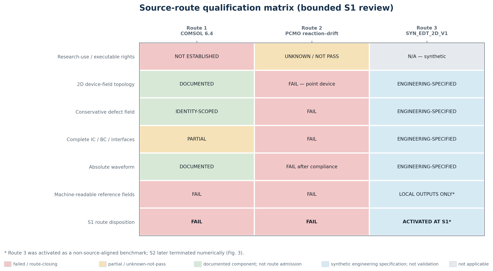
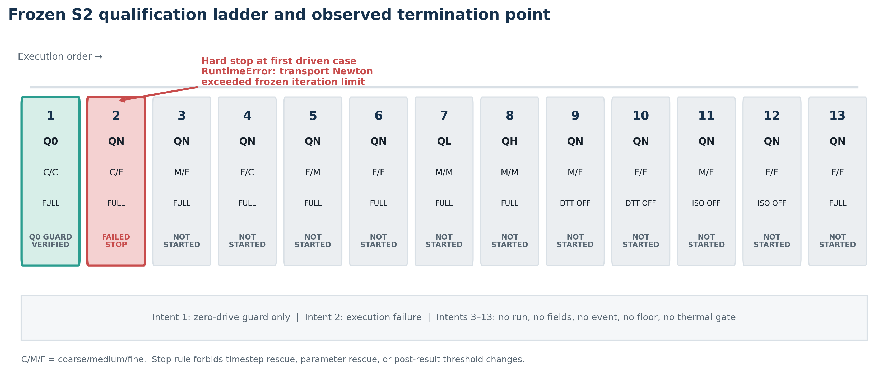
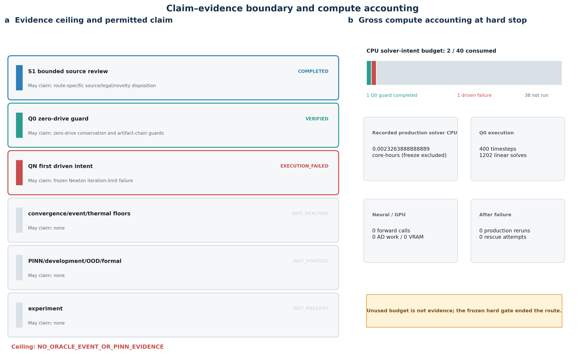

# 当参考求解器率先失败：电热—缺陷输运案例中 PINN 训练前的失败保全资格化

**稿件类型：** 参考对象资格化与方法边界研究  
**证据身份：** 完全透明的二维轴对称合成对象；非来源模型重放；非实验验证  
**作者、机构与通讯作者：** 投稿前由作者补全并确认

## 摘要

物理信息神经网络（PINN）的训练和评价会继承参考过程的有效性。一个看似合理的多物理模型并不足以支撑方法结论：对象说明必须可用，参考求解器必须经过数值资格化，目标事件必须稳定，主张边界还必须能够承受失败。本文报告一项在任何神经网络训练之前完成的、项目内预先冻结的顺序资格化研究。两条来源对齐路线首先接受固定合同审查：COMSOL 6.4 忆阻器示例未能建立本路线要求的研究使用与独立参考输出条件，并遗留若干未闭合的模型树字段；公开的 PCMO reaction–drift 模型则是依赖未公开 Sentaurus 查找表的集总点器件模型。于是，预注册切换表启用完全透明的二维轴对称电热—守恒缺陷输运合成对象。其方程、几何、参数、波形、事件标准、离散、容差、13-intent 资格化阶梯和禁止救援规则均在首个数值结果前完成哈希绑定。

零驱动 Q0 实现守卫完成 400 个时间步，缺陷分数保持为 0.5，温度在浮点精度内保持 300 K，质量漂移、无通量残差、热平衡残差和端口电流不匹配的记录值均为零。Q0 只属于实现证据，不是 oracle。随后，首个受驱动 QN 资格化 intent 在产生可评价场之前，因输运 Newton 求解超过冻结的 20 次迭代上限而终止。一个明确标记为 `NON_SCIENTIFIC_DIAGNOSTIC` 的最小 fixture 复现了该失败类别：20 个获接受的半步把缩放残差从约 $1.51\times10^{-3}$ 降至 $1.44\times10^{-9}$，仍高于冻结阈值 $10^{-10}$；所测方向的有限差分检查未显示大的 Jacobian 不匹配。

终局结果是针对该冻结求解器配置的数值合同 No-Go。它不证明方程不可解，不证明受驱动事件存在或不存在，也不证明任何 PINN 成功或失败。跨分辨率 oracle、事件、神经训练、GPU development 和 sealed formal 比较均未到达。本文的核心贡献是一个失败保全流程：上游参考求解器失败后，研究按预定规则停止并保留失败，而不是观察结果后修补合同，从而避免把未资格化的参考过程包装成机器学习证据。

**关键词：** 物理信息神经网络；忆阻器；电热输运；缺陷输运；预注册；数值资格化；负结果；可复现性

## 1. 引言

氧化物开关器件的物理信息学习位于一个高风险交界面：目标系统具有多物理耦合和历史依赖，而学习方法只能相对于一个已闭合的参考过程得到解释。若方程、边界条件、协议、数值不确定性或数据来源未先资格化，漂亮的神经网络曲线可能只是在拟合未记录的求解器默认值、未经验证的轨迹、事后定义的事件，或存在信息泄漏的案例划分。

这种风险在电导、焦耳热和移动缺陷耦合的器件模型中尤其突出。公开示例可以提供科学启发，却不必然提供完整的独立重建合同。COMSOL Application 141181 展示了二维轴对称忆阻器多物理模型 [C01–C04, C13]；PCMO 工作展示了 reaction–drift、自热和电流响应的联系 [C05]。但前者未在本项目边界内闭合所需权利、模型树和独立输出，后者使用集总状态并依赖未公开 TCAD 查找表。

方法侧也存在类似问题。conditional PINN、HyperPINN、参数编码、残差自适应、显式绝对值 cusp、Spline-PINN 和 PI-BSNet 均已有直接先例 [C06–C12]。因此，在新器件上组合这些构件，不能仅凭应用场景变化就宣称一般性新架构；更不能在参考对象与 oracle floor 尚未资格化时进行有意义的方法比较。

本文提出三个研究问题：

1. 来源对齐的氧化物器件对象能否在固定的权限、模型身份与独立输出合同下闭合？
2. 若来源路线关闭，透明合成 fallback 能否在成为神经 benchmark 前通过预声明的数值与事件资格化阶梯？
3. 当参考求解器在上游失败时，哪些主张和制品仍然具有科学可接受性？

本文有四项有界贡献：

1. 给出一个可执行、失败保全的 pre-oracle 工作流，分离来源与操作性准入、物理模型完整性、数值有效性、事件资格化和机器学习主张。
2. 给出一个可独立检查的二维电热—守恒缺陷输运 benchmark 候选合同，同时在数值与事件门通过前明确拒绝授予 benchmark oracle 身份。
3. 完整报告一次冻结资格化尝试：Q0 实现守卫、首个受驱动失败、实际计算计账、未到达门以及非科学诊断。
4. 给出负结果的 claim-boundary 模板，防止把数值合同失败扩写为物理解不可得、事件不存在或 PINN 失败。

本文刻意不报告训练后的 PINN。这不是漏做实验，而是参考求解器在 oracle 建立前失败后，预注册规则的正确执行结果。

## 2. 相关工作与来源语境

### 2.1 来源对齐的氧化物器件模型

COMSOL Application 141181 描述二维轴对称忆阻器示例，包含电流、传热、载流子输运和焦耳热 [C01, C02]。对公开 vendor binary 的临时只读元数据审计固定了 build `6.4.0.257` 和 solved-payload 的存在性 [C13]。这些事实只建立资产身份，不建立执行、再分发或提取参考解的普遍权利。项目采用的操作性问题更窄：在不使用凭据、付费访问或联系作者的边界内，现有证据是否闭合预注册路线需要的全部权利与来源字段？答案是否定的 [C03, C04]。

Saraswat 等的 PCMO reaction–drift 模型把空穴输运、缺陷反应漂移和自热联系起来 [C05]。但公开动态模型采用空间均匀的 trap density 与温度，电流来自准静态 Sentaurus 查找表，MATLAB 只推进集总状态与热方程。公开载体不含 TCAD deck、材料文件、查找表或机器可读瞬态，因此它是有价值的点器件先例，却不是完整的二维守恒缺陷输运参考对象。

### 2.2 参数化与结构化物理信息表示

conditional PINN [C06]、HyperPINN [C07] 和参数编码器 [C08] 已覆盖广义参数条件化；残差自适应已有独立研究 [C09]；cusp-capturing PINN 使用绝对值 level-set 特征表达界面导数不连续 [C10]；Spline-PINN [C11] 与 PI-BSNet [C12] 进一步覆盖固定结构基、可训练控制表示和参数化 PDE 家族。PI-BSNet 的主记录采用 2026 年 3 月 TMLR 版本，同时保留 ICLR 2026 AI&PDE workshop 载体作为来源沿革。

有界先验审查未发现项目拟议 transport 表达式的完整 bundle 精确碰撞，但其承重构件均有直接先例。因此该结构没有获得一般性新颖性放行；oracle 门失败后，它也没有进入任何比较。

### 2.3 为什么 pre-oracle 负结果重要

物理信息学习的失败可能来自不同层：来源闭合、实现、数值求解、事件生成、oracle 不确定性、基线能力或学习方法。参考场产生前的 solver failure 不能转换为神经方法证据；相反，删除失败 intent 并用放宽配置重跑会抹去冻结协议真正发生了什么。本文把失败 intent 作为消耗预算的结果永久保留，并允许未来以新合同开展新研究，而不是回写本次合同。

## 3. 方法

### 3.1 预结果冻结与证据分层

S0 机器合同冻结路线顺序、来源要求、合成物理、案例身份、方法门、预算、失败语义和论文终点，其 SHA-256 为：

`947E737A255D27A7BB2553286809ADB98219FD4E48B932B170CB06608A2E3A75`。

两条来源路线关闭后，S2 合同在首个合成对象数值结果前冻结离散、非线性求解器、evaluator、不确定性 floor、controls 和 intent 顺序，其 SHA-256 为：

`D059AA2261CC227C3B16B7965A75C461AD64110C2A20C3700B62E54FDE25E8E6`。

本文的“预注册”指项目内、结果前冻结并内容寻址，不等同于外部注册报告。证据分为 verified run evidence、supported interpretation、non-scientific diagnostic 和 unknown；实现成功、执行成功、数值有效与科学主张互不替代。

### 3.2 顺序来源与对象门

路线顺序在结果前固定：先审查 COMSOL 6.4 来源对象，再审查 PCMO fallback，二者未通过则启用 `SYN_EDT_2D_V1`。来源失败只决定对象路由，不构成数值或方法结果。图 1 和图 2 展示路线与来源矩阵。

### 3.3 合成电热—缺陷输运合同

合成对象是二维轴对称 $(r,z)$ 工程模型，不是经过材料标定的 VO₂、GST 或结构相变器件。它耦合电势 $\phi$、温度 $T$ 与有界缺陷分数 $y\in(0,1)$。电学子问题采用守恒电流：

$$
\nabla\cdot\left(\sigma(y,T)\nabla\phi\right)=0,
\qquad \mathbf J_e=-\sigma\nabla\phi.
$$

热学子问题由焦耳热驱动：

$$
\rho c_p\frac{\partial T}{\partial t}
=\nabla\cdot(k\nabla T)+\mathbf J_e\cdot(-\nabla\phi).
$$

缺陷守恒采用

$$
\frac{\partial y}{\partial t}+\nabla\cdot\mathbf J_y=0,
$$

并通过 logit 状态 $w=\log[y/(1-y)]$ 保持状态有界。完整几何、系数、边界、波形和量纲缩放由 S0/S2 JSON 合同定义；本文不把这些工程选择解释为某个真实材料的标定参数。

### 3.4 数值离散与失败语义

空间使用 cell-centred axisymmetric finite volume，电学与热学在每个耦合块内准稳态求解，输运使用 backward Euler、守恒 face flux、解析稀疏 Jacobian 和 line search。冻结 inner Newton 初始步为 0.5，最大 20 次迭代，缩放残差阈值 $10^{-10}$；外层耦合最多 12 blocks。返回态必须重新计算 residual 后方可接受。

任何 NaN、OOM、timeout、divergence、guard failure 或非估计比较都保留为失败；除可证明的外部中断外不替换 seed/case，不允许结果可见后的救援、阈值改变或 formal 重封。

### 3.5 守卫、事件与资格化阶梯

Q0 检查零驱动均匀解、质量守恒、无通量、热平衡、端口闭合、状态与温度边界。只有 Q0 之后，受驱动 QN/QL/QH、空间/时间收敛、exact replay、thermal controls 和双周期事件门才有资格执行。事件量从 ROI defect depletion、首次阈值穿越、连通厚度、覆盖率和恢复率中提取。13-intent 阶梯及实际到达状态见图 3。

### 3.6 事后诊断协议

生产失败后只允许不写实验 ledger 的、显式标注的最小 fixture 诊断，用于定位失败类别。诊断不得对生产对象、事件、oracle 或 PINN 投票。所采用的 directional finite-difference check 只能说明被测状态与方向未发现大的 mismatch，不能排除其他方向或状态中的实现错误。

## 4. 结果

### 4.1 来源门结果

S1 实际审阅 13 个一手载体，其中 10 个首次进入项目，并完成 2/2 深审对象。COMSOL 路线在本项目所需的操作性准入与来源合同上未通过；PCMO 路线未提供要求的二维守恒对象。切换表因此启用透明合成路线。这些是来源和对象路由结果，不是 oracle 或方法结果。

### 4.2 生效数值冻结

生效 freeze `20260826T113537Z-goal-paper-one-shot-v1-s2-freeze-002` 绑定 S0、S2 与 Q-only case manifest；后者 SHA-256 为：

`EF093A5C2F2E798FF05E768C3D0837CF08C3E10FD6AE79B432F26585F0FCD09C`。

它显式 supersede 不承重的 `freeze-001`，随后各生产 intent 必须消费同一绑定。

### 4.3 Q0：仅零驱动实现守卫

Q0 完成 400 个时间步，运行约 8.38 s；$y_{min}=y_{max}=0.5$，温度在浮点精度内保持 300 K。记录的质量漂移、无通量残差、热平衡残差和端口电流不匹配均为 0.0，hard guards 全部通过。图 4 展示实际 Q0 traces。

Q0 证明的是零驱动均匀态、守恒计账、端口闭合和 artifact chain 在简单工况下正常。它没有激发 driven transport Newton、局部 depletion、恢复、空间收敛或事件 evaluator，因此不能称为 oracle PASS。

### 4.4 首个受驱动 QN 与终止

intent `20260826T113752Z-goal-paper-one-shot-v1-s2-intent-02-qn-coarse-fine` 在约 0.0985 s 后抛出：

`transport Newton exceeded its frozen iteration limit`。

该 intent 没有产生 case field；manifest 记录 `failed_intent_consumed=true`、`rescue_attempts=0`。intents 3–13 均为 `NOT_REACHED`，不是额外失败。Q0 与 QN 合计的 production solver CPU 为约 `0.0023264 core-hours`。

### 4.5 非科学诊断

12-cell 最小 fixture 在单个 QN 首步上复现 inner Newton failure。固定半步使残差近似每轮减半；20 次迭代不足以从约 $1.51\times10^{-3}$ 到达 $10^{-10}$。所测方向的解析 Jacobian 与有限差分相对无穷范数差约为 $1.73\times10^{-10}$。该结果把直接失败定位到冻结阻尼—迭代上限—容差组合，却不证明全局 Jacobian 正确，也不证明更改合同后生产求解必然成功。图 5 显式标注其非科学身份。

### 4.6 终局证据处置

冻结裁决为 `SYN_EDT_2D_V1_NUMERICAL_CONTRACT_NO_GO`。跨分辨率 oracle、双周期 event、strong raw、PINN/CTH development、GPU、OOD 和 sealed formal 全部未到达。图 6 汇总实际证据上限与计算计账。

## 5. 讨论

### 5.1 主要结果是门结果，不是器件结果

本文没有显示合成方程失败，而是显示一个完整指定的数值合同无法越过首个受驱动资格化 intent。数值算法、变量变换、阻尼和耦合策略属于参考对象合同；该层失败先于事件与机器学习层，并使后者的主张不可接受。

### 5.2 为什么没有事后修合同

增大 Newton 步长或迭代上限、放宽容差、更换耦合策略，均可能是未来版本的合理工程选择。但它们在本研究中会改变预结果冻结合同。本文回答“原预注册配置是否通过”，答案为否；“修订配置能否工作”仍为 unknown。把两者分开，避免结果导向地修改求解器直到事件出现。

### 5.3 对 PINN 评价的含义

损失中含 PDE 残差只是 PINN 身份的必要条件，不会自动使参考比较有效。QN 停止后，oracle fields 与 uncertainty floor 不存在，因而无法判断神经误差是否低于数值不确定性、事件时间误差是否有意义或 baseline 是否 competent。此时继续训练只能产生实现活动，不能产生可采纳的方法证据。

### 5.4 来源透明与操作性准入

公开可发现性不等于研究就绪合同。COMSOL 路线关闭是关于本项目现有证据是否满足固定门槛的操作性决定，不是对其他许可证情境的法律裁决。PCMO 路线则因公开对象身份是依赖未公开 TCAD 表的点器件近似而关闭。启用透明合成对象比静默拼接异质来源更诚实。

### 5.5 可复用方法学

四项实践使终局可解释：路线按顺序冻结；物理、数值、事件与方法合同分层并哈希绑定；失败 intent 消耗预算且不被覆盖；诊断使用非科学身份。这些做法不保证 benchmark 成功，却保证成功与失败都可读、可追溯。

## 6. 局限性

1. 没有受驱动场，因此不能判断预注册 depletion–recovery 事件的形状、位置、幅值、时间或存在性。
2. 没有完成空间/时间收敛、replay、QL/QH bracket 或 thermal controls，因此没有 oracle floor。
3. 没有训练 PINN，也没有 raw baseline、消融、GPU、OOD 或 formal 统计；不能支持正面或负面方法结论。
4. Newton 诊断是局部、降阶和单方向的，不证明全局 Jacobian 正确或生产网格可解。
5. 物理对象是工程合成对象，未对任何具体材料或实验器件标定。
6. 来源与先验审查有固定预算，不等同于穷尽法律权利或全球文献。
7. 预注册为项目内结果前冻结，并非外部 registry 的 registered report。
8. 生产运行来自 dirty working tree；后续公开 GitHub 精选快照改善了可达性，却不能追溯性地把生产运行改写成 clean-commit execution。

这些局限不是被隐藏的“未完成实验”，而是本文主张边界的一部分。

## 7. 结论

本文执行了一条从来源审查到数值资格化的预结果冻结路线。两条来源对齐候选在固定合同下关闭，透明合成对象随后通过 Q0 零驱动实现守卫，却在首个受驱动 QN intent 中超过冻结 Newton 上限，未产生可评价场。降阶、非科学诊断定位了冻结半步、迭代上限和容差之间的不相容，但没有提供物理或机器学习证据。

正确的终局是 `SYN_EDT_2D_V1_NUMERICAL_CONTRACT_NO_GO`，只约束本次数值合同。它不证明物理不可解、事件不存在或 PINN 失败。研究在训练前停止并保留失败 intent，避免未资格化的参考过程成为误导性的神经 benchmark。未来可以另行预注册新数值合同，但那应当是新研究，而不是对本研究的追溯救援。

## 数据与代码可得性

项目生成的机器合同、manifests、来源审查、精选 Q0 artifacts、失败记录、诊断测试和论文材料位于：<https://github.com/ghy001122/PINN-PCM-SCI>。首次精选快照合并于 `cad644c`，同步边界记录为 `2e419b1`。商业 COMSOL `.mph`、vendor solution fields、未公开 PCMO lookup table、凭据、付费资源和第三方受限数据均未再分发。公开仓库不构成期刊发表、实验验证或第三方材料许可授予。

## 伦理、利益冲突、基金、作者贡献与致谢

本研究不涉及人、动物、临床数据或个人数据，不报告实验器件测量。作者需在投稿前补齐并批准作者顺序、机构、通讯作者、ORCID、CRediT、基金、利益冲突与致谢。当前草稿不推断个人贡献，也不暗示机构、资助方、厂商或期刊背书。

## 参考文献

参考文献键 `[C01]`–`[C13]` 与英文稿及 [`references.bib`](references.bib) 完全共用；其中 C12 的主记录为 2026 年 3 月 TMLR 论文，并保留 ICLR 2026 AI&PDE workshop poster 作为来源沿革。
