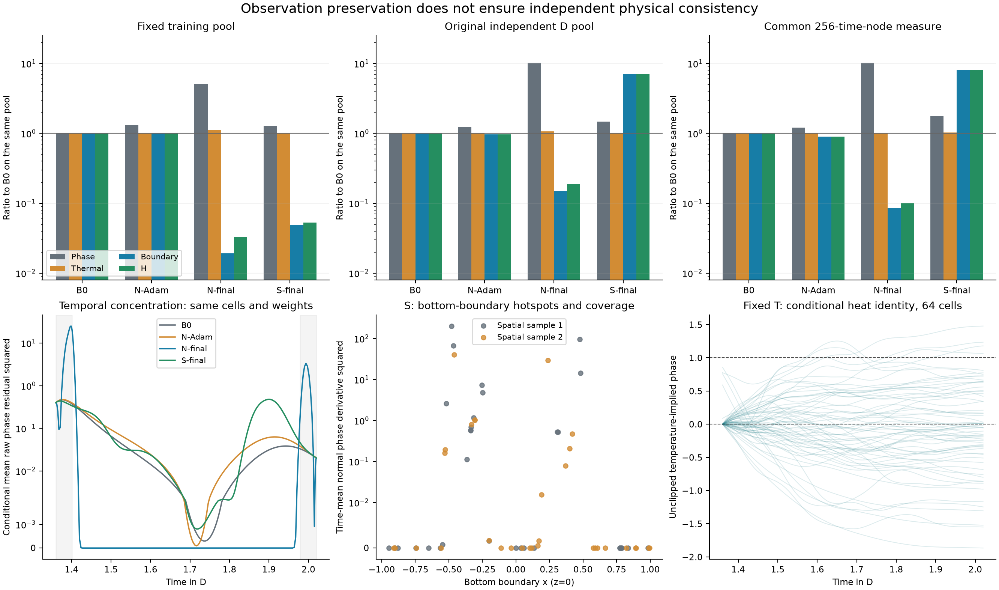

# 物理目标取舍、采样失真与固定温度可行性：定向诊断

任务 `PCM-20260925-PHYSICS-OBJECTIVE-FEASIBILITY-01` 已完成；基线 `51f561023ef7a233ba5639f5e8d22c3e314fe8f2`。**VERIFIED：A目标/资格不一致与B空间采样敏感均得到实际检查点支持；C严格热一致性受固定温度和端值阻断，但原5%热非劣容限下是否可行仍UNKNOWN。** 旧 `NO_COMPLETION_INCREMENT` 不改写，P02正向方法目标和P03完整数组访问均未闭合。

本轮只读B0、N/adam-600、N/final、S/final，G只读现有表；四对象H分解和全部20个原A_w已从实际保存字段复核，与附件转录一致，20项均不通过。没有参数更新、电学求解、参考场读取、三参考重评分或新训练。既有E/F共同修复后的正向器件结果保留原主线。

## 1. 同测度分项与阶段定位

沿用原残差和共享面AD热通量。每个池先归一为D内时间平均：`H=p/75+t/48+5 Bphi`；原BC分母13保留。固定池的实际可变目标另乘 `0.1/bE × 0.264`，不能直接与H数值混用。表中所有候选比较均使用同一行组的测度；池间绝对数值不是收敛证书。

| 同池状态 | 相态平方 | 热平方 | 相态BC | H |
|---|---:|---:|---:|---:|
| fixed-training / B0 | 0.06937691 | 0.01092954 | 0.07081435 | 0.3552245 |
| fixed-training / N-Adam | 0.09164339 | 0.01099586 | 0.06998103 | 0.3513562 |
| fixed-training / N-final | 0.3549889 | 0.01226052 | 0.001356614 | 0.01177168 |
| fixed-training / S-final | 0.088088 | 0.01095724 | 0.003497698 | 0.01889127 |
| independent-D / B0 | 0.1024051 | 0.01077408 | 0.07124481 | 0.3578139 |
| independent-D / N-Adam | 0.1263818 | 0.01087582 | 0.06858579 | 0.3448406 |
| independent-D / N-final | 1.05348 | 0.01156318 | 0.01071622 | 0.06786838 |
| independent-D / S-final | 0.1506273 | 0.01094222 | 0.4981224 | 2.492848 |
| common-256 / B0 | 0.06833754 | 0.01086091 | 0.1175223 | 0.5887487 |
| common-256 / N-Adam | 0.08269052 | 0.01091857 | 0.1051975 | 0.5273176 |
| common-256 / N-final | 0.704951 | 0.01088919 | 0.009958865 | 0.05942053 |
| common-256 / S-final | 0.1207375 | 0.01112604 | 0.9553129 | 4.778406 |
| spatial-256 / B0 | 0.02471776 | 0.0100553 | 0.06025955 | 0.3018368 |
| spatial-256 / N-Adam | 0.03350903 | 0.01008684 | 0.05529862 | 0.27715 |
| spatial-256 / N-final | 0.3320269 | 0.01021188 | 0.01066495 | 0.05796453 |
| spatial-256 / S-final | 0.04524224 | 0.0101052 | 0.1778321 | 0.8899742 |

**VERIFIED：** 固定池B0 objective=0.018661342691621181；N-Adam=0.018458124742232823，精确对应L-BFGS initial_loss；N/S终点也复现原last_accepted_loss。原独立D的三个分项复现旧审计。零修正固定池/独立D的边界H份额分别为99.675%/99.556%，这不是梯度份额。

共同256节点测度下，N-Adam相态平方已是B0的1.210倍，N-final扩大到10.316倍，而H下降89.907%。第二空间样本相应为13.433倍与H下降80.796%。因此目标允许边界收益补偿相态恶化的结论不依赖单个旧审计池；把共同lambda整体调大不会改变分项偏好。保存的Adam日志来自变化中的随机池、且为更新前值，不能当成同池曲线；此处阶段判断来自固定检查点的同池复算。

## 2. 实际N的端层与S的空间热点

**VERIFIED：** 共同测度中N-final的delta_psi最低为-715.727，完整psi最低-732.778；N-Adam的delta仅在[-0.856,0.655]。N-final的max|phi_t|=53.386，B0为3.908。两端合计12.5%的时间支撑承载85.60%的N相态残差平方积分；第二样本为84.13%。峰值单元(x,z)=(0.3125,0.0125)，峰时1.398479，采样半高区间[1.393369,1.404021]包含8个Gauss点。

两端另以64个预声明对数距离、同一128单元检查gate/delta/phi_t，delta在精确端点为零。所测位置没有显示比当前时间求积更窄且未解析的层。**SUPPORTED_INTERPRETATION：** N在Adam后至最终点之间形成了大负logit修正、内部压低相态及端部残差集中；这与构造风险相符，但没有追踪中间权重，不能证明沿常数头方向形成，也不能把构造反例当作实际轨迹的因果证明。

**VERIFIED：** 16小片×8/16点的最大分项变化0.02851%，排序不变，按合同未做512。使用同256节点、另一组空间位置后，S的BC从0.955313变为0.177832，对各自基点分别为8.129/2.951倍；原固定池却仅为0.049倍。其异常几乎全在底边z=0，首组热点x≈−0.479、0.475、−0.466，三点贡献该样本底边积分约91.65%。空间支撑改变确实影响幅度，时间8→16阶变化不能解释这一差异；但未交叉替换原池的时间/空间点，不能把原训练—审计差距全数归因于空间。N相态残差也高度集中于少数近底边单元，不能据128个单元宣称空间收敛。

## 3. 固定温度条件的具体限制

复用原64-cell坐标；原记录只保存积分C和平方量，未保存T坐标导数，故本轮以原共享面算子重新计算必要T导数，未切换算子。phi_H由热方程时间积分得到，原值未裁剪。128→256节点的端点偏差最大变化7.53e-12；256节点热积分恒等式`phi_H(b)-phi_base(b)=-C/L`最大误差7.11e-15，C对历史64阶最大差3e-10。

**VERIFIED：** phi_H在采样节点范围为[-1.866505,1.478231]，时间×单元加权越界份额56.458%，78.125%单元至少有一个越界时刻。端点绝对偏差最小/中位/最大为0.004206/0.460467/1.866535。热平方下界0.0029222645，同单元同时间基础热平方0.0135196557，比例21.615%。这支持固定T下的严格零热残差轨迹不能同时满足原端点及相态范围；不能推出允许5%热非劣时也不可能改善相态。phi_H不是相态PDE解、教师标签或唯一物理解，未重建其空间导数，也未给它相态资格结论。

## 4. 后续决策与一次入稿提议

**SUPPORTED_INTERPRETATION：** 先保留A/B/C并存的诊断，不启动旧N/S救援、不整体提高lambda、不解冻T或扩窗。现有证据还不能决定固定T在原误差容限下是否阻断有效补全，因此本轮不建议直接进入新训练。唯一可另行提请的下一项是温度驱动相态推进诊断：沿原二维网格/材料方程，以B0(a)为初态、T_base为输入，零参考初态替代、零训练；仅作传统诊断，不能作为PINN创新或自动训练标签。具体推进算子、初始边界不相容处理与误差预算须在执行前另行冻结批准。本轮未生成该轨迹。

本轮不提交新训练方案。后续可行性未明确前，不把分项约束、重采样或另一网络名称当作已成立方案；未来若提出训练，仍须另定一个候选、强直接控制、固定预算、原A_w及允许失败的停止条件。通用重采样和约束优化不构成原创；训练中使用的物理验证池也不再是最终独立审计。近期[When PINNs Go Wrong, §2](https://arxiv.org/html/2604.23528v1)已讨论经验残差伪解及重采样/伪时间关系；本轮只核对这一来源边界，没有移植算法或导入其适用性结论。[PhysicsCorrect](https://arxiv.org/html/2507.02227v2)也提供已有物理修正先例，不能凭该名称主张本器件有效。

建议只在现有主稿 `paper/paper_revision_20260921/source/manuscript.md` 的 **§6.3第一段之后** 加入下述一个结果段及本图，替代继续按日期扩展章节；不改写§4 E/F正向结果。精简审阅稿对应“What the experiment identifies”位置。本轮仅提交整合提议，没有重排旧主稿。

> Observation-preserving phase corrections left temperature and electrical-port predictions unchanged, but did not establish qualified phase completion. N reduced set error by 34.21% while increasing phase RMS by 7.95%. In a common 256-node dark-interval diagnostic, its scalar physical objective fell by 89.91% even though the raw phase-residual square increased 10.32-fold: boundary improvement compensated for dynamical deterioration. The spline's boundary penalty was strongly sensitive to spatial coverage, while the tested temporal refinement changed all integrated components by less than 0.029%. The temperature-implied trajectory also violated phase-range and endpoint conditions under exact thermal balance; this does not establish infeasibility under the allowed thermal tolerance. Thus scalar loss reduction cannot replace independent equation-wise consistency, and unchanged ports do not imply accurate internal phase states.

## 5. 执行与复查

真实设备为已开启V100，诊断用时112.589秒；本轮参数更新、电学正/伴随求解、相态推进、参考场读取均为0，未出现科学计算失败。首次本地图件生成因Matplotlib轴属性用法报错，修复后仅重读保存数据，未追加模型计算。四状态坐标工作量与共享面AD计数见[紧凑诊断记录](evidence/physics-objective-diagnostic.json)。完成后校验回收，约4秒后请求关机且确认实例关闭。未提交或推送本轮诊断。

[分项CSV](physics-objective-components.csv)、[图PDF](figures/physics-objective-diagnostic.pdf)与[诊断实现](../../pinn_pcm_sci/phk_v23_physics_objective_diagnostic.py)可直接复查。每时间分项、psi/delta/phi_t/rphi/rT/边界迹线和热隐含轨迹保留于原运行目录的 `diagnostic-20260925/`；没有复制新的权威档案。P03完整模型与数组外部访问仍是实质待办。

2026-09-25 后续发布：用户另行授权提交本轮诊断重要成果，范围与远端核验见[发布记录](../../docs/notes/2026-09-25-physics-objective-diagnostic-release.md)。上文未发布措辞保留诊断收口时点身份。[逐时分项CSV](physics-objective-time-components.csv)、[冻结诊断合同](evidence/diagnostic-contract.json)、[20项原判据复核](evidence/diagnostic-scalar-verification.json)和[时间求积比较](evidence/diagnostic-quadrature.json)纳入精简发布；完整迹线、模型及场数组仍本地保存。
