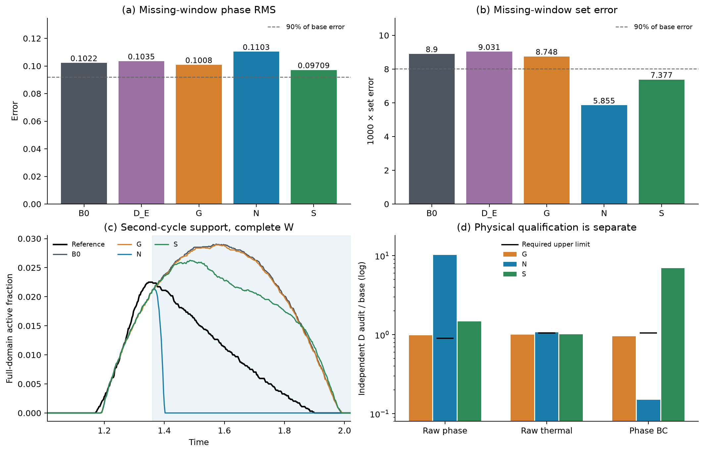

# 观测保持相态补全：完整开发结果

**VERIFIED：NO_COMPLETION_INCREMENT。** 阶段0—3已经完成；三个固定终点数值有效、预算完整，已按原参考和共同160×80读出统一评分。N/G/S均未相对冻结B1 E/29通过原A_w；全部20个有序比较的A_w、全程A和全程B通过数均为0。三个新终点严格双周期通过数为0。一个基础初始化和多个比较不构成独立重复。

**SUPPORTED_INTERPRETATION：**本轮证明了观测预测保持构造可以实现，但没有建立合格的相态补全增量。N对阈值集合的明显改善，伴随连续相态误差恶化和独立物理审计失败，不能作为方法成功。阶段4条件未触发，科研计算到此停止；不自动调参、加种子、扩窗、解冻T或改成传统方法主稿。

## 主比较

| 对象 | W相态RMS | 1000×集合误差 | RMS改善 | 集合改善 | 对B0的A_w |
|---|---:|---:|---:|---:|---|
| B0 | 0.102222679 | 8.899869 | — | — | 基点 |
| D_E | 0.103494545 | 9.030786 | -1.244% | -1.471% | False |
| G | 0.100818353 | 8.748066 | 1.374% | 1.706% | False |
| N | 0.110345550 | 5.855314 | -7.946% | 34.209% | False |
| S | 0.097086397 | 7.377205 | 5.025% | 17.109% | False |

改善为正表示误差下降，负值表示恶化。原A_w同时要求S和Ephi至少改善max(基点的10%,原绝对容差)，并满足原ET/EI/EV非劣。三个新臂对B0的电热非劣均通过；失败不是把观测保持当作新收益，而是相态双指标门未成立。N对历史D_E的集合误差下降35.163%，但相态RMS增加6.620%；对G和S也均未通过原A_w。D_E是已有长预算参照，不是本轮同新增成本终点。F29与B_E的[已有完整历史指标](historical-F-and-BE.csv)保留原身份，未重新训练或评分，也没有用N对它们的比较作为headline。

## 集合改善没有恢复正确连续状态

N的W内未归一化FP由0.0083302734降至0.0003343750，但FN由0.0006585938增至0.0055794922。D内FP由0.0080308594降至0.0000349609，FN由0.0001369141增至0.0050578125。活跃迹线在t=1.4025降至零，而原参考在D内仍活跃至t=1.8975。这是已保存场在原0.5阈值下的描述；没有把断电后无相态写入网络或损失。

**SUPPORTED_INTERPRETATION：**N删除了大量多余活跃支持，也删除了参考中仍存在的真实支持；阈值集合指标因此变小，连续相态RMS却变大。不能用单一集合指标的34.21%改善替代完整相态质量。N在全轨迹0.332004%的保存场点出现浮点sigmoid精确零；没有输出裁剪或从这些零值反求logit。该饱和现象保留为结果，不据此单独断言唯一优化根因。

图中虚线是基点误差的90%，本轮绝对容差更小；它只展示两项主增量阈值，完整电热守门在表中另报。右下为对数轴，黑横线分别为0.90/1.05/1.05的物理资格上限。所有面板都来自同一组固定终点。

## 独立物理资格与全程原审计

| 臂 | D内raw相态平方/基点 | D内raw热平方/基点 | D内相态BC/基点 | 物理资格 |
|---|---:|---:|---:|---|
| G | 0.985791 | 0.999808 | 0.957810 | 未通过 |
| N | 10.287376 | 1.073240 | 0.150414 | 未通过 |
| S | 1.470896 | 1.015605 | 6.991702 | 未通过 |

N相态残差平方增加至基点10.287倍，热残差增加7.324%，虽相态BC下降84.959%，仍不具物理完成资格。S的raw相态平方增加47.090%，相态BC增加599.170%；较低相态RMS和较短耗时都不能补偿其物理失败。G的raw相态平方仅下降1.421%，未到10%要求。

原全程raw审计也完整保留：N的J_phi由0.00170902降至0.00142337，J_T由0.00391773降至0.00390935；S的J_phi升至0.00201370。此处J_phi和J_T分别是(r_phi/5)^2与(r_T/4)^2的原全程采样估计，不能与上表未缩放的D内均值混用。原全程池共32个时间，其中仅5个落在D；新独立D池有64个时间，空间和边界采样也不同。两个池给出不同局部结论，进一步限制了以综合训练/审计loss宣称物理改善的解释。预先指定的独立D守门仍失败；没有通过追加审计或挑选较有利的池改变裁决。这不是连续体收敛证据，也不是唯一失败原因的证明。

## 不变性质与事件

N/S的自身场电学抽查通过，完整T、I/P、V/q与基础数组保持一致，D外相态按恒等映射保持；所有检查和复用出处在[完整结果JSON](evidence/results.json)及run内composition-provenance记录中。这里保持的是已有预测，而非预测等于真值。N/S没有新增电学精度收益。

两个周期的加热支持、onset、recall、precision和相态活动质量均与B0一致。第二周期onset=1.2248、recall=0.77167037、precision=0.85482955，严格门仍失败。相态峰值位置可以改变：N第二周期峰值从t=1.5725移至1.3675，S移至1.485；这不修复加热支持不足。所有对象恢复分数仍为1，不改写为恢复门失败。G与基础预测不同不自动构成数据失败；本轮其W电流/电势误差分别增加2.003%/1.616%，仍在原非劣范围内。N相对G的窗外电势非劣代价标记为true，而相对B0为false；完整比较没有省略这一差别。

## 理论、可行性与资格

原数组必要条件通过：D含92.569%的相态平方误差和90.865%的集合误差；理想相态RMS/集合误差下界为0.02786552/0.000812964。它们是假设D内错误全消失的乐观极限，没有保证可由原PDE和表示实现。真实基点的有限反例证明观测预测和电学输出不变；固定温度/端点的64-cell热残差平方下界为0.00292226，32→64求积C相对变化2.66e−5。详见[方法及信息边界](method-and-information-boundary.md)、[理论图](figures/information-boundary.png)和两张诊断CSV。

十二项训练前聚焦/继承检查、三个零更新profile通过；N/G有限参数干预确实改变物理梯度，N观测梯度为零。G/N/S profile分别8.948/4.176/4.028秒，梯度范数0.066183/0.004942/0.109906，峰值RSS分别约506.84/465.98/486.69 MiB。这些是实现/可区分性证据，不是预测增量。后续设备传播回归另有一项通过，零科学更新。

## 实际执行与成本

| 臂 | 参数 | Adam/完整L-BFGS | CPU训练分钟 | 训练正解/伴随 |
|---|---:|---:|---:|---:|
| G | 1217 | 600/200 | 20.755 | 13031/13031 |
| N | 1217 | 600/200 | 7.630 | 0/0 |
| S | 7749 | 600/200 | 6.171 | 0/0 |

总计1800 Adam、600完整L-BFGS评估，CPU分支训练合计34.557分钟。G/N在末次未接受试探处恢复最后接受态；S在预算内最后接受态结束。三者均完整消耗既定评估上限，没有数值失败或参考早停。训练正解/伴随为13031/13031；N/S均为0/0。独立raw审计64次正解，原生读出282次正解，均0伴随。完整profile已知100/100（含本地首次完成但元数据丢失的G）；局部内存失败尝试的完整工作量未知，未计为零。理论反例6次正解，其余小规模接口检查单列。

**实际偏差：**启动要求CUDA，但训练入口遗漏设备参数，所以三臂实际使用同一Xeon Gold 6130 CPU、4个Torch线程；GPU用于后续审计/原生读出。已执行源码单独归档，现入口已修复并通过针对性回归；本轮没有重启科学轨迹。N/S节省电学工作是可报告事实，但固定步数且质量未过门，不能宣称公平效率优势。两次本地profile工程失败、一次数组评分内存失败和最小恢复见[验证与偏差](validation-and-deviations.md)。后者使用只读磁盘映射及原评分函数，保留B0已完成分数，无新模型/参考计算。

云端结束于2026-09-24 16:34:14 UTC，校验回收后16:35:01 UTC发出关机，约47秒；关机命令返回0，随后SSH拒绝连接。全部新原生数组和检查点已本地保存，公开访问未新增，P03仍未关闭。

## 对论文的实际影响

新贡献可写为模型特定的观测信息边界、固定T下的热约束、真实接口实现及具有直接控制的有界阴性。不能写成新的通用投影理论、神经特有方法优势、合格物理补全、严格事件鲁棒性或材料验证。P02所需正面方法增量仍未补齐；现有全标签E/F器件配置收益与旧八臂阴性保持原身份。参见[入稿短段落](manuscript-revision-blocks.md)、[结构整合位置](integration-guide.md)、[来源](SOURCES.md)及[数据访问](data-and-reproduction.md)。本模块已可复用，但没有将旧完整主稿PDF冒充已完成此次全面排版整合。
