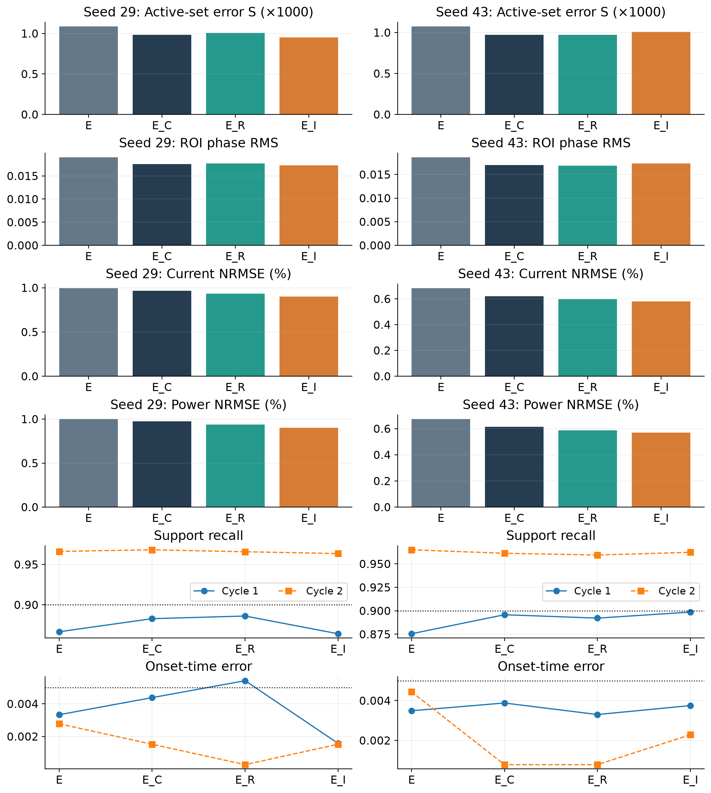
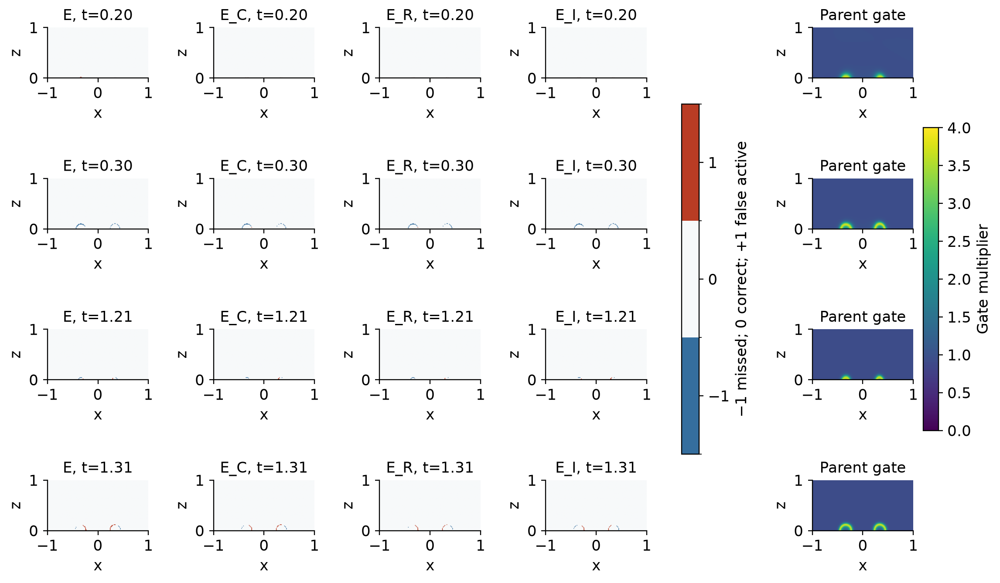

# Supplementary material

## Training-time electrical elimination improves sparse electrothermal phase-change reconstruction beyond post-training electrical repair

This supplement consolidates implementation details, counterfactuals, complete event outcomes, reproducibility and evidence limits. It accompanies a fixed-reference numerical method study. O denotes the original protocol; S denotes the earlier second-pulse protocol. E is the eliminated method, F is the locked soft electrical PINN, and B_E is the shared same-solver interpolant. Unless marked network, electrical outputs are evaluated after the common solve. The historical development states are never pooled with clean initializations 29 and 43.

## S1. Numerical object and data construction

The main text states every physical coefficient and boundary condition. S1.1 below specifies the executed numerical reference algorithm. All quantities are dimensionless. Geometry and the electrothermal phase-feedback motif were inspired by wall-cell modeling; the current single scalar phase, smooth conductivity law and numerical coefficients do not reproduce the multi-material, compositional or switching model of reference [8]. The model is not calibrated to an oxide device, and the physical association cannot be strengthened merely by adding material citations.

The base numerical contract is `configs/phk_v2/object_numerical_contract.json`; its later object overlay is `configs/phk_v21/object_numerical_contract.json`. These files are not interchangeable: the overlay changes coefficients and the original time/pulse specification. The final two-pulse intervention is defined by `configs/phk_v23/lf11_protocol_sprint.json` and the case specification in `paper/paper_v32/evidence/case-and-budget.json`. Reproduction must apply the overlay and explicit finite pulse starts, not infer a periodic third pulse from a legacy period field.

The initial phase is analytic. The support mask is fixed before observing the new case's fields: each axis selects indices 0,4,8,… and the last index without duplicate endpoints. Spatial cell-center coordinates therefore need not lie on physical boundaries. The support trajectory has 80 × 40 cells; the fixed-reference trajectory has 160 × 80. Support output is sampled every 0.005 time units before the sparse time mask, giving sparse spacing 0.02 with the terminal point included. Reference output spacing is 0.0025. The final observation mask is 21 × 11 × 126, including 231 analytic initial positions and 28,875 positive-time locations. All three fields are observed at those locations. This is sparse relative to the full space-time trajectory, not evidence for an experimentally minimal sensor arrangement.

Support and reference trajectories use the inherited coupled block and logit-Newton numerical algorithms without output clipping or case replacement. The new support/reference generation required 1000/4000 main steps. Internal linear solves totaled 14,476/46,027, respectively. These are different counters and are not represented as 5000 identical-cost solves. Generator summaries reside under `paper/paper_v32/evidence/reference-generation/`. Matching-resolution prefixes before the intervention agree to roundoff, with maximum recorded field difference 7.22 × 10⁻¹⁵. This checks the finite-pulse implementation; it does not prove continuum convergence.

### S1.1 Reference time integration and nonlinear solution

The carrier and both references use cell-centered finite volumes and backward Euler in time. Let D_h be the phase no-flux Laplacian and D_Th the thermal Laplacian with the stated top Dirichlet and remaining Robin boundaries. At an accepted time step, the discrete equations include

$$\phi^{n+1}-\phi^n-\Delta t M(T^{n+1})[\epsilon^2D_h\phi^{n+1}-W_\phi(\phi^{n+1},T^{n+1})]=0. \quad (S1)$$

$$[(1+\gamma\Delta t)I-\alpha\Delta t D_{Th}]T^{n+1}=T^n-L(\phi^{n+1}-\phi^n)+\Delta t Qq^{n+1}. \quad (S2)$$

Starting from the previous accepted T and phase, each block evaluates conductivity, solves the electrical system at U(t_n+1), solves the phase equation with the current temperature iterate, and solves the linear thermal equation with that phase increment and electrical heat. Unit block relaxation is used. When the maximum scaled T/phase iterate change is at most 1e-8, the electrical field is recomputed from the new state and both final step-equation residuals must have infinity norm at most 1e-9. Otherwise iteration continues, up to 30 blocks. The thermal matrix is constant for a given grid and step, allowing one factorization per trajectory.

The phase subproblem uses Newton in the full logit variable with an analytic phase Jacobian followed by its sigmoid chain factor. Its infinity-norm step residual tolerance is 1e-10, with at most 30 Newton iterations. A trial logit step starts at one and is halved until the residual strictly decreases, down to 2^-20. Failure stops the trajectory. Outputs are not clipped and algorithms or time steps are not changed in response to event quality. These are algebraic tolerances for the implemented step equations; they are not bounds on continuum or learned-state error.

The implementation is specified by PhkV21OracleCase.solve in phk_v21_benchmark.py and _solve_logit_newton in phk_v21_solver.py, using the frozen object overlay. The new finite waveform and reference wrappers change the prescribed case and discretization only. The reference phase Laplacian is a grid operator, whereas training uses coordinate AD for phase and midpoint cell/face quadrature for heat. Shared electrical conductances help align that coupling interface but do not make the whole neural residual identical to the reference discretization. Halving dt tests one temporal perturbation of this numerical family; it neither supplies an independent solver nor establishes spatial convergence.

## S2. Exact learning interfaces

### S2.1 Architecture and admissible outputs

Each field starts with an independent 64-wide, four-hidden-layer modified MLP using smooth tanh transformations. The gated combination of two input feature projections follows the architectural construction in Wang et al. [2]; the project implements its own modules and does not claim that architecture as original. E freezes the potential head; F jointly trains it with the temperature, phase and adapter parameters.

The temperature adapter adds to the temperature latent a 32-wide, two-hidden-layer modified MLP with 21 inputs: three normalized coordinates and sine/cosine pairs at nine fixed frequency vectors. The vectors are (0.5,0,0), (1,0,0), (2,0,0), (0,0.5,0), (0,1,0), (0,0,0.5), (0,0,1), (0,0,2), (0,0,4); angles are 2π times the coordinate-frequency product. Its output weights and bias are zero at initialization. The adapter is present in every clean parent and both branches. There is no matched ablation establishing an independent adapter contribution.

Coordinates supplied to every head are (x, 2z-1, 2t/2.5-1), mapping the physical domain to [-1,1]^3. Derivatives in the residuals are with respect to physical x,z,t, including this chain rule. Main equations (8)-(9) preserve the analytic initial temperature and phase, phase bounds and top thermal value. The temperature upper envelope is a representation constraint, not an experimental temperature limit. The soft potential transform preserves 0 ≤ V ≤ U and the top electrode exactly, but does not hard-enforce the grounded heater. Known electric boundary values enter its finite-volume residual. No extra potential fitting gate is imposed on the clean parents.

### S2.2 Observation measure and logit target

Let p_i be normalized sparse spatial dual-volume times trapezoidal-time weights. Potential and temperature use this global measure, not an uncorrected interface-oversampled mean. The phase target is the complete initial-logit increment

$$d_i=\operatorname{logit}(\phi_i^{\rm obs})-\operatorname{logit}(\phi_0(x_i,z_i)). \qquad (S3)$$

Logits use ε_logit = 10⁻⁸ for numerical clipping of their input only. The base-model increment is δ_θ = 8a(t)h_φ and is not divided by startup a(t). For the new heads, the same interface includes R_ξ or normalized gR_ξ in h_φ, so the observation and PDE paths both use the composed phase. With d_scale = 36.84136146790473,

$$L_{\rm obs}=(L_V+L_T+L_\phi)/3, \qquad (S4a)$$

$$L_V=\sum_i p_i((V_i-V_i^{\rm obs})/0.72)^2,\qquad L_T=\sum_i p_i((T_i-T_i^{\rm obs})/0.45)^2, \quad (S4b)$$

$$L_\phi=\sum_i p_i^\phi((\delta_i-d_i)/d_{\rm scale})^2. \qquad (S4c)$$

The phase measure averages two normalized measures with equal weight: the positive-time global measure and endpoints of visible space-time cells whose corner phase values straddle 0.5. Duplicate vertices accumulate their proper weights. If there are no such endpoints, it falls back to the global phase measure. This uses only observed values. No dense interface pool, teacher derivative, reference event ranking or reference current is supplied. Initial analytic data are counted separately and shared by all methods.

Adam samples four observation times from the half-global/half-phase temporal marginal proposal and applies its inverse-probability correction, including all visible spatial points at a sampled time. Fixed full-objective L-BFGS evaluates all observation groups with their original weights. The observations are already used for fitting and development; later subdivision of them would not constitute unseen validation.

### S2.3 Cell operators, boundaries and scales

Training uses the common 80 × 40 electrical grid, harmonic face conductances, half-cell electrode resistances and fractional heater overlap. The same forward factorization is reused only for its associated adjoint. The first-order VJP includes the dependence of both A and f on conductivity, as well as direct Joule derivatives. No thermal or phase trajectory is solved inside the network. CPU sparse factorization may be connected to GPU field evaluation without detaching the physical gradient.

The numerical source obeys the half-resistance deposition formula in the main text. In particular, an interface with unequal resistances deposits unequal shares. Electric face dissipation includes electrode contributions. A grounded, balanced electrical solution gives total deposited power equal to terminal input. For an arbitrary soft potential, total deposition still equals the face dissipation sum, but terminal equality need not hold. These statements are algebraic identities or electrical balance conditions, not separate learned-accuracy tests.

For each physical time, sampled cells obtain midpoint T and φ, their time derivatives, shared-face AD temperature gradients and the original phase Laplacian. Boundary gradients use the network's own values. With b_T = T on the top and b_T = ∂ₙT + 0.25T elsewhere,

$$L_{\rm BC}=\frac{1}{13}\sum_{s\in\{l,r,b,t\}}\left[\operatorname{mean}_s(b_T^2)+\operatorname{mean}_s((\partial_n\phi)^2)\right]. \quad (S5)$$

$$L_{\rm IC}=\frac{1}{3}\left[\operatorname{mean}(T_0^2)+\operatorname{mean}(((\phi-\phi_0)/0.03)^2)\right]. \quad (S6)$$

The historical denominators 13 and 3 are retained. Five omitted electric boundary subterms contribute zero; deleting them from the denominator would change the other terms' weights. All paired branches use the same definition. The electric, thermal and phase residual scales are 1, 4 and 5. The thermal/phase average retains divisor 3 despite containing two terms. No dynamic reweighting, autonomous energy-decay regularizer or adaptive rescue is introduced.

At the common fitted parent, a = L_obs,E is computed using the eliminated potential, and b = J_Tφ,E + 5L_BC + L_IC uses a fixed calibration pool. Both are floored at 10⁻¹² and shared within that pair. They are not recomputed separately for F. Thus a can differ from the full observation loss measured with the parent's original voltage head. Actual clean-parent fitting errors and scales are shown below; these are visible-data errors, not validation errors.

Table S1. Clean parent quality and shared calibration. O/S identify protocols; a and b are the actual eliminated-parent scales.

| Case | Seed | Visible V / 0.72 (%) | Visible T / 0.45 (%) | a | b |
| --- | --- | --- | --- | --- | --- |
| O | 29 | 0.719889197 | 0.880380601 | 8.87621934e-05 | 0.467422111 |
| O | 43 | 1.06900324 | 0.877331139 | 0.000109200158 | 0.609241029 |
| S | 29 | 0.876705703 | 0.991722822 | 9.04666501e-05 | 0.427835437 |
| S | 43 | 1.34065664 | 0.979305193 | 8.73396772e-05 | 0.522223303 |

### S2.4 Sampling, optimization and comparator selection

The original physical windows are [0,0.35], [0.35,1.25], [1.25,1.60], [1.60,2.5], with target masses 0.14, 0.36, 0.14, 0.36. The earlier-pulse windows are [0,0.35], [0.35,1.01], [1.01,1.36], [1.36,2.5], with masses 0.14, 0.264, 0.14, 0.456. The masses sum to one and correspond to duration divided by 2.5. Adam takes one physical time per window and 128 sampled cells. Fixed calibration, L-BFGS and independent audit pools each have eight times per window, with separate seeds. The fixed L-BFGS target retains the same 128-cell spatial sampling; the F_full control alone replaces its electrical mean by the full 3200-cell volume mean. It retains the original random draws for the other terms.

Clean parents use 2400 Adam updates and 600 complete evaluations, split into 200 per field head. Branches use learning rate 10⁻⁴, Adam β₁/β₂ = 0.9/0.999, ε = 10⁻⁸ and gradient clipping at 10 during Adam. The weight schedule is λ(k) = 0.1 min(k/200,1). Each branch has 1500 updates followed by 300 complete L-BFGS evaluations. L-BFGS uses learning rate 1, history 50, strong-Wolfe search, gradient tolerance 10⁻¹⁰ and change tolerance 10⁻¹⁴. All trial/repeated closures count. Interrupting a line search restores the last accepted parameters and optimizer state. The closure sees a fixed complete target and uses the true gradient without clipping.

In the historical F_bal control, η is frozen from one parent gradient comparison: the root-sum-square norms of weighted observation, BC/IC, thermal and phase blocks divided by the electric block norm. All F parameters participate. This is a finite strengthening of the comparator, not a proposed adaptive algorithm. F_raw with η = 1 was locked for clean confirmation after the development controls; it is not claimed to be the globally optimal soft PINN. Seed 17 development states use a different training history and are not pooled with the fresh seeds.

### S2.5 Same-solver interpolation

B_E obtains T and phase from the existing B_logit rule: temporal PCHIP at visible spatial nodes; linear interpolation in space; phase interpolation in the full initial-logit increment, followed by restoring analytic φ₀ and applying the sigmoid. Known analytic initial conditions are restored exactly. Boundary extensions use nearest visible values, the analytic top temperature and the inherited Robin extrapolation. They are not new field observations. The interpolated V is discarded: the common electrical solve computes V and q from the interpolated T and φ. Earlier waveform/contact changes concerned only the discarded V interpolant and do not alter B_E. No teacher current, derivative or fine-grid field enters this baseline.

## S3. Metrics, frozen decisions and claim levels

All time integrals use global trapezoidal weights. Spatial means use cell volumes; uniform Cartesian cell volumes give the implemented cell mean. Raw phase RMS and normalized temperature RMS use the ROI; S and potential RMS use the full domain. Current and power NRMSE divide the time RMS error by the time RMS of the reference, with a 10⁻¹² denominator floor. Integrated energy error divides the absolute signed integral error by absolute reference energy. The mean local q error, when reported, is normalized by the full-domain space-time RMS of reference q. Numerical balance residuals are not interchangeable with that q error.

For candidate c and comparator b, the retained reconstruction advantage A requires b−c ≥ max(0.1b,τ) for both S and raw E_φ. Its noninferiority checks require c ≤ b + max(0.05b,τ) for E_T, E_I and E_V. Device advantage B requires the same gain rule for bottom-current and power NRMSE, with noninferiority for S, E_φ, E_T, E_V and top-current E_I. Absolute tolerances are 10⁻⁸ for S, 10⁻⁶ for E_φ/E_T/E_I and 10⁻⁷ for E_V; the extra device-normalized tolerance is 10⁻⁶. These rules define practical matched increments, not significance or equivalence tests. S/phase guards in the device rule and temperature/current/potential guards in the reconstruction rule are preserved without post hoc relaxation.

The original clean A/B outcomes are: seed 29 E versus projected F, pass/pass; seed 43, fail/pass (S gain insufficient). Against B_E, seed 29 passes both and seed 43 fails both (phase gain and current/power gains insufficient). The earlier-pulse E states pass both rules against both controls. Reverse comparisons are retained in the original adjudication CSVs. The earlier seed-43 S margin is 0.9 × 0.001197734375 − 0.001073515625 = 0.0000044453125. No reference-perturbation conclusion follows from its positive sign.

The strict endpoint criteria additionally require legal fields; maximum phase ≥ 0.9; a detected onset in each cycle; cycle peak ROI active fraction ≥ 0.02; peak full-domain/outside-ROI fractions ≤ 0.45/0.10; and recovery ≥ 0.70, defined as (peak fraction − end fraction)/(peak fraction − pre-cycle fraction). Both cycles must satisfy recall ≥ 0.9, precision ≥ 0.8, mass ratio between 0.8 and 1.2, and onset error ≤ 0.005. The original cycles end at 1.25 and 2.5. The earlier cycles end at 1.01 and 2.02; the tail to 2.5 is not silently added to second-cycle recovery. Support overlap integrates the two heating windows using the original global time weights restricted to each window.

There are two physical protocols, two initialization values and four paired comparisons. Grid points, saved times, multiple output metrics and reused B_E values are not independent experimental replicates. We report each effect without confidence intervals or claims of population success probability. Threshold failure is not a proof of zero effect; a favorable direction is not automatically a frozen advantage.

## S4. Necessary development counterfactuals

Table S2. Development counterfactuals: electrical repair, the strong D_E control and the full-spatial/gradient-balanced soft alternatives. “Network” means the model's unsolved V; “projected” applies the common solve without changing T or phase. Device current in this consolidated table is the bottom-current error; using top current for an electrically unbalanced model would produce a different result. All entries are development states with a common historical parent, not extra clean seeds.

| Method | S | Phase RMS | Current (%) | Power (%) | Energy (%) |
| --- | --- | --- | --- | --- | --- |
| E0 | 0.00112851563 | 0.0234146837 | 2.55490439 | 2.64146359 | 1.23561814 |
| D_E | 0.00078703125 | 0.0155821211 | 0.724256918 | 0.721322841 | 0.288198505 |
| P_E | 0.0008190625 | 0.0159996773 | 0.693818679 | 0.681730628 | 0.218830694 |
| B_E | 0.0014084375 | 0.0237697822 | 1.72822894 | 1.7562293 | 1.184941 |
| F_raw/network | 0.000858203125 | 0.0166913896 | 279.3 | 20.1181324 | 19.2658977 |
| F_raw/projected | 0.000858203125 | 0.0166913896 | 1.07111197 | 1.06512066 | 0.249371223 |
| F_full/network | 0.000905078125 | 0.0172242878 | 38.7535687 | 6.61059161 | 6.51455473 |
| F_full/projected | 0.000905078125 | 0.0172242878 | 1.18664464 | 1.19018446 | 0.03617151 |
| F_bal/projected | 0.000862890625 | 0.0171664543 | 1.60777035 | 1.65053011 | 0.677478353 |

The earlier fixed-state D_I-to-E0 replacement held T/phase and conductivity fixed and repaired severe electrical readout errors; its underlying record is in `paper/paper_v28/evidence/evaluation/results.json` together with the V27 comparator evidence. The main figures instead use directly paired F network/projected readouts, which more directly establish the relevant post-training-repair counterfactual. These are compatible but distinct controls. Potential volume accuracy alone is not a certificate for electrode flux accuracy.

Table S3. Remaining-PDE-strength counterfactual. D_C continues the control objective; P1 adds the original remaining PDE term; P_kappa adds it with κ = 92.84049, fixed from a complete-gradient norm ratio of 0.1077% at the shared parent. The original gradient calculation included the T/phase → conductivity → potential → heating chain. The scalar strengthened a measurable optimization effect, but did not establish the required predictive increment. Each state used 223 complete evaluations, with zero new Adam updates in that campaign; it is not comparable to a fresh 1500-update branch as an additional initialization.

| Method | S | Phase RMS | Current (%) | Power (%) | Local q NRMSE (%) |
| --- | --- | --- | --- | --- | --- |
| D_C | 0.000781953125 | 0.0143587127 | 0.725526014 | 0.719509624 | 3.99023375 |
| P1 | 0.0007725 | 0.0142650985 | 0.729715416 | 0.725088576 | 3.95942824 |
| P_kappa | 0.00077140625 | 0.014253669 | 0.761998387 | 0.760610227 | 4.04053167 |

P1 and P_kappa improve raw phase error over D_C by approximately 0.65% and 0.73%, respectively. The stronger remaining-PDE term reduces the thermal-dominated residual but pays a current/power cost. Its second-cycle timing remains above 0.005. These controls prevent the manuscript from attributing the main advantage to an independently demonstrated necessity of the remaining residuals. They do not establish universal uselessness of thermal or phase physics, nor do they justify changing an old failed decision.

The full-grid soft control tests spatial integration/coverage at the existing physical times. It does not equalize the temporal constraint set with E, remove the finite penalty, equalize initial V, or isolate an adjoint pathway. No additional stop-gradient, hard-lift or voltage-pretraining control is implied by the present evidence. The claim is restricted to the implemented method package and tested comparators.

## S5. Complete event and pulse-history evidence

The following three tables partition the complete saved event record into readable groups without selecting favorable cycles. They include the shared baseline once per case. F denotes F/projected; phase events are identical for its network and projected readouts. For these historical tables using the original references, first-onset time is 0.2406 in both cases; S9 reports the refined-reference onsets separately. Reference second onsets are 1.4984 (O) and 1.2268 (S). All listed phases exhibit the two onsets; no case was replaced after observing its event status.

Table S4. Timing and support quality for every method/cycle. Neither timing nor recall replaces the other in the project-defined strict event requirements.

| Case | Seed | Method | Cycle | Onset | Onset error | Recall | Precision | Mass ratio |
| --- | --- | --- | --- | --- | --- | --- | --- | --- |
| O | 29 | E | 1 | 0.234533333 | 0.00606666667 | 0.883731411 | 0.922172584 | 0.958314556 |
| O | 29 | E | 2 | 1.49196667 | 0.00643333333 | 0.983316733 | 0.892530229 | 1.10171813 |
| O | 29 | F | 1 | 0.2312 | 0.0094 | 0.838778729 | 0.908924429 | 0.922825597 |
| O | 29 | F | 2 | 1.5026375 | 0.0042375 | 0.90562749 | 0.909591097 | 0.99564243 |
| O | -- | B_E | 1 | 0.255871429 | 0.0152714286 | 0.792924741 | 0.98792813 | 0.80261379 |
| O | -- | B_E | 2 | 1.51337143 | 0.0149714286 | 0.772161355 | 0.993432645 | 0.777265936 |
| S | 29 | E | 1 | 0.237266667 | 0.00333333333 | 0.86660658 | 0.96403058 | 0.898940964 |
| S | 29 | E | 2 | 1.224025 | 0.002775 | 0.966148059 | 0.890341894 | 1.08514276 |
| S | 29 | F | 1 | 0.223933333 | 0.0166666667 | 0.833370888 | 0.859117305 | 0.970031546 |
| S | 29 | F | 2 | 1.2276375 | 0.0008375 | 0.959394768 | 0.883144476 | 1.08633955 |
| S | -- | B_E | 1 | 0.255871429 | 0.0152714286 | 0.792924741 | 0.98792813 | 0.80261379 |
| S | -- | B_E | 2 | 1.2481 | 0.0213 | 0.774320397 | 0.995603429 | 0.777739785 |
| O | 43 | E | 1 | 0.22922 | 0.01138 | 0.802726453 | 0.887629251 | 0.904348806 |
| O | 43 | E | 2 | 1.4931 | 0.0053 | 0.984063745 | 0.883128492 | 1.11429283 |
| O | 43 | F | 1 | 0.201525 | 0.039075 | 0.840581343 | 0.762182041 | 1.10286165 |
| O | 43 | F | 2 | 1.5048 | 0.0064 | 0.890189243 | 0.926285788 | 0.961030876 |
| S | 43 | E | 1 | 0.23711 | 0.00349 | 0.875506985 | 0.947105424 | 0.924402884 |
| S | 43 | E | 2 | 1.22236 | 0.00444 | 0.964951274 | 0.895304569 | 1.07779108 |
| S | 43 | F | 1 | 0.210366667 | 0.0302333333 | 0.873704371 | 0.806133056 | 1.08382154 |
| S | 43 | F | 2 | 1.24922 | 0.02242 | 0.813728843 | 0.952852853 | 0.853992135 |

Table S5. Threshold fractions and recovery. A recovery fraction of one means no remaining above-threshold active fraction, not φ = 0 or T = 0.

| Case | Seed | Method | Cycle | Pre ROI | Peak ROI | Peak full | Peak outside | Recovery |
| --- | --- | --- | --- | --- | --- | --- | --- | --- |
| O | 29 | E | 1 | 0 | 0.069731405 | 0.02109375 | 0 | 1 |
| O | 29 | E | 2 | 0 | 0.0676652893 | 0.02046875 | 0 | 1 |
| O | 29 | F | 1 | 0 | 0.0661157025 | 0.02 | 0 | 1 |
| O | 29 | F | 2 | 0 | 0.0674070248 | 0.020390625 | 0 | 1 |
| O | -- | B_E | 1 | 0 | 0.0596590909 | 0.018046875 | 0 | 1 |
| O | -- | B_E | 2 | 0 | 0.0537190083 | 0.01625 | 0 | 1 |
| S | 29 | E | 1 | 0 | 0.0671487603 | 0.0203125 | 0 | 1 |
| S | 29 | E | 2 | 0 | 0.0779958678 | 0.02359375 | 0 | 1 |
| S | 29 | F | 1 | 0 | 0.0609504132 | 0.0184375 | 0 | 1 |
| S | 29 | F | 2 | 0 | 0.0800619835 | 0.02421875 | 0 | 1 |
| S | -- | B_E | 1 | 0 | 0.0596590909 | 0.018046875 | 0 | 1 |
| S | -- | B_E | 2 | 0 | 0.0643078512 | 0.019453125 | 0 | 1 |
| O | 43 | E | 1 | 0 | 0.0612086777 | 0.018515625 | 0 | 1 |
| O | 43 | E | 2 | 0 | 0.0707644628 | 0.02140625 | 0 | 1 |
| O | 43 | F | 1 | 0 | 0.0578512397 | 0.0175 | 0 | 1 |
| O | 43 | F | 2 | 0 | 0.069214876 | 0.0209375 | 0 | 1 |
| S | 43 | E | 1 | 0 | 0.0699896694 | 0.021171875 | 0 | 1 |
| S | 43 | E | 2 | 0 | 0.0790289256 | 0.02390625 | 0 | 1 |
| S | 43 | F | 1 | 0 | 0.0632747934 | 0.019140625 | 0 | 1 |
| S | 43 | F | 2 | 0 | 0.0777376033 | 0.023515625 | 0 | 1 |

Table S6. Integrated support masses. These are space-time measures, not independent sample counts. Recall is overlap/reference mass; precision is overlap/predicted mass.

| Case | Seed | Method | Cycle | Reference mass | Predicted mass | Overlap mass |
| --- | --- | --- | --- | --- | --- | --- |
| O | 29 | E | 1 | 0.0006934375 | 0.00066453125 | 0.0006128125 |
| O | 29 | E | 2 | 0.0006275 | 0.000691328125 | 0.00061703125 |
| O | 29 | F | 1 | 0.0006934375 | 0.000639921875 | 0.000581640625 |
| O | 29 | F | 2 | 0.0006275 | 0.000624765625 | 0.00056828125 |
| O | -- | B_E | 1 | 0.0006934375 | 0.0005565625 | 0.00054984375 |
| O | -- | B_E | 2 | 0.0006275 | 0.000487734375 | 0.00048453125 |
| S | 29 | E | 1 | 0.0006934375 | 0.000623359375 | 0.0006009375 |
| S | 29 | E | 2 | 0.00091390625 | 0.00099171875 | 0.00088296875 |
| S | 29 | F | 1 | 0.0006934375 | 0.00067265625 | 0.000577890625 |
| S | 29 | F | 2 | 0.00091390625 | 0.0009928125 | 0.000876796875 |
| S | -- | B_E | 1 | 0.0006934375 | 0.0005565625 | 0.00054984375 |
| S | -- | B_E | 2 | 0.00091390625 | 0.00071078125 | 0.00070765625 |
| O | 43 | E | 1 | 0.0006934375 | 0.000627109375 | 0.000556640625 |
| O | 43 | E | 2 | 0.0006275 | 0.00069921875 | 0.0006175 |
| O | 43 | F | 1 | 0.0006934375 | 0.000764765625 | 0.000582890625 |
| O | 43 | F | 2 | 0.0006275 | 0.000603046875 | 0.00055859375 |
| S | 43 | E | 1 | 0.0006934375 | 0.000641015625 | 0.000607109375 |
| S | 43 | E | 2 | 0.00091390625 | 0.000985 | 0.000881875 |
| S | 43 | F | 1 | 0.0006934375 | 0.0007515625 | 0.000605859375 |
| S | 43 | F | 2 | 0.00091390625 | 0.00078046875 | 0.000743671875 |

None of the eight historical learned endpoints in Tables S4-S6 passes every strict criterion under the original references. The later gated endpoint and its reference-specific result are reported separately in S10-S11. In particular, the earlier-pulse E timing criteria pass but its first-cycle recall values are 0.866607 and 0.875507. On the original case, seed 43 E first-cycle recall is lower than F. Earlier-pulse F29 has better second-cycle timing and a slightly better prediction of the cross-protocol latency change. E has greater tail-phase RMS in both new pairs, and slightly worse second-cycle temperature error in seed 43. Complete later-window state and device values remain in `tables/second-cycle.csv`.

Table S7. Reference state immediately before each second pulse. Maxima and means use the specified ROI.

| State | Original mean | Earlier mean | Original maximum | Earlier maximum |
| --- | --- | --- | --- | --- |
| temperature | 0.00652461267 | 0.0187461243 | 0.00789871133 | 0.0229086059 |
| phase | 0.000482908856 | 0.00397246303 | 0.0205550094 | 0.191788374 |

Table S8. Report-only second-onset latency change, calculated from saved event times. The reference shortening is 0.0316. This analysis introduces no training, selection rule or additional pass criterion.

| Seed | Method | Original latency | Earlier latency | Shortening | Absolute shift error |
| --- | --- | --- | --- | --- | --- |
| 29 | E | 0.241966667 | 0.214025 | 0.0279416667 | 0.00365833333 |
| 29 | F | 0.2526375 | 0.2176375 | 0.035 | 0.0034 |
| 43 | E | 0.2431 | 0.21236 | 0.03074 | 0.00086 |
| 43 | F | 0.2548 | 0.23922 | 0.01558 | 0.01602 |
| baseline | B_E | 0.263371429 | 0.2381 | 0.0252714286 | 0.00632857143 |

The state differences and the generator prefix agreement support a history-dependent response within the numerical equations. They do not separate thermal and phase mediation, and separately trained offline predictors need not coincide on the shared physical prefix. B_E is one deterministic reconstruction per case, even where it is displayed beside both seeds.

Table S9. Per-pulse power and energy for the earlier-pulse case. Absolute signed integral and integral of absolute power error are distinct; the latter cannot cancel in time. Units are dimensionless, except the normalized percentage column.

| Role | Cycle | Power error (%) | Signed energy error | Abs. signed integral | Integral abs. power error |
| --- | --- | --- | --- | --- | --- |
| B_E | 1 | 1.71615019 | -0.00250732788 | 0.00250732788 | 0.0025077821 |
| B_E | 2 | 2.32253005 | -0.00402130047 | 0.00402130047 | 0.00402130047 |
| 29/E/projected | 1 | 1.30413581 | 0.00133420155 | 0.00133420155 | 0.00207001575 |
| 29/E/projected | 2 | 0.573139599 | -8.73294418e-05 | 8.73294418e-05 | 0.00090832181 |
| 29/F_raw/projected | 1 | 3.00312494 | 0.00418795806 | 0.00418795806 | 0.00489585308 |
| 29/F_raw/projected | 2 | 1.43205227 | -0.00112450252 | 0.00112450252 | 0.00231461441 |
| 43/E/projected | 1 | 0.886860848 | 0.00070988837 | 0.00070988837 | 0.00142824131 |
| 43/E/projected | 2 | 0.365884604 | -4.44735931e-06 | 4.44735931e-06 | 0.000621460215 |
| 43/F_raw/projected | 1 | 3.5564028 | 0.00511673951 | 0.00511673951 | 0.00562608652 |
| 43/F_raw/projected | 2 | 2.57794959 | -0.00400098578 | 0.00400098578 | 0.00400098578 |

These signed results explain how a low total energy error can coexist with a larger trajectory error. For electrically projected states, current and power also share the identity P = UI, so they are different weighted views of related error rather than independent replications. Neither terminal balance nor total deposition ensures accurate local Joule density. The saved local-q NRMSE and balance diagnostics are retained in `tables/new-protocol-all-readouts.csv` without reinterpreting algebraic consistency as another empirical success.

## S6. Actual work and reproducibility scope

Each clean protocol uses two common parents and four branches, giving 10,800 Adam updates and 2400 complete objective/gradient evaluations. For the original clean branches, electrical forward/adjoint counts are 19,612/19,612 for seed 29 E and 19,560/19,560 for seed 43 E. F performs no electrical linear solve in training; it still evaluates and differentiates the full explicit face operator and neural potential. The original accepted branch L-BFGS steps are 145/147 (E/F, seed 29) and 144/146 (seed 43). These counters do not equate costs across methods.

Table S10. New-protocol actual counters and predeclared caps. Calibration and projected inference are separate from training. New-protocol aggregate accepted L-BFGS steps, including parents, total 1173.

| counter | actual | cap |
| --- | --- | --- |
| adam | 10800 | 10800 |
| complete_evaluations | 2400 | 2400 |
| E_forward | 39186 | 54000 |
| E_adjoint | 39186 | 54000 |
| calibration_forward | 100 | 1000 |
| calibration_adjoint | 0 | 1000 |
| inference_forward | 1390 | 1390 |

The 1390 projected inference solves are five roles times 278 nonzero-drive times: four neural states and one shared B_E. All 1001 times are still evaluated; zero-drive electrical outputs use their analytic values. Sparse direct solves and adjoints can reuse a single forward factorization for a common state, not across changed parameters. The published environment is Python 3.11, FP64, Torch 2.5.1 and SciPy 1.14.1. Network and sparse-solve placement may use different devices with a complete custom first-order VJP. No wall-time or acceleration conclusion is drawn from the work counters.

The original manuscript-only sprint read saved evidence and performed no new scientific execution. This revision is a separately authorized scientific experiment described in S9-S10, with six new coupled PINN endpoints and two new references. All GPU outputs were recovered and the current instance was shut down before local reference scoring. Stress was not read. Figures are regenerated with NumPy/Matplotlib, while the manuscript PDF is typeset with the available ReportLab runtime. PDF generation does not execute the research modules.

## S7. Reproduction and source map

### S7.1 Rebuild the historical figures from saved evidence

From the repository root, run the project Python on `paper/paper_submission/build_analysis.py`. It reads the versioned V28-V32 tables and the V32 saved power traces; it writes deduplicated result/event tables, report-only latency arithmetic and six figure sources. It does not import any scientific model or evaluator. The exact input-to-figure mapping is `analysis-provenance.json`.

Next run `paper/paper_submission/prepare_document.py` with the same project Python. It expands table/reference includes into complete readable Markdown and renders display equations. Run `paper/paper_submission/build_pdf.py` with the bundled Python that has ReportLab. The README gives the actual local commands. The generated `manuscript.md` and `supplement.md` contain the resolved scientific text and all tables; editable templates are in `source/`. Bibliographic entries are supplied in both human-readable and BibTeX form.

The original manuscript-only snapshot is preserved. That earlier package was a local writing product, not a retroactive replacement for their manuscripts, judgments or endpoint identities. Figures 2-3 use the development table; Figure 4 uses four clean pairs; Figure 5 uses the saved event/reference/power data; Figure 6 retains adverse event and energy outcomes. Copies of broad historical run logs are unnecessary to rebuild those figures.

For this revision, build_revision_analysis.py consumes the completed portable scoring results; update_manuscript.py integrates those results into the complete sources, and prepare_document.py/build_pdf.py rebuild the final documents. The revision README gives the commands. The old snapshot and its numerical values are preserved.

### S7.2 Reproduce the historical numerical experiments separately

A full numerical reproduction requires a separate execution and complete trajectory generation; the manuscript build is not that reproduction. The fixed repository commit is `ea29be9a9d33497b075873bcdc7673df43db7221` on `codex/v32-research-results`. Curated evidence preserves the endpoint states, configurations, quadrature pools, selected traces/snapshots and result records. Full support/reference fields and full own-field predictions remain in local `outputs/runs/20260915-lf11-protocol-history`; they are not all present in the public selected-results package. The corresponding original clean records are under `paper/paper_v31/evidence/confirmation/seed-29` and `seed-43`.

The numerical sequence is: reconstruct the specified finite case and inherited numerical contracts; generate support/reference trajectories; export the predeclared sparse mask; fit a fresh common parent for each seed; calibrate once; run the locked E/F branches with fixed caps; preserve final accepted states; perform the predeclared common projections; then score against the reference and render the saved results. Evaluation never selects an intermediate state. Full numerical reproduction should retain the published caps and information boundary and use a separate empty run directory, not overwrite accepted evidence.

| Component | Authoritative implementation or evidence |
| --- | --- |
| Electrical matrix, VJP, local Joule allocation | `pinn_pcm_sci/phk_v23_lf11_electric_layer.py` |
| Shared T/phase fields and cell residuals | `pinn_pcm_sci/phk_v23_lf11_elimination_physics.py` |
| Eliminated training and calibration | `pinn_pcm_sci/phk_v23_lf11_elimination.py` |
| Soft training and gradient-balanced control | `pinn_pcm_sci/phk_v23_lf11_training_coupling.py` |
| Full electrical spatial reduction | `pinn_pcm_sci/phk_v23_lf11_fullgrid.py` |
| Fresh initialization/common fits | `pinn_pcm_sci/phk_v23_lf11_clean_confirmation.py` |
| Finite new protocol and its evaluator | `pinn_pcm_sci/phk_v23_lf11_protocol.py`; `phk_v23_lf11_protocol_evaluate.py` |
| Formal field/event metrics | `pinn_pcm_sci/phk_v23_lf11_evaluation.py` |
| Functional comparison and local heating scores | `pinn_pcm_sci/phk_v23_lf11_elimination_evaluate.py` |
| Shared sparse interpolation | `pinn_pcm_sci/phk_v23_lf11_readout.py` |
| Saved original clean endpoints and scores | `paper/paper_v31/evidence/confirmation/` |
| Saved earlier-pulse endpoints and scores | `paper/paper_v32/evidence/` |

Historical executed source snapshots, not subsequently edited working files, determine the exact runtime behavior. V31 contains `runtime-sources` and `runtime-sources-stage-B`; V32 contains `runtime-sources` and `deployed-files.json`. Its `metadata-clarification.json` explains inherited unused template fields, including the old source identifier and effective per-seed role settings. Descriptive leftovers do not change the actual executed recipe. The file map above is a navigation aid; the preserved runtime snapshots resolve any later source drift.

### S7.3 Literature verification and reuse boundaries

The bibliography was checked selectively for claims that define this paper's contribution. Solver-in-the-Loop [3], hybrid FEM-NN [4] and modular implicit differentiation [5] were read in author-hosted full text, including the solver-coupling/root interfaces. They establish methodological precedents, not evidence for the present experiment. The source difference is partial quasi-static elimination for reconstruction with a common post-training projection control. No priority for solver coupling, adjoints or PDE-constrained optimization is asserted.

The modified-MLP equations in [2] and the control-volume loss in [6] were checked in full text. The former supplies architectural attribution; the latter is a neighboring integrated-residual formulation, not a source of entropy or convergence guarantees for this implementation. The device source [8] was checked in full text for geometry and electrothermal/phase feedback, including the materially richer model and parameter provenance. Its wall-cell idea does not turn the current synthetic coefficients into a calibration.

For [1] and [9], the accessible author preprint records support the general PINN and Adam roles. For [10], the author publication page supplies the L-BFGS reference. For [7], publisher metadata and abstract were accessible; a full-text derivation was not claimed as newly read. The present phase equation is specified explicitly by the project contract, not represented as an exact reproduction of that source. Publisher DOI pages for [4] and [6] did not load reliably; author full text and its bibliographic metadata were used instead. No quotation or source figure is reproduced. Source links in the References are direct primary-source URLs. No external code or asset is imported into the manuscript build, and the project source/attribution records retain responsibility for any earlier implementation provenance.

## S8. Claim-to-evidence matrix

The labels below distinguish executed evidence from interpretation. VERIFIED means saved numerical evidence or an implementation identity checked against source, with the array-only reproduction in this revision identified separately from the original training and the six new continuations.

| Statement | Status | Supporting evidence | Limit on the claim |
| --- | --- | --- | --- |
| Electrical projection can greatly repair device readouts at a fixed soft T/phase state | VERIFIED | Network/projected pairs; main Figure 2 | Does not improve phase or prove correct local q |
| The defined E package retains device advantages after the same projection | VERIFIED | Four clean E/F pairs; main Table 2 and Figure 4 | Two protocols and two seeds; specified finite soft recipes |
| Full-spatial electrical integration does not eliminate the development advantage | VERIFIED | Historical F_full; Figure 3 | Existing time sets, finite penalty and initial-V differences remain |
| The gain cannot be explained solely by withholding a final electrical solve from F | SUPPORTED_INTERPRETATION | Common solve for both learned states | Does not isolate a single training-gradient mechanism |
| The earlier-pulse case preserves paired phase and function gains against F and B_E | VERIFIED | Both new A/B outcomes and named metrics | Case-specific refitting, not zero-shot or formal OOD |
| Threshold recovery may coexist with continuous residual state and changed latency | VERIFIED | Reference history and event tables | The intervention does not separate T and phase mediation |
| Remaining thermal/phase PDE terms are independently necessary for the benefit | UNKNOWN | Strong D_E and negative matched residual-strength controls | Presence of residuals is not proof of their necessity |
| Complete implicit differentiation alone causes the observed improvement | UNKNOWN | No isolated VJP counterfactual | The evidence compares method packages |
| The eight historical states meet the strict two-cycle requirements | Not supported; failures VERIFIED | All eight learned endpoints; Tables S4-S6 | Earlier-pulse first-cycle recall remains below 0.9 |
| Phase/event/function metrics uniformly rank E first | Contradicted by VERIFIED counterexamples | F29 latency, tail phase, original energy, F_full energy | Report each outcome rather than a universal ranking |
| The narrow S threshold remains stable under refined references | VERIFIED for the tested reference pair | Historical margin 4.4453125 × 10⁻⁶; actual new margin in S9 | Updated by the executed time-reference comparison in S9; not a spatial convergence result |
| The gated head has a reference-stable independent increment | Not established | No A/B increment under either reference; a strict increment only for seed 43 under the refined reference | The reference-specific strict contrast is VERIFIED; it is not stable across both references or clean-seed confirmation |
| Historical device advantages survive the tested time-step refinement | VERIFIED in 4/4 paired comparisons | Fixed arrays, both reference trajectories; main Figure 7 | Does not establish spatial convergence |
| Performance transfers to experimental oxide devices or arbitrary geometry | UNKNOWN | No calibrated material or cross-geometry evidence | Current object is a synthetic dimensionless wall cell |
| The model replaces or accelerates a traditional coupled solver | UNKNOWN | No fair solver-efficiency experiment | Known equations can be solved without interior observations |

## S9. Executed reference sensitivity and portable array reproduction

The fixed-model temporal refinement was executed on 16 September 2026. The 17 September review changes presentation and documentation only. Both references use 160 by 80 cells, time step 0.0003125, saving every eight steps and 8000 main steps. Original references and all original decisions remain separate. The actual algorithms, tolerances and no-clipping policy are unchanged. A descriptive metadata clarification corrects inherited window/reference labels; the executing trajectories used the correct pulse starts and step sizes, and the full 8001-point drive is unchanged by that correction. No reference trajectory is rerun for this documentation correction.

With fixed historical predictions, the device criterion against the projected soft control passes in 4/4 pairs under the original references and 4/4 under the refined references. The changed historical A/B decisions are: none across eight comparisons (four E/soft and four E/interpolant), or sixteen A/B decisions per reference. A changed gate limits that specific threshold claim; a retained direction or gate supports only the tested temporal perturbation. Full errors, each reference denominator and fixed-old-denominator diagnostics are retained in the scoring records. The original reference discrepancy is δ_S = 1.6875e-05 and ROI phase RMS δ = 0.00039034515. The shorter reference discrepancy is δ_S = 1.671875e-05 and ROI phase RMS δ = 0.00032183192. The historically narrow seed-43 S margin changes from 4.4453125e-06 to 7.9921875e-06. The sufficient triangle-bound condition alone cannot certify this narrow margin; its retention follows from actual rescoring of these two references, not from a continuum argument.

Table S11. Reference event changes, including both cycles and protocols.

| Protocol | Cycle | Old onset | Refined onset | Shift | Old recovery | Refined recovery |
| --- | --- | --- | --- | --- | --- | --- |
| original | 1 | 0.2406 | 0.24143333 | 0.00083333333 | 1 | 1 |
| original | 2 | 1.4984 | 1.49965 | 0.00125 | 1 | 1 |
| shorter | 1 | 0.2406 | 0.24143333 | 0.00083333333 | 1 | 1 |
| shorter | 2 | 1.2268 | 1.2268 | 0 | 1 | 1 |

The principal original/refined metrics and event measures for all sixteen objects are in tables/all-fixed-metrics.csv and tables/all-fixed-events.csv. The paired-effect-sizes.csv table separately reports each compared error, signed difference, percentage-point difference where the error is normalized, and relative error reduction; it distinguishes continuation from matched representation and historical method comparisons. The all-strict-failures.csv table names each failed original requirement, including any peak-phase failure. The complete portable results.json additionally retains all cycle peak/locality fields, validity checks and event-failure lists; the compact printed tables do not replace those records. The reference-margins table includes the same-norm triangle bounds; the JSON records distinguish reference-specific and fixed-original normalization. Old bottom-current scoring against the reference top current is preserved, while bottom-native errors are also supplied. A changed reference onset, event correspondence or threshold flag is a numerical sensitivity result, not retraining or a new physical event in a fixed predictor.

The local portable archive contains all scoring arrays and serialized geometry/ROI/rules. Python isolated mode runs portable/rescore.py in a clean extracted directory with NumPy only. It imports neither Torch nor SciPy, does not load checkpoints and performs zero linear solves. Its kernels preserve the original definitions; numerical metrics are compared at relative tolerance 2e-10 and absolute tolerance 2e-12, while categorical decisions must agree exactly. This tolerance concerns reproducibility arithmetic, not relaxed scientific effect gates.

The archive also supplies portable/reproduce_network.py as a separate opt-in entry. Its prepare action stages only the existing parent states, sparse observations and known-physics sources. Train repeats the specified six continuations; infer regenerates one selected fixed endpoint. Neither is invoked by the scoring or figure commands. Historical clean-parent retraining is a further, separate reproduction level.

## S10. Phase-head experiment, actual cost and complete outcomes

Neither added head satisfies a predefined phase, device or strict increment against E_C in either parent under the original reference. The additional equal-parameter gate criterion is met in neither parent under the original reference and in 43 under the refined reference. A result in only one parent or under only one reference is a bounded development signal. It is not a clean initialization confirmation or a reason to pool different categories across seeds. No independent gate contribution is established under the original reference. The gate is retained as a tested counterfactual rather than added to the main contribution list. The absence of an original-reference increment limits the proposed representation-efficiency explanation without proving that phase representation never matters. The reference-specific strict result is examined separately below.

All six arms together used 3600 Adam updates, 600 complete fixed-target evaluations, 41076 training forward solves and 41076 adjoint solves, followed by 1668 fine-grid projection solves. These quantities are not assumed to have equal unit cost. Trainable counts are 29827 for E_C and 31044 for E_R/E_I; each residual adds 1217. Total stored model counts, including the unused frozen V head, are 43140, 44357 and 57670, respectively. E_I additionally stores and evaluates 13313 frozen parent-phase parameters and differentiates that gate with respect to coordinates through second spatial derivatives. Its RMS amplitude normalization does not cancel this extra cost or match all gradients. No runtime acceleration claim is made.

Table S12. Actual matched work. Accepted L-BFGS steps and objective/gradient evaluation counts are different quantities.

| Seed | Role | Adam | Full evaluations | Accepted LBFGS | Forward | Adjoint | Inference | Trainable parameters |
| --- | --- | --- | --- | --- | --- | --- | --- | --- |
| 29 | E_C | 600 | 100 | 47 | 6875 | 6875 | 278 | 29827 |
| 29 | E_R | 600 | 100 | 49 | 6875 | 6875 | 278 | 31044 |
| 29 | E_I | 600 | 100 | 48 | 6875 | 6875 | 278 | 31044 |
| 43 | E_C | 600 | 100 | 49 | 6817 | 6817 | 278 | 29827 |
| 43 | E_R | 600 | 100 | 49 | 6817 | 6817 | 278 | 31044 |
| 43 | E_I | 600 | 100 | 49 | 6817 | 6817 | 278 | 31044 |

Table S13. All short-gap parent/control/candidate and soft metrics under both references. Percentages are normalized RMS errors times 100.

| Reference | Seed | Role | S | Raw phase RMS | T % | Current % | Power % | Strict |
| --- | --- | --- | --- | --- | --- | --- | --- | --- |
| old | 29 | E | 0.0010861719 | 0.019002414 | 1.1021723 | 0.99429746 | 0.99933206 | no |
| old | 29 | E_C | 0.00098476562 | 0.017548834 | 1.0410377 | 0.96672191 | 0.97418212 | no |
| old | 29 | E_R | 0.00100875 | 0.017719898 | 1.0450506 | 0.93276081 | 0.93924572 | no |
| old | 29 | E_I | 0.00095210938 | 0.017272375 | 1.0451443 | 0.9017787 | 0.9007672 | no |
| old | 29 | F | 0.00126125 | 0.023818465 | 1.1691428 | 2.269914 | 2.3353161 | no |
| old | 43 | E | 0.0010735156 | 0.018619222 | 1.096098 | 0.68211888 | 0.67275846 | no |
| old | 43 | E_C | 0.00097375 | 0.016963543 | 1.0396806 | 0.62091583 | 0.6143627 | no |
| old | 43 | E_R | 0.00097398438 | 0.016859812 | 1.04556 | 0.5984257 | 0.58712395 | no |
| old | 43 | E_I | 0.0010064844 | 0.017309214 | 1.0500863 | 0.58004588 | 0.56991184 | no |
| old | 43 | F | 0.0011977344 | 0.023363224 | 1.1408822 | 2.9917346 | 3.0946863 | no |
| old | shared | B_E | 0.0015754688 | 0.02552353 | 1.2800189 | 2.0031856 | 2.0489387 | no |
| refined | 29 | E | 0.0010822656 | 0.018985544 | 1.1058679 | 1.0094377 | 1.0169127 | no |
| refined | 29 | E_C | 0.00098132812 | 0.017533514 | 1.0455552 | 0.9866781 | 0.99687377 | no |
| refined | 29 | E_R | 0.001005625 | 0.017700935 | 1.0498836 | 0.95152538 | 0.96068693 | no |
| refined | 29 | E_I | 0.00094820313 | 0.017250773 | 1.0500858 | 0.91993676 | 0.92194902 | no |
| refined | 29 | F | 0.0012585938 | 0.023830202 | 1.17457 | 2.2846583 | 2.3513727 | no |
| refined | 43 | E | 0.0010675781 | 0.018581117 | 1.0990276 | 0.6955075 | 0.68915988 | no |
| refined | 43 | E_C | 0.00096859375 | 0.016923133 | 1.04291 | 0.63478854 | 0.63130008 | no |
| refined | 43 | E_R | 0.00096898438 | 0.016816503 | 1.0487309 | 0.609389 | 0.60118232 | no |
| refined | 43 | E_I | 0.0010008594 | 0.017264731 | 1.0536352 | 0.59206389 | 0.5850366 | yes |
| refined | 43 | F | 0.0011950781 | 0.023336176 | 1.1446279 | 2.999655 | 3.1035747 | no |
| refined | shared | B_E | 0.0015745312 | 0.025504229 | 1.2917748 | 1.9691426 | 2.0142087 | no |

Table S14. All new-development support, timing, recovery and support masses. FN/FP masses are reporting diagnostics derived from fixed arrays.

| Reference | Seed | Role | Cycle | Recall | Precision | Mass ratio | Timing | Recovery | FN mass | FP mass |
| --- | --- | --- | --- | --- | --- | --- | --- | --- | --- | --- |
| old | 29 | E | 1 | 0.86660658 | 0.96403058 | 0.89894096 | 0.0033333333 | 1 | 9.25e-05 | 2.2421875e-05 |
| old | 29 | E | 2 | 0.96614806 | 0.89034189 | 1.0851428 | 0.002775 | 1 | 3.09375e-05 | 0.00010875 |
| old | 29 | E_C | 1 | 0.8828301 | 0.95560976 | 0.92383957 | 0.00438 | 1 | 8.125e-05 | 2.84375e-05 |
| old | 29 | E_C | 2 | 0.96811421 | 0.91315917 | 1.0601812 | 0.001525 | 1 | 2.9140625e-05 | 8.4140625e-05 |
| old | 29 | E_R | 1 | 0.88609734 | 0.95240978 | 0.93037404 | 0.0054166667 | 1 | 7.8984375e-05 | 3.0703125e-05 |
| old | 29 | E_R | 2 | 0.96572064 | 0.91274138 | 1.0580441 | 0.000275 | 1 | 3.1328125e-05 | 8.4375e-05 |
| old | 29 | E_I | 1 | 0.86412799 | 0.96782334 | 0.89285714 | 0.001575 | 1 | 9.421875e-05 | 1.9921875e-05 |
| old | 29 | E_I | 2 | 0.96349803 | 0.91240994 | 1.0559925 | 0.001525 | 1 | 3.3359375e-05 | 8.453125e-05 |
| old | 29 | F | 1 | 0.83337089 | 0.85911731 | 0.97003155 | 0.016666667 | 1 | 0.00011554687 | 9.4765625e-05 |
| old | 29 | F | 2 | 0.95939477 | 0.88314448 | 1.0863395 | 0.0008375 | 1 | 3.7109375e-05 | 0.00011601563 |
| old | 43 | E | 1 | 0.87550699 | 0.94710542 | 0.92440288 | 0.00349 | 1 | 8.6328125e-05 | 3.390625e-05 |
| old | 43 | E | 2 | 0.96495127 | 0.89530457 | 1.0777911 | 0.00444 | 1 | 3.203125e-05 | 0.000103125 |
| old | 43 | E_C | 1 | 0.89578639 | 0.94486037 | 0.94806219 | 0.00388 | 1 | 7.2265625e-05 | 3.625e-05 |
| old | 43 | E_C | 2 | 0.96127543 | 0.92346226 | 1.0409472 | 0.00078333333 | 1 | 3.5390625e-05 | 7.28125e-05 |
| old | 43 | E_R | 1 | 0.89218116 | 0.94986206 | 0.93927445 | 0.0033 | 1 | 7.4765625e-05 | 3.265625e-05 |
| old | 43 | E_R | 2 | 0.95939477 | 0.92423619 | 1.0380407 | 0.00078333333 | 1 | 3.7109375e-05 | 7.1875e-05 |
| old | 43 | E_I | 1 | 0.89860297 | 0.94491174 | 0.95099144 | 0.00375 | 1 | 7.03125e-05 | 3.6328125e-05 |
| old | 43 | E_I | 2 | 0.96230125 | 0.91766528 | 1.0486408 | 0.0022875 | 1 | 3.4453125e-05 | 7.890625e-05 |
| old | 43 | F | 1 | 0.87370437 | 0.80613306 | 1.0838215 | 0.030233333 | 1 | 8.7578125e-05 | 0.00014570313 |
| old | 43 | F | 2 | 0.81372884 | 0.95285285 | 0.85399214 | 0.02242 | 1 | 0.00017023437 | 3.6796875e-05 |
| old | shared | B_E | 1 | 0.79292474 | 0.98792813 | 0.80261379 | 0.015271429 | 1 | 0.00014359375 | 6.71875e-06 |
| old | shared | B_E | 2 | 0.7743204 | 0.99560343 | 0.77773978 | 0.0213 | 1 | 0.00020625 | 3.125e-06 |
| refined | 29 | E | 1 | 0.86998413 | 0.96189999 | 0.90444344 | 0.0041666667 | 1 | 8.9609375e-05 | 2.375e-05 |
| refined | 29 | E | 2 | 0.96660959 | 0.88939657 | 1.0868151 | 0.002775 | 1 | 3.046875e-05 | 0.0001096875 |
| refined | 29 | E_C | 1 | 0.88562684 | 0.95280488 | 0.92949445 | 0.0052133333 | 1 | 7.8828125e-05 | 3.0234375e-05 |
| refined | 29 | E_C | 2 | 0.96875 | 0.91235285 | 1.0618151 | 0.001525 | 1 | 2.8515625e-05 | 8.4921875e-05 |
| refined | 29 | E_R | 1 | 0.88902743 | 0.9497457 | 0.93606892 | 0.00625 | 1 | 7.6484375e-05 | 3.2421875e-05 |
| refined | 29 | E_R | 2 | 0.96626712 | 0.91185263 | 1.0596747 | 0.000275 | 1 | 3.078125e-05 | 8.5234375e-05 |
| refined | 29 | E_I | 1 | 0.86726366 | 0.96542587 | 0.89832238 | 0.0024083333 | 1 | 9.1484375e-05 | 2.140625e-05 |
| refined | 29 | E_I | 2 | 0.96429795 | 0.91176232 | 1.0576199 | 0.001525 | 1 | 3.2578125e-05 | 8.515625e-05 |
| refined | 29 | F | 1 | 0.83586488 | 0.85644599 | 0.97596917 | 0.0175 | 1 | 0.000113125 | 9.65625e-05 |
| refined | 29 | F | 2 | 0.95958904 | 0.88196412 | 1.0880137 | 0.0008375 | 1 | 3.6875e-05 | 0.0001171875 |
| refined | 43 | E | 1 | 0.87916572 | 0.94527727 | 0.93006121 | 0.0043233333 | 1 | 8.328125e-05 | 3.5078125e-05 |
| refined | 43 | E | 2 | 0.96549658 | 0.89443211 | 1.0794521 | 0.00444 | 1 | 3.1484375e-05 | 0.00010398437 |
| refined | 43 | E_C | 1 | 0.89934255 | 0.94284017 | 0.95386534 | 0.0047133333 | 1 | 6.9375e-05 | 3.7578125e-05 |
| refined | 43 | E_C | 2 | 0.96181507 | 0.92255892 | 1.0425514 | 0.00078333333 | 1 | 3.484375e-05 | 7.3671875e-05 |
| refined | 43 | E_R | 1 | 0.89571526 | 0.94782296 | 0.9450238 | 0.0041333333 | 1 | 7.1875e-05 | 3.3984375e-05 |
| refined | 43 | E_R | 2 | 0.95993151 | 0.92333031 | 1.0396404 | 0.00078333333 | 1 | 3.65625e-05 | 7.2734375e-05 |
| refined | 43 | E_I | 1 | 0.90206302 | 0.94277929 | 0.95681251 | 0.0045833333 | 1 | 6.75e-05 | 3.7734375e-05 |
| refined | 43 | E_I | 2 | 0.96284247 | 0.91676857 | 1.0502568 | 0.0022875 | 1 | 3.390625e-05 | 7.9765625e-05 |
| refined | 43 | F | 1 | 0.87553843 | 0.8029106 | 1.0904557 | 0.031066667 | 1 | 8.578125e-05 | 0.000148125 |
| refined | 43 | F | 2 | 0.81438356 | 0.95215215 | 0.85530822 | 0.02242 | 1 | 0.000169375 | 3.734375e-05 |
| refined | shared | B_E | 1 | 0.79743822 | 0.98750702 | 0.80752664 | 0.014438095 | 1 | 0.00013960937 | 6.953125e-06 |
| refined | shared | B_E | 2 | 0.7755137 | 0.99560343 | 0.77893836 | 0.0213 | 1 | 0.00020484375 | 3.125e-06 |

Table S15. Potential, bottom current, energy and local Joule deposition for the same objects. A smaller integrated-energy error may coexist with a larger power-trajectory error; local q is a spatially resolved error, not an algebraic conservation check.

| Reference | Seed | Role | Potential RMS | Bottom current % | Energy % | Local q % |
| --- | --- | --- | --- | --- | --- | --- |
| old | 29 | E | 0.0015681013 | 0.99429746 | 0.28760609 | 5.6357928 |
| old | 29 | E_C | 0.0015099139 | 0.96672191 | 0.48376873 | 5.5306388 |
| old | 29 | E_R | 0.0014395095 | 0.93276081 | 0.41467967 | 5.3998695 |
| old | 29 | E_I | 0.001414133 | 0.9017787 | 0.41833162 | 5.3116797 |
| old | 29 | F | 0.0037235135 | 2.269914 | 0.70662666 | 11.271435 |
| old | 43 | E | 0.0010802508 | 0.68211888 | 0.1627179 | 4.7708746 |
| old | 43 | E_C | 0.00097894285 | 0.62091583 | 0.15108145 | 4.7725314 |
| old | 43 | E_R | 0.00095524034 | 0.5984257 | 0.112844 | 4.8449455 |
| old | 43 | E_I | 0.00092181517 | 0.58004588 | 0.096770376 | 4.6651332 |
| old | 43 | F | 0.0045852642 | 2.9917346 | 0.25736042 | 14.365657 |
| old | shared | B_E | 0.0030056633 | 2.0031856 | 1.505931 | 11.338498 |
| refined | 29 | E | 0.0015882427 | 1.0094377 | 0.3164229 | 5.6504923 |
| refined | 29 | E_C | 0.0015365967 | 0.9866781 | 0.51264191 | 5.5688712 |
| refined | 29 | E_R | 0.0014647872 | 0.95152538 | 0.443533 | 5.4353302 |
| refined | 29 | E_I | 0.0014383973 | 0.91993676 | 0.447186 | 5.3371875 |
| refined | 29 | F | 0.0037412292 | 2.2846583 | 0.73556388 | 11.304663 |
| refined | 43 | E | 0.0010965398 | 0.6955075 | 0.19149883 | 4.7835537 |
| refined | 43 | E_C | 0.00099671711 | 0.63478854 | 0.17985904 | 4.7921355 |
| refined | 43 | E_R | 0.00096899213 | 0.609389 | 0.1416106 | 4.8562527 |
| refined | 43 | E_I | 0.00093720626 | 0.59206389 | 0.12553236 | 4.6799957 |
| refined | 43 | F | 0.0045952748 | 2.999655 | 0.28616855 | 14.397306 |
| refined | shared | B_E | 0.0029573789 | 1.9691426 | 1.4776295 | 11.229127 |

Figure S1. Same complete-domain times, colors and normalization as Figure S3. The gate depends only on the frozen parent, never on reference error. Complete time traces accompany the portable scores; no favorable crop or time was selected from dense truth.

## S11. Updated evidence limits

Strict two-cycle success holds for 0 of the sixteen objects under the original references and 1 under the refined references. Original-reference successes: none. Refined-reference successes: shorter/43/E_I. Historical and newly developed objects are not pooled to estimate a success probability, and a reference-induced status change is not new model capability.

Seed 29, E_R: original-reference increment = none; refined-reference increment = none.

Seed 29, E_I: original-reference increment = none; refined-reference increment = none.

Seed 43, E_R: original-reference increment = none; refined-reference increment = none.

Seed 43, E_I: original-reference increment = none; refined-reference increment = strict.

## S12. Limited material mapping and remaining validation

The application inspiration is the coupled wall-cell PCM model of Miquel et al. [8]. Its material is Ge-rich GST, not an oxide. The mapping below identifies shared modeling roles and concrete omissions; it does not transfer its calibrated parameters into this synthetic calculation. The evidence label for the present physical coefficients remains a frozen numerical design, not experimental validation.

| Component | Present numerical object | Source relationship and missing evidence |
| --- | --- | --- |
| State variables | Reduced T and one bounded scalar phase φ | [8] couples multiple phases and composition. Our φ is not a calibrated crystallinity, metallic fraction or chemical population. |
| Geometry and boundaries | Two-dimensional wall cell, top electrode, grounded partial bottom, Robin cooling | [8] supplies device-model motivation; dimensional dimensions, contact resistances, material interfaces and packaging are not identified here. |
| Conductivity | Smooth exp[0.25T + log(8)φ²(3-2φ)] | The feedback role is shared; this formula and its coefficients are synthetic. Measured phase/temperature-dependent transport is absent. |
| Heat and latent contribution | Fixed reduced diffusivity, cooling and latent ratio 0.05 | A quantitative device claim requires mutually consistent heat capacity, conductivity, latent heat and boundary calibration. None is inferred from the present fits. |
| Phase kinetics | A scalar nonconserved temperature-driven phase equation | It omits multi-phase nucleation/composition and oxide electronic/structural order parameters. Theoretical isothermal VO2 switching [14] is a counterexample to assigning every oxide transition solely to our Joule-heating route. |
| Validation quantities | Synthetic current, power, local heating and phase events | Experimental switching trajectories, optical/structural phase observations and material parameters would require independent validation. Algebraic current balance does not provide it. |

Kaltenbacher [13] treats reduced and all-at-once formulations in inverse problems; that is useful context for eliminating a state variable, not a convergence theorem for this neural representation. PINN-Proj [12] enforces specified integral constraints by projection, whereas the present electrical layer solves a local quasi-static boundary problem coupled to T and φ. Neither source makes elimination or differentiable constraints novel in themselves. PDE-CL [15] and hPINN [16] further delimit the constraint-learning precedents. They were not run as additional baselines. The contribution rests on the explicitly defined interface and matched reconstruction evidence.

The remaining thermal/phase-residual necessity experiment is deliberately deferred. Adding an interface head, if effective, would not answer that separate ablation. Likewise, the current temporal-reference exercise cannot certify geometry transfer, material calibration, or arbitrary pulse generalization.

## S13. Complete phase-head formulation and visual evidence

### S13.1 Phase representation and attribution

The main elimination study leaves incomplete first-cycle support recall despite accurate electrical readouts. We test the hypothesis that a limited phase parameterization contributes to this mismatch. The hypothesis does not establish sigmoid saturation as its cause, nor imply that adding parameters must help. The two final earlier-pulse E states are used as separate parents. This is subsequent development on two already trained states, not another pair of clean initialization confirmations.

An unchanged continuation, E_C, is compared with an ordinary residual head, E_R, and a parent-interface-modulated residual head, E_I. These identifiers denote methods; the current error in the evaluation equation is a separate functional quantity. Let the original complete logit be ell_θ = logit(φ₀) + 8a(t)h_φ,θ. The residual R_ξ takes the original normalized coordinates as input and uses a 3-32-32-1 tanh MLP with 1217 trainable parameters. The output weight and bias are initially zero. E_R and E_I use identical initial residual tensors, with seeds 916029 and 916043 for the two parents. Their complete initial fields exactly equal those of E_C.

For E_I, a frozen copy of the parent's complete phase function defines

$$g=0.25+0.75\,[4\phi_{\rm parent}(1-\phi_{\rm parent})],\quad c_g=\sqrt{\mathbb E_\rho[g^2]},\quad \hat g=g/c_g. \qquad (S7)$$

The positive floor leaves a correction path outside the parent's predicted interface, including possible missed regions. The scalar c_g is calculated once using the parent's original unlabeled calibration quadrature; it equals 0.2693107755 and 0.2705578194 for seeds 29 and 43. It controls an RMS amplitude, not every gradient norm or the effective optimizer step. The outputs are

$$\phi_R=\operatorname{sigmoid}(\ell_\theta+8aR_\xi),\quad \phi_I=\operatorname{sigmoid}(\ell_\theta+8a\hat gR_\xi). \qquad (S8)$$

Only the gate's parameters are frozen. Its coordinate derivatives, including second spatial derivatives, remain in the phase residual. The two added residuals have equal trainable counts, but E_I has extra frozen parameters and extra function/coordinate-derivative evaluations; it is not equal to E_R in total model storage or work. No logit is recovered by inverting an already saturated phase prediction. One composed phase interface is used by the observation increment, conductivity, electrical solve, Joule deposition, thermal and phase equations, boundaries, initial conditions and inference. Thus the comparison changes representation while preserving the actual coupled PINN objective.

Residual parameterizations have established precedents [11], and gated mixing is already present in the modified-MLP background [2]. The present residual head is neither the original ResNet architecture nor a claim to invent gating. E_C-to-E_R assesses added capacity and its optimization effects. E_R-to-E_I assesses the particular frozen-gate parameterization, including its coordinate-derivative cost. A gain over E_C alone cannot establish an independent gate benefit.

### S13.2 Complete continuation and scoring protocol

For each earlier-pulse seed, all three continuation arms open the existing T/phase parameters and temperature adapter; E_R and E_I additionally open their residual parameters. The unused V head remains frozen. The original seed's a,b, observation measures, thermal/phase scales 4/5 and denominators 3/13 are unchanged. Lambda is fixed at 0.1 from the first update. Each arm receives 600 fresh-Adam updates at learning rate 0.0001 followed by at most 100 complete fixed-target L-BFGS evaluations. The six-arm ceiling is 3600 updates and 600 evaluations. All three arms share the same seed-specific observation and physical sampling streams. No arm is rescued using reference results.

The endpoint is the fixed-budget final accepted state or the optimizer's intrinsic stopping state. All line-search trials are counted and rejected trial states are rolled back. Electrical solve limits are 11400 forward and 11400 adjoint solves per arm. Complete evaluation uses all 126 observation times and the original 32 physical times; at most 34 observation times have nonzero drive. The six new projected predictions require at most 1668 electrical solves. Actual work, extra gate evaluation and coordinate differentiation are reported in Supplement S10.

A representation increment requires the original phase or device criterion against E_C and the corresponding noninferiority to the original E: temperature, top-current and potential errors for the phase criterion; S, phase, temperature, potential and top-current errors for the device criterion. Additional checks of all errors against the parent are reported separately, not added as new eligibility gates. Separately, a first complete strict two-cycle success may be reported when S, phase, temperature, potential, current and power errors remain within the original noninferiority limits against both controls; this does not retroactively pass a failed A/B criterion. Gate independence additionally requires the same kind of gain against E_R, which has the same trainable parameter count. Mixed seed outcomes remain a development signal, not a stable confirmation. The old projected soft models and B_E remain in the tables.

The old soft models do not receive this extra continuation budget. Their rows remain useful reference points, but a new head versus an old F is not an equal-budget network ablation. The new representation attribution comes from E_C/E_R/E_I, whereas the original clean E/F experiment retains its own matched budget and identity.

The independent scoring package contains all fixed arrays and serialized metric definitions. Its evaluator uses only NumPy: it does not load a neural checkpoint or execute a linear solver. It first reproduces the ten historical objects' saved metrics, events and decisions, then evaluates the six new objects and the refined references. Figure rebuilding, array-only rescoring and retraining are separate operations. No local archive is represented as a public dataset or assigned an invented identifier.

### S13.3 All matched results and predeclared maps

The six prescribed coupled PINN continuations and their own electrical projections were completed. Table S16 and Figure S2 retain the parent and continued control alongside both residual heads, which add the same number of trainable parameters. E_I additionally stores a frozen copy of the parent phase head. No new reference enters optimization or checkpoint selection.

Table S16. New-head decisions under the original and refined references. A strict capability gain is separate from the phase/device criteria. Gate independence additionally compares E_I with E_R, with equal trainable counts and the extra frozen-gate cost disclosed.

| Reference | Seed | Role | Matched phase | Matched device | Strict increment | Gate independent |
| --- | --- | --- | --- | --- | --- | --- |
| old | 29 | E_R | no | no | no | not a gate |
| old | 29 | E_I | no | no | no | no |
| old | 43 | E_R | no | no | no | not a gate |
| old | 43 | E_I | no | no | no | no |
| refined | 29 | E_R | no | no | no | not a gate |
| refined | 29 | E_I | no | no | no | no |
| refined | 43 | E_R | no | no | no | not a gate |
| refined | 43 | E_I | no | no | yes | yes |

For seed 29, unchanged continuation changes raw phase RMS from 0.01900241 to 0.01754883. This control is necessary because the new heads receive additional optimization.

E_R changes phase RMS by +0.97% and power NRMSE by -3.59% relative to E_C (negative is improvement). Its cycle recalls are 0.886097/0.965721, with onset errors 0.005417/0.000275.

E_I changes phase RMS by -1.58% and power NRMSE by -7.54% relative to E_C (negative is improvement). Its cycle recalls are 0.864128/0.963498, with onset errors 0.001575/0.001525.

For seed 43, unchanged continuation changes raw phase RMS from 0.01861922 to 0.01696354. This control is necessary because the new heads receive additional optimization.

E_R changes phase RMS by -0.61% and power NRMSE by -4.43% relative to E_C (negative is improvement). Its cycle recalls are 0.892181/0.959395, with onset errors 0.003300/0.000783.

E_I changes phase RMS by +2.04% and power NRMSE by -7.24% relative to E_C (negative is improvement). Its cycle recalls are 0.898603/0.962301, with onset errors 0.003750/0.002287.

Neither added head satisfies a predefined phase, device or strict increment against E_C in either parent under the original reference. The additional equal-parameter gate criterion is met in neither parent under the original reference and in 43 under the refined reference. A result in only one parent or under only one reference is a bounded development signal. It is not a clean initialization confirmation or a reason to pool different categories across seeds. No independent gate contribution is established under the original reference. The gate is retained as a tested counterfactual rather than added to the main contribution list. The absence of an original-reference increment limits the proposed representation-efficiency explanation without proving that phase representation never matters. The reference-specific strict result is examined separately below.

Figure S2. Both parents are displayed separately. All metrics use the original reference; the two curves in the bottom rows show the two cycles. Dashed horizontal lines retain the original criteria. Update and complete-evaluation caps are matched. E_C retains the original trainable count; E_R/E_I each add 1217 trainable parameters, and E_I additionally evaluates and differentiates a frozen gate. Supplement S10 lists actual counts and both-reference tables.

Figure S3. The four display times were fixed before training (0.20, 0.30, 1.21, 1.31); the complete domain is shown. Blue marks missed activity, rust marks false activity and white marks agreement. The final column is the frozen normalized gate. It is not selected from reference errors. The same complete plot for seed 43 appears in Supplement S10. These maps explain localization descriptively; they do not create an additional training or selection criterion.

Figure S4. Both cycles of all six fixed new endpoints are displayed. Paired points change the reference only, preserving the predicted fields, event times and active masses. Dotted lines are the original recall and timing requirements; passing these two quantities alone does not replace the complete strict rule. The trace for seed 43, gated head, cycle 1 shows the reference-sensitive crossing without suppressing the other endpoints.

## References

[1] Raissi, M., Perdikaris, P., and Karniadakis, G. E. Physics-informed neural networks: A deep learning framework for solving forward and inverse problems involving nonlinear partial differential equations. Journal of Computational Physics 378 (2019), 686-707. [DOI: 10.1016/j.jcp.2018.10.045](https://doi.org/10.1016/j.jcp.2018.10.045). [Author preprint, Part I](https://arxiv.org/abs/1711.10561).

[2] Wang, S., Teng, Y., and Perdikaris, P. Understanding and mitigating gradient flow pathologies in physics-informed neural networks. SIAM Journal on Scientific Computing 43(5) (2021), A3055-A3081. [Author full text](https://arxiv.org/html/2001.04536).

[3] Um, K., Brand, R., Fei, Y. R., Holl, P., and Thuerey, N. Solver-in-the-Loop: Learning from Differentiable Physics to Interact with Iterative PDE-Solvers. Advances in Neural Information Processing Systems 33 (2020). [Author full text](https://arxiv.org/html/2007.00016). [Official project](https://ge.in.tum.de/publications/2020-um-solver-in-the-loop/).

[4] Mitusch, S. K., Funke, S. W., and Kuchta, M. Hybrid FEM-NN models: Combining artificial neural networks with the finite element method. Journal of Computational Physics 446 (2021), 110651. [DOI: 10.1016/j.jcp.2021.110651](https://doi.org/10.1016/j.jcp.2021.110651). [Author full text](https://arxiv.org/html/2101.00962).

[5] Blondel, M., Berthet, Q., Cuturi, M., Frostig, R., Hoyer, S., Llinares-López, F., Pedregosa, F., and Vert, J.-P. Efficient and Modular Implicit Differentiation. Advances in Neural Information Processing Systems 35 (2022). [Author full text](https://arxiv.org/html/2105.15183).

[6] Patel, R. G., Manickam, I., Trask, N. A., Wood, M. A., Lee, M., Tomas, I., and Cyr, E. C. Thermodynamically consistent physics-informed neural networks for hyperbolic systems. Journal of Computational Physics 449 (2022), 110754. [DOI: 10.1016/j.jcp.2021.110754](https://doi.org/10.1016/j.jcp.2021.110754). [Author full text](https://arxiv.org/html/2012.05343).

[7] Allen, S. M., and Cahn, J. W. A microscopic theory for antiphase boundary motion and its application to antiphase domain coarsening. Acta Metallurgica 27(6) (1979), 1085-1095. [DOI: 10.1016/0001-6160(79)90196-2](https://doi.org/10.1016/0001-6160(79)90196-2).

[8] Miquel, R., Cabout, T., Cueto, O., Sklénard, B., and Plapp, M. Multi-physics modeling of phase change memory operations in Ge-rich Ge2Sb2Te5 alloys. Journal of Applied Physics 136 (2024), 145102. [DOI: 10.1063/5.0222379](https://doi.org/10.1063/5.0222379). [Author full text](https://arxiv.org/html/2409.06463).

[9] Kingma, D. P., and Ba, J. Adam: A Method for Stochastic Optimization. International Conference on Learning Representations (2015). [Author preprint](https://arxiv.org/abs/1412.6980).

[10] Liu, D. C., and Nocedal, J. On the limited memory BFGS method for large scale optimization. Mathematical Programming 45 (1989), 503-528. [Author publication page and paper](https://users.iems.northwestern.edu/~nocedal/Abstracts/limited-memory.html).

[11] He, K., Zhang, X., Ren, S., and Sun, J. Deep Residual Learning for Image Recognition. IEEE Conference on Computer Vision and Pattern Recognition (2016), 770-778. [Author preprint](https://arxiv.org/abs/1512.03385).

[12] Baez, A., Zhang, W., Ma, Z., Nguyen, L., Das, S., and Daniel, L. Guaranteeing Conservation of Integrals with Projection in Physics-Informed Neural Networks. arXiv:2511.09048v2 (2026). [Author record](https://arxiv.org/abs/2511.09048v2). [Author full text](https://arxiv.org/html/2511.09048v2).

[13] Kaltenbacher, B. Regularization based on all-at-once formulations for inverse problems. SIAM Journal on Numerical Analysis 54 (2016), 2594-2618. [Author preprint](https://arxiv.org/abs/1603.05332). [DOI: 10.1137/16M1060984](https://doi.org/10.1137/16M1060984).

[14] Shi, Y., and Chen, L.-Q. Isothermal current-driven insulator-to-metal transition in VO2 through strong correlation effect. Physical Review Applied 11 (2019), 014059. [Author preprint](https://arxiv.org/abs/1809.05549). [DOI: 10.1103/PhysRevApplied.11.014059](https://doi.org/10.1103/PhysRevApplied.11.014059).

[15] Négiar, G., Mahoney, M. W., and Krishnapriyan, A. S. Learning differentiable solvers for systems with hard constraints. International Conference on Learning Representations (2023). [Author record](https://arxiv.org/abs/2207.08675v2). [Author full text](https://arxiv.org/html/2207.08675v2).

[16] Lu, L., Pestourie, R., Yao, W., Wang, Z., Verdugo, F., and Johnson, S. G. Physics-informed neural networks with hard constraints for inverse design. SIAM Journal on Scientific Computing 43(6) (2021), B1105-B1132. [DOI: 10.1137/21M1397908](https://doi.org/10.1137/21M1397908). [Author full text](https://arxiv.org/html/2102.04626). [Official implementation](https://github.com/lululxvi/hpinn).
