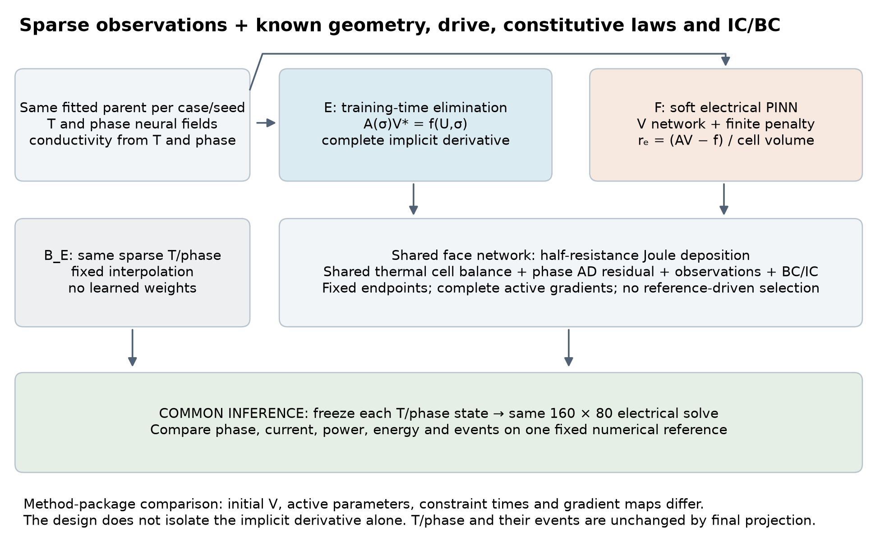
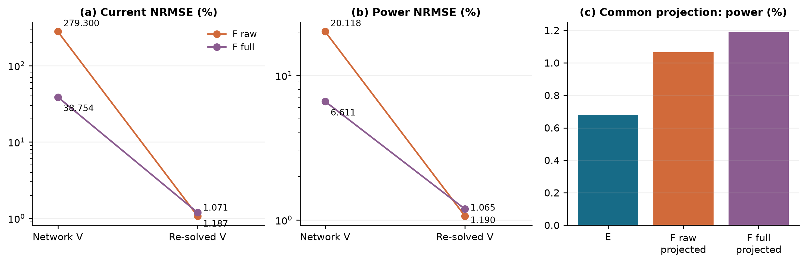
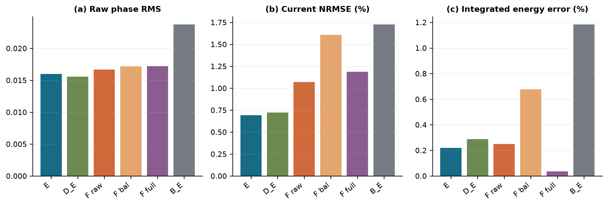
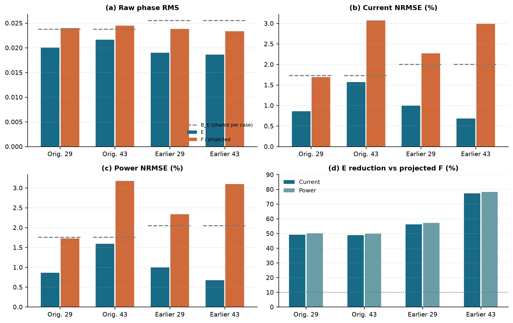
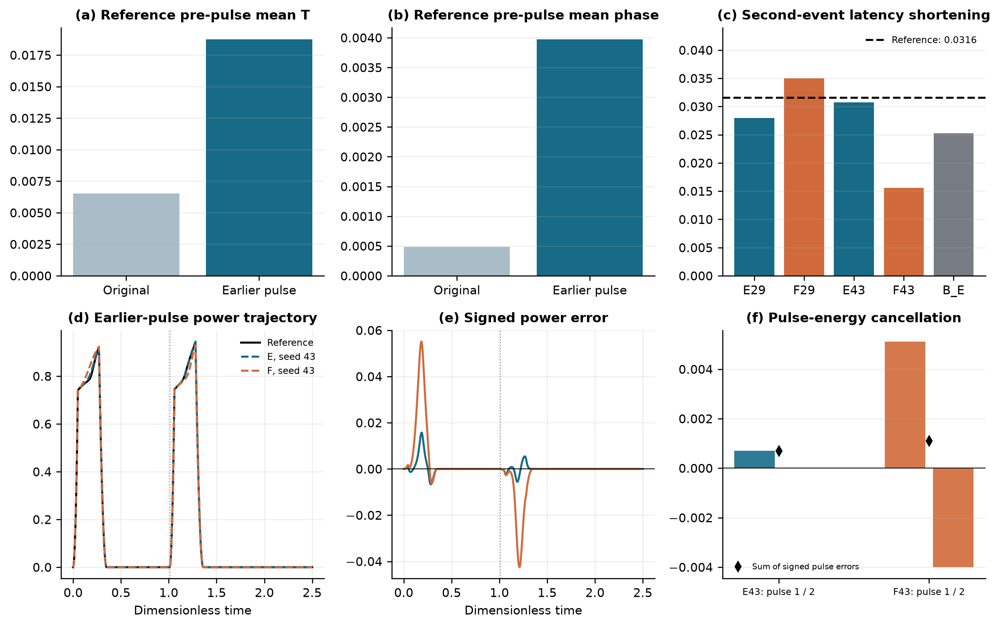
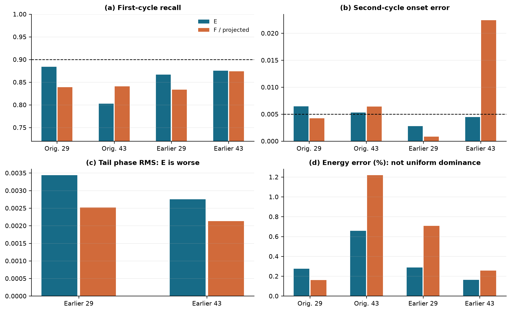
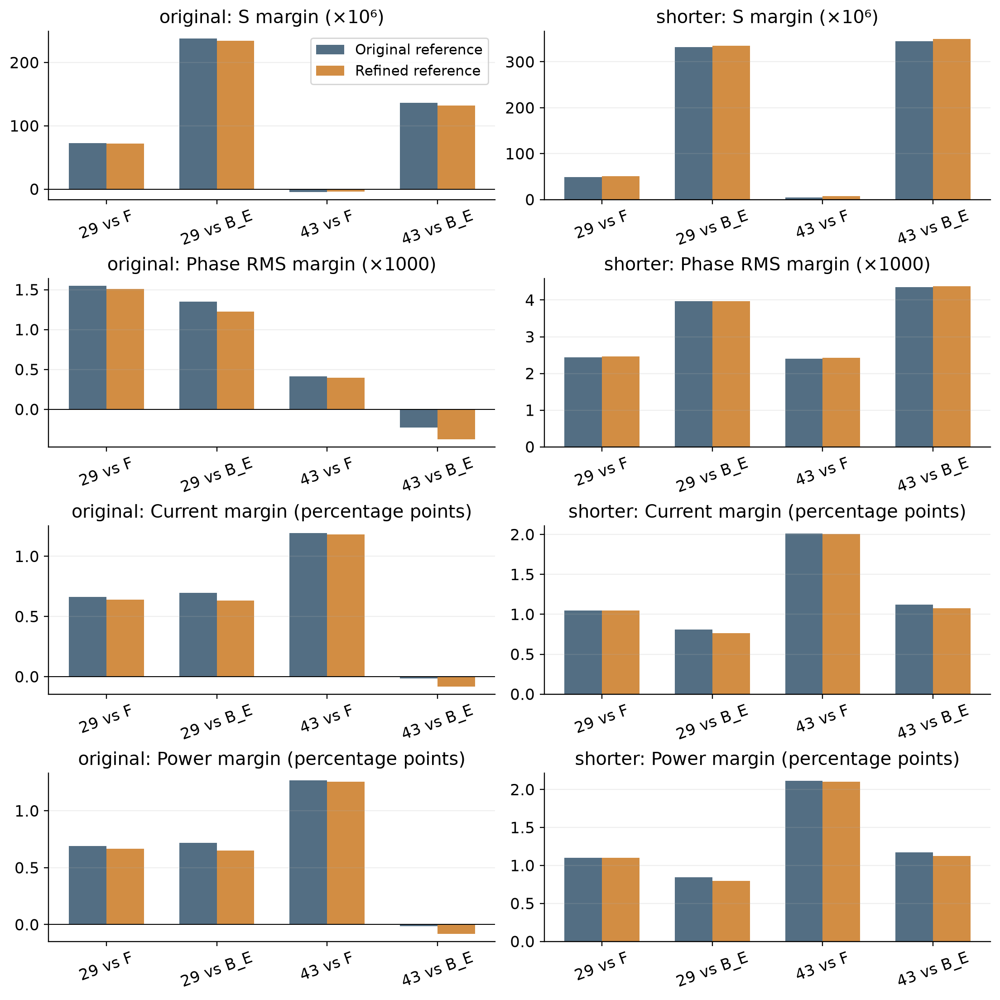
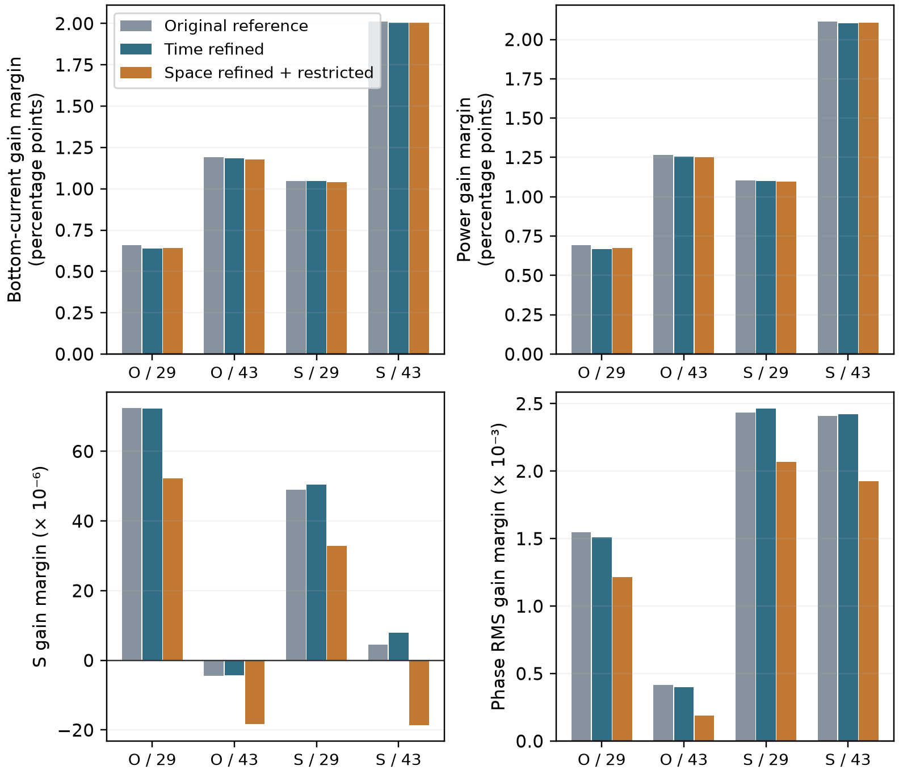

# Training-time electrical elimination improves sparse electrothermal phase-change reconstruction beyond post-training electrical repair

Authors: [author names and affiliations to be supplied]

Corresponding author: [name and email to be supplied]

## Abstract

A final electrical solve can repair terminal currents without correcting learned temperature or phase fields. We test whether imposing the same electrical constraint during training improves those evolving states. The proposed hybrid PINN learns temperature and phase, eliminates quasi-static potential through an implicitly differentiated finite-volume solve, and couples its local Joule deposition to thermal and phase residuals. A soft electrical PINN receives the same final solve; a same-solver interpolant provides an additional control. In a synthetic, dimensionless two-dimensional wall cell with noiseless sparse observations, two initialization pairs are fitted separately under each of two pulse protocols. Under the original numerical references and prescribed optimization budgets, electrical elimination reduces current and power NRMSE by 48.8-78.3% relative to projected soft controls; its current NRMSE is 0.682-1.572% and power NRMSE is 0.673-1.593%. Earlier-pulse phase RMS decreases by 20.22% and 20.31%. With predictions fixed, halving the reference time step preserves all four paired device advantages. A separate spatial-reference perturbation with conservative field restriction retains the complete device criterion in 4/4 pairs, while changing phase-threshold and strict-event conclusions. Additional phase-head controls do not establish a reference-stable representation gain. The results support the specified training package beyond final electrical repair, while leaving the independent necessity of the remaining PDE residuals, spatial convergence, strict two-cycle capability and material-calibrated performance unresolved.

Keywords: physics-informed neural network; differentiable electrical solve; electrothermal coupling; phase-field reconstruction; Joule heating; pulse history

## 1. Introduction

In a coupled phase-change system, a small error in potential may produce a large error in a contact current or in local heating. Conversely, repairing the electrical field can make terminal currents internally consistent while leaving an inaccurate temperature or phase distribution unchanged. These distinctions matter when a neural reconstruction is assessed through device quantities rather than field images alone. Our question is whether the electrical constraint should participate in learning the evolving state, or whether a final electrical solve is sufficient.

We examine this question in an observation-driven reconstruction task. Sparse potential, temperature and phase samples, the geometry, the drive and all constitutive parameters are known. This is deliberately not a claim that a neural model is necessary to solve a fully specified forward problem: a conventional coupled solver can do so without interior observations. The task instead provides a controlled setting for comparing how alternative physics interfaces assimilate the same limited field information. The reference is a fixed numerical trajectory, not an experiment or a continuum solution.

Physics-informed neural networks combine data with differential-equation residuals [1]. Such losses do not automatically ensure that every field, constraint and functional quantity improves together. Gradient imbalance and network parameterization can substantially affect optimization [2]. Differentiable numerical components offer another way to impose selected constraints. Solver-in-the-Loop trains neural corrections through a differentiable simulator and emphasizes how learning interacts with its numerical trajectory [3]. Hybrid finite-element/neural models instead embed neural constitutive components in a PDE-constrained formulation [4]. Modular implicit differentiation supplies a general means of differentiating a solution defined by an optimality or root condition [5]. These precedents motivate the tools used here; neither implicit differentiation nor inserting a solver into learning is claimed as a new principle.

Reduced and all-at-once PDE formulations distinguish eliminating a constrained variable from optimizing the full state jointly [13]. Integral projection methods enforce prescribed global quantities [12]; our electrical layer instead solves a local quasi-static boundary problem, retaining the evolving thermal and phase fields as neural unknowns. These neighboring approaches delimit the contribution, rather than establish novelty for constrained learning itself.

Differentiable PDE-constrained layers are a closer architectural precedent: PDE-CL solves for a constrained combination of learned basis functions and differentiates that solution [15]. Hard-constraint PINNs also distinguish boundary parameterizations from penalty and augmented-Lagrangian enforcement of interior equations [16]. Our finite electric penalties are therefore specific tested comparators, not the entire class of soft or constrained optimization methods.

| Neighboring approach | Relevant precedent | Distinction of the present experiment |
| --- | --- | --- |
| Solver-in-the-Loop [3] | Learns corrections interacting with a numerical trajectory | Here the evolving fields are offline reconstructions; only the quasi-static electrical state is solved during learning. |
| Hybrid FEM-NN [4] and PDE-CL [15] | Couple learned components or bases to differentiable PDE constraints | Here a fixed face network maps learned T/phase to V and local heat; no parameter-to-solution operator is learned. |
| Integral projection [12] | Enforces prescribed integral quantities | The electrical layer enforces a local discrete boundary-value problem; this alone does not certify state accuracy. |
| hPINN [16] | Uses boundary constructions and penalty/augmented-Lagrangian formulations | Augmented-Lagrangian training is not an executed comparator here; no superiority to that method is asserted. |

This table positions the formulation, not a numerical ranking of those papers. The contribution is the defined electrothermal reconstruction interface and its matched repair controls, rather than a new principle of implicit differentiation or hard constraints.

Our setting differs in three respects. First, only the quasi-static electrical variable is eliminated; the transient temperature and phase fields remain neural functions constrained by observations and explicit residuals. Second, the electrical operator and local Joule deposition share the same face resistances, so the heat source used during learning is consistent with the electrical discretization. Third, the comparison gives the soft electrical model the same final electrical solve. This last control separates a benefit from learning with the constraint from a benefit explained entirely by correcting potential at evaluation. A full-spatial-penalty counterfactual and two clean initialization pairs further delimit the interpretation.

Control-volume PINNs have previously constructed residuals from integrated conservation laws, including additional regularization for hyperbolic systems [6]. We use a spatial cell-balance thermal residual with automatic differentiation at shared faces; we do not inherit a space-time entropy-stability guarantee. The phase dynamics are of nonconserved phase-field type [7]. The wall-cell layout and electric-thermal-phase feedback are inspired by multiphysics phase-change-memory modeling [8], but the present coefficients are dimensionless design values. In particular, that application source concerns Ge-rich GST, not an oxide calibration. Our numerical model omits its multi-phase composition, material interfaces and field-dependent switching physics.

The contribution is therefore a defined coupling method and a controlled evidence sequence. We first distinguish fixed-state electrical repair from remaining differences after a common repair. We then examine whether the benefit persists under fresh initialization and a finite change in pulse history. Finally, we report the event and energy counterexamples that constrain the method's usefulness. The aim is a testable computational-method claim, rather than a collection of individually named optimization techniques.

## 2. Two-dimensional model and reconstruction task

### 2.1 Governing equations

The computational cell is Ω = [−1,1] × [0,1], with coordinates x and z and time 0 ≤ t ≤ 2.5. Potential V, reduced temperature T and phase fraction φ obey

$$\nabla\cdot(\sigma(T,\phi)\nabla V)=0. \qquad (1)$$

$$T_t+L\phi_t=\alpha\Delta T-\gamma T+Q\sigma(T,\phi)|\nabla V|^2. \qquad (2)$$

$$\phi_t=M(T)\left[\epsilon^2\Delta\phi-\partial_\phi W(\phi,T)\right]. \qquad (3)$$

The conductivity, mobility and local phase potential are

$$\sigma=\exp[\beta T+\log(R)\phi^2(3-2\phi)], \qquad (4)$$

$$M(T)=m_c+(m_h-m_c)\operatorname{sigmoid}[(T-T_c)/w_M], \qquad (5)$$

$$W=B\phi^2(1-\phi)^2+D(T_c-T)\phi^2(3-2\phi). \qquad (6)$$

We use α = 0.10, γ = 4, L = 0.05, Q = 4, β = 0.25, R = 8, ε = 0.04, B = 1, D = 6, T_c = 0.45, m_c = 0.5, m_h = 5 and w_M = 0.08. Mobility multiplies the entire phase bracket; it is not moved inside a divergence. Because W depends on the externally evolving temperature, the model is not assigned an autonomous monotone free-energy constraint.

The full top electrode is driven by U(t); a centered bottom segment |x| ≤ 0.35 is grounded. All remaining electrical faces are insulating. The top temperature is zero; the other thermal boundaries satisfy ∂ₙT + 0.25T = 0. Phase satisfies ∂ₙφ = 0 on every boundary. Initially T = 0 and

$$\phi_0=0.02+0.01\exp\left[-\frac{1}{2}\left((x/0.18)^2+((z-0.12)/0.10)^2\right)\right]. \qquad (7)$$

These assumptions define a synthetic wall-cell benchmark. No dimensional material parameters, experimental memory operation, or oxide-specific constitutive identification are inferred from it.

### 2.2 Complete pulse protocols and information boundary

Each pulse rises linearly from zero to 0.72 over its first 0.05 time units, holds until local time 0.27, then falls to zero at 0.35. The original protocol starts two pulses at 0 and 1.25. The intervention changes only the second start to 1.01, leaving the pulse shape, total time, coefficients and boundaries fixed. The input contains exactly two pulses; it is not periodically extended to create a third pulse. Advancing the second pulse by 0.24 preserves its phase relative to the 0.02 observation spacing.

Support trajectories use 80 × 40 cells, a main time step of 0.0025 and saving every two steps. The spatial and temporal masks take indices 0,4,8,… and the last index, fixed independently of field values. The resulting 21 × 11 × 126 mask contains 231 analytic initial positions and 28,875 positive-time positions, with 86,625 scalar field labels. Training receives only these samples, coordinates and known physical laws. Dense support fields, reference fields, reference currents or heating, and sealed stress cases do not enter training or model selection.

The evaluation reference uses 160 × 80 cells, a main time step of 0.000625 and saving every four steps, giving 1001 times. Both numerical trajectories use backward-Euler finite-volume steps with converged electrical/phase/thermal block iterations and logit Newton for phase, as specified in Supplement S1.1. Their algebraic convergence tolerances do not certify discretization accuracy. The grids serve different roles; their existence alone is not a convergence study. Each protocol has its own observations and is fitted separately. The intervention is consequently a complete-case adaptation experiment, not zero-shot transfer or a formal out-of-distribution test. The two seed values are reused across protocols for paired reporting, not counted as four independent physical cases.

## 3. Partially eliminated hybrid PINN

### 3.1 Neural states and electrical elimination

Let u_θ = (T_θ, φ_θ). Independent smooth modified-MLP heads [2] have width 64 and four hidden layers; the shared temperature architecture also includes a small additive latent adapter described in the Supplement. FP64 arithmetic and identical output mappings are used in both methods. With a(t) = 1 − exp(−t/0.35),

$$T_\theta=2.5a(t)(1-z)\operatorname{sigmoid}(h_T), \qquad (8)$$

$$\phi_\theta=\operatorname{sigmoid}[\operatorname{logit}(\phi_0)+8a(t)h_\phi]. \qquad (9)$$

The eliminated method, E, evaluates σ_θ from these states and solves the grounded electrical system

$$A(\sigma_\theta)v^*=f(U,\sigma_\theta). \qquad (10)$$

For an internal face e between cells i and j, the half-cell distances d and face area A_e define

$$R_{ei}=d_{ei}/(\sigma_i A_e),\quad R_{ej}=d_{ej}/(\sigma_j A_e),\quad g_e=(R_{ei}+R_{ej})^{-1}. \qquad (11)$$

Electrode faces use the corresponding half-cell resistance and the actual heater overlap. Insulating faces contribute no outward conductance. Positive conductances on the connected grid, with Dirichlet electrodes fixing its gauge, make the assembled electrical matrix nonsingular. Electrical enforcement means solving this discrete system to numerical precision; it is not an exact continuum solution. The implementation uses sparse factorization, not a dense inverse. For a scalar loss, the complete first-order derivative is obtained from

$$A^{\mathsf T}z=\partial\mathcal L/\partial v,\qquad d\mathcal L=d\mathcal L_{\rm direct}+z^{\mathsf T}(df-dA\,v^*). \qquad (12)$$

The direct term includes the explicit dependence of heating on conductivity. The right-hand side f also depends on electrode conductance, and its derivative is retained. A factorization may be reused for the adjoint of the same forward solve, but not after changing the state. This is an application of implicit differentiation [5], with no claim of a new differentiation theorem or support for arbitrary second-order derivatives.

### 3.2 Consistent local Joule deposition and remaining residuals

Given either the solved or neural potential, face current and deposition are

$$I_e=g_e(v_i-v_j),\qquad P_{e\to i}=I_e^2R_{ei},\qquad P_{e\to j}=I_e^2R_{ej}. \qquad (13)$$

Electrode power enters the neighboring boundary cell. For cell volume ω_i, q_i is its deposited power divided by ω_i. This allocation is not generally an equal split between adjacent cells. It gives

$$\sum_i\omega_iq_i=P_J, \qquad (14)$$

where P_J sums all internal and electrode dissipation. Equation (14) is an accounting identity for the shared face network, even when a neural potential violates electrical balance. Equality with terminal power UI additionally requires the electrical equations. Neither identity by itself establishes accuracy relative to the reference heating field. P_J denotes electrical dissipation; the reduced thermal source is Qq, so its integral is QP_J. This normalization and the temperature-dependent phase potential do not imply a general total-free-energy decay theorem.

The temperature residual uses a cell balance,

$$R_{T,i}=\partial_t(\bar T_i+L\bar\phi_i)+\gamma\bar T_i-\frac{\alpha}{\omega_i}\sum_f A_f(\nabla T_\theta)_f\cdot n_{if}-Qq_i. \qquad (15)$$

Cell means use midpoint quadrature. Temperature gradients are differentiated at shared face nodes with opposite normals for neighboring cells, including the model's own gradients on boundary faces. The same thermal boundary residual remains in both losses. The factor Q is applied once. The phase residual is

$$R_\phi=\phi_t-M(T)[\epsilon^2\Delta\phi-2B\phi(1-\phi)(1-2\phi)-6D(T_c-T)\phi(1-\phi)]. \qquad (16)$$

Thus the thermal interface is a spatial cell-balance residual and the phase interface is a pointwise AD residual. They are not claimed to equal the previous pointwise thermal formulation or the full space-time construction of [6]. At U = 0, E uses the analytic electrical solution v = q = 0 while thermal and phase evolution remain active.

### 3.3 Soft comparator and training objectives

The soft electrical PINN, F, trains all three field heads. Its potential is V_θ = U(t) exp(h_V)/[exp(h_V)+1−z], preserving the voltage range and the exact top value. It evaluates the same face operator and Joule deposition as E, but penalizes

$$r_{e,i}=(A(\sigma_\theta)V_\theta-f(U,\sigma_\theta))_i/\omega_i. \qquad (17)$$

No additional, differently averaged electric boundary loss is added: electrical boundary conductances already enter this residual. Let L_obs denote the common weighted observation loss, including the full initial-logit increment for phase, and let L_BC and L_IC be the common remaining boundary and initial losses. Their exact measures are specified in Supplement S2. With one calibration a,b at the shared parent and λ rising to 0.1,

$$J_{T\phi}=\frac{1}{3}\mathbb E_\rho[(R_T/4)^2+(R_\phi/5)^2], \qquad (18)$$

$$\mathcal L_E=L_{{\rm obs},E}/a+\lambda(5L_{\rm BC}+L_{\rm IC}+J_{T\phi,E})/b, \qquad (19)$$

$$\mathcal L_F=L_{{\rm obs},F}/a+\lambda(5L_{\rm BC}+L_{\rm IC}+J_{T\phi,F})/b+\frac{\lambda\eta}{3b}\mathbb E_\rho[r_e^2]. \qquad (20)$$

Here ρ is the uniform space-time target with the declared time-window quadrature. Scales a and b are shared within a pair and frozen, with a numerical floor of 10⁻¹². The primary F uses η = 1. A development control uses a one-time gradient-balanced η; a second control replaces the 128 sampled electrical cells by the volume mean over all 3200 cells at each physical time. The latter changes spatial integration, not the penalty by a factor of 25. Thermal and phase terms keep their original interfaces.

E freezes the unused potential head. Its voltage observations differentiate through conductivity and the solve, whereas F voltage observations act on its potential head. E enforces its constraint at powered observation and physics times; F penalizes it at physical residual times. Initial potential, active parameters, constraint strength and gradient maps consequently differ. These are explicit parts of the method-package comparison, not hidden evidence for an isolated VJP mechanism.

Figure 1. Both methods use the same sparse observations and evolving-state architecture. Common inference freezes each learned T/phase state and solves the same electrical problem. The interpolant B_E also receives this solve. The schematic describes implemented interfaces, not a new experiment; implementation sources are mapped in Supplement S7.

### 3.4 Fixed-prediction reference perturbation

Both protocols receive an additional reference with the original algorithms and tolerances, the same 160 by 80 spatial grid, and half the integration step: 0.0003125 with saving every eight steps. Original references remain available. The 1001 saved times, predictions, ROI and event definitions are identical between the two scoring passes; no prediction is interpolated or reselected. New references are excluded from training and method selection. Each normalized error uses its own reference denominator, with a fixed-old-denominator diagnostic reported separately.

For an error in one common weighted norm, the reverse triangle inequality gives |e_new - e_old| <= δ, where δ is the norm of the reference difference. Consequently, the relative-gain margin obeys

$$m=0.9e_F-e_E,\qquad |m_{\rm new}-m_{\rm old}|\leq 1.9\delta. \qquad (21)$$

The same bound applies to active-set symmetric difference using δ_S, the measure of the two reference sets' symmetric difference. Normalized device margins use a fixed denominator for this bound; a changed denominator is reported separately. These bounds contextualize a narrow margin and do not prove that every threshold decision is robust. Temporal refinement alone does not establish spatial convergence or continuum accuracy.

## 4. Matched experiment and evaluation

### 4.1 Shared parents, fixed endpoints and strong controls

For each protocol, seeds 29 and 43 initialize fresh networks and a zero-output adapter, without loading trained weights, optimizer history or calibration. A common observation-only parent receives 2400 Adam updates [9] and 600 full-observation L-BFGS evaluations, 200 per field head [10]. E and F then start from that same fitted parent with fresh optimizers. Each branch receives 1500 Adam updates and at most 300 fixed complete-objective/gradient evaluations. Every line-search trial and repeated evaluation counts; budget termination restores the last accepted state. No reference score selects a checkpoint.

The learning rate, Adam parameters, clipping, observation stream, physical time windows and residual scales are shared. L-BFGS uses fixed data and quadrature, without resampling or gradient clipping inside its closure. Equal update and evaluation caps do not imply equal computation: E incurs sparse forward and adjoint solves, while F differentiates a potential network and its explicit residual. Actual work is retained in Supplement S6; no speedup is claimed.

B_E interpolates the same sparse temperature and full-logit phase information using fixed PCHIP and spatial interpolation rules, then solves the same electrical system. It is computed once per protocol and reused across seeds. B_E has access to the same three-field sparse carrier, but its state interpolation actually uses only T and phase; it does not assimilate interior V observations. This is a comparison with the same available data, not equal utilization of every observed field. Historical development controls include D_E, which omits the remaining thermal/phase interior residuals, and the balanced and full-spatial versions of F. They are reported separately, not pooled with clean repetitions. The primary soft recipe was locked before the clean confirmation rather than selected anew for each seed.

The comparison units and information paths are summarized below. All measurements are noiseless numerical samples from the stated carrier, and all learned reconstructions use observations spanning the full trajectory.

| Comparison family | What is held common | What the contrast can identify |
| --- | --- | --- |
| Four clean E/F pairs: two protocols × seeds 29/43 | Sparse V/T/phase, fitted parent, retained T/phase architecture, objective scales, update/evaluation caps, final electrical solve | The defined training-method package. Initial V, electrical enforcement times, active parameters, gradients and solve work still differ. |
| E versus one B_E per protocol | Available sparse carrier and final electrical solver | Benefit over this interpolation rule. B_E actually uses T/phase, not interior V; equal availability is not equal information utilization. |
| Historical D_E, balanced and full-grid F | Their original development parent and frozen recipes | Bounded residual/penalty/coverage alternatives; these are not extra clean repetitions. |
| Six later E_C/E_R/E_I states: three arms per earlier-pulse parent | Parent, data, retained physics and continuation caps | Continued fitting versus added capacity versus the specified gate. Old F states do not receive this extra budget. |

The fixed-array archive contains eight historical learned states, two deterministic interpolants and six later learned states: sixteen scoring objects, not sixteen independent models or cases. Historical E is compared with F and B_E in each of four protocol/seed pairs, giving eight comparisons and sixteen A/B decisions per reference. The separate NumPy scorer tests arithmetic reproducibility, not independent scientific validation.

### 4.2 Common inference and distinct outcome measures

All final projected states use the same 160 × 80 electrical layer at the reference times. The unprojected F readout is retained separately. For a fixed F, projection changes V, q and electrical readouts while leaving T, φ and every phase event unchanged. The error measures distinguish these effects.

S is the space-time mean symmetric difference of active sets, where active means φ ≥ 0.5; it uses the full cell domain and global trapezoidal time weights. Raw E_φ is phase RMS on the ROI |x| ≤ 0.55, 0 ≤ z ≤ 0.55. E_T is ROI temperature RMS divided by 0.45, and E_V is unnormalized full-domain potential RMS. Device errors are

$$\mathcal{E}_I=\frac{\|I-I_{\rm ref}\|_t}{\|I_{\rm ref}\|_t},\quad \mathcal{E}_P=\frac{\|P_J-P_{J,{\rm ref}}\|_t}{\|P_{J,{\rm ref}}\|_t},\quad \mathcal{E}_W=\frac{|\int(P_J-P_{J,{\rm ref}})dt|}{|\int P_{J,{\rm ref}}dt|}. \qquad (22)$$

The time norm is trapezoidal RMS over the complete interval. The matched device criterion compares predicted bottom current with the reference top-current trace, retaining the historical scoring convention. The top-current noninferiority guard uses the predicted top current. For projected states these terminal traces agree to solve accuracy; the archive also reports bottom-native errors as a separate diagnostic. Unprojected soft currents can disagree substantially and must not be interchanged. Percentages below are 100 times normalized errors, not dimensional percentage errors in temperature or phase. All absolute, percentage-point and relative differences are provided in the unified tables.

For the same heating-window measure, let M_pred, M_ref and M_TP be predicted, reference and overlapping active masses. When both masses exceed the numerical denominator floor, the definitions give

$$\operatorname{recall}=\operatorname{precision}\,\frac{M_{\rm pred}}{M_{\rm ref}}\leq\min\left(1,\frac{M_{\rm pred}}{M_{\rm ref}}\right). \qquad (23)$$

This identity separates an insufficient predicted active mass from mismatch in space and time at a fixed mass. It is a descriptive support diagnostic, not a new loss or evidence that a particular neural mechanism caused the error. The original near-zero floors remain in the scorer. The strict gates are project-defined evaluation requirements, not experimental device-reliability standards or estimates of a success probability.

Predeclared phase-reconstruction and device-function criteria require 10% improvements in their named primary metrics with 5% noninferiority guards and fixed absolute floors. They are retained in Supplement S3, rather than used as a substitute for reporting error magnitudes. Failure to cross an advantage threshold does not demonstrate equivalence. Strict event usability is separate: both cycles must meet onset error ≤ 0.005, recall ≥ 0.9, precision ≥ 0.8, mass ratio 0.8-1.2, and the specified peak, locality and recovery conditions. An onset is the linearly interpolated upward crossing of ROI active fraction 0.02. Support metrics integrate cell-volume overlap during each heating window.

For projected states, P_J = UI to electrical solve accuracy. Current and power errors thus differ in drive-dependent temporal weighting, but are not independent physical replications. Likewise, a small integrated energy error may reflect cancellation. We therefore retain the signed per-pulse errors, event metrics and local state errors even when global device criteria pass.

### 4.3 Bounded phase-head development

After the clean comparison, each earlier-pulse E endpoint is continued in three arms: unchanged representation, ordinary residual capacity and a frozen parent-interface gate. They share the original data and coupled PINN objective, with 600 Adam updates and 100 complete L-BFGS evaluations per arm. The six endpoints are developments from trained parents, not independent confirmations. Full formulas, equal-trainable-parameter controls, fixed display times and actual solve counts are retained in Supplement S10 and S13. This experiment asks whether representation changes add an increment beyond continued fitting; it does not redefine the original E method.

## 5. Results

Sections 5.1-5.5 report the matched elimination results against the original reference. Section 5.6 tests those fixed predictions with the refined reference; Section 5.7 summarizes a subsequent bounded representation experiment. Original endpoints and reference-specific decisions remain separate.

### 5.1 Electrical repair is strong but does not explain the full method difference

The development comparison first demonstrates how misleading uncorrected electrical outputs can be (Figure 2). Holding the soft model's T and φ fixed, the final solve reduces F_raw current NRMSE from 279.30% to 1.071% and power NRMSE from 20.118% to 1.065%. The full-spatial soft model also improves substantially on projection, from 38.754% to 1.187% current error and from 6.611% to 1.190% power error. None of these changes is a phase-learning improvement: the phase field is unchanged.

After every state receives the common solve, E still has 0.694% current and 0.682% power error, lower than both soft models. Against projected F_raw, the absolute reductions are 0.377 and 0.383 percentage points, respectively. This remaining difference cannot be attributed entirely to withholding a final solver from the comparator. The values are nevertheless sub-percentage-point changes in a dimensionless numerical benchmark, not measured energy savings or yield gains in an experimental device.

Figure 2. Panels a-b pair each fixed soft state before and after electrical re-solving; logarithmic vertical axes expose the large repair. Panel c compares projected endpoints, including E. T/phase and event metrics are unchanged within each repair pair. Source: the saved development-control table consolidated in Supplement S4; these states are not additional clean initialization repetitions.

### 5.2 Full spatial coverage does not remove the development signal

The full-grid electrical mean retains the same global scaling as the sampled mean. It tests whether sparse spatial enforcement alone explains the observed difference. In this development comparison, projected F_full remains worse than E in current and power, while its integrated energy error is better: 0.0362% versus 0.2188% (Figure 3). A single integrated quantity would therefore give a different ranking. The balanced penalty also does not outperform E on the functional metrics.

D_E is an important counterexample to a stronger interpretation. It obtains lower phase RMS than E, 0.01558 versus 0.01600, and nearby current/power errors of 0.724%/0.721%. A subsequent same-parent residual-strength study did not establish the frozen independent increment from the remaining thermal/phase PDE terms. The current hybrid PINN contains those residuals, but their necessity is not a supported contribution. The full-spatial experiment also leaves differences in enforcement times, finite versus exact constraints and initial V; it does not establish superiority to every sufficiently optimized soft formulation.

Figure 3. All shown device outputs receive the common solve. D_E omits thermal/phase interior residuals; F_raw, F_bal and F_full retain them and vary the electric penalty. B_E is the same-solver interpolant. F_full integrates the electrical residual over all cells with a volume mean. Its favorable energy error and the strong D_E phase result delimit the claim. Sources and full metrics are in Supplement S4.

### 5.3 Clean pairs preserve device benefits under both protocols

Tables 1-2 and Figure 4 report the two protocols and two initialization values individually. B_E appears once per case. Under the original protocol, E reduces current error relative to projected F by 49.15% and 48.80%, and power error by 50.07% and 49.85%. Under the earlier second pulse, these reductions are 56.20%/77.20% for current and 57.21%/78.26% for power. The corresponding absolute new-protocol reductions are 1.276/2.310 percentage points in current and 1.336/2.422 points in power.

Table 1. State reconstruction at the fixed endpoints. S and potential RMS are displayed after multiplication by 1000; phase RMS is raw. Temperature error is normalized by 0.45 and expressed as a percentage. All values are relative to the fixed numerical reference, not continuum truth.

| Case | Seed | Method | S (x 10^-3) | Phase RMS | T RMS / 0.45 (%) | V RMS (x 10^-3) |
| --- | --- | --- | --- | --- | --- | --- |
| Original | 29 | E | 1.03007812 | 0.0200420628 | 1.06007195 | 1.29580638 |
| Original | 29 | F/projected | 1.225 | 0.0239867136 | 1.09307704 | 2.60377427 |
| Original | 43 | E | 1.13164062 | 0.0216191612 | 1.03308456 | 2.3572941 |
| Original | 43 | F/projected | 1.2525 | 0.0244820854 | 1.04466907 | 4.6475289 |
| Original | -- | B_E | 1.4084375 | 0.0237697822 | 1.32782551 | 2.55844987 |
| Earlier pulse | 29 | E | 1.08617188 | 0.0190024138 | 1.10217226 | 1.56810132 |
| Earlier pulse | 29 | F/projected | 1.26125 | 0.0238184652 | 1.1691428 | 3.72351348 |
| Earlier pulse | 43 | E | 1.07351562 | 0.0186192217 | 1.096098 | 1.08025084 |
| Earlier pulse | 43 | F/projected | 1.19773438 | 0.0233632244 | 1.14088216 | 4.58526415 |
| Earlier pulse | -- | B_E | 1.57546875 | 0.0255235296 | 1.28001891 | 3.00566331 |

Table 2. Device reconstruction after a common electrical solve. Errors are percentages. Each interpolant is one shared deterministic baseline, not a separate seed-level experiment.

| Case | Seed | Method | Current NRMSE (%) | Power NRMSE (%) | Energy error (%) |
| --- | --- | --- | --- | --- | --- |
| Original | 29 | E | 0.858272558 | 0.862489074 | 0.275171595 |
| Original | 29 | F/projected | 1.68784452 | 1.72743388 | 0.16092829 |
| Original | 43 | E | 1.5717843 | 1.5927505 | 0.656890573 |
| Original | 43 | F/projected | 3.06965826 | 3.17575226 | 1.2191156 |
| Original | -- | B_E | 1.72822894 | 1.7562293 | 1.184941 |
| Earlier pulse | 29 | E | 0.994297464 | 0.999332059 | 0.287606086 |
| Earlier pulse | 29 | F/projected | 2.26991397 | 2.33531611 | 0.706626655 |
| Earlier pulse | 43 | E | 0.682118875 | 0.672758464 | 0.162717895 |
| Earlier pulse | 43 | F/projected | 2.9917346 | 3.09468633 | 0.257360418 |
| Earlier pulse | -- | B_E | 2.00318557 | 2.04893872 | 1.50593097 |

All four E/soft pairs pass the prescribed device-function criterion. Both earlier-pulse pairs also pass the phase-reconstruction and device criteria against B_E. On the original protocol, seed 43 does not cross the strong-interpolant advantage gate: its phase, current and power reductions are only about 9.05%, 9.05% and 9.31%. This failure remains relevant despite favorable directions. The historical seed 17 used a different development history and is not pooled into these confirmations.

Raw phase reductions against projected F are 16.45% and 11.69% for the original protocol, and 20.22% and 20.31% for the earlier pulse. The earlier-pulse seed-43 S reduction is 10.3711%, leaving an absolute margin of only 4.4453 × 10⁻⁶ beyond the 10% criterion. That individual threshold decision has a narrow margin under this reference; it is not evidence of robustness to reference discretization. No significance test is based on the number of grid cells or times, and two initializations do not establish a population success probability.

Figure 4. Each group is a separately fitted E/F pair; the two cases reuse initialization identifiers. Dashed B_E values are repeated visually for comparison but counted once per case. The fourth panel gives relative reductions, while panels a-c retain absolute error scales. Sources: unified results and paired-effects tables; no newly selected checkpoint or rerun is included.

### 5.4 Threshold recovery does not imply a reset of the continuous state

The fixed numerical references agree before the intervention to a maximum reported field difference of 7.22 × 10⁻¹⁵ at matching resolution. Immediately before the second pulse, however, the earlier protocol has a warmer and less relaxed state: ROI mean T changes from 0.006525 to 0.018746, and mean φ from 0.0004829 to 0.0039725. Maximum pre-pulse φ increases from 0.02056 to 0.19179, still below the active threshold. The threshold-based recovery fraction is therefore compatible with appreciable continuous-state memory.

The reference second-event latency decreases from 0.2484 to 0.2168, a shortening of 0.0316, or 12.72% of the original latency. A report-only calculation from the saved event table gives predicted shortenings 0.027942 and 0.030740 for E29/E43, 0.035000 and 0.015580 for F29/F43, and 0.025271 for B_E. The corresponding absolute shortening errors are 0.003658, 0.000860, 0.003400, 0.016020 and 0.006329. F29 is slightly better than E29 on this difference, even though its device trajectories are worse.

Figure 5 connects residual states, timing changes and electrical response. The intervention supports a pulse-history effect within this model; it does not isolate thermal from phase-memory mediation. Each neural function is fitted offline using observations over its complete trajectory. Different neural predictions over the physically identical prefix therefore reflect separate reconstruction errors, not a violation of the generator's causal evolution.

Figure 5. Panels a-b show reference ROI means before the respective second pulses; panel c uses only saved event times and is report-only. Panels d-f show the earlier-pulse case for seed 43, including signed errors and their pulse integrals. The energy diamond is the sum, not the sum of absolute errors. Sources: saved reference-history, complete-events, per-pulse tables and power traces. No state or trajectory was generated for this figure.

### 5.5 Historical event and energy counterexamples

Under the earlier pulse, E has first/second onset errors 0.003333/0.002775 for seed 29 and 0.003490/0.004440 for seed 43. All are below 0.005. First-cycle recalls remain 0.866607 and 0.875507, below 0.9, so neither model meets all project-defined two-cycle event requirements. F29 has a smaller second-cycle timing error, 0.0008375, than E29. E also has larger tail-phase RMS in both earlier-pulse pairs; seed 43 has a slightly larger second-cycle temperature error. Figure 6 displays these adverse outcomes together with the original-protocol event failures.

Energy integration introduces another non-equivalence. Earlier-pulse F43 has opposite signed pulse-energy errors, +0.00511674 and −0.00400099. Their cancellation gives only 0.25736% total energy error despite 3.09469% power-trajectory NRMSE. E43 also exhibits cancellation, so the phenomenon is not unique to the soft model. On the original protocol, F29 has a smaller energy error than E29 even though both current and power trajectories favor E. These observations justify retaining trajectory and signed per-pulse measures rather than interpreting integrated energy as a sufficient device score.

Figure 6. Dashed lines indicate the inherited recall and timing criteria, not revised thresholds. Tail errors refer to the earlier-pulse case after the second recovery cycle. The integrated-energy ranking reverses in the original seed-29 pair. All eight learned endpoints fail at least one strict event requirement. Complete precision, mass, peak, locality and recovery values accompany the event table in Supplement S5.

### 5.6 Fixed-model reference sensitivity

With fixed historical predictions, the device criterion against the projected soft control passes in 4/4 pairs under the original references and 4/4 under the refined references. The changed historical A/B decisions are: none across eight comparisons (four E/soft and four E/interpolant), or sixteen A/B decisions per reference. A changed gate limits that specific threshold claim; a retained direction or gate supports only the tested temporal perturbation. Full errors, each reference denominator and fixed-old-denominator diagnostics are retained in the scoring records. The original reference discrepancy is δ_S = 1.6875e-05 and ROI phase RMS δ = 0.00039034515. The shorter reference discrepancy is δ_S = 1.671875e-05 and ROI phase RMS δ = 0.00032183192. The historically narrow seed-43 S margin changes from 4.4453125e-06 to 7.9921875e-06. The sufficient triangle-bound condition alone cannot certify this narrow margin; its retention follows from actual rescoring of these two references, not from a continuum argument.

The main device conclusion is more stable than the strict event threshold: a later gated endpoint passes the complete two-cycle rule only under the refined reference. Section 5.7 reports that limited result; none of the eight historical learned states achieves the strict capability under both reference choices.

Table 3. Reference discrepancies in the exact scoring measures. These are changes between numerical references, not model errors against a continuum truth.

| Protocol | delta S | delta phase | delta T/0.45 | delta V | delta I RMS | delta power RMS | delta q RMS |
| --- | --- | --- | --- | --- | --- | --- | --- |
| original | 1.6875e-05 | 0.00039034515 | 0.00044793336 | 7.2165848e-05 | 0.00026573135 | 0.00018700396 | 0.00070534519 |
| shorter | 1.671875e-05 | 0.00032183192 | 0.00039944013 | 5.4934548e-05 | 0.00020447816 | 0.00014460126 | 0.00052994496 |

Figure 7. Original and refined relative-gain margins for the same historical E/F and E/B_E arrays, including both primary device quantities. Positive margins satisfy the relative component only; original absolute tolerances and noninferiority still enter the full decision. Phase and symmetric-difference bounds use the same fixed measure. Device bars use each reference denominator; the fixed-original-denominator version for the triangle bound is supplied separately. No new network is selected from these plots.

A separate NumPy-only scorer reproduces the ten historical objects’ saved metrics and decisions, then evaluates the six new states against both references. The sixteen objects comprise fourteen learned states and two interpolants, not independent replications. This is array-level reproducibility from a local archive, not third-party reproduction or independent solver validation.

A conservative perturbation calculation further separates empirical retention from a uniform guarantee. At a perturbation budget equal to the observed time-reference discrepancy, the current and power gain components are certified in all four E/F pairs, but the complete device rule is certified only in the two earlier-pulse pairs; the original pairs are limited by the temperature noninferiority guard. This is a sufficient-bound limitation, not an observed reversal: all four complete rules retain their outcomes under the actual refined reference. Supplement S14 gives the derivation, absolute-tolerance treatment and all comparisons. The observed discrepancy is not an estimate or upper bound for unknown continuum error.

### 5.7 Added phase capacity gives mixed, reference-dependent effects

Continued optimization alone lowers raw phase RMS by 7.65% and 8.89% in the two earlier-pulse parents. Neither an ordinary residual nor the interface-gated residual adds the prescribed phase or device increment over that continuation under either reference. For example, the gated head lowers power NRMSE by 7.54% and 7.24% relative to continuation under the original reference, while phase RMS changes by −1.58% and +2.04%. These mixed effects do not establish the gate as a new component of the confirmed method.

The gated seed-43 endpoint nevertheless meets the complete strict rule and its accompanying noninferiority conditions under the refined reference only. Its first-cycle recall changes from 0.898602974 to 0.902063024 with exactly the same prediction. Reference active mass decreases from 0.0006934375 to 0.00068921875, while overlap also decreases from 0.000623125 to 0.00062171875. Thus a threshold can improve when its reference denominator changes, even without more overlap. The onset error changes from 0.003750 to 0.004583 and remains within its criterion. This is a real reference-specific outcome, not a reference-stable gain. All six arms, both cycles, both references and the predeclared full-domain maps remain in Supplement S10-S13.

### 5.8 Spatial-reference sensitivity with fixed predictions

A further reference changes the grid from 160 × 80 to 240 × 120 at the already refined time step 0.0003125, separately for each protocol. Every learned prediction and electrical readout is held fixed. Reference fields are conservatively restricted to the original scoring cells; reference terminal current and power retain their native fine-grid values. This tests the specified reference perturbation, including its mapping, rather than model-inference grid independence.

The complete device criterion against projected F passes in 4/4 historical pairs under this spatial reference, compared with 4/4 under each temporal reference. Across both controls and both rules, 3 of the sixteen historical decisions change relative to the time-refined reference. Supplement S15 lists every comparison and the full endpoint measures; Figure 8 shows the relative-gain margins, which do not by themselves replace the complete rules.

Relative current and power error reductions against projected F are 48.82-77.42% and 49.82-78.56%, respectively. Their absolute NRMSE reductions are 0.81-2.30 and 0.84-2.42 percentage points. Across the eight historical comparisons, the directions of the S, phase, temperature, potential, current and power error differences do not reverse. Threshold conclusions are more sensitive: original seed 29 improves phase RMS over B_E by 9.64%, and earlier-pulse seed 43 improves S over F by 8.53%, each below the prescribed 10% requirement. Conversely, original seed 43 now crosses the device criterion against B_E, with current/power gains of 10.52%/10.86%. That crossing remains specific to the spatial reference.

Figure 8. Reference-only comparison of the four fixed E/F pairs. O and S denote the original and earlier-pulse cases. The spatial reference supplies native terminal quantities and volume-restricted fields. Positive bars satisfy the relative-gain component; absolute floors and noninferiority guards remain in the complete comparisons. Changing reference never selects or retrains a network.

Across the sixteen fixed objects, the spatial-reference strict outcomes are none. The historical absence of strict capability under the original reference is unchanged; passing a later reference cannot establish robustness across all tested references. Thresholding the restricted phase is also different from restricting the fine active indicator. The largest resulting S discrepancy is 9.597222e-05; the largest absolute recall change is 1.3869 percentage points. These alternative mapping quantities are diagnostics only, not substitute scores used to choose a favorable decision.

The previously passing gated seed-43 continuation loses strict status: its first-cycle recall changes from 0.902063024 under temporal refinement to 0.897526906 under spatial refinement, with the prediction unchanged (Table S23). Historical earlier-pulse E also has second-cycle timing errors of 0.005275 and 0.006940, both above 0.005. Thus the spatial check adds a timing limitation to the previously reported recall limitation; it does not merely repeat the earlier strict verdict.

Two spatial resolutions, one refinement ratio and a shared numerical algorithm do not establish a convergence order or continuum accuracy. The complete state, event and device results therefore support only the numerical comparisons actually made. Native fine-grid event capability and prediction-readout grid independence remain untested.

## 6. Discussion

The most direct interpretation is that how the electrical constraint participates in training affects the learned evolving state, even when electrical repair is available to every method at inference. The repair controls show that much of an unprojected soft model's apparent device error can disappear without changing phase. The residual advantage after common projection, its persistence against a full-spatial penalty in development, and the clean paired results together support the specified training package. They do not establish that an isolated implicit gradient, rather than differences in parameterization, enforcement times or optimization, is the unique cause.

This evidence is stronger than comparison with an uncorrected weak baseline, but narrower than a general claim that exact elimination always dominates soft penalties. Only a finite set of penalty recipes and a fixed optimization budget were tested. D_E also limits the role assigned to the remaining interior residuals. A coupled PINN can have an evidenced algorithmic advantage without every retained term having a demonstrated independent increment; the latter claim is explicitly withheld here.

The application scope is equally specific. Two-dimensional feedback, localized electrodes and pulse-dependent residual states make this a device-inspired computational test rather than an abstract one-variable example. They do not make it a calibrated oxide or chalcogenide memory model. A material-facing claim would require an internally consistent material model, parameter provenance and independent physical validation. Those are absent and are not supplied by citing a more detailed device study.

The measurements also have numerical limits. Primary results use the original reference discretization; the temporal and spatial checks change only the declared reference and retain the original comparison rules. Shared conservation and dissipation identities express consistency of the numerical operator, not independent accuracy evidence. The narrow S margin and threshold-sensitive events especially should not be promoted to continuum claims. The fixed-prediction comparisons quantify temporal refinement and a spatial perturbation with a declared conservative mapping in Sections 5.6 and 5.8. They do not establish convergence order, model-inference grid independence or continuum accuracy. The new phase-head controls address one representation hypothesis without establishing the independent necessity of the retained PDE terms.

The added phase heads yield small and mixed changes beyond continuation. This constrains the tested capacity explanation while preserving the reference-specific strict crossing as a numerical sensitivity result. It does not justify escalating the gate into the core method or declaring phase capacity irrelevant.

The explicit material mapping in Supplement S12 separates state, geometry, transport, latent heat and kinetics assumptions from validation. It also retains a theoretical oxide counterpoint rather than treating Joule heating as the sole possible transition mechanism [14].

## 7. Conclusions

Training-time elimination of quasi-static potential, coupled through consistent local Joule deposition, improves the specified sparse reconstruction beyond giving a soft PINN the same final electrical solve. Four clean protocol/initialization pairs retain a device-function advantage under both tested temporal references, with mixed state and event outcomes reported separately. The result concerns the implemented coupling package under prescribed budgets; it does not isolate the implicit gradient or prove that the remaining thermal/phase residuals are necessary.

The representation controls and reference perturbation sharpen this conclusion. Additional phase capacity does not establish a reference-stable matched gain, and one strict two-cycle crossing changes with the reference alone. The further spatial-reference check retains the complete device criterion against soft in 4/4 pairs under its declared mapping. The evidence supports a bounded computational reconstruction method; continuum accuracy, prediction-readout grid independence and material-specific validation remain unestablished.

## Data, code and declarations

The versioned research evidence is available in the [PINN-PCM-SCI repository](https://github.com/ghy001122/PINN-PCM-SCI/tree/ea29be9a9d33497b075873bcdc7673df43db7221), including source, configurations, checkpoints, curated result tables and selected traces. The preceding manuscript-only version is separately identified by [commit 4081ba09](https://github.com/ghy001122/PINN-PCM-SCI/tree/4081ba09b8a6aefa2141b10c707fdf4b327898eb/paper/paper_submission). The phase-head and temporal-reference experiment was completed on 16 September 2026. Editorial revision on 17 September 2026 was followed by the separate fixed-prediction spatial-reference experiment reported in Section 5.8. This revision does not reuse either published version identifier as its own. The phase-head experiment added six PINN continuations, their projected outputs and two time-refined references. The later spatial check adds two reference trajectories and array-only rescoring of all sixteen saved objects. These new results and their complete local scoring archive have not been publicly uploaded. The earlier curated public package remains distinct from this complete local revision. Supplement S7 identifies the files needed to rebuild these manuscript figures without executing a scientific model and the separate scope of a full numerical reproduction. The original local submission archive contains the four temporal-reference trajectories, sixteen fixed prediction/readout objects, two sparse observation bundles, accepted neural/optimizer states and portable evaluator. The spatial extension is separate: two native reference trajectories, their declared field mappings, all new scores and the executed numerical sources are retained without changing that archive. A clean-directory isolated-Python rescore is recorded separately; public release and a persistent dataset identifier remain submission preparation items.

AI-assisted preparation: OpenAI Codex assisted with manuscript drafting and revision, research-code preparation, figure construction and source checking. Statements in this draft are linked to archived results and cited sources. AI assistance does not constitute independent peer review or scientific replication. Human authors must verify the final content, disclosures and interpretation and take responsibility for the submitted work; that final approval is not asserted by this draft.

Funding: [to be supplied by the authors]. Author contributions: [to be supplied by the authors]. Competing interests: [author declaration required]. No experimental or personal-subject data were collected for this numerical study.

## References

[1] Raissi, M., Perdikaris, P., and Karniadakis, G. E. Physics-informed neural networks: A deep learning framework for solving forward and inverse problems involving nonlinear partial differential equations. Journal of Computational Physics 378 (2019), 686-707. [DOI: 10.1016/j.jcp.2018.10.045](https://doi.org/10.1016/j.jcp.2018.10.045). [Author preprint, Part I](https://arxiv.org/abs/1711.10561).

[2] Wang, S., Teng, Y., and Perdikaris, P. Understanding and mitigating gradient flow pathologies in physics-informed neural networks. SIAM Journal on Scientific Computing 43(5) (2021), A3055-A3081. [Author full text](https://arxiv.org/html/2001.04536).

[3] Um, K., Brand, R., Fei, Y. R., Holl, P., and Thuerey, N. Solver-in-the-Loop: Learning from Differentiable Physics to Interact with Iterative PDE-Solvers. Advances in Neural Information Processing Systems 33 (2020). [Author full text](https://arxiv.org/html/2007.00016). [Official project](https://ge.in.tum.de/publications/2020-um-solver-in-the-loop/).

[4] Mitusch, S. K., Funke, S. W., and Kuchta, M. Hybrid FEM-NN models: Combining artificial neural networks with the finite element method. Journal of Computational Physics 446 (2021), 110651. [DOI: 10.1016/j.jcp.2021.110651](https://doi.org/10.1016/j.jcp.2021.110651). [Author full text](https://arxiv.org/html/2101.00962).

[5] Blondel, M., Berthet, Q., Cuturi, M., Frostig, R., Hoyer, S., Llinares-López, F., Pedregosa, F., and Vert, J.-P. Efficient and Modular Implicit Differentiation. Advances in Neural Information Processing Systems 35 (2022). [Author full text](https://arxiv.org/html/2105.15183).

[6] Patel, R. G., Manickam, I., Trask, N. A., Wood, M. A., Lee, M., Tomas, I., and Cyr, E. C. Thermodynamically consistent physics-informed neural networks for hyperbolic systems. Journal of Computational Physics 449 (2022), 110754. [DOI: 10.1016/j.jcp.2021.110754](https://doi.org/10.1016/j.jcp.2021.110754). [Author full text](https://arxiv.org/html/2012.05343).

[7] Allen, S. M., and Cahn, J. W. A microscopic theory for antiphase boundary motion and its application to antiphase domain coarsening. Acta Metallurgica 27(6) (1979), 1085-1095. [DOI: 10.1016/0001-6160(79)90196-2](https://doi.org/10.1016/0001-6160(79)90196-2).

[8] Miquel, R., Cabout, T., Cueto, O., Sklénard, B., and Plapp, M. Multi-physics modeling of phase change memory operations in Ge-rich Ge2Sb2Te5 alloys. Journal of Applied Physics 136 (2024), 145102. [DOI: 10.1063/5.0222379](https://doi.org/10.1063/5.0222379). [Author full text](https://arxiv.org/html/2409.06463).

[9] Kingma, D. P., and Ba, J. Adam: A Method for Stochastic Optimization. International Conference on Learning Representations (2015). [Author preprint](https://arxiv.org/abs/1412.6980).

[10] Liu, D. C., and Nocedal, J. On the limited memory BFGS method for large scale optimization. Mathematical Programming 45 (1989), 503-528. [Author publication page and paper](https://users.iems.northwestern.edu/~nocedal/Abstracts/limited-memory.html).

[11] He, K., Zhang, X., Ren, S., and Sun, J. Deep Residual Learning for Image Recognition. IEEE Conference on Computer Vision and Pattern Recognition (2016), 770-778. [Author preprint](https://arxiv.org/abs/1512.03385).

[12] Baez, A., Zhang, W., Ma, Z., Nguyen, L., Das, S., and Daniel, L. Guaranteeing Conservation of Integrals with Projection in Physics-Informed Neural Networks. arXiv:2511.09048v2 (2026). [Author record](https://arxiv.org/abs/2511.09048v2). [Author full text](https://arxiv.org/html/2511.09048v2).

[13] Kaltenbacher, B. Regularization based on all-at-once formulations for inverse problems. SIAM Journal on Numerical Analysis 54 (2016), 2594-2618. [Author preprint](https://arxiv.org/abs/1603.05332). [DOI: 10.1137/16M1060984](https://doi.org/10.1137/16M1060984).

[14] Shi, Y., and Chen, L.-Q. Isothermal current-driven insulator-to-metal transition in VO2 through strong correlation effect. Physical Review Applied 11 (2019), 014059. [Author preprint](https://arxiv.org/abs/1809.05549). [DOI: 10.1103/PhysRevApplied.11.014059](https://doi.org/10.1103/PhysRevApplied.11.014059).

[15] Négiar, G., Mahoney, M. W., and Krishnapriyan, A. S. Learning differentiable solvers for systems with hard constraints. International Conference on Learning Representations (2023). [Author record](https://arxiv.org/abs/2207.08675v2). [Author full text](https://arxiv.org/html/2207.08675v2).

[16] Lu, L., Pestourie, R., Yao, W., Wang, Z., Verdugo, F., and Johnson, S. G. Physics-informed neural networks with hard constraints for inverse design. SIAM Journal on Scientific Computing 43(6) (2021), B1105-B1132. [DOI: 10.1137/21M1397908](https://doi.org/10.1137/21M1397908). [Author full text](https://arxiv.org/html/2102.04626). [Official implementation](https://github.com/lululxvi/hpinn).
