# Supplementary material

## Training-time electrical elimination in physics-informed neural networks for electrothermal phase reconstruction

This supplement consolidates implementation details, counterfactuals, complete event outcomes, reproducibility and evidence limits. It accompanies a fixed-reference numerical method study. O denotes the original protocol; S denotes the earlier second-pulse protocol. E is the eliminated method, F is the locked soft electrical PINN, and B_E is the shared same-solver interpolant. Unless marked network, electrical outputs are evaluated after the common solve. The historical development states are never pooled with clean initializations 29 and 43.

## Navigation and version scope

S1-S3 specify the numerical object, learning interface and frozen metrics. S4-S6 retain the development controls, full historical events and work. S9 and S14-S16 collect reference/reader sensitivity and complete bounds. S10-S13 retain all six representation continuations and their adverse outcomes. S17 gives the full-label E/D_E controls; S18 gives descriptive diagnostics. S20 states the new B1 design, complete decisions, costs and physical atlas. S21-S22 integrate the complete later bounded corrections and saved-checkpoint diagnostic. S23 reports the fixed-temperature conditional evolution. Historical words such as "new protocol" in S1-S19 refer to their original dated experiments, not additional work in B1.

All primary decisions use full-precision records. Tables may round display values. The machine-readable table index in S20 identifies every B1 event, noninferiority component, normalization and signed effect, including unfavorable values.

## S1. Numerical object and data construction

The main text states every physical coefficient and boundary condition. S1.1 below specifies the executed numerical reference algorithm. All quantities are dimensionless. Geometry and the electrothermal phase-feedback motif were inspired by wall-cell modeling; the current single scalar phase, smooth conductivity law and numerical coefficients do not reproduce the multi-material, compositional or switching model of reference [8]. The model is not calibrated to an oxide device, and the physical association cannot be strengthened merely by adding material citations.

The base numerical contract is `configs/phk_v2/object_numerical_contract.json`; its later object overlay is `configs/phk_v21/object_numerical_contract.json`. These files are not interchangeable: the overlay changes coefficients and the original time/pulse specification. The final two-pulse intervention is defined by `configs/phk_v23/lf11_protocol_sprint.json` and the case specification in `paper/paper_v32/evidence/case-and-budget.json`. Reproduction must apply the overlay and explicit finite pulse starts, not infer a periodic third pulse from a legacy period field.

The initial phase is analytic. The support mask is fixed before observing the new case's fields: each axis selects indices 0,4,8,… and the last index without duplicate endpoints. Spatial cell-center coordinates therefore need not lie on physical boundaries. The support trajectory has 80 × 40 cells; the fixed-reference trajectory has 160 × 80. Support output is sampled every 0.005 time units before the sparse time mask, giving sparse spacing 0.02 with the terminal point included. Reference output spacing is 0.0025. The final observation mask is 21 × 11 × 126, including 231 analytic initial positions and 28,875 positive-time locations. All three fields are observed at those locations. This is sparse relative to the full space-time trajectory, not evidence for an experimentally minimal sensor arrangement.

Support and reference trajectories use the inherited coupled block and logit-Newton numerical algorithms without output clipping or case replacement. The new support/reference generation required 1000/4000 main steps. Internal linear solves totaled 14,476/46,027, respectively. These are different counters and are not represented as 5000 identical-cost solves. Generator summaries reside under `paper/paper_v32/evidence/reference-generation/`. Matching-resolution prefixes before the intervention agree to roundoff, with maximum recorded field difference 7.22 × 10⁻¹⁵. This checks the finite-pulse implementation; it does not prove continuum convergence.

### S1.1 Reference time integration and nonlinear solution

The carrier and all three reference conditions use cell-centered finite volumes and backward Euler in time. Let D_h be the phase no-flux Laplacian and D_Th the thermal Laplacian with the stated top Dirichlet and remaining Robin boundaries. At an accepted time step, the discrete equations include

$$\phi^{n+1}-\phi^n-\Delta t M(T^{n+1})[\epsilon^2D_h\phi^{n+1}-W_\phi(\phi^{n+1},T^{n+1})]=0. \quad (S1)$$

$$[(1+\gamma\Delta t)I-\alpha\Delta t D_{Th}]T^{n+1}=T^n-L(\phi^{n+1}-\phi^n)+\Delta t Qq^{n+1}. \quad (S2)$$

Starting from the previous accepted T and phase, each block evaluates conductivity, solves the electrical system at U(t_n+1), solves the phase equation with the current temperature iterate, and solves the linear thermal equation with that phase increment and electrical heat. Unit block relaxation is used. When the maximum scaled T/phase iterate change is at most 1e-8, the electrical field is recomputed from the new state and both final step-equation residuals must have infinity norm at most 1e-9. Otherwise iteration continues, up to 30 blocks. The thermal matrix is constant for a given grid and step, allowing one factorization per trajectory.

The phase subproblem uses Newton in the full logit variable with an analytic phase Jacobian followed by its sigmoid chain factor. Its infinity-norm step residual tolerance is 1e-10, with at most 30 Newton iterations. A trial logit step starts at one and is halved until the residual strictly decreases, down to 2^-20. Failure stops the trajectory. Outputs are not clipped and algorithms or time steps are not changed in response to event quality. These are algebraic tolerances for the implemented step equations; they are not bounds on continuum or learned-state error.

The implementation is specified by PhkV21OracleCase.solve in phk_v21_benchmark.py and _solve_logit_newton in phk_v21_solver.py, using the frozen object overlay. The new finite waveform and reference wrappers change the prescribed case and discretization only. The reference phase Laplacian is a grid operator, whereas training uses coordinate AD for phase and midpoint cell/face quadrature for heat. Shared electrical conductances help align that coupling interface but do not make the whole neural residual identical to the reference discretization. Halving dt tests one temporal perturbation of this numerical family; it neither supplies an independent solver nor establishes spatial convergence.

## S2. Exact learning interfaces

### S2.1 Architecture and admissible outputs

Each field starts with an independent 64-wide, four-hidden-layer modified MLP using smooth tanh transformations. The gated combination of two input feature projections follows the architectural construction in Wang et al. [2]; the project implements its own modules and does not claim that architecture as original. E freezes the potential head; F jointly trains it with the temperature, phase and adapter parameters.

The temperature adapter adds to the temperature latent a 32-wide, two-hidden-layer modified MLP with 21 inputs: three normalized coordinates and sine/cosine pairs at nine fixed frequency vectors. The vectors are (0.5,0,0), (1,0,0), (2,0,0), (0,0.5,0), (0,1,0), (0,0,0.5), (0,0,1), (0,0,2), (0,0,4); angles are 2π times the coordinate-frequency product. Its output weights and bias are zero at initialization. The adapter is present in every clean parent and both branches. There is no matched ablation establishing an independent adapter contribution.

Coordinates supplied to every head are (x, 2z-1, 2t/2.5-1), mapping the physical domain to [-1,1]^3. Derivatives in the residuals are with respect to physical x,z,t, including this chain rule. Main equations (8)-(9) preserve the analytic initial temperature and phase, phase bounds and top thermal value. The temperature upper envelope is a representation constraint, not an experimental temperature limit. The soft potential transform preserves 0 ≤ V ≤ U and the top electrode exactly, but does not hard-enforce the grounded heater. Known electric boundary values enter its finite-volume residual. No extra potential fitting gate is imposed on the clean parents.

### S2.2 Observation measure and logit target

Let p_i be normalized sparse spatial dual-volume times trapezoidal-time weights. Potential and temperature use this global measure, not an uncorrected interface-oversampled mean. The phase target is the complete initial-logit increment

$$d_i=\operatorname{logit}(\phi_i^{\rm obs})-\operatorname{logit}(\phi_0(x_i,z_i)). \qquad (S3)$$

Logits use ε_logit = 10⁻⁸ for numerical clipping of their input only. The base-model increment is δ_θ = 8a(t)h_φ and is not divided by startup a(t). For the new heads, the same interface includes R_ξ or normalized gR_ξ in h_φ, so the observation and PDE paths both use the composed phase. With d_scale = 36.84136146790473,

$$L_{\rm obs}=(L_V+L_T+L_\phi)/3, \qquad (S4a)$$

$$L_V=\sum_i p_i((V_i-V_i^{\rm obs})/0.72)^2,\qquad L_T=\sum_i p_i((T_i-T_i^{\rm obs})/0.45)^2, \quad (S4b)$$

$$L_\phi=\sum_i p_i^\phi((\delta_i-d_i)/d_{\rm scale})^2. \qquad (S4c)$$

The phase measure averages two normalized measures with equal weight: the positive-time global measure and endpoints of visible space-time cells whose corner phase values straddle 0.5. Duplicate vertices accumulate their proper weights. If there are no such endpoints, it falls back to the global phase measure. This uses only observed values. No dense interface pool, teacher derivative, reference event ranking or reference current is supplied. Initial analytic data are counted separately and shared by all methods.

Adam samples four observation times from the half-global/half-phase temporal marginal proposal and applies its inverse-probability correction, including all visible spatial points at a sampled time. Fixed full-objective L-BFGS evaluates all observation groups with their original weights. The observations are already used for fitting and development; later subdivision of them would not constitute unseen validation.

### S2.3 Cell operators, boundaries and scales

Training uses the common 80 × 40 electrical grid, harmonic face conductances, half-cell electrode resistances and fractional heater overlap. The same forward factorization is reused only for its associated adjoint. The first-order VJP includes the dependence of both A and f on conductivity, as well as direct Joule derivatives. No thermal or phase trajectory is solved inside the network. CPU sparse factorization may be connected to GPU field evaluation without detaching the physical gradient.

The numerical source obeys the half-resistance deposition formula in the main text. In particular, an interface with unequal resistances deposits unequal shares. Electric face dissipation includes electrode contributions. A grounded, balanced electrical solution gives total deposited power equal to terminal input. For an arbitrary soft potential, total deposition still equals the face dissipation sum, but terminal equality need not hold. These statements are algebraic identities or electrical balance conditions, not separate learned-accuracy tests.

For each physical time, sampled cells obtain midpoint T and φ, their time derivatives, shared-face AD temperature gradients and the original phase Laplacian. Boundary gradients use the network's own values. With b_T = T on the top and b_T = ∂ₙT + 0.25T elsewhere,

$$L_{\rm BC}=\frac{1}{13}\sum_{s\in\{l,r,b,t\}}\left[\operatorname{mean}_s(b_T^2)+\operatorname{mean}_s((\partial_n\phi)^2)\right]. \quad (S5)$$

$$L_{\rm IC}=\frac{1}{3}\left[\operatorname{mean}(T_0^2)+\operatorname{mean}(((\phi-\phi_0)/0.03)^2)\right]. \quad (S6)$$

The historical denominators 13 and 3 are retained. Five omitted electric boundary subterms contribute zero; deleting them from the denominator would change the other terms' weights. All paired branches use the same definition. The electric, thermal and phase residual scales are 1, 4 and 5. The thermal/phase average retains divisor 3 despite containing two terms. No dynamic reweighting, autonomous energy-decay regularizer or adaptive rescue is introduced.

At the common fitted parent, a = L_obs,E is computed using the eliminated potential, and b = J_Tφ,E + 5L_BC + L_IC uses a fixed calibration pool. Both are floored at 10⁻¹² and shared within that pair. They are not recomputed separately for F. Thus a can differ from the full observation loss measured with the parent's original voltage head. Actual clean-parent fitting errors and scales are shown below; these are visible-data errors, not validation errors.

Table S1. Clean parent quality and shared calibration. O/S identify protocols; a and b are the actual eliminated-parent scales.

| Case | Seed | Visible V / 0.72 (%) | Visible T / 0.45 (%) | a | b |
| --- | --- | --- | --- | --- | --- |
| O | 29 | 0.719889197 | 0.880380601 | 8.87621934e-05 | 0.467422111 |
| O | 43 | 1.06900324 | 0.877331139 | 0.000109200158 | 0.609241029 |
| S | 29 | 0.876705703 | 0.991722822 | 9.04666501e-05 | 0.427835437 |
| S | 43 | 1.34065664 | 0.979305193 | 8.73396772e-05 | 0.522223303 |

### S2.4 Sampling, optimization and comparator selection

The original physical windows are [0,0.35], [0.35,1.25], [1.25,1.60], [1.60,2.5], with target masses 0.14, 0.36, 0.14, 0.36. The earlier-pulse windows are [0,0.35], [0.35,1.01], [1.01,1.36], [1.36,2.5], with masses 0.14, 0.264, 0.14, 0.456. The masses sum to one and correspond to duration divided by 2.5. Adam takes one physical time per window and 128 sampled cells. Fixed calibration, L-BFGS and independent audit pools each have eight times per window, with separate seeds. The fixed L-BFGS target retains the same 128-cell spatial sampling; the F_full control alone replaces its electrical mean by the full 3200-cell volume mean. It retains the original random draws for the other terms.

Clean parents use 2400 Adam updates and 600 complete evaluations, split into 200 per field head. Branches use learning rate 10⁻⁴, Adam β₁/β₂ = 0.9/0.999, ε = 10⁻⁸ and gradient clipping at 10 during Adam. The weight schedule is λ(k) = 0.1 min(k/200,1). Each branch has 1500 updates followed by 300 complete L-BFGS evaluations. L-BFGS uses learning rate 1, history 50, strong-Wolfe search, gradient tolerance 10⁻¹⁰ and change tolerance 10⁻¹⁴. All trial/repeated closures count. Interrupting a line search restores the last accepted parameters and optimizer state. The closure sees a fixed complete target and uses the true gradient without clipping.

In the historical F_bal control, η is frozen from one parent gradient comparison: the root-sum-square norms of weighted observation, BC/IC, thermal and phase blocks divided by the electric block norm. All F parameters participate. This is a finite strengthening of the comparator, not a proposed adaptive algorithm. F_raw with η = 1 was locked for clean confirmation after the development controls; it is not claimed to be the globally optimal soft PINN. Seed 17 development states use a different training history and are not pooled with the fresh seeds.

### S2.5 Same-solver interpolation

B_E obtains T and phase from the existing B_logit rule: temporal PCHIP at visible spatial nodes; linear interpolation in space; phase interpolation in the full initial-logit increment, followed by restoring analytic φ₀ and applying the sigmoid. Known analytic initial conditions are restored exactly. Boundary extensions use nearest visible values, the analytic top temperature and the inherited Robin extrapolation. They are not new field observations. The interpolated V is discarded: the common electrical solve computes V and q from the interpolated T and φ. Earlier waveform/contact changes concerned only the discarded V interpolant and do not alter B_E. No teacher current, derivative or fine-grid field enters this baseline.

## S3. Metrics, frozen decisions and claim levels

All time integrals use global trapezoidal weights. Spatial means use cell volumes; uniform Cartesian cell volumes give the implemented cell mean. Raw phase RMS and normalized temperature RMS use the ROI; S and potential RMS use the full domain. Current and power NRMSE divide the time RMS error by the time RMS of the reference, with a 10⁻¹² denominator floor. Integrated energy error divides the absolute signed integral error by absolute reference energy. The mean local q error, when reported, is normalized by the full-domain space-time RMS of reference q. Numerical balance residuals are not interchangeable with that q error.

For candidate c and comparator b, the retained reconstruction advantage A requires b−c ≥ max(0.1b,τ) for both S and raw E_φ. Its noninferiority checks require c ≤ b + max(0.05b,τ) for E_T, E_I and E_V. Device advantage B requires the same gain rule for bottom-current and power NRMSE, with noninferiority for S, E_φ, E_T, E_V and top-current E_I. Absolute tolerances are 10⁻⁸ for S, 10⁻⁶ for E_φ/E_T/E_I and 10⁻⁷ for E_V; the extra device-normalized tolerance is 10⁻⁶. These rules define practical matched increments, not significance or equivalence tests. S/phase guards in the device rule and temperature/current/potential guards in the reconstruction rule are preserved without post hoc relaxation.

The original clean A/B outcomes are: seed 29 E versus projected F, pass/pass; seed 43, fail/pass (S gain insufficient). Against B_E, seed 29 passes both and seed 43 fails both (phase gain and current/power gains insufficient). The earlier-pulse E states pass both rules against both controls. Reverse comparisons are retained in the original adjudication CSVs. The earlier seed-43 S margin is 0.9 × 0.001197734375 − 0.001073515625 = 0.0000044453125. No reference-perturbation conclusion follows from its positive sign.

The strict endpoint criteria additionally require legal fields; maximum phase ≥ 0.9; a detected onset in each cycle; cycle peak ROI active fraction ≥ 0.02; peak full-domain/outside-ROI fractions ≤ 0.45/0.10; and recovery ≥ 0.70, defined as (peak fraction − end fraction)/(peak fraction − pre-cycle fraction). Both cycles must satisfy recall ≥ 0.9, precision ≥ 0.8, mass ratio between 0.8 and 1.2, and onset error ≤ 0.005. The original cycles end at 1.25 and 2.5. The earlier cycles end at 1.01 and 2.02; the tail to 2.5 is not silently added to second-cycle recovery. Support overlap integrates the two heating windows using the original global time weights restricted to each window.

There are two physical protocols, two initialization values and four paired comparisons. Grid points, saved times, multiple output metrics and reused B_E values are not independent experimental replicates. We report each effect without confidence intervals or claims of population success probability. Threshold failure is not a proof of zero effect; a favorable direction is not automatically a frozen advantage.

## S4. Necessary development counterfactuals

Table S2. Development counterfactuals: electrical repair, the strong D_E control and the full-spatial/gradient-balanced soft alternatives. “Network” means the model's unsolved V; “projected” applies the common solve without changing T or phase. Device current in this consolidated table is the bottom-current error; using top current for an electrically unbalanced model would produce a different result. All entries are development states with a common historical parent, not extra clean seeds.

| Method | S | Phase RMS | Current (%) | Power (%) | Energy (%) |
| --- | --- | --- | --- | --- | --- |
| E0 | 0.00112851563 | 0.0234146837 | 2.55490439 | 2.64146359 | 1.23561814 |
| D_E | 0.00078703125 | 0.0155821211 | 0.724256918 | 0.721322841 | 0.288198505 |
| P_E | 0.0008190625 | 0.0159996773 | 0.693818679 | 0.681730628 | 0.218830694 |
| B_E | 0.0014084375 | 0.0237697822 | 1.72822894 | 1.7562293 | 1.184941 |
| F_raw/network | 0.000858203125 | 0.0166913896 | 279.3 | 20.1181324 | 19.2658977 |
| F_raw/projected | 0.000858203125 | 0.0166913896 | 1.07111197 | 1.06512066 | 0.249371223 |
| F_full/network | 0.000905078125 | 0.0172242878 | 38.7535687 | 6.61059161 | 6.51455473 |
| F_full/projected | 0.000905078125 | 0.0172242878 | 1.18664464 | 1.19018446 | 0.03617151 |
| F_bal/projected | 0.000862890625 | 0.0171664543 | 1.60777035 | 1.65053011 | 0.677478353 |

The earlier fixed-state D_I-to-E0 replacement held T/phase and conductivity fixed and repaired severe electrical readout errors; its underlying record is in `paper/paper_v28/evidence/evaluation/results.json` together with the V27 comparator evidence. The historical repair figures use directly paired F network/projected readouts, which more directly establish the relevant post-training-repair counterfactual. These are compatible but distinct controls. Potential volume accuracy alone is not a certificate for electrode flux accuracy.

Table S3. Remaining-PDE-strength counterfactual. D_C continues the control objective; P1 adds the original remaining PDE term; P_kappa adds it with κ = 92.84049, fixed from a complete-gradient norm ratio of 0.1077% at the shared parent. The original gradient calculation included the T/phase → conductivity → potential → heating chain. The scalar strengthened a measurable optimization effect, but did not establish the required predictive increment. Each state used 223 complete evaluations, with zero new Adam updates in that campaign; it is not comparable to a fresh 1500-update branch as an additional initialization.

| Method | S | Phase RMS | Current (%) | Power (%) | Local q NRMSE (%) |
| --- | --- | --- | --- | --- | --- |
| D_C | 0.000781953125 | 0.0143587127 | 0.725526014 | 0.719509624 | 3.99023375 |
| P1 | 0.0007725 | 0.0142650985 | 0.729715416 | 0.725088576 | 3.95942824 |
| P_kappa | 0.00077140625 | 0.014253669 | 0.761998387 | 0.760610227 | 4.04053167 |

P1 and P_kappa improve raw phase error over D_C by approximately 0.65% and 0.73%, respectively. The stronger remaining-PDE term reduces the thermal-dominated residual but pays a current/power cost. Its second-cycle timing remains above 0.005. These controls prevent the manuscript from attributing the main advantage to an independently demonstrated necessity of the remaining residuals. They do not establish universal uselessness of thermal or phase physics, nor do they justify changing an old failed decision.

The full-grid soft control tests spatial integration/coverage at the existing physical times. It does not equalize the temporal constraint set with E, remove the finite penalty, equalize initial V, or isolate an adjoint pathway. No additional stop-gradient, hard-lift or voltage-pretraining control is implied by the present evidence. The claim is restricted to the implemented method package and tested comparators.

## S5. Complete event and pulse-history evidence

The following three tables partition the complete saved event record into readable groups without selecting favorable cycles. They include the shared baseline once per case. F denotes F/projected; phase events are identical for its network and projected readouts. For these historical tables using the original references, first-onset time is 0.2406 in both cases; S9 reports the refined-reference onsets separately. Reference second onsets are 1.4984 (O) and 1.2268 (S). All listed phases exhibit the two onsets; no case was replaced after observing its event status.

Table S4. Timing and support quality for every method/cycle. Neither timing nor recall replaces the other in the project-defined strict event requirements.

| Case | Seed | Method | Cycle | Onset | Onset error | Recall | Precision | Mass ratio |
| --- | --- | --- | --- | --- | --- | --- | --- | --- |
| O | 29 | E | 1 | 0.234533333 | 0.00606666667 | 0.883731411 | 0.922172584 | 0.958314556 |
| O | 29 | E | 2 | 1.49196667 | 0.00643333333 | 0.983316733 | 0.892530229 | 1.10171813 |
| O | 29 | F | 1 | 0.2312 | 0.0094 | 0.838778729 | 0.908924429 | 0.922825597 |
| O | 29 | F | 2 | 1.5026375 | 0.0042375 | 0.90562749 | 0.909591097 | 0.99564243 |
| O | -- | B_E | 1 | 0.255871429 | 0.0152714286 | 0.792924741 | 0.98792813 | 0.80261379 |
| O | -- | B_E | 2 | 1.51337143 | 0.0149714286 | 0.772161355 | 0.993432645 | 0.777265936 |
| S | 29 | E | 1 | 0.237266667 | 0.00333333333 | 0.86660658 | 0.96403058 | 0.898940964 |
| S | 29 | E | 2 | 1.224025 | 0.002775 | 0.966148059 | 0.890341894 | 1.08514276 |
| S | 29 | F | 1 | 0.223933333 | 0.0166666667 | 0.833370888 | 0.859117305 | 0.970031546 |
| S | 29 | F | 2 | 1.2276375 | 0.0008375 | 0.959394768 | 0.883144476 | 1.08633955 |
| S | -- | B_E | 1 | 0.255871429 | 0.0152714286 | 0.792924741 | 0.98792813 | 0.80261379 |
| S | -- | B_E | 2 | 1.2481 | 0.0213 | 0.774320397 | 0.995603429 | 0.777739785 |
| O | 43 | E | 1 | 0.22922 | 0.01138 | 0.802726453 | 0.887629251 | 0.904348806 |
| O | 43 | E | 2 | 1.4931 | 0.0053 | 0.984063745 | 0.883128492 | 1.11429283 |
| O | 43 | F | 1 | 0.201525 | 0.039075 | 0.840581343 | 0.762182041 | 1.10286165 |
| O | 43 | F | 2 | 1.5048 | 0.0064 | 0.890189243 | 0.926285788 | 0.961030876 |
| S | 43 | E | 1 | 0.23711 | 0.00349 | 0.875506985 | 0.947105424 | 0.924402884 |
| S | 43 | E | 2 | 1.22236 | 0.00444 | 0.964951274 | 0.895304569 | 1.07779108 |
| S | 43 | F | 1 | 0.210366667 | 0.0302333333 | 0.873704371 | 0.806133056 | 1.08382154 |
| S | 43 | F | 2 | 1.24922 | 0.02242 | 0.813728843 | 0.952852853 | 0.853992135 |

Table S5. Threshold fractions and recovery. A recovery fraction of one means no remaining above-threshold active fraction, not φ = 0 or T = 0.

| Case | Seed | Method | Cycle | Pre ROI | Peak ROI | Peak full | Peak outside | Recovery |
| --- | --- | --- | --- | --- | --- | --- | --- | --- |
| O | 29 | E | 1 | 0 | 0.069731405 | 0.02109375 | 0 | 1 |
| O | 29 | E | 2 | 0 | 0.0676652893 | 0.02046875 | 0 | 1 |
| O | 29 | F | 1 | 0 | 0.0661157025 | 0.02 | 0 | 1 |
| O | 29 | F | 2 | 0 | 0.0674070248 | 0.020390625 | 0 | 1 |
| O | -- | B_E | 1 | 0 | 0.0596590909 | 0.018046875 | 0 | 1 |
| O | -- | B_E | 2 | 0 | 0.0537190083 | 0.01625 | 0 | 1 |
| S | 29 | E | 1 | 0 | 0.0671487603 | 0.0203125 | 0 | 1 |
| S | 29 | E | 2 | 0 | 0.0779958678 | 0.02359375 | 0 | 1 |
| S | 29 | F | 1 | 0 | 0.0609504132 | 0.0184375 | 0 | 1 |
| S | 29 | F | 2 | 0 | 0.0800619835 | 0.02421875 | 0 | 1 |
| S | -- | B_E | 1 | 0 | 0.0596590909 | 0.018046875 | 0 | 1 |
| S | -- | B_E | 2 | 0 | 0.0643078512 | 0.019453125 | 0 | 1 |
| O | 43 | E | 1 | 0 | 0.0612086777 | 0.018515625 | 0 | 1 |
| O | 43 | E | 2 | 0 | 0.0707644628 | 0.02140625 | 0 | 1 |
| O | 43 | F | 1 | 0 | 0.0578512397 | 0.0175 | 0 | 1 |
| O | 43 | F | 2 | 0 | 0.069214876 | 0.0209375 | 0 | 1 |
| S | 43 | E | 1 | 0 | 0.0699896694 | 0.021171875 | 0 | 1 |
| S | 43 | E | 2 | 0 | 0.0790289256 | 0.02390625 | 0 | 1 |
| S | 43 | F | 1 | 0 | 0.0632747934 | 0.019140625 | 0 | 1 |
| S | 43 | F | 2 | 0 | 0.0777376033 | 0.023515625 | 0 | 1 |

Table S6. Integrated support masses. These are space-time measures, not independent sample counts. Recall is overlap/reference mass; precision is overlap/predicted mass.

| Case | Seed | Method | Cycle | Reference mass | Predicted mass | Overlap mass |
| --- | --- | --- | --- | --- | --- | --- |
| O | 29 | E | 1 | 0.0006934375 | 0.00066453125 | 0.0006128125 |
| O | 29 | E | 2 | 0.0006275 | 0.000691328125 | 0.00061703125 |
| O | 29 | F | 1 | 0.0006934375 | 0.000639921875 | 0.000581640625 |
| O | 29 | F | 2 | 0.0006275 | 0.000624765625 | 0.00056828125 |
| O | -- | B_E | 1 | 0.0006934375 | 0.0005565625 | 0.00054984375 |
| O | -- | B_E | 2 | 0.0006275 | 0.000487734375 | 0.00048453125 |
| S | 29 | E | 1 | 0.0006934375 | 0.000623359375 | 0.0006009375 |
| S | 29 | E | 2 | 0.00091390625 | 0.00099171875 | 0.00088296875 |
| S | 29 | F | 1 | 0.0006934375 | 0.00067265625 | 0.000577890625 |
| S | 29 | F | 2 | 0.00091390625 | 0.0009928125 | 0.000876796875 |
| S | -- | B_E | 1 | 0.0006934375 | 0.0005565625 | 0.00054984375 |
| S | -- | B_E | 2 | 0.00091390625 | 0.00071078125 | 0.00070765625 |
| O | 43 | E | 1 | 0.0006934375 | 0.000627109375 | 0.000556640625 |
| O | 43 | E | 2 | 0.0006275 | 0.00069921875 | 0.0006175 |
| O | 43 | F | 1 | 0.0006934375 | 0.000764765625 | 0.000582890625 |
| O | 43 | F | 2 | 0.0006275 | 0.000603046875 | 0.00055859375 |
| S | 43 | E | 1 | 0.0006934375 | 0.000641015625 | 0.000607109375 |
| S | 43 | E | 2 | 0.00091390625 | 0.000985 | 0.000881875 |
| S | 43 | F | 1 | 0.0006934375 | 0.0007515625 | 0.000605859375 |
| S | 43 | F | 2 | 0.00091390625 | 0.00078046875 | 0.000743671875 |

None of the eight historical learned endpoints in Tables S4-S6 passes every strict criterion under the original references. The later gated endpoint and its reference-specific result are reported separately in S10-S11. In particular, the earlier-pulse E timing criteria pass but its first-cycle recall values are 0.866607 and 0.875507. On the original case, seed 43 E first-cycle recall is lower than F. Earlier-pulse F29 has better second-cycle timing and a slightly better prediction of the cross-protocol latency change. E has greater tail-phase RMS in both new pairs, and slightly worse second-cycle temperature error in seed 43. Complete later-window state and device values remain in `tables/second-cycle.csv`.

Table S7. Reference state immediately before each second pulse. Maxima and means use the specified ROI.

| State | Original mean | Earlier mean | Original maximum | Earlier maximum |
| --- | --- | --- | --- | --- |
| temperature | 0.00652461267 | 0.0187461243 | 0.00789871133 | 0.0229086059 |
| phase | 0.000482908856 | 0.00397246303 | 0.0205550094 | 0.191788374 |

Table S8. Report-only second-onset latency change, calculated from saved event times. The reference shortening is 0.0316. This analysis introduces no training, selection rule or additional pass criterion.

| Seed | Method | Original latency | Earlier latency | Shortening | Absolute shift error |
| --- | --- | --- | --- | --- | --- |
| 29 | E | 0.241966667 | 0.214025 | 0.0279416667 | 0.00365833333 |
| 29 | F | 0.2526375 | 0.2176375 | 0.035 | 0.0034 |
| 43 | E | 0.2431 | 0.21236 | 0.03074 | 0.00086 |
| 43 | F | 0.2548 | 0.23922 | 0.01558 | 0.01602 |
| baseline | B_E | 0.263371429 | 0.2381 | 0.0252714286 | 0.00632857143 |

The state differences and the generator prefix agreement support a history-dependent response within the numerical equations. They do not separate thermal and phase mediation, and separately trained offline predictors need not coincide on the shared physical prefix. B_E is one deterministic reconstruction per case, even where it is displayed beside both seeds.

Table S9. Per-pulse power and energy for the earlier-pulse case. Absolute signed integral and integral of absolute power error are distinct; the latter cannot cancel in time. Units are dimensionless, except the normalized percentage column.

| Role | Cycle | Power error (%) | Signed energy error | Abs. signed integral | Integral abs. power error |
| --- | --- | --- | --- | --- | --- |
| B_E | 1 | 1.71615019 | -0.00250732788 | 0.00250732788 | 0.0025077821 |
| B_E | 2 | 2.32253005 | -0.00402130047 | 0.00402130047 | 0.00402130047 |
| 29/E/projected | 1 | 1.30413581 | 0.00133420155 | 0.00133420155 | 0.00207001575 |
| 29/E/projected | 2 | 0.573139599 | -8.73294418e-05 | 8.73294418e-05 | 0.00090832181 |
| 29/F_raw/projected | 1 | 3.00312494 | 0.00418795806 | 0.00418795806 | 0.00489585308 |
| 29/F_raw/projected | 2 | 1.43205227 | -0.00112450252 | 0.00112450252 | 0.00231461441 |
| 43/E/projected | 1 | 0.886860848 | 0.00070988837 | 0.00070988837 | 0.00142824131 |
| 43/E/projected | 2 | 0.365884604 | -4.44735931e-06 | 4.44735931e-06 | 0.000621460215 |
| 43/F_raw/projected | 1 | 3.5564028 | 0.00511673951 | 0.00511673951 | 0.00562608652 |
| 43/F_raw/projected | 2 | 2.57794959 | -0.00400098578 | 0.00400098578 | 0.00400098578 |

These signed results explain how a low total energy error can coexist with a larger trajectory error. For electrically projected states, current and power also share the identity P = UI, so they are different weighted views of related error rather than independent replications. Neither terminal balance nor total deposition ensures accurate local Joule density. The saved local-q NRMSE and balance diagnostics are retained in `tables/new-protocol-all-readouts.csv` without reinterpreting algebraic consistency as another empirical success.

## S6. Actual work and reproducibility scope

Each clean protocol uses two common parents and four branches, giving 10,800 Adam updates and 2400 complete objective/gradient evaluations. For the original clean branches, electrical forward/adjoint counts are 19,612/19,612 for seed 29 E and 19,560/19,560 for seed 43 E. F performs no electrical linear solve in training; it still evaluates and differentiates the full explicit face operator and neural potential. The original accepted branch L-BFGS steps are 145/147 (E/F, seed 29) and 144/146 (seed 43). These counters do not equate costs across methods.

Table S10. New-protocol actual counters and predeclared caps. Calibration and projected inference are separate from training. New-protocol aggregate accepted L-BFGS steps, including parents, total 1173.

| counter | actual | cap |
| --- | --- | --- |
| adam | 10800 | 10800 |
| complete_evaluations | 2400 | 2400 |
| E_forward | 39186 | 54000 |
| E_adjoint | 39186 | 54000 |
| calibration_forward | 100 | 1000 |
| calibration_adjoint | 0 | 1000 |
| inference_forward | 1390 | 1390 |

The 1390 projected inference solves are five roles times 278 nonzero-drive times: four neural states and one shared B_E. All 1001 times are still evaluated; zero-drive electrical outputs use their analytic values. Sparse direct solves and adjoints can reuse a single forward factorization for a common state, not across changed parameters. The published environment is Python 3.11, FP64, Torch 2.5.1 and SciPy 1.14.1. Network and sparse-solve placement may use different devices with a complete custom first-order VJP. No wall-time or acceleration conclusion is drawn from the work counters.

The original manuscript-only sprint read saved evidence and performed no new scientific execution. The phase-head and temporal-reference experiment in S9-S10 added six coupled PINN endpoints and two time-refined references. Its GPU outputs were recovered and the instance was shut down before local reference scoring. The separate spatial study in S15 adds two CPU reference trajectories, with all neural predictions fixed and no GPU use. Stress was not read. Earlier packages used NumPy/Matplotlib and ReportLab. This integrated review derives DOCX from the Markdown manifest and exports PDF through Microsoft Word. Its build-dependencies.json records actual inputs. Document generation performs no propagation or training.

## S7. Reproduction and source map

The current review formats use the commands in [build-and-reproduction.md](build-and-reproduction.md) and the inputs recorded in build-dependencies.json. The historical procedures below retain their original scope and source directories.

### S7.1 Rebuild the historical figures from saved evidence

From the repository root, run the project Python on `paper/paper_submission/build_analysis.py`. It reads the versioned V28-V32 tables and the V32 saved power traces; it writes deduplicated result/event tables, report-only latency arithmetic and six figure sources. It does not import any scientific model or evaluator. The exact input-to-figure mapping is `analysis-provenance.json`.

Next run `paper/paper_submission/prepare_document.py` with the same project Python. It expands table/reference includes into complete readable Markdown and renders display equations. Run `paper/paper_submission/build_pdf.py` with the bundled Python that has ReportLab. The README gives the actual local commands. The generated `manuscript.md` and `supplement.md` contain the resolved scientific text and all tables; editable templates are in `source/`. Bibliographic entries are supplied in both human-readable and BibTeX form.

The original manuscript-only snapshot is preserved. That earlier package was a local writing product, not a retroactive replacement for their manuscripts, judgments or endpoint identities. The preserved historical fig02/fig03 assets use the development table; fig04 uses four clean pairs; fig05 uses saved event/reference/power data; fig06 retains adverse event and energy outcomes. These filenames retain their historical identities and do not assign the main-text numbering in this revision. Copies of broad historical run logs are unnecessary to rebuild those figures.

For the temporal-reference revision, build_revision_analysis.py consumed the completed portable scores and update_manuscript.py integrated them into that snapshot. For the 18 September reader/residual revision, report_results.py regenerated that snapshot from its expanded array scores. These commands describe preserved historical packages. For the preserved 21 September revision, use paper/paper_revision_20260921/prepare_document.py followed by build_pdf.py to rebuild that snapshot with the project Python and ReportLab. Its plot_physics.py regenerates physical panels from locked arrays, with zero model queries or electrical solves. Its report_b1.py exports the completed B1 score, rather than scoring or training again. Its [data-and-reproduction.md](../paper_revision_20260921/data-and-reproduction.md) gives the distinct executed commands and portable scoring entrypoints. Earlier snapshots and numerical values are preserved.

### S7.2 Reproduce the historical numerical experiments separately

A full numerical reproduction requires a separate execution and complete trajectory generation; the manuscript build is not that reproduction. The historical clean protocol experiment is fixed at repository commit `ea29be9a9d33497b075873bcdc7673df43db7221` on `codex/v32-research-results`. Curated evidence preserves the endpoint states, configurations, quadrature pools, selected traces/snapshots and result records. Full support/reference fields and full own-field predictions originate in local `outputs/runs/20260915-lf11-protocol-history`; they are not all present in that public selected-results package. The corresponding original clean records are under `paper/paper_v31/evidence/confirmation/seed-29` and `seed-43`. The expanded local archive and new matched controls are described separately in S19.

The numerical sequence is: reconstruct the specified finite case and inherited numerical contracts; generate support/reference trajectories; export the predeclared sparse mask; fit a fresh common parent for each seed; calibrate once; run the locked E/F branches with fixed caps; preserve final accepted states; perform the predeclared common projections; then score against the reference and render the saved results. Evaluation never selects an intermediate state. Full numerical reproduction should retain the published caps and information boundary and use a separate empty run directory, not overwrite accepted evidence.

| Component | Authoritative implementation or evidence |
| --- | --- |
| Electrical matrix, VJP, local Joule allocation | `pinn_pcm_sci/phk_v23_lf11_electric_layer.py` |
| Shared T/phase fields and cell residuals | `pinn_pcm_sci/phk_v23_lf11_elimination_physics.py` |
| Eliminated training and calibration | `pinn_pcm_sci/phk_v23_lf11_elimination.py` |
| Soft training and gradient-balanced control | `pinn_pcm_sci/phk_v23_lf11_training_coupling.py` |
| Full electrical spatial reduction | `pinn_pcm_sci/phk_v23_lf11_fullgrid.py` |
| Fresh initialization/common fits | `pinn_pcm_sci/phk_v23_lf11_clean_confirmation.py` |
| Finite new protocol and its evaluator | `pinn_pcm_sci/phk_v23_lf11_protocol.py`; `phk_v23_lf11_protocol_evaluate.py` |
| Formal field/event metrics | `pinn_pcm_sci/phk_v23_lf11_evaluation.py` |
| Functional comparison and local heating scores | `pinn_pcm_sci/phk_v23_lf11_elimination_evaluate.py` |
| Shared sparse interpolation | `pinn_pcm_sci/phk_v23_lf11_readout.py` |
| Saved original clean endpoints and scores | `paper/paper_v31/evidence/confirmation/` |
| Saved earlier-pulse endpoints and scores | `paper/paper_v32/evidence/` |

Historical executed source snapshots, not subsequently edited working files, determine the exact runtime behavior. V31 contains `runtime-sources` and `runtime-sources-stage-B`; V32 contains `runtime-sources` and `deployed-files.json`. Its `metadata-clarification.json` explains inherited unused template fields, including the old source identifier and effective per-seed role settings. Descriptive leftovers do not change the actual executed recipe. The file map above is a navigation aid; the preserved runtime snapshots resolve any later source drift.

### S7.3 Literature verification and reuse boundaries

The bibliography was checked selectively for claims that define this paper's contribution. Solver-in-the-Loop [3], hybrid FEM-NN [4] and modular implicit differentiation [5] were read in author-hosted full text, including the solver-coupling/root interfaces. They establish methodological precedents, not evidence for the present experiment. The source difference is partial quasi-static elimination for reconstruction with a common post-training projection control. No priority for solver coupling, adjoints or PDE-constrained optimization is asserted.

The modified-MLP equations in [2] and the control-volume loss in [6] were checked in full text. The former supplies architectural attribution; the latter is a neighboring integrated-residual formulation, not a source of entropy or convergence guarantees for this implementation. The device source [8] was checked in full text for geometry and electrothermal/phase feedback, including the materially richer model and parameter provenance. Its wall-cell idea does not turn the current synthetic coefficients into a calibration.

For [1] and [9], the accessible author preprint records support the general PINN and Adam roles. For [10], the author publication page supplies the L-BFGS reference. For [7], publisher metadata and abstract were accessible; a full-text derivation was not claimed as newly read. The present phase equation is specified explicitly by the project contract, not represented as an exact reproduction of that source. Publisher DOI pages for [4] and [6] did not load reliably; author full text and its bibliographic metadata were used instead. No quotation or source figure is reproduced. Source links in the References are direct primary-source URLs. No external code or asset is imported into the manuscript build, and the project source/attribution records retain responsibility for any earlier implementation provenance.

## S8. Historical claim-to-evidence matrix

This section preserves the historical full-label matrix; the complete current matrix is claim_evidence_matrix.md, and S20 supplies the B1 evidence and limits. VERIFIED denotes saved evidence checked against its source, not independent retraining or external peer review. The three reference conditions below use the same historical 160 by 80 predictions and the same original decision rules. A is the full phase-reconstruction rule; B is the full device-function rule, including its noninferiority guards. These related comparisons are not independent samples.

| Protocol / seed / comparator | Original A / B | Time-refined A / B | Space-refined A / B |
| --- | --- | --- | --- |
| original / 29 / F | Pass / Pass | Pass / Pass | Pass / Pass |
| original / 29 / B_E | Pass / Pass | Pass / Pass | Fail / Pass |
| original / 43 / F | Fail / Pass | Fail / Pass | Fail / Pass |
| original / 43 / B_E | Fail / Fail | Fail / Fail | Fail / Pass |
| shorter / 29 / F | Pass / Pass | Pass / Pass | Pass / Pass |
| shorter / 29 / B_E | Pass / Pass | Pass / Pass | Pass / Pass |
| shorter / 43 / F | Pass / Pass | Pass / Pass | Fail / Pass |
| shorter / 43 / B_E | Pass / Pass | Pass / Pass | Pass / Pass |

The three changed historical decisions must remain explicit: original seed 29 E/B_E loses A under the spatial reference; shorter seed 43 E/F loses A under that reference; original seed 43 E/B_E gains B. Four E/F B outcomes remain Pass/Pass/Pass. For the gated shorter-seed-43 continuation, the complete strict result is Fail/Pass/Fail under the original/time-refined/space-refined references. A reference change does not change its learned function.

| Statement | Evidence status | Allowed interpretation |
| --- | --- | --- |
| The defined E package retains device advantages over projected F | VERIFIED for four pairs under all three saved references | Two separately fitted protocols, two paired seeds, fixed 160 by 80 readout; not universal generalization |
| Final projection can repair soft electrical readout while leaving T and phase unchanged | VERIFIED from network/projected pairs | Interface correction; not proof of accurate local heating or phase |
| Full-spatial soft integration removes the development advantage | Not supported by the saved comparison | Limits that spatial-sampling explanation; finite penalty, time sets and initial V still differ |
| The gain is entirely explained by withholding a final solve from F | Contradicted by the matched projected comparison | Supports the training package, not an isolated VJP causal effect |
| Every earlier-pulse phase comparison is reference-stable | Not supported | Shorter seed 43 E/F A changes under the spatial reference; named effects and the complete rule are both reported |
| Remaining thermal/phase residuals are independently necessary | The full-label clean matched increment is adjudicated in S17; B1 adds the conditional S20 test without establishing universal necessity | Strong historical D_E and residual-strength controls prevent a necessity claim |
| Added phase capacity or gating gives an independent A/B increment | Not established in the six bounded continuations | No A/B increment; gated strict Fail/Pass/Fail is reference-sensitive development evidence |
| Strict two-cycle capability is established | Not supported | Historical endpoints fail; the single time-reference continuation crossing does not survive both other references |
| Tested reference changes certify continuum or arbitrary-grid independence | Not established | Three reference comparisons and the two declared predictor readouts answer distinct, bounded questions; S16 gives the reader-specific decisions |
| Threshold recovery excludes continuous memory | Contradicted by saved state/event histories | Residual T and phase can remain below the event threshold; their mediation is not isolated |
| Performance transfers to a named oxide or arbitrary geometry | UNKNOWN | Synthetic dimensionless wall cell; no material calibration or experimental validation |
| The method replaces or accelerates a coupled solver | UNKNOWN | No matched solver-efficiency claim |

## S9. Executed reference sensitivity and portable array reproduction

The fixed-model temporal refinement was executed on 16 September 2026. The editorial review was followed by a separate spatial-reference experiment, reported in S15. The two time-refined protocol trajectories use 160 by 80 cells, time step 0.0003125, saving every eight steps and 8000 main steps. The separate spatial trajectories use 240 by 120 cells with that same time step and saved times. Original references and all original decisions remain separate. The actual algorithms, tolerances and no-clipping policy are unchanged. A descriptive metadata clarification corrects inherited window/reference labels; the executing trajectories used the correct pulse starts and step sizes, and the full 8001-point drive is unchanged by that correction. No reference trajectory is rerun for this documentation correction.

With fixed historical predictions, the device criterion against the projected soft control passes in 4/4 pairs under the original references and 4/4 under the time-refined references. The changed historical A/B decisions are: none across eight comparisons (four E/soft and four E/interpolant), or sixteen A/B decisions per reference. A changed gate limits that specific threshold claim; a retained direction or gate supports only the tested temporal perturbation. Full errors, each reference denominator and fixed-old-denominator diagnostics are retained in the scoring records. The original reference discrepancy is δ_S = 1.6875e-05 and ROI phase RMS δ = 0.00039034515. The shorter reference discrepancy is δ_S = 1.671875e-05 and ROI phase RMS δ = 0.00032183192. The historically narrow seed-43 S margin changes from 4.4453125e-06 to 7.9921875e-06. The sufficient triangle-bound condition alone cannot certify this narrow margin; its retention follows from actual rescoring of these two references, not from a continuum argument.

Table S11. Reference event changes, including both cycles and protocols.

| Protocol | Cycle | Old onset | Refined onset | Shift | Old recovery | Refined recovery |
| --- | --- | --- | --- | --- | --- | --- |
| original | 1 | 0.2406 | 0.24143333 | 0.00083333333 | 1 | 1 |
| original | 2 | 1.4984 | 1.49965 | 0.00125 | 1 | 1 |
| shorter | 1 | 0.2406 | 0.24143333 | 0.00083333333 | 1 | 1 |
| shorter | 2 | 1.2268 | 1.2268 | 0 | 1 | 1 |

The principal original/refined metrics and event measures for all sixteen objects are in tables/all-fixed-metrics.csv and tables/all-fixed-events.csv. The paired-effect-sizes.csv table separately reports each compared error, signed difference, percentage-point difference where the error is normalized, and relative error reduction; it distinguishes continuation from matched representation and historical method comparisons. The all-strict-failures.csv table names each failed original requirement, including any peak-phase failure. The complete portable results.json additionally retains all cycle peak/locality fields, validity checks and event-failure lists; the compact printed tables do not replace those records. The reference-margins table includes the same-norm triangle bounds; the JSON records distinguish reference-specific and fixed-original normalization. Old bottom-current scoring against the reference top current is preserved, while bottom-native errors are also supplied. A changed reference onset, event correspondence or threshold flag is a numerical sensitivity result, not retraining or a new physical event in a fixed predictor.

The local portable archive contains all scoring arrays and serialized geometry/ROI/rules. Python isolated mode runs portable/rescore.py in a clean extracted directory with NumPy only. It imports neither Torch nor SciPy, does not load checkpoints and performs zero linear solves. Its kernels preserve the original definitions; numerical metrics are compared at relative tolerance 2e-10 and absolute tolerance 2e-12, while categorical decisions must agree exactly. This tolerance concerns reproducibility arithmetic, not relaxed scientific effect gates.

The archive also supplies portable/reproduce_network.py as a separate opt-in entry. Its prepare action stages only the existing parent states, sparse observations and known-physics sources. Train repeats the specified six continuations; infer regenerates one selected fixed endpoint. Neither is invoked by the scoring or figure commands. Historical clean-parent retraining is a further, separate reproduction level.

## S10. Phase-head experiment, actual cost and complete outcomes

Neither added head satisfies a predefined phase, device or strict increment against E_C in either parent under the original reference. The additional equal-parameter gate criterion is met in neither parent under the original reference and in 43 under the time-refined reference. A result in only one parent or under only one reference is a bounded development signal. It is not a clean initialization confirmation or a reason to pool different categories across seeds. No independent gate contribution is established under the original reference. The gate is retained as a tested counterfactual rather than added to the main contribution list. The absence of an original-reference increment limits the proposed representation-efficiency explanation without proving that phase representation never matters. The reference-specific strict result is examined separately below.

All six arms together used 3600 Adam updates, 600 complete fixed-target evaluations, 41076 training forward solves and 41076 adjoint solves, followed by 1668 fine-grid projection solves. These quantities are not assumed to have equal unit cost. Trainable counts are 29827 for E_C and 31044 for E_R/E_I; each residual adds 1217. Total stored model counts, including the unused frozen V head, are 43140, 44357 and 57670, respectively. E_I additionally stores and evaluates 13313 frozen parent-phase parameters and differentiates that gate with respect to coordinates through second spatial derivatives. Its RMS amplitude normalization does not cancel this extra cost or match all gradients. No runtime acceleration claim is made.

Table S12. Actual matched work. Accepted L-BFGS steps and objective/gradient evaluation counts are different quantities.

| Seed | Role | Adam | Full evaluations | Accepted LBFGS | Forward | Adjoint | Inference | Trainable parameters |
| --- | --- | --- | --- | --- | --- | --- | --- | --- |
| 29 | E_C | 600 | 100 | 47 | 6875 | 6875 | 278 | 29827 |
| 29 | E_R | 600 | 100 | 49 | 6875 | 6875 | 278 | 31044 |
| 29 | E_I | 600 | 100 | 48 | 6875 | 6875 | 278 | 31044 |
| 43 | E_C | 600 | 100 | 49 | 6817 | 6817 | 278 | 29827 |
| 43 | E_R | 600 | 100 | 49 | 6817 | 6817 | 278 | 31044 |
| 43 | E_I | 600 | 100 | 49 | 6817 | 6817 | 278 | 31044 |

Table S13. All short-gap parent/control/candidate and soft metrics under the original and time-refined references. Percentages are normalized RMS errors times 100.

| Reference | Seed | Role | S | Raw phase RMS | T % | Current % | Power % | Strict |
| --- | --- | --- | --- | --- | --- | --- | --- | --- |
| old | 29 | E | 0.0010861719 | 0.019002414 | 1.1021723 | 0.99429746 | 0.99933206 | no |
| old | 29 | E_C | 0.00098476562 | 0.017548834 | 1.0410377 | 0.96672191 | 0.97418212 | no |
| old | 29 | E_R | 0.00100875 | 0.017719898 | 1.0450506 | 0.93276081 | 0.93924572 | no |
| old | 29 | E_I | 0.00095210938 | 0.017272375 | 1.0451443 | 0.9017787 | 0.9007672 | no |
| old | 29 | F | 0.00126125 | 0.023818465 | 1.1691428 | 2.269914 | 2.3353161 | no |
| old | 43 | E | 0.0010735156 | 0.018619222 | 1.096098 | 0.68211888 | 0.67275846 | no |
| old | 43 | E_C | 0.00097375 | 0.016963543 | 1.0396806 | 0.62091583 | 0.6143627 | no |
| old | 43 | E_R | 0.00097398438 | 0.016859812 | 1.04556 | 0.5984257 | 0.58712395 | no |
| old | 43 | E_I | 0.0010064844 | 0.017309214 | 1.0500863 | 0.58004588 | 0.56991184 | no |
| old | 43 | F | 0.0011977344 | 0.023363224 | 1.1408822 | 2.9917346 | 3.0946863 | no |
| old | shared | B_E | 0.0015754688 | 0.02552353 | 1.2800189 | 2.0031856 | 2.0489387 | no |
| refined | 29 | E | 0.0010822656 | 0.018985544 | 1.1058679 | 1.0094377 | 1.0169127 | no |
| refined | 29 | E_C | 0.00098132812 | 0.017533514 | 1.0455552 | 0.9866781 | 0.99687377 | no |
| refined | 29 | E_R | 0.001005625 | 0.017700935 | 1.0498836 | 0.95152538 | 0.96068693 | no |
| refined | 29 | E_I | 0.00094820313 | 0.017250773 | 1.0500858 | 0.91993676 | 0.92194902 | no |
| refined | 29 | F | 0.0012585938 | 0.023830202 | 1.17457 | 2.2846583 | 2.3513727 | no |
| refined | 43 | E | 0.0010675781 | 0.018581117 | 1.0990276 | 0.6955075 | 0.68915988 | no |
| refined | 43 | E_C | 0.00096859375 | 0.016923133 | 1.04291 | 0.63478854 | 0.63130008 | no |
| refined | 43 | E_R | 0.00096898438 | 0.016816503 | 1.0487309 | 0.609389 | 0.60118232 | no |
| refined | 43 | E_I | 0.0010008594 | 0.017264731 | 1.0536352 | 0.59206389 | 0.5850366 | yes |
| refined | 43 | F | 0.0011950781 | 0.023336176 | 1.1446279 | 2.999655 | 3.1035747 | no |
| refined | shared | B_E | 0.0015745312 | 0.025504229 | 1.2917748 | 1.9691426 | 2.0142087 | no |

Table S14. All new-development support, timing, recovery and support masses. FN/FP masses are reporting diagnostics derived from fixed arrays.

| Reference | Seed | Role | Cycle | Recall | Precision | Mass ratio | Timing | Recovery | FN mass | FP mass |
| --- | --- | --- | --- | --- | --- | --- | --- | --- | --- | --- |
| old | 29 | E | 1 | 0.86660658 | 0.96403058 | 0.89894096 | 0.0033333333 | 1 | 9.25e-05 | 2.2421875e-05 |
| old | 29 | E | 2 | 0.96614806 | 0.89034189 | 1.0851428 | 0.002775 | 1 | 3.09375e-05 | 0.00010875 |
| old | 29 | E_C | 1 | 0.8828301 | 0.95560976 | 0.92383957 | 0.00438 | 1 | 8.125e-05 | 2.84375e-05 |
| old | 29 | E_C | 2 | 0.96811421 | 0.91315917 | 1.0601812 | 0.001525 | 1 | 2.9140625e-05 | 8.4140625e-05 |
| old | 29 | E_R | 1 | 0.88609734 | 0.95240978 | 0.93037404 | 0.0054166667 | 1 | 7.8984375e-05 | 3.0703125e-05 |
| old | 29 | E_R | 2 | 0.96572064 | 0.91274138 | 1.0580441 | 0.000275 | 1 | 3.1328125e-05 | 8.4375e-05 |
| old | 29 | E_I | 1 | 0.86412799 | 0.96782334 | 0.89285714 | 0.001575 | 1 | 9.421875e-05 | 1.9921875e-05 |
| old | 29 | E_I | 2 | 0.96349803 | 0.91240994 | 1.0559925 | 0.001525 | 1 | 3.3359375e-05 | 8.453125e-05 |
| old | 29 | F | 1 | 0.83337089 | 0.85911731 | 0.97003155 | 0.016666667 | 1 | 0.00011554687 | 9.4765625e-05 |
| old | 29 | F | 2 | 0.95939477 | 0.88314448 | 1.0863395 | 0.0008375 | 1 | 3.7109375e-05 | 0.00011601563 |
| old | 43 | E | 1 | 0.87550699 | 0.94710542 | 0.92440288 | 0.00349 | 1 | 8.6328125e-05 | 3.390625e-05 |
| old | 43 | E | 2 | 0.96495127 | 0.89530457 | 1.0777911 | 0.00444 | 1 | 3.203125e-05 | 0.000103125 |
| old | 43 | E_C | 1 | 0.89578639 | 0.94486037 | 0.94806219 | 0.00388 | 1 | 7.2265625e-05 | 3.625e-05 |
| old | 43 | E_C | 2 | 0.96127543 | 0.92346226 | 1.0409472 | 0.00078333333 | 1 | 3.5390625e-05 | 7.28125e-05 |
| old | 43 | E_R | 1 | 0.89218116 | 0.94986206 | 0.93927445 | 0.0033 | 1 | 7.4765625e-05 | 3.265625e-05 |
| old | 43 | E_R | 2 | 0.95939477 | 0.92423619 | 1.0380407 | 0.00078333333 | 1 | 3.7109375e-05 | 7.1875e-05 |
| old | 43 | E_I | 1 | 0.89860297 | 0.94491174 | 0.95099144 | 0.00375 | 1 | 7.03125e-05 | 3.6328125e-05 |
| old | 43 | E_I | 2 | 0.96230125 | 0.91766528 | 1.0486408 | 0.0022875 | 1 | 3.4453125e-05 | 7.890625e-05 |
| old | 43 | F | 1 | 0.87370437 | 0.80613306 | 1.0838215 | 0.030233333 | 1 | 8.7578125e-05 | 0.00014570313 |
| old | 43 | F | 2 | 0.81372884 | 0.95285285 | 0.85399214 | 0.02242 | 1 | 0.00017023437 | 3.6796875e-05 |
| old | shared | B_E | 1 | 0.79292474 | 0.98792813 | 0.80261379 | 0.015271429 | 1 | 0.00014359375 | 6.71875e-06 |
| old | shared | B_E | 2 | 0.7743204 | 0.99560343 | 0.77773978 | 0.0213 | 1 | 0.00020625 | 3.125e-06 |
| refined | 29 | E | 1 | 0.86998413 | 0.96189999 | 0.90444344 | 0.0041666667 | 1 | 8.9609375e-05 | 2.375e-05 |
| refined | 29 | E | 2 | 0.96660959 | 0.88939657 | 1.0868151 | 0.002775 | 1 | 3.046875e-05 | 0.0001096875 |
| refined | 29 | E_C | 1 | 0.88562684 | 0.95280488 | 0.92949445 | 0.0052133333 | 1 | 7.8828125e-05 | 3.0234375e-05 |
| refined | 29 | E_C | 2 | 0.96875 | 0.91235285 | 1.0618151 | 0.001525 | 1 | 2.8515625e-05 | 8.4921875e-05 |
| refined | 29 | E_R | 1 | 0.88902743 | 0.9497457 | 0.93606892 | 0.00625 | 1 | 7.6484375e-05 | 3.2421875e-05 |
| refined | 29 | E_R | 2 | 0.96626712 | 0.91185263 | 1.0596747 | 0.000275 | 1 | 3.078125e-05 | 8.5234375e-05 |
| refined | 29 | E_I | 1 | 0.86726366 | 0.96542587 | 0.89832238 | 0.0024083333 | 1 | 9.1484375e-05 | 2.140625e-05 |
| refined | 29 | E_I | 2 | 0.96429795 | 0.91176232 | 1.0576199 | 0.001525 | 1 | 3.2578125e-05 | 8.515625e-05 |
| refined | 29 | F | 1 | 0.83586488 | 0.85644599 | 0.97596917 | 0.0175 | 1 | 0.000113125 | 9.65625e-05 |
| refined | 29 | F | 2 | 0.95958904 | 0.88196412 | 1.0880137 | 0.0008375 | 1 | 3.6875e-05 | 0.0001171875 |
| refined | 43 | E | 1 | 0.87916572 | 0.94527727 | 0.93006121 | 0.0043233333 | 1 | 8.328125e-05 | 3.5078125e-05 |
| refined | 43 | E | 2 | 0.96549658 | 0.89443211 | 1.0794521 | 0.00444 | 1 | 3.1484375e-05 | 0.00010398437 |
| refined | 43 | E_C | 1 | 0.89934255 | 0.94284017 | 0.95386534 | 0.0047133333 | 1 | 6.9375e-05 | 3.7578125e-05 |
| refined | 43 | E_C | 2 | 0.96181507 | 0.92255892 | 1.0425514 | 0.00078333333 | 1 | 3.484375e-05 | 7.3671875e-05 |
| refined | 43 | E_R | 1 | 0.89571526 | 0.94782296 | 0.9450238 | 0.0041333333 | 1 | 7.1875e-05 | 3.3984375e-05 |
| refined | 43 | E_R | 2 | 0.95993151 | 0.92333031 | 1.0396404 | 0.00078333333 | 1 | 3.65625e-05 | 7.2734375e-05 |
| refined | 43 | E_I | 1 | 0.90206302 | 0.94277929 | 0.95681251 | 0.0045833333 | 1 | 6.75e-05 | 3.7734375e-05 |
| refined | 43 | E_I | 2 | 0.96284247 | 0.91676857 | 1.0502568 | 0.0022875 | 1 | 3.390625e-05 | 7.9765625e-05 |
| refined | 43 | F | 1 | 0.87553843 | 0.8029106 | 1.0904557 | 0.031066667 | 1 | 8.578125e-05 | 0.000148125 |
| refined | 43 | F | 2 | 0.81438356 | 0.95215215 | 0.85530822 | 0.02242 | 1 | 0.000169375 | 3.734375e-05 |
| refined | shared | B_E | 1 | 0.79743822 | 0.98750702 | 0.80752664 | 0.014438095 | 1 | 0.00013960937 | 6.953125e-06 |
| refined | shared | B_E | 2 | 0.7755137 | 0.99560343 | 0.77893836 | 0.0213 | 1 | 0.00020484375 | 3.125e-06 |

Table S15. Potential, bottom current, energy and local Joule deposition for the same objects. A smaller integrated-energy error may coexist with a larger power-trajectory error; local q is a spatially resolved error, not an algebraic conservation check.

| Reference | Seed | Role | Potential RMS | Bottom current % | Energy % | Local q % |
| --- | --- | --- | --- | --- | --- | --- |
| old | 29 | E | 0.0015681013 | 0.99429746 | 0.28760609 | 5.6357928 |
| old | 29 | E_C | 0.0015099139 | 0.96672191 | 0.48376873 | 5.5306388 |
| old | 29 | E_R | 0.0014395095 | 0.93276081 | 0.41467967 | 5.3998695 |
| old | 29 | E_I | 0.001414133 | 0.9017787 | 0.41833162 | 5.3116797 |
| old | 29 | F | 0.0037235135 | 2.269914 | 0.70662666 | 11.271435 |
| old | 43 | E | 0.0010802508 | 0.68211888 | 0.1627179 | 4.7708746 |
| old | 43 | E_C | 0.00097894285 | 0.62091583 | 0.15108145 | 4.7725314 |
| old | 43 | E_R | 0.00095524034 | 0.5984257 | 0.112844 | 4.8449455 |
| old | 43 | E_I | 0.00092181517 | 0.58004588 | 0.096770376 | 4.6651332 |
| old | 43 | F | 0.0045852642 | 2.9917346 | 0.25736042 | 14.365657 |
| old | shared | B_E | 0.0030056633 | 2.0031856 | 1.505931 | 11.338498 |
| refined | 29 | E | 0.0015882427 | 1.0094377 | 0.3164229 | 5.6504923 |
| refined | 29 | E_C | 0.0015365967 | 0.9866781 | 0.51264191 | 5.5688712 |
| refined | 29 | E_R | 0.0014647872 | 0.95152538 | 0.443533 | 5.4353302 |
| refined | 29 | E_I | 0.0014383973 | 0.91993676 | 0.447186 | 5.3371875 |
| refined | 29 | F | 0.0037412292 | 2.2846583 | 0.73556388 | 11.304663 |
| refined | 43 | E | 0.0010965398 | 0.6955075 | 0.19149883 | 4.7835537 |
| refined | 43 | E_C | 0.00099671711 | 0.63478854 | 0.17985904 | 4.7921355 |
| refined | 43 | E_R | 0.00096899213 | 0.609389 | 0.1416106 | 4.8562527 |
| refined | 43 | E_I | 0.00093720626 | 0.59206389 | 0.12553236 | 4.6799957 |
| refined | 43 | F | 0.0045952748 | 2.999655 | 0.28616855 | 14.397306 |
| refined | shared | B_E | 0.0029573789 | 1.9691426 | 1.4776295 | 11.229127 |

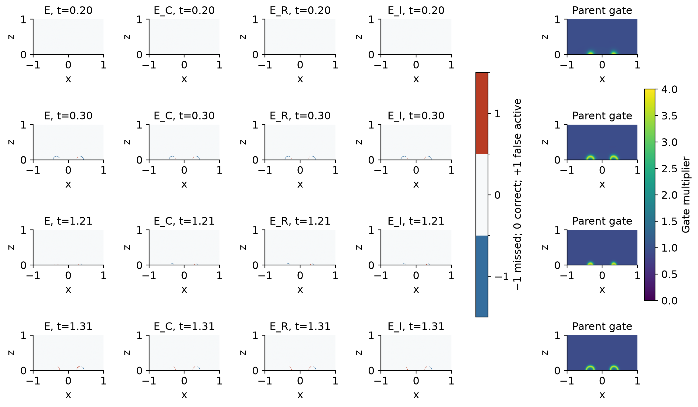

Figure S1. Same complete-domain times, colors and normalization as Figure S3. The gate depends only on the frozen parent, never on reference error. Complete time traces accompany the portable scores; no favorable crop or time was selected from dense truth.

## S11. Updated evidence limits

Among the sixteen pre-revision fixed objects, strict two-cycle success holds for 0/16, 1/16 and 0/16 objects under the original, time-refined and space-refined references, respectively. The sole time-refined crossing is shorter/43/E_I. Its complete original/time/space decision is Fail/Pass/Fail. Historical and newly developed objects are not pooled to estimate a success probability, and a reference-induced status change is not new model capability.

Seed 29, E_R: original-reference increment = none; time-refined-reference increment = none.

Seed 29, E_I: original-reference increment = none; time-refined-reference increment = none.

Seed 43, E_R: original-reference increment = none; time-refined-reference increment = none.

Seed 43, E_I: original-reference increment = none; time-refined-reference increment = strict.

## S12. Limited material mapping and remaining validation

The application inspiration is the coupled wall-cell PCM model of Miquel et al. [8]. Its material is Ge-rich GST, not an oxide. The mapping below identifies shared modeling roles and concrete omissions; it does not transfer its calibrated parameters into this synthetic calculation. The evidence label for the present physical coefficients remains a frozen numerical design, not experimental validation.

| Component | Present numerical object | Source relationship and missing evidence |
| --- | --- | --- |
| State variables | Reduced T and one bounded scalar phase φ | [8] couples multiple phases and composition. Our φ is not a calibrated crystallinity, metallic fraction or chemical population. |
| Geometry and boundaries | Two-dimensional wall cell, top electrode, grounded partial bottom, Robin cooling | [8] supplies device-model motivation; dimensional dimensions, contact resistances, material interfaces and packaging are not identified here. |
| Conductivity | Smooth exp[0.25T + log(8)φ²(3-2φ)] | The feedback role is shared; this formula and its coefficients are synthetic. Measured phase/temperature-dependent transport is absent. |
| Heat and latent contribution | Fixed reduced diffusivity, cooling and latent ratio 0.05 | A quantitative device claim requires mutually consistent heat capacity, conductivity, latent heat and boundary calibration. None is inferred from the present fits. |
| Phase kinetics | A scalar nonconserved temperature-driven phase equation | It omits multi-phase nucleation/composition and oxide electronic/structural order parameters. Theoretical isothermal VO2 switching [14] is a counterexample to assigning every oxide transition solely to our Joule-heating route. |
| Validation quantities | Synthetic current, power, local heating and phase events | Experimental switching trajectories, optical/structural phase observations and material parameters would require independent validation. Algebraic current balance does not provide it. |

Kaltenbacher [13] treats reduced and all-at-once formulations in inverse problems; that is useful context for eliminating a state variable, not a convergence theorem for this neural representation. PINN-Proj [12] enforces specified integral constraints by projection, whereas the present electrical layer solves a local quasi-static boundary problem coupled to T and φ. Neither source makes elimination or differentiable constraints novel in themselves. PDE-CL [15] and hPINN [16] further delimit the constraint-learning precedents. They were not run as additional baselines. The contribution rests on the explicitly defined interface and matched reconstruction evidence.

The 18 September revision executed two clean-parent full-label thermal/phase-residual ablations, whose matched outcomes are reported in S17; they are distinct from the six historical head continuations. Both temporal- and spatial-reference sensitivity have been executed. Neither reference study establishes geometry transfer, material calibration or arbitrary pulse generalization. The separate two-grid predictor-readout comparison is reported in S16 and does not certify arbitrary-grid independence.

## S13. Complete phase-head formulation and visual evidence

### S13.1 Phase representation and attribution

The main elimination study leaves incomplete first-cycle support recall despite accurate electrical readouts. We test the hypothesis that a limited phase parameterization contributes to this mismatch. The hypothesis does not establish sigmoid saturation as its cause, nor imply that adding parameters must help. The two final earlier-pulse E states are used as separate parents. This is subsequent development on two already trained states, not another pair of clean initialization confirmations.

An unchanged continuation, E_C, is compared with an ordinary residual head, E_R, and a parent-interface-modulated residual head, E_I. These identifiers denote methods; the current error in the evaluation equation is a separate functional quantity. Let the original complete logit be ell_θ = logit(φ₀) + 8a(t)h_φ,θ. The residual R_ξ takes the original normalized coordinates as input and uses a 3-32-32-1 tanh MLP with 1217 trainable parameters. The output weight and bias are initially zero. E_R and E_I use identical initial residual tensors, with seeds 916029 and 916043 for the two parents. Their complete initial fields exactly equal those of E_C.

For E_I, a frozen copy of the parent's complete phase function defines

$$g=0.25+0.75\,[4\phi_{\rm parent}(1-\phi_{\rm parent})],\quad c_g=\sqrt{\mathbb E_\rho[g^2]},\quad \hat g=g/c_g. \qquad (S7)$$

The positive floor leaves a correction path outside the parent's predicted interface, including possible missed regions. The scalar c_g is calculated once using the parent's original unlabeled calibration quadrature; it equals 0.2693107755 and 0.2705578194 for seeds 29 and 43. It controls an RMS amplitude, not every gradient norm or the effective optimizer step. The outputs are

$$\phi_R=\operatorname{sigmoid}(\ell_\theta+8aR_\xi),\quad \phi_I=\operatorname{sigmoid}(\ell_\theta+8a\hat gR_\xi). \qquad (S8)$$

Only the gate's parameters are frozen. Its coordinate derivatives, including second spatial derivatives, remain in the phase residual. The two added residuals have equal trainable counts, but E_I has extra frozen parameters and extra function/coordinate-derivative evaluations; it is not equal to E_R in total model storage or work. No logit is recovered by inverting an already saturated phase prediction. One composed phase interface is used by the observation increment, conductivity, electrical solve, Joule deposition, thermal and phase equations, boundaries, initial conditions and inference. Thus the comparison changes representation while preserving the actual coupled PINN objective.

Residual parameterizations have established precedents [11], and gated mixing is already present in the modified-MLP background [2]. The present residual head is neither the original ResNet architecture nor a claim to invent gating. E_C-to-E_R assesses added capacity and its optimization effects. E_R-to-E_I assesses the particular frozen-gate parameterization, including its coordinate-derivative cost. A gain over E_C alone cannot establish an independent gate benefit.

### S13.2 Complete continuation and scoring protocol

For each earlier-pulse seed, all three continuation arms open the existing T/phase parameters and temperature adapter; E_R and E_I additionally open their residual parameters. The unused V head remains frozen. The original seed's a,b, observation measures, thermal/phase scales 4/5 and denominators 3/13 are unchanged. Lambda is fixed at 0.1 from the first update. Each arm receives 600 fresh-Adam updates at learning rate 0.0001 followed by at most 100 complete fixed-target L-BFGS evaluations. The six-arm ceiling is 3600 updates and 600 evaluations. All three arms share the same seed-specific observation and physical sampling streams. No arm is rescued using reference results.

The endpoint is the fixed-budget final accepted state or the optimizer's intrinsic stopping state. All line-search trials are counted and rejected trial states are rolled back. Electrical solve limits are 11400 forward and 11400 adjoint solves per arm. Complete evaluation uses all 126 observation times and the original 32 physical times; at most 34 observation times have nonzero drive. The six new projected predictions require at most 1668 electrical solves. Actual work, extra gate evaluation and coordinate differentiation are reported in Supplement S10.

A representation increment requires the original phase or device criterion against E_C and the corresponding noninferiority to the original E: temperature, top-current and potential errors for the phase criterion; S, phase, temperature, potential and top-current errors for the device criterion. Additional checks of all errors against the parent are reported separately, not added as new eligibility gates. Separately, a first complete strict two-cycle success may be reported when S, phase, temperature, potential, current and power errors remain within the original noninferiority limits against both controls; this does not retroactively pass a failed A/B criterion. Gate independence additionally requires the same kind of gain against E_R, which has the same trainable parameter count. Mixed seed outcomes remain a development signal, not a stable confirmation. The old projected soft models and B_E remain in the tables.

The old soft models do not receive this extra continuation budget. Their rows remain useful reference points, but a new head versus an old F is not an equal-budget network ablation. The new representation attribution comes from E_C/E_R/E_I, whereas the original clean E/F experiment retains its own matched budget and identity.

The independent scoring package contains all fixed arrays and serialized metric definitions. Its evaluator uses only NumPy: it does not load a neural checkpoint or execute a linear solver. It first reproduces the ten historical objects' saved metrics, events and decisions, then evaluates the six new objects and the refined references. Figure rebuilding, array-only rescoring and retraining are separate operations. No local archive is represented as a public dataset or assigned an invented identifier.

### S13.3 All matched results and predeclared maps

The six prescribed coupled PINN continuations and their own electrical projections were completed. Table S16 and Figure S2 retain the parent and continued control alongside both residual heads, which add the same number of trainable parameters. E_I additionally stores a frozen copy of the parent phase head. No new reference enters optimization or checkpoint selection.

Table S16. New-head decisions under the original and time-refined references. A strict capability gain is separate from the phase/device criteria. Gate independence additionally compares E_I with E_R, with equal trainable counts and the extra frozen-gate cost disclosed.

| Reference | Seed | Role | Matched phase | Matched device | Strict increment | Gate independent |
| --- | --- | --- | --- | --- | --- | --- |
| old | 29 | E_R | no | no | no | not a gate |
| old | 29 | E_I | no | no | no | no |
| old | 43 | E_R | no | no | no | not a gate |
| old | 43 | E_I | no | no | no | no |
| refined | 29 | E_R | no | no | no | not a gate |
| refined | 29 | E_I | no | no | no | no |
| refined | 43 | E_R | no | no | no | not a gate |
| refined | 43 | E_I | no | no | yes | yes |

For seed 29, unchanged continuation changes raw phase RMS from 0.01900241 to 0.01754883. This control is necessary because the new heads receive additional optimization.

E_R changes phase RMS by +0.97% and power NRMSE by -3.59% relative to E_C (negative is improvement). Its cycle recalls are 0.886097/0.965721, with onset errors 0.005417/0.000275.

E_I changes phase RMS by -1.58% and power NRMSE by -7.54% relative to E_C (negative is improvement). Its cycle recalls are 0.864128/0.963498, with onset errors 0.001575/0.001525.

For seed 43, unchanged continuation changes raw phase RMS from 0.01861922 to 0.01696354. This control is necessary because the new heads receive additional optimization.

E_R changes phase RMS by -0.61% and power NRMSE by -4.43% relative to E_C (negative is improvement). Its cycle recalls are 0.892181/0.959395, with onset errors 0.003300/0.000783.

E_I changes phase RMS by +2.04% and power NRMSE by -7.24% relative to E_C (negative is improvement). Its cycle recalls are 0.898603/0.962301, with onset errors 0.003750/0.002287.

Neither added head satisfies a predefined phase, device or strict increment against E_C in either parent under the original reference. The additional equal-parameter gate criterion is met in neither parent under the original reference and in 43 under the time-refined reference. A result in only one parent or under only one reference is a bounded development signal. It is not a clean initialization confirmation or a reason to pool different categories across seeds. No independent gate contribution is established under the original reference. The gate is retained as a tested counterfactual rather than added to the main contribution list. The absence of an original-reference increment limits the proposed representation-efficiency explanation without proving that phase representation never matters. The reference-specific strict result is examined separately below.

Figure S2. Both parents are displayed separately. All metrics use the original reference; the two curves in the bottom rows show the two cycles. Dashed horizontal lines retain the original criteria. Update and complete-evaluation caps are matched. E_C retains the original trainable count; E_R/E_I each add 1217 trainable parameters, and E_I additionally evaluates and differentiates a frozen gate. Supplement S10 lists actual counts and both-reference tables.

Figure S3. The four display times were fixed before training (0.20, 0.30, 1.21, 1.31); the complete domain is shown. Blue marks missed activity, rust marks false activity and white marks agreement. The final column is the frozen normalized gate. It is not selected from reference errors. The same complete plot for seed 43 appears in Supplement S10. These maps explain localization descriptively; they do not create an additional training or selection criterion.

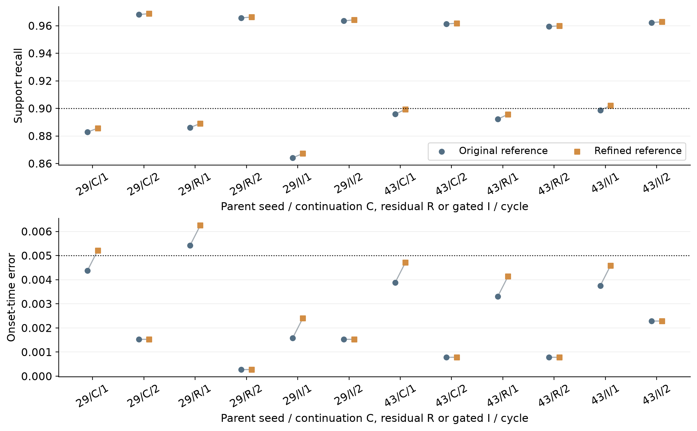

Figure S4. Both cycles of all six fixed new endpoints are displayed. Paired points change the reference only, preserving the predicted fields, event times and active masses. Dotted lines are the original recall and timing requirements; passing these two quantities alone does not replace the complete strict rule. The trace for seed 43, gated head, cycle 1 shows the reference-sensitive crossing without suppressing the other endpoints.

## S14. Complete-rule reference perturbation bounds

### S14.1 Assumptions and sufficient conditions

The original margin plot separates individual error gains. A complete A/B rule also contains noninferiority guards and absolute floors. We now evaluate sufficient conditions for the whole rule from the already saved metrics and time-reference discrepancies; this analysis runs no neural model, reference solver or array rescoring. It neither changes the historical decisions nor supplies new spatial evidence.

For a candidate and comparator with fixed predictions, let e_c and e_b be their errors in the same unnormalized norm, and d > 0 their shared normalization. For S, the reference perturbation is measured by the symmetric-difference distance between reference active sets; for temperature absorb the fixed 0.45 divisor into the norm. Assume a changed reference changes either error by at most r δ, and d by at most r δ_d. The normalizer bound δ_d is zero for fixed normalizers; for current and power, it is set to the corresponding reference RMS discrepancy, which bounds the normalizer change by the reverse triangle inequality. The argument concerns a blockwise reference-distance bound, not a probability distribution. In particular, the bound on active-set distance is separate from the phase RMS bound: an RMS perturbation alone need not control threshold crossings.

$$ |e'_c-e_c|,\ |e'_b-e_b|\leq r\delta,\qquad |d'-d|\leq r\delta_d,\qquad d'>0.\qquad (S9) $$

A relative gain η together with an absolute normalized floor τ requires both inequalities below. Substitution of the worst allowed error changes gives a sufficient condition that retains the original max rule:

$$ (1-\eta)e_b-e_c\geq r(2-\eta)\delta,\qquad e_b-e_c-\tau d\geq r(2\delta+\tau\delta_d).\qquad (S10) $$

For a relative noninferiority allowance ν, either of the following inequalities is sufficient, because the permitted deterioration is the larger of the relative and absolute allowances:

$$ (1+\nu)e_b-e_c\geq r(2+\nu)\delta\quad\mathrm{or}\quad e_b-e_c+\tau d\geq r(2\delta+\tau\delta_d).\qquad (S11) $$

We use η = 0.1, ν = 0.05 and the unchanged metric-specific τ. For each gain the sufficient radius is the smaller branch radius from (S10); for each guard it is the larger branch radius from (S11). The minimum across all required components gives the reported whole-rule sufficient radius, with negative values reported as zero and an originally failed rule still marked failed. Positive-normalizer conditions are retained. This is a conservative guarantee from the chosen inequalities, not the largest true radius permitted by correlated reference errors.

### S14.2 What the saved evidence can and cannot certify

The reference distance at r = 1 is exactly the measured old-to-time-refined discrepancy for each metric block. Using its value to define a perturbation budget does not imply that an unknown spatial reference, the continuum solution or an experiment lies inside that budget. Empirical comparison against the actual refined reference remains the direct evidence.

Table S17. All eight historical comparisons and both rules. “Gain bound” covers the required gain components; “full bound” also requires every noninferiority guard and the absolute floors. Earlier denotes the earlier-pulse protocol; T guard is temperature noninferiority. A radius below one is not a failed empirical comparison or proof of instability.

| Case | Seed | Control | Rule | Original pass | Gain bound | Full bound | Radius r | Limiting test |
| --- | --- | --- | --- | --- | --- | --- | --- | --- |
| Original | 29 | F | A | yes | yes | no | 0.9546 | T guard |
| Original | 29 | F | B | yes | yes | no | 0.9546 | T guard |
| Original | 29 | B_E | A | yes | yes | yes | 1.821 | Phase gain |
| Original | 29 | B_E | B | yes | yes | yes | 3.639 | T guard |
| Original | 43 | F | A | no | no | no | 0 | S gain |
| Original | 43 | F | B | yes | yes | no | 0.695 | T guard |
| Original | 43 | B_E | A | no | no | no | 0 | Phase gain |
| Original | 43 | B_E | B | no | no | no | 0 | Bottom I gain |
| Earlier | 29 | F | A | yes | yes | yes | 1.532 | T guard |
| Earlier | 29 | F | B | yes | yes | yes | 1.532 | T guard |
| Earlier | 29 | B_E | A | yes | yes | yes | 2.953 | T guard |
| Earlier | 29 | B_E | B | yes | yes | yes | 2.953 | T guard |
| Earlier | 43 | F | A | yes | no | no | 0.1399 | S gain |
| Earlier | 43 | F | B | yes | yes | yes | 1.244 | T guard |
| Earlier | 43 | B_E | A | yes | yes | yes | 3.028 | T guard |
| Earlier | 43 | B_E | B | yes | yes | yes | 3.028 | T guard |

All four E/F current-and-power gain pairs admit a certificate at r = 1. The full device rule admits one for the earlier-pulse pairs only. The original-protocol radii are 0.9546 (seed29) and 0.6950 (seed43), both limited by temperature noninferiority; the earlier-pulse radii are 1.5317 and 1.2435. The narrow earlier-pulse seed43 phase rule has radius 0.1399, limited by S, although that rule passes for both references actually evaluated. Across all controls, nine of the sixteen rule instances have a sufficient certificate at r = 1; these are algebraic checks on shared data, not sixteen independent validations.

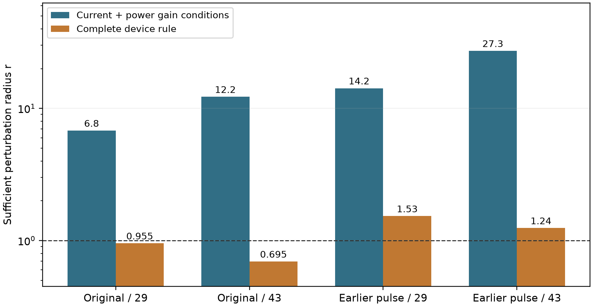

Figure S5. Sufficient perturbation radii for E against F/projected. The dashed line is the observed temporal-reference distance used as a budget, not a confidence threshold. Current and power gain conditions alone allow larger radii than the complete device rule. The complete empirical rule passes under both actual references in all four pairs, including those whose conservative radius is below one. No new reference or learned prediction enters this figure.

The expanded calculation identifies the limiting criterion without selecting a new checkpoint, threshold or comparator. It cannot substitute for the separate spatial-reference experiment now reported in S15. `reference_certificates.py` reproduces this table and the component CSV from the saved scalar records. The small synthetic interval-corner check tests the algebra against the original max rules, not the physical model or empirical success rates.

## S15. Fixed-prediction spatial-reference experiment

### S15.1 Numerical change and common comparison space

Both protocols are solved on 240 × 120 cells with dt = 0.0003125 over [0, 2.5], saving every eighth step. The reference numerical algorithm, coefficients, initial-state formula, contact geometry, tolerances and finite pulse histories are inherited unchanged. Each trajectory takes 8000 main steps with a separate limit of 200000 internal linear solves. These are new numerical references, not new neural training or new physical cases.

All sixteen predicted field arrays and their original 160 × 80 electrical readouts are unchanged. For fine cells c_i and scoring cells C_j, use the exact intersection-volume restriction W. If v_i and V_j denote cell volumes, the following identities preserve constants and domain integrals:

$$ W_{ji}=|C_j\cap c_i|/V_j,\qquad W_{ji}\geq0,\qquad\sum_iW_{ji}=1,\qquad\sum_jV_jW_{ji}=v_i.\qquad(S12) $$

The fine V, T, phase and local Joule density are restricted by W. Their integral consistency is checked on the saved arrays. Terminal current and total power remain the native fine-reference outputs; recomputing them from restricted V would introduce another readout and is not done. The projected neural readouts also are not recomputed on a new grid. Thus the new comparison cannot establish neural electrical-readout grid independence or claim that the mapped fields solve the coarse discrete equations.

The physical heater edges align with faces at both resolutions. The two fine references are compared over the identical physical prefix before the earlier second pulse. Numerical validity and the actual solve counters are retained separately from prediction accuracy. Local deposition and total dissipation identities remain operator-consistency checks, not independent physical validation.

Table S18. Actual work in the two spatial references. O and S denote the original and earlier-pulse protocols. Counts are actual electric, thermal and phase linear solves; a main time step can contain multiple nonlinear blocks and solves. No model evaluation or new prediction projection is included.

| Case | Main steps | Electric | Thermal | Phase | Total | Cap |
| --- | --- | --- | --- | --- | --- | --- |
| O | 8000 | 32093 | 24092 | 28776 | 84961 | 200000 |
| S | 8000 | 32358 | 24357 | 29303 | 86018 | 200000 |

Table S19. Spatial-reference differences from the time-refined 160 × 80 reference. Field discrepancies use the fixed scoring measure after restriction; terminal discrepancies use native reference traces. They are numerical differences, not bounds on continuum error.

| Case | delta S | delta phase | delta T / 0.45 | delta V | delta current | delta power | delta q |
| --- | --- | --- | --- | --- | --- | --- | --- |
| O | 0.000153438 | 0.00249077 | 0.00153315 | 0.000277343 | 0.000635719 | 0.000445387 | 0.0106348 |
| S | 0.000161094 | 0.00257285 | 0.00146987 | 0.000272102 | 0.000598624 | 0.000418359 | 0.0100731 |

### S15.2 Full endpoint comparisons and counterexamples

Table S20. Every fixed endpoint under the spatial reference, including both deterministic interpolants and all six continuations. Percentages multiply the corresponding normalized RMS errors by 100. Strict refers to the original rule evaluated with the mapped phase reference. It is not a native fine-grid qualification. Full S, voltage, bottom-current, local-heat errors and normalization data are in spatial-all-fixed-metrics.csv, which retains all three references and the separately reported errors using the original fixed denominators. Complete two-cycle records are in spatial-all-fixed-events.csv.

| Case | Seed | Method | Phase RMS | T (%) | Current (%) | Power (%) | Energy (%) | Strict |
| --- | --- | --- | --- | --- | --- | --- | --- | --- |
| O | 29 | E | 0.0210621 | 1.1020 | 0.8465 | 0.8486 | 0.1983 | no |
| O | 29 | F | 0.0247498 | 1.1332 | 1.6542 | 1.6911 | 0.0841 | no |
| O | 43 | E | 0.0224575 | 1.0742 | 1.5449 | 1.5631 | 0.5797 | no |
| O | 43 | F | 0.0251648 | 1.0795 | 3.0253 | 3.1291 | 1.1415 | no |
| O | - | B_E | 0.0233096 | 1.3568 | 1.7265 | 1.7535 | 1.2607 | no |
| S | 29 | E | 0.0199363 | 1.1343 | 0.9753 | 0.9780 | 0.2079 | no |
| S | 29 | F | 0.0244496 | 1.2001 | 2.2405 | 2.3040 | 0.6265 | no |
| S | 43 | E | 0.0197631 | 1.1320 | 0.6716 | 0.6594 | 0.0831 | no |
| S | 43 | F | 0.0240993 | 1.1748 | 2.9740 | 3.0754 | 0.1776 | no |
| S | - | B_E | 0.0252168 | 1.3065 | 2.0286 | 2.0738 | 1.5843 | no |
| S | 29 | E_C | 0.0185289 | 1.0761 | 0.9316 | 0.9364 | 0.4039 | no |
| S | 29 | E_R | 0.0187046 | 1.0812 | 0.9018 | 0.9057 | 0.3348 | no |
| S | 29 | E_I | 0.0182133 | 1.0799 | 0.8687 | 0.8644 | 0.3385 | no |
| S | 43 | E_C | 0.0181189 | 1.0743 | 0.6101 | 0.6005 | 0.0714 | no |
| S | 43 | E_R | 0.0179964 | 1.0814 | 0.5894 | 0.5749 | 0.0332 | no |
| S | 43 | E_I | 0.0184664 | 1.0867 | 0.5761 | 0.5632 | 0.0172 | no |

Table S21. All eight historical comparisons, both rules and all three references. The gain columns are relative error reductions under the spatial reference. The complete A/B flags include the original absolute floors and noninferiority tests. Rows are related comparisons, not independent statistical samples.

| Case | Seed | Control | Old A/B | Time A/B | Space A/B | Current gain (%) | Power gain (%) |
| --- | --- | --- | --- | --- | --- | --- | --- |
| O | 29 | F | yes/yes | yes/yes | yes/yes | 48.82 | 49.82 |
| O | 29 | B_E | yes/yes | yes/yes | no/yes | 50.97 | 51.60 |
| O | 43 | F | no/yes | no/yes | no/yes | 48.93 | 50.05 |
| O | 43 | B_E | no/no | no/no | no/yes | 10.52 | 10.86 |
| S | 29 | F | yes/yes | yes/yes | yes/yes | 56.47 | 57.55 |
| S | 29 | B_E | yes/yes | yes/yes | yes/yes | 51.92 | 52.84 |
| S | 43 | F | yes/yes | yes/yes | no/yes | 77.42 | 78.56 |
| S | 43 | B_E | yes/yes | yes/yes | yes/yes | 66.90 | 68.21 |

Table S22. All phase-head continuation decisions under all three references. Matched A/B include the continued E_C control and the required parent noninferiority checks. A reference-specific strict crossing is kept separate from a reproducible matched phase or device gain. No threshold, endpoint or architecture is changed.

| Reference | Seed | Role | Matched A | Matched B | Strict increment | Strict capability |
| --- | --- | --- | --- | --- | --- | --- |
| old | 29 | E_R | no | no | no | no |
| old | 29 | E_I | no | no | no | no |
| old | 43 | E_R | no | no | no | no |
| old | 43 | E_I | no | no | no | no |
| refined | 29 | E_R | no | no | no | no |
| refined | 29 | E_I | no | no | no | no |
| refined | 43 | E_R | no | no | no | no |
| refined | 43 | E_I | no | no | yes | yes |
| spatial | 29 | E_R | no | no | no | no |
| spatial | 29 | E_I | no | no | no | no |
| spatial | 43 | E_R | no | no | no | no |
| spatial | 43 | E_I | no | no | no | no |

Table S23. The previously reference-sensitive gated seed-43 continuation, with identical predicted fields and event times in all rows. The first-cycle recall requirement is 0.9 and the timing requirement is 0.005 for each cycle; these displayed components alone do not replace the complete strict rule. All other endpoint/cycle records remain in spatial-all-fixed-events.csv and their complete decisions in Table S22. The spatial result removes the earlier reference-specific strict crossing.

| Reference | Recall 1 | Timing 1 | Recall 2 | Timing 2 | Strict |
| --- | --- | --- | --- | --- | --- |
| old | 0.898602974 | 0.003750000 | 0.962301248 | 0.002287500 | no |
| refined | 0.902063024 | 0.004583333 | 0.962842466 | 0.002287500 | yes |
| spatial | 0.897526906 | 0.004050000 | 0.962278876 | 0.004787500 | no |

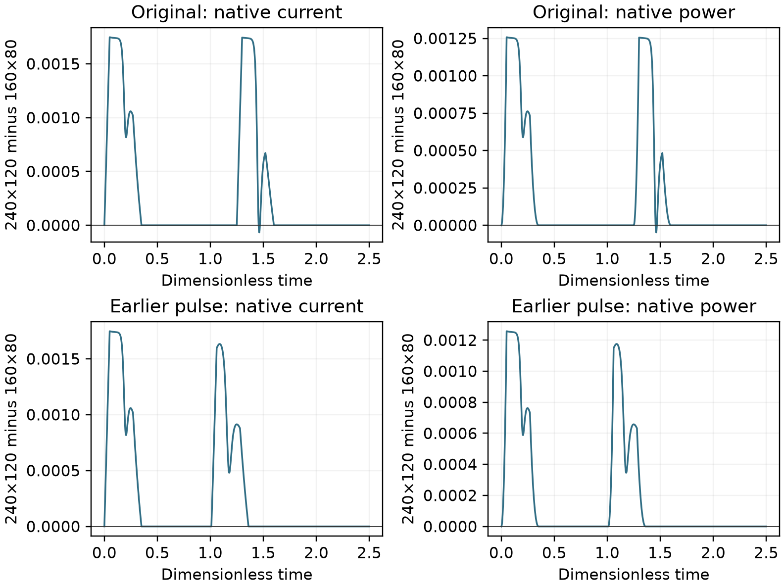

Figure S6. Native fine-reference current and power minus the time-refined reference traces, with the original two protocols shown separately. Fields used for scoring are restricted, but the terminal quantities plotted here are not recomputed from those restricted fields. These traces contain no new model prediction.

### S15.3 Thresholding and restriction do not commute

The primary score thresholds W phi_h at 0.5. A separately named diagnostic restricts the fine active indicator instead. For the fixed coarse binary prediction P, define a = W 1(phi_h >= 0.5) and b = 1(W phi_h >= 0.5). The alternative support and symmetric difference integrate the fractional overlap with the same predicted set. The reverse triangle inequality gives the following bound in the fixed space-time measure mu:

$$ |S(P,a)-S(P,b)|\leq\int|a-b|\,d\mu.\qquad(S13) $$

This diagnostic interprets P as constant within each scoring cell. It does not evaluate the network on native fine points. The primary diagnostic reproduces the frozen scorer's S, overlap, predicted/reference support masses and recall before the alternative mapping is compared. Both mappings retain the original global trapezoidal time weights and heating-window selection. The alternative scores cannot replace a less favorable primary decision.

Table S24. Threshold-map discrepancy for every fixed object. S primary uses thresholded restricted phase; S indicator uses restricted fine active fraction. The common bound depends on the reference mapping, whereas the realized score change also depends on the fixed prediction. Full per-cycle masses and recall differences are retained in spatial-threshold-events.csv.

| Case | Seed | Method | S primary | S indicator | Absolute gap | Bound |
| --- | --- | --- | --- | --- | --- | --- |
| O | 29 | E | 0.001105703 | 0.0011802 | 7.449653e-05 | 0.0004206944 |
| O | 29 | F | 0.001286562 | 0.001352448 | 6.588542e-05 | 0.0004206944 |
| O | 43 | E | 0.001189141 | 0.001252891 | 6.375e-05 | 0.0004206944 |
| O | 43 | F | 0.001300938 | 0.001370955 | 7.001736e-05 | 0.0004206944 |
| O | - | B_E | 0.001360156 | 0.001419757 | 5.960069e-05 | 0.0004206944 |
| S | 29 | E | 0.001146484 | 0.001232786 | 8.630208e-05 | 0.0004612674 |
| S | 29 | F | 0.001310469 | 0.001383229 | 7.276042e-05 | 0.0004612674 |
| S | 43 | E | 0.001155078 | 0.001235634 | 8.055556e-05 | 0.0004612674 |
| S | 43 | F | 0.001262734 | 0.001344523 | 8.178819e-05 | 0.0004612674 |
| S | - | B_E | 0.001536875 | 0.00160151 | 6.463542e-05 | 0.0004612674 |
| S | 29 | E_C | 0.001052109 | 0.00114046 | 8.835069e-05 | 0.0004612674 |
| S | 29 | E_R | 0.001072656 | 0.001162049 | 8.939236e-05 | 0.0004612674 |
| S | 29 | E_I | 0.001007422 | 0.001103394 | 9.597222e-05 | 0.0004612674 |
| S | 43 | E_C | 0.001053281 | 0.001128333 | 7.505208e-05 | 0.0004612674 |
| S | 43 | E_R | 0.001053516 | 0.00112645 | 7.293403e-05 | 0.0004612674 |
| S | 43 | E_I | 0.001085234 | 0.001157613 | 7.237847e-05 | 0.0004612674 |

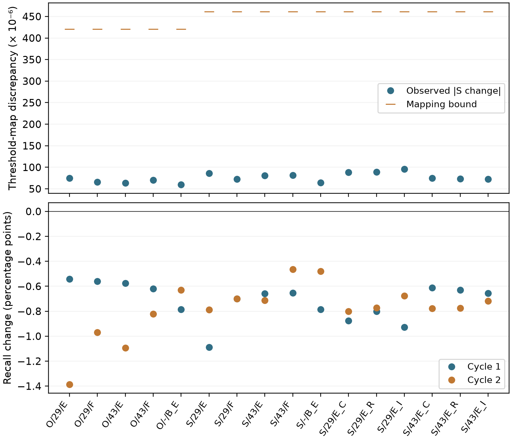

Figure S7. Report-only consequences of exchanging thresholding and restriction. All sixteen fixed objects are retained. Upper panel: observed S changes and the mapping bound. Lower panel: alternative-minus-primary recall changes in both cycles. These are not additional model results or new gate outcomes.

### S15.4 Reproduction and evidence boundary

The spatial extension is kept separately in outputs/runs/20260917-lf11-spatial-reference: native result files, mapped references, the restricted indicators, source snapshots, intents, terminal counters and complete scores. The original array archive remains unchanged. phk_v23_spatial_reference.py generates the two trajectories; spatial_analysis.py consumes only completed references and archived prediction arrays; spatial_report.py produces the tables and figures. No scientific execution occurs in the document build.

Two space resolutions at one fixed time step do not identify a reliable convergence order. Both use the same numerical algorithm, and field comparisons include a specified restriction. The experiment therefore extends the tested numerical-reference range without supplying an independent solver, continuum truth, zero-shot transfer or material validation. Stable strict capability, independent remaining-PDE necessity and isolated VJP causality remain separate claims.

The saved-data outcome is 4/4 complete historical E/F device passes under the spatial reference. Historical decision changes from the time-refined reference are: original seed 29, E/B_E, A: True to False; original seed 43, E/B_E, B: False to True; shorter seed 43, E/F, A: True to False. Spatial-reference strict objects are: none. Actual reference work totals 170979 internal linear solves across the two fixed trajectories. These statements are generated from the complete saved result tables, without selecting a favorable model or case.

## S16. Common prediction-side electrical readers

The one added reader is 240 × 120, not another reference solver or another learned model. Original T/phase and event arrays remain unchanged. Fine potential is volume-restricted only for the original E_V guard. The restriction has nonnegative weights, unit row sums and the correct column mass; the portable NumPy implementation agrees with the inherited overlap operator to 6.7 × 10⁻¹⁶ on its targeted check. Native fine currents and power remain native. Scalar electrical residual accuracy is checked by the original solver tolerance, 10⁻¹⁰.

Table S25. Named port errors under the same spatial reference. The interpolant is shared by the two seeds within each protocol.

| Case | Seed | Method | I 160 (%) | I 240 (%) | P 160 (%) | P 240 (%) |
| --- | --- | --- | --- | --- | --- | --- |
| original | 29 | E | 0.846544 | 0.883264 | 0.848639 | 0.889983 |
| original | 29 | F | 1.65417 | 1.66733 | 1.69108 | 1.707 |
| original | 29 | B_E | 1.72646 | 1.61121 | 1.7535 | 1.63659 |
| original | 43 | E | 1.54488 | 1.59785 | 1.56307 | 1.62156 |
| original | 43 | F | 3.02531 | 3.07484 | 3.12907 | 3.18207 |
| original | 43 | B_E | 1.72646 | 1.61121 | 1.7535 | 1.63659 |
| shorter | 29 | E | 0.975299 | 1.01558 | 0.978039 | 1.0237 |
| shorter | 29 | F | 2.2405 | 2.27681 | 2.304 | 2.34323 |
| shorter | 29 | B_E | 2.02859 | 1.90429 | 2.07382 | 1.9475 |
| shorter | 43 | E | 0.671563 | 0.70046 | 0.659362 | 0.694693 |
| shorter | 43 | F | 2.97401 | 2.98378 | 3.07541 | 3.08711 |
| shorter | 43 | B_E | 2.02859 | 1.90429 | 2.07382 | 1.9475 |

Table S26. Complete phase and device decisions under each reference and reader. These are related sensitivity comparisons, not independent trials. Full metric values, percentage-point differences, relative changes and event failures are retained in reader-all-metrics.csv, reader-all-effects.csv and reader-all-events.csv.

| Reference | Reader | Case | Seed | Control | A | B |
| --- | --- | --- | --- | --- | --- | --- |
| old | coarse | original | 29 | E_vs_F | Pass | Pass |
| old | coarse | original | 29 | E_vs_B_E | Pass | Pass |
| old | coarse | original | 43 | E_vs_F | Fail | Pass |
| old | coarse | original | 43 | E_vs_B_E | Fail | Fail |
| old | coarse | shorter | 29 | E_vs_F | Pass | Pass |
| old | coarse | shorter | 29 | E_vs_B_E | Pass | Pass |
| old | coarse | shorter | 29 | E_vs_D_E | Fail | Fail |
| old | coarse | shorter | 43 | E_vs_F | Pass | Pass |
| old | coarse | shorter | 43 | E_vs_B_E | Pass | Pass |
| old | coarse | shorter | 43 | E_vs_D_E | Fail | Fail |
| old | fine | original | 29 | E_vs_F | Pass | Pass |
| old | fine | original | 29 | E_vs_B_E | Pass | Pass |
| old | fine | original | 43 | E_vs_F | Fail | Pass |
| old | fine | original | 43 | E_vs_B_E | Fail | Fail |
| old | fine | shorter | 29 | E_vs_F | Pass | Pass |
| old | fine | shorter | 29 | E_vs_B_E | Pass | Pass |
| old | fine | shorter | 29 | E_vs_D_E | Fail | Fail |
| old | fine | shorter | 43 | E_vs_F | Pass | Pass |
| old | fine | shorter | 43 | E_vs_B_E | Pass | Pass |
| old | fine | shorter | 43 | E_vs_D_E | Fail | Fail |
| refined | coarse | original | 29 | E_vs_F | Pass | Pass |
| refined | coarse | original | 29 | E_vs_B_E | Pass | Pass |
| refined | coarse | original | 43 | E_vs_F | Fail | Pass |
| refined | coarse | original | 43 | E_vs_B_E | Fail | Fail |
| refined | coarse | shorter | 29 | E_vs_F | Pass | Pass |
| refined | coarse | shorter | 29 | E_vs_B_E | Pass | Pass |
| refined | coarse | shorter | 29 | E_vs_D_E | Fail | Fail |
| refined | coarse | shorter | 43 | E_vs_F | Pass | Pass |
| refined | coarse | shorter | 43 | E_vs_B_E | Pass | Pass |
| refined | coarse | shorter | 43 | E_vs_D_E | Fail | Fail |
| refined | fine | original | 29 | E_vs_F | Pass | Pass |
| refined | fine | original | 29 | E_vs_B_E | Pass | Pass |
| refined | fine | original | 43 | E_vs_F | Fail | Pass |
| refined | fine | original | 43 | E_vs_B_E | Fail | Fail |
| refined | fine | shorter | 29 | E_vs_F | Pass | Pass |
| refined | fine | shorter | 29 | E_vs_B_E | Pass | Pass |
| refined | fine | shorter | 29 | E_vs_D_E | Fail | Fail |
| refined | fine | shorter | 43 | E_vs_F | Pass | Pass |
| refined | fine | shorter | 43 | E_vs_B_E | Pass | Pass |
| refined | fine | shorter | 43 | E_vs_D_E | Fail | Fail |
| spatial | coarse | original | 29 | E_vs_F | Pass | Pass |
| spatial | coarse | original | 29 | E_vs_B_E | Fail | Pass |
| spatial | coarse | original | 43 | E_vs_F | Fail | Pass |
| spatial | coarse | original | 43 | E_vs_B_E | Fail | Pass |
| spatial | coarse | shorter | 29 | E_vs_F | Pass | Pass |
| spatial | coarse | shorter | 29 | E_vs_B_E | Pass | Pass |
| spatial | coarse | shorter | 29 | E_vs_D_E | Fail | Fail |
| spatial | coarse | shorter | 43 | E_vs_F | Fail | Pass |
| spatial | coarse | shorter | 43 | E_vs_B_E | Pass | Pass |
| spatial | coarse | shorter | 43 | E_vs_D_E | Fail | Fail |
| spatial | fine | original | 29 | E_vs_F | Pass | Pass |
| spatial | fine | original | 29 | E_vs_B_E | Fail | Pass |
| spatial | fine | original | 43 | E_vs_F | Fail | Pass |
| spatial | fine | original | 43 | E_vs_B_E | Fail | Fail |
| spatial | fine | shorter | 29 | E_vs_F | Pass | Pass |
| spatial | fine | shorter | 29 | E_vs_B_E | Pass | Pass |
| spatial | fine | shorter | 29 | E_vs_D_E | Fail | Fail |
| spatial | fine | shorter | 43 | E_vs_F | Fail | Pass |
| spatial | fine | shorter | 43 | E_vs_B_E | Pass | Pass |
| spatial | fine | shorter | 43 | E_vs_D_E | Fail | Fail |

Local-q errors on the native 240 × 120 reference appear in the separately named native_240_local_q_NRMSE field. Restricted-q diagnostics against all three coarse comparison fields use another measure and are not pooled with that native error. No binary phase map is interpolated for the primary decisions.

## S17. Two clean residual controls and actual work

Neither clean pair meets either prescribed residual-increment criterion under any of the three references or two readers. D_E has lower raw phase, current and power RMS errors throughout these comparisons, with other outcomes mixed. This bounded counterexample does not prove equivalence or universal residual redundancy.

Table S27. Clean E/D_E primary outcomes under the spatial reference. The historical E states are reused without re-selection; both new D_E branches start from their corresponding observation-only parent.

| Seed | Role | Reader | Raw phase RMS | T (%) | I (%) | P (%) | Energy (%) | Strict |
| --- | --- | --- | --- | --- | --- | --- | --- | --- |
| 29 | E | coarse | 0.0199363 | 1.1343 | 0.975299 | 0.978039 | 0.207855 | Fail |
| 29 | D_E | coarse | 0.0194683 | 1.12366 | 0.912585 | 0.913711 | 0.224811 | Fail |
| 29 | E | fine | 0.0199363 | 1.1343 | 1.01558 | 1.0237 | 0.339081 | Fail |
| 29 | D_E | fine | 0.0194683 | 1.12366 | 0.958122 | 0.965194 | 0.356283 | Fail |
| 43 | E | coarse | 0.0197631 | 1.13198 | 0.671563 | 0.659362 | 0.0830656 | Fail |
| 43 | D_E | coarse | 0.0197085 | 1.12266 | 0.628264 | 0.603628 | 0.00881096 | Fail |
| 43 | E | fine | 0.0197631 | 1.13198 | 0.70046 | 0.694693 | 0.209628 | Fail |
| 43 | D_E | fine | 0.0197085 | 1.12266 | 0.642947 | 0.624503 | 0.117827 | Fail |

Table S28. Same-pool independent audit components. Thermal and phase are the existing scaled mean-square components, before their common outer factor. They are not field errors or additional reference observations.

| Seed | Role | Observation | Thermal | Phase | Boundary |
| --- | --- | --- | --- | --- | --- |
| 29 | E | 4.00548e-05 | 0.00447772 | 0.000747455 | 0.0390204 |
| 29 | D_E | 3.87795e-05 | 0.00441878 | 0.000713304 | 0.0367456 |
| 43 | E | 3.62589e-05 | 0.0220562 | 0.00127749 | 0.0285475 |
| 43 | D_E | 3.57063e-05 | 0.0220025 | 0.00125406 | 0.0262824 |

Actual new work comprises 3000 Adam updates and 600 complete optimizer evaluations. Training uses 23586 electrical forward solves and 23586 adjoint solves. Historical fine readers use 2780 forwards; the two D_E readers use 1112. Targeted checks and fixed audits use 210 forwards and 10 adjoints. Total forwards/adjoints are 27688/23596. No new reference trajectory is generated. Forward, adjoint, optimizer-update and complete-evaluation counts describe different work units; no equal-work or speedup conclusion follows from equal optimizer caps.

The value and first-order gradient of E minus D_E equal the removed interior package in the targeted two-parent check; relative gradient differences are below 4 × 10⁻¹³. Voltage-observation gradients remain nonzero in both T and phase heads. Eight locked historical models pass the GPU batching check. These validate the new interfaces, not a new physical claim or a repeated global VJP campaign.

## S18. Fixed-array mechanism diagnostics

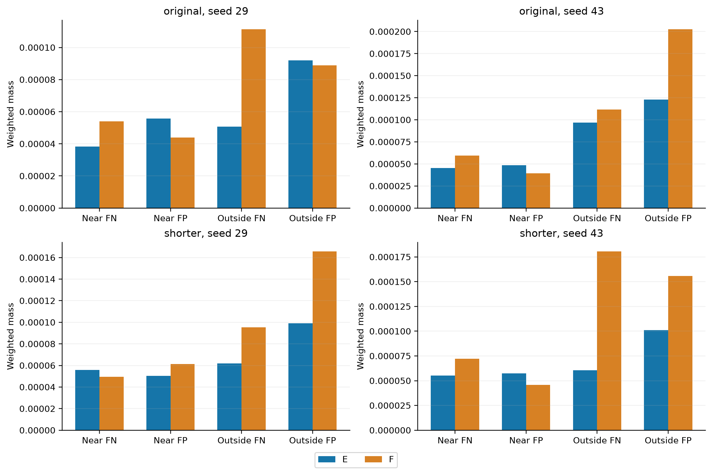

Figure S8. Weighted false-negative and false-positive masses inside and outside the predeclared |φ_ref-0.5| ≤ 0.05 band, with heating windows and the original global time-volume measure. Both regions and both models are retained in every pair. These are descriptive decompositions; space-time points are not independent statistical samples.

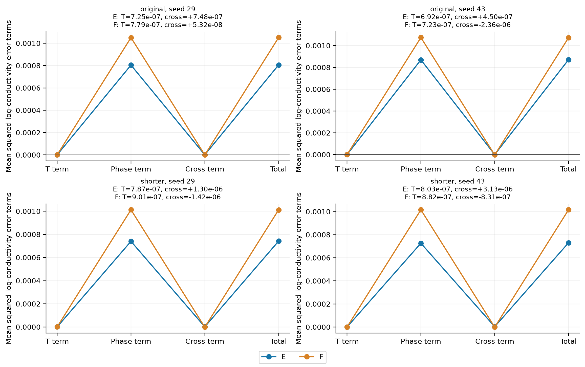

Figure S9. Squared-error terms of the exact log-conductivity identity: temperature, phase, signed cross term and total. Panel annotations retain the small temperature and signed cross values that are difficult to resolve on the common linear axis. The cross term permits cancellation. Neither marginal term is an isolated causal contribution to terminal error, and the identity is not a residual-weighting prescription.

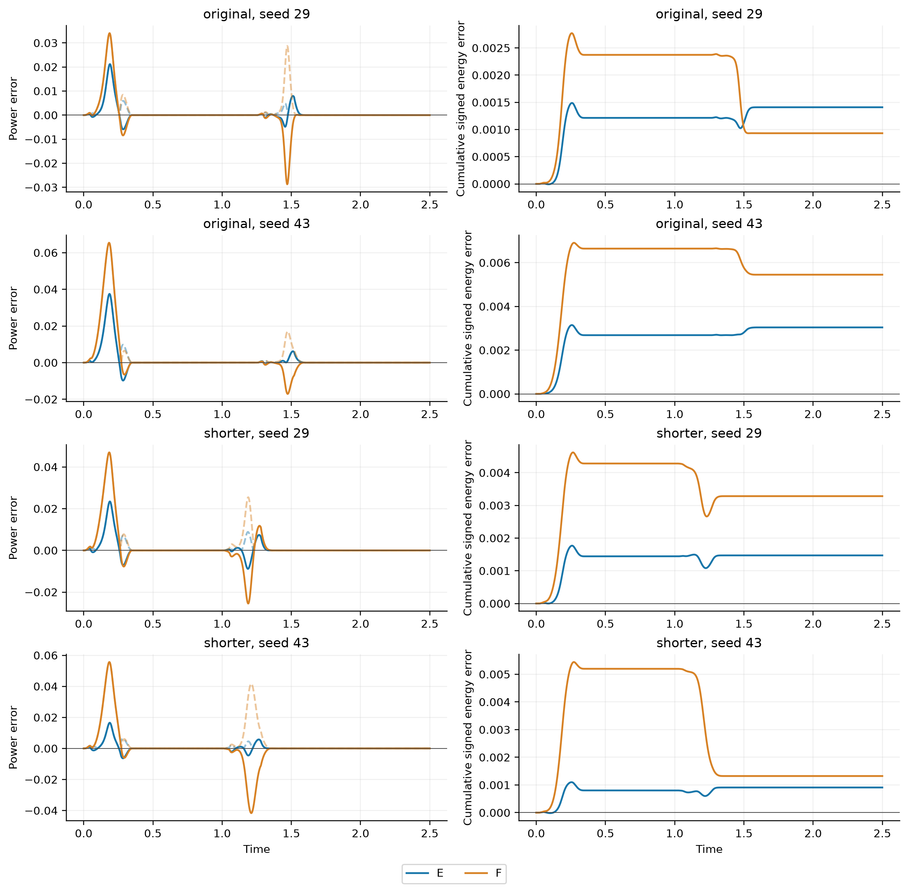

Figure S10. Fine-reader signed power error (solid), its absolute value (dashed) and cumulative signed energy error under the spatial reference. All four pairs are retained. An integral can benefit from error cancellation even when the trajectory error is worse; the complete numerical comparisons remain in the accompanying CSV files.

## S19. The 18 September reproduction package and submission boundary

The local archive provides six reference trajectories (two protocols times three reference conditions), all historical fixed arrays and six negative continuation endpoints, twelve finer-reader objects, the two new controls at both reader levels, coordinates, weights, masks, mappings and frozen scoring rules. There are eighteen scientific objects and thirty stored object/reader combinations, not thirty independent models. Checkpoints, matched parents, sparse inputs, configurations, actual runtime code and environments support a separate training-reproduction level. No external group has retrained these models in this revision.

The primary analysis and one isolated-directory array rescore agree at rtol=2e-10 and atol=2e-12; all Boolean decisions agree exactly. The scorer imports NumPy only, performs no neural queries or linear solves, and reproduces the historical temporal/spatial scores before combining them with the new reader/control results. The optional native-port override changes where supplied port traces originate, not the frozen metric or comparison formulas. A separate finite-volume recomputation from each stored native prediction checks the supplied traces without solving the system.

Manuscript rebuilding consumes only saved tables, figures and references. Fixed-array rescoring is a different level from regenerating predictions or training. The complete local arrays are not yet public; the availability statement must not claim otherwise. Author identities, affiliations, contributions, funding, competing interests, final AI disclosures and the eventual journal-specific submission materials require truthful author completion. Internal AI-assisted checks are not peer review.

## S20. Second-cycle phase-gap experiment

### S20.1 Visible data, matching and frozen selection rules

The sole protocol is the existing shorter pulse history. W=[1.01,2.02] removes 11,781 positive-time phase labels; 17,094 remain. V/T each keep 28,875 labels. There are 126 original observation times and 231 spatial sites. Phase has 75 visible times including the analytic initial map; the last preceding and first following observed times are 1.00 and 2.04. There is no original observation at 1.01; the observation at 2.02 is withheld. Post-window phase remains visible, making this offline reconstruction.

The physically exported package separates V, T and visible phase indices/values. Hidden phase is removed before logit conversion, statistics, parent fitting, interface selection, calibration and baseline construction. The original coordinate quadrature is restricted and normalized per field; time weights are not recomputed across a gap. A straddling cell is retained only when all its original adjacent corners are visible. There are 173 retained cells and 476 endpoints. Phase keeps the half-global/half-interface measure. The common four-time proposal retains all V/T temporal support and uses exact inverse-probability correction for each field. Complete-objective closures evaluate the fixed target. Known initial phase has zero observation mass and remains exact in the output map.

Each seed, 29 then 43, creates a fresh observation-only parent, new calibration and new fixed pools. Both parents are established before branches run in order 29/E, 29/D_E, 29/F, 43/E, 43/D_E, 43/F. No complete-label trained state, calibration, interface pool or hidden-label statistic is imported. Within a seed, branches share the parent, architecture, observation boundary, calibration and fixed physical pools; only the named objective/method difference changes. B_E uses field-specific visible-time PCHIP and the inherited spatial/initial/boundary rules, allowing legal interpolation across the missing phase segment. B_E uses no interior V labels and is one shared object.

Parents use 2400 Adam updates at learning rate 0.001 and at most 200 complete evaluations per head. Each branch uses 1500 Adam updates at 0.0001, followed by at most 300 complete evaluations. Adam betas are (0.9,0.999), epsilon is 1e-8, and clipping is 10. Lambda rises linearly to 0.1 over 200 steps. Four observation times, 128 physical cells per window, four physical windows, and eight fixed times per window retain the preceding recipe. L-BFGS uses learning rate 1, history 50, max_iter=1 per continued step, max_eval=32, strong-Wolfe search, gradient tolerance 1e-10 and change tolerance 1e-14. Every trial/repeated closure counts; cap interruption rolls back to the last accepted state. No reference metric chooses a checkpoint, seed or extra run.

The primary A_w is the original phase-comparison rule applied to W with its own normalization. Outside weights integrate the two remaining segments separately. Window plus outside unnormalized integrals exactly reconstruct the full-history integrals. The full A/B, strict-event and E/F/B_E comparisons retain all original rules. Two initializations are the independent optimization units; three references and two readers are repeated sensitivity evaluations of those states.

### S20.2 Complete outcomes and outside costs

Neither initialization establishes the complete phase-gap criterion against D_E under the three references and two readers. Across those conditions, relative phase-RMS reductions of E against D_E range from -4.23% to 1.23%; negative reduction means larger E error. Outside-window noninferiority costs occur in 6 of the twelve primary comparison conditions. The affected quantities are top-current NRMSE, potential RMS, bottom-current NRMSE, power-trace NRMSE, with every condition retained in the comparison table. All seven B1 objects fail the complete strict two-cycle rule under every tested reference and reader.

Table S29. Every primary A_w, original full A/B and outside-cost decision.

| Reference | Reader | Seed | A_w | Full A | Full B | Outside cost |
| --- | --- | --- | --- | --- | --- | --- |
| old | coarse | 29 | False | False | False | False |
| old | coarse | 43 | False | False | False | True |
| old | fine | 29 | False | False | False | False |
| old | fine | 43 | False | False | False | True |
| refined | coarse | 29 | False | False | False | False |
| refined | coarse | 43 | False | False | False | True |
| refined | fine | 29 | False | False | False | False |
| refined | fine | 43 | False | False | False | True |
| spatial | coarse | 29 | False | False | False | False |
| spatial | coarse | 43 | False | False | False | True |
| spatial | fine | 29 | False | False | False | False |
| spatial | fine | 43 | False | False | False | True |

Table S30. All seven B1 objects in W for each reference with the fine reader. S and V RMS are multiplied by 1000; phase RMS is raw; T and device errors are percentages. Coarse-reader counterparts and all normalization denominators are in the complete CSV/JSON records.

| Reference | Seed | Role | 1000 S | Phase RMS | T (%) | 1000 V RMS | I (%) | P (%) |
| --- | --- | --- | --- | --- | --- | --- | --- | --- |
| old | 29 | E | 8.899869 | 0.1022227 | 1.095565 | 2.151329 | 1.161481 | 1.180052 |
| old | 29 | D_E | 9.030786 | 0.1034945 | 1.092404 | 2.229484 | 1.212328 | 1.231138 |
| old | 29 | F | 7.848082 | 0.1228892 | 1.126618 | 14.82552 | 8.942226 | 8.404674 |
| old | 43 | E | 7.946705 | 0.08994578 | 1.065571 | 1.992899 | 0.9924354 | 1.014847 |
| old | 43 | D_E | 7.550472 | 0.08629937 | 1.082989 | 2.094618 | 1.055129 | 1.072431 |
| old | 43 | F | 7.848082 | 0.109895 | 1.075193 | 14.7209 | 8.880371 | 8.363551 |
| old | shared | B_E | 7.848082 | 0.1287168 | 1.386183 | 15.0078 | 9.067829 | 8.536702 |
| refined | 29 | E | 8.8902 | 0.1021466 | 1.100431 | 2.155777 | 1.16727 | 1.186997 |
| refined | 29 | D_E | 9.021504 | 0.1034231 | 1.096679 | 2.236125 | 1.218719 | 1.238736 |
| refined | 29 | F | 7.857364 | 0.1229673 | 1.13352 | 14.79181 | 8.922121 | 8.383322 |
| refined | 43 | E | 7.936649 | 0.08985389 | 1.068317 | 1.998725 | 1.002432 | 1.025996 |
| refined | 43 | D_E | 7.540416 | 0.08620665 | 1.086308 | 2.098279 | 1.063037 | 1.081589 |
| refined | 43 | F | 7.857364 | 0.1099421 | 1.078679 | 14.68683 | 8.860038 | 8.341979 |
| refined | shared | B_E | 7.857364 | 0.128793 | 1.397548 | 14.97365 | 9.047469 | 8.515081 |
| spatial | 29 | E | 8.924234 | 0.1024083 | 1.140012 | 2.054237 | 1.104877 | 1.119929 |
| spatial | 29 | D_E | 9.042002 | 0.1035477 | 1.13479 | 2.12461 | 1.155608 | 1.170822 |
| spatial | 29 | F | 7.750232 | 0.1218823 | 1.168879 | 14.87864 | 8.96009 | 8.422072 |
| spatial | 43 | E | 8.008199 | 0.09062553 | 1.107469 | 1.91224 | 0.9310221 | 0.9504296 |
| spatial | 43 | D_E | 7.61158 | 0.0869874 | 1.126886 | 2.015998 | 0.9961189 | 1.009891 |
| spatial | 43 | F | 7.750232 | 0.1091476 | 1.119424 | 14.77823 | 8.900238 | 8.383013 |
| spatial | shared | B_E | 7.750232 | 0.1278084 | 1.413755 | 15.06684 | 9.088462 | 8.556938 |

Table S31. Outside-window errors with their own normalization and disjoint integration intervals.

| Reference | Seed | Role | 1000 S | Phase RMS | T (%) | 1000 V RMS | I (%) | P (%) |
| --- | --- | --- | --- | --- | --- | --- | --- | --- |
| old | 29 | E | 0.7454646 | 0.0142673 | 1.129135 | 0.6279042 | 0.4034036 | 0.3769889 |
| old | 29 | D_E | 0.7708945 | 0.01504471 | 1.13678 | 0.8256298 | 0.5556417 | 0.5457514 |
| old | 29 | F | 0.9380243 | 0.01745175 | 1.15861 | 0.6820485 | 0.4720892 | 0.4309892 |
| old | 43 | E | 0.7811189 | 0.01395316 | 1.135339 | 0.4658619 | 0.2641118 | 0.2559254 |
| old | 43 | D_E | 0.7714188 | 0.01383545 | 1.140031 | 0.4229097 | 0.242175 | 0.2309851 |
| old | 43 | F | 0.7919987 | 0.01420162 | 1.122452 | 0.3961149 | 0.2495384 | 0.2202244 |
| old | shared | B_E | 1.218016 | 0.02197274 | 1.202738 | 2.156241 | 1.579582 | 1.610296 |
| refined | 29 | E | 0.7402213 | 0.01424067 | 1.134715 | 0.6589287 | 0.4306401 | 0.4116435 |
| refined | 29 | D_E | 0.7672242 | 0.01502684 | 1.142071 | 0.8645015 | 0.5881293 | 0.5838219 |
| refined | 29 | F | 0.9319945 | 0.01739853 | 1.164193 | 0.7013797 | 0.4856444 | 0.4512434 |
| refined | 43 | E | 0.7766621 | 0.01390632 | 1.139049 | 0.4484812 | 0.2514134 | 0.2439523 |
| refined | 43 | D_E | 0.7674864 | 0.01379157 | 1.143818 | 0.4134169 | 0.237267 | 0.2278371 |
| refined | 43 | F | 0.7864933 | 0.01414108 | 1.125391 | 0.3700367 | 0.2255676 | 0.1953558 |
| refined | shared | B_E | 1.21251 | 0.021905 | 1.214851 | 2.095626 | 1.532761 | 1.562507 |
| spatial | 29 | E | 0.8070732 | 0.01519032 | 1.151322 | 0.5978549 | 0.3920541 | 0.3629395 |
| spatial | 29 | D_E | 0.8317167 | 0.01593927 | 1.15984 | 0.7931931 | 0.5409205 | 0.5288679 |
| spatial | 29 | F | 0.9899329 | 0.01828633 | 1.184432 | 0.6460421 | 0.4586552 | 0.4133226 |
| spatial | 43 | E | 0.8600304 | 0.01507016 | 1.163474 | 0.463745 | 0.2730535 | 0.2673639 |
| spatial | 43 | D_E | 0.8495438 | 0.01495246 | 1.168093 | 0.4169228 | 0.2507114 | 0.2422782 |
| spatial | 43 | F | 0.8601615 | 0.0151922 | 1.147991 | 0.3852797 | 0.2613335 | 0.2346502 |
| spatial | shared | B_E | 1.187867 | 0.02171383 | 1.228534 | 2.175032 | 1.589837 | 1.619909 |

Table S32. Full-history B1 errors under the unchanged primary measures.

| Reference | Seed | Role | 1000 S | Phase RMS | T (%) | 1000 V RMS | I (%) | P (%) |
| --- | --- | --- | --- | --- | --- | --- | --- | --- |
| old | 29 | E | 4.039844 | 0.06590074 | 1.115695 | 1.450786 | 0.8770515 | 0.8842334 |
| old | 29 | D_E | 4.107891 | 0.06679965 | 1.119064 | 1.553832 | 0.9498879 | 0.9596565 |
| old | 29 | F | 3.729687 | 0.07926306 | 1.145793 | 9.437946 | 6.402294 | 6.019285 |
| old | 43 | E | 3.676016 | 0.0581764 | 1.107682 | 1.316774 | 0.7332308 | 0.7476139 |
| old | 43 | D_E | 3.510156 | 0.05588299 | 1.117337 | 1.370808 | 0.7731926 | 0.7838949 |
| old | 43 | F | 3.642656 | 0.07070558 | 1.103603 | 9.361749 | 6.35195 | 5.984309 |
| old | shared | B_E | 3.896563 | 0.08355372 | 1.280019 | 9.683265 | 6.576961 | 6.209012 |
| refined | 29 | E | 4.032813 | 0.06584962 | 1.120991 | 1.461614 | 0.8872967 | 0.8964994 |
| refined | 29 | D_E | 4.101953 | 0.06675251 | 1.123953 | 1.570201 | 0.9635718 | 0.9755132 |
| refined | 29 | F | 3.729844 | 0.07930496 | 1.151899 | 9.417398 | 6.388861 | 6.005157 |
| refined | 43 | E | 3.669297 | 0.05811231 | 1.111016 | 1.316745 | 0.7380293 | 0.7534667 |
| refined | 43 | D_E | 3.50375 | 0.05581867 | 1.120939 | 1.371344 | 0.7780193 | 0.7899077 |
| refined | 43 | F | 3.643125 | 0.07072791 | 1.106757 | 9.339463 | 6.337404 | 5.96886 |
| refined | shared | B_E | 3.897031 | 0.08359054 | 1.291775 | 9.653931 | 6.557598 | 6.18821 |
| spatial | 29 | E | 4.086406 | 0.06613971 | 1.146766 | 1.384869 | 0.8361492 | 0.84021 |
| spatial | 29 | D_E | 4.148672 | 0.06695637 | 1.149785 | 1.482774 | 0.9086569 | 0.9153522 |
| spatial | 29 | F | 3.721094 | 0.07874537 | 1.178173 | 9.470153 | 6.41412 | 6.030643 |
| spatial | 43 | E | 3.747891 | 0.05876567 | 1.141179 | 1.26707 | 0.6924789 | 0.7049902 |
| spatial | 43 | D_E | 3.581406 | 0.05648223 | 1.151623 | 1.321195 | 0.733439 | 0.741886 |
| spatial | 43 | F | 3.64375 | 0.07035972 | 1.136536 | 9.397899 | 6.36593 | 5.998027 |
| spatial | shared | B_E | 3.839062 | 0.08294783 | 1.306528 | 9.72273 | 6.592269 | 6.224014 |

Table S33. B1 onset and support in both cycles for every object, using the spatial reference and the primary 160 by 80 state/event measure. Errors are absolute time errors; recall, precision and mass ratio retain their original definitions. Missing onset and any infinite missing-event error are reported without replacement by zero. The shared baseline has no seed.

| Seed | Role | Cycle | Onset | Onset error | Recall | Precision | Mass ratio |
| --- | --- | --- | --- | --- | --- | --- | --- |
| 29 | E | 1 | 0.23761 | 0.00329 | 0.9203114 | 0.9259302 | 0.9939318 |
| 29 | E | 2 | 1.2248 | 0.0045 | 0.7799168 | 0.8517045 | 0.9157128 |
| 29 | D_E | 1 | 0.2356778 | 0.005222222 | 0.9204259 | 0.9172752 | 1.003435 |
| 29 | D_E | 2 | 1.226017 | 0.003283333 | 0.7738467 | 0.8593163 | 0.9005376 |
| 29 | F | 1 | 0.2384 | 0.0025 | 0.8895123 | 0.9138925 | 0.9733226 |
| 29 | F | 2 | missing | None | 0 | 0 | 0 |
| 43 | E | 1 | 0.2373444 | 0.003555556 | 0.9349668 | 0.9006287 | 1.038127 |
| 43 | E | 2 | 1.221586 | 0.007714286 | 0.8061048 | 0.8265315 | 0.9752862 |
| 43 | D_E | 1 | 0.23711 | 0.00379 | 0.9386306 | 0.9041579 | 1.038127 |
| 43 | D_E | 2 | 1.2217 | 0.0076 | 0.8009886 | 0.8407209 | 0.9527402 |
| 43 | F | 1 | 0.2401571 | 0.0007428571 | 0.9329059 | 0.9357988 | 0.9969086 |
| 43 | F | 2 | missing | None | 0 | 0 | 0 |
| - | B_E | 1 | 0.2558714 | 0.01497143 | 0.7991756 | 0.9797866 | 0.8156629 |
| - | B_E | 2 | missing | None | 0 | 0 | 0 |

Table S34. B1 event extent and recovery for the same complete object/cycle set. Peak and recovery values are fractions, not percentages. Maximum phase and Strict refer to the entire object history and are repeated beside both cycles; Strict also requires the support and timing conditions. Other references and exact cycle values remain in the complete 84-row event CSV; whole-history phase maxima are in b1-all-records.csv.

| Seed | Role | Cycle | ROI peak | Global peak | Outside peak | Recovery | Max phase | Strict |
| --- | --- | --- | --- | --- | --- | --- | --- | --- |
| 29 | E | 1 | 0.06740702 | 0.02039062 | 0 | 1 | 0.9957547 | False |
| 29 | E | 2 | 0.09607438 | 0.0290625 | 0 | 1 | 0.9957547 | False |
| 29 | D_E | 1 | 0.06740702 | 0.02039062 | 0 | 1 | 0.9958282 | False |
| 29 | D_E | 2 | 0.09581612 | 0.02898437 | 0 | 1 | 0.9958282 | False |
| 29 | F | 1 | 0.06998967 | 0.02117187 | 0 | 1 | 0.9790326 | False |
| 29 | F | 2 | 0 | 0 | 0 | 0 | 0.9790326 | False |
| 43 | E | 1 | 0.07076446 | 0.02140625 | 0 | 1 | 0.9878301 | False |
| 43 | E | 2 | 0.09891529 | 0.02992188 | 0 | 1 | 0.9878301 | False |
| 43 | D_E | 1 | 0.0705062 | 0.02132812 | 0 | 1 | 0.9879363 | False |
| 43 | D_E | 2 | 0.09659091 | 0.02921875 | 0 | 1 | 0.9879363 | False |
| 43 | F | 1 | 0.06947314 | 0.02101562 | 0 | 1 | 0.9867538 | False |
| 43 | F | 2 | 0 | 0 | 0 | 0 | 0.9867538 | False |
| - | B_E | 1 | 0.05965909 | 0.01804688 | 0 | 1 | 0.9804635 | False |
| - | B_E | 2 | 0 | 0 | 0 | 0 | 0.9804635 | False |

Table S35. Signed per-pulse Joule-energy errors for all seven B1 objects under the spatial reference and fine reader. Each error integrates predicted minus reference power over the unchanged powered intervals [0,0.35] and [1.01,1.36]. Zero drive gives zero power outside those intervals, so their signed sum equals the full-history error. The last column is 100 times the absolute total divided by reference energy; it is not the sum of absolute pulse errors. These are dimensionless quantities. All 84 pulse rows, 42 full-history summaries and 42 complete native-port traces are indexed below.

| Seed | Role | Signed pulse 1 | Signed pulse 2 | Signed total | Energy (%) |
| --- | --- | --- | --- | --- | --- |
| 29 | E | 0.0001914757 | 0.001226453 | 0.001417928 | 0.3268066 |
| 29 | D_E | 0.0004261573 | 0.001322155 | 0.001748313 | 0.4029542 |
| 29 | F | 7.910232e-05 | -0.0130619 | -0.0129828 | 2.992299 |
| 43 | E | -0.0002704445 | 0.001298424 | 0.00102798 | 0.2369306 |
| 43 | D_E | -0.0002116167 | 0.001243809 | 0.001032193 | 0.2379016 |
| 43 | F | -0.0003494533 | -0.01332767 | -0.01367712 | 3.152327 |
| - | B_E | -0.002366776 | -0.01376975 | -0.01613653 | 3.719175 |

| File | Complete scope |
| --- | --- |
| b1-all-records.csv | All 42 reference/reader/object records, full metrics and original strict states |
| b1-all-events.csv | Every cycle of all records: 84 rows; duplicate readers are not independent events |
| b1-all-window-outside-full.csv | 126 records: all window/outside/full errors, denominators and unnormalized integrals |
| b1-all-comparisons.csv | All 36 E/D_E, E/F and E/B_E comparisons with each subpredicate, signed effect and outside flag |
| b1-signed-pulse-energy.csv / b1-energy-summary.csv | All 84 signed pulse integrals and 42 whole-history energy summaries; pulse sums match stored cumulative errors and original energy scores |
| b1-port-trace-index.csv | All 42 saved 1001-time native-port/power/error traces; paths are relative to the portable B1 package |
| b1-training-and-calibration-work.csv | Both parents, calibrations and all six branches, including complete trial counts and model-work instrumentation |
| b1-readout-work.csv | All fourteen readers, native electrical counts, model-head queries and elapsed times |

All tables are under tables/. Original metric, cycle and comparison records remain in the [B1 evidence record](../paper_revision_20260921/evidence/b1-complete-results.json); energy exports use the indexed traces. No failed method, cycle or reference is filtered out.

### S20.3 Actual work, recovery and reproducibility

Actual optimizer work is 13800 Adam updates and 3000 complete evaluations, within the frozen limits 13,800 and 3,000. Training electrical forward/adjoint counts are 62536/62536; calibration counts are 100/0. Common readout adds 3,892 forward solves and no adjoints: seven objects times two grids times 278 powered times. All 1001 times are retained; zero-drive solutions use the established analytic branch. No support or reference trajectory is generated.

Head-forward calls, coordinate queries and head-output derivative calls are instrumented separately; derivative-hook counts are not claimed to be universal framework backward-operation counts. Parent, calibration, optimizer, complete-objective and reader costs remain distinct. Equal optimizer caps do not imply equal wall time. The verified platform is Tesla V100-PCIE-32GB, Python 3.11.9, PyTorch 2.5.1+cu118, NumPy 2.1.1 and SciPy 1.14.1. Outputs were recovered and the actual instance shut down before reference scoring.

The separate B1 array package uses only NumPy and complete saved inputs. Its first actual scoring command is documented in the [preserved B1 reproduction record](../paper_revision_20260921/data-and-reproduction.md). Predictors and references have portable paths; the same full-history and frozen window kernels are retained. Twelve targeted synthetic CPU checks preceded the campaign. Source preparation, actual execution, same-code array arithmetic and independent scientific replication are different evidence levels.

### S20.4 Physical atlas at predeclared times

The display times 0.27 and 1.28 were frozen from the waveform before B1 outcomes. Native 240 by 120 states are shown without a favorable crop. Each physical quantity uses a shared range across times and all objects; signed-error companions use a common symmetric range. T/phase/event adjudication stays on the original 160 by 80 measure. Joule density uses saved values or the same algebraic deposition from saved native V/T/phase; this plotting introduces zero model queries and zero electrical solves.

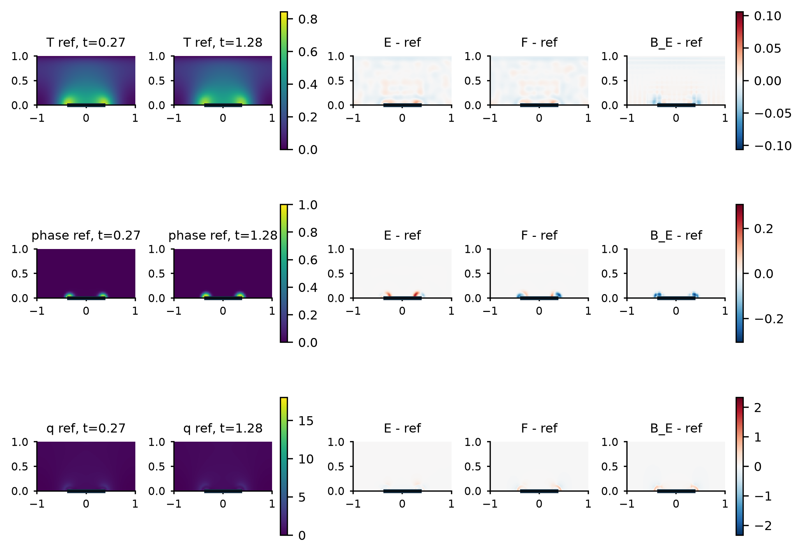

Figure S11. Full-label seed-43 companion to main Figure 2, with the same reference fields, times and signed-error color ranges.

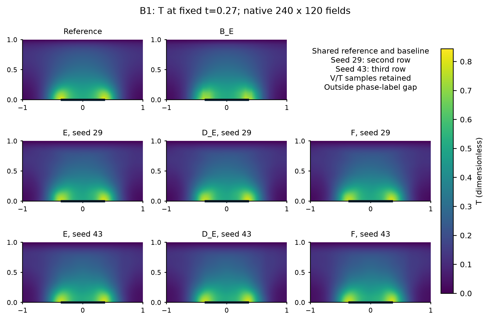

Figure S12. B1 temperature state at t=0.27. Reference, shared B_E and all E/D_E/F states for both seeds are retained.

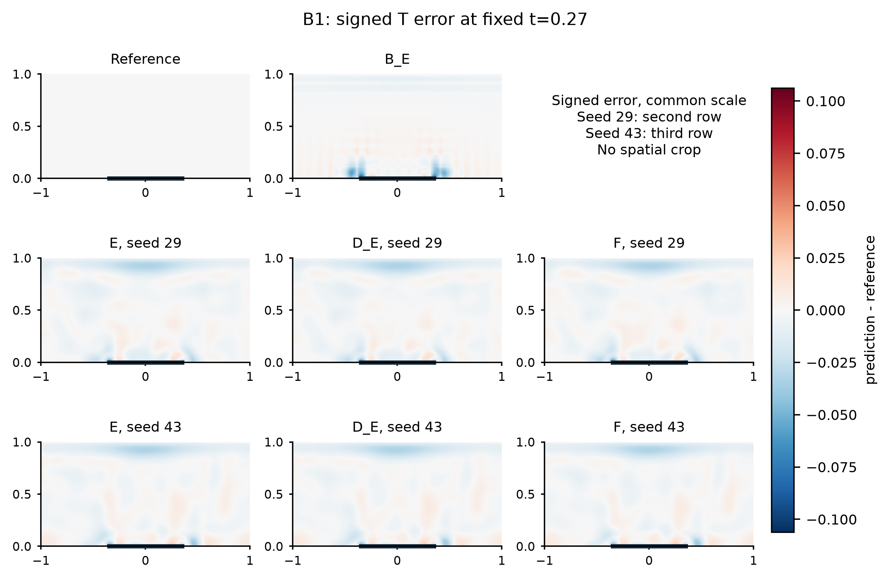

Figure S13. B1 temperature signed prediction-minus-reference error at t=0.27. Reference, shared B_E and all E/D_E/F states for both seeds are retained. The reference error panel is zero by definition.

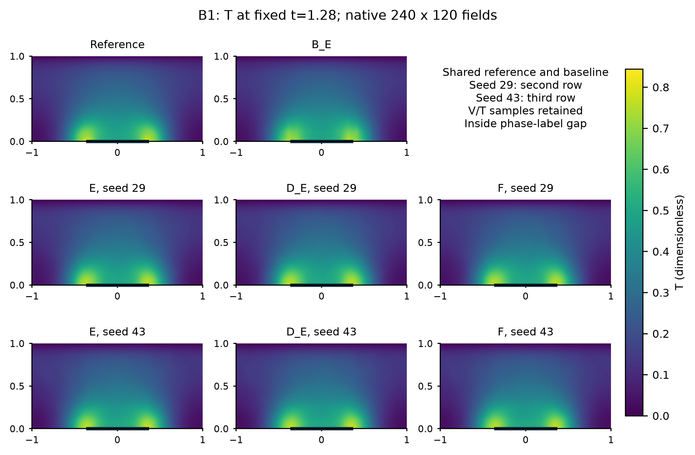

Figure S14. B1 temperature state at t=1.28. Reference, shared B_E and all E/D_E/F states for both seeds are retained.

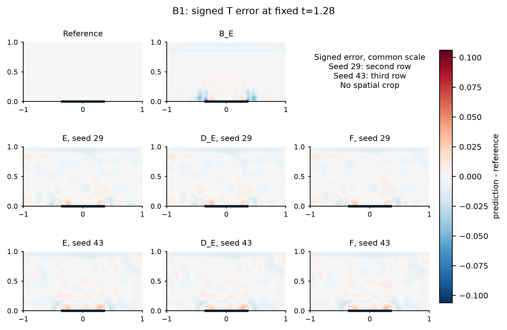

Figure S15. B1 temperature signed prediction-minus-reference error at t=1.28. Reference, shared B_E and all E/D_E/F states for both seeds are retained. The reference error panel is zero by definition.

Figure S16. B1 phase state at t=0.27. Reference, shared B_E and all E/D_E/F states for both seeds are retained.

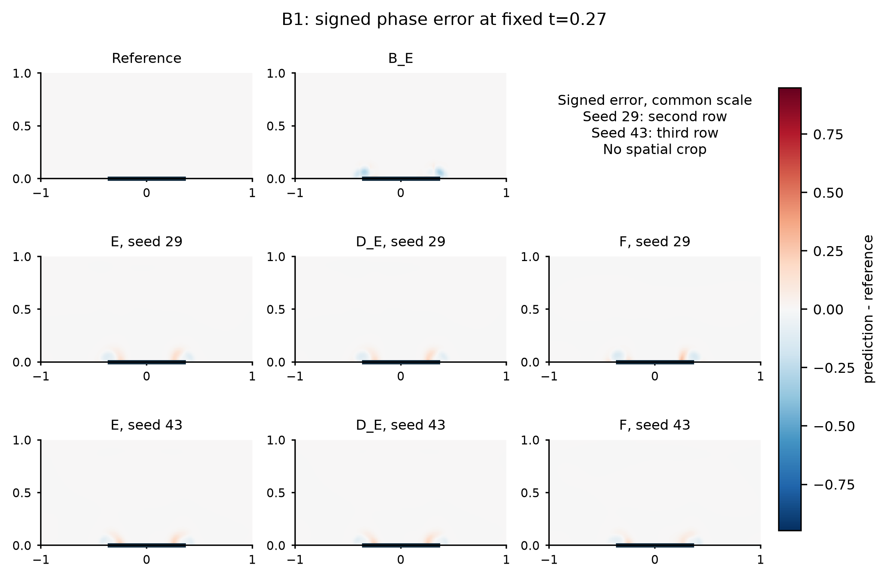

Figure S17. B1 phase signed prediction-minus-reference error at t=0.27. Reference, shared B_E and all E/D_E/F states for both seeds are retained. The reference error panel is zero by definition.

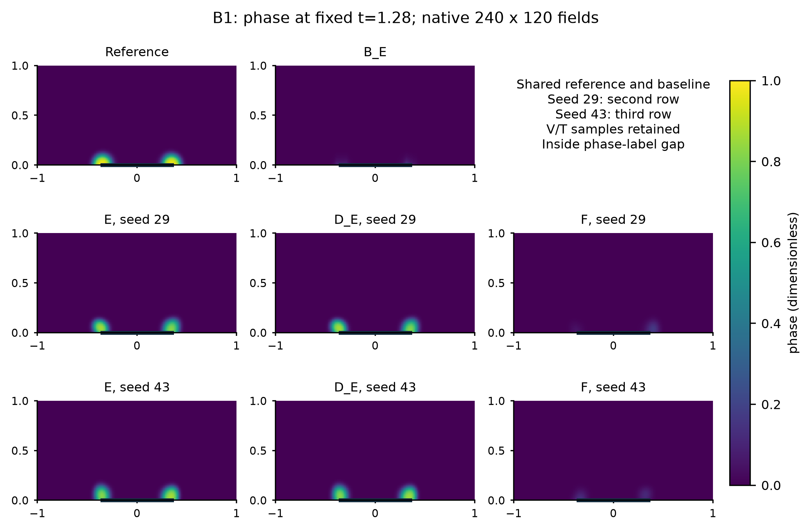

Figure S18. B1 phase state at t=1.28. Reference, shared B_E and all E/D_E/F states for both seeds are retained.

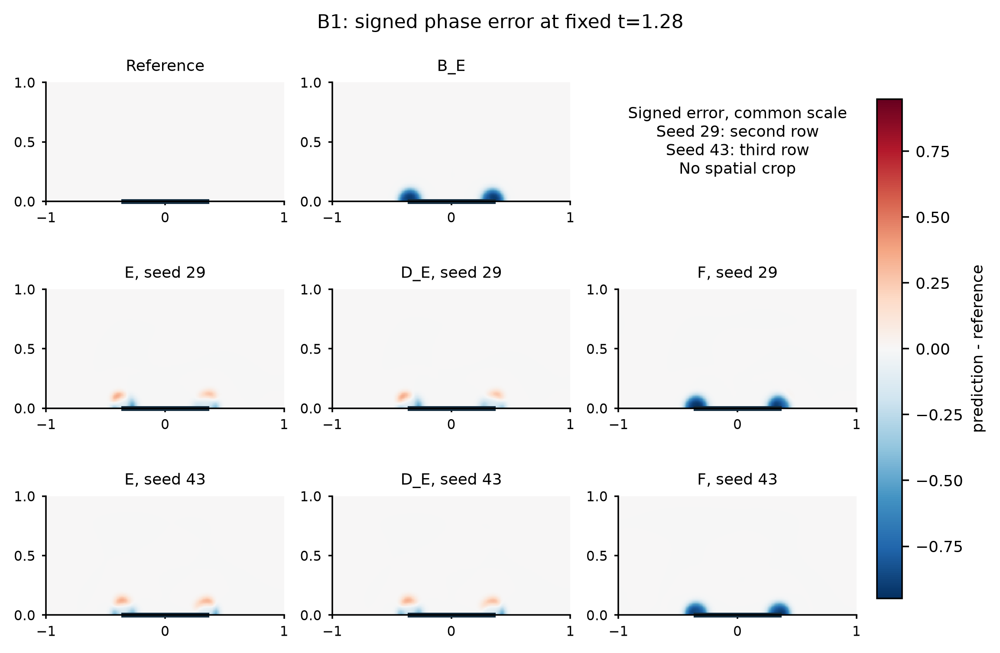

Figure S19. B1 phase signed prediction-minus-reference error at t=1.28. Reference, shared B_E and all E/D_E/F states for both seeds are retained. The reference error panel is zero by definition.

Figure S20. B1 local Joule density state at t=0.27. Reference, shared B_E and all E/D_E/F states for both seeds are retained.

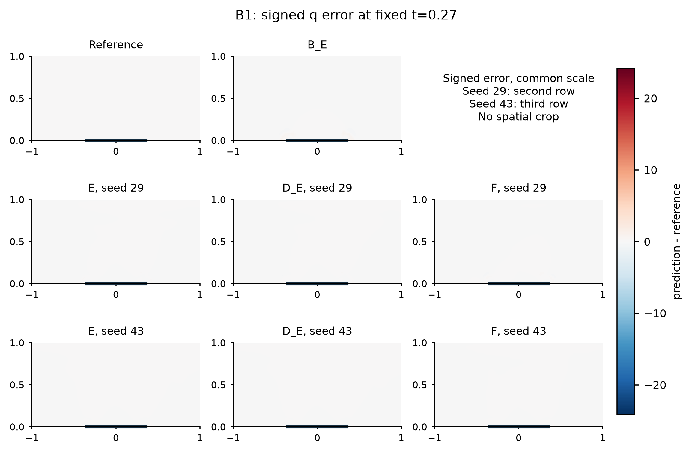

Figure S21. B1 local Joule density signed prediction-minus-reference error at t=0.27. Reference, shared B_E and all E/D_E/F states for both seeds are retained. The reference error panel is zero by definition.

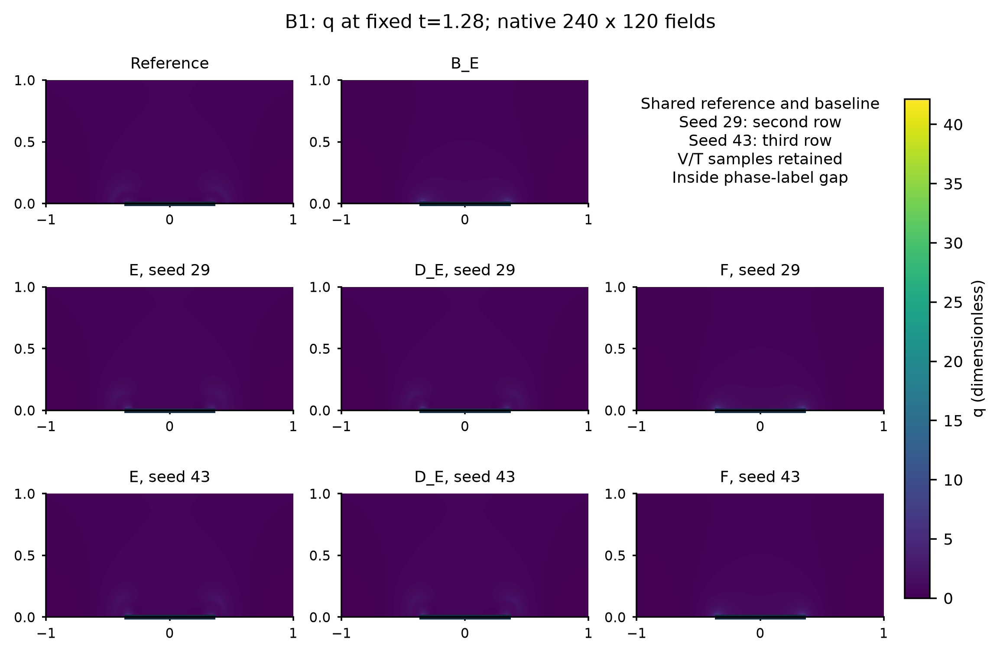

Figure S22. B1 local Joule density state at t=1.28. Reference, shared B_E and all E/D_E/F states for both seeds are retained.

Figure S23. B1 local Joule density signed prediction-minus-reference error at t=1.28. Reference, shared B_E and all E/D_E/F states for both seeds are retained. The reference error panel is zero by definition.

## S21. Complete relative-residual and time-moment development

All eight arms share one declared parent. None establishes the predeclared A_w increment; all strict two-cycle tests fail. Numerical quadrature checks passed. These results are bounded development evidence, not independent confirmations. Tables S21a-S21c retain continuous metrics, event records and actual work. Full pairwise, endpoint-moment, quadrature and raw-physics records remain linked in the evidence map.

Table S21a. All eight arms and both scoring ranges. Full electrical fields remain in the unchanged CSV. Errors are dimensionless, not percentages.

| Arm | Scope | S | Phase RMS | T NRMSE | I NRMSE | P NRMSE |
|---|---|---|---|---|---|---|
| D | window | 0.00729038 | 0.0837255 | 0.0130999 | 0.0250845 | 0.0248573 |
| D | outside | 0.00121815 | 0.0243327 | 0.0138246 | 0.0243549 | 0.0249217 |
| D | full | 0.00367133 | 0.056435 | 0.0135365 | 0.0247306 | 0.0248888 |
| P | window | 0.00732267 | 0.0840221 | 0.0130513 | 0.024892 | 0.0247633 |
| P | outside | 0.00120386 | 0.0241407 | 0.0137025 | 0.0241074 | 0.0246638 |
| P | full | 0.00367586 | 0.0565638 | 0.0134432 | 0.0245117 | 0.0247147 |
| L | window | 0.00713374 | 0.0822346 | 0.0130069 | 0.0249686 | 0.0247372 |
| L | outside | 0.0012133 | 0.0241042 | 0.0137398 | 0.0235082 | 0.0240141 |
| L | full | 0.00360516 | 0.0554829 | 0.0134485 | 0.0242658 | 0.0243867 |
| R | window | 0.00731842 | 0.0839166 | 0.0130055 | 0.0245482 | 0.0243599 |
| R | outside | 0.00120766 | 0.024073 | 0.0136977 | 0.0236469 | 0.0241742 |
| R | full | 0.00367641 | 0.0564832 | 0.0134223 | 0.0241119 | 0.0242694 |
| I | window | 0.0073277 | 0.0839884 | 0.0130591 | 0.0252667 | 0.0251592 |
| I | outside | 0.0012074 | 0.0242422 | 0.0137472 | 0.0241011 | 0.0246468 |
| I | full | 0.00368 | 0.0565694 | 0.0134734 | 0.0247039 | 0.0249103 |
| RI | window | 0.00714322 | 0.0823633 | 0.0130437 | 0.0250796 | 0.0248398 |
| RI | outside | 0.00120779 | 0.0240704 | 0.0137391 | 0.023601 | 0.0241143 |
| RI | full | 0.0036057 | 0.0555512 | 0.0134625 | 0.0243681 | 0.0244882 |
| RIM | window | 0.00712987 | 0.0821201 | 0.0129457 | 0.0252872 | 0.0250523 |
| RIM | outside | 0.00121775 | 0.0241633 | 0.0137391 | 0.0234585 | 0.0239481 |
| RIM | full | 0.00360625 | 0.0554296 | 0.0134242 | 0.0244105 | 0.0245192 |
| G | window | 0.00718034 | 0.0827137 | 0.0130131 | 0.0251266 | 0.0249395 |
| G | outside | 0.00120923 | 0.0241497 | 0.0137108 | 0.0239605 | 0.0244992 |
| G | full | 0.00362156 | 0.0557815 | 0.0134332 | 0.0245636 | 0.0247254 |

Table S21b. Both event cycles for every arm. These arms share one parent.

| Arm | Cycle | Onset | Time error | Recall | Precision | Mass ratio |
|---|---|---|---|---|---|---|
| D | 1 | 0.22472 | 0.01588 | 0.836976 | 0.873281 | 0.958427 |
| D | 2 | 1.22715 | 0.00035 | 0.643101 | 0.814177 | 0.789879 |
| P | 1 | 0.22555 | 0.01505 | 0.836863 | 0.877081 | 0.954146 |
| P | 2 | 1.22555 | 0.00125 | 0.660284 | 0.824597 | 0.800735 |
| L | 1 | 0.22715 | 0.01345 | 0.833258 | 0.880791 | 0.946034 |
| L | 2 | 1.22805 | 0.00125 | 0.647632 | 0.833535 | 0.77697 |
| R | 1 | 0.226525 | 0.014075 | 0.835174 | 0.880613 | 0.9484 |
| R | 2 | 1.22805 | 0.00125 | 0.655924 | 0.834385 | 0.786117 |
| I | 1 | 0.22472 | 0.01588 | 0.834723 | 0.876805 | 0.952005 |
| I | 2 | 1.2243 | 0.0025 | 0.659514 | 0.817613 | 0.806634 |
| RI | 1 | 0.227033 | 0.0135667 | 0.83416 | 0.88038 | 0.947499 |
| RI | 2 | 1.23022 | 0.00342 | 0.647205 | 0.837685 | 0.772611 |
| RIM | 1 | 0.226525 | 0.014075 | 0.831681 | 0.880592 | 0.944457 |
| RIM | 2 | 1.22715 | 0.00035 | 0.641734 | 0.824945 | 0.777911 |
| G | 1 | 0.2262 | 0.0144 | 0.834498 | 0.877919 | 0.950541 |
| G | 2 | 1.22778 | 0.000975 | 0.652163 | 0.828249 | 0.7874 |

Table S21c. Actual training work. Optimizer evaluations and electrical solves are separate work units.

| Arm | Adam | L-BFGS eval. | Train s | Forward solves | Adjoint solves |
|---|---|---|---|---|---|
| D | 600 | 100 | 705.184 | 4031 | 4031 |
| P | 600 | 100 | 1072.39 | 6831 | 6831 |
| L | 600 | 100 | 1074.03 | 6831 | 6831 |
| R | 600 | 100 | 1069.43 | 6831 | 6831 |
| I | 600 | 100 | 1085.7 | 6831 | 6831 |
| RI | 600 | 100 | 1076.65 | 6831 | 6831 |
| RIM | 600 | 100 | 1081.53 | 6831 | 6831 |
| G | 600 | 100 | 1092.33 | 6831 | 6831 |

## S22. Observation-preserving controls and saved-checkpoint diagnosis

The base is old B1 E/29. G, N and S each use 600 Adam updates and 200 complete L-BFGS evaluations. They do not establish completion or independent physical qualification. N/S preserve temperature and electrical predictions by construction; this is not an accuracy or acceleration claim. All three training branches actually ran on CPU; subsequent audits/readouts used GPU. Failed engineering attempts and effective work remain in the original execution report. The objective diagnostic later used zero optimizer updates and zero electrical solves.

Table S22a. B0 and all N/G/S accepted endpoints, with both scoring ranges. Errors are dimensionless.

| Arm | Scope | S | Phase RMS | T NRMSE | I NRMSE | P NRMSE |
|---|---|---|---|---|---|---|
| B0 | window | 0.00889987 | 0.102223 | 0.0109557 | 0.0108753 | 0.0109894 |
| B0 | outside | 0.000745465 | 0.0142673 | 0.0112914 | 0.00357582 | 0.00317099 |
| B0 | full | 0.00403984 | 0.0659007 | 0.0111569 | 0.00816795 | 0.00816692 |
| D_E | window | 0.00903079 | 0.103495 | 0.010924 | 0.0113354 | 0.011445 |
| D_E | outside | 0.000770895 | 0.0150447 | 0.0113678 | 0.00496102 | 0.00475562 |
| D_E | full | 0.00410789 | 0.0667997 | 0.0111906 | 0.00881585 | 0.00883531 |
| G | window | 0.00874807 | 0.100818 | 0.0109557 | 0.0110931 | 0.0111856 |
| G | outside | 0.000744154 | 0.0141832 | 0.0112914 | 0.0034856 | 0.00302797 |
| G | full | 0.00397773 | 0.0650099 | 0.0111569 | 0.00829759 | 0.00827602 |
| N | window | 0.00585531 | 0.110346 | 0.0109557 | 0.0108753 | 0.0109894 |
| N | outside | 0.000745465 | 0.0142673 | 0.0112914 | 0.00357582 | 0.00317099 |
| N | full | 0.00280984 | 0.0709963 | 0.0111569 | 0.00816795 | 0.00816692 |
| S | window | 0.0073772 | 0.0970864 | 0.0109557 | 0.0108753 | 0.0109894 |
| S | outside | 0.000745465 | 0.0142673 | 0.0112914 | 0.00357582 | 0.00317099 |
| S | full | 0.00342469 | 0.0626844 | 0.0111569 | 0.00816795 | 0.00816692 |

Table S22b. Both event cycles, including missing events and support errors.

| Arm | Cycle | Onset | Time error | Recall | Precision | Mass ratio |
|---|---|---|---|---|---|---|
| B0 | 1 | 0.23761 | 0.00299 | 0.921023 | 0.941712 | 0.978031 |
| B0 | 2 | 1.2248 | 0.002 | 0.77167 | 0.85483 | 0.902718 |
| D_E | 1 | 0.235678 | 0.00492222 | 0.921474 | 0.93325 | 0.987382 |
| D_E | 2 | 1.22602 | 0.000783333 | 0.764404 | 0.86105 | 0.887759 |
| G | 1 | 0.2373 | 0.0033 | 0.919333 | 0.945758 | 0.972059 |
| G | 2 | 1.2259 | 0.0009 | 0.771841 | 0.861792 | 0.895623 |
| N | 1 | 0.23761 | 0.00299 | 0.921023 | 0.941712 | 0.978031 |
| N | 2 | 1.2248 | 0.002 | 0.77167 | 0.85483 | 0.902718 |
| S | 1 | 0.23761 | 0.00299 | 0.921023 | 0.941712 | 0.978031 |
| S | 2 | 1.2248 | 0.002 | 0.77167 | 0.85483 | 0.902718 |

Table S22c. Actual training work for all three branches; these historical runs used CPU.

| Arm | Adam | L-BFGS eval. | Train s | Forward solves | Adjoint solves |
|---|---|---|---|---|---|
| G | 600 | 200 | 1245.31 | 13031 | 13031 |
| N | 600 | 200 | 457.825 | 0 | 0 |
| S | 600 | 200 | 370.284 | 0 | 0 |

Table S22d. Every saved checkpoint, spatial pool and temporal quadrature in the zero-update diagnostic. Phase and thermal columns are raw mean-square residuals; H is the original composite objective.

| pool | state | n_times | phase_raw | thermal_raw | phase_BC | H |
|---|---|---|---|---|---|---|
| fixed-training | B0 | 32.0 | 0.06937691005530007 | 0.010929535669043002 | 0.07081434996266293 | 0.3552244739404905 |
| fixed-training | N-Adam | 32.0 | 0.0916433889453251 | 0.010995862608196419 | 0.06998103292348445 | 0.35135615694103056 |
| fixed-training | N-final | 32.0 | 0.35498885858571577 | 0.012260517074305562 | 0.0013566140239824396 | 0.011771682340103106 |
| fixed-training | S-final | 32.0 | 0.08808800226182548 | 0.010957241135200548 | 0.00349769759956883 | 0.01889127055165183 |
| independent-D | B0 | 64.0 | 0.10240511023880947 | 0.01077408338069919 | 0.07124480579712632 | 0.35781389052591356 |
| independent-D | N-Adam | 64.0 | 0.126381812849335 | 0.010875815102590485 | 0.06858579171663261 | 0.3448406289024583 |
| independent-D | N-final | 64.0 | 1.0534799034977191 | 0.011563175655966294 | 0.010716216984803491 | 0.06786838313015302 |
| independent-D | S-final | 64.0 | 0.15062731817141392 | 0.010942217484504527 | 0.49812243248716026 | 2.4928484895423475 |
| common-128 | B0 | 128.0 | 0.06833753781609941 | 0.010860909135627704 | 0.11752225289169752 | 0.5887487005696947 |
| common-128 | N-Adam | 128.0 | 0.08269052473719045 | 0.010918570494853357 | 0.10519751380389826 | 0.5273175795679638 |
| common-128 | N-final | 128.0 | 0.7050218971314437 | 0.010889412852610653 | 0.009961704513814876 | 0.059435677298589666 |
| common-128 | S-final | 128.0 | 0.1207373975529634 | 0.011126041838800936 | 0.9553123428703658 | 4.778403338857512 |
| common-256 | B0 | 256.0 | 0.06833753781610367 | 0.010860909135644685 | 0.1175222528916975 | 0.5887487005696952 |
| common-256 | N-Adam | 256.0 | 0.0826905247371948 | 0.01091857049487035 | 0.10519751380389826 | 0.5273175795679642 |
| common-256 | N-final | 256.0 | 0.7049509969631884 | 0.010889190505211227 | 0.009958865146755362 | 0.05942053049547782 |
| common-256 | S-final | 256.0 | 0.12073747284958156 | 0.011126041455636207 | 0.9553128752590545 | 4.778406001796921 |
| spatial-256 | B0 | 256.0 | 0.024717757529528026 | 0.010055301756956745 | 0.060259545707262815 | 0.30183678408997766 |
| spatial-256 | N-Adam | 256.0 | 0.03350902556030214 | 0.010086840753629903 | 0.055298616990491836 | 0.27715001447563065 |
| spatial-256 | N-final | 256.0 | 0.3320268927548136 | 0.010211884470171462 | 0.010664950502143855 | 0.05796452534057875 |
| spatial-256 | S-final | 256.0 | 0.045242244274502394 | 0.010105197211945995 | 0.17783209843298722 | 0.8899742470305125 |

For full-precision records, full-history/reader metrics, all pairwise decisions, raw physics, phase-error decomposition, work deviations and source identities, see the accompanying evidence map. No favorable checkpoint replaces an accepted endpoint. The diagnostic separates the two spatial supports and temporal quadrature orders; a change of measure is not a new independent replicate.

## S23. Fixed-temperature conditional phase evolution

### S23.1 Question and frozen numerical contract

This supplementary development diagnostic asks whether phase evolution under the frozen B1 E/29 temperature can reduce the remaining uncertainty enough to justify searching the original correction family. It is not a neural training arm or an original-family feasibility certificate. The grid is 80 by 40, D=[1.36,2.02], and the exact initial network phase is used without clipping or smoothing. The original zero-flux operator and all B0 coefficients are retained: interface width 0.04, barrier scale 1, thermal drive 6, transition temperature 0.45, cold/hot mobility 0.5/5 and mobility width 0.08. The thermal diffusivity, cooling and latent ratio are 0.1, 4 and 0.05. Temperature is fixed; the whole interval has zero electrical drive.

The unchanged logit Newton solver uses backward Euler, FP64, its analytic Jacobian, at most 30 iterations and halving line search down to 2^-20. Each step takes its own previous accepted phase as both old state and initial guess. The bounds are 0 and 1 with a strictly interior initial guess. Acceptance is the unscaled defect norm at most 1e-10; its divided-by-dt upper limits are 1.6e-7 and 3.2e-7. No other trajectory or future/reference phase initializes a step. Two fixed step sizes, 0.000625 and 0.0003125, provide 1056 and 2112 steps. No third trajectory, refinement, rescue, electrical solve, reference generation or optimizer update was performed.

Both trajectories and all 1057/2113 internal states were saved and locked before reference access. Numerical qualification passed: the 265-node phase difference RMS is 3.921397e-05 (limit 1e-4), the right-end maximum difference is 0.00029046819 (limit 1e-3), and the main heat difference is 9.4162193e-08 (limit 0.00011034353). These are two-step sensitivity checks at a fixed spatial discretization, not continuum error bounds.

Table S23a. Actual accepted work and maximum unscaled/divided algebraic defects. Main steps and linear solves are distinct. Zero clipping and zero line-search rejections were recorded.

| Trajectory | Steps | Newton | Linear solves | Max defect | Max defect/dt | Solve s |
|---|---|---|---|---|---|---|
| coarse | 1056 | 2137 | 2137 | 9.4268526e-11 | 1.5082964e-07 | 50.629044 |
| fine | 2112 | 4224 | 4224 | 9.9636303e-11 | 3.1883617e-07 | 100.86376 |

### S23.2 Three residual layers and paired thermal budgets

The algebraic layer is recorded for every internal step. Independently, the common phase residual is D_h0(phi)-F_h(t,phi) on 1057 common nodes, with h0=0.000625. D_h0 is second-order centered in the interior and (-3u0+4u1-u2)/(2h0) and (3uK-4uK-1+uK-2)/(2h0) at the endpoints. Fine values are sampled at nested nodes. The full 3200-cell volume measure and normalized trapezoidal time weights are shared. Conditional arrays have no neural AD residual; no continuous reconstruction is introduced. In particular, RHS minus itself is not used as evidence of phase accuracy.

Table S23b. Common discrete phase-residual mean square and the separate network-AD layer.

| State | Common phase MS | Network AD layer |
|---|---|---|
| B0 | 0.079156244 | B0 endpoint derivatives only |
| coarse | 2.2984504e-07 | Not applicable |
| fine | 5.6974088e-08 | Not applicable |

The primary heat residual uses the conditional F_h phase rate and the B0 network AD phase rate. The cross-check uses D_h0 for all three states. Both use the same frozen T, AD temperature rate and shared face heat flux. Each convention recomputes its own B0 baseline and tau=max(1.05 J_B0,J_B0+1e-12), without historical pool values. Both are resolved within budget: no step-size pass/fail flip occurs and each fine-step margin exceeds its observed step difference. The conventions agree. This does not replace the original 5% qualification or establish continuous physical truth.

Table S23c. Full-support paired heat budgets. Margin is tau minus candidate J; delta is the absolute coarse/fine difference, not an error bound or confidence interval.

| Convention | State | B0 J | Candidate J | Upper tau | Margin | Delta |
|---|---|---|---|---|---|---|
| Conditional | coarse | 0.011034353 | 0.010400643 | 0.011586071 | 0.0011854279 | 9.4162193e-08 |
| Conditional | fine | 0.011034353 | 0.010400737 | 0.011586071 | 0.0011853337 | 9.4162193e-08 |
| Common FD | coarse | 0.011034352 | 0.010399973 | 0.01158607 | 0.0011860968 | 4.3027889e-07 |
| Common FD | fine | 0.011034352 | 0.010400403 | 0.01158607 | 0.0011856666 | 4.3027889e-07 |

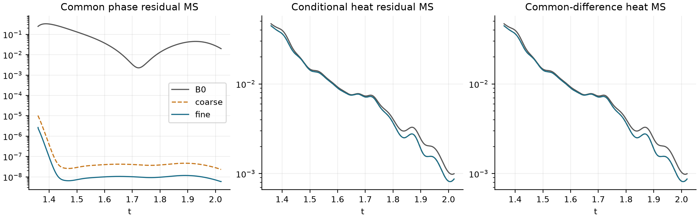

Figure S24. Residual mean squares in time on the common full-cell measure. The phase curve uses an independent time difference. The two heat panels use the separately paired conventions; near overlap of coarse and fine does not prove spatial or continuum convergence.

### S23.3 Endpoint seams and boundary interpretation

All seams compare the conditional a+ or b- evolution to B0 network AD. Velocity is F_h; acceleration is the fixed-phase partial time derivative plus the sparse Jacobian-vector product D_phi F_h F_h. Temperature and mobility time derivatives enter the partial derivative once. No dense 3200 by 3200 Jacobian or reference derivatives are used. The table includes RMS, maximum and the location of that maximum. Scaled RMS multiplies by (b-a)^order; full scaled maxima and vectors are retained in endpoint-seams.csv and endpoint-seam-vectors.npz.

Table S23d. The nonzero endpoint mismatches remain part of the result; no physical seam pass threshold is introduced.

| State | Side | Order | RMS | Max abs. | Scaled RMS | Max at (x,z) |
|---|---|---|---|---|---|---|
| coarse | left | 0 | 0 | 0 | 0 | (-0.9875, 0.0125) |
| coarse | left | 1 | 0.49770263 | 5.2604247 | 0.32848373 | (-0.4375, 0.0875) |
| coarse | left | 2 | 10.056184 | 143.3055 | 4.3804738 | (-0.2625, 0.0125) |
| coarse | right | 0 | 0.020566841 | 0.2785186 | 0.020566841 | (-0.3125, 0.0125) |
| coarse | right | 1 | 0.26351984 | 3.2741253 | 0.1739231 | (-0.3125, 0.0125) |
| coarse | right | 2 | 2.3457692 | 25.750126 | 1.0218171 | (-0.3875, 0.0125) |
| fine | left | 0 | 0 | 0 | 0 | (-0.9875, 0.0125) |
| fine | left | 1 | 0.49770263 | 5.2604247 | 0.32848373 | (-0.4375, 0.0875) |
| fine | left | 2 | 10.056184 | 143.3055 | 4.3804738 | (-0.2625, 0.0125) |
| fine | right | 0 | 0.020562588 | 0.27849917 | 0.020562588 | (-0.3125, 0.0125) |
| fine | right | 1 | 0.26349295 | 3.2741024 | 0.17390535 | (-0.3125, 0.0125) |
| fine | right | 2 | 2.3458266 | 25.745569 | 1.021842 | (-0.3875, 0.0125) |

The left input is identical for both step sizes. Accordingly, their left RHS jets agree exactly while the left first-derivative mismatch to B0 has RMS 0.49770263 and maximum 5.2604247. This mismatch cannot be removed by temporal refinement. The endpoint identity Delta phi_t = M epsilon^2 (L_h phi_B0 - L_AD phi_B0) - r_phi,AD has maximum reconstruction discrepancy 8.882e-16. It separates the spatial/boundary implementation difference from the original dynamic defect at that endpoint, without a global causal claim. Nonzero seams do not by themselves rule out a correction with residual tolerances; they also prevent treating this IVP as an exact C2-gated witness.

Table S23e. All boundary sides, including the full bottom. IVP boundary flux is imposed as zero by the discrete operator, whereas B0 quantities are network normal derivatives. These are distinct layers, so the zero is not a superiority claim.

| Side | Faces | B0 normal MS | B0 max abs. |
|---|---|---|---|
| left | 40 | 1.0193355e-14 | 6.2116535e-07 |
| right | 40 | 6.3945549e-15 | 1.080827e-06 |
| bottom | 80 | 0.88354715 | 8.8877495 |
| top | 80 | 3.815886e-15 | 3.2056063e-07 |

### S23.4 Locked development-reference analysis

Only after locking and numerical qualification were the saved original 160 by 80 reference values volume-restricted to the same 80 by 40 cells and scored at 265 D nodes. B0 uses the same frozen network's cached values. The ROI is |x|<=0.55 and 0<=z<=0.55. Ephi_D_80 is a raw phase-fraction RMS with separately normalized spatial/time weights, not the historical 160 by 80 W-window error. Both trajectories improve in both scopes by more than their observed step differences; the fine full-domain reduction is 69.0143%. This is development evidence on an already examined numerical reference, not a new formal A_w, independent confirmation or statistical significance claim.

Table S23f. The required B0 row and both trajectories on the same restricted reference. Gain is E_B0 minus E_IVP.

| Scope | State | Ephi_D_80 | Gain | Delta E |
|---|---|---|---|---|
| full | B0 | 0.066943576 | not applicable | 1.6633725e-05 |
| full | coarse | 0.020759591 | 0.046183985 | 1.6633725e-05 |
| full | fine | 0.020742957 | 0.046200619 | 1.6633725e-05 |
| roi | B0 | 0.12171559 | not applicable | 3.0243136e-05 |
| roi | coarse | 0.037744703 | 0.083970886 | 3.0243136e-05 |
| roi | fine | 0.03771446 | 0.08400113 | 3.0243136e-05 |

The support diagnostics show a tradeoff rather than uniform improvement. With the restricted native indicator, fine-step recall falls from 0.974612 to 0.763383 while precision rises from 0.410817 to 0.890215 and symmetric-difference mass decreases. Thresholding after restriction gives the same tradeoff (recall 0.982021 to 0.776968; precision 0.410832 to 0.899253). The ROI agrees. These descriptive D-window measures do not establish the original strict event criteria.

Table S23g. Active-support diagnostics retain both noncommuting reference semantics separately. Masses use normalized D time and the indicated spatial scope; symmetric difference uses fractional overlap for the restricted native indicator. These descriptive values do not replace original event or A_w decisions. The companion CSV includes all predicted, reference, overlap, false-positive and false-negative masses and precision.

| Scope | State | Reference semantics | Reference mass | Sym. diff. mass | Recall |
|---|---|---|---|---|---|
| full | B0 | native indicator | 0.0085907907 | 0.012225971 | 0.97461247 |
| full | B0 | threshold after restriction | 0.0085262784 | 0.012160866 | 0.98202138 |
| full | coarse | native indicator | 0.0085907907 | 0.0028444602 | 0.76279711 |
| full | coarse | threshold after restriction | 0.0085262784 | 0.0026485559 | 0.77627377 |
| full | fine | native indicator | 0.0085907907 | 0.0028415009 | 0.76338271 |
| full | fine | threshold after restriction | 0.0085262784 | 0.002643821 | 0.77696793 |
| roi | B0 | native indicator | 0.028399308 | 0.040416432 | 0.97461247 |
| roi | B0 | threshold after restriction | 0.028186044 | 0.040201211 | 0.98202138 |
| roi | coarse | native indicator | 0.028399308 | 0.0094031743 | 0.76279711 |
| roi | coarse | threshold after restriction | 0.028186044 | 0.0087555566 | 0.77627377 |
| roi | fine | native indicator | 0.028399308 | 0.0093933916 | 0.76338271 |
| roi | fine | threshold after restriction | 0.028186044 | 0.0087399042 | 0.77696793 |

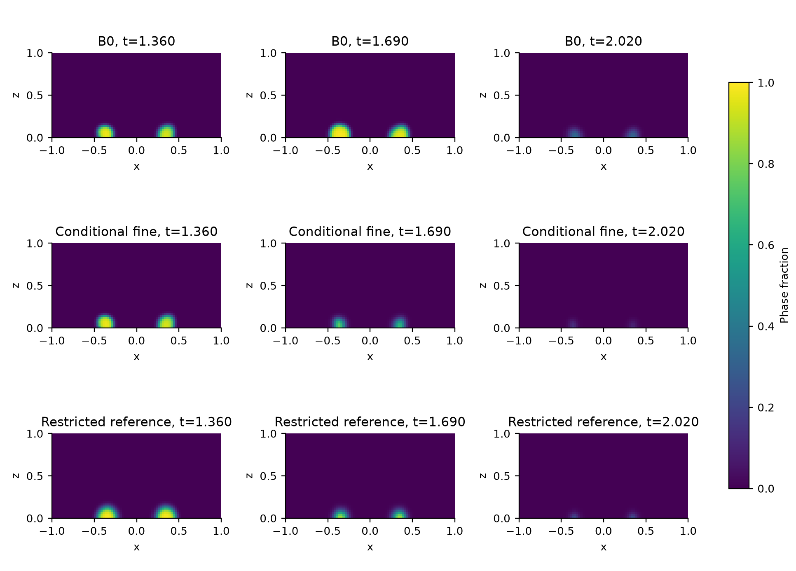

Figure S25. B0, the fine conditional trajectory and the volume-restricted development reference at the initial, middle and final D times. The common [0,1] phase scale makes the spatial support visible. The fine trajectory is displayed as the smaller-step result, alongside the complete coarse/fine numerical and reference tables. The coarse trajectory remains available in full.

### S23.5 Outcome, actual work and limits

The numerical facts above are VERIFIED. The route output is CONDITIONAL_IVP_SUPPORTS_FURTHER_WITNESS_SEARCH, a SUPPORTED_INTERPRETATION: paired thermal and reference evidence now supports considering a bounded witness search in the original correction family, with the observed seams explicitly addressed. The original C2-family feasibility is UNKNOWN. This is the sole follow-on research recommendation; it requires a separate approved design. No A+, new optimization or independent confirmation has started.

Network queries took 114.794 s; the two phase solves took 151.493 s. The query/propagation process took 269.760 s, followed by 2.926 s numerical evaluation and 2.475 s reference evaluation. These measured stages are not an equal-work speedup comparison. Work was 3168 main steps, 6361 Newton iterations/linear solves and 16908 coordinate-query batches. The cache records separate temperature/phase head positions, first/second derivatives, shared-face and boundary queries. Model identity is unchanged, with zero training, electrical forwards, electrical adjoints or reference generation.

The instance was a V100 32 GB with a six-core CPU quota and 25 GiB container memory; four CPU threads and at most 1024 coordinates per query were used. The sampled process RSS peak was 0.889 GiB. The resource guards did not trigger. GPU peak allocation was not persisted and no value is inferred. The first deployment preflight omitted one original contract-identity fixture; it failed before any model query or scientific step. The unchanged fixture was included, six targeted checks and model loading passed, and the same frozen task ran once. Both preflight records remain available.

Results were recovered and archive integrity verified before shutdown was requested at 2026-09-25T14:30:19.899793+00:00. The shutdown command returned zero; subsequent SSH connection refusal was recorded at closure 2026-09-25T14:30:26.785254+00:00. A later local saved-array reconstruction reproduced the defects, exports, common residuals, both heat conventions and reference RMS scores without another model query or propagation. Complete runtime source identities, B0 path, physical coefficients, environment, work counters, numerical vectors and shutdown evidence accompany the run. P02 method value, strict two-cycle use, material validation and P03 full-array external access remain open.

## References

[1] Raissi, M., Perdikaris, P., and Karniadakis, G. E. Physics-informed neural networks: A deep learning framework for solving forward and inverse problems involving nonlinear partial differential equations. Journal of Computational Physics 378 (2019), 686-707. [DOI: 10.1016/j.jcp.2018.10.045](https://doi.org/10.1016/j.jcp.2018.10.045). [Author preprint, Part I](https://arxiv.org/abs/1711.10561).

[2] Wang, S., Teng, Y., and Perdikaris, P. Understanding and mitigating gradient flow pathologies in physics-informed neural networks. SIAM Journal on Scientific Computing 43(5) (2021), A3055-A3081. [Author full text](https://arxiv.org/html/2001.04536).

[3] Um, K., Brand, R., Fei, Y. R., Holl, P., and Thuerey, N. Solver-in-the-Loop: Learning from Differentiable Physics to Interact with Iterative PDE-Solvers. Advances in Neural Information Processing Systems 33 (2020). [Author full text](https://arxiv.org/html/2007.00016). [Official project](https://ge.in.tum.de/publications/2020-um-solver-in-the-loop/).

[4] Mitusch, S. K., Funke, S. W., and Kuchta, M. Hybrid FEM-NN models: Combining artificial neural networks with the finite element method. Journal of Computational Physics 446 (2021), 110651. [DOI: 10.1016/j.jcp.2021.110651](https://doi.org/10.1016/j.jcp.2021.110651). [Author full text](https://arxiv.org/html/2101.00962).

[5] Blondel, M., Berthet, Q., Cuturi, M., Frostig, R., Hoyer, S., Llinares-López, F., Pedregosa, F., and Vert, J.-P. Efficient and Modular Implicit Differentiation. Advances in Neural Information Processing Systems 35 (2022). [Author full text](https://arxiv.org/html/2105.15183).

[6] Patel, R. G., Manickam, I., Trask, N. A., Wood, M. A., Lee, M., Tomas, I., and Cyr, E. C. Thermodynamically consistent physics-informed neural networks for hyperbolic systems. Journal of Computational Physics 449 (2022), 110754. [DOI: 10.1016/j.jcp.2021.110754](https://doi.org/10.1016/j.jcp.2021.110754). [Author full text](https://arxiv.org/html/2012.05343).

[7] Allen, S. M., and Cahn, J. W. A microscopic theory for antiphase boundary motion and its application to antiphase domain coarsening. Acta Metallurgica 27(6) (1979), 1085-1095. [DOI: 10.1016/0001-6160(79)90196-2](https://doi.org/10.1016/0001-6160%2879%2990196-2).

[8] Miquel, R., Cabout, T., Cueto, O., Sklénard, B., and Plapp, M. Multi-physics modeling of phase change memory operations in Ge-rich Ge2Sb2Te5 alloys. Journal of Applied Physics 136 (2024), 145102. [DOI: 10.1063/5.0222379](https://doi.org/10.1063/5.0222379). [Author full text](https://arxiv.org/html/2409.06463).

[9] Kingma, D. P., and Ba, J. Adam: A Method for Stochastic Optimization. International Conference on Learning Representations (2015). [Author preprint](https://arxiv.org/abs/1412.6980).

[10] Liu, D. C., and Nocedal, J. On the limited memory BFGS method for large scale optimization. Mathematical Programming 45 (1989), 503-528. [Author publication page and paper](https://users.iems.northwestern.edu/~nocedal/Abstracts/limited-memory.html).

[11] He, K., Zhang, X., Ren, S., and Sun, J. Deep Residual Learning for Image Recognition. IEEE Conference on Computer Vision and Pattern Recognition (2016), 770-778. [Author preprint](https://arxiv.org/abs/1512.03385).

[12] Baez, A., Zhang, W., Ma, Z., Nguyen, L., Das, S., and Daniel, L. Guaranteeing Conservation of Integrals with Projection in Physics-Informed Neural Networks. arXiv:2511.09048v2 (2026). [Author record](https://arxiv.org/abs/2511.09048v2). [Author full text](https://arxiv.org/html/2511.09048v2).

[13] Kaltenbacher, B. Regularization based on all-at-once formulations for inverse problems. SIAM Journal on Numerical Analysis 54 (2016), 2594-2618. [Author preprint](https://arxiv.org/abs/1603.05332). [DOI: 10.1137/16M1060984](https://doi.org/10.1137/16M1060984).

[14] Shi, Y., and Chen, L.-Q. Isothermal current-driven insulator-to-metal transition in VO2 through strong correlation effect. Physical Review Applied 11 (2019), 014059. [Author preprint](https://arxiv.org/abs/1809.05549). [DOI: 10.1103/PhysRevApplied.11.014059](https://doi.org/10.1103/PhysRevApplied.11.014059).

[15] Négiar, G., Mahoney, M. W., and Krishnapriyan, A. S. Learning differentiable solvers for systems with hard constraints. International Conference on Learning Representations (2023). [Author record](https://arxiv.org/abs/2207.08675v2). [Author full text](https://arxiv.org/html/2207.08675v2).

[16] Lu, L., Pestourie, R., Yao, W., Wang, Z., Verdugo, F., and Johnson, S. G. Physics-informed neural networks with hard constraints for inverse design. SIAM Journal on Scientific Computing 43(6) (2021), B1105-B1132. [DOI: 10.1137/21M1397908](https://doi.org/10.1137/21M1397908). [Author full text](https://arxiv.org/html/2102.04626). [Official implementation](https://github.com/lululxvi/hpinn).

[17] Golder, R., Roy, B. N., and Hasan, M. M. F. DAE-HardNet: A Physics Constrained Neural Network Enforcing Differential-Algebraic Hard Constraints. arXiv:2512.05881v1 (5 December 2025), preprint. [Author record](https://arxiv.org/abs/2512.05881v1).

[18] Horne, M. J. S., Jimack, P. K., Khan, A., and Wang, H. Hard Constraint Projection in a Physics Informed Neural Network. ParCFD2024 conference paper; publication record 2025, DOI: 10.34734/FZJ-2025-02453. Accepted manuscript archived as arXiv:2601.06244v1 (9 January 2026). [Author record](https://arxiv.org/abs/2601.06244v1). [Publisher metadata](https://api.datacite.org/dois/10.34734/FZJ-2025-02453).
