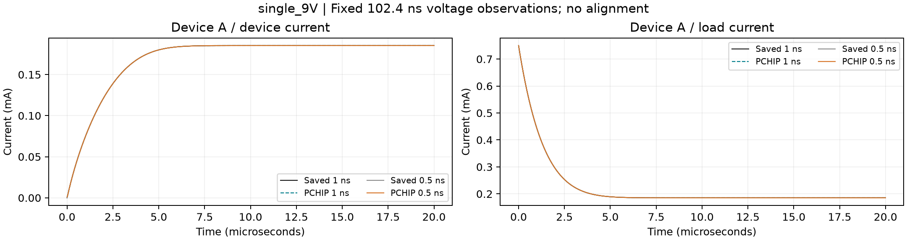
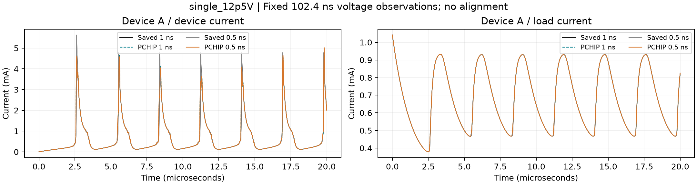
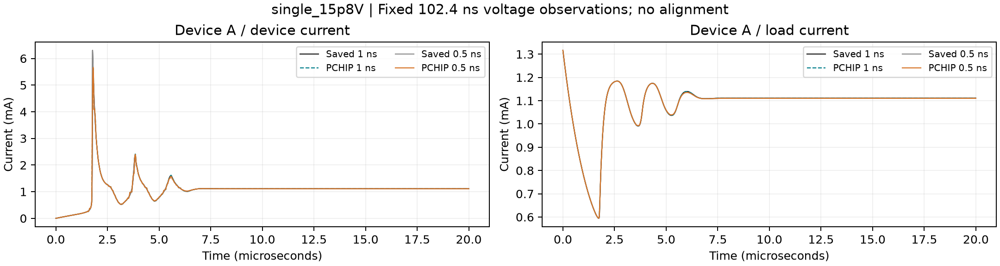
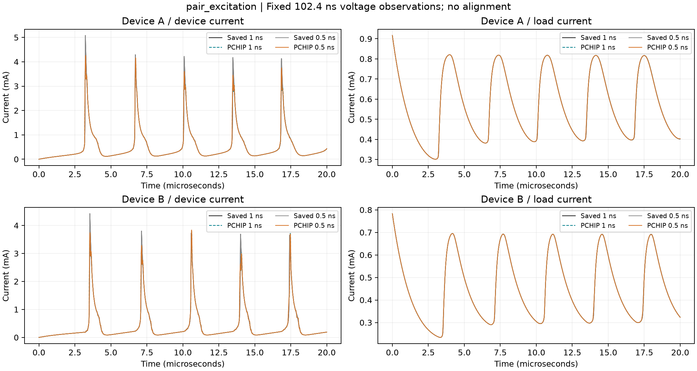
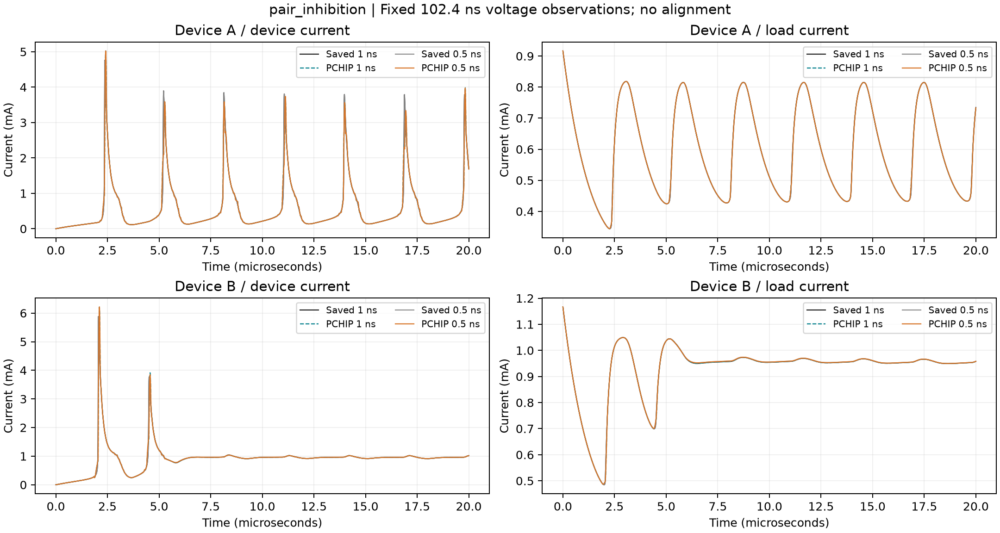
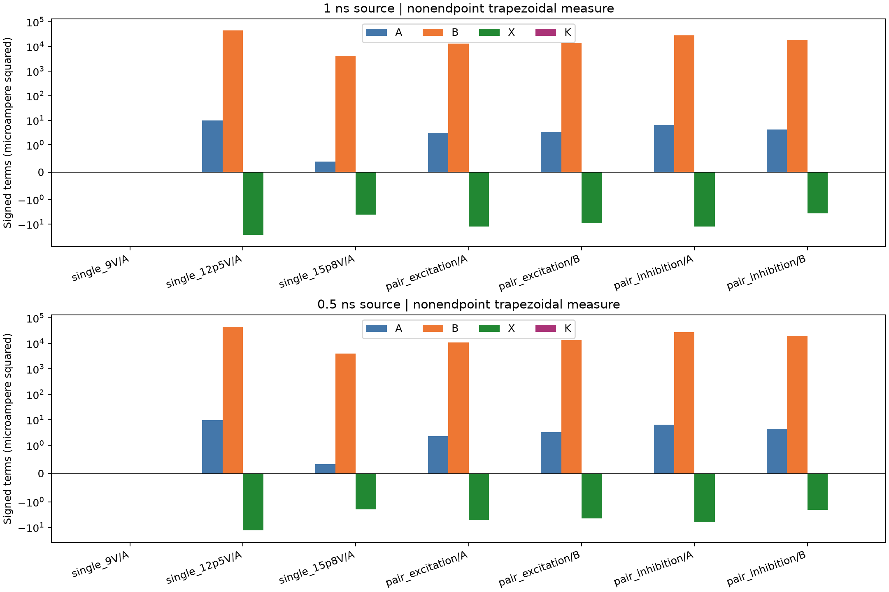

# 固定电压观测的电路重构筛查：执行结果与下一判断

任务 `PCM-20260927-MANUSCRIPT-CIRCUIT-SCREEN-01` · 2026-09-28 · 本地交付，未 Git 发布

**结论：VERIFIED。** 五工况、两种原保存步长全部完成，共十条系统记录、七个器件角色、十四套电压重构。每套严格使用197个预定电压观测；预测只生成一次并锁定，再评分。新增系统推进、网络推理和训练均为零。

**SUPPORTED_INTERPRETATION。** 在有动态响应的六个器件角色中，器件电流全程 RMS 为63.277–211.451 μA，负载支路为0.570–3.119 μA。静息9 V记录分别为0.05045–0.06670 μA及约0.00050 μA。十四套记录的原峰数与重构峰数相同，58对峰全部完成限定范围内的匹配，但单峰时间偏差最大79 ns、峰高绝对偏差最大1.13722 mA。峰数一致不能代替波形或峰形精度。

**UNKNOWN。** 本轮来源未提供与支路、区间、指标和具体用途匹配的绝对容差，`tau_task=null`；不裁定“绝对够用”。也没有新 PINN，不能裁定方法增量或二维热模型必要性。五工况不投票，两步长不是独立重复。

## 1. 全部主结果

以下为原生时间轴0–20 μs、含两端、归一化梯形权重；固定1 mA归一误差等于表中 μA 数值除以1000。完整精度在CSV/JSON中，原报告的节点均值指标未改动。

| 工况 | 原步长 ns | 器件 | 器件 RMS μA | 负载 RMS μA | 原峰/重构峰/匹配 | 峰时 RMS ns |
|---|---:|---|---:|---:|---|---:|
| single_9V | 1 | A | 0.066701 | 0.000505 | 0/0/0 | N/A |
| single_9V | 0.5 | A | 0.050452 | 0.000503 | 0/0/0 | N/A |
| single_12p5V | 1 | A | 211.037086 | 3.107787 | 7/7/7 | 48.527 |
| single_12p5V | 0.5 | A | 211.451256 | 3.118527 | 7/7/7 | 50.142 |
| single_15p8V | 1 | A | 64.160758 | 0.618307 | 3/3/3 | 20.728 |
| single_15p8V | 0.5 | A | 63.276923 | 0.569717 | 3/3/3 | 19.837 |
| pair_excitation | 1 | A | 114.772975 | 1.752637 | 5/5/5 | 13.401 |
| pair_excitation | 1 | B | 118.039826 | 1.834730 | 5/5/5 | 38.512 |
| pair_excitation | 0.5 | A | 103.868333 | 1.514965 | 5/5/5 | 15.490 |
| pair_excitation | 0.5 | B | 117.384514 | 1.815436 | 5/5/5 | 39.525 |
| pair_inhibition | 1 | A | 166.451788 | 2.510938 | 7/7/7 | 45.302 |
| pair_inhibition | 1 | B | 134.442778 | 2.071348 | 2/2/2 | 47.524 |
| pair_inhibition | 0.5 | A | 167.261256 | 2.526365 | 7/7/7 | 44.049 |
| pair_inhibition | 0.5 | B | 137.117075 | 2.121570 | 2/2/2 | 48.503 |

0–10 μs与10–20 μs分别计算的完整波形、电压、电荷和峰记录见[结果JSON](circuit-screen/results.json)、[波形表](circuit-screen/waveform-metrics.csv)、[电压表](circuit-screen/voltage-metrics.csv)、[峰表](circuit-screen/peak-summary.csv)及[配对明细](circuit-screen/matched-peaks.csv)。双器件联合值使用等权 MSE 后开方，见[联合指标](circuit-screen/joint-metrics.csv)。无峰时峰时与频率为null；一个配对峰仍报告时差和高度差，频率需要至少两个峰。负载峰规则未定义，记N/A。

## 2. 有效性、误差分解和数值敏感性

**VERIFIED：** 十条原生记录同层KCL、负载读出、步间κ、电荷记账和代数分解均通过按FP64运算尺度确定的工程检查。同层KCL最大绝对值为8.674×10⁻¹⁹ A，κ最大绝对值为1.947×10⁻¹⁴ A，最大κ/逐点工程容差为0.005932。κ使用保存的每个原生单步，没有稀疏差分替代、移位或补造终点前向导数。[KCL完整表](circuit-screen/KCL-checks.csv)

分支电流分别保存在原数组中，但其来源仍是同一作者模型RHS，电容电流由同一电路右端生成；此核对确认保存和时序一致性，不是独立物理观测的验证。

器件分解使用非终点子网格的重新归一梯形权重，δI=−a−b+κ，MSE=A+B+X+K。B为电容电压导数误差平方，在当前动态记录中远大于A；X和K保留符号，不能解释为全部正的百分比贡献。它解释这一个固定插值/电路读出的误差组成，不证明热物理或PINN能消除此误差。此子网格MSE不替代含终点的主MSE。[分解表](circuit-screen/error-decomposition.csv)

电荷评分使用同一个PCHIP分段多项式的解析积分，对照保存电流的原时间梯形积分；另外报告Euler左和、κ积分以及梯形/左和差。两种积分口径保持各自意义，未把它们的差当成电荷守恒破坏。[电荷表](circuit-screen/charge-metrics.csv)与[Euler记账](circuit-screen/Euler-charge-accounting.csv)

三种粗细敏感性在共同1 ns轴上单列：原电流差、各自重构误差曲线之差、重构曲线之差。例如激发工况A的原电流差RMS为34.753 μA，两源步长各自重构RMS的共同轴差为10.904 μA；12.5 V相应数值为39.722 μA与−0.414 μA。不得用重构RMS接近替代原波形的时间步敏感性；这些差值不是连续误差界或置信区间。[敏感性表](circuit-screen/step-sensitivity.csv)

所有预测保持原值，没有裁剪或对齐；本轮预测最小器件电流均为正。原15.8 V三初始峰及原报告中的文献比较身份、抑制工况末段低幅调制均保留；没有用T/R/g给PCHIP创造工作态标签。

## 3. 实验资格与封存

**VERIFIED：** 已对照Qiu主文/预印本及其补充、Zhang后续论文及补充、固定作者仓库README与已有`data.zip`中的通道说明。Zhang补充明确其低阈值双器件与主文模型的器件不同；公开CSV不能改名为Qiu原图数据。[Zhang补充，Appendix B](https://media.springernature.com/original/springer-static/esm/art%3A10.1038%2Fs41467-024-51254-4/MediaObjects/41467_2024_51254_MOESM1_ESM.pdf)

**UNKNOWN：** 通道说明给出CH1/CH4电压、CH2/CH3跨50 Ω电压及除以50的换算，但没有给出传感器相对电容、器件与参考地的可核验接线。Qiu Fig.1B显示理想并联RC模型，测量方法记载电压通道1 MΩ、电流通道50 Ω，仍不能据此给这五条不同器件记录确定完整测量拓扑。名义偏置来自文件名，完整记录区间驱动、相应电容和通道延时未闭合。不能静默忽略50 Ω、加到12 kΩ，或用隐藏电流校正电压后仍声称仅电压输入。[Qiu预印本，Fig.1B及补充方法](https://arxiv.org/pdf/2307.11256v2)、[Zhang测量方法](https://www.nature.com/articles/s41467-024-51254-4)

因此五条开发记录的负载和器件支路均未进入本次预测/评分；这是输入资格未闭合，不是算法失败。未知C只阻塞器件支路；本次负载支路另外受电压节点、接线和区间驱动限制。未知T/H、上电前热历史、用途容差和低阈值峰规则没有被用作阻塞合法波形评分的理由。逐记录见[实验资格表](experimental-qualification.md)及[机器记录](experimental-qualification.json)。

本轮未打开任何实验CSV数值成员，只读取已有清单和压缩包内的文字说明。`(1E3,1E2)=(4.1,3.9) V`维持封存，不抽电压、不评分。五条白名单在固定配置中逐个列明；既有记录行数31250及应抽978点只作为历史元数据与工程规则，不伪报为本轮实验预测。

## 4. 实际执行与存储

SciPy 1.14.1、NumPy 2.1.1、FP64；在已授权V100实例上使用CPU运行固定PCHIP，没有GPU算术。预测约1.193秒；最终评分约3.005秒，采样主存峰约91.2 MiB。首次评分在初始近零电流处遇到代数核对容差尺度遗漏，保留故障日志与旧分析源码，仅修复运算尺度并复用全部锁定预测；KCL容差、节点、参数和科学规则不变。[执行与修正记录](circuit-screen/engineering-correction.json)

六项聚焦测试在本地及实例通过，包括初始电流相消、漏峰配对和缺参数分支处理。实例未安装Matplotlib，图件在本地从回收预测生成，未安装新依赖或重复预测。主机网关短时拒绝连接仅触发有限传输重试，未重启科学计算。

结果已回收并读取核验，远端持久目录保留输入和新结果。关机命令返回0，之后三次SSH端口均不可达；此记录不冒充云平台计费状态API确认。最终本地文稿/图件与收口记录标为待下一次获准实例会话同步，不为小文件重启实例。[回收](build/cloud/recovery.json)、[关机](build/cloud/shutdown.json)

旧原生NPZ、历史失败证据和第三方原包保留；旧稿资产以本地硬链接复用，硬链接不是独立备份。仅本轮已核验冗余传输包装及视觉检查后无下游用途的PNG进入清理；实际结果见[data-handling-record.json](data-handling-record.json)。P03仍OPEN，双端私有保存不等于外部访问。

## 5. 唯一下一研究动作

**SUPPORTED_INTERPRETATION／PROPOSED_NOT_AUTHORIZED：先闭合低阈值开发记录的“测量与用途合同”。** 需要一个可审计的逐记录说明，确定电压节点/参考地、50 Ω位置、增益/极性/延时、同期源电压、RL以及器件支路所需C，同时给出有来源的用途要求。已有有界来源读取未能闭合这些项；下一任务应取得对应原始元数据或授权来源澄清，不能通过误差拟合猜接线。若仍无法获得，保留输入未闭合并停止相应实验方法比较。

本轮不启动平滑扫描、二维模型、参数反演或4000/800神经预算。当前高阈值保存模型的PCHIP误差不能替代低阈值实验资格，更不能证明所有传统方法失败或PINN必要。现稿局部修订已独立交付；P02、严格双周期、材料验证、泛化和P03均未因本报告自动关闭。

## 6. 图件与复核入口

复核命令、字段/单位、实际输入身份、分项成本和源码入口见[构建与复核说明](build-and-reproduction.md)。JSON为全精度主记录，CSV为空的不可定义数值与JSON null对应，不以0或NaN冒充。
