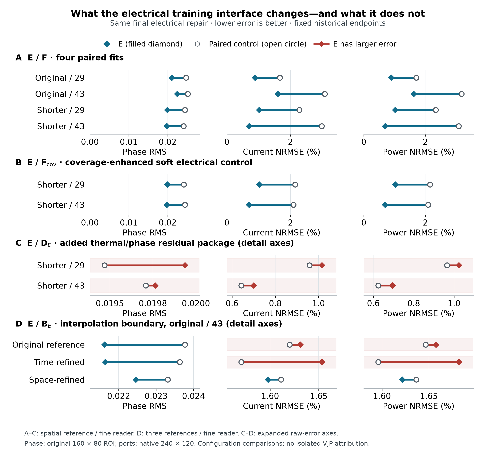

# Training-time electrical elimination in physics-informed neural networks for electrothermal phase reconstruction

Authors: [author names and affiliations to be supplied]

Corresponding author: [name and email to be supplied]

## Abstract

A final electrical solve can repair terminal outputs without changing the temperature and phase states learned from discrete field observations. We test whether solving the grounded electrical subproblem during training changes that reconstruction in a synthetic two-dimensional electrothermal device. An eliminated PINN couples neural temperature and phase to a finite-volume electrical solve and consistent local Joule deposition. All controls receive the same final electrical solve. Four paired full-label E/F fits on two separately reconstructed pulse protocols retain the complete device-advantage criterion under three references and two readers; current and power error reductions are 47.03-76.52% and 47.86-77.50% with the spatial reference and finer reader. Against the coverage-enhanced soft electrical control, E reduces current error by 52.68% and 66.55% for the two shorter-protocol initializations on that same evaluation. These results support an effect of the tested training interface that final electrical repair does not remove. Strong interpolation supplies a counterexample, while matched removal of thermal/phase interior residuals does not establish their additional reconstruction value. With phase labels withheld throughout the second cycle, improved ports and recovery of an event coexist with inadequate phase support and failure of the strict two-cycle rule. The evidence supports a configuration-level benefit within the tested task, rather than a general benefit from adding physical residuals, an isolated gradient mechanism, or material validation.

Keywords: physics-informed neural network; electrothermal coupling; electrical elimination; missing phase observations; phase-field reconstruction

## 1. Problem and information conditions

Small potential errors can produce large contact-current and local-heating errors in a coupled phase-transition calculation. Electrical repair restores the electrical constraint for a given learned state, but leaves that state's temperature and phase unchanged. This distinction motivates the central question:

For neural reconstruction of coupled electro-thermal-phase states from discrete field observations, does solving the grounded electrical subproblem during training alter the learned thermal/phase states in ways that cannot be recovered by a common post-training electrical solve?

PINNs combine observations with explicit differential-equation residuals [1]. We study how electrical constraints participate in reconstructing transient temperature and phase from prescribed field observations. The task is an offline, known-model reconstruction benchmark: geometry, coefficients, initial and boundary conditions, and the complete drive are supplied. Each of the two protocols is fitted separately. Its original observation set contains 28,875 positive-time locations and 86,625 noiseless scalar labels for potential, temperature and phase. These locations constitute 1.8046875% of the 3,200 × 500 positive-time carrier positions; at each observation time, 231 spatial locations cover 7.21875% of the carrier cells. Noiseless labels still inherit the carrier's numerical discretization error. These experiments do not establish a minimal sensor arrangement, zero-shot transfer or calibrated material reconstruction.

The contribution is an application of electrical elimination to coupled state reconstruction, evaluated through a chain of controls. E/F tests the training interface after a common electrical repair; F_cov strengthens the soft electrical constraint's space-time coverage; D_E removes only the added thermal/phase interior package; B_E tests a strong same-solver interpolant; and B1 withholds a complete second-cycle phase-observation window. Together they distinguish a retained device-level benefit from the limits of internal phase recovery. The implementation couples neural temperature and phase to the grounded electrical solution and uses the same face resistances for local Joule deposition. Electrical elimination and implicit differentiation are established ideas; the claimed contribution is this physical coupling interface and its measured, bounded reconstruction effect.

Differentiable constrained learning already includes solver-in-the-loop correction [3], hybrid FEM-NN models [4], PDE-constrained layers [15], and modular implicit differentiation [5]. Related approaches enforce hard boundary maps or constrained optimization [16], prescribed integral targets [12], differential-algebraic constraints [17], and local discrete projections [18]. Here the transient T/φ states remain neural, while the full grounded electrical subproblem is eliminated. This identifies a physical interface adaptation and its controlled comparison; it does not imply general superiority over all penalty or constrained-optimization methods.

Reduced and all-at-once PDE formulations provide the broader setting for eliminating a constrained variable versus jointly optimizing all fields [13]. Here only quasi-static potential is eliminated; the transient states remain neural.

The field network follows the smooth modified-MLP construction of Wang et al. [2]. The spatial cell-balance thermal residual is related to control-volume learning [6], while the nonconserved phase dynamics use an Allen-Cahn-type potential [7]. The device layout and electrothermal feedback are inspired by wall-cell phase-change-memory modeling [8]; its Ge-rich GST material formulation is distinct from the present dimensionless single-phase variable. The parameters below define the synthetic benchmark and are not an oxide calibration.

## 2. Two-dimensional physical object

### 2.1 Equations, geometry and known coefficients

The computational cell is Ω = [−1,1] × [0,1], with coordinates x and z and time 0 ≤ t ≤ 2.5. Potential V, reduced temperature T and phase fraction φ obey

$$\nabla\cdot(\sigma(T,\phi)\nabla V)=0. \qquad (1)$$

$$T_t+L\phi_t=\alpha\Delta T-\gamma T+Q\sigma(T,\phi)|\nabla V|^2. \qquad (2)$$

$$\phi_t=M(T)\left[\epsilon^2\Delta\phi-\partial_\phi W(\phi,T)\right]. \qquad (3)$$

The conductivity, mobility and local phase potential are

$$\sigma=\exp[\beta T+\log(R)\phi^2(3-2\phi)], \qquad (4)$$

$$M(T)=m_c+(m_h-m_c)\operatorname{sigmoid}[(T-T_c)/w_M], \qquad (5)$$

$$W=B\phi^2(1-\phi)^2+D(T_c-T)\phi^2(3-2\phi). \qquad (6)$$

We use α = 0.10, γ = 4, L = 0.05, Q = 4, β = 0.25, R = 8, ε = 0.04, B = 1, D = 6, T_c = 0.45, m_c = 0.5, m_h = 5 and w_M = 0.08. Mobility multiplies the entire phase bracket; it is not moved inside a divergence. Because W depends on the externally evolving temperature, the model is not assigned an autonomous monotone free-energy constraint.

The full top electrode is driven by U(t); a centered bottom segment |x| ≤ 0.35 is grounded. All remaining electrical faces are insulating. The top temperature is zero; the other thermal boundaries satisfy ∂ₙT + 0.25T = 0. Phase satisfies ∂ₙφ = 0 on every boundary. Initially T = 0 and

$$\phi_0=0.02+0.01\exp\left[-\frac{1}{2}\left((x/0.18)^2+((z-0.12)/0.10)^2\right)\right]. \qquad (7)$$

These assumptions define a synthetic wall-cell benchmark. No dimensional material parameters, experimental memory operation, or oxide-specific constitutive identification are inferred from it.

### 2.2 Initial-boundary interpretation

For the initial phase in Eq. (7), at x=0 on the bottom boundary, its outward normal derivative is −0.12 exp(−0.72)=−0.0584102707151966. It is therefore not pointwise compatible with the phase Neumann condition at t=0. The reference applies the stated discrete no-flux operator during subsequent evolution; the neural representation retains the exact initial map and penalizes phase boundary residuals. We do not assume classical smooth compatibility on the closed space-time boundary.

Direct inspection of the twelve saved historical full-label calibration/L-BFGS/audit pools for the two protocols and two seeds finds no t=0 boundary node and hence zero boundary quadrature mass there. This finite-pool fact is distinct from a probabilistic argument about continuous random draws. The existing Adam rule generates boundary times from the four physical windows without explicitly inserting t=0; it does not mathematically exclude a zero random variate. The compatibility limitation is retained regardless. Its effect on the E/D_E ranking is unknown; neither the initial state nor the boundary rule has been changed.

### 2.3 Pulse histories and observations

Each pulse rises linearly from zero to 0.72 over its first 0.05 time units, holds until local time 0.27, then falls to zero at 0.35. The original protocol starts two pulses at 0 and 1.25. The intervention changes only the second start to 1.01, leaving the pulse shape, total time, coefficients and boundaries fixed. The input contains exactly two pulses; it is not periodically extended to create a third pulse. Advancing the second pulse by 0.24 preserves its phase relative to the 0.02 observation spacing.

Support trajectories use 80 × 40 cells, a main time step of 0.0025 and saving every two steps. The spatial and temporal masks take indices 0,4,8,… and the last index, fixed independently of field values. The resulting 21 × 11 × 126 mask contains 231 analytic initial positions and 28,875 positive-time positions, with 86,625 scalar field labels. Training receives only these samples, coordinates and known physical laws. Dense support fields, reference fields, reference currents or heating, and sealed stress cases do not enter these training losses or within-run endpoint selection. Published reference evaluations informed subsequent research questions and interpretation; the overall development process is not claimed to be reference-blind.

The evaluation reference uses 160 × 80 cells, a main time step of 0.000625 and saving every four steps, giving 1001 times. Both numerical trajectories use backward-Euler finite-volume steps with converged electrical/phase/thermal block iterations and logit Newton for phase, as specified in Supplement S1.1. Their algebraic convergence tolerances do not certify discretization accuracy. The grids serve different roles; their existence alone is not a convergence study. Each protocol has its own observations and is fitted separately. The intervention is consequently a complete-case adaptation experiment, not zero-shot transfer or a formal out-of-distribution test. The two seed values are reused across protocols for paired reporting, not counted as four independent physical cases.

![Figure 1. Actual geometry, fixed spatial sampling and finite pulse protocols. The shaded interval W=[1.01,2.02] removes only phase labels in B1; potential and temperature remain observed. Phase observations after W remain available. Dashed vertical lines mark the predeclared display times 0.27 and 1.28. The dashed spatial box is the fixed state-error ROI.](figures/fig01-object-information.png)

Figure 1. Actual geometry, fixed spatial sampling and finite pulse protocols. The shaded interval W=[1.01,2.02] removes only phase labels in B1; potential and temperature remain observed. Phase observations after W remain available. Dashed vertical lines mark the predeclared display times 0.27 and 1.28. The dashed spatial box is the fixed state-error ROI.

## 3. Method and matched controls

### 3.1 Neural states and electrical elimination

Let u_θ = (T_θ, φ_θ). Independent smooth modified-MLP heads [2] have width 64 and four hidden layers; the shared temperature architecture also includes a small additive latent adapter described in the Supplement. FP64 arithmetic and identical output mappings are used in both methods. With a(t) = 1 − exp(−t/0.35),

$$T_\theta=2.5a(t)(1-z)\operatorname{sigmoid}(h_T), \qquad (8)$$

$$\phi_\theta=\operatorname{sigmoid}[\operatorname{logit}(\phi_0)+8a(t)h_\phi]. \qquad (9)$$

The eliminated method, E, evaluates σ_θ from these states and solves the grounded electrical system

$$A(\sigma_\theta)v^*=f(U,\sigma_\theta). \qquad (10)$$

For an internal face e between cells i and j, the half-cell distances d and face area A_e define

$$R_{ei}=d_{ei}/(\sigma_i A_e),\quad R_{ej}=d_{ej}/(\sigma_j A_e),\quad g_e=(R_{ei}+R_{ej})^{-1}. \qquad (11)$$

Electrode faces use the corresponding half-cell resistance and the actual heater overlap. Insulating faces contribute no outward conductance. Positive conductances on the connected grid, with Dirichlet electrodes fixing its gauge, make the assembled electrical matrix nonsingular. Electrical enforcement means solving this discrete system to numerical precision; it is not an exact continuum solution. The implementation uses sparse factorization, not a dense inverse. For a scalar loss, the complete first-order derivative is obtained from

$$A^{\mathsf T}z=\partial\mathcal L/\partial v,\qquad d\mathcal L=d\mathcal L_{\rm direct}+z^{\mathsf T}(df-dA\,v^*). \qquad (12)$$

The direct term includes the explicit dependence of heating on conductivity. The right-hand side f also depends on electrode conductance, and its derivative is retained. A factorization may be reused for the adjoint of the same forward solve, but not after changing the state. This is an application of implicit differentiation [5], with no claim of a new differentiation theorem or support for arbitrary second-order derivatives.

### 3.2 Consistent local Joule deposition and remaining residuals

Given either the solved or neural potential, face current and deposition are

$$I_e=g_e(v_i-v_j),\qquad P_{e\to i}=I_e^2R_{ei},\qquad P_{e\to j}=I_e^2R_{ej}. \qquad (13)$$

Electrode power enters the neighboring boundary cell. For cell volume ω_i, q_i is its deposited power divided by ω_i. This allocation is not generally an equal split between adjacent cells. It gives

$$\sum_i\omega_iq_i=P_J, \qquad (14)$$

where P_J sums all internal and electrode dissipation. Equation (14) is an accounting identity for the shared face network, even when a neural potential violates electrical balance. Equality with terminal power UI additionally requires the electrical equations. Neither identity by itself establishes accuracy relative to the reference heating field. P_J denotes electrical dissipation; the reduced thermal source is Qq, so its integral is QP_J. This normalization and the temperature-dependent phase potential do not imply a general total-free-energy decay theorem.

The temperature residual uses a cell balance,

$$R_{T,i}=\partial_t(\bar T_i+L\bar\phi_i)+\gamma\bar T_i-\frac{\alpha}{\omega_i}\sum_f A_f(\nabla T_\theta)_f\cdot n_{if}-Qq_i. \qquad (15)$$

Cell means use midpoint quadrature. Temperature gradients are differentiated at shared face nodes with opposite normals for neighboring cells, including the model's own gradients on boundary faces. The same thermal boundary residual remains in both losses. The factor Q is applied once. The phase residual is

$$R_\phi=\phi_t-M(T)[\epsilon^2\Delta\phi-2B\phi(1-\phi)(1-2\phi)-6D(T_c-T)\phi(1-\phi)]. \qquad (16)$$

Thus the thermal interface is a spatial cell-balance residual and the phase interface is a pointwise AD residual. They are not claimed to equal the previous pointwise thermal formulation or the full space-time construction of [6]. At U = 0, E uses the analytic electrical solution v = q = 0 while thermal and phase evolution remain active.

### 3.3 Soft comparator and training objectives

The soft electrical PINN, F, trains all three field heads. Its potential is V_θ = U(t) exp(h_V)/[exp(h_V)+1−z], preserving the voltage range and the exact top value. It evaluates the same face operator and Joule deposition as E, but penalizes

$$r_{e,i}=(A(\sigma_\theta)V_\theta-f(U,\sigma_\theta))_i/\omega_i. \qquad (17)$$

No additional, differently averaged electric boundary loss is added: electrical boundary conductances already enter this residual. Let L_obs denote the common weighted observation loss, including the full initial-logit increment for phase, and let L_BC and L_IC be the common remaining boundary and initial losses. Their exact measures are specified in Supplement S2. With one calibration a,b at the shared parent and λ rising to 0.1,

$$J_{T\phi}=\frac{1}{3}\mathbb E_\rho[(R_T/4)^2+(R_\phi/5)^2], \qquad (18)$$

$$\mathcal L_E=L_{{\rm obs},E}/a+\lambda(5L_{\rm BC}+L_{\rm IC}+J_{T\phi,E})/b, \qquad (19)$$

$$\mathcal L_F=L_{{\rm obs},F}/a+\lambda(5L_{\rm BC}+L_{\rm IC}+J_{T\phi,F})/b+\frac{\lambda\eta}{3b}\mathbb E_\rho[r_e^2]. \qquad (20)$$

Here ρ is the uniform space-time target with the declared time-window quadrature. Scales a and b are shared within a pair and frozen, with a numerical floor of 10⁻¹². The primary F uses η = 1. A development control uses a one-time gradient-balanced η; a second control replaces the 128 sampled electrical cells by the volume mean over all 3200 cells at each physical time. The latter changes spatial integration, not the penalty by a factor of 25. Thermal and phase terms keep their original interfaces.

E freezes the unused potential head. Its voltage observations differentiate through conductivity and the solve, whereas F voltage observations act on its potential head. E enforces its constraint at powered observation and physics times; F penalizes it at physical residual times. Initial potential, active parameters, constraint strength and gradient maps consequently differ. These are explicit parts of the method-package comparison, not hidden evidence for an isolated VJP mechanism.

### 3.4 The D_E ablation and strong interpolant

E learns T and φ through the electrical solve and includes the thermal/phase interior residuals, boundary terms and initial constraints. F retains a neural potential and the frozen finite electrical penalty; its endpoint receives the identical electrical readout used by E. D_E shares E's neural state mapping, temperature adapter, electrical solve, complete first-order conductivity feedback, voltage-observation loss, boundary/initial constraints, parent, calibration and optimization limits; only the thermal/phase interior package is removed. D_E is consequently a physics-containing ablation, not a data-only network.

B_E uses time-PCHIP and spatial-linear interpolation of the supplied T/φ observations, the original initial-logit restoration and known boundary extensions, followed by the same electrical solve. It is constructed once per protocol/information condition and does not use the V labels. The E/B_E comparison therefore measures practical competitiveness under the stated input utilization, not a strictly identical information-use intervention.

The precise ablation objective is

$$\mathcal{L}_{D_E}=L_{{\rm obs},E}/a+\lambda(5L_{\rm BC}+L_{\rm IC})/b. \qquad (21)$$

The scale b is still calibrated from the complete parent physical package. Thus E minus D_E removes exactly the interior term rather than renormalizing the shared boundary or observation contribution. Targeted value/gradient checks and full-visible compatibility checks passed before the recorded execution.

The controls answer distinct questions. F_cov is the coverage-enhanced soft electrical control and tests the declared joint change in spatial and temporal constraint measures; D_E tests the additional thermal/phase interior-residual package; B_E tests competitiveness under its stated use of visible fields; B1 tests a complete second-cycle phase-observation gap. E/F and E/F_cov remain configuration comparisons and do not isolate the VJP.

### 3.5 Common parents, fixed endpoints and readouts

For each protocol, seeds 29 and 43 initialize fresh networks and a zero-output adapter, without loading trained weights, optimizer history or calibration. A common observation-only parent receives 2400 Adam updates [9] and 600 full-observation L-BFGS evaluations, 200 per field head [10]. E and F then start from that same fitted parent with fresh optimizers. Each branch receives 1500 Adam updates and at most 300 fixed complete-objective/gradient evaluations. Every line-search trial and repeated evaluation counts; budget termination restores the last accepted state. No reference score selects a checkpoint.

The learning rate, Adam parameters, clipping, observation stream, physical time windows and residual scales are shared. L-BFGS uses fixed data and quadrature, without resampling or gradient clipping inside its closure. Equal update and evaluation caps do not imply equal computation: E incurs sparse forward and adjoint solves, while F differentiates a potential network and its explicit residual. Actual work is retained in Supplement S6 and consolidated with the matched accuracy records in S26; no speedup is claimed.

The shorter-protocol D_E controls share the corresponding full-label parents. B1 instead establishes two entirely new observation-only parents with only its visible phase labels, then runs E, D_E and F in each seed without selecting a favorable checkpoint or skipping an arm based on performance. All fixed endpoints are locked before reference scoring. The common 160 by 80 and 240 by 120 electrical readers evaluate every model at the same 1001 times. Fine-grid T/phase are direct queries of the same locked function. T/phase and event scores remain on 160 by 80; only fine potential is conservatively restricted for the inherited field guard, while native currents, power and Joule deposition stay native.

### 3.6 Distinct error and event measures

The historical primary comparison uses the same 160 × 80 electrical layer at the reference times. The 240 × 120 reader changes prediction-side electrical discretization while preserving the historical scoring measure. The unprojected F readout is retained separately. For a fixed F, projection changes V, q and electrical readouts while leaving T, φ and every phase event unchanged. The error measures distinguish these effects.

S is the space-time mean symmetric difference of active sets, where active means φ ≥ 0.5; it uses the full cell domain and global trapezoidal time weights. Raw E_φ is phase RMS on the ROI |x| ≤ 0.55, 0 ≤ z ≤ 0.55. E_T is ROI temperature RMS divided by 0.45, and E_V is unnormalized full-domain potential RMS. Device errors are

$$\mathcal{E}_I=\frac{\|I-I_{\rm ref}\|_t}{\|I_{\rm ref}\|_t},\quad \mathcal{E}_P=\frac{\|P_J-P_{J,{\rm ref}}\|_t}{\|P_{J,{\rm ref}}\|_t},\quad \mathcal{E}_W=\frac{|\int(P_J-P_{J,{\rm ref}})dt|}{|\int P_{J,{\rm ref}}dt|}. \qquad (22)$$

The time norm is trapezoidal RMS over the complete interval. The matched device criterion compares predicted bottom current with the reference top-current trace, retaining the historical scoring convention. The top-current noninferiority guard uses the predicted top current. For projected states these terminal traces agree to solve accuracy; the archive also reports bottom-native errors as a separate diagnostic. Unprojected soft currents can disagree substantially and must not be interchanged. Percentages below are 100 times normalized errors, not dimensional percentage errors in temperature or phase. All absolute, percentage-point and relative differences are provided in the unified tables.

For the same heating-window measure, let M_pred, M_ref and M_TP be predicted, reference and overlapping active masses. When both masses exceed the numerical denominator floor, the definitions give

$$\operatorname{recall}=\operatorname{precision}\,\frac{M_{\rm pred}}{M_{\rm ref}}\leq\min\left(1,\frac{M_{\rm pred}}{M_{\rm ref}}\right). \qquad (23)$$

This identity separates an insufficient predicted active mass from mismatch in space and time at a fixed mass. It is a descriptive support diagnostic, not a new loss or evidence that a particular neural mechanism caused the error. The original near-zero floors remain in the scorer. The strict gates are project-defined evaluation requirements, not experimental device-reliability standards or estimates of a success probability.

Predeclared phase-reconstruction and device-function criteria require 10% improvements in their named primary metrics with 5% noninferiority guards and fixed absolute floors. They are retained in Supplement S3, rather than used as a substitute for reporting error magnitudes. Failure to cross an advantage threshold does not demonstrate equivalence. Strict event usability is separate: both cycles must meet onset error ≤ 0.005, recall ≥ 0.9, precision ≥ 0.8, mass ratio 0.8-1.2, and the specified peak, locality and recovery conditions. An onset is the linearly interpolated upward crossing of ROI active fraction 0.02. Support metrics integrate cell-volume overlap during each heating window.

For projected states, P_J = UI to electrical solve accuracy. Current and power errors thus differ in drive-dependent temporal weighting, but are not independent physical replications. Likewise, a small integrated energy error may reflect cancellation. We therefore retain the signed per-pulse errors, event metrics and local state errors even when global device criteria pass.

### 3.7 Frozen second-cycle phase-gap experiment

The B1 observation condition removes phase labels on the complete second cycle W=[1.01,2.02] of the existing shorter protocol. V/T observations and phase outside W, including t>2.02, remain available. The exported data contain 17,094 positive-time phase labels and omit 11,781; V and T each retain 28,875. The original observed grid contains 1.02 through 2.02 within W, with no observed node at 1.01. The last preceding and first following visible times are 1.00 and 2.04. The analytic initial condition remains known.

Two new observation-only parents, seeds 29 and 43, each initialize E, D_E and F under the frozen recipe. No complete-label trained state, calibration or interface pool is reused. Phase observation mass restricts the original coordinate quadrature before normalization. A threshold-straddling cell is admitted only when all its original adjacent corners remain visible. The primary question is whether E adds information over D_E in W, under the separately named A_w criterion. Whole-history A/B, strict events, outside-window costs and E/F/B_E comparisons remain separate. This is offline reconstruction of a developed protocol, not online forecasting or a wholly unobserved phase trajectory.

A_w applies the original phase-advantage formula to W with its own time weights and normalizers: each of the S and phase-RMS improvements must satisfy

$$ E_{\mathrm{control}}-E_{\mathrm{candidate}}\geq\max(0.1E_{\mathrm{control}},\epsilon_{\mathrm{abs}}). $$

The absolute floor is the corresponding inherited tolerance. T, top-current and potential retain their original 5% noninferiority guards. The bottom-current convention remains separately reported. The outside measure integrates [0,1.01] and [2.02,2.5] separately, without bridging W. Its unnormalized integrals plus those of W reproduce the full-history integrals. Outside costs include all seven named state/device quantities. Original full-history A/B and strict-event rules remain unchanged. This is a complete withheld time window for phase, with V/T still observed inside it; it is not a formal out-of-distribution or forecasting test.

## 4. What training-time electrical elimination changes

### 4.1 Four paired full-label comparisons

All four clean E/F pairs retain the complete device criterion under every existing reference and both readers. Under the spatial reference with the finer reader, current-error reductions are 47.03-76.52% (0.78-2.28 percentage points) and power-error reductions are 47.86-77.50% (0.82-2.39 points). The comparison therefore survives giving F the same final electrical solve. Phase RMS is also lower by 10.76-18.46% on this measure, but the complete phase-advantage rule A fails for original/43 and shorter/43; B passes for all four pairs. The common readout leaves T and phase untouched, so the learned-state difference is already present before readout and cannot be generated or removed by electrical repair alone. Four pairs on two related protocols are the comparison units; reference, reader and saved-time counts do not increase that sample size.

Table 1. Complete full-label objects under the spatial reference and fine reader. Phase uses the original 160 by 80 ROI; native device NRMSE values are percentages. B_E is one deterministic object per protocol. D_E is shown alongside the learned controls rather than introduced only after the main results.

| Protocol | Seed | Role | Phase RMS | Current (%) | Power (%) |
| --- | --- | --- | --- | --- | --- |
| original | 29 | E | 0.02106207 | 0.883264 | 0.8899832 |
| original | 29 | F | 0.0247498 | 1.667333 | 1.707004 |
| original | 43 | E | 0.02245753 | 1.597848 | 1.621556 |
| original | 43 | F | 0.02516481 | 3.074835 | 3.182074 |
| original | shared | B_E | 0.02330959 | 1.611207 | 1.636592 |
| shorter | 29 | E | 0.01993633 | 1.015578 | 1.023698 |
| shorter | 29 | F | 0.02444965 | 2.276812 | 2.343231 |
| shorter | 43 | E | 0.01976312 | 0.70046 | 0.6946931 |
| shorter | 43 | F | 0.02409929 | 2.983776 | 3.08711 |
| shorter | shared | B_E | 0.02521684 | 1.904295 | 1.947497 |
| shorter | 29 | D_E | 0.01946826 | 0.9581218 | 0.9651937 |
| shorter | 43 | D_E | 0.01970853 | 0.6429467 | 0.6245033 |

Figure 2. What the electrical training interface changes-and what it does not. A: four paired E/F fits after a common electrical solve. B: E against the coverage-enhanced soft electrical control. C: matched D_E interior-residual removal. D: the B_E counterexample for original-protocol seed 43. A-C use the spatial reference and fine reader; D retains all three references with that reader. Phase RMS uses the original 160 by 80 ROI, and port errors use the native 240 by 120 reader. A-B share zero-based axes for each quantity; C-D use explicitly marked expanded raw-error axes. Red marks larger E error. Shared reference/readout conditions do not add independent fits, and these three metrics alone do not establish the full A/B rules.

Table 2. Continuous effects and original full A/B decisions for Figure 2. Positive control-minus-E differences favor E. Current and power differences use percentage points; relative reductions use each control error as denominator. The full decision includes the separately defined noninferiority guards, so phase RMS improvement alone does not establish A.

| Comparison; protocol/seed | Δ phase RMS | Δ I / Δ P (pp) | Relative reduction: φ / I / P (%) | Original A / B |
| --- | --- | --- | --- | --- |
| E/F; original/29 | +0.003688 | +0.78407 / +0.81702 | +14.90 / +47.03 / +47.86 | Pass / Pass |
| E/F; original/43 | +0.002707 | +1.47699 / +1.56052 | +10.76 / +48.03 / +49.04 | Fail / Pass |
| E/F; shorter/29 | +0.004513 | +1.26123 / +1.31953 | +18.46 / +55.39 / +56.31 | Pass / Pass |
| E/F; shorter/43 | +0.004336 | +2.28332 / +2.39242 | +17.99 / +76.52 / +77.50 | Fail / Pass |
| E/F_cov; shorter/29 | +0.004218 | +1.13073 / +1.12968 | +17.46 / +52.68 / +52.46 | Pass / Pass |
| E/F_cov; shorter/43 | +0.004671 | +1.39378 / +1.39967 | +19.12 / +66.55 / +66.83 | Pass / Pass |
| E/D_E; shorter/29 | -0.000468 | -0.05746 / -0.05850 | -2.40 / -6.00 / -6.06 | Fail / Fail |
| E/D_E; shorter/43 | -0.000055 | -0.05751 / -0.07019 | -0.28 / -8.95 / -11.24 | Fail / Fail |
| E/B_E; original/43; original ref. | +0.002151 | -0.01105 / -0.01098 | +9.05 / -0.68 / -0.67 | Fail / Fail |
| E/B_E; original/43; time ref. | +0.001989 | -0.08281 / -0.08577 | +8.42 / -5.27 / -5.37 | Fail / Fail |
| E/B_E; original/43; space ref. | +0.000852 | +0.01336 / +0.01504 | +3.66 / +0.83 / +0.92 | Fail / Fail |

Δ = control error − E error; positive values favor E. Relative reduction is Δ/control. The current and power differences are percentage points, not relative percentages. A/B are the original full qualification decisions, copied from saved decision tables; they are not reconstructed from these three metrics. Rows A-C use the spatial reference and fine reader; the B_E boundary uses the original-protocol seed-43 fine reader under all three pre-existing references. Display rounding never changes a decision. Full-precision values and source lines: [interface-effects-full.csv](tables/interface-effects-full.csv).

Figure 3. Native 240 by 120 physical states and signed errors for the full-label shorter protocol. The first two columns show spatial-reference T, phase and Joule density at the two predeclared plateau endpoints. The remaining columns show E, repaired F and B_E minus reference at t=1.28 for seed 29. Error color scales are shared with the seed-43 companion in the supplement. These physical panels are descriptive native-grid views; the primary T/phase/event measure stays on 160 by 80.

Figure 4. All four historical E/F pairs under the same native spatial reference and the two electrical readers. Solid and dashed curves show current and power NRMSE. B_E is repeated visually across seeds but is one baseline per protocol. Signed E-F differences use percentage points. The complete criterion also includes all field guards.

The development controls illustrate why repair is a necessary comparison: with T/phase fixed, projection reduces F_raw current NRMSE from 279.30% to 1.071% and power NRMSE from 20.118% to 1.065%, while E gives 0.694% and 0.682%. A full-spatial finite-penalty control does not remove that development difference, but its integrated energy error is better. These controls delimit the tested package; they are retained in Supplement S4 and are not pooled as clean replications.

### 4.2 Coverage-enhanced soft electrical control

The coverage-enhanced soft electrical control, F_cov, comprises two additional soft-PINN continuations that retain the short-interval full-label parents, observation streams, non-electrical objectives, calibration and soft-network Joule source. Their electrical penalty replaces the original term with equal normalized physical-time and powered-observation-time measures over all 3200 cells. This changes spatial coverage and temporal measure together; it is not a pure coverage or isolated VJP experiment.

Against F_cov, E satisfies the original whole-history phase criterion A and device criterion B in 12/12 conditions each: two initializations, each evaluated with three references and two readers. The twelve rows are sensitivity conditions of two endpoints, not independent repetitions. F_cov satisfies A/B against its historical F in 0/12 and 0/12 conditions, and satisfies the unchanged strict rule in 0/12. These are twelve sensitivity records for two new continuations, not twelve independent runs.

Table 3. Continuous effects against F_cov under the spatially refined reference and finer electrical reader. Current NRMSE is reported in percent from the native 240 by 120 electrical reader; phase RMS uses the original 160 by 80 ROI. Values are display summaries of the existing spatial/fine/E_vs_F_cov rows, not new threshold decisions.

| Seed | Current F_cov (%) | Current E (%) | Reduction (%) | Phase F_cov | Phase E | Reduction (%) |
|---|---:|---:|---:|---:|---:|---:|
| 29 | 2.14630 | 1.01558 | 52.68 | 0.0241544 | 0.0199363 | 17.46 |
| 43 | 2.09424 | 0.70046 | 66.55 | 0.0244337 | 0.0197631 | 19.12 |

F_cov nevertheless reduces current and power error relative to F by 1.36-9.00% and 3.73-11.32% for seed 29, and 27.43-31.72% and 29.79-34.00% for seed 43. Its phase-set error S increases by 11.40-12.57% and 13.05-15.28%, respectively, violating the set-error noninferiority component in every condition. Thus the failed complete criteria coexist with continuous port improvements. Continuous metrics, all criterion failures and original network readouts are retained in Supplement S24. The tested coverage-enhanced soft control shows that insufficient electrical-constraint coverage alone does not explain the full observed difference. This is a SUPPORTED_INTERPRETATION of the tested configuration; the simultaneous change in spatial and temporal measures, together with initialization, active-variable and enforcement differences, prevents isolated attribution to coverage or the VJP.

### 4.3 Matched removal of the interior residual package

In both clean shorter-protocol pairs, D_E has lower phase, current and power RMS errors than E under all three references and both readers. Neither pair establishes the prescribed added-residual phase or device increment. With the spatial reference and finer reader, E exceeds D_E in phase/current/power error by 2.404%/5.997%/6.061% for seed 29 and 0.277%/8.945%/11.239% for seed 43. Other outcomes are mixed. Because the electrical solve and voltage feedback remain active in D_E, this result concerns the additional thermal/phase interior package. It does not test physics against a data-only network. Complete independent audit components remain in Supplement S17.

### 4.4 The strong interpolation counterexample

This robustness does not extend uniformly to B_E. For original-protocol seed 43 and the 240×120 reader, the full-precision records give:

Table 4. Continuous interpolation counterexample for original-protocol seed 43 with the fine reader. Negative relative error reduction means larger E error; full-precision records determine the unchanged A/B decisions.

| Reference | Current NRMSE: E / B_E (%) | Power NRMSE: E / B_E (%) | Relative current / power error reduction (%) | Original A / B |
|---|---|---|---|---|
| Original | 1.631055 / 1.620006 | 1.657409 / 1.646429 | −0.681976 / −0.666882 | False / False |
| Time-refined | 1.653271 / 1.570460 | 1.681856 / 1.596088 | −5.273031 / −5.373634 | False / False |
| Space-refined | 1.597848 / 1.611207 | 1.621556 / 1.636592 | 0.829142 / 0.918751 | False / False |

Negative reduction denotes larger E error. Under the time-refined reference the differences are 0.082811 and 0.085768 percentage points, respectively. Under the spatial reference E remains slightly better, below the prescribed practical margin. The first two comparisons already failed B, so the continuous reversals introduce no additional Boolean decision changes. Full-precision source fields and line locations are preserved in [the P04 table](tables/P04-original43-fine-continuous-effects.csv); these display values do not re-adjudicate thresholds.

### 4.5 Accuracy and actual numerical work

The reconstruction gains in Table 2 incur different kinds of electrical work. Table 5 reports the existing terminal counters for those same E/F and E/F_cov endpoints: all use 1500 Adam updates and 300 full L-BFGS evaluations, while E additionally performs about 19,600 forward and 19,600 adjoint electrical solves per branch. F_cov instead increases the explicit face-operator evaluation count from 7,800 to 31,547/31,524 for seeds 29/43. Those calls have different spatial supports and differentiation paths, so their counts are not equivalent units of runtime. The retained current/phase improvement of E is an accuracy result under the specified training limits, not a claim of equal work or a cost-normalized winner.

Table 5. Actual branch work paired with the saved accuracy comparisons in Table 2. L-BFGS evaluations include rejected and repeated trials; the accepted-step count is separate. Sparse electrical solves and explicit face-operator evaluations are distinct measures. NR means not recorded, not zero.

| Protocol/seed | Role | Adam | L-BFGS eval. / accepted | Forward / adjoint solves | Explicit face calls |
| --- | --- | --- | --- | --- | --- |
| Original/29 | E | 1500 | 300 / 145 | 19,612 / 19,612 | NR |
| Original/29 | F | 1500 | 300 / 147 | 0 / 0 | 7,800 |
| Original/43 | E | 1500 | 300 / 144 | 19,560 / 19,560 | NR |
| Original/43 | F | 1500 | 300 / 146 | 0 / 0 | 7,800 |
| Shorter/29 | E | 1500 | 300 / 145 | 19,608 / 19,608 | NR |
| Shorter/29 | F | 1500 | 300 / 147 | 0 / 0 | 7,800 |
| Shorter/43 | E | 1500 | 300 / 146 | 19,578 / 19,578 | NR |
| Shorter/43 | F | 1500 | 300 / 149 | 0 / 0 | 7,800 |
| Shorter/29 | F_cov | 1500 | 300 / 148 | 0 / 0 | 31,547 |
| Shorter/43 | F_cov | 1500 | 300 / 146 | 0 / 0 | 31,524 |

Same fixed endpoints as the interface-effect table. NR = not recorded, not zero. These are actual branch-training counts, not comparable wall times; zero sparse solves does not mean zero electrical work. Parent, calibration, readout and discarded work are separate in S26.

The shared observation-only parent costs 2400 Adam updates and 600 full evaluations per protocol/seed and is charged once; F_cov reuses the shorter-protocol parents. Each common-parent calibration uses 50 forward solves and no adjoint solve. Final electrical readout is an additional shared requirement rather than part of the training counts: F_cov uses 278 forward solves per grid/seed, or 556 per endpoint across the two readers. Historical native-readout totals are recorded separately and are not recast as totals for both later readers. Zero training sparse solves for F/F_cov does not mean zero electrical or AD computation. The source logs, all stage boundaries, discarded work and available timing fields are retained in S26. Incomplete timing/hardware comparability precludes a wall-time speed ratio or a claim of acceleration over a conventional solver.

## 5. Port improvement does not guarantee internal phase reconstruction

### 5.1 Phase reconstruction with a complete second-cycle observation gap

B1 tests whether the trained coupling recovers missing internal phase, rather than merely improving a repaired port trace. Potential and temperature observations remain available throughout the missing phase window, and phase observations after that window remain available for offline fitting. Neither initialization establishes the complete phase-gap criterion against D_E under the three references and two readers. Across those conditions, relative phase-RMS reductions of E against D_E range from -4.23% to 1.23%; negative reduction means larger E error. The prescribed phase-gap experiment does not establish the claimed additional residual increment; individual favorable errors do not replace the complete criterion.

Seed 29 has phase-RMS error reductions of 1.10% to 1.23% and active-set error reductions of 1.30% to 1.46%. Seed 43 has phase-RMS error reductions of -4.23% to -4.18% and active-set error reductions of -5.25% to -5.21%. All three window guards jointly pass in 12/12 conditions. The phase-gain requirements still determine the complete A_w outcome; negative reductions indicate larger E errors.

Table 6. B1 errors inside W under the spatial reference and fine reader. All seven objects are included. Full-precision values for all references/readers, including their own denominators, remain in the complete tables.

| Seed | Role | 1000 S | Phase RMS | T (%) | Current (%) | Power (%) |
| --- | --- | --- | --- | --- | --- | --- |
| 29 | E | 8.924234 | 0.1024083 | 1.140012 | 1.104877 | 1.119929 |
| 29 | D_E | 9.042002 | 0.1035477 | 1.13479 | 1.155608 | 1.170822 |
| 29 | F | 7.750232 | 0.1218823 | 1.168879 | 8.96009 | 8.422072 |
| 43 | E | 8.008199 | 0.09062553 | 1.107469 | 0.9310221 | 0.9504296 |
| 43 | D_E | 7.61158 | 0.0869874 | 1.126886 | 0.9961189 | 1.009891 |
| 43 | F | 7.750232 | 0.1091476 | 1.119424 | 8.900238 | 8.383013 |
| - | B_E | 7.750232 | 0.1278084 | 1.413755 | 9.088462 | 8.556938 |

![Figure 5. B1 phase at t=1.28, inside the withheld second cycle. Reference and shared B_E accompany E, D_E and F for both seeds. All panels use the same [0,1] color range. Native fine-grid fields provide a physical view, while the primary state and event criteria use the original coarse measure. T, local q, both predeclared times and signed-error companions are retained in the supplementary physical atlas.](figures/b1-phase-t2.png)

Figure 5. B1 phase at t=1.28, inside the withheld second cycle. Reference and shared B_E accompany E, D_E and F for both seeds. All panels use the same [0,1] color range. Native fine-grid fields provide a physical view, while the primary state and event criteria use the original coarse measure. T, local q, both predeclared times and signed-error companions are retained in the supplementary physical atlas.

Figure 6. Window effects of E against same-parent D_E in all twelve seed/reference/reader conditions. Positive numbers mean smaller E error. Colors are capped at plus/minus 100% for legibility; annotations retain the actual values. The row label gives the complete A_w outcome, which also uses absolute floors and noninferiority. The rows are sensitivity checks on two independent initializations, not twelve independent experiments.

### 5.2 Port improvements, phase support and strict events

Outside-window noninferiority costs occur in 6 of the twelve primary comparison conditions. The affected quantities are top-current NRMSE, potential RMS, bottom-current NRMSE, power-trace NRMSE, with every condition retained in the comparison table. All seven B1 objects fail the complete strict two-cycle rule under every tested reference and reader.

Table 7. Primary B1 decisions in every reference/reader condition. Full A/B retain their original definitions; outside cost denotes at least one separately reported noninferiority violation. A favorable window result does not erase an outside or strict-event cost.

| Reference | Reader | Seed | A_w | Full A | Full B | Outside cost |
| --- | --- | --- | --- | --- | --- | --- |
| old | coarse | 29 | False | False | False | False |
| old | coarse | 43 | False | False | False | True |
| old | fine | 29 | False | False | False | False |
| old | fine | 43 | False | False | False | True |
| refined | coarse | 29 | False | False | False | False |
| refined | coarse | 43 | False | False | False | True |
| refined | fine | 29 | False | False | False | False |
| refined | fine | 43 | False | False | False | True |
| spatial | coarse | 29 | False | False | False | False |
| spatial | coarse | 43 | False | False | False | True |
| spatial | fine | 29 | False | False | False | False |
| spatial | fine | 43 | False | False | False | True |

Against the repaired soft PINN F, B1 E satisfies the same window reconstruction formula in 0/12 conditions and the original whole-history A/B rules in 0/12 and 6/12, respectively. Against the shared interpolant B_E, B1 E satisfies the same window reconstruction formula in 0/12 conditions and the original whole-history A/B rules in 0/12 and 10/12, respectively. These are reference/reader checks on the same two initializations. Their continuous effects and all failures remain in the complete tables; the primary attribution of the additional interior package still uses E versus D_E. For seed 29, the full device rule passes 0/6 checks against F and 4/6 against B_E. For seed 43, the full device rule passes 6/6 checks against F and 6/6 against B_E.

Table 8. Continuous B1 window effects across the three references and two readers. Each range summarizes six sensitivity conditions for one initialization; positive reduction means smaller E error. It does not establish the full window criterion.

| Comparison | Seed | Phase reduction % | Set reduction % | Current reduction % | Power reduction % |
|---|---|---|---|---|---|
| E / D_E | 29 | 1.10 to 1.23 | 1.30 to 1.46 | 4.06 to 4.39 | 3.98 to 4.35 |
| E / D_E | 43 | -4.23 to -4.18 | -5.25 to -5.21 | 5.70 to 7.79 | 5.14 to 7.04 |
| E / F | 29 | 15.98 to 16.93 | -15.15 to -13.14 | 86.92 to 88.57 | 85.84 to 87.76 |
| E / F | 43 | 16.97 to 18.27 | -3.33 to -1.01 | 88.69 to 90.58 | 87.70 to 89.86 |
| E / B_E | 29 | 19.87 to 20.69 | -15.15 to -13.14 | 87.10 to 88.73 | 86.06 to 87.96 |
| E / B_E | 43 | 29.09 to 30.23 | -3.33 to -1.01 | 88.92 to 90.78 | 87.95 to 90.07 |

The spatial-reference event records separate port and support behavior. Both E and D_E recover a second event, whereas both repaired F states and the shared B_E miss it. Second-cycle ROI recall is 0.7799/0.7738 for E/D_E at seed 29 and 0.8061/0.8010 at seed 43, below the 0.9 requirement. E second-event timing errors are 0.00450 and 0.00771, respectively. Thus substantially improved window ports and recovery of a second event do not guarantee correct internal phase support. The complete phase and strict two-cycle criteria still fail. This is a primary limit on what the electrical-interface benefit establishes, not merely an auxiliary event diagnostic. The complete first/second-event records, including support extent, precision and recovery, are retained in Supplement S20.

All E/F and E/B_E comparisons, complete cycle metrics, signed device effects and separate full/outside normalizers are retained with the primary comparison. Phase observations after 2.02 support both the networks and the legal interpolant, so even a favorable result is offline reconstruction rather than online second-pulse prediction. The outcome has not changed the full-label D_E finding, historical E/F decisions, seeds, thresholds or reference definitions.

## 6. Physical interpretation and numerical scope

### 6.1 Pulse history and functional quantities

The references agree before the changed pulse to roundoff at matching resolution. Immediately before the second pulse, advancing it from 1.25 to 1.01 increases the reference ROI mean T from 0.006525 to 0.018746 and mean phase from 0.0004829 to 0.0039725. The second-event latency decreases from 0.2484 to 0.2168. These observations support history dependence in this numerical object but do not isolate thermal from phase mediation. Complete per-pulse states and event values remain in Supplement S5.

Device and event rankings differ. Historical shorter-protocol E passes both onset-timing tolerances under the original reference, but first-cycle recalls 0.866607 and 0.875507 remain below 0.9. F29 has the smaller second-cycle timing error. F43 has opposite signed pulse-energy errors, +0.00511674 and -0.00400099, yielding 0.25736% total energy error despite 3.09469% power-trajectory NRMSE. E also exhibits cancellation. Since projected current and power obey P=UI, their errors are related drive-weighted views; neither low energy error nor electrical balance certifies local heating or strict event reconstruction.

### 6.2 Reference and reader sensitivity

The original reference uses 160 by 80 cells and dt=0.000625; temporal refinement halves dt; spatial refinement uses 240 by 120 at the halved step. All save the same 1001 times and keep the learned states fixed. Spatial fields are conservatively restricted for the primary state/event measure while ports remain native. Predictions have two separately tested electrical readers. These are finite perturbation tests, not a demonstrated convergence order or continuum-error estimate.

Across the historical coarse-reader comparisons, temporal refinement changes no A/B decision; spatial refinement changes three: original/29 E/B_E loses A, shorter/43 E/F loses A, and original/43 E/B_E gains B. The latter B crossing disappears with the finer reader. Section 4.4 additionally retains the continuous B_E reversals under original/time references. The complete E/F device criterion remains retained in every tested condition. Supplement S9 and S14-S16 give the complete margins, sufficient perturbation bounds and restriction conventions.

### 6.3 What the experiment identifies

The E/F contrast identifies the tested constraint-training configuration. Initial V, active parameters, exact versus finite enforcement, enforcement times and gradient maps differ; the experiment does not isolate one implicit-gradient pathway. E/D_E controls that distinction more tightly for the additional interior residuals, but its conclusion is conditional on the information regime and frozen optimization recipe. Each information regime rebuilds its own parents and calibration scales. The comparison between regimes therefore describes the observed pattern of increments without holding every training mediator fixed. Equal update limits do not give equal numerical work. Supplement S26 reports per-seed terminal counters, separates shared-parent/calibration and final-readout work, and leaves unrecorded counters missing. Sparse forward/adjoint solves and explicit face evaluations have distinct costs; the available timings do not establish a common speed ratio or acceleration over a conventional forward solver.

The domain has a localized electrode and a closed electric-thermal-phase feedback chain. Its dimensionless coefficients, single phase variable and idealized geometry still require a separate material-consistent calibration and independent validation before a device-material claim. The initial-boundary incompatibility and shared numerical discretization likewise remain limitations. A stronger algorithmic or material claim would need a separately designed experiment rather than relabeling the present controls.

### 6.4 Diagnostic studies beyond the primary 2D reconstruction task

The separate continuation, relative-residual/time-moment, observation-preserving and fixed-temperature studies, together with PCHIP/cubic-spline, conditional-thermal and joint-reconstruction checks on the distinct fitted neuristor model [19], are retained in the Supplement's diagnostic group (S10-S13, S18, S21-S23 and S25). They show further instances in which objective, port, phase-support and equation-wise outcomes disagree, but provide no additional confirmation of the primary E/F effect, no isolated optimization mechanism and no material validation. All unfavorable results and their different information conditions remain visible; they are not pooled into a single method trajectory.

## 7. Conclusions and availability

The results do not support the view that simply adding more physics residuals necessarily improves reconstruction. Instead, they indicate that how an exactly solvable physical subproblem is integrated into state learning can materially affect the learned state and the resulting device observables.

Within the tested known-model reconstruction task, the E/F difference survives a common final electrical solve, and the coverage-enhanced soft electrical control retains the shorter-protocol device advantage of E. These are VERIFIED numerical comparisons; attributing their pattern to the complete training interface is a SUPPORTED_INTERPRETATION, not an isolated VJP effect. D_E and B_E constrain the interpretation: the added thermal/phase interior residuals do not establish their prescribed increment, and a strong interpolant can reverse the continuous device ranking. B1 further shows that improved ports and second-event recovery need not reconstruct the missing phase support. Strict two-cycle usability, a broader neural-specific method increment (P02), generalization, material validation and complete external data access (P03) remain unresolved.

### Data, code and author declarations

Selected manuscript and evidence releases through [commit f4e6202](https://github.com/ghy001122/PINN-PCM-SCI/tree/f4e6202487af65756c6fcea896dec353172a7902) are public in the project repository. They include the circuit V/I, conditional-thermal and bounded joint-reconstruction saved-array scoring subsets, whose original verification records specify their numerical and data scope. The recorded isolated-directory checks used the included inputs and failed on missing inputs rather than accessing the research checkout. These capabilities do not constitute regeneration of source trajectories, checkpoint inference, fresh neural AD evaluation or retraining. In particular, aggregating saved AD residual values does not recompute those derivatives.

The present manuscript revision, summary figures/tables, source tables and scalar verification records are public in repository commit 545c51a. The release includes the compact core scorer, its manifest, expected values and 30-metric verification/result records, but excludes the FP64 arrays required to rerun that scorer. The complete local package independently reproduces the primary ROI-phase and current/power error metrics for ten fixed endpoints against two existing spatial references; its separate-directory test denied access to the original scientific input roots and failed on missing inputs. It does not recompute full A/B qualification. Earlier local archives retain the 72 core, 18 continuation and 42 B1 reference/reader records, all eight moment arms, correction controls, saved conditional-evolution/residual arrays and twelve F_cov sensitivity records. Those counts are not independent repetitions. The earlier core reproduction checked 8,868 scalar, identity and Boolean entries at its original rtol=2e-10 and atol=2e-12 with exact categorical agreement; this prior record is distinct from the compact core package's 30-metric check. The evidence map separates each package's contents, access status and actually verified reproduction level.

The separate full prediction/reference field arrays and checkpoints for the two-dimensional PINN study remain local and have no public dataset DOI. Public or controlled reviewer access, appropriate distribution permission and persistent archiving for that full-field package require author approval; publication of selected subsets does not close the full-paper access gap (P03). AI-assisted preparation: OpenAI Codex assisted with research-code preparation, numerical execution, source checking, analysis, figures and drafting. Human authors must verify the content and take responsibility for interpretation, disclosures and submission. Funding, author contributions, competing interests, affiliations and final author approval remain to be supplied truthfully. This numerical study generates no experimental or human-subject data; cited third-party device measurements retain their separate source and rights.

## References

[1] Raissi, M., Perdikaris, P., and Karniadakis, G. E. Physics-informed neural networks: A deep learning framework for solving forward and inverse problems involving nonlinear partial differential equations. Journal of Computational Physics 378 (2019), 686-707. [DOI: 10.1016/j.jcp.2018.10.045](https://doi.org/10.1016/j.jcp.2018.10.045). [Author preprint, Part I](https://arxiv.org/abs/1711.10561).

[2] Wang, S., Teng, Y., and Perdikaris, P. Understanding and mitigating gradient flow pathologies in physics-informed neural networks. SIAM Journal on Scientific Computing 43(5) (2021), A3055-A3081. [Author full text](https://arxiv.org/html/2001.04536).

[3] Um, K., Brand, R., Fei, Y. R., Holl, P., and Thuerey, N. Solver-in-the-Loop: Learning from Differentiable Physics to Interact with Iterative PDE-Solvers. Advances in Neural Information Processing Systems 33 (2020). [Author full text](https://arxiv.org/html/2007.00016). [Official project](https://ge.in.tum.de/publications/2020-um-solver-in-the-loop/).

[4] Mitusch, S. K., Funke, S. W., and Kuchta, M. Hybrid FEM-NN models: Combining artificial neural networks with the finite element method. Journal of Computational Physics 446 (2021), 110651. [DOI: 10.1016/j.jcp.2021.110651](https://doi.org/10.1016/j.jcp.2021.110651). [Author full text](https://arxiv.org/html/2101.00962).

[5] Blondel, M., Berthet, Q., Cuturi, M., Frostig, R., Hoyer, S., Llinares-López, F., Pedregosa, F., and Vert, J.-P. Efficient and Modular Implicit Differentiation. Advances in Neural Information Processing Systems 35 (2022). [Author full text](https://arxiv.org/html/2105.15183).

[6] Patel, R. G., Manickam, I., Trask, N. A., Wood, M. A., Lee, M., Tomas, I., and Cyr, E. C. Thermodynamically consistent physics-informed neural networks for hyperbolic systems. Journal of Computational Physics 449 (2022), 110754. [DOI: 10.1016/j.jcp.2021.110754](https://doi.org/10.1016/j.jcp.2021.110754). [Author full text](https://arxiv.org/html/2012.05343).

[7] Allen, S. M., and Cahn, J. W. A microscopic theory for antiphase boundary motion and its application to antiphase domain coarsening. Acta Metallurgica 27(6) (1979), 1085-1095. [DOI: 10.1016/0001-6160(79)90196-2](https://doi.org/10.1016/0001-6160%2879%2990196-2).

[8] Miquel, R., Cabout, T., Cueto, O., Sklénard, B., and Plapp, M. Multi-physics modeling of phase change memory operations in Ge-rich Ge2Sb2Te5 alloys. Journal of Applied Physics 136 (2024), 145102. [DOI: 10.1063/5.0222379](https://doi.org/10.1063/5.0222379). [Author full text](https://arxiv.org/html/2409.06463).

[9] Kingma, D. P., and Ba, J. Adam: A Method for Stochastic Optimization. International Conference on Learning Representations (2015). [Author preprint](https://arxiv.org/abs/1412.6980).

[10] Liu, D. C., and Nocedal, J. On the limited memory BFGS method for large scale optimization. Mathematical Programming 45 (1989), 503-528. [Author publication page and paper](https://users.iems.northwestern.edu/~nocedal/Abstracts/limited-memory.html).

[11] He, K., Zhang, X., Ren, S., and Sun, J. Deep Residual Learning for Image Recognition. IEEE Conference on Computer Vision and Pattern Recognition (2016), 770-778. [Author preprint](https://arxiv.org/abs/1512.03385).

[12] Baez, A., Zhang, W., Ma, Z., Nguyen, L., Das, S., and Daniel, L. Guaranteeing Conservation of Integrals with Projection in Physics-Informed Neural Networks. arXiv:2511.09048v2 (2026). [Author record](https://arxiv.org/abs/2511.09048v2). [Author full text](https://arxiv.org/html/2511.09048v2).

[13] Kaltenbacher, B. Regularization based on all-at-once formulations for inverse problems. SIAM Journal on Numerical Analysis 54 (2016), 2594-2618. [Author preprint](https://arxiv.org/abs/1603.05332). [DOI: 10.1137/16M1060984](https://doi.org/10.1137/16M1060984).

[14] Shi, Y., and Chen, L.-Q. Isothermal current-driven insulator-to-metal transition in VO2 through strong correlation effect. Physical Review Applied 11 (2019), 014059. [Author preprint](https://arxiv.org/abs/1809.05549). [DOI: 10.1103/PhysRevApplied.11.014059](https://doi.org/10.1103/PhysRevApplied.11.014059).

[15] Négiar, G., Mahoney, M. W., and Krishnapriyan, A. S. Learning differentiable solvers for systems with hard constraints. International Conference on Learning Representations (2023). [Author record](https://arxiv.org/abs/2207.08675v2). [Author full text](https://arxiv.org/html/2207.08675v2).

[16] Lu, L., Pestourie, R., Yao, W., Wang, Z., Verdugo, F., and Johnson, S. G. Physics-informed neural networks with hard constraints for inverse design. SIAM Journal on Scientific Computing 43(6) (2021), B1105-B1132. [DOI: 10.1137/21M1397908](https://doi.org/10.1137/21M1397908). [Author full text](https://arxiv.org/html/2102.04626). [Official implementation](https://github.com/lululxvi/hpinn).

[17] Golder, R., Roy, B. N., and Hasan, M. M. F. DAE-HardNet: A Physics Constrained Neural Network Enforcing Differential-Algebraic Hard Constraints. arXiv:2512.05881v1 (5 December 2025), preprint. [Author record](https://arxiv.org/abs/2512.05881v1).

[18] Horne, M. J. S., Jimack, P. K., Khan, A., and Wang, H. Hard Constraint Projection in a Physics Informed Neural Network. ParCFD2024 conference paper; publication record 2025, DOI: 10.34734/FZJ-2025-02453. Accepted manuscript archived as arXiv:2601.06244v1 (9 January 2026). [Author record](https://arxiv.org/abs/2601.06244v1). [Publisher metadata](https://api.datacite.org/dois/10.34734/FZJ-2025-02453).

[19] Qiu, E., Zhang, Y.-H., Di Ventra, M., and Schuller, I. K. Reconfigurable Cascaded Thermal Neuristors for Neuromorphic Computing. Advanced Materials 36 (2024), 2306818. [DOI: 10.1002/adma.202306818](https://doi.org/10.1002/adma.202306818). [Author preprint and supplement v2](https://arxiv.org/pdf/2307.11256v2). The associated author-model reproduction is a separate literature bridge, not material validation of the synthetic PINN object.
