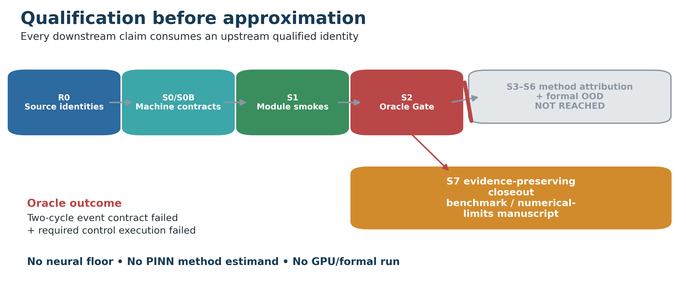
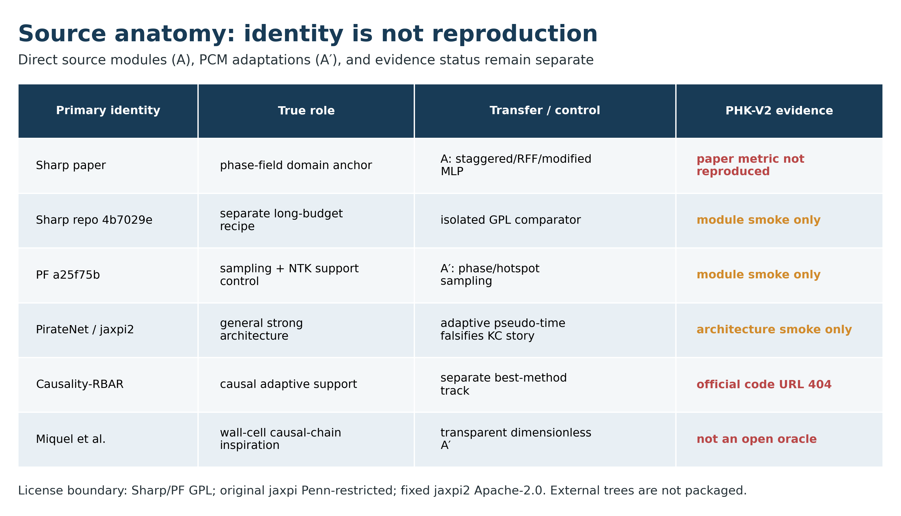
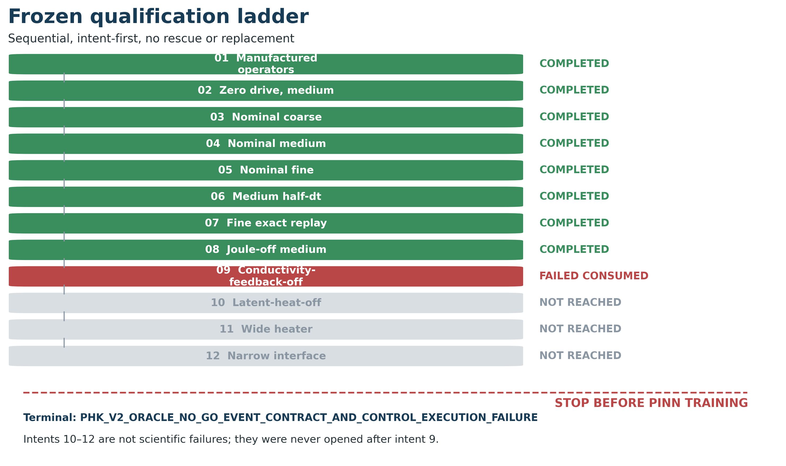
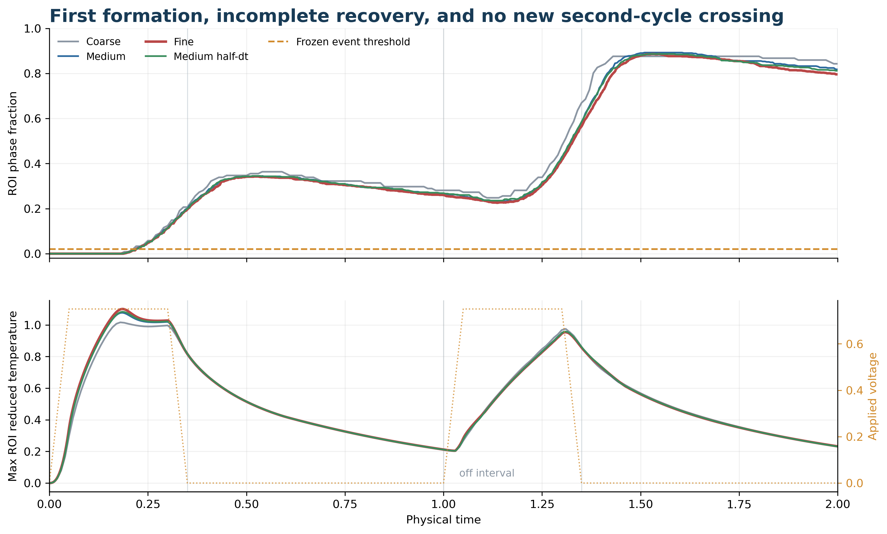
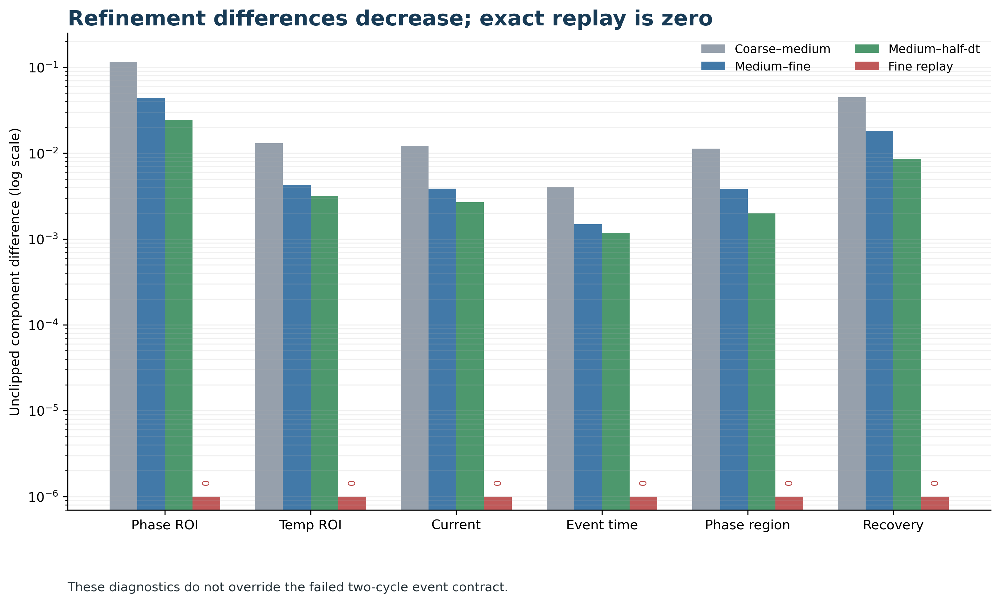
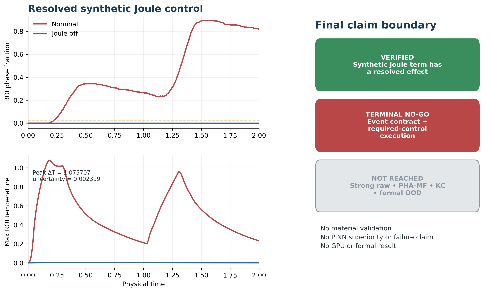

# 当基准先于 PINN 失败：二维电热相场两周期案例的预注册 Oracle 资格化研究

## 摘要

物理信息神经网络（PINN）的结论会继承其微分方程、数值参考、事件定义和数据拆分的有效性。在电热相变系统中，局域 Joule 热、弥散界面、相依电导、潜热和重复脉冲共同造成一个容易“算完但未必完成科学任务”的耦合基准。本文报告一项在任何 PINN 训练前冻结的 failure-preserving 资格化研究，原目标是在透明二维电热相场 wall-cell 上公平比较强 phase-field PINN、相变—热点感知多频表示（PHA-MF）与场选择性动力学时钟（KC）。来源身份、无量纲物理/数值合同、12-intent 资格梯、324 个完整案例拆分、事件阈值、禁止救援规则和方法停止门均在首次数值求解前冻结。manufactured operator 和零驱动守卫通过；nominal coarse、medium、fine、half-time-step 与 exact replay 运行也通过数值硬守卫，六个预声明端点的 replay 差异全部为零。然而，第一周期 recovery 只有 0.22–0.24，低于冻结下限 0.7；第二周期没有新的向上事件穿越；cycle-peak drift 为 1.41–1.59，高于上限 0.2。随后，必需的 phase-conductivity-feedback-off control 在相场 Newton 线搜索到达冻结最小步时终止。资格梯因此以 `PHK_V2_ORACLE_NO_GO_EVENT_CONTRACT_AND_CONTROL_EXECUTION_FAILURE` 收口，共记录 0.3663 process CPU core-hours。由于没有合格 Oracle 和 neural floor，strong raw、PHA-MF、KC、GPU 与 formal 均未运行。本结果不是“PINN 失败”，而是证明数值守卫、离散敏感性、因果控制和科学事件资格化回答不同问题；在近似前停止，可以避免把未资格化参考轨迹包装成神经网络证据。

**关键词：** 物理信息神经网络；相场；电热耦合；相变存储；基准资格化；数值验证；负结果；可复现性

## 1. 引言

PINN 通过把 PDE、本构、初边值条件和部分观测写入训练损失来近似物理场。一个有竞争力的正向 PINN 结论，不应只是网络可以拟合某组数组，而应证明在合格问题、强基线、公平预算与独立测试上存在可测增量。这个结论有一个常被忽视的上游前提：被求解的对象、产生评价标签的传统求解器，以及被称为“事件”的轨迹特征必须先成立。

相场与相变问题尤其容易暴露这一漏洞。Sharp-PINNs 通过 AC/CH 交替训练、随机 Fourier 特征、modified MLP、hard constraint 与梯度权重处理腐蚀相场；PF-PINNs 强调归一化、界面采样与 random-batch NTK；PirateNet 通过零初始化残差系数让网络由浅入深；Causality-RBAR 与 adaptive pseudo-time 分别从支持集和优化同伦处理移动界面或 spurious solution；相变导热 PINN 则展示 loss weighting、attention 和 sequence-in-time 的影响。它们提示了两个可能有价值的 PCM 适配模块：让相态/热点决定空间高频容量的 PHA-MF，以及只对相态分支重分配时间分辨率、但仍按物理时间评价的 KC。

然而，这两个方法问题只有在对象能产生局域、可解析、可恢复、可重复的事件后才可回答。本文原本是一条正向双模块路线，但预注册的 Oracle Gate 在方法训练前关闭了它。因此本文的贡献改为：

1. 把论文方法、当前代码仓库 recipe、许可和可复现身份分开，避免把会漂移的“最强公开实现”当成单一 baseline；
2. 在求解前冻结透明二维电热相场 wall-cell、数值方法、两周期事件、硬守卫、收敛比较、因果 control 和禁止救援规则；
3. 明确区分 implementation guard、numerical check、event-bearing oracle 与 method evidence；
4. 完整保留通过、失败和未到达 intent、实际计算、原始载体、图表与 claim boundary。

**图 1.** 预结果冻结工作流。Oracle No-Go 关闭方法路线，但不构成对未运行 PINN 的负结论。

## 2. Baseline 与来源身份

### 2.1 Sharp 是主 phase-field anchor，不是唯一证据 baseline

Sharp-PINNs 与目标相场困难最接近，但正式论文和当前仓库不是可静默合并的一个实验身份。论文版明确包含 staggered AC/CH、RFF、modified MLP、KKS hard constraint 与 gradient-norm weighting；当前仓库还含 causal/RAR 配置和长得多的训练预算。本文分别固定 `SHARP_PINNS_PAPER_REPLICATION_V1` 与 commit `4b7029e...` 的 repo recipe。GPL-3.0 源码只作隔离 comparator，不并入主库。

PF-PINNs commit `a25f75b...` 被定位为 sampling/NTK 支持 control。PirateNet 是通用强架构参照，但原 jaxpi 使用 Penn 定制限制许可，因此不复制；Apache-2.0 的 jaxpi2 commit `77a5c13...` 用于最小 architecture smoke，并把 adaptive pseudo-time 预注册为 KC 的强反事实 control。

这些外部身份只完成来源审计和模块级 CPU smoke。Sharp/PF 的有限 forward/backward 通过；jaxpi2 完整依赖两次被 Windows 路径长度阻断，最小环境下 PirateNet x64 CPU forward 有限、参数量 2245。没有复现任何论文精度、训练曲线、速度或 seed 方差。

### 2.2 PCM 来源只提供拓扑启发

Miquel 等的二维 wall-cell、多相场、电热传输、Joule/latent heat 与 threshold/Poole–Frenkel 机制提供了因果链清单。但其精确 GGST 成分保密、部分电导率来自内部测量、多个参数经过校准/估计且无开放代码，因此不能成为开放 exact oracle。

PHK-V2 只保留 wall-cell 横截面和“电场→Joule 热→相态”的结构。全部系数都是明确标注的无量纲工程值，不声称作者模型复现、材料标定或实验验证。

**图 2.** `A` 表示直接识别的来源模块，`A′` 表示仍需独立验证的 PCM 适配。来源审计和 module smoke 不等于 paper metric reproduction。

## 3. 冻结对象与资格化合同

### 3.1 无量纲二维 wall-cell

定义 $(x,z)\in[-1,1]\times[0,1]$、$t\in[0,2]$，包含电势 $v$、约化温度 $\theta$ 和相分数 $\phi$：

$$
\nabla\cdot[\sigma(\theta,\phi)\nabla v]=0,
$$

$$
\partial_t\theta+L_r\partial_t\phi
=\alpha\nabla^2\theta-\gamma\theta+G\sigma|\nabla v|^2,
$$

$$
\partial_t\phi=M(\theta)[\epsilon^2\nabla^2\phi-\partial_\phi W(\phi,\theta)].
$$

其中

$$
W=B\phi^2(1-\phi)^2+A_T(\theta_{\rm tr}-\theta)\phi^2(3-2\phi),
$$

$$
\sigma=\exp\{\log(r_\sigma)\phi^2(3-2\phi)+g_T\theta\}.
$$

顶部为完整电极与零温度边界；底部中央为宽度占全横向 0.35 的电接触/heater；其余电边界无通量；侧面和底部热边界为 Biot 0.25 的 Robin sink；相场全边界无通量。每个单位周期的单极脉冲在 0.05 内升到 0.75，保持到 0.30，在 0.35 前降为零，之后恢复。

### 3.2 数值方法

空间采用 cell-centered finite volume，电导面值作 harmonic average。每个耦合块内准静态解电场，温度与相场采用 backward Euler；相场非线性由解析 Jacobian Newton 与保界线搜索求解。Newton 残差容限 $10^{-10}$、最多 30 次，初始全步，最小线搜索步 $2^{-12}$。耦合变化/残差容限分别为 $10^{-8}$/$10^{-9}$，最多 30 个 block，并进行返回态 residual 复核。禁止 clipping 作为接受条件，禁止跨配置 warm start 和结果导向救援。

三层网格为 $40\times20$、$80\times40$、$120\times60$，时间步分别为 0.005、0.0025、0.00125；另有 medium half-$\Delta t$ 与 fine exact replay。

### 3.3 两周期事件

ROI 为 $|x|\le0.55,0\le z\le0.55$；当 $\phi\ge0.5$ 时记为 active phase。事件时间是 ROI active fraction 第一次从下向上穿越 0.02 的线性插值时刻。每周期要求 ROI peak≥0.02、全域 peak≤0.45、ROI 外 peak≤0.10、相对 pre-cycle excursion≥0.02、至少 3 个保存点、recovery≥0.7；两周期 peak 相对漂移≤0.2，并要求两个完整周期都成立。

这里 recovery 是 load-bearing 条件。若第一周期后始终保持在阈值上，第二脉冲只是继续生长已有相区，不能称为新的形成事件。

### 3.4 12-intent 顺序梯

顺序为 manufactured、zero-drive、nominal coarse/medium/fine/half-dt/exact replay、Joule-off、phase-conductivity-off、latent-off、wide-heater、narrow-interface。任一执行异常都会消费 intent；之后不补跑、不换 case、不改阈值、不调系数、不重排。

数值 hard guards 包括有限性、场范围、端口电流平衡、热平衡、相场残差、no-flux 与 replay。事件条件单独计票，因此“数值守卫通过”与“科学事件失败”可以同时成立。

**图 3.** Intents 1–8 完成，intent 9 失败并被消费，intents 10–12 未到达。所有 PINN 方法都位于完整 Oracle Gate 之后。

## 4. 结果

### 4.1 Manufactured 与零驱动

manufactured electric linear error 为 $7.216\times10^{-16}$，current balance 为 $2.516\times10^{-15}$，power identity 为 $4.441\times10^{-16}$；相场 Jacobian 的一个方向检查为 $6.252\times10^{-11}$。这些只证明被测状态/方向的实现一致性，不是物理验证或全局正确性证明。

zero-drive medium 完成 800 步，最大相场缩放残差 $9.820\times10^{-11}$、最大热残差 $5.638\times10^{-18}$，最大约化温度 0.001703，相分数始终在冻结范围内，数值硬守卫全部通过。它没有驱动，不能资格化相变事件。

### 4.2 第一周期形成，但没有恢复出第二事件

coarse、medium、fine 与 medium half-dt 均完成且无 hard-guard failure，第一事件时间分别为 0.2121、0.2178、0.219908 与 0.219467，说明该穿越在测试加密序列上向约 0.22 靠近。

但第一周期 recovery 仅为 0.2273、0.2335、0.2386 与 0.2216，远低于 0.7。第二周期开始时 ROI 已有约 0.26–0.28 的相区占比，因而没有从阈值下方重新向上穿越。cycle-peak drift 为 1.409–1.587，显著高于 0.2。

**图 4.** 所有 nominal resolution 都有第一次穿越、off interval 恢复不足、第二周期无新穿越。虚线阈值在结果前冻结。

### 4.3 空间、时间与 replay

六分量顺序为 ROI 相场 RMS、ROI 温度 RMS、端口电流 RMS、event time、相区 symmetric difference 与 recovery。coarse–medium 为 `[0.115296, 0.0130288, 0.0121576, 0.00403051, 0.0113184, 0.0446725]`；medium–fine 降为 `[0.0440896, 0.00427422, 0.00384497, 0.00149082, 0.00381858, 0.0182278]`；medium–half-dt 为 `[0.0242407, 0.00318648, 0.00267207, 0.00117851, 0.00198254, 0.00858333]`。fine exact replay 六分量全部为零。

这些结果说明事件失败没有在测试加密序列或确定性 replay 中消失，但不能覆盖 event gate。由于事件与必需 control 失败，没有封存 neural floor。

**图 5.** 数值差异随测试加密下降、replay 为零，但两周期事件仍不成立。数值可重复与科学任务适用性是两件事。

### 4.4 因果 control 与终局失败

Joule-off medium 不产生 nominal 的热峰和相区事件。nominal-minus-Joule-off 的 peak temperature difference 为 1.075707，高于 joint uncertainty 0.002399；peak ROI phase difference 为 0.892562，高于 0.025157。这只支持“合成 Joule 项在冻结对象内具有可解析作用”，不支持材料验证。

随后 phase-conductivity-feedback-off intent 以 `PHK phase Newton line search reached its frozen minimum step` 终止，没有可评价结果。该失败计入 64.640625 process CPU seconds，没有救援。intents 10–12 未执行。总计记录 1318.71875 process CPU seconds，即 0.3663107639 process CPU core-hours，一个失败 intent，零 replacement/rescue。

**图 6.** Joule 因果作用可解析，但完整 Oracle Gate 同时要求两周期事件与全部必需 control。二者未闭合，因此不生成 neural floor 或方法结论。

## 5. 为什么没有训练 PINN

没有 PINN 结果不是漏做实验，而是依赖图正确生效。方法比较要求：传统求解轨迹合格、两个事件可解析且可重复、硬守卫通过、必需 control 完成、各误差 floor 在训练前封存。本路线只满足其中一部分。

如果仍训练网络，回答的会是“网络能否拟合一个不能完成预注册两周期任务的轨迹”，而不是 PHA-MF/KC 是否解决局域、多尺度与时间刚性。任何涨点都有可能来自持久相态拟合、换了科学任务或 control 不一致。因此 strong raw、global MF、generic clock、adaptive pseudo-time、wider/extra-work raw、wrong gate、sampling、formal 全部保持 `NOT_REACHED`，不能写成 0 增益或负方法结果。

## 6. 讨论

### 6.1 四层证据必须分开

本研究最重要的结果是四层证据分解：manufactured/zero-drive 检查离散实现；残差、平衡、加密与 replay 检查数值过程；event gate 判断轨迹是否实现科学任务；method gate 才判断 PINN 增量。PHK-V2 的前两层有部分正证据，第三层失败，第四层未进入。

这一分解避免两个常见错误：一是把单次阈值穿越叫成重复切换 oracle；二是把执行失败的 control 写成机制证据。Joule-off 能给出有限因果信息，因为它完成了；phase-conductivity-off 只能写成失败计算。

### 6.2 负资格结果对未来设计的价值

现有合同暴露出物理任务与参数时间尺度的不匹配：off interval 内相态松弛不足，无法形成第二个 formation–recovery event；一个本构 control 也暴露出冻结求解器的脆弱性。未来可以延长恢复时间、改变可逆势能/迁移率、改变任务为累积 programming，或使用不同 control 求解器。但每一种都会改变对象或事件身份，必须新建预注册合同，不能回写当前 No-Go。

### 6.3 方法假设仍为 UNKNOWN

PHA-MF 与 KC 的真实价值仍未被检验。未来合格对象上至少需要 global MF、generic monotone clock、re-spacing、adaptive pseudo-time、wider/extra-work raw、wrong/shuffled gate 与 sampling track。只有在 complete-case 隔离、等参数与等实际计算预算、多 seed 和 sealed OOD 下，才能把增量归因给模块。

## 7. 局限

本文没有任何 PINN 性能结果，不能声称 PHA-MF/KC 成功、失败或相互协同。对象是无量纲 reduced benchmark，不含实验锚定 transport、随机成核、外部电路或真实器件 calibration。数值结论只对冻结有限体积方法、网格、时间步、容限和 control 有效。外部 baseline 只完成来源身份与 module smoke，未复现 paper metrics。intent 9 的失败也可能只属于当前 solver/control 组合。

因此，本稿是一份完整的本地 V2 benchmark/numerical-limits 初稿，不等同于原目标中的正向二区 PINN 方法论文，也不构成期刊接收或 SOTA 承诺。

## 8. 结论

PHK-V2 在任何 PINN 训练前冻结了对象、事件、数值、因果 control 和停止规则。透明二维电热相场对象通过了 manufactured、zero-drive、硬守卫、测试加密与 exact replay，却没有满足两周期 recovery/event 合同，且一个必需 control 在冻结 Newton 线搜索中失败。预注册的正确动作是停止，而不是调参救援或把未资格化轨迹变成神经网络标签。

这一结果说明：在 PINN 论文中，对象、数值、事件与 control 资格化应位于方法比较之前；当“算得出来”和“完成科学任务”发生冲突时，后者必须决定 claim ceiling。

## 数据、代码与复现

本地包包含 machine contracts、case split、solver/evaluator/runner、immutable manifests、所有完成运行的数值载体、失败计账、terminal summary、测试、图源、补充材料、复现说明和 claim–evidence matrix。具体路径、命令和哈希见 `reproducibility.md` 与 `package-manifest.json`。外部受限源码不随包分发；本稿也不自动授权投稿或外部发布。

