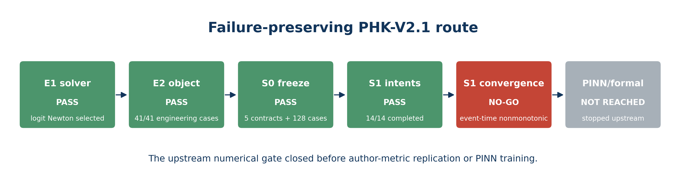
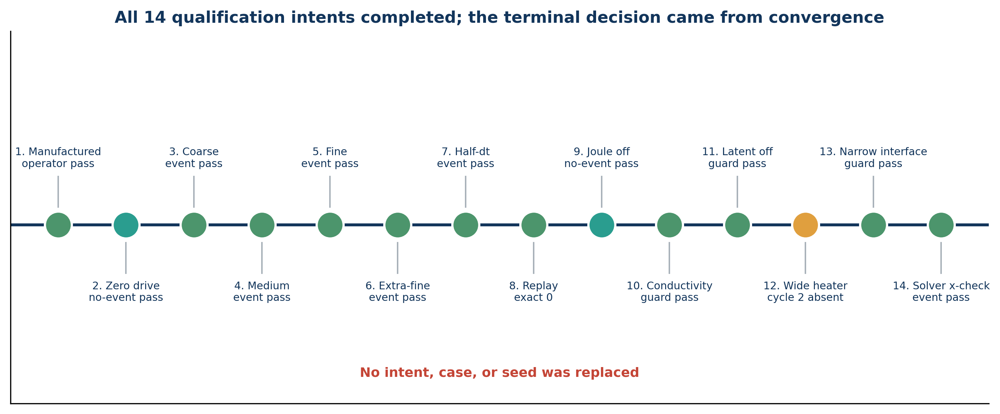
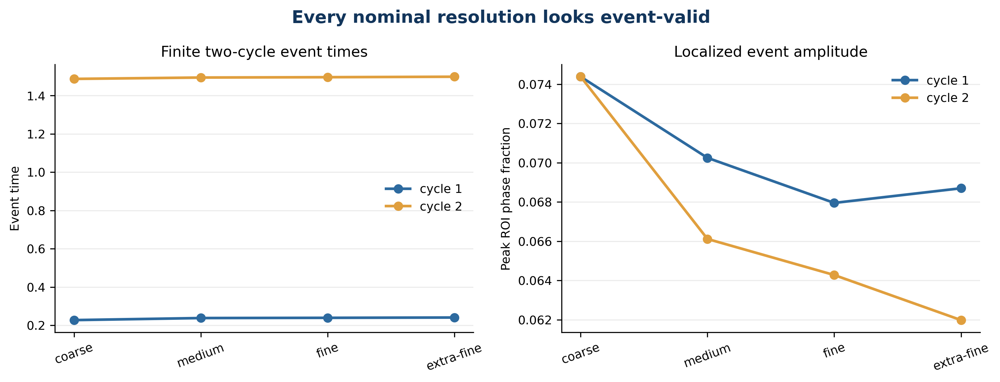
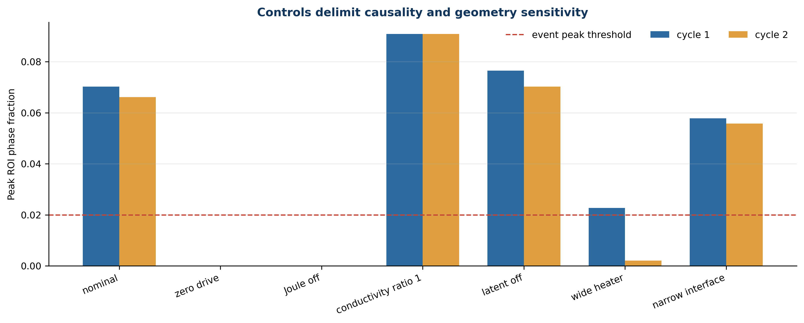
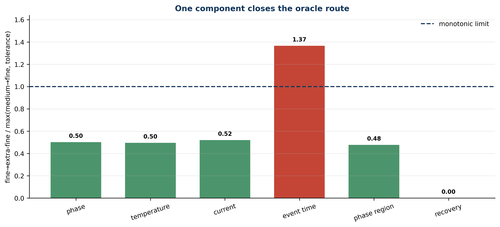
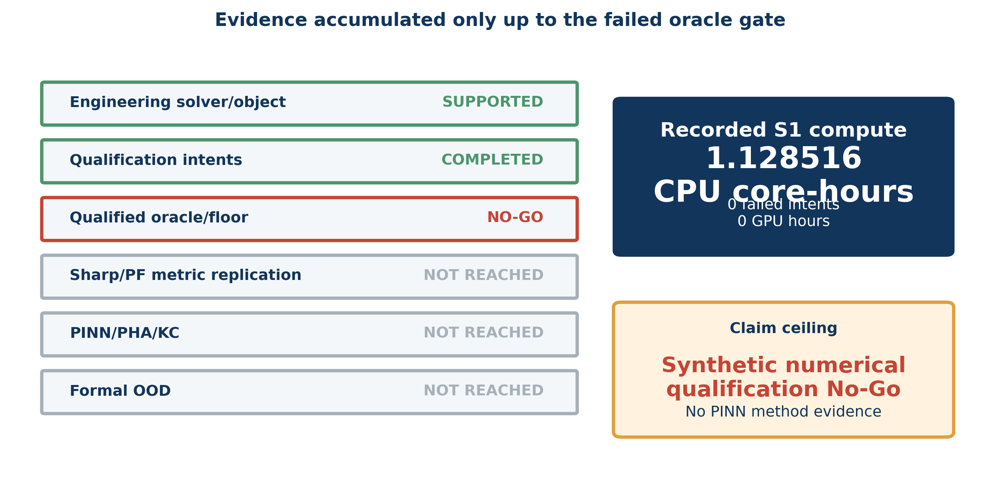

# When Event-Valid Is Not Oracle-Valid: Failure-Preserving Qualification of a Two-Cycle Electrothermal Phase-Field Benchmark Before PINN Training

## Abstract

Physics-informed neural networks (PINNs) can only be evaluated as accurately as the reference object, numerical solver, and endpoint definitions on which their comparisons depend. This dependency is especially consequential for localized electrothermal phase-transition problems, where a visually plausible switching trajectory may conceal event-localization or refinement instability. We report a preregistered, failure-preserving qualification study of a transparent two-dimensional synthetic electrothermal phase-field benchmark intended for a subsequent PINN comparison. The workflow separated non-voting engineering from voting scientific qualification. Engineering first repaired a control-branch Newton failure and selected one localized, two-cycle, fully recovering event candidate from 41 bounded cases. Before any voting solve, we froze the object, a 128-case complete-case split, a 14-intent oracle ladder, six endpoint components, controls, convergence rules, author-metric baseline identities, and downstream PHA-MF × field-selective kinetics-clock attribution rules. All 14 qualification intents completed without solver failure or numerical-guard violation. Nominal coarse, medium, fine, extra-fine, half-time-step, exact-replay, and independent-solver trajectories all produced two-cycle events; zero-drive and Joule-off produced no event; exact replay was bitwise identical at the saved-array level. Nevertheless, the two-cycle event-time difference increased from 0.00120677 for medium-to-fine to 0.00164868 for fine-to-extra-fine. This violated the component-wise monotonic-convergence gate even though the other five components contracted. The preregistered route therefore returned `PHK_V21_ORACLE_NO_GO_STOP_BEFORE_PINN`. Sharp-PINNs/PF-PINNs author-metric replication, neural-floor sealing, PINN training, PHA-MF, field-selective kinetics clocks, and formal out-of-distribution tests were not reached. The case study demonstrates that event existence, guard passage, replay, and apparent cross-resolution agreement do not jointly guarantee oracle admissibility. Its main contribution is a concrete qualification pattern that prevents an unqualified reference process from being converted into apparently positive PINN evidence.

**Keywords:** physics-informed neural networks; phase field; electrothermal switching; numerical verification; event localization; negative results; benchmark qualification

## 1. Introduction

Physics-informed neural networks encode differential-equation residuals in the training objective and have become a broad framework for forward, inverse, and surrogate problems [@raissi2019pinn]. In phase-field applications, recent systems combine Fourier embeddings, hard constraints, staggered training, adaptive sampling, gradient balancing, causal segmentation, and deeper residual architectures to resolve moving interfaces and multiscale dynamics [@chen2025sharp; @chen2025pf; @wang2024pirate; @wang2024causal; @wang2021gradient]. These advances make increasingly sophisticated method comparisons possible. They do not remove a more basic dependency: the reference solution and the endpoint extracted from it must themselves be numerically admissible.

That dependency is easy to understate. A field trajectory can be finite, bounded, conservative within tolerance, reproducible under an exact replay, and visually similar across a mesh hierarchy. A switching event can occur in every plotted trajectory. Yet a derived event time can still fail to converge monotonically because threshold crossing interacts with space-time discretization, interface geometry, and saved-time interpolation. If such a reference is used as an oracle, neural errors are normalized by a quantity whose own resolution behavior has not closed. Improvements in a PINN score can then reflect the reference process or metric extraction rather than the neural method.

Verification and validation practice distinguishes code correctness, numerical-solution verification, and model validation [@roache1998verification; @oberkampf2002verification]. PINN studies often emphasize the network side of this distinction: optimization pathologies, residual sampling, spectral representation, and causal training. The reference-solver side is frequently compressed into one nominal mesh or one author-provided data set. This compression is risky for electrothermal phase-transition systems, where localized Joule heating, constitutive feedback, interfacial kinetics, and pulse history are tightly coupled. Related phase-change PINN and multiphysics studies show both the promise and the model-specific complexity of these systems [@madir2025phasechange; @miquel2024pcm].

This study asked a deliberately upstream question: before modifying a strong phase-field PINN baseline, can we qualify a two-dimensional, localized, two-cycle, recoverable electrothermal phase-field object and its reference solver strongly enough to support neural attribution? The planned downstream method was a two-module PINN combining phase–hotspot-aware multi-frequency routing (PHA-MF) with a field-selective monotone kinetics clock. Sharp-PINNs was the phase-field anchor, PF-PINNs the sampling/weighting anchor, and adaptive pseudo-time a mandatory falsification control for any kinetics-specific claim [@chen2025sharp; @chen2025pf; @wang2026pseudotime]. However, the protocol required the oracle gate to pass before any author-metric replication or PINN training.

The work makes four bounded contributions.

1. It demonstrates a dual-stage benchmark workflow that allows broad but non-voting engineering, then freezes the selected object and every scientific decision before the first voting solve.
2. It supplies a complete 14-intent qualification record for a transparent two-dimensional synthetic electrothermal phase-field object, including nominal refinement, time refinement, exact replay, mechanistic controls, geometry controls, and an independent fixed-solver cross-check.
3. It identifies a specific failure mode: all nominal resolutions are event-valid, but the event-time component is not oracle-valid under the preregistered monotonic-convergence rule.
4. It preserves the scientific consequence of that failure. No neural experiment is performed, and no unqualified floor is relabeled as usable evidence.

Figure 1 summarizes the complete route. The red gate is not an administrative pause; it is the scientific terminal condition of this study.

**Figure 1.** The independent route passed solver engineering, bounded object selection, scientific freezing, and 14/14 qualification executions. The event-time convergence failure stopped the route before author-metric replication or PINN training.

## 2. Study design

### 2.1 Separation of engineering and scientific evidence

The project preserved a prior PHK-V2 Oracle No-Go and created PHK-V2.1 as an independent route. The old failed intents, contracts, results, and manuscript were not rerun or reinterpreted. PHK-V2.1 used two stages.

The engineering stage was explicitly non-voting. It could diagnose a previously observed control-branch phase-Newton failure, compare bounded solver candidates, and search a fixed object-design space. Its outputs could select the future scientific contract but could not support a paper claim. A 2×2 diagnostic isolated the former control failure to an artificial phase upper bound that excluded a physical root. A logit-state analytic Newton scheme was selected after fixed snapshot, full-duration control, nominal/Joule-off sentinel, residual, bound, and exact-replay checks. A preregistered 16+16 coarse campaign, three medium promotions, and six controls then produced 41/41 completed engineering cases. One candidate showed two localized events and complete recovery on the engineering medium grid.

The scientific stage began only after five contracts were frozen: object/numerical identity, complete-case split, oracle/floor protocol, author-metric baseline replication, and downstream method attribution. The selected object was not inherited as evidence; it was re-instantiated under a new scientific identity.

### 2.2 Transparent synthetic object

The benchmark is a dimensionless two-dimensional wall-cell model with electric potential, reduced temperature, and a bounded phase fraction. The causal chain is

\[
V(t) \rightarrow \nabla \psi \rightarrow q_J \rightarrow \theta
\rightarrow M(\theta) \rightarrow \phi,
\]

with phase-dependent conductivity closing a feedback loop from \(\phi\) to the electric field and Joule heating. The phase state is advanced in logit coordinates so that the returned physical fraction remains inside \((0,1)\) without output clipping. Electric and thermal blocks are solved quasi-steadily inside a fixed coupled iteration; the phase block uses the selected analytic Newton scheme. No dynamic solver switching, result-adaptive time-step rescue, clipping, or cross-case warm start is permitted.

The object is intentionally transparent and literature-inspired. It is not a calibrated GST, VO2, HfO2, or commercial-device model. No latent moving boundary, measured material parameter set, or experimental validation is claimed. This limitation is not a defect in reporting: it defines the exact scope in which numerical qualification can be evaluated before a more expensive material-specific study.

### 2.3 Complete-case identity and downstream split

Before the first voting solve, 128 complete physical cases were selected without outcomes from a 243-case nominal universe plus whole-factor orthogonal families. The pools were D=24, I1=12, I2=12, F_A=32, F_O=32, and reserve R=16. A case identity hashes geometry, constitutive branch, initial state, full waveform, and full history. No case crosses pools. Engineering search cases are excluded. Although the terminal result prevented these neural pools from being opened, freezing them in advance prevents a failed oracle from being followed by a redesigned, outcome-informed neural experiment.

### 2.4 Fourteen-intent qualification ladder

The ladder comprised: manufactured operators; zero drive; nominal coarse, medium, fine, and extra-fine; nominal medium with half time step; a single exact replay of nominal fine; Joule-gain-zero; phase-conductivity-ratio-one; latent-ratio-zero; wide-heater; narrow-interface; and nominal medium with a fixed pseudo-transient phase solver. Every intent wrote an immutable intent and atomic claim before computation. Failures counted against budget and could not be replaced.

Figure 2 shows the realized ladder. All solver intents completed. The wide-heater event status was allowed to be negative because geometry controls were required to complete and pass numerical guards, not to preserve the nominal event.

**Figure 2.** All 14 intents completed in order. Zero-drive and Joule-off satisfied their no-event identities; the wide-heater second-cycle event was absent but recorded under its predeclared control semantics.

### 2.5 Events, guards, and component-wise convergence

For each cycle, the event extractor measured pre-pulse ROI phase fraction, peak ROI phase fraction, first upward threshold crossing, saved-step coverage, full-domain and outside-ROI peaks, recovery, and between-cycle peak drift. Nominal event cases required two crossings, adequate saved-step coverage, bounded localization, at least 0.70 recovery, and bounded cycle drift. Zero-drive and Joule-off instead required no crossing and exactly zero ROI peak within the persisted representation.

Numerical hard guards covered nonfinite values, phase bounds, no-flux behavior, phase residual, linear residual, thermal residual, current balance, and output clipping. A hard-guard failure could not be averaged into a finite score.

Six dimensionless comparison components were frozen:

1. volume- and time-weighted phase-field ROI RMS;
2. volume- and time-weighted temperature-field ROI RMS;
3. terminal-current trace RMS;
4. RMS of the two cycle-normalized event-time differences;
5. time-averaged phase-region symmetric difference;
6. two-cycle recovery RMS.

For each component \(j\), the fine-to-extra-fine difference had to satisfy

\[
\delta^{FE}_j \leq \max(\delta^{MF}_j,\tau_j),
\]

where \(\delta^{MF}_j\) is the medium-to-fine difference and \(\tau_j\) is the declared component tolerance. At least four of six components, including the predeclared co-primary components, also had to contract strictly by the specified factor or be at tolerance. Only after this gate could a component floor

\[
U_j = \max(\delta^{FE}_j,\delta^{\Delta t}_j,
\delta^{replay}_j,\delta^{solver}_j,\tau_j)
\]

be sealed for neural evaluation.

## 3. Results

### 3.1 Every nominal resolution is event-valid

Coarse, medium, fine, and extra-fine runs all passed hard guards and produced two localized events with complete recovery. Cycle-1 event times were 0.2271, 0.2378, 0.2389833, and 0.2406. Cycle-2 event times were 1.4871, 1.4942, 1.495975, and 1.4984. Recovery was 1.0 for both cycles at every nominal resolution. Peak ROI phase fractions remained localized and finite. Figure 3 shows why a plot-only review could plausibly declare the object ready.

**Figure 3.** All nominal mesh levels generate finite two-cycle events and localized peaks. Visual smoothness across resolution does not determine the later component-wise convergence verdict.

The medium-half-time-step run also passed, with event times 0.2392 and 1.4942. The exact fine replay reproduced all persisted arrays with maximum absolute difference 0.0. The pseudo-transient cross-check matched the medium event report at the displayed precision and had component differences below approximately \(5.2\times10^{-10}\) for fields and current, with zero event-time, region, and recovery difference.

### 3.2 Controls establish bounded causal and geometric facts

Zero drive produced no event and zero ROI peak. Joule-gain-zero likewise produced no event and zero ROI peak, while the nominal medium case remained event-positive. Within this synthetic object and frozen protocol, Joule heating is therefore necessary for the nominal event. This is not a universal statement about phase-change devices.

Setting the phase-conductivity ratio to one retained both events and increased peak ROI fraction to approximately 0.0909 in both cycles. Setting the latent ratio to zero also retained both events, with peaks approximately 0.0764 and 0.0702. These controls show that neither frozen mechanism is individually necessary for event existence in this object; they do not establish physical irrelevance outside the tested setting.

The wide-heater case retained a first-cycle event but lost the second: the cycle-2 peak ROI fraction fell to approximately 0.00207. The narrow-interface case remained two-cycle event-positive. Figure 4 makes the control semantics explicit.

**Figure 4.** Zero-drive and Joule-off eliminate the event; conductivity-ratio-one and latent-off retain it. Wide-heater geometry loses the second event, while the narrow-interface control remains event-positive.

### 3.3 One derived component fails the oracle gate

Five components contracted from the medium-to-fine comparison to the fine-to-extra-fine comparison. Phase-field RMS decreased from 0.00916472 to 0.00459165; temperature RMS from 0.00253754 to 0.00125692; terminal-current RMS from 0.00232607 to 0.00121072; phase-region symmetric difference from 0.00030375 to 0.000145; and recovery remained at zero difference.

The event-time component behaved differently. Its medium-to-fine difference was 0.0012067679515502204, whereas its fine-to-extra-fine difference was 0.0016486829760616161. The ratio against the monotonic limit was approximately 1.37. Both event trajectories were finite and apparently close, but the derived endpoint did not contract under the frozen hierarchy. Figure 5 shows the component-wise decision.

**Figure 5.** Five of six components satisfy the monotonic rule. The two-cycle event-time component exceeds the limit and independently closes the oracle route.

The terminal adjudicator therefore returned `CONVERGENCE_OR_FLOOR_GATE_FAILED`. The candidate floor carrier was retained for diagnosis, but `floor_sealed_and_converged=false`; it is not a neural floor and cannot normalize downstream model errors. Recorded S1 compute was 4062.65625 CPU seconds, or 1.128515625 process CPU core-hours, with zero failed solver intents and zero GPU hours.

### 3.4 Two implementation defects were reconciled without changing science

The evidence chain also exposed two process-level defects. First, the runtime representation of the two event cycles was a tuple after `dataclasses.asdict`, while the original no-event helper accepted only a list. The same tuple serialized to a JSON list, making the defect visible after intent 2. The immutable report already contained two null event times and zero ROI peaks. A frozen amendment allowed list or tuple carriers and recomputed only the Boolean from those existing values. No solver rerun or artifact mutation occurred.

Second, the comparator inherited short V2 component labels while the V2.1 floor evaluator required longer names. The six values, formulas, and order were identical. The first summary attempt failed before creating any output or ledger row. A second frozen amendment mapped labels position-for-position without reordering or recomputing values. These amendments are reported because hiding them would make the evidence appear cleaner than the real execution. Neither amendment changes the decisive event-time numbers.

## 4. Why no PINN experiment follows

The planned neural study was not omitted for convenience. It was explicitly conditional on the oracle gate. The downstream contract would have reproduced selected Sharp-PINNs and PF-PINNs author-domain metrics under pinned identities; sealed a neural floor; established a competent strong raw PINN; diagnosed support, representation, or optimization bottlenecks with four arms; evaluated PHA-MF and a field-selective kinetics clock in an equal-budget 2×2; challenged them with capacity, compute, generic-clock, wrong-location, all-field-warp, and adaptive-pseudo-time controls; and finally opened complete-case formal OOD pools.

Running that program after the failed event-time convergence gate would produce precise-looking scores normalized by an unqualified reference endpoint. It could also tempt outcome-informed modifications of the object, event definition, or floor. The study instead treats “not reached” as a substantive result of sequential design. Figure 6 summarizes the evidence ceiling.

**Figure 6.** Evidence reaches engineering selection and complete qualification execution, then stops at the failed oracle/floor layer. No author-metric baseline, PINN, PHA, kinetics-clock, GPU, or formal-OOD evidence was generated.

This distinction also protects the literature comparison. Sharp-PINNs and PF-PINNs remain relevant method anchors [@chen2025sharp; @chen2025pf], but this work does not claim to reproduce or outperform them. PirateNets, causal training, residual refinement, and pseudo-time remain candidate controls [@wang2024pirate; @wang2024causal; @wang2026rbar; @wang2026pseudotime], not evidence about the present object.

## 5. Discussion

### 5.1 Event existence is weaker than event convergence

The main scientific lesson is narrow but important. The nominal trajectories satisfy many checks that are often treated as sufficient: all fields are finite, hard guards pass, two events exist, recovery is complete, exact replay is zero, a different nonlinear solver agrees, and the curves change smoothly with resolution. The failed quantity is a derived event-time metric. Threshold-crossing times can respond non-monotonically to small, structured changes in interface shape or saved-time interpolation. A reference object can therefore be suitable for qualitative mechanistic exploration while remaining unsuitable as a quantitative neural oracle.

### 5.2 Component-wise gates prevent favorable averaging

An aggregate RMS over six components would dilute the event-time regression with five contracting components. Because the event is central to the intended kinetics-clock claim, averaging would be scientifically misleading. The component-wise hard gate ensures that a method cannot appear better merely because its headline endpoint is referenced to a non-converged event extractor.

### 5.3 Engineering success does not imply scientific qualification

The engineering stage achieved its goals: it repaired the control solver, found a repeatable-event candidate, and produced a clean scientific contract. Those successes remain real. They do not imply that the selected candidate is oracle-qualified. Separating the stages allows both statements to coexist without retroactive reinterpretation.

### 5.4 Negative qualification can save neural compute

The S1 campaign consumed approximately 1.13 CPU core-hours and no GPU time. The planned downstream study would have required multi-seed author-domain replications, many equal-budget PINN arms, and sealed formal comparisons. Stopping at the failed oracle gate avoided spending that budget on a reference process that could not support the intended event-time claim. The value is not that computation was cheap; it is that the stopping rule made the saved computation scientifically meaningful.

## 6. Limitations and future work

The object is synthetic and dimensionless. It does not establish material calibration, device prediction, or experimental validity. The event-time failure is specific to the frozen spatial hierarchy, time steps, threshold definition, and interpolation rule. It does not prove that the underlying continuum equations lack a converged event time or that another prospectively frozen discretization would fail.

The monotonic criterion is conservative. Non-monotonic pre-asymptotic behavior can occur even when a finer asymptotic sequence would eventually converge. That possibility is deliberately left unknown because extending the hierarchy after seeing the failure would be result-adaptive rescue. A future project could prospectively define a new object/numerical contract with event-localization refinement, denser output near crossings, or an asymptotic error model. Such a project must receive a new identity and may not rewrite the present No-Go.

No PINN was trained. Consequently, this paper cannot assess strong raw competence, spectral or support bottlenecks, PHA-MF, field-selective kinetics clocks, adaptive pseudo-time, method interactions, compute efficiency, or OOD generalization. The proposed method story remains a preregistered but untested hypothesis.

Finally, two implementation amendments were required. Their effects were limited to carrier-type acceptance and label canonicalization, with immutable source hashes and no solver reruns. Although this handling preserves evidence, it also illustrates why qualification software itself requires tests and explicit amendment semantics.

## 7. Conclusions

We attempted to qualify a transparent two-dimensional, localized, two-cycle electrothermal phase-field benchmark before using it in a PINN method study. The control solver was repaired, one engineering candidate was selected, five scientific contracts were frozen, and all 14 qualification intents completed. Nominal events, controls, hard guards, exact replay, and an independent nonlinear-solver cross-check all behaved as intended. Yet the two-cycle event-time component failed the preregistered spatial-convergence rule. The oracle route therefore closed before author-metric replication or neural training.

The result supports a practical principle: a trajectory can be event-valid without being oracle-valid. PINN comparisons should treat reference qualification as an upstream scientific gate, not as a background implementation detail. When that gate fails, preserving the failure and stopping can be more informative than producing another set of neural curves.

## Data and code availability

The local reproducibility package includes the five frozen contracts, implementation amendments, all 14 intent/report/result/manifest identities, terminal summary, candidate floor carrier, six source-data CSV files, six PNG/PDF figures, tables, supplement, reproduction guide, claim–evidence matrix, and reviewer-risk audit. The package contains no external GPL source tree, commercial model asset, credential, or experimental data. External upload, submission, and journal acceptance are outside the scientific claims of this manuscript.

## Declarations

**Funding:** To be completed by the authors before submission.

**Competing interests:** To be completed by the authors before submission.

**Author contributions:** To be completed by the authors before submission.

**Acknowledgements:** To be completed by the authors before submission.

