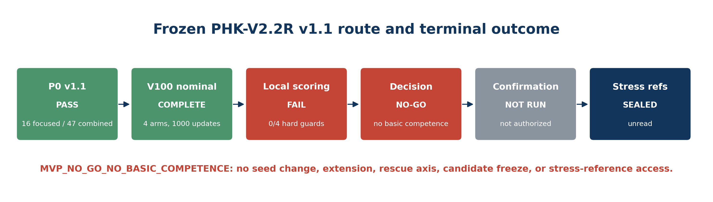
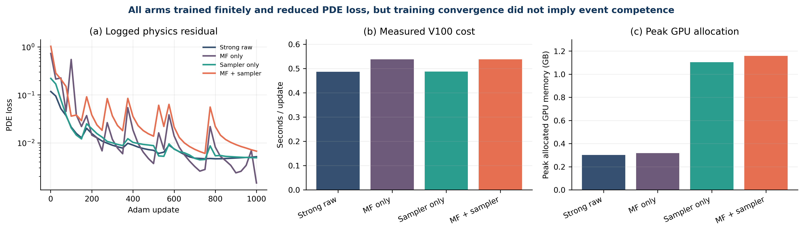
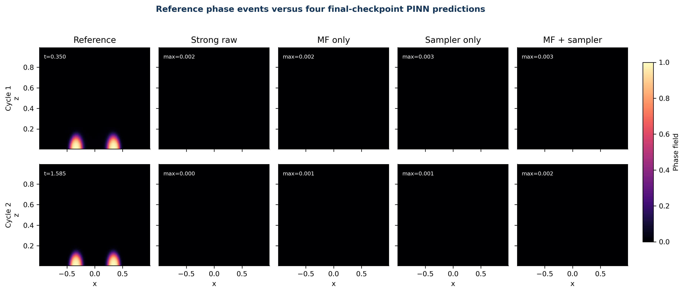
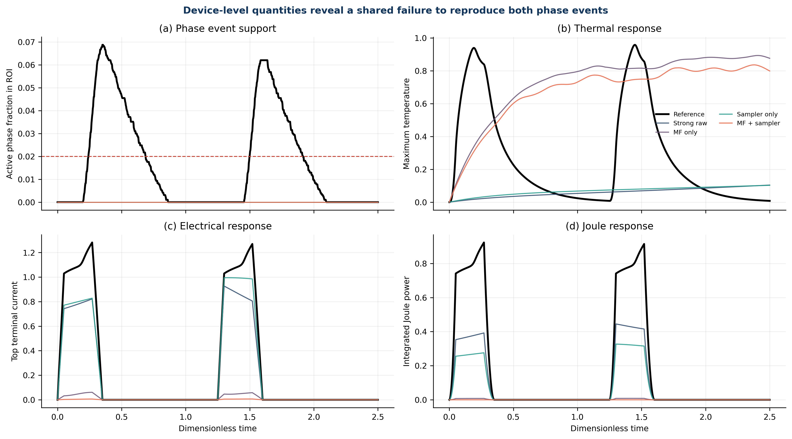
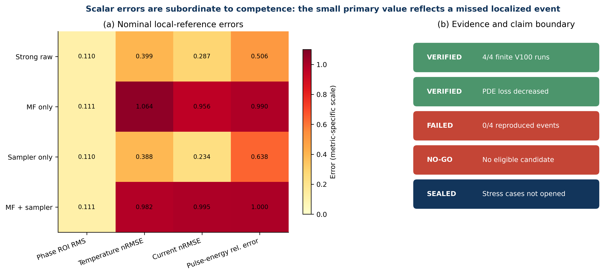

# A Competence-Gated Evaluation of Field-Selective, Phase–Joule-Aware PINNs for Localized Electro-Thermal Phase Dynamics

> Advisor-reviewable English draft. Evidence status:
> `MVP_NO_GO_NO_BASIC_COMPETENCE`. This draft reports a bounded negative
> Method-MVP result; it does not assert a positive neural-method contribution.

## Abstract

Physics-informed neural networks (PINNs) can reduce their differential-equation
loss while missing a localized event that determines device behavior. We study
this failure mode in a fixed two-dimensional electric–thermal–phase benchmark
with two driven phase events. The proposed FS-PJAMF-PINN combines independent
field-selective anisotropic Fourier heads with a label-free collocation mixture
based on residual, phase-interface, and Joule-density scores. A preregistered
comparison evaluated four scratch-start arms—strong raw, multi-frequency only,
sampler only, and their combination—using FP64, seed 17, 1000 Adam updates, and
the final checkpoint. All arms ran finitely on a Tesla V100 and reduced their
logged PDE loss. Nevertheless, none produced either required phase event: the
predicted active phase fraction above the frozen threshold was zero throughout,
whereas the reference reached region-of-interest fractions of 0.0687 and 0.0620.
All arms therefore failed the same six event and recovery guards. Their identical
primary symmetric-difference score of 0.00515 is not evidence of accuracy; it is
the time-averaged support of the localized reference event that every network
missed. The frozen decision machine returned
`MVP_NO_GO_NO_BASIC_COMPETENCE`, so no candidate was selected, no confirmation
training was run, and two stress references remained sealed and unread. The
result demonstrates, for this fixed-discretization single-seed protocol, that
physics-loss convergence and a small domain-averaged error can coexist with
complete event failure. It does not establish a global limitation of PINNs or
the proposed components.

## 1. Introduction

Physics-informed neural networks embed governing-equation residuals in a neural
training objective and offer a flexible representation for forward and inverse
problems [1]. Their use in strongly coupled multiphysics systems is attractive
because a single differentiable model can represent interacting fields without
constructing a conventional mesh-based solver for every downstream query.
However, the optimization objective and the scientific quantity of interest need
not be aligned. A network may reduce an average residual while missing a small
space–time event that controls a device-level conclusion.

Electrically driven phase-change devices make this mismatch explicit. Potential
and temperature occupy most of the device, while a phase transition can remain
confined to a narrow region near a heater. Uniform collocation therefore devotes
most samples to smooth bulk behavior. A shared representation can likewise spend
capacity on fields with different spatial and temporal regularity. Phase-field
PINNs have used hard constraints, Fourier features, staggered training, and
adaptive sampling to address stiff interfaces [2,3]. Residual-adaptive networks
[4], causality-respecting training [5], and interface-oriented causal refinement
[6] offer complementary optimization and support-allocation mechanisms.
Electro-thermal phase-change devices add a state-dependent elliptic field and a
localized Joule source, completing a causal chain not present in heat-only
phase-change PINNs [7] and motivating explicit treatment of electrical support
[8].

We designed a field-selective, phase–Joule-aware anisotropic multi-frequency
PINN (FS-PJAMF-PINN) to address these support and representation imbalances. The
scientific question was deliberately conditional: under a fixed single-seed
budget, does the combined method reproduce two localized phase events and improve
over both of its components and a strong raw PINN? The protocol placed event
competence before comparative gains. A small scalar field error could not rescue
a method that failed to produce the event.

The experiment returned a bounded negative result. Four neural arms completed
and reduced their logged PDE loss, but all remained near the initial phase field
and missed both events. This paper therefore makes no positive method claim. Its
contributions are instead:

1. a fully specified three-field PINN and label-free sampling proposal for a
   coupled electric–thermal–phase system;
2. a four-arm attribution protocol that separates representation and sampling;
3. an event-first decision rule showing why a small domain-averaged error is
   misleading when the scientifically relevant set is sparse; and
4. a reproducible negative result that stops before candidate selection and
   preserves two stress references as unread evidence.

## 2. Physical problem and numerical reference

### 2.1 Coupled device model

The rectangular device domain is

\[
(x,z)\in[-1,1]\times[0,1],\qquad t\in[0,2.5].
\]

The dimensionless potential \(v\), temperature \(\theta\), and phase field
\(\phi\) satisfy

\[
\nabla\!\cdot\!\left[\sigma(\theta,\phi)\nabla v\right]=0,
\]

\[
\theta_t+L_r\phi_t=\alpha\nabla^2\theta-\gamma\theta
+G\sigma(\theta,\phi)|\nabla v|^2,
\]

\[
\phi_t=M(\theta)\left[\epsilon^2\nabla^2\phi
-\partial_{\phi}W(\phi,\theta)\right].
\]

Conductivity depends on temperature and phase,

\[
\sigma(\theta,\phi)=\exp\!\left[
\log(r_\sigma)\,\phi^2(3-2\phi)+a_T\theta
\right],
\]

and mobility changes smoothly around the transition temperature,

\[
M(\theta)=M_c+(M_h-M_c)
\operatorname{sigmoid}\!\left(
\frac{\theta-\theta_{\mathrm{tr}}}{w_M}
\right).
\]

The phase-potential derivative is

\[
\partial_\phi W=
2B\phi(1-\phi)(1-2\phi)
+6A_T(\theta_{\mathrm{tr}}-\theta)\phi(1-\phi).
\]

The top electrical boundary follows a two-pulse waveform. A localized grounded
heater occupies the lower boundary and the remaining electrical boundary is
insulating. Temperature is zero on the top boundary and obeys Robin cooling on
the sides and bottom. The phase field has zero normal flux. The initial
temperature and potential are zero, and the initial phase contains a smooth seed
near the heater. Numerical values and waveform breakpoints are fixed in the
machine-readable contracts.

### 2.2 Reference identity and role separation

The reference trajectory was generated by a Cartesian cell-centered
finite-volume implementation with harmonic face conductivity. It is a fixed
discrete numerical target, not a continuum oracle or experimental measurement.
The nominal extra-fine carrier contains 1001 saved times on a \(160\times80\)
grid and was used only by the local evaluator after prediction carriers had been
produced without reference access.

Two additional extra-fine carriers—narrow interface and wide heater—were
hash-sealed before the neural comparison. The protocol required a passing
nominal decision, three frozen confirmation roles, and six verified
reference-blind stress predictions before either carrier could be opened. The
nominal No-Go prevented those prerequisites, so both stress references remain
unread. No stress metric appears in this paper.

## 3. Neural methods and preregistered protocol

### 3.1 Field-selective anisotropic multi-frequency representation

Let \(\xi=(x,z,t)\) denote normalized coordinates. Potential, temperature, and
phase are represented by three independent modified gated multilayer perceptron
heads; there is no shared trunk. The potential head uses a low-to-mid-frequency
representation. Temperature and phase use broader anisotropic Fourier features

\[
\Gamma_f(\xi)=
\left[\sin(2\pi B_f\xi),\cos(2\pi B_f\xi)\right],
\]

with the phase head receiving the broadest frozen Band-A allocation. Hard
transformations impose the initial condition and selected range or boundary
structure. Temperature vanishes at \(t=0\) and on the top boundary. Phase is
represented in logit space relative to the prescribed initial seed so that
\(0<\phi<1\). Remaining mixed boundary conditions enter the loss.

### 3.2 Physics residuals

The objective contains the electric, thermal, and phase strong-form residuals
and all mixed boundary conditions. Automatic differentiation evaluates only the
diagonal second derivatives required by the equations. The electric residual is
kept in conservative differential form so that derivatives of the
state-dependent conductivity remain in the graph. Joule density is

\[
q_J=\sigma(\theta,\phi)(v_x^2+v_z^2).
\]

No finite-volume field, sparse label, or reference-derived feature occurs in the
training objective.

### 3.3 Phase–Joule-aware sampling and causal replay

The adaptive arm scores a quasi-random candidate pool using only network and
physics quantities. Each refreshed interior batch uses fixed fractions

\[
(w_u,w_r,w_\phi,w_J)=(0.35,0.25,0.25,0.15)
\]

for fresh Sobol coverage, high residual, high predicted interface
\(4\phi(1-\phi)\), and high predicted Joule density. The Sobol component is a
nonzero global floor. Candidate ranking is detached from parameter optimization,
while residuals at selected points retain their differentiation graph.

Training uses four causal windows, \([0,0.35]\), \([0.35,1.25]\),
\([1.25,1.60]\), and \([1.60,2.5]\), with equal stratified replay from earlier
windows. The schedule was fixed before the nominal run.

### 3.4 Four-arm comparison and stopping rule

The four arms were:

- `STRONG_RAW`: raw coordinates and quasi-random sampling;
- `MF_ONLY`: field-selective Band-A representation with quasi-random sampling;
- `SAMPLER_ONLY`: raw representation with phase–Joule-aware sampling; and
- `MF_PLUS_SAMPLER`: the combined proposed method.

All arms used FP64, seed 17, scratch initialization, 512 interior, 128 boundary,
and 128 initial points, Adam for exactly 1000 updates, and the final checkpoint.
The combined arm was the only arm permitted to advance. It first had to produce
two correctly ordered phase events, recovery, locality, finite in-range fields,
and decreasing PDE loss. Only then could comparative primary, co-primary,
temperature, and current gates be considered. Failure terminated the route
without a new seed, extra updates, continuation, warm start, L-BFGS, labels, or a
new method axis.

### 3.5 Metrics

The primary metric is the time-averaged symmetric difference of thresholded
phase regions. The co-primary is continuous phase RMS error inside the phase
region of interest (ROI). Hard guards require two reference-aligned events,
minimum ROI support, recovery, locality, finite values, and the physical phase
range. Temperature ROI nRMSE and terminal-current nRMSE are non-inferiority
quantities. Event-time error, interface Hausdorff distance, high-wavenumber phase
error, pulse-energy error, wall time, and peak memory are secondary diagnostics.

## 4. Results

### 4.1 Pre-nominal routing, finite GPU execution, and loss reduction

A one-time 100-update V100 engineering profile preceded v1.1. It included the
four active arms and a strict routed PHA probe. All five arms were finite. The
strict probe cost 1.6276 times MF only, below the frozen 1.8 ceiling, but its
primary improvement over the combined arm was zero rather than the required
10%. It was therefore removed from the critical path without moving the gate.
The profile served routing and cost estimation only; it did not rank the four
1000-update arms or support a method claim.

The v1.1 source identity was commit `69109cd`; program and method contract
SHA-256 values were bound before launch. All four arms completed on a Tesla
V100-PCIE-32GB with FP64 and no nonfinite loss or out-of-memory failure (Fig. 1).
Training required 0.487–0.538 s/update and 0.302–1.158 GB peak allocated GPU
memory. The full nominal stage cost an estimated CNY 1.1481 at the displayed CNY
1.88/hour, bringing estimated cumulative spend to CNY 4.8101.

Every arm reduced its logged PDE loss (Fig. 2). Strong raw decreased from 0.1176
to 0.00514; MF only from 0.7303 to 0.00145; sampler only from 0.2210 to 0.00488;
and the combined arm from 1.0332 to 0.00670. These reductions verify numerical
optimization progress but did not establish event competence.

### 4.2 Shared failure to reproduce the phase events

The reference produced two localized events with peak ROI active fractions
0.06870 and 0.06198. At the corresponding reference peak times, all four PINN
predictions remained close to zero (Fig. 3). Over each complete prediction
carrier, the maximum phase value was approximately 0.02999, inherited from the
initial seed. No prediction crossed the frozen phase threshold 0.5 at any saved
time, so the active ROI fraction was identically zero (Fig. 4a).

Each arm consequently failed the same six hard guards: event missing, ROI peak
below minimum, and recovery failure for both cycles. Event-time and interface
Hausdorff errors were undefined/infinite because no predicted interface event
existed. The combined arm was not eligible for comparison or advancement.

Electrical and thermal traces provide complementary evidence (Fig. 4b–d).
Strong raw and sampler only underpredicted temperature amplitude but retained
part of the terminal-current response. MF only and the combined arm produced a
large slowly varying temperature response while nearly eliminating terminal
current and Joule power. None closed the electric–thermal–phase chain.

### 4.3 Scalar errors and component attribution

| Arm | Primary | Phase ROI RMS | Temperature nRMSE | Current nRMSE | Pulse-energy relative error | Eligible |
|---|---:|---:|---:|---:|---:|---|
| Strong raw | 0.005150 | 0.110471 | 0.398675 | 0.286641 | 0.505937 | No |
| MF only | 0.005150 | 0.110548 | 1.063750 | 0.956086 | 0.990104 | No |
| Sampler only | 0.005150 | 0.110408 | 0.388095 | 0.234011 | 0.638178 | No |
| MF + sampler | 0.005150 | 0.110528 | 0.982255 | 0.995063 | 0.999920 | No |

The identical primary value is a sparsity artifact. Because every prediction
classified the entire domain as inactive, the symmetric difference equals the
reference active region itself. Its time average is small because the events
occupy a small fraction of space–time, not because the fields are reconstructed
well. The hard competence gate correctly dominates this scalar (Fig. 5).

No component attribution is scientifically admissible. Sampler only had the
lowest phase ROI RMS, temperature nRMSE, and current nRMSE, but it still missed
both events. MF only and the combined arm were worse than raw on several device
quantities. Since all arms were ineligible, there is no strongest eligible
comparator and no measurable combined gain.

### 4.4 Terminal decision and sealed confirmation

The immutable nominal decision returned
`MVP_NO_GO_NO_BASIC_COMPETENCE` with reason
`ALL_FOUR_ARMS_FAILED_FROZEN_COMPETENCE_GUARDS`. The selected arm and strongest
comparator are null. Confirmation training and stress-reference access are
false. Accordingly, no measured-time raw control was calibrated, no six-carrier
confirmation set was generated, and neither sealed stress reference was opened.

## 5. Discussion

### 5.1 What the experiment establishes

The verified result is narrower and more useful than a generic statement that
“training failed.” Under the frozen single-seed, 1000-update, FP64 protocol, all
four neural formulations reduced their physics loss but converged to a
near-initial phase state that omitted two localized reference events. Thus,
finite execution, loss reduction, and a small space–time-averaged classification
error were insufficient certificates for the device-level phenomenon.

The common failure across raw, representation-only, sampling-only, and combined
arms suggests that the active bottleneck lies upstream of component attribution.
The proposed Fourier allocation and sampler cannot be credited or cleanly blamed
because the baseline competence condition was never met. The evidence supports a
near-initial-phase attractor under this training contract. It does not identify
whether the root cause is residual scaling, causal-window transitions, phase
gradient conditioning, optimizer budget, architecture, or their interaction.

### 5.2 Why event-first evaluation matters

The primary metric illustrates a general problem for sparse multiphysics events.
A predictor that declares the whole domain inactive can obtain a numerically
small symmetric-difference average when the true event occupies little
space–time. Ranking such predictors before checking event existence would reward
scientific incompetence. Event topology, minimum support, recovery, and locality
must therefore precede aggregate field errors. This ordering is relevant to
hotspots, fronts, ignition, breakdown, nucleation, and other localized phenomena.

### 5.3 What the experiment does not establish

This study does not show that PINNs cannot solve electro-thermal phase dynamics,
that Fourier features or physics-aware sampling are intrinsically ineffective,
or that the finite-volume trajectory is continuum truth. It also does not
estimate seed variance or stress-case robustness. A different training budget,
loss formulation, optimizer, continuation schedule, or architecture might change
the outcome, but testing those possibilities after the terminal decision would
be a new study rather than a rescue of this preregistered comparison.

### 5.4 Follow-up research implications

A future authorized study should begin with a competence diagnostic rather than
another full method comparison. It should measure phase-residual gradient flow,
window-by-window phase activation, and the balance between boundary, thermal,
electric, and phase terms on a deliberately small diagnostic matrix. Any revised
training contract should then be frozen before rerunning a strong raw baseline.
Only after raw event competence is recovered should representation and sampling
components be reintroduced in an attribution matrix. New work must use new run
identities and must not retroactively alter this result.

## 6. Limitations

The target is a synthetic, dimensionless, fixed-discretization finite-volume
trajectory. It is neither experimentally calibrated nor a continuum-limit
oracle. The nominal comparison uses one seed and one development case, so no
statistical or formal-OOD claim is possible. The final-checkpoint policy does not
describe transient competence at unrecorded intermediate checkpoints. The
stress references were intentionally not read, which preserves their future
value but leaves robustness unknown. Finally, the 1000-update budget is a
protocol boundary, not an estimate of the computational effort required for all
PINN formulations.

## 7. Conclusion

A preregistered four-arm PINN comparison for a coupled electric–thermal–phase
benchmark reached a valid terminal No-Go. All arms ran finitely and reduced
physics loss, yet none reproduced either localized phase event. The combined
field-selective, phase–Joule-aware method therefore earned no positive claim,
candidate freeze, or sealed confirmation. The main lesson is methodological:
for sparse event-driven multiphysics, scientific competence gates must precede
aggregate error ranking. The result is preserved as bounded negative evidence
and as a concrete specification for a future, separately authorized diagnostic
study.

## Data and code availability

Code, frozen contracts, run manifests, scalar evaluations, figure-generation
code, and non-sensitive derived figures are versioned in the project repository.
Large checkpoints, predictions, and the nominal finite-volume field carrier
remain local and are bound by SHA-256 in the experiment manifest. The two stress
reference carriers remain sealed and unread. No experimental data were used.

## References

1. Raissi, M., Perdikaris, P. & Karniadakis, G. E. Physics-informed neural
   networks. *J. Comput. Phys.* **378**, 686–707 (2019).
2. Chen, N. et al. Sharp-PINNs: staggered hard-constrained physics-informed
   neural networks for phase field modelling of corrosion. *Comput. Methods
   Appl. Mech. Eng.* **447**, 118346 (2025).
3. Chen, N. et al. PF-PINNs: physics-informed neural networks for coupled
   Allen–Cahn and Cahn–Hilliard equations. *J. Comput. Phys.* **529**, 113843
   (2025).
4. Wang, S., Li, B., Chen, Y. & Perdikaris, P. PirateNets: physics-informed deep
   learning with residual adaptive networks. *J. Mach. Learn. Res.* **25**,
   1–51 (2024).
5. Wang, S., Sankaran, S. & Perdikaris, P. Respecting causality for training
   physics-informed neural networks. *Comput. Methods Appl. Mech. Eng.* **421**,
   116813 (2024).
6. Wang, W., Wong, T. P., Ruan, H. & Goswami, S. Causality-respecting adaptive
   refinement for PINNs. arXiv:2410.20212v2 (2026).
7. Madir, B.-E. et al. Physics informed neural networks for heat conduction with
   phase change. *Int. J. Heat Mass Transfer* **252**, 127430 (2025).
8. Miquel, R. et al. Multi-physics modeling of phase change memory operations in
   Ge-rich Ge2Sb2Te5 alloys. *J. Appl. Phys.* **136**, 145102 (2024).
9. Wang, S., Teng, Y. & Perdikaris, P. Understanding and mitigating gradient
   flow pathologies in physics-informed neural networks. *SIAM J. Sci. Comput.*
   **43**, A3055–A3081 (2021).
