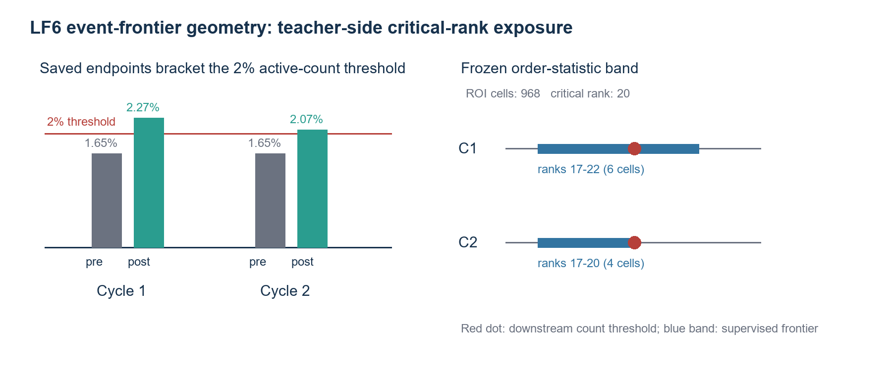
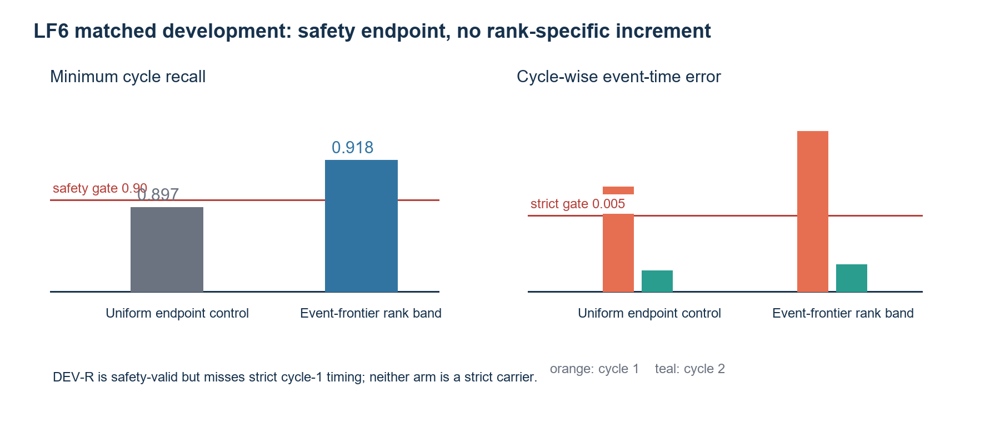
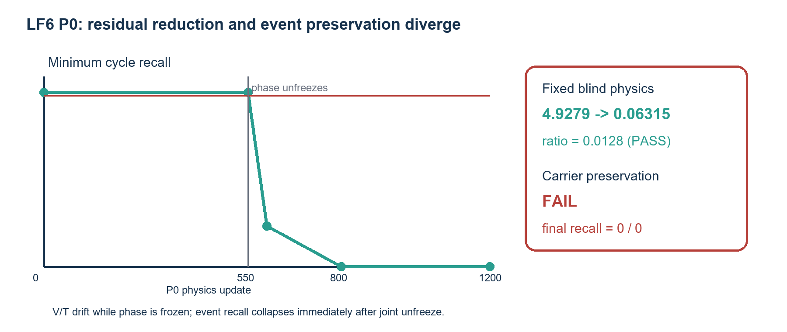
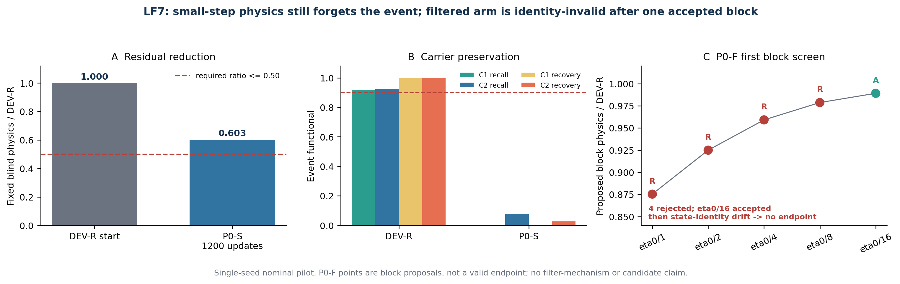
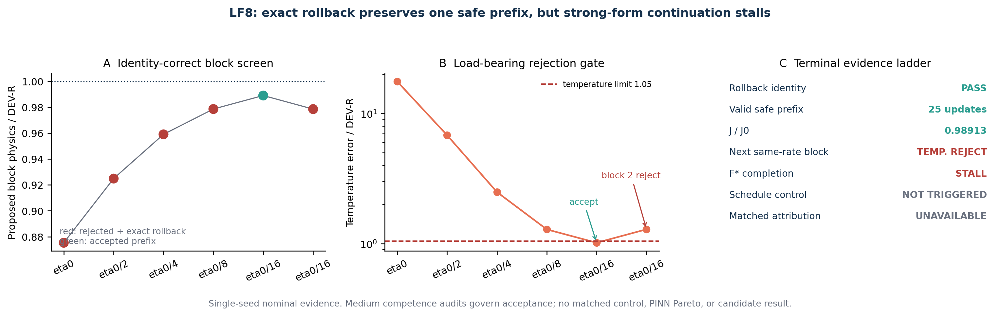

# Event Competence Before Residual Reduction: Failure Analysis and Bounded Solver Recovery for Coupled Electro-Thermal Phase-Field PINNs

> Advisor-reviewable draft. Closed evidence status:
> `LF8_FILTER_STALLED_WITH_VALID_PREFIX`.
> All neural results are single-seed nominal development evidence. No candidate,
> positive PINN method, strong-baseline gain, OOD/stress result, or submission
> readiness is claimed.

## Abstract

Physics-informed neural networks (PINNs) can reduce averaged residuals while
missing the localized phase event that controls a coupled device response. We
study this failure in a fixed two-dimensional synthetic wall-cell benchmark
with electric potential, temperature, and phase dynamics under two pulses. A
bounded recovery sequence separated mathematical admissibility, event transfer,
training measure, interface exposure, event-functional supervision, and
physics continuation. Scratch physics training collapsed to a cold phase state.
Output-space event replay recovered events but made them more than five times
too broad; target-measure calibration reduced field errors but erased them.
Equal-category startup-scaled logit distillation recovered localized events,
and a matched interface-band experiment increased minimum recall from 0.819 to
0.909, supporting teacher-interface exposure within the frozen screen.

The final LF6 experiment targeted the downstream two-percent active-count
functional. A zero-update CPU stage constructed fixed teacher rank bands around
the critical rank. Two phase-only 400-update arms then compared these frontier
cells with equal-size uniform endpoint cells. The uniform arm missed both 0.90
recall gates. The frontier arm reached safety recall 0.918/0.923 but missed the
strict cycle-1 timing gate; because neither arm was strict, the preregistered
mechanism result was `NO_RANK_SPECIFIC_INCREMENT`. The safety-valid frontier
endpoint nevertheless enabled the first executed label-free physics stage in
this recovery sequence. Its fixed blind physics objective fell from 4.9279 to
0.06315 (ratio 0.0128), but preservation failed. Potential and temperature
errors increased while phase was frozen; after joint unfreezing, minimum recall
fell from 0.918 to 0.216 within 50 updates and reached zero in both cycles by the
fixed endpoint. Relative to the selected safety near-carrier endpoint, final potential, temperature,
phase, and topology errors increased by 28.6, 52.6, 25.8, and 20.0 times.

LF7 then showed that an eightfold smaller fixed step still erased competence,
but a snapshot-aliasing defect left its filtered arm unresolved. LF8 reran the
filter with immutable model, Adam, and random-state snapshots. Four initial
rates were safely rejected, and one 25-update block at one-sixteenth of the base
rate reduced the blind objective to 0.98913 of its start while preserving all
safety checks. The next block at the same rate violated temperature preservation
and was exactly rolled back, leaving a valid prefix but a stalled path. Because
the required completion condition was not reached, the schedule control was not
triggered and matched attribution is unavailable. The result remains a bounded
interface-exposure and physics-forgetting study, not a positive method or
candidate.

## 1. Introduction

PINNs encode governing equations and boundary or initial conditions in a
differentiable objective [@raissi2019pinn]. This is appealing for devices in
which conduction, Joule heating, and phase kinetics form a closed causal chain.
The scientific observable, however, may occupy a tiny fraction of space-time.
An average collocation loss can then reward the inactive bulk while omitting the
switching front that determines current, thermal feedback, and recovery.

Phase-field PINNs have consequently used hard output constraints, curricula,
staggered optimization, and adaptive interface sampling
[@chen2025sharp; @chen2025pf; @wang2024causal; @wu2023sampling]. These are
important tools, but loss reduction alone does not establish event competence.
A bounded phase field may remain cold; high recall may come from a diffuse
false-positive region; and accurate event timing may coexist with a badly
miscalibrated continuous phase field.

We therefore treat event competence as a conjunction of event existence,
cycle-wise recall and precision, active mass, timing, locality, and recovery.
Potential admissibility and field errors remain separate requirements. The
strongest available direct low-fidelity interpolation is always reported, so
neural recovery cannot be mistaken for practical superiority.

This paper makes three bounded contributions:

1. an executed recovery ladder distinguishing cold collapse, inadmissible
   representation, over-broad transfer, inactive-measure dominance, incomplete
   support, and physics-induced forgetting;
2. a matched single-seed result showing that teacher-interface exposure, rather
   than generic extra supervision, materially improves rare-event recall; and
3. the first executed label-free physics continuation in the ladder, showing
   that a 98.7% blind-objective reduction can coexist with catastrophic loss of
   the event carrier; and
4. an identity-correct competence-filter completion showing that exact rollback
   can retain one safe residual-reducing prefix, while the frozen strong-form
   path stalls before a matched schedule comparison becomes admissible.

The components have prior art. Exact constraints, logit distillation, class
rebalancing, order statistics, event functions, and phase-interface sampling
are not claimed as original [@lagaris1998ann; @sukumar2022exact;
@hinton2015distill; @cui2019classbalanced; @koenker1978regression;
@blondel2020sorting; @berrada2018topk; @chen2021event]. Our contribution is the
bounded competence-first evidence and the observed interaction among these
components in one coupled benchmark.

## 2. Benchmark and evidence roles

### 2.1 Coupled synthetic object

The fixed domain is

\[
(x,z)\in[-1,1]\times[0,1],\qquad t\in[0,2.5].
\]

Dimensionless potential \(v\), temperature \(\theta\), and phase \(\phi\)
obey a state-dependent conduction equation, an energy balance with Joule
heating and latent coupling, and a phase kinetic equation. The applied waveform
contains two switching-and-recovery cycles. The benchmark is synthetic and
fixed-discretization; it is not a material calibration or continuum certificate.

Three independent modified-MLP field networks were used, each with four hidden
layers of width 64. Potential used the frozen exact-top range-preserving
transform; phase used the startup-scaled logit-increment representation. All
reported training used FP64, seed 17, final checkpoints, and preregistered
budgets.

### 2.2 Reference and leakage boundary

The medium trajectory was the sole low-fidelity training source. Fine and
extra-fine trajectories and the frozen nominal evaluator were read locally only
after cloud predictions were recovered, hash-verified, the GPU process was
absent, the instance was shut down, the TCP port was closed, and SSH returned
connection refusal. Two stress references remained byte-sealed and unread.

Direct medium interpolation (`LF_ONLY`) is the strongest non-PINN comparator.
It uses the full medium field and is therefore unusually strong, but it is the
honest benchmark for any accuracy claim when that information is available.

### 2.3 Competence and claim levels

The full-medium development gate required finite values, potential
maximum-principle validity, phase range validity, two events, phase maximum at
least 0.90, recall at least 0.90 per cycle, precision at least 0.80, active-mass
ratio in [0.80,1.20], locality and recovery, and field-error limits. LF6 used a
relaxed safety timing limit only to decide whether a near-carrier could enter
physics; its strict gate retained 0.005 per-cycle event-time error.

Claims were separated into three levels:

1. **Carrier:** a data-trained endpoint satisfies the declared carrier gate.
2. **Single-seed PINN Pareto:** label-free physics reduces a fixed blind physics
   objective while preserving the selected endpoint and passing strict output
   gates.
3. **Candidate signal:** the eligible P0 also meets the frozen comparison to
   direct `LF_ONLY`. Even then it would remain provisional and single-seed.

## 3. Bounded recovery program

### 3.1 From cold collapse to an incomplete localized carrier

V2.2R scratch physics training reduced its objective but stayed near
\(\phi_{\max}=0.03\). LF0 showed that ordinary low-fidelity warm start was not
enough. LF1 transferred both events but predicted active masses 5.27/5.86 times
the teacher. LF2 aligned supervision with the target measure and reduced field
errors, yet erased both events. LF3 decoupled the V/T and phase training measures
and supervised startup-scaled phase-logit increments over 14 equal-weight event
categories. It recovered localized, well-timed events but failed recall at
0.806/0.769.

### 3.2 Interface exposure and the rejected temporal premise

LF4 compared three 400-update phase-only arms from the exact LF3 endpoint.
Replacing generic extra points with teacher-interface-band points raised minimum
recall by 0.0898 while preserving the frozen quality checks. Two-sided BCE on
the same points improved timing but increased phase MSE to 0.02967 and degraded
recovery, so it was not a quality-preserving mechanism.

LF5 then reconstructed cycle-resolved temporal zero-level edges. Its valid
zero-update audit found that the threshold-supervised LF4 endpoint was less
aligned than the field-faithful interface-MSE endpoint in both onset pools. A
later exploratory run had a temporal-stream identity mismatch and could not
vote. We retain this as a bounded premise rejection, not as evidence that all
temporal supervision fails.

### 3.3 LF6 teacher-side event-frontier supervision

LF6 aligned supervision with the evaluator's active-count functional without
differentiating a rank. Let \(N=968\) be the ROI cell count and \(q=0.02\). The
critical one-based rank was

\[
n^\star=\lceil qN\rceil=20.
\]

For each cycle, adjacent saved times bracketing the teacher count crossing had
active counts \(n^-<n^\star\le n^+\). Stable descending teacher-logit sort with
cell-index tie-breaking defined the frontier

\[
F_{c,s}=\{n^-+1,\ldots,n^+\}.
\]

The cycle-1 band contained ranks 17--22 (six cells); cycle 2 contained ranks
17--20 (four cells). An equal-size uniform control was sampled without
replacement from the ROI complement using fixed seeds. This is teacher-side
preprocessing, not differentiable ranking or top-k optimization
[@koenker1978regression; @blondel2020sorting; @berrada2018topk].

Both development arms started from the exact LF3-T0 weights, froze V/T bitwise,
updated only the existing phase network for 400 steps, and used

\[
L_{\mathrm{dev}}=0.50L_{\mathrm{base}}+0.25L_{\mathrm{spatial}}
                 +0.25L_{\mathrm{endpoint}}.
\]

DEV-U used uniform endpoint cells; DEV-R used frontier cells. Every other
input, update, optimizer setting, base batch, spatial batch, and loss formula
was matched. The mechanism rule required a strict DEV-R endpoint when DEV-U was
not strict; otherwise the result was no rank-specific increment.

### 3.4 Safety-gated label-free physics

The deterministic safety-valid endpoint seeded P0 even if it was not strict.
P0 used a fresh Adam optimizer for 1200 updates and no medium labels, replay,
anchor, rank loss, or event loss:

\[
L_{P0}=L_{\mathrm{PDE}}+5L_{\mathrm{BC}}+L_{\mathrm{IC}}.
\]

Steps 1--550 froze phase parameters and buffers bitwise while updating V/T; the
full residual still read phase. Steps 551--1200 unfroze phase and continued the
same optimizer jointly. The physics stream and blind evaluation pool were fully
materialized before GPU execution.

### 3.5 LF7 competence-filtered refinement

LF7 started both matched arms from the exact LF6 DEV-R endpoint and reused the
same 1200 physics batches, fixed blind pool, phase-freeze boundary, and optimizer
family. P0-S is a fixed 1200-update control at learning rate
\(1.25\times10^{-4}\). P0-F proposes 25-update Adam blocks, snapshots the full
model, optimizer, and random-number state, and accepts a block only when the
preregistered medium-function competence checks and blind physics decrease all
pass. Rejected blocks are exactly rolled back and retried over at most five
dyadic learning-rate scales.

This design adapts trust-region, filter, restoration, and backtracking
primitives rather than claiming those primitives as new
[@cheng2024trsqppinn; @fletcher2002filter; @wachter2006ipopt;
@armijo1966backtracking; @alexandrov1998trustregion]. It targets the forgetting
phenomenon also reported in sequential PINN training [@maddu2022inversedirichlet].
Medium labels do not supply gradients in P0-F, but they do determine update
acceptance; P0-F is therefore not label-free. Only P0-S failure paired with
P0-F safety success could support a filter-specific pilot signal. The terminal
screen did not complete that relation because P0-F lost rollback state identity
after its first accepted block.

### 3.6 LF8 identity-correct filter completion

LF8 repeated only the unresolved filtered path after replacing aliased
snapshots with immutable deep copies of model, nonempty Adam state, and all
random-number states. Each 25-update proposal reused the same materialized
physics block after rejection. Acceptance required a strict decrease of the
fixed blind physics objective plus the frozen medium competence and field
preservation checks. A valid prefix was checkpointed after every accepted
block. The medium teacher therefore supplied no gradient but did govern
acceptance; this remains multifidelity competence-filtered PINN refinement, not
label-free physics.

The matched schedule-control arm was conditional: it could execute only after
F* completed 1200 accepted updates while retaining safety. This prevents a
control with a different path length from being reported as matched attribution.

## 4. Results

### 4.1 Interface exposure was supported before LF6

The historical ladder is summarized in Table 2. LF3 restored the event core but
under-covered teacher-positive boundary cells. In the matched LF4 screen,
interface-band MSE raised minimum recall from 0.819 to 0.909 without the large
field-error cost of threshold BCE. This remains the only positive mechanism
statement: it is bounded to one seed, one object, and the inherited LF3
representation.

### 4.2 Rank-band exposure reached safety but not strict competence

CPU-F reconstructed the two count crossings and all fixed streams without an
optimizer update (Figure 12). Both LF6 arms were finite, potential-admissible,
phase-range valid, and preserved V/T bitwise.

DEV-U achieved recall 0.897/0.899, precision 0.926/0.921, active-mass ratios
0.968/0.976, and timing errors 0.00690/0.00140. It failed both safety recall
checks and strict cycle-1 timing. DEV-R achieved recall 0.918/0.923, precision
0.897/0.920, active-mass ratios 1.023/1.003, and timing errors
0.01053/0.00180. It passed the relaxed safety gate but failed only strict
cycle-1 timing. Its phase weighted MSE was 0.001183, slightly lower than
DEV-U's 0.001207.

Because neither arm was strict, the frozen verdict was
`NO_RANK_SPECIFIC_INCREMENT`. DEV-R was selected solely as the deterministic
safety near-carrier for P0. It is not a strict carrier, and its selection does
not establish a rank-band mechanism.

### 4.3 Physics residual reduction destroyed the selected near-carrier event structure

The first 550 P0 updates passed the block identity check: phase weights and
buffers were bitwise unchanged and phase optimizer state was empty. Phase MSE
and recalls therefore remained 0.001183 and 0.918/0.923. At the selected DEV-R
endpoint, potential/temperature weighted MSE was
0.00007148/0.0007112. After the first V/T update it was
0.00008249/0.002458, and by step 550 it was 0.002055/0.04316. This isolates
substantial V/T drift under pure physics while the event carrier itself was
locked.

After joint unfreezing, the event collapsed rapidly. At step 600, only 50 joint
updates later, phase MSE was 0.01833 and recalls were 0.343/0.216. By step 800
cycle 1 had no event; at step 1200 both recalls were zero, cycle 1 was absent,
cycle 2 was delayed to 1.7184, and both cycles failed recovery. Potential
admissibility and phase range remained valid, so the result is not a numerical
range failure.

The fixed blind physics objective fell from 4.927872 to 0.063147, a ratio of
0.012814 that easily passed the 0.50 reduction gate. Yet final potential,
temperature, phase, and topology errors were 28.62, 52.60, 25.84, and 20.03
times their selected-endpoint values. The preregistered outcome is therefore
`LF6_P0_PRESERVATION_FAILED`, not a PINN Pareto success (Figure 14).

### 4.4 The direct low-fidelity baseline remains stronger

On the post-shutdown extra-fine evaluator, DEV-R passed the coarser event guard
with phase ROI RMS 0.03237, temperature ROI RMS 0.01736, and current NRMSE
0.13730. P0 failed the event guard and worsened phase/temperature RMS to
0.15750/0.15147; current NRMSE was 0.07540. Direct `LF_ONLY` passed the event
guard with 0.00657/0.00180/0.00352. Neither neural endpoint is noninferior to
the strongest direct baseline.

### 4.5 Smaller steps did not preserve competence; the filter screen remained incomplete

P0-S completed its exact 1200-update stream and was numerically valid. It
reduced the blind physics objective from 4.927872 to 2.971883, but its ratio
0.603076 failed the 0.50 gate. Cycle 1 disappeared; cycle-2 recall/recovery fell
to 0.0762/0.0282. Potential, temperature, phase, and topology errors were 39.5,
48.1, 22.5, and 17.4 times the DEV-R values. Smaller steps did not resolve
physics forgetting.

P0-F proposed the same first 25-update block at five dyadic rates. The first
four were rejected for potential and/or temperature preservation. At
`eta0/16`, all frozen block gates passed: blind physics decreased to 4.874314
while the four relative errors were 0.995, 1.018, 1.000, and 1.000. A subsequent
rollback identity check failed because its Adam-state snapshot was aliased and
mutated. This bookkeeping defect was diagnosed after the run; no retry
occurred. P0-F therefore has no valid endpoint, so partial block behavior cannot
establish filter efficacy.

### 4.6 Identity-correct filtering retained one safe prefix and then stalled

LF8 verified exact rollback on all rejected proposals. The first four dyadic
rates failed potential and/or temperature preservation. At `eta0/16`, the first
25-update block passed every safety check and reduced the fixed blind objective
from 4.927872 to 4.874314 (ratio 0.989132). Relative potential, temperature,
phase, and topology errors were 0.995, 1.018, 1.000, and 1.000. A second block
at the same rate proposed a lower objective, 4.822579, but raised relative
temperature error to 1.292, above the frozen 1.05 limit. Exact rollback restored
the accepted prefix.

F* therefore stopped at 25 accepted of 150 attempted updates. Its retained
endpoint was safety-valid but still failed strict cycle-1 timing. It did not
complete 1200 accepted updates, so the conditional schedule control correctly
ran zero updates. The terminal mechanism result is
`MATCHED_ATTRIBUTION_UNAVAILABLE`, not filter success or failure relative to a
matched schedule. Post-shutdown extra-fine evaluation remained far behind
direct `LF_ONLY`: phase ROI RMS was 0.03237 versus 0.00657, temperature ROI RMS
0.01757 versus 0.00180, and current NRMSE 0.13709 versus 0.00352.

## 5. Discussion

### 5.1 What LF6--LF8 establish

LF6 supplies two pieces of valid evidence. First, critical-rank endpoint cells
were not uniquely sufficient under the matched strict rule: the rank arm reached
safety, but neither arm was strict. Second, physics-only continuation sharply
reduced its own blind objective while destroying field and event competence.
The latter is stronger than the earlier inference from an unexecuted P0: it is a
directly observed, two-stage forgetting trajectory.

The timeline narrows the failure. V/T drift began while phase was immutable,
showing that the selected safety near-carrier endpoint was not jointly compatible with the frozen
physics objective under the block-F update. Event collapse then followed almost
immediately after phase unfreezing. This supports `physics forgetting` as the
observed phenomenon. It does not identify a unique cause among model mismatch,
optimization geometry, insufficient coupling constraints, or the absence of
replay; those remain hypotheses.

LF7 adds a matched negative control: an eightfold smaller Adam step did not
preserve the event and did not meet the blind-physics gate. It also shows, below
endpoint level, that the filter rejected four unsafe blocks before admitting
one very small safe block. Because the arm then became identity-invalid, this
is implementation diagnostic evidence rather than a mechanism result.

LF8 closes that engineering uncertainty. With exact state restoration, the
filter again rejected unsafe proposals and retained the same first safe block.
The next same-rate block was rejected on temperature preservation and exactly
rolled back. Thus the frozen strong-form direction has a nonempty safe prefix,
but cannot progress beyond 25 accepted updates under this schedule and filter.
This is a valid bounded stall result; it does not establish matched schedule
attribution because the preregistered control trigger was not reached.

### 5.2 What LF6--LF8 do not establish

DEV-R's safety pass does not make it a strict carrier. Since DEV-U and DEV-R
both missed strict competence, their difference cannot support a rank-specific
mechanism claim. Historical LF3--LF5 runs are not strict single-factor
ablations. P0's residual reduction does not show physical accuracy, because its
observable fields and events degraded. The run does not show that PINNs in
general fail, that replay would solve the conflict, or that the medium teacher
is exact physics truth.

The local evaluator and full-medium gate answer different questions. A
post-shutdown event-guard pass for DEV-R does not override its strict timing
failure. Direct interpolation also remains the accuracy reference; no speed,
compression, inverse, sparse-data, or OOD advantage was measured and none may
be supplied after the fact.

LF8 does not establish that competence filtering is superior to a replayed
schedule: F* never met the completion trigger and the control was not executed.
One accepted block cannot be extrapolated to 1200 updates or described as a
PINN Pareto result. The medium acceptance audit also prevents calling F*
label-free, despite its pure-physics gradient. The retained prefix remains
strictly noncompetent on cycle-1 timing and inferior to direct interpolation.

### 5.3 Paper positioning and next evidence

The maximum defensible central statement is:

> In a fixed coupled electro-thermal-phase benchmark, competence-first matched
> controls identify interface exposure as a bounded recall mechanism, reject a
> rank-specific endpoint increment under the strict gate, and show directly
> that large physics-residual reduction can catastrophically erase an otherwise
> safety-valid localized event carrier.

This supports an advisor draft and potentially a carefully scoped
negative/diagnostic paper. It does not support a positive methods submission.
LF7 strengthens the negative case against learning-rate reduction alone, and
LF8 establishes that the identity-correct strong-form filter stalls after one
safe block. The most direct next question is therefore no longer a snapshot or
learning-rate repair, but whether a mixed weak/control-volume physics objective
supplies a preservation-compatible descent direction. That route requires a
new contract. Multi-seed and sparse/equal-information work remain unjustified;
stress remains sealed.

## 6. Limitations

All experiments use one synthetic object, fixed discretization, architecture,
seed, and nominal protocol. The recovery sequence was adapted across separately
frozen campaigns; it is not a single factorial comparison. LF6's two
development arms are internally matched, but the broader sequence is not.
Fine/extra-fine data are numerical references rather than continuum or material
truth. There is no experimental validation, multi-seed analysis, sparse task,
formal OOD result, stress result, or submission-ready candidate.

The safety timing gate was intentionally weaker than strict competence to let
P0 test whether physics could repair or preserve a near-carrier. That design
made the physics experiment possible, but it means DEV-R must never be called a
strict data-only carrier. Conversely, P0 is a valid negative physics result,
not an engineering failure: all updates, stream identities, artifacts, recovery,
shutdown, and local adjudication completed.

LF7 P0-S is likewise a valid negative physics result. P0-F is different: it
terminated after a state-identity defect, so neither its endpoint nor the
matched S/F mechanism relation exists. Its four rejections and one accepted
block are retained only as bounded diagnostic evidence.

LF8 repaired that identity defect prospectively and produced a valid retained
prefix. However, it stopped after one accepted block and did not trigger its
conditional control. Consequently there is still no completed filter/control
comparison, no PINN Pareto, and no candidate.

## 7. Conclusion

The program progressed from cold collapse to localized event recovery, a
matched interface-exposure result, and finally an executed label-free physics
continuation. LF6's teacher-side frontier arm reached a relaxed safety entry but
not strict timing, while the matched control was also non-strict; therefore no
rank-specific increment was established. P0 reduced the fixed blind physics
objective by 98.7% yet increased all preservation errors and erased both-cycle
recall. The decisive lesson is not that residuals are useless or PINNs are
impossible. It is that residual reduction, field admissibility, and sparse-event
competence are independent obligations, and in this frozen continuation they
were actively in conflict. LF7 further rejects smaller steps alone as a rescue.
LF8 proves that exact rollback can retain one safety-valid residual-reducing
prefix, but the next same-rate block violates temperature preservation and the
strong-form path stalls. The conditional schedule control is therefore absent
and matched filter attribution remains unavailable. Candidate remains none;
the direct low-fidelity baseline remains stronger; stress remains sealed and
unread.

## Data, code, and evidence availability

Contracts, implementations, compact artifacts, figures, and this manuscript are
versioned in the repository. Large checkpoints, predictions, and raw logs remain
in git-ignored run storage and are bound by size and SHA-256 in terminal
evidence. No external publication or submission is authorized by this draft.
