# Event Competence Before Residual Reduction: Failure Analysis and Bounded Solver Recovery for Coupled Electro-Thermal Phase-Field PINNs

> Advisor-reviewable draft. Evidence status:
> `LF5_TZL_ALIGNMENT_NOT_SUPPORTED_CPU`, retaining LF4's
> `BOUNDARY_EXPOSURE_SUPPORTED`. This manuscript reports single-seed nominal
> development evidence. It does not claim a successful PINN method.

## Abstract

Physics-informed neural networks (PINNs) can minimize averaged residuals while
missing a localized phase event that determines device behavior. We investigate
this failure mode in a fixed two-dimensional synthetic wall-cell benchmark with
coupled electric potential, temperature, and phase dynamics under two driven
pulses. A preregistered sequence separated representation validity, low-fidelity
event transfer, training measure, and physics refinement. Scratch physics
training remained in a cold state with phase maximum near 0.03. Event-balanced
output-space distillation recovered both events but expanded their active mass
to 5.27 and 5.86 times the medium teacher. Target-measure calibration reduced
all three weighted field errors but erased both events. We then tested one
measure-decoupled, startup-scaled phase-logit carrier trajectory: potential and
temperature retained the target measure, whereas phase-logit increments were
trained with equal weight across 14 mutually exclusive event categories. The
result was finite and potential-admissible, reached phase maximum 0.9912, and
recovered both event times, with cycle-wise precision 0.907 and 0.866 and active
mass ratios 0.888 and 0.887. However, recalls were only 0.806 and 0.769, below
the frozen 0.90 gate. We then ran a matched three-arm interface-mechanism screen
from those exact weights. Equal-budget generic extra supervision reached
minimum recall 0.819. Replacing only those extras with teacher-interface-band
MSE raised it to 0.909, a preregistered quality-preserving gain of 0.0898.
Two-sided threshold logistic supervision on the identical band raised minimum
recall to 0.942 and restored both timing gates, but increased phase weighted MSE
to 0.0297 and degraded recovery relative to the interface-MSE arm. Thus
teacher-interface exposure, not the threshold loss, was supported by the
matched mechanism gate. No arm passed every carrier-entry condition, so the
conditional label-free physics stage was not run. A subsequent zero-update
qualification reconstructed 264 valid cycle-resolved temporal edges and asked
whether the threshold-supervised endpoint was locally better aligned to the
teacher crossing than the field-faithful interface-MSE endpoint. It was worse
in both onset pools (0.724 versus 0.292 and 0.604 versus 0.310 mean absolute
logit residual), rejecting the proposed temporal-zero-level continuation before
GPU deployment. On the nominal extra-fine evaluator the LF3 carrier passed the
coarser event-existence/locality guards and reduced phase region-of-interest RMS
error from 0.1106 for the calibrated cold carrier to 0.0390, but direct medium
interpolation remained much more accurate at 0.00657. The terminal outcome was
latest training outcome remained `LF4_NO_DEVELOPMENT_ENTRY`; the LF5 mechanism
qualification outcome was `LF5_TZL_ALIGNMENT_NOT_SUPPORTED_CPU`, with no
candidate. The study shows that
domain-averaged accuracy, event existence, event mass, precision, and recall are
non-substitutable requirements in sparse-event multiphysics learning. It also
demonstrates why a near-pass data carrier cannot be used to infer PINN-specific
value before physics refinement is actually executed.

## 1. Introduction

Physics-informed neural networks encode governing equations and boundary or
initial conditions in differentiable training objectives
[@raissi2019pinn]. Their flexibility is attractive for coupled systems in which
electrical conduction, Joule heating, and phase kinetics interact across space
and time. Yet the loss is usually an average over collocation points, while the
scientific quantity of interest may be a small and transient active set. A model
can therefore reduce its residual or global field error by fitting the inactive
bulk and still erase the event that changes device current, thermal feedback, or
state retention.

Phase-field PINNs have motivated hard output constraints, staggered training,
curricula, specialized architectures, and adaptive sampling
[@chen2025sharp; @chen2025pf; @wang2024causal; @wu2023sampling]. These methods
address genuine optimization pathologies, but their success cannot be inferred
from loss reduction alone. A bounded phase field can still remain entirely
cold; an event-balanced model can obtain recall by predicting an excessively
large hot region; and a target-measure objective can prefer the inactive class
because it occupies nearly all space-time measure. The basic distinction is
between field approximation and event competence.

This paper studies that distinction in a transparent synthetic device rather
than making a material-calibrated claim. The model closes an electric–thermal–
phase causal chain and contains two localized switching-and-recovery episodes.
The reference hierarchy includes a medium carrier used only as a low-fidelity
training source and fine/extra-fine nominal carriers used only for local
development evaluation after predictions are frozen and cloud execution is
shut down. Two stress references were byte-sealed and never read in the reported
campaign.

The research proceeded through a sequence of bounded hypotheses. A four-arm
scratch PINN comparison first established that decreasing physics loss did not
produce either phase event. Gradient and optimizer diagnostics then ruled out a
simple gradient-magnitude rescue. An inadmissible hard potential lift was
replaced by a range-preserving exact-top construction. Low-fidelity supervision
could transfer events, but an output-space event-balanced objective made them
far too broad. Replacing that measure with the final evaluation measure reduced
field errors but returned the phase field to the cold solution. These failures
motivated a final combination pilot in which potential and temperature retained
target-measure supervision, while phase was taught as a startup-scaled logit
increment under equal category weighting.

The contribution is not a positive algorithm claim. Each constituent—exact
output constraints [@lagaris1998ann; @sukumar2022exact], logit-space distillation
[@hinton2015distill], class rebalancing [@cui2019classbalanced], and staged
physics-informed fine tuning—has clear precedent. Within a bounded primary-
source search, we found no exact functional collision for the complete
combination, but one trajectory cannot establish originality, robustness, or
superiority. Instead, this study contributes:

1. a competence-first decomposition of localized event fidelity into existence,
   timing, active mass, precision, recall, locality, and recovery;
2. an executed failure ladder that isolates cold collapse, invalid
   representation, over-broad event transfer, and inactive-measure dominance;
3. a matched-stream combination pilot showing a transition from diffuse
   false-positive mass to localized but incomplete support;
4. a matched mechanism screen that identifies teacher-interface exposure as a
   driver of recall while rejecting threshold logistic loss as a
   quality-preserving increment; and
5. a three-level decision rule that prevents data-only carrier recovery from
   being reported as a PINN-specific or paper-positive result.

## 2. Coupled benchmark and evidence roles

### 2.1 Synthetic electric–thermal–phase object

The fixed domain is

\[
(x,z)\in[-1,1]\times[0,1],\qquad t\in[0,2.5].
\]

Dimensionless electric potential \(v\), temperature \(\theta\), and phase
\(\phi\) satisfy a state-dependent conduction equation, an energy balance with
Joule heating and latent coupling, and a phase-field kinetic equation:

\[
\nabla\!\cdot[\sigma(\theta,\phi)\nabla v]=0,
\]

\[
\theta_t+L_r\phi_t=\alpha\nabla^2\theta-\gamma\theta
+G\sigma(\theta,\phi)|\nabla v|^2,
\]

\[
\phi_t=M(\theta)\left[\epsilon^2\nabla^2\phi-
\partial_\phi W(\phi,\theta)\right].
\]

Conductivity depends smoothly on temperature and phase. A fixed waveform drives
the lower electrode while the top potential is grounded. Thermal and no-flux
conditions close the boundary-value problem. All equations, geometry,
parameters, boundary/initial conditions, event regions, and evaluation
thresholds were inherited unchanged from the PHK-V2.1 fixed-discretization
object. The extra-fine carrier is a numerical development reference, not
continuum truth or experimental validation.

### 2.2 Data and leakage boundary

The medium numerical carrier is the sole cloud-side label source. It is used for
T0 supervision and for the full-medium carrier gate. Fine and extra-fine nominal
carriers and the frozen evaluator are local-only assets: they may be opened only
after the remote prediction and checkpoint are recovered, all declared hashes
match, the instance is shut down, and SSH refuses connection. Stress carriers
are excluded from training, selection, evaluation, and this paper.

The direct medium interpolation `LF_ONLY` is the strongest non-PINN baseline.
It is intentionally not weakened merely because it is difficult to beat. It
tests whether a neural representation or physics-informed continuation adds a
measurable benefit over direct use of the available low-fidelity field.

## 3. Competence-gated recovery design

### 3.1 Exact-top, range-preserving potential

Earlier experiments showed that a top-hard lift could couple the raw network
envelope to a structural lower bound. The retained potential representation
instead uses a range-preserving log-ratio parameterization that satisfies the
top Dirichlet value exactly and keeps the predicted potential between the two
electrode values at every time. In addition to the unchanged frozen evaluator,
a method-validity maximum-principle guard requires

\[
\min(0,w(t))-10^{-6}\le v_\theta(x,z,t)
\le\max(0,w(t))+10^{-6}
\]

with zero violating fraction. This guard is a property of the LF campaign, not
a retroactive modification of the evaluator.

### 3.2 Startup-scaled phase-logit representation

Let \(\phi_0(x,z)\) be the initial phase and

\[
s(t)=1-\exp[-(t-t_0)/0.35].
\]

The phase network predicts

\[
\phi_\theta=\operatorname{sigmoid}\!\left[
\operatorname{logit}(\operatorname{clip}(\phi_0,10^{-8},1-10^{-8}))
+8s(t)h_\phi(x,z,t)\right].
\]

The representation is exactly initial-condition compatible because \(s(t_0)=0\).
Rather than dividing by the poorly identifiable startup factor, the supervised
quantity is the complete logit increment

\[
\Delta\ell_\theta=8s(t)h_\phi,
\qquad
\Delta\ell^\star=
\operatorname{logit}(\bar\phi_m)-
\operatorname{logit}(\bar\phi_0),
\]

where bars denote the same fixed clipping. Nodes at \(t=t_0\) are masked from
the phase loss. The target was checked before GPU execution: reconstruction
error was \(2.22\times10^{-16}\), and the largest observed equivalent latent
magnitude was 1.864, below the frozen analytical bound 4.605.

### 3.3 Measure decoupling

Potential and temperature are smooth fields for which the final space-time
target measure is appropriate. The phase event is rare, so the same measure
would allocate most gradient mass to inactive background. The medium grid is
therefore partitioned into 14 mutually exclusive categories spanning the two
cycles and event, transition, recovery, hard-negative, and background roles.
Every category was nonempty on 1,603,200 saved medium nodes.

For a target-measure batch \(B_f\), potential and temperature losses are

\[
L_v=\frac{\sum_{i\in B_v}\mu_i(v_{\theta,i}-v_{m,i})^2}
{\sum_{i\in B_v}\mu_i},\qquad
L_\theta=\frac{\sum_{i\in B_\theta}\mu_i(\theta_{\theta,i}-\theta_{m,i})^2}
{\sum_{i\in B_\theta}\mu_i}.
\]

For phase, an independent deterministic draw supplies a fixed quota from each
category. Each category contributes its own mean normalized logit-increment MSE,
and the 14 category means are averaged equally:

\[
L_\phi=\frac1{14}\sum_{c=1}^{14}
\frac1{|B_c|}\sum_{i\in B_c}
\left(\frac{\Delta\ell_{\theta,i}-\Delta\ell_i^\star}
{36.8413614679}\right)^2.
\]

The T0 objective is

\[
L_{T0}=\frac{L_v+L_\theta+L_\phi}{3}.
\]

It contains no output-space phase MSE, BCE, augmented Lagrangian, event penalty,
Huber term, PDE residual, or physics sampling. Equal category weighting changes
the training measure; it does not change the final target-measure evaluation.
All 1200 draws reproduced the LF2 deterministic stream identity, allowing the
observed difference to be associated with the combined phase objective and AL
removal, though not with phase-logit teaching alone.

### 3.4 Conditional physics refinement and the three claim levels

The intended P0 stage would start from the fixed T0 checkpoint with a fresh Adam
optimizer and no labels or replay. It would minimize the original full-physics
objective

\[
L_{P0}=L_{\mathrm{PDE}}+5L_{\mathrm{BC}}+L_{\mathrm{IC}}
\]

for 1200 updates, freezing the independent phase head for the first 550 and then
updating all three heads. This stage is conditional, not automatic.

The decision hierarchy is:

1. **Carrier competence.** T0 must be finite, potential-admissible, contain both
   events, satisfy field-error/locality/recovery gates, and achieve recall at
   least 0.90, precision at least 0.80, and active-mass ratio in [0.80,1.20] for
   each cycle.
2. **Single-seed PINN-specific pilot.** Only an executed P0 can be compared with
   the same T0 checkpoint for physics-objective reduction and field/event
   noninferiority.
3. **Candidate/paper-positive signal.** An eligible P0 must also be noninferior
   to direct `LF_ONLY`. Multi-seed and OOD/stress confirmation would still be
   required under a separate authorization.

Failure at an earlier level makes later levels not reached, not failed.

### 3.5 Matched interface-band mechanism screen

LF4 tested the boundary-support interpretation without changing the network,
initial weights, V/T fields, base loss, optimizer, update budget, or random
stream. Three phase-only arms started from the exact LF3-T0 checkpoint and ran
400 fixed updates. All used

\[
L_{\mathrm{dev}}=\tfrac12L_{\mathrm{base}}+\tfrac12L_{\mathrm{extra}}.
\]

DEV-G used 256 additional global points with normalized logit-increment MSE.
DEV-M instead used 64 samples from each of four frozen teacher-interface pools
(positive/negative side for each cycle) with the same MSE. DEV-C reused the
identical DEV-M coordinates but replaced MSE by balanced binary logistic loss,
\(\operatorname{softplus}(-z)\) on the positive side and
\(\operatorname{softplus}(z)\) on the negative side, normalized by
\(\log 2\). This is standard BCE-with-logits, not a new loss family
[@kervadec2021boundary; @mescheder2019occupancy]. Interface-focused sampling in
phase-field PINNs is also established [@chen2025pf; @elfetni2025pinnsmpf].

The boundary-exposure claim required
\(R_{\min}^{M}-R_{\min}^{G}\ge0.03\); the threshold-loss claim analogously
required \(R_{\min}^{C}-R_{\min}^{M}\ge0.03\). Both additionally required
precision, active mass, timing, locality, recovery, and V/T quality preservation.
These matched gates distinguish extra optimization, exposure location, and loss
shape without treating any constituent as original.

### 3.6 Cycle-resolved temporal zero-level premise test

LF5 asked whether LF4's timing-improved DEV-C endpoint supplied the right local
geometry for a calibration-preserving temporal correction. On each ROI cell,
the medium teacher logit (z^star) defined the first onset sign crossing in
W1/W3 and the first subsequent recovery crossing in W2/W4. For adjacent saved
times (k,k+1), the teacher crossing fraction was

\[
\rho^star=-\frac{z_k^star}{z_{k+1}^star-z_k^star},
\]

and a checkpoint's teacher-secanted zero-level residual was

\[
r_{\theta,e}=(1-\rho^star)z_{\theta,k}
              +\rho^star z_{\theta,k+1}.
\]

The proposed training term was the equally weighted mean of
\((r_{\theta,e}/36.8413614679)^2\) over the four cycle/direction pools. Before
any optimizer step, however, a preregistered mechanism gate required DEV-C to
reduce weighted mean \(|r|\) relative to DEV-M in both onset pools. This check
had direct decision value: failure closed the GPU branch, rather than spending
a trajectory on an initialization that contradicted the stated premise.

## 4. Experimental protocol

All neural runs used three independent modified-MLP field networks, four hidden
layers of width 64, FP64 arithmetic, seed 17, and final-checkpoint evaluation.
T0 loaded only the exact LF1-B0 model weights; optimizer state was discarded.
All three field networks were updated with fresh Adam at learning rate
\(10^{-3}\), standard betas, and global gradient-norm clipping at 10. No
hyperparameter sweep, checkpoint selection, manual early stop, or second GPU
arm was permitted.

The T0 sampling stream contained exactly 1200 deterministic draws with rolling
SHA-256
`6E9957E861BE0FD10E19A1585635C7B2C323077D89908159B1736734FB548F28`.
No physics sampler was constructed or advanced in T0. Audits were recorded at
steps 1, 50, 100, 200, 400, 800, and 1200. The final checkpoint and full-grid
prediction were fixed at step 1200.

The single V100 trajectory and all summary-bound artifacts were recovered and
hash-verified before shutdown. A launcher wrapper recorded the literal text
`$?` rather than an integer exit code; that raw three-byte record was preserved
as a post-run logging defect. Scientific completion is independently supported
by the terminal summary and all seven complete, hash-bound artifacts. The defect
did not justify a second trajectory. After the instance returned SSH connection
refusal, the unchanged local nominal evaluator compared `LF_ONLY`, LF1-B0,
LF1-final, LF2-M0, and LF3-T0 against the extra-fine reference.

LF4 then executed DEV-G, DEV-M, and DEV-C for exactly 400 updates each from the
same LF3-T0 weights. V/T parameters were bitwise frozen; each arm used fresh
Adam and the identical 1201–1600 base stream. DEV-M and DEV-C also shared the
same band ledger. The three fixed endpoints, rather than intermediate
telemetry, determined all comparisons. A first launcher attempt encountered a
missing `h5py` import before runner import, output creation, or optimizer
construction. After an isolated dependency/CUDA regression and repeated
zero-step preflight in the existing project environment, the unchanged
scientific identity completed once. All files were recovered and hash-matched,
the idle GPU instance was shut down, and local nominal evaluation was performed
only after the port closed and SSH returned connection refusal.

LF5 was evaluated entirely on CPU before deployment. It loaded the medium
carrier and fixed LF4 DEV-M/DEV-C checkpoints read-only, reconstructed the four
temporal pools, and reproduced the LF4 base and interface streams. All 264
candidate edges were valid. A single backward probe confirmed a finite nonzero
phase gradient but made no update. Fine, extra-fine, direct `LF_ONLY`, the
frozen evaluator, and stress were not opened. Because the mechanism comparison
failed, no bundle was built, no cloud connection was opened, and no LF5
checkpoint or prediction exists.

## 5. Results

### 5.1 The recovery ladder separated four distinct failure modes

The original scratch PINN remained near the initial phase field, with phase
maximum approximately 0.03 and no active nodes. An early low-fidelity warm start
raised the maximum to 0.478 but failed the potential maximum-principle guard.
The LF1 range-preserving output-space distillation crossed the event threshold
and produced both cycles, but the predicted active masses were 5.27 and 5.86
times the teacher. LF2 target-measure calibration reduced potential,
temperature, and phase weighted errors to 25.7%, 6.55%, and 27.3% of LF1-B0,
respectively, while erasing both events. LF3 recovered a phase maximum of 0.9912
and valid two-cycle topology (Figure 1).

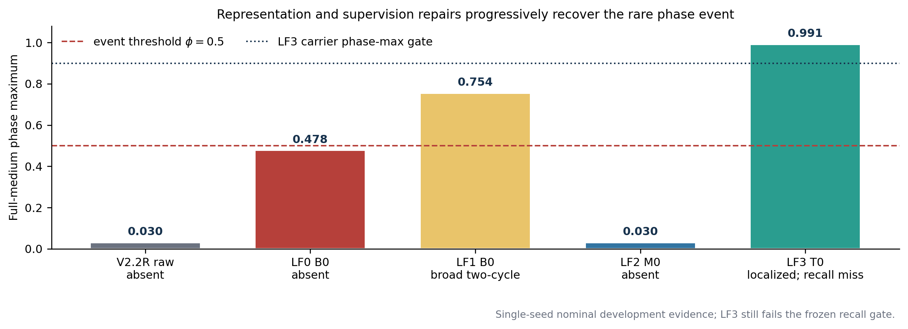

This sequence does not identify a single causal factor. It does show that the
four outcomes—cold collapse, invalid field representation, broad event support,
and low-error event erasure—are observably different and require different
guards.

### 5.2 LF3 changed the dominant topology error from false-positive mass to missed support

On the full medium grid, LF3-T0 was finite, passed the phase range and potential
maximum-principle guards, reached a maximum temperature of 0.8050, and produced
both event and recovery episodes. Cycle-1 and cycle-2 event-time errors were
0.00485 and 0.00170, within the frozen 0.005 limit. Precision was 0.907 and
0.866, while active-mass ratios were 0.888 and 0.887. Thus the predicted event
was neither diffuse nor grossly oversized.

However, recall was 0.806 in cycle 1 and 0.769 in cycle 2. Both values failed
the 0.90 hard gate. In contrast, LF1-B0 recall was about 0.899 and 0.945, but
precision was only about 0.171 and 0.161 because its active mass was more than
five times too large (Figure 2). The combination pilot therefore traded a broad,
mostly false-positive event for a localized event with incomplete boundary
support. The visual audit at reference peak times shows the same pattern:
overlap dominates the event core, while missed support forms a narrow boundary
(Figure 4).

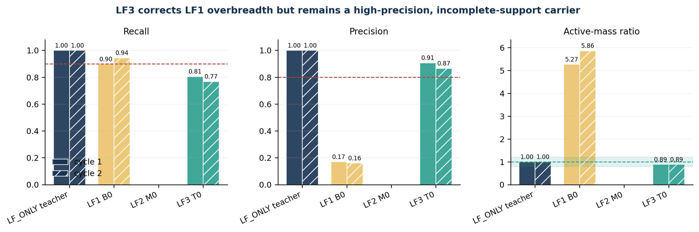

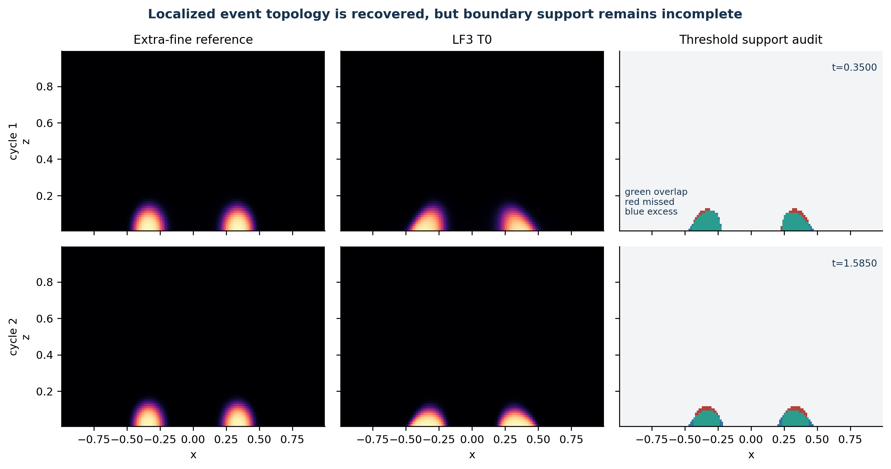

The final full-medium weighted errors were
\(7.15\times10^{-5}\) for potential, \(7.11\times10^{-4}\) for temperature,
and \(1.88\times10^{-3}\) for phase. Relative to LF1-B0 these were 0.242, 0.0634,
and 0.0331. These strong field-error improvements did not override the recall
failure.

### 5.3 Local extra-fine evaluation confirms recovery, not paper-positive accuracy

The frozen local evaluator uses event-existence, locality, peak, and recovery
guards rather than the LF3 teacher-relative 0.90 recall gate. LF3-T0 passed
those evaluator guards, with event times 0.23522 and 1.49444 versus reference
times 0.24060 and 1.49840. This is consistent with, not contradictory to, the
full-medium failure: a localized event may pass existence/locality tests while
still omitting more than 10% of teacher-positive support.

LF3-T0 reduced phase ROI RMS from 0.11056 for LF2-M0 to 0.03900 and reduced the
time-averaged phase-region symmetric difference from 0.00515 to 0.002026. It
also improved the LF1-B0 event timing. Nevertheless, direct `LF_ONLY` remained
much stronger: phase ROI RMS 0.006570, phase symmetric difference 0.0003495,
temperature ROI RMS 0.001801, current nRMSE 0.003522, and potential RMS
0.000576. LF3 remained approximately 5.9, 5.8, 9.6, 39.0, and 10.4 times worse
on these five metrics, respectively (Figure 3).

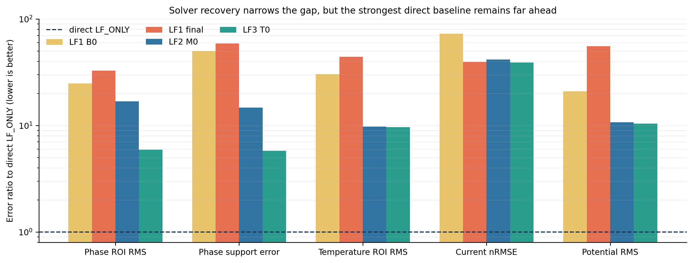

### 5.4 The preregistered stop prevented an unsupported PINN claim

The only failed carrier checks were the two recall thresholds. The machine
therefore returned

```text
LF3_CARRIER_NOT_ESTABLISHED
P0_NOT_TRIGGERED_BECAUSE_T0_GATE_FAILED
candidate = none
```

T0 executed 1200 data-only optimizer steps; P0 executed zero physics steps.
Consequently, the experiment provides no P0-versus-T0 physics-objective ratio,
no evidence that physics refinement preserves the carrier, and no PINN-specific
Pareto result. It would be incorrect to call P0 a failed method, because it was
not run; it would be equally incorrect to call T0 a PINN result, because its
loss contained no PDE or constitutive residual (Figure 5).

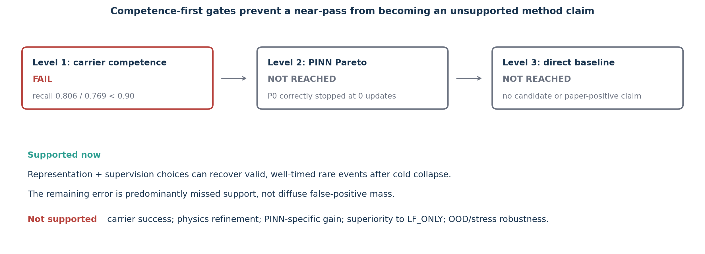

### 5.5 Matched LF4 controls support interface exposure, not threshold loss

CPU-G found that 455 of 481 false-negative nodes (94.6%) and 199 of 227
false-positive nodes (87.7%) lay directly on the frozen four-neighbour teacher
interface (Figure 6). LF4 then tested whether this geometry mattered.

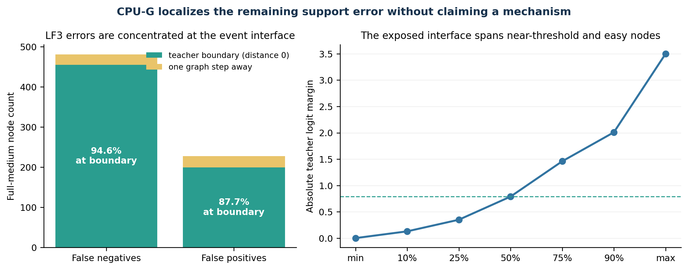

DEV-G, the equal-budget global-extra control, reached cycle recalls 0.8402 and
0.8194 but failed both timing gates. DEV-M replaced only the extra points with
the teacher-interface band. Recall rose to 0.9373 and 0.9093; precision remained
0.9092/0.9462, mass ratios remained 1.031/0.961, recovery remained complete,
and phase weighted MSE decreased from 0.001309 to 0.001210. The minimum-recall
gain was 0.08984, almost three times the preregistered 0.03 margin. The frozen
mechanism verdict was therefore `BOUNDARY_EXPOSURE_SUPPORTED`. DEV-M still
missed the cycle-1 timing limit (0.01053 versus 0.005), so it was not an entry
carrier.

DEV-C applied balanced BCE-with-logits on the identical interface coordinates.
Its recalls rose to 0.9416/0.9755 and both timing errors fell below 0.005, but
phase weighted MSE increased to 0.02967—15.8 times LF3-T0 and 24.5 times DEV-M—
while cycle-2 recovery fell from 1.0 to 0.768. Although its recall difference
exceeded 0.03, it failed the preregistered quality-preservation clause. The
threshold-aligned loss was therefore not supported as the load-bearing
mechanism (Figure 7).

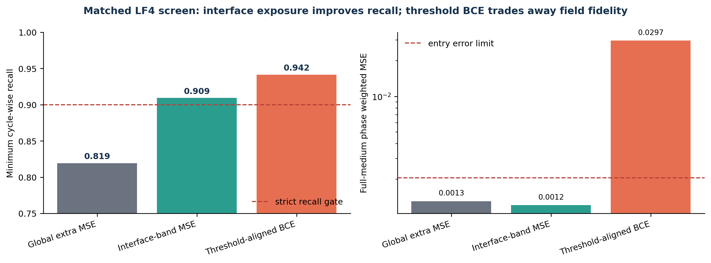

The three fixed endpoints failed entry for distinct reasons: both timing gates
for DEV-G, cycle-1 timing for DEV-M, and phase error for DEV-C. Consequently no
arm was selected, P0 ran zero updates, and the terminal machine outcome was
`LF4_NO_DEVELOPMENT_ENTRY` with no candidate (Figure 8).

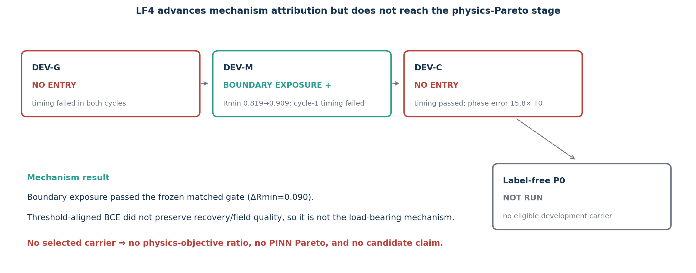

### 5.6 Aggregate event timing did not imply local zero-level alignment

CPU-T reconstructed 68/68/64/64 valid edges for cycle-1 onset/recovery and
cycle-2 onset/recovery, respectively, with no invalid edges. DEV-M's weighted
mean absolute residuals were 0.2921 and 0.3100 in the two onset pools. DEV-C,
despite passing LF4's aggregate timing gates, was worse at 0.7238 and 0.6041.
Its recovery residuals were also substantially larger (5.247 and 7.113 versus
0.398 and 0.699). DEV-M's signed onset residuals agreed with the independently
recorded early/late timing directions, and a zero-step backward probe was
finite and nonzero. Thus the failure was not an invalid edge construction or a
disconnected loss; it was a direct rejection of the required ordering between
the two inherited endpoints (Figure 9).

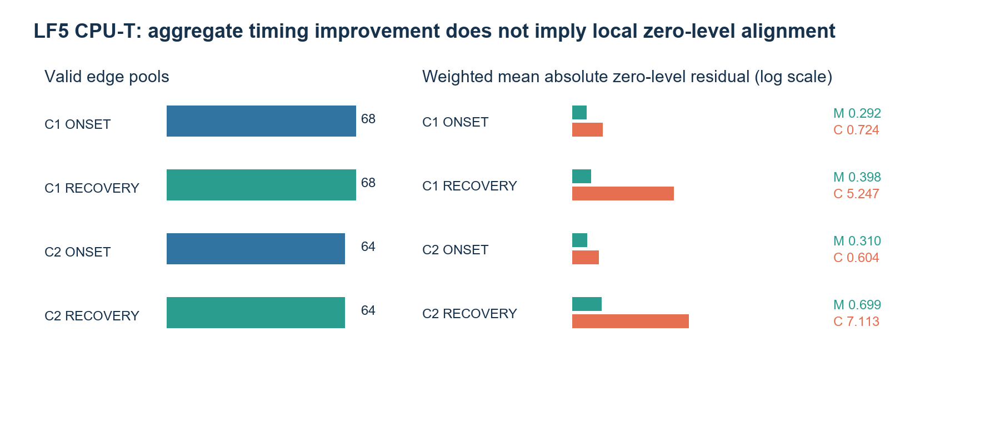

The result sharpens the LF4 timing–calibration conflict. A model can improve a
single aggregate event-time statistic while moving many local interface cells
farther from the teacher's crossing fraction (Figure 10). Under the frozen
rule, the proposed DEV-T objective was therefore not executed. Conditional P0
was also not reached; both stages are `NOT_RUN`, not failed (Figure 11).

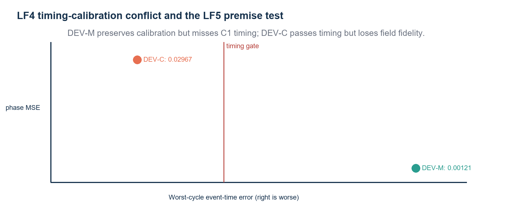

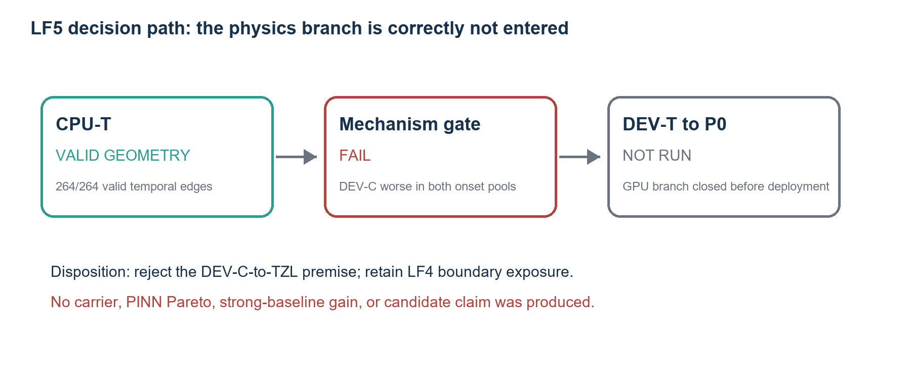

## 6. Discussion

### 6.1 What was learned

Five conclusions are directly supported within the fixed protocol.

First, low aggregate field error is not a proxy for sparse-event competence.
LF2 had substantially lower weighted field error than LF1-B0 but erased the
event. Second, event existence and recall are not sufficient either. LF1-B0
covered most teacher-positive nodes by predicting a region more than five times
too large. Third, the LF3 combination recovered a numerically admissible,
well-timed, high-precision event after the target-measure cold collapse, but it
did not reproduce enough of the teacher support to establish the preregistered
carrier.

Fourth, LF4 converts the boundary-support interpretation into a matched,
system-specific mechanism result: allocating the same extra supervision budget
to the teacher interface materially improves minimum recall beyond generic
global extras. It simultaneously shows that more threshold alignment is not
automatically better: binary logistic supervision corrected event timing but
destroyed field fidelity. Exposure location and loss shape therefore play
different roles.

Fifth, aggregate event timing and local interface timing are not interchangeable.
LF5's zero-update audit falsified the assumption that DEV-C's aggregate timing
gain made it a better initialization for teacher-secanted temporal zero-level
alignment. This preserves the LF4 boundary-exposure result while rejecting one
specific continuation premise without conflating it with a trained-model
failure.

The most specific supported interpretation is that the remaining LF3 mismatch
is an event-boundary coverage problem. It is not the previous cold-state basin,
because phase maximum and both event episodes returned. It is not primarily
diffuse false-positive mass, because precision and mass gates passed. It is not
a temporal-only error, because event-time and recovery gates passed. The red
boundary band in Figure 4 and the two recall failures point to incomplete
support around the localized event core. LF4 directly supports the exposure
part of this interpretation while showing that the remaining timing–fidelity
trade-off is unresolved.

### 6.2 What was not learned

LF3 changed multiple coupled factors relative to LF2: phase supervision moved
from target-measure output-space losses with BCE and stochastic inequality AL to
equal-category normalized logit-increment MSE without BCE or AL. The historical
LF2 trajectory is therefore a baseline for the combined recovery package, not a
strict single-factor ablation. The result cannot attribute the improvement to
the logit link alone, startup scaling alone, category weighting alone, or AL
removal alone.

Likewise, the local extra-fine evaluator pass does not supersede the frozen
full-medium carrier gate. The two instruments ask different questions. The
extra-fine event guard establishes that an event exists in the intended place
and recovers; the carrier gate demands quantitative teacher-support fidelity.
LF4 does not establish a threshold-loss benefit, an eligible carrier, or a
physics-informed improvement. Its boundary-exposure attribution is conditional
on the inherited LF3 representation and one nominal seed; it does not identify
the earlier latent components. LF5 does not establish that temporal supervision
as a class is ineffective. It did not train the proposed loss and did not test
a kinetic-RHS teacher, \(\partial_t\phi\) supervision, continuous-time event
localization, or a matched endpoint-MSE control.

### 6.3 Why further tuning was not justified inside this campaign

LF4 reveals a tempting post hoc mixture: retain DEV-M's field fidelity while
borrowing DEV-C's timing correction. Such a mixture, an intermediate loss
weight, or a changed timing gate would be a new scientific identity selected
after inspecting endpoints. More importantly, a carrier-only improvement would
still not establish the central PINN value proposition. The strongest direct
baseline remains far ahead, and physics refinement was never reached. The
efficient decision is therefore to preserve the matched boundary-exposure
result and close LF4 rather than consume unregistered rescue arms.

### 6.4 Paper positioning

At its present evidence level, this work is suitable as an advisor draft and as
a reproducible negative/diagnostic study. Its defensible central message is:

> In a coupled electric–thermal–phase benchmark with sparse localized events,
> apparently favorable residual or field metrics can correspond to mutually
> distinct scientific failures; matched competence-first controls identify
> interface exposure as a recall mechanism while revealing a timing–fidelity
> conflict, and prevent data-only solver recovery from being mistaken for PINN
> value.

It is not yet a positive method paper. To support that stronger identity, a
future, separately authorized program would need a timing-preserving,
field-faithful carrier mechanism built on the supported interface exposure, an executed label-free physics refinement with matched
T0 comparison, a strict output-phase matched ablation if the logit mechanism is
claimed, repeated seeds, and a predefined OOD/stress evaluation against direct
`LF_ONLY`. Those are prospective requirements, not results of the present work.

## 7. Limitations

The benchmark is transparent and coupled but synthetic. All results are tied to
one fixed spatial/temporal discretization, one nominal protocol, one network
family, one seed, and frozen update budgets. The extra-fine solution is a
numerical carrier, not a continuum-limit certificate. No material fitting or
experimental data were used. No stress or formal OOD result is available. The
recovery sequence was designed adaptively across campaigns, so historical arms
should not be interpreted as a single simultaneous factorial experiment. LF3
itself is a single combination pilot and cannot establish component causality.
The three LF4 arms are internally matched, but remain one seed and one nominal
object; their boundary-exposure result cannot establish cross-seed or OOD
generality. LF5 is a zero-update diagnostic of one frozen premise and therefore
adds mechanism exclusion, not model-performance evidence.

Finally, direct interpolation of the available medium trajectory is an unusually
strong baseline because the full medium field is available at inference points.
Any future claim of neural value must predeclare a different measurable benefit
if it does not meet accuracy noninferiority—for example, sparse-observation
reconstruction, continuous-query compression, inverse identification, or
generalization to unseen complete protocols. None of those benefits was tested
here and none is claimed retrospectively.

## 8. Conclusion

A bounded solver-recovery sequence for a coupled electric–thermal–phase system
progressed from cold-state collapse to an admissible localized two-cycle neural
event and then to a matched mechanism attribution. Teacher-interface exposure
raised minimum cycle recall by 0.0898 beyond equal-budget global extras while
preserving the frozen quality controls. Threshold-aligned BCE repaired timing
but inflated phase error 15.8-fold relative to LF3-T0, so it was not a
quality-preserving mechanism. No endpoint passed every carrier-entry check and
the label-free physics stage was correctly not run. A subsequent zero-update,
cycle-resolved edge audit showed that the timing-improved endpoint had worse
local onset alignment in both cycles, rejecting the proposed temporal-zero-level
continuation before GPU deployment. The result is a substantive boundary-
exposure finding plus a bounded mechanism-premise rejection within a negative
carrier/PINN outcome, not a positive method claim. The strongest direct
low-fidelity baseline remains the standard that any future positive route must
face.

## Data, code, and evidence availability

The contracts, implementation, compact artifacts, figures, and manuscript are
versioned in the project repository. Large checkpoints, predictions, and raw
logs remain in git-ignored run storage and are bound by size and SHA-256 in the
terminal evidence. The two stress references remain sealed and unread. No
external publication or submission is authorized by this draft.
