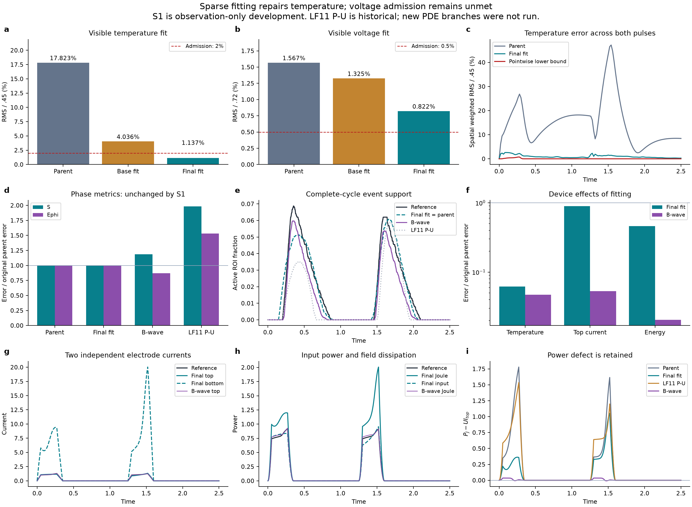
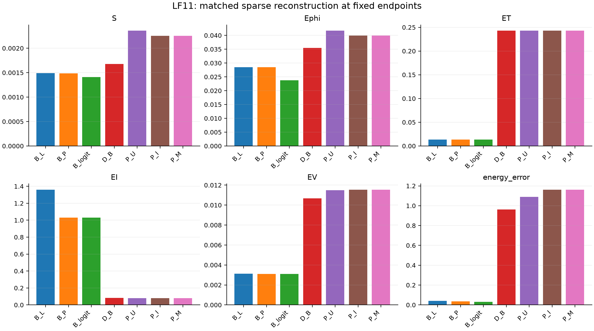
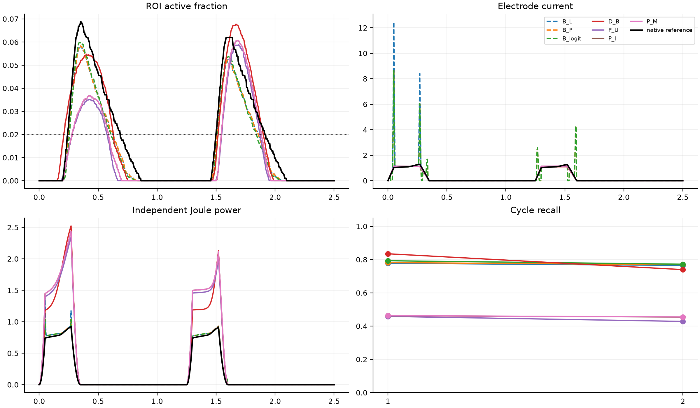
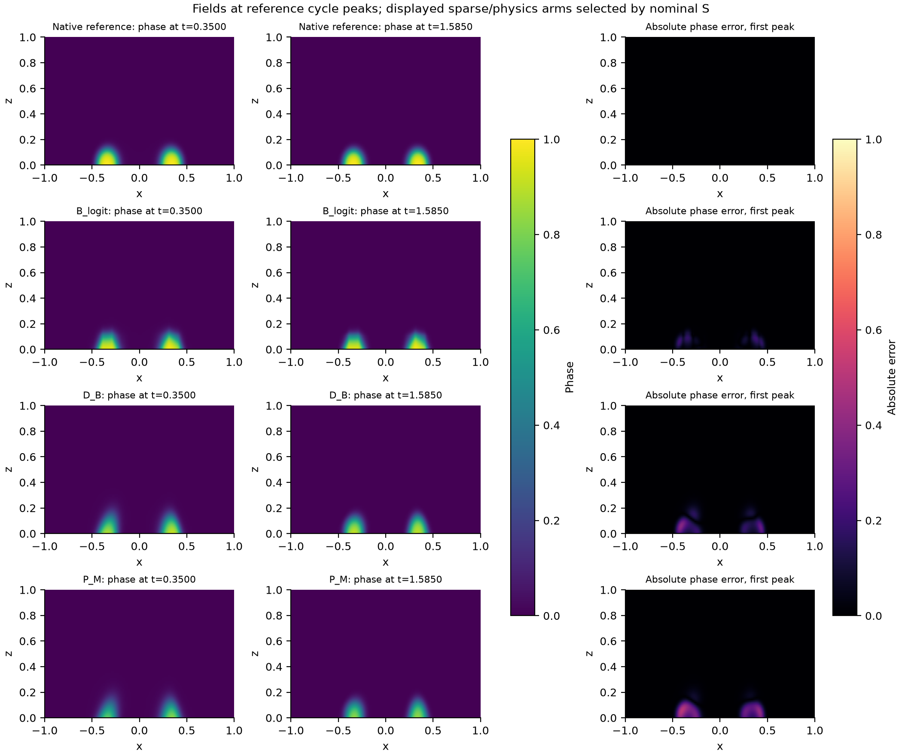
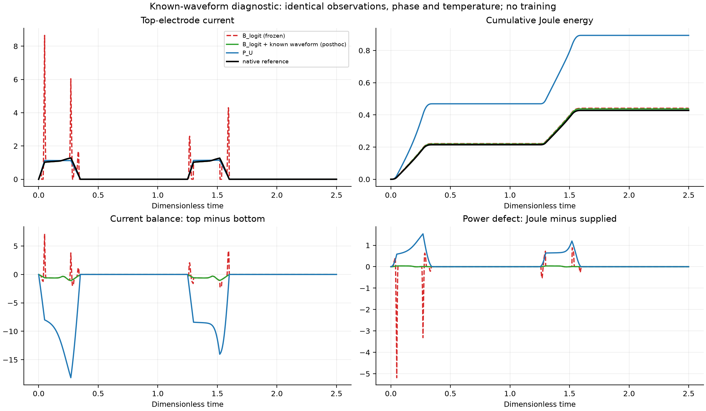
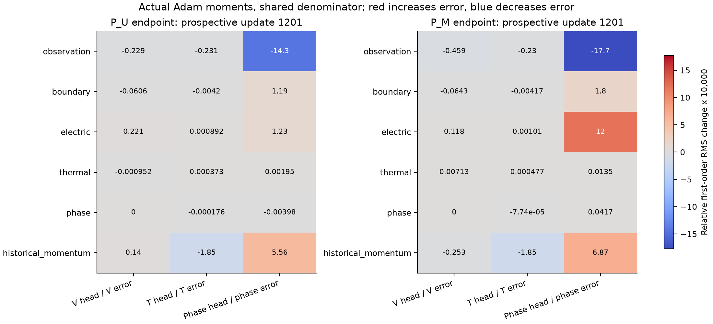
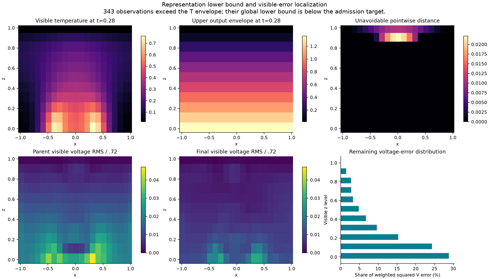

# Separating representation feasibility, sparse fitting, and physical increments in electrothermal phase-change PINNs

## Abstract

Sparse electrothermal phase-change reconstruction requires separating function representation, optimization, interior physics, and device readout. An initial matched four-arm experiment finds no declared joint phase improvement from interior PDEs, importance-corrected interface sampling, or a calibrated phase-residual measure. Uniform physics reduces an independent residual objective by 80.37% while worsening phase-set and phase RMS errors by 40.68% and 17.74%. A subsequent sparse-only development experiment tests whether the poor neural temperature fit is forced by its bounded output transform. The exact pointwise interval-distance lower bound is 0.1504% in normalized visible RMS, below the 2% fitting criterion. Within 1200 Adam updates and 400 complete weighted objective/gradient evaluations, optimization with one smooth temperature-latent adapter reduces visible temperature error from 17.82% to 1.14%, with unchanged phase predictions. On the fixed nominal reference grid, ROI temperature error decreases from 28.22% to 1.75% and Joule-energy error from 106.74% to 49.20%. However, visible voltage error remains 0.8215%, exceeding the 0.5% admission threshold, so the new interior-PDE and electrical-normalization comparisons are not run. Independent bottom-current readout exposes remaining large electrical defects despite a 7.22% top-current NRMSE. The results establish a repairable temperature-fitting gap and narrow the remaining voltage problem, without attributing an independent benefit to the adapter or claiming a superior PINN method. Evidence concerns one synthetic geometry, one initialization, and a previously inspected nominal numerical reference.

## 1. Introduction

Localized phase transitions couple electrical conduction, Joule heating, and material state. Their device consequences depend on where and when the transition occurs, not only on a spatially averaged field error. Physics-informed neural networks (PINNs) incorporate differential equations into training [@raissi2019pinn], but a small collocation loss alone does not establish accurate switching, recovery, or electrode response. This distinction is especially relevant when a bounded phase variable remains near a pure phase over most of space and time.

Several established approaches address related difficulties. Importance sampling changes the distribution used to estimate an existing residual objective [@nabian2021importance]. Residual-adaptive sampling can instead change the effective residual measure when samples retain equal loss weights [@wu2023sampling]. Phase-field PINNs have combined adaptive sampling, hard output constraints, and staggered or causal training [@chen2025pf; @chen2025sharp; @wang2024causal]. Auto-adaptive formulations explicitly motivate positive weights that emphasize selected phase-transition regions [@buck2026adaptive]. These precedents make neither interface sampling nor weighted residuals a stand-alone novelty claim.

The unresolved question considered here is narrower: under identical sparse observations, initial and boundary information, architecture, and optimization budget, does a coupled PINN benefit from (i) interior equations, (ii) a different sampling distribution for the same target, or (iii) a different phase-residual measure? A comparison between a data-only network and a network that additionally receives both boundary conditions and PDE residuals cannot isolate the interior equations. Similarly, an interface-sampling gain without inverse-density correction cannot by itself distinguish sampling efficiency from a changed objective.

We therefore construct a four-arm matched experiment. The non-PDE control retains the same observation anchors and boundary/initial losses. Two physics arms have the same expected uniform residual objective and different proposal distributions. A fourth arm uses the same proposal as the importance-sampled arm but changes only the phase-residual measure after a fixed initial calibration. Three direct interpolants provide strong same-observation baselines. Every method supplies its own fields to a common electrical flux and dissipation readout, so copied reference currents cannot conceal inaccurate electrical fields.

An archived development sequence supplies the motivation, not additional independent repetitions of the new experiment. Interface-focused supervision previously improved recall across three materialized sampling streams, while subsequent physics continuation degraded event competence. The new experiment changes the information regime and keeps observations throughout training. Consequently, differences from that historical sequence cannot be attributed solely to retaining anchors. The present evidence remains one model initialization and one nominal two-pulse case; complete-case generalization and experimental material validation are separate, unresolved questions.

The follow-up adds a second, logically separate question: is the poor fit already visible in the allowed observations caused by an unavoidable output envelope, or can bounded optimization substantially repair it? The original parent has previously seen every sparse observation. Reusing it therefore supports training/development attribution only; deleting time slices afterward would not create unseen validation. We first derive a pointwise representation lower bound, then perform bounded observation-only fitting before allowing any new interior-physics comparison.

*Figure 1. The new fixed S1 fitting endpoint, its original parent, and the same-observation waveform baseline. Upper panels use complete visible observations; lower panels use the unchanged full nominal reference grid and independent face-flux readout. The displayed LF11 P_U is historical, not a new branch. Phase predictions remain identical during S1. Temperature repair alone neither establishes a matched PINN increment nor removes electrical dissipation defects.*

## 2. Physical and numerical setting

### 2.1 Coupled wall-cell model

The domain is \(\Omega=[-1,1]\times[0,1]\), with coordinates \(x,z\) and time \(t\in[0,2.5]\). Electric potential \(V\), temperature rise \(T\), and phase fraction \(\phi\) satisfy

\[
\nabla\cdot[\sigma(T,\phi)\nabla V]=0,
\]
\[
T_t+L\phi_t-\alpha\Delta T+\gamma T-Q\sigma(T,\phi)|\nabla V|^2=0,
\]
\[
\phi_t-M(T)\{\epsilon^2\Delta\phi
-2B\phi(1-\phi)(1-2\phi)
-6D(T_c-T)\phi(1-\phi)\}=0.
\]

The constitutive functions are

\[
\sigma(T,\phi)=\exp[\beta T+\log(R)\phi^2(3-2\phi)],
\qquad
M(T)=M_c+(M_h-M_c)\operatorname{sigmoid}[(T-T_c)/w_M].
\]

The mobility multiplies the entire phase bracket. It is not replaced by a spatial flux-divergence mobility. The fixed coefficients are \(\alpha=0.1,\gamma=4,L=0.05,Q=4,\epsilon=0.04,B=1,D=6,T_c=0.45,\beta=0.25,R=8,M_c=0.5,M_h=5,w_M=0.08\). All quantities are dimensionless.

The top electrode follows a pulse of amplitude 0.72. Within each period 1.25, the pulse rises linearly through 0.05, remains high through 0.27, returns to zero at 0.35, and remains off for the rest of the period. A centered bottom heater of width 0.70 is held at zero potential; the remaining electrical boundary is insulating. Temperature is zero at the top and satisfies a Robin condition with coefficient 0.25 on the other sides. Phase has a homogeneous normal derivative. The analytic initial state has \(V=T=0\) and a phase background 0.02 with a Gaussian seed of excess 0.01 centered at \((0,0.12)\), with spatial widths 0.18 and 0.10.

The geometry is a synthetic, phase-change-memory-inspired wall cell. It maintains a two-dimensional electric–thermal–phase feedback chain but does not constitute a calibrated oxide device, a measured switching mechanism, or a thermodynamically identified material model. In particular, the phase free-energy tilt and the thermal latent coefficient have not been jointly calibrated to a material free energy. Those limitations remain relevant to any eventual oxide-device claim.

### 2.2 Reference and information roles

The archived numerical reference and solver settings are unchanged. The observation source has an 80-by-40 spatial grid and 501 saved times. The formal evaluator uses the existing 160-by-80 grid and 1001 saved times. The inherited continuous-oracle qualification did not establish a converged continuum truth. Errors in this manuscript are therefore relative to a fixed-discretization nominal numerical reference.

Before selecting field values, we fix indices \(0,4,8,\ldots\) plus the final index on each source axis. The resulting 21-by-11-by-126 coordinate set contains 29,106 positions. Its 231 initial positions are supplied analytically and reported separately; 28,875 positive-time positions provide 86,625 scalar observations of \(V,T,\phi\). This is approximately 1.80% of the positive-time source positions.

The training export contains only these sparse fields, their coordinates, and observation-derived quadrature/proposal geometry. Dense teacher statistics, event pools, derivatives, current or power traces, older neural weights, fine-grid references, and stress cases are excluded. The initialization is newly trained from the sparse observations. Nominal reference evaluation is performed only after fixed endpoints are recovered and the cloud instance is stopped. Any follow-up chosen using that evaluation is development or attribution, not a blind confirmation.

## 3. Matched methods

### 3.1 Common network and observation anchors

All neural arms in the original four-arm experiment use three independent modified-MLP field heads with width 64 and four hidden layers, for a total of 39,939 parameters. Coordinates are normalized to the physical domain, computation uses float64, and initialization uses seed 17. The existing output representation enforces the potential range and exact top-electrode potential, an analytic initial state, and \(0<\phi<1\). The temperature and phase outputs include the same startup factor \(a(t)=1-\exp(-t/0.35)\). Other boundary conditions remain explicit soft residuals.

Let \(\psi_0=\operatorname{logit}\phi_0\). Phase is represented as

\[
\phi_\vartheta=\operatorname{sigmoid}[\psi_0+8a(t)h_\vartheta(x,z,t)].
\]

The supervised quantity is the full initial-logit increment \(8a(t)h_\vartheta\). The target increment is \(\operatorname{logit}(\phi_{\mathrm{obs}})-\psi_0\), with the existing \(10^{-8}\) target clipping convention and logit span 36.84136146790473. The increment is not divided by the startup factor and is not reconstructed from a saturated predicted sigmoid.

Spatial dual volumes and trapezoidal time weights define the global observation measure. Potential and temperature squared errors use this global measure, normalized by pulse amplitude 0.72 and temperature scale 0.45. Phase-logit supervision averages the positive-time global measure and an interface-endpoint measure with equal weights. The latter distributes the volume of each visible straddling space-time cell equally to its eight vertices, merges repeated vertices, and excludes analytic initial points. No-interface input falls back to the global phase measure. The average of the three field losses defines \(L_{\mathrm{obs}}\).

### 3.2 Visible-interface proposal and target measure

Let \(\rho\) be uniform space-time density. A cell belongs to \(B\) when its visible corner phase values straddle 0.5. There are 337 such cells and 932 distinct positive-time endpoint vertices in this observation mask. This is observable support geometry, not a dense teacher interface.

Sampling uses four simultaneous time strata: \([0,0.35]\), \([0.35,1.25]\), \([1.25,1.60]\), and \([1.60,2.50]\), with masses 0.14, 0.36, 0.14, and 0.36. The proposal in each nonempty stratum is

\[
q=0.75\rho+0.25\rho(\cdot\mid B),\qquad w=\rho/q.
\]

Cells are selected by their space-time volume after intersection with the time stratum. Uniform and interface components use fixed batch quotas. An empty stratum uses uniform sampling. Importance weights are neither clipped nor self-normalized. The straddling-cell fractions of the four strata are approximately 0.01257, 0.01433, 0.01229, and 0.01344.

For an integrable loss \(f\), \(E_q[wf]=E_\rho[f]\). Fixed quotas preserve the expectation of this estimator, but do not imply independent mixture samples, a lower variance in every setting, or unbiased Adam trajectories. A finite-budget endpoint advantage must be measured.

### 3.3 Four objectives

Write \(\ell_V,\ell_T,\ell_\phi\) for squared original strong residuals divided by scales \(1,4,5\), respectively, before squaring. The three interior objectives are

\[
J_U=E_\rho[(\ell_V+\ell_T+\ell_\phi)/3],
\]
\[
J_I=E_q[w(\ell_V+\ell_T+\ell_\phi)/3],
\]
\[
J_M=E_q[(w\ell_V+w\ell_T+c_0\ell_\phi)/3].
\]

The fixed phase calibration is

\[
c_0=\frac{E_\rho[\ell_\phi(\vartheta_0)]}
{E_q[\ell_\phi(\vartheta_0)]}.
\]

A single reference-blind calibration at the common parent uses 4096 points per measure. It gives \(a_0=L_{\mathrm{obs}}(\vartheta_0)=0.0111884376\), \(b_0=[J_U+5L_{\mathrm{BC}}+L_{\mathrm{IC}}](\vartheta_0)=1.935118628\), and \(c_0=0.0640467865\). Both phase integrals are finite and identifiable. Their scaled values are 0.00264164648 and 0.0412455741.

For \(\lambda(k)=0.1\min(k/200,1)\), define

\[
C=\frac{L_{\mathrm{obs}}}{\max(a_0,10^{-12})}
+\lambda(k)\frac{5L_{\mathrm{BC}}+L_{\mathrm{IC}}}{\max(b_0,10^{-12})}.
\]

D_B minimizes \(C\). P_U, P_I, and P_M minimize \(C+\lambda(k)J_{\mathrm{arm}}/\max(b_0,10^{-12})\). Thus D_B retains the same boundary/initial information and hard representation as the PINNs while omitting interior PDE residuals. All arms share \(a_0,b_0\). P_I and P_M share proposal points, observation batches, and boundary/initial batches.

The comparisons identify three different effects: D_B to P_U tests interior physics; P_U to P_I tests sampling at the same expected target; P_I to P_M tests the phase-residual measure on the same proposal. Initial loss calibration does not calibrate all gradients, adaptive optimizer directions, or later training pressures.

### 3.4 Fixed training and conditional attribution

A sparse data-only parent is trained for 1200 Adam updates at learning rate \(10^{-3}\). Each of the four branches starts from that same endpoint with fresh Adam, runs 1200 updates at learning rate \(10^{-4}\), and retains observation anchors. Adam uses betas (0.9,0.999), epsilon \(10^{-8}\), and a global gradient-norm clip of 10. Batch sizes are 1024 observations, 512 interior points, 128 boundary points, and 128 initial points. The interior time-stratum counts are 72,184,72,184. These simultaneous strata are not causal training.

No optional short development trial was used. Formal endpoints are fixed; intermediate values do not select or rescue an arm. An invalid individual arm does not cancel other planned comparisons. The common parent was generated on CPU; all four formal branches use the same GPU environment and frozen numerical implementation. Concurrent execution changes scheduling, not branch data, objective, or update count.

The conditional budget is at most three additional 1200-update branches. A positive metric effect first calls for P_S, which uses the same proposal but multiplies its importance-corrected uniform phase objective by a fixed global scalar. At the reference-blind parent,

\[
\kappa_0=
\frac{\|\nabla_\vartheta(c_0E_q\ell_\phi)\|}
{\|\nabla_\vartheta E_q(w\ell_\phi)\|}=0.698952625.
\]

The corresponding gradient cosine is 0.906249381. This control tests a particular global-strength explanation; it cannot rule out every possible scalar schedule. A positive route also calls for a nearest residual- or phase-gradient-adaptive comparator with its original weighting semantics stated explicitly.

If no matched increment appears, one local equation-by-head diagnosis is performed before deciding whether a latent-residual fallback is scientifically motivated. For saved Adam moments \(m,v\), all loss components share the next-step total-gradient clipping coefficient and denominator. With total clipped gradient \(cg\),

\[
v^+=\beta_2v+(1-\beta_2)c^2g^2,\qquad
d_j=-\frac{\eta(1-\beta_1)c\,g_j}
{(1-\beta_1^{n+1})[\sqrt{v^+/(1-\beta_2^{n+1})}+\epsilon_A]}.
\]

The historical-momentum contribution is reported separately. Component directions are then contracted with gradients of field-error and current diagnostics. This is a local prospective direction calculation using genuine moments, not an independently applied Adam optimizer for each equation and not proof of a full training trajectory. The common parent uses fresh moments, matching the actual branch launch.

### 3.5 Direct baselines and electrical readout

B_L linearly interpolates time and space; B_P uses PCHIP in time and linear spatial interpolation; B_logit applies the corresponding interpolation to the full initial-logit increment for phase. All consume exactly the same visible field observations. Known electrode values are imposed at each query time, including pulse knots absent from the observation mask; analytic initial values, insulating side extensions, and a consistent Robin temperature extension are supplied from known physics. Potential obeys the same known voltage interval. No teacher current, power, derivative, or fine-grid field is provided.

Dense LF_ONLY retains the archived medium-field direct interpolant as a more-information reference. Its previously interpolated scalar traces are not used: current and power are recomputed from its fields. The archived native solver is a same-physics numerical reference, not a competitor trained on the sparse observations. Neither is included in same-observation win rates.

All methods use harmonic face conductances on the evaluator grid. Top and bottom currents are independent boundary-flux sums. Joule power is the sum of conductance times squared voltage drop over internal and electrode edges. The power defect \(P-U I_{\mathrm{top}}\), current-balance defect, and finite-volume electric divergence are explicitly retained. No method defines current as \(P/U\). Neural strong-form AD audits use a common fixed unlabeled integration; piecewise interpolants are not assigned a misleading second-derivative AD score that omits interpolation seams.

The frozen baseline interpolates interior potential directly in time. After its current spikes were observed, we conducted one voltage-only diagnostic, B_logit_waveform. At positive-voltage visible times it interpolates \(V/U(t)\), using per-cycle temporal PCHIP, endpoint holding outside the first/last positive observation, and the same spatial interpolation and known boundary extensions; it then multiplies by the analytic \(U(t)\) and enforces the known voltage interval. The phase and temperature fields are unchanged. This posthoc same-observation control uses no additional observations, solve, or optimizer update. It is reported separately and does not replace a frozen baseline or alter the four-arm adjudication.

### 3.6 Representation feasibility and bounded sparse fitting

The follow-up preserves the nominal equations, coefficients, boundary conditions, observation mask, and original sparse parent. The actual temperature transform is

\[
T_\vartheta=A(x,z,t)\operatorname{sigmoid}h_T,\qquad
A=2.5(1-e^{-t/0.35})(1-z).
\]

For visible targets \(y_i\), define \(d_i=\max(-y_i,0)+\max(y_i-A_i,0)\). Every admissible prediction satisfies \(|T_{\vartheta,i}-y_i|\ge d_i\). Thus, for nonnegative observation weights,

\[
\frac{\sqrt{\sum_i w_i(T_{\vartheta,i}-y_i)^2/\sum_iw_i}}{0.45}
\ge\frac{\sqrt{\sum_iw_id_i^2/\sum_iw_i}}{0.45}.
\]

This is a lower bound over the pointwise closed interval, not a finite-network realizability guarantee. A finite sigmoid may only approach an interval endpoint. The projection used to calculate the bound never replaces a target or becomes a reported model. Initial-time and top-boundary zero envelopes are handled without division. Heating means positive known voltage and positive time; off means zero voltage at positive time. Both use conditional versions of the original global observation measure.

The fitted-parent criteria are visible normalized temperature RMS at most 0.02 globally and 0.05 in each heating/off stratum; normalized visible voltage RMS at most 0.005; and no more than 5% degradation in either raw visible phase RMS or the inherited full-logit observation objective. These new fitting criteria do not retroactively invalidate LF11 and are distinct from its strict device criteria.

We first use 600 Adam updates on the independent potential/temperature observation components, followed by 80 and 120 complete fixed-objective L-BFGS evaluations for the respective heads. Phase weights remain exactly unchanged during this separable observation-only stage. If admission is not achieved, the remaining development allowance permits one smooth additive temperature-latent adapter, 600 further Adam updates, and the remainder of the cumulative 400 fixed evaluations. The actual second allocation is 40 potential and 160 temperature evaluations. Adam uses learning rate 0.001, betas (0.9,0.999), epsilon 1e-8, global-measure batches of 1024, and clipping norm 10. All fitting runs use FP64 on CPU.

Adam plus L-BFGS is an established optimization choice, not a new method claim [@rathore2024loss]. L-BFGS sees fixed complete weighted observation components, accumulated in chunks as the true sum; each head contributes its original one-third factor. No resampling, adaptive weights, or gradient clipping occurs inside a closure. Every objective/gradient call, including repeated starts and line-search trials, consumes the explicit evaluation budget. Each accepted step must satisfy the Wolfe checks. Budget exhaustion during a trial restores both parameters and optimizer state to the last accepted step; a trial is never saved as the endpoint. Actual Adam moments are not used to reinterpret an L-BFGS endpoint.

The optional adapter adds a width-32, two-layer modified MLP to the existing temperature latent, using normalized raw coordinates and axis-aligned sine/cosine features. Frequencies are x=(0.5,1,2), z=(0.5,1), t=(0.5,1,2,4). Its final layer is initialized to zero, preserving the insertion-time function exactly. The complete temperature envelope remains unchanged. This is a deterministic, low-bandwidth adaptation inspired by Fourier-feature networks [@tancik2020fourier], rather than a reproduction of their random feature selection or an original feature-encoding claim. It adds 3201 parameters to the original 39939. Additional optimization and insertion are sequential development choices, so their separate causal benefits are not identified.

Only a fully admitted parent would branch into the new matched D_B/P_U experiment. The sole later electrical-block normalization would replace both the interior residual and homogeneous insulating flux, preserve complete parameter coupling, and require the prescribed R/N/G and conditional D_N controls. Neither the withdrawn fourth-power electrode lift nor any such physical branch is executed when fitting admission fails. The strong B_logit_waveform rules are supplied in the follow-up instruction and retained unchanged; their original LF11 status remains posthoc.

## 4. Evaluation and decision rules

The primary metric \(S\) is the time-averaged full-domain fraction of the symmetric difference of phase regions at threshold 0.5. The co-primary \(E_\phi\) is raw continuous phase RMS error in the fixed ROI, \(|x|\le0.55,\ 0\le z\le0.55\). We also report ROI temperature RMS divided by 0.45, current-trace NRMSE \(E_I\), full-domain potential RMS \(E_V\), and integrated Joule-energy error.

Cycle recall, precision, and active-mass ratio retain the full-domain target measure in pulse windows W1=[0,0.35] and W3=[1.25,1.60], using the global trapezoidal time-node weights and cell volumes. Event time is the interpolated first crossing of 2% active ROI fraction in each complete cycle. The strict event/device audit retains separate absolute timing errors of at most 0.005 in each cycle, recall at least 0.90, precision at least 0.80, active-mass ratio in [0.80,1.20], recovery at least 0.70, locality, admissible outputs, and phase maximum at least 0.90. It is distinct from the period-normalized RMS timing summary and does not certify a calibrated physical device.

A matched increment requires at least 10% improvement in both \(S\) and raw \(E_\phi\), with no more than 5% degradation in \(E_T,E_I,E_V\). Predeclared near-zero absolute tolerances are \(10^{-8},10^{-6},10^{-6},10^{-6},10^{-7}\) for \(S,E_\phi,E_T,E_I,E_V\). Historical discretization floors are not confidence intervals and do not relax these rules. Numerical validity, matched effect, strict device checks, and independent confirmation are reported separately.

The evaluated nominal case was previously examined during development. The mask is a sparse reconstruction information regime on that case, not an entity-level train/test split. There is no claim of formal OOD performance, multiple independent initializations, statistical significance, solver replacement, or end-to-end computational speedup.

## 5. Results

### 5.1 Valid endpoints and absence of a matched method increment

**Evidence status: VERIFIED.** All four branches reach valid fixed 1200-update endpoints. Total training is 6000 updates: 1200 for the common parent and 4800 for the four branches; optional development and conditional training both use zero updates. Table 1 reports the fixed local evaluation. Every quantity is a dimensionless error and smaller is better. The last two rows use more information or the numerical reference itself and are excluded from same-observation comparisons.

| Method | \(S\) | Raw \(E_\phi\) | Normalized \(E_T\) | Current \(E_I\) | Raw \(E_V\) | Joule-energy error |
|---|---:|---:|---:|---:|---:|---:|
| B_L | 0.00149180 | 0.0285334 | 0.0135418 | 1.36084 | 0.00313694 | 0.0408359 |
| B_P | 0.00148727 | 0.0285034 | 0.0132783 | 1.03083 | 0.00310734 | 0.0367436 |
| B_logit | 0.00140844 | 0.0237698 | 0.0132783 | 1.03083 | 0.00310734 | 0.0313202 |
| D_B | 0.00167688 | 0.0354224 | 0.242927 | 0.0841937 | 0.0106860 | 0.963060 |
| P_U | 0.00235906 | 0.0417072 | 0.242953 | 0.0793192 | 0.0114887 | 1.08964 |
| P_I | 0.00225320 | 0.0399464 | 0.242943 | 0.0793446 | 0.0115496 | 1.16221 |
| P_M | 0.00225148 | 0.0399425 | 0.242943 | 0.0793450 | 0.0115499 | 1.16238 |
| Dense LF_ONLY (more information) | 0.000349531 | 0.00657038 | 0.00400154 | 0.00379059 | 0.000576128 | 0.00606735 |
| Native reference readout check | 0 | 0 | 0 | \(1.35\times10^{-17}\) | 0 | \(1.01\times10^{-17}\) |

*Table 1. Original frozen comparisons. Temperature RMS is normalized by 0.45. Large current errors for the raw-potential interpolants motivate the separately labeled posthoc diagnostic in Section 5.4.*

| Change | Relative change in \(S\) | Relative change in \(E_\phi\) | Quality noninferiority | Joint 10% effect |
|---|---:|---:|---|---|
| D_B → P_U: interior PDE | +40.682% | +17.743% | Fails \(E_V\): +7.512% | No |
| P_U → P_I: same-target sampling | −4.487% | −4.222% | Passes | No |
| P_I → P_M: phase target measure | −0.0763% | −0.00981% | Passes | No |

*Table 2. Signed endpoint differences; negative values improve an error. Passing noninferiority alone is not a positive method result. These are paired differences from one initialization, not confidence intervals.*

*Figure 2. Four-arm metrics and frozen same-observation direct baselines. All fields are evaluated on the same nominal reference; current is independently derived from each method's potential and conductivity. The posthoc waveform baseline is kept out of this frozen-comparison panel.*

No PINN arm establishes a joint advantage over the same-observation direct baselines. P_U modestly lowers current error relative to D_B (5.79%) while leaving normalized temperature error essentially unchanged (+0.011%) and worsening both phase measures and potential error. Thus a selective current improvement does not meet the declared reconstruction claim. P_I and P_M show small directional phase improvements over their respective controls, but neither reaches the predeclared practical effect. No claim of a statistically zero effect is made.

### 5.2 Lower residual loss does not preserve phase reconstruction

**Evidence status: VERIFIED.** A common independent 4096-point uniform AD audit yields

| Method | Scaled electric MSE | Scaled thermal MSE | Scaled phase MSE | Mean interior objective \(J\) | Boundary loss |
|---|---:|---:|---:|---:|---:|
| D_B | 1.901152 | 0.0243877 | 0.00387856 | 0.643139 | 0.0218277 |
| P_U | 0.354793 | 0.0205626 | 0.00329709 | 0.126218 | 0.0232080 |

*Table 3. Common reference-free integration; the quantities are evaluated using identical original residual definitions and scales.*

P_U reduces this interior objective by 80.37% relative to D_B, while phase-set error and phase RMS increase by 40.68% and 17.74%. The fixed observation loss also rises from 0.00811832 to 0.00818318. Continued sparse anchors therefore do not suffice to obtain a joint field/event gain under this implementation and budget. This experiment does not isolate the causal effect of retaining anchors relative to the archived dense continuation: the task, parent, and observation regime also changed.

**SUPPORTED_INTERPRETATION:** residual minimization is improving the measured equations without establishing the desired reconstruction. The electric component accounts for most of the reduction in the scaled audit. Neither this component dominance nor the objective decrease establishes the cause of the full trajectory's phase degradation. Section 5.5 adds a more specific, local direction test.

### 5.3 Two-cycle events and device response

**Evidence status: VERIFIED.** All four neural arms fail the strict event/device audit. Their failure is distinct from numerical validity and from the magnitude of a matched algorithm effect.

| Method | Recall C1 / C2 | Precision C1 / C2 | Active-mass ratio C1 / C2 | Absolute timing error C1 / C2 |
|---|---|---|---|---|
| B_logit | 0.7929 / 0.7722 | 0.9879 / 0.9934 | 0.8026 / 0.7773 | 0.01527 / 0.01497 |
| D_B | 0.8348 / 0.7397 | 0.8024 / 0.9882 | 1.0404 / 0.7485 | 0.03188 / 0.01832 |
| P_U | 0.4583 / 0.4282 | 0.9907 / 1.0000 | 0.4626 / 0.4282 | 0.03800 / 0.04928 |
| P_I | 0.4621 / 0.4546 | 1.0000 / 1.0000 | 0.4621 / 0.4546 | 0.03833 / 0.04512 |
| P_M | 0.4628 / 0.4551 | 1.0000 / 1.0000 | 0.4628 / 0.4551 | 0.03833 / 0.04512 |

*Table 4. Pulse-window support metrics and complete-cycle timing. Reference first-event times are 0.2406 and 1.4984. The timing limit is 0.005 separately in each cycle.*

Recovery is complete for these displayed methods, but it does not repair missing active support or delayed switching. P_U's global phase maximum is 0.88394, below the 0.90 criterion. Dense LF_ONLY passes the nominal strict audit with recalls 0.98535/0.99378 and timing errors 0.00250/0.00295; this is a more-information comparator, not evidence that the sparse task is solved.

*Figure 3. Double-pulse event support, electrode current, and Joule power from the completed fixed endpoints. High precision with low recall indicates under-represented transition support. A visually plausible top-current trace is insufficient to establish correct dissipation or current conservation.*

*Figure 4. Phase snapshots at the reference cycle peaks and first-peak absolute errors. B_logit and P_M are displayed because they have the smallest nominal \(S\) within the sparse-direct and physics groups; this visualization choice is disclosed and does not select a new training endpoint.*

The independently recomputed native electrode-current NRMSE is \(1.35\times10^{-17}\), and its finite-volume electric-divergence RMS is approximately \(9.50\times10^{-13}\). The common readout therefore reproduces the native discretization. By contrast, P_U has electric-divergence RMS 50.0849, top-minus-bottom current RMS 5.3071, and supplied-versus-Joule power-defect RMS 0.40074. Its current NRMSE of 7.93% coexists with a 108.96% integrated Joule-energy error. These are distinct diagnostics, not interchangeable definitions of device accuracy; no current is reconstructed from power.

### 5.4 A known-waveform control removes an apparent current advantage

**Evidence status: VERIFIED; design status: POSTHOC_SAME_OBSERVATION_BASELINE_DIAGNOSTIC.** The frozen B_logit current error concentrates around pulse knots that are known analytically but are absent from parts of the sparse time mask. A neighborhood of half-width 0.02 around those knots contains 92.984% of its current squared-error integral. The voltage-only factorization described in Section 3.5 preserves visible potential values to a maximum absolute error of \(5.55\times10^{-17}\).

| Quantity | Frozen B_logit | Posthoc B_logit_waveform |
|---|---:|---:|
| Current NRMSE | 1.030831 (103.083%) | 0.00427827 (0.427827%) |
| Potential RMS | 0.00310734 | 0.000902847 |
| Joule-energy error | 0.0313202 | 0.0218741 |
| Current-balance RMS | 0.596580 | 0.317331 |
| Power-defect RMS | 0.302385 | 0.0116813 |
| \(S,\ E_\phi,\ E_T\) and cycle phase metrics | Original values | Identical |

*Table 5. Same observations and unchanged phase/temperature fields; no training and no PDE solve. This diagnostic is not an independent confirmation and does not supersede Tables 1–2.*

*Figure 5. Factoring the already-known voltage envelope removes the large top-current spikes of direct temporal potential interpolation. The lower panels retain current and power defects rather than imposing electrical consistency by definition.*

**SUPPORTED_INTERPRETATION:** the apparently superior neural current error against raw temporal interpolation cannot be attributed to interior physics, because a non-PDE use of the same known waveform removes that advantage. This is a bounded representation control, not a novel PINN module or a claim that the corrected interpolant satisfies the full PDE. Its remaining current-balance defect and unchanged phase/timing errors prevent a complete device-accuracy claim.

### 5.5 Conditional diagnosis points away from the latent fallback

**Evidence status: VERIFIED for the recorded directional calculations; SUPPORTED_INTERPRETATION for the next-route decision.** Since none of the three matched increments passes, the authorized negative branch performs one equation-by-head diagnosis at the common parent and four endpoints. The endpoint calculations use saved Adam moments and the regenerated next stochastic batch. All components share one next-step denominator. Their summed direction reconstructs the full prospective update to a maximum absolute component discrepancy of \(1.53\times10^{-18}\) at the parent and \(2.71\times10^{-20}\) at the endpoints. These are zero-update calculations; optimizer step 1201 is not applied.

| Source contribution to \(E_\phi^2\) | P_U endpoint | P_M endpoint |
|---|---:|---:|
| Observation | \(-6.2353\times10^{-6}\) | \(-7.1968\times10^{-6}\) |
| Boundary | \(+5.1912\times10^{-7}\) | \(+7.3219\times10^{-7}\) |
| Electric equation | \(+5.3444\times10^{-7}\) | \(+4.8811\times10^{-6}\) |
| Thermal equation | \(+8.4970\times10^{-10}\) | \(+5.4822\times10^{-9}\) |
| Phase equation | \(-1.7331\times10^{-9}\) | \(+1.6923\times10^{-8}\) |
| Historical momentum | \(+2.4180\times10^{-6}\) | \(+2.7860\times10^{-6}\) |

*Table 6. Local first-order squared-error effects on the fixed diagnostic probes. Positive values point toward larger error. Historical momentum is separate; finite updates and full trajectories need not follow these linear predictions.*

The phase equation contributes 0%, 0.4803%, and 0.3003% of the positive physical and boundary contributions to phase squared error at P_U, P_I, and P_M, respectively. Its temperature-error directional contribution is negative at all three endpoints. In contrast, electric and boundary contributions increase local phase error. Thus the available direction evidence does not identify phase weighting or phase-residual-to-temperature damage as the primary local bottleneck.

*Figure 6. Prospective Adam directions at P_U and P_M with actual optimizer states. Each column shows the associated head's own-field RMS effect; the complete cross-head, field, and current diagnostics are retained in the machine-readable artifact. Values are relative first-order RMS changes multiplied by 10,000, distinct from the squared-error effects in Table 6.*

The latent-residual fallback is therefore not triggered. P_S and RAD/PF-GAR are also not run because the positive-increment prerequisite is absent. Their statuses are “not run because the condition was not met,” not failed methods. The reference-blind gradient norm calibration remains a useful warning: equal initial phase losses gave a metric-to-uniform gradient norm ratio 0.69895 and cosine 0.90625, so initial scalar loss matching did not make their optimization directions equivalent.

### 5.6 A small envelope floor and a large, repairable fitting gap

**Evidence status: VERIFIED.** Of 29,106 visible positions, 343 lie outside the temperature envelope; all occur in heating strata. The largest excess is 0.0221523 at (x,z,t)=(0.0125,0.9125,0.28). The global normalized RMS lower bound is 0.0015038294; its heating counterpart is 0.0028834613 and its off counterpart is zero. The independently written analytic envelope agrees with the actual model expression to 4.44e-16. These values cannot explain the original visible temperature error of 0.178232659: the output interval does not preclude the declared 0.02 admission target, although exact fitting of every observation is impossible.

| Metric | Original parent | Base optimization | Final fit | Admission |
|---|---|---|---|---|
| T RMS / .45 (all) | 0.178232659 | 0.040357134 | 0.011374919 | <=0.02; PASS |
| T RMS / .45 (heating) | 0.259754951 | 0.063799821 | 0.018357409 | <=0.05; PASS |
| T RMS / .45 (off) | 0.136117861 | 0.026839631 | 0.007218596 | <=0.05; PASS |
| V RMS / .72 | 0.015670471 | 0.013247177 | 0.008215100 | <=0.005; FAIL |
| Visible phase RMS | 0.015015394 | 0.015015394 | 0.015015394 | <=1.05 x parent; PASS |
| Full phase-logit objective | 0.000331037651 | 0.000331037651 | 0.000331037651 | <=1.05 x parent; PASS |

*Table 7. Complete weighted visible errors. The intermediate base fit uses the original structure; the final endpoint includes the one permitted temperature adapter and further optimization. These are exposed training/development observations, not a holdout.*

The final visible temperature error decreases by 93.62%, and visible voltage error by 47.58%, relative to the original sparse parent. All three temperature requirements and both phase-preservation requirements pass. Voltage remains at 0.0082151003 versus 0.005, the only failed fitting requirement. The final full visible metrics are exactly repeatable. The run uses precisely 1200 Adam updates and 400 full weighted objective/gradient evaluations. Its four L-BFGS stages accept 38, 59, 19, and 78 steps; two budget-truncated line searches are rolled back to their last accepted states. There is no additional training after nominal reference evaluation.

*Figure 7. A pointwise temperature-envelope bound and spatial localization of visible voltage errors. Voltage heatmaps use the same full color scale. The two lowest visible z levels contain 53.17% of final weighted voltage squared error and 16.25% of the observation measure. This localization is posthoc analysis of visible data, not an extra training mask or proof of a unique boundary mechanism.*

**SUPPORTED_INTERPRETATION:** a substantial part of the former temperature deficit was repairable without changing the physical object, adding observations, or applying interior PDEs. This excludes the unchanged envelope as a sufficient explanation for the large former error. It does not distinguish the effects of more optimization and the adapter, prove global optimization, or establish the cause of the remaining voltage deficit. The largest residual visible voltage error is 0.0727930 at (-0.3875,0.1125,1.52), near the heater region.

### 5.7 Temperature repair does not complete phase or device reconstruction

**Evidence status: VERIFIED.** The fixed S1 endpoint is evaluated once on the same 160-by-80-by-1001 nominal reference grid after the training process exits. Original LF11 endpoints and direct baselines are reused as labeled historical evidence; their reference axes and native current/power traces are checked for equality. Additional power and bottom-current summaries are calculated from the already saved field-based readouts, not copied into any prediction.

| Endpoint / baseline | S | Raw Ephi | ET / .45 | Raw EV | Current NRMSE | Energy error |
|---|---|---|---|---|---|---|
| Original parent | 0.00118867188 | 0.0272683756 | 0.282209756 | 0.0108758045 | 0.0803879379 | 1.0674025 |
| S1 fixed fit (new) | 0.00118867188 | 0.0272683756 | 0.0174753865 | 0.00573809107 | 0.0721778855 | 0.492005538 |
| B_logit_waveform | 0.0014084375 | 0.0237697822 | 0.0132782551 | 0.00090284673 | 0.00427827279 | 0.0218740659 |
| LF11 D_B (historical) | 0.001676875 | 0.0354223722 | 0.242927206 | 0.0106859834 | 0.0841937165 | 0.963059598 |
| LF11 P_U (historical) | 0.0023590625 | 0.0417072355 | 0.242952919 | 0.0114887036 | 0.0793192237 | 1.0896397 |
| Dense LF_ONLY (more information) | 0.00034953125 | 0.00657037589 | 0.00400154406 | 0.000576128163 | 0.00379059052 | 0.00606734935 |

*Table 8. The fixed S1 endpoint and strong references. The two LF11 physical-comparison rows are historical; they are not the unexecuted new D_B/P_U branches. Temperature is normalized by 0.45; potential RMS remains raw, whereas visible voltage admission uses division by 0.72.*

ROI temperature error decreases from 28.22% to 1.75%; Joule-energy error decreases from 106.74% to 49.20%. Top-current NRMSE decreases from 8.04% to 7.22%, while power-trace NRMSE remains 57.61%. The unchanged phase head gives the same S and raw phase RMS as the original parent, with recalls 0.80475/0.82184 and absolute timing errors 0.03788/0.00215. Strict device accuracy is not achieved. The waveform baseline remains substantially better in voltage, current, energy, and raw phase error, although its S is larger than the parent's. A single favorable phase-set metric therefore does not establish a joint advantage.

| Endpoint / baseline | Power NRMSE | Bottom-current NRMSE | Current-balance RMS | Power-defect RMS |
|---|---|---|---|---|
| Original parent | 1.17516388 | 12.0628317 | 6.28104561 | 0.433225347 |
| S1 fixed fit (new) | 0.57613412 | 7.81253503 | 4.05840998 | 0.209356743 |
| B_logit_waveform | 0.0282995629 | 0.607873458 | 0.317330585 | 0.0116813379 |
| LF11 D_B (historical) | 1.05114064 | 10.6217866 | 5.53959913 | 0.393172543 |
| LF11 P_U (historical) | 1.10268996 | 10.2026895 | 5.30706218 | 0.400740762 |
| Dense LF_ONLY (more information) | 0.00651093782 | 0.250140939 | 0.129428486 | 0.00232655933 |

*Table 9. Independent device diagnostics. Power-trace NRMSE is normalized by native Joule-power RMS; bottom-current NRMSE uses native terminal-current RMS. Values are ratios, not percentages. Near-zero denominators instead require absolute RMS. Current/power defects are kept as absolute quantities.*

A particularly strong counterexample remains: the final top-current NRMSE is 0.07218, but bottom-current NRMSE is 7.81254 and current-balance RMS is 4.05841. Even B_logit_waveform has bottom-current NRMSE 0.60787 despite top-current NRMSE 0.00428. These values show why a single terminal trace cannot certify electrical consistency. In the discrete face network, with node current defect d, sum(d)=I_bottom-I_top and P_J-U I_top=V^T d. The reported defects are related consistency diagnostics, not independent discoveries or continuum-convergence evidence.

**Execution disposition:** the new D_B/P_U and R/N/G/D_N branches are NOT_RUN_S1_VOLTAGE_FIT_ADMISSION_NOT_MET. No electrical-normalization effect, new physics increment, or boundary-subterm causal attribution is estimated. These unrun methods are neither failed numerical runs nor evidence against their potential value.

## 6. Discussion

### 6.1 Relation to the archived interface and forgetting evidence

The preceding LF10 closeout reported positive interface-exposure recall increments 0.08984, 0.04628, and 0.02524 for three sampling streams, with quality preserved in two streams. Physics continuation degraded events in all three streams; its original objective ratios were 0.01281, 0.00512, and 0.71669, and no field-event Pareto endpoint was obtained. Those streams vary sampling rather than model initialization.

These observations motivate investigating where residual gradients act in a coupled system, but do not establish the mechanism of any new sparse-task result. In particular, freezing phase parameters in the archived experiments did not remove phase-residual gradients to the temperature head through \(M(T)\) and the thermal drive. The new equation-by-head diagnosis distinguishes that pathway from electric, thermal, and boundary contributions locally; it does not find a destructive phase-to-temperature contribution at the inspected endpoints. The archived interface effect remains a positive supervised-information result. The new four-arm comparison establishes no additional positive PINN method effect and does not convert the older negative continuation into a success.

### 6.2 Scope of residual-metric interpretations

For a complete finite latent variable \(\psi\) with \(\phi=\operatorname{sigmoid}\psi\), chain differentiation gives \(r_\phi=\phi(1-\phi)r_\psi\). This identity motivates a possible relative-kinetics metric but does not establish favorable conditioning or a training advantage. If tested, the latent residual must contain the analytic initial logit and startup factor and be evaluated analytically, without dividing by a nearly zero \(\phi(1-\phi)\). It remains a conditional mechanism rather than an automatically added contribution.

Similarly, the externally driven phase potential need not decrease monotonically: its time derivative includes the thermal-driving term as well as dissipation and, for an approximate solution, a residual-work term. We therefore add no autonomous energy-decay constraint. Instantaneous electrical state sensitivity also does not by itself provide a dual-weighted-residual estimator for the complete coupled evolution.

### 6.3 Limitations

The result is bounded by a single synthetic geometry, fixed nominal protocol, one initialization, one coordinate mask, and the declared optimization budget. The available reference has fixed-discretization status. Sparse interpolation may remain more effective than coordinate-network training in this known-physics regime. A positive PDE effect would show reconstruction value under matched information, not necessity relative to solving the known PDE directly. A positive new module would additionally need a strong adaptive PINN comparator, repeated initializations, observation-density or mask robustness, and a genuinely held-out complete case.

### 6.4 What has been ruled out, and what remains

The follow-up rules out the temperature output interval as an explanation sufficient to account for the former large visible temperature error, and demonstrates a substantial bounded fitting repair. It does not rule out an optimization or finite-capacity voltage limitation, identify a conductivity-amplitude shortcut, or test electrical-block normalization. The failed voltage prerequisite prevents a new fair PDE comparison on the intended fitted parent. In the earlier local diagnostic, the boundary quantity aggregates several distinct conditions; a heater Dirichlet residual has no direct phase-head gradient under independent heads. Electric/boundary local harmful components also do not imply a harmful total update or a historical cause. These limitations prevent replacing the missing matched experiment with a gradient-based narrative.

The next proposed action is a voltage-head-only bounded fitting study from the retained final S1 state, preserving the now-admitted temperature and phase functions and the original sparse information. It should first use the unchanged full weighted observation objective and an explicit evaluation cap. Reaching voltage admission would permit the already specified matched physics question to become meaningful; changing a boundary representation or normalizing an electrical block requires its own evidence and authorization. Independent initializations, a second observation rule, and a complete new case remain a subsequent confirmation design, not completed evidence.

## 7. Conclusion

The original matched sparse experiment does not establish independent gains from interior physics, importance-corrected interface sampling, or the calibrated phase measure. The follow-up makes a different, positive but limited advance: it quantitatively separates an output-interval lower bound from a repairable visible temperature-fitting deficit. Bounded sparse-only fitting repairs temperature on both observed coordinates and the fixed nominal reference grid while leaving phase unchanged. Voltage admission and device consistency remain unresolved, and the waveform-aware direct baseline remains strong. Because voltage fitting fails its declared prerequisite, the new PDE and electrical-normalization comparisons are not run. The resulting contribution is an evidence-supported refinement of the research mechanism and a reusable improved fitting state, not a new superior PINN solver or an independently confirmed material-device prediction.

## Data and code availability

The repository is https://github.com/ghy001122/PINN-PCM-SCI. The inherited LF11 release is 6412dbf3c766207dfb5f586a94bac8eaa0f247d5; this follow-up is distributed with paper_v25 and identified by its containing Git commit. The [reproduction guide](reproducibility.md), [selected evidence](evidence/README.md), and [claim matrix](claim_evidence_matrix.md) identify the new fixed fitting state, actual per-stage optimizer states, budgets, telemetry, and saved evaluation. The old paper_v24 is preserved. The original sparse observations and historical evidence are reused from its evidence directory. Full prediction carriers and the named nominal reference remain local. No new observations, stress references, or experimental material data were used.
