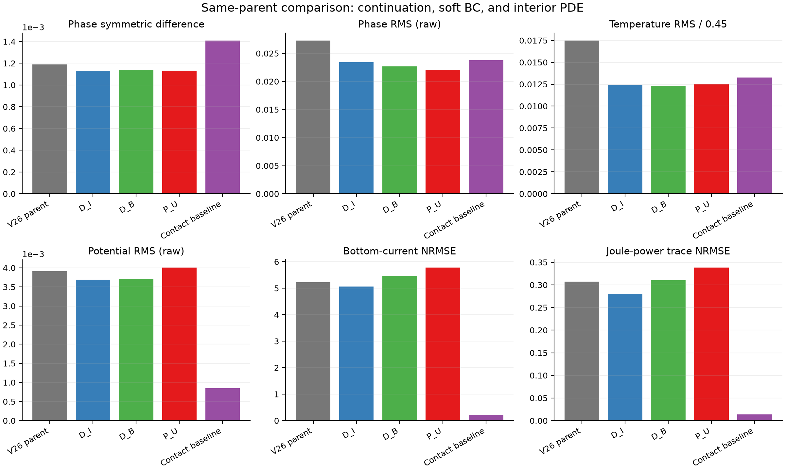
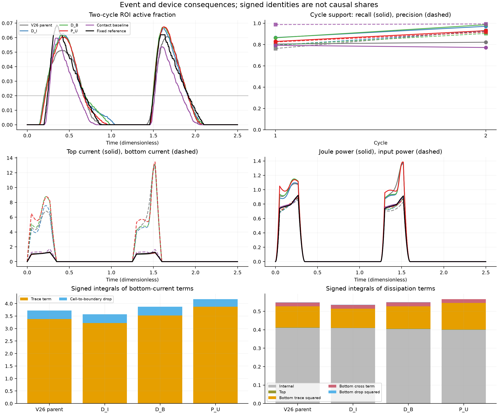
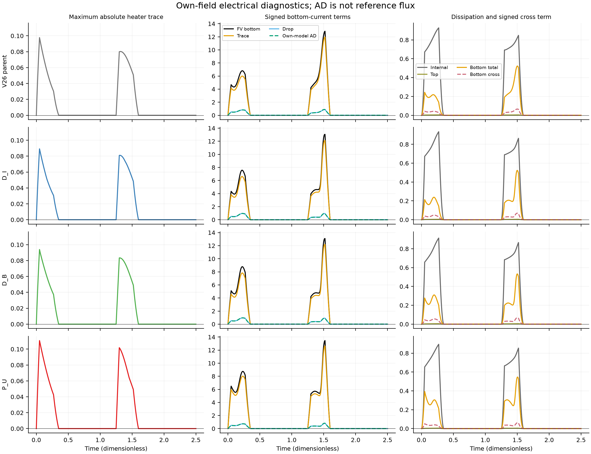
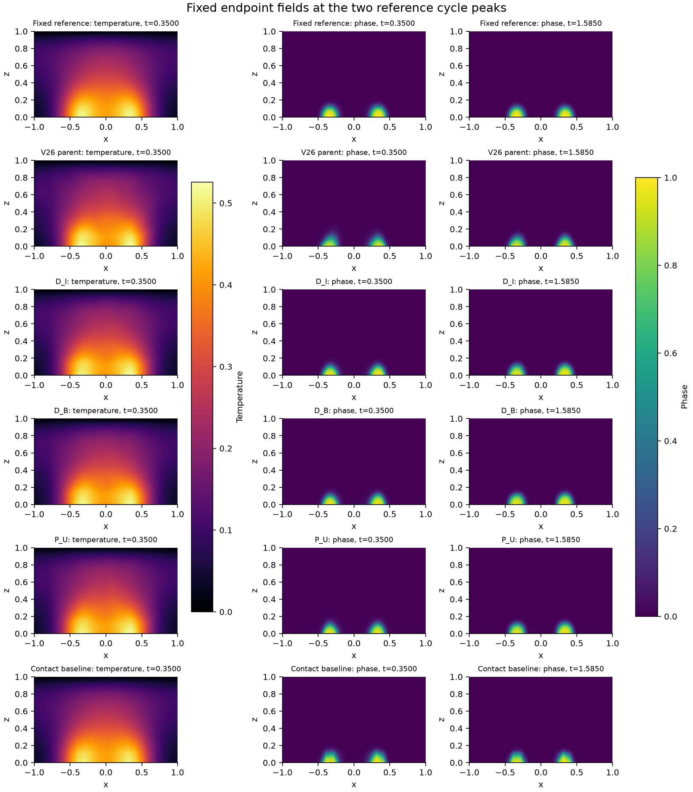
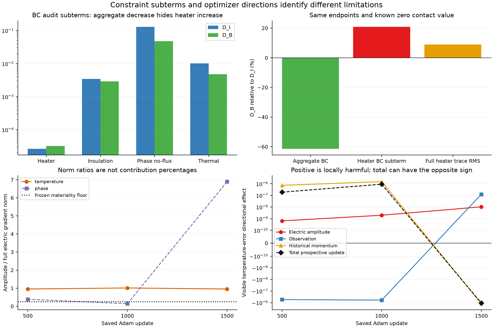
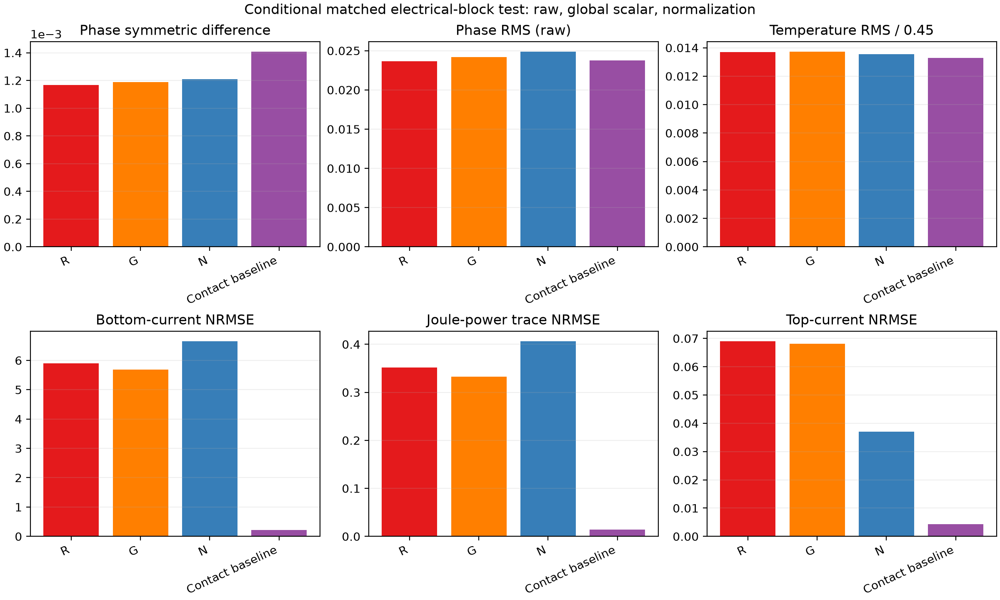

# Identifying boundary and interior-physics effects in sparse electrothermal phase-change reconstruction

## Abstract

Sparse reconstruction of a coupled phase-change device requires accurate fields, localized events, and consistent terminal response. We examine which of these quantities improve when physical constraints are added to the same fitted neural state in a synthetic two-dimensional electrothermal phase-field cell. Three nested objectives isolate continued observation/initial fitting, soft boundary conditions, and interior PDEs. A conditional, fully differentiable conductivity-normalization experiment adds raw and global-scalar controls. All six fixed endpoints are valid; the experiment uses 6500 new Adam updates and 1500 complete fixed L-BFGS evaluations, without additional field labels. Adding soft boundaries reduces the aggregate boundary objective by 61.44%, while increasing the heater subterm by 20.92%. Adding interior PDEs reduces the independent AD physics objective by 55.75% and raw phase error by 2.81%, but increases bottom-current and power-trajectory errors by 5.87% and 9.14%. A consistent adverse conductivity-amplitude component is detected at three prescribed Adam states. Nevertheless, normalization improves top-current error by 46.41% relative to its matched raw control while increasing bottom-current error by 12.75%, power error by 15.64%, and raw phase error by 5.20%. Neither the main nor conditional contrasts attains the prespecified reconstruction or limited-function increment. Exact contact decompositions and discrete balance identities connect these discrepancies to distinct constraints on the same fields. The findings establish bounded constraint tradeoffs and rule out the tested normalization as a sufficient remedy. They motivate a comparison that directly enforces the electrical subproblem while retaining thermal/phase residuals, rather than infer device accuracy from a smaller aggregate loss. Independent initialization, full-case confirmation, and material calibration remain unestablished.

## 1. Introduction

Localized phase transitions connect electrical conduction, Joule heating, and material state. An approximation can reproduce much of a field while misplacing a small phase region or producing an inaccurate electrode flux. Physics-informed neural networks (PINNs) incorporate differential equations into training [@raissi2019pinn], but reducing a residual objective alone does not demonstrate improvement in switching, recovery, or terminal response. The useful scientific question is which physical constraints improve which quantities under matched information and optimization.

Existing approaches address several parts of this problem. Importance sampling changes the distribution used to estimate a prescribed objective [@nabian2021importance]. Residual-adaptive sampling can change the effective residual measure if inverse-density correction is omitted [@wu2023sampling]. Phase-field approaches combine adaptive sampling, output constraints, and staggered or causal training [@chen2025pf; @chen2025sharp; @wang2024causal]. Auto-adaptive formulations explicitly motivate positive weights emphasizing selected phase-transition regions [@buck2026adaptive]. These precedents prevent treating sampling, weighting, hard constraints, or an optimizer sequence as novel merely because they are applied to the present system.

Our earlier evidence identified three distinct issues. Interface-focused supervision improved event recall in three sampling streams, with quality retained in two. A subsequent sparse four-arm experiment did not establish the declared joint increment from internal physics, importance-corrected sampling, or a calibrated phase-residual measure. Finally, observation-driven fitting and a voltage-only intervention exposed substantial fitting and contact-readout errors. These are bounded results on one synthetic nominal problem, not independent replications or a general failure theorem for PINNs.

The present experiment asks a more direct question: from the same specified fitted state, what changes when soft boundary conditions are added, and what changes when the interior PDEs are added afterward? We compare continued observation/initial fitting, the same objective with soft boundary residuals, and the same objective with the coupled interior equations. This three-arm design isolates the boundary package from the interior equations without requiring accurate terminal flux as an admission condition. The earlier voltage-fit gate remains historically unmet; the present study uses a separately prespecified continuation protocol, without retrospectively changing that gate.

The analysis follows an explicit evidence chain: a matched constraint intervention must produce a measurable field or function increment; its event and device costs must be reported; and any mechanistic explanation must distinguish local gradient algebra from whole-trajectory causation. A waveform- and contact-aware interpolant supplies a strong same-observation comparator. No additional labels, dense teacher statistics, or reference device traces enter neural training.

## 2. Physical problem and evidence roles

### 2.1 Two-dimensional coupled wall cell

The domain is \(\Omega=[-1,1]\times[0,1]\), with coordinates \((x,z)\) and time \(t\in[0,2.5]\). Potential \(V\), temperature rise \(T\), and phase fraction \(\phi\) satisfy

\[
\nabla\cdot[\sigma(T,\phi)\nabla V]=0,
\]
\[
T_t+L\phi_t-\alpha\Delta T+\gamma T-Q\sigma(T,\phi)|\nabla V|^2=0,
\]
\[
\phi_t-M(T)\{\epsilon^2\Delta\phi
-2B\phi(1-\phi)(1-2\phi)
-6D(T_c-T)\phi(1-\phi)\}=0.
\]

The constitutive functions are

\[
\sigma(T,\phi)=\exp[\beta T+\log(R)\phi^2(3-2\phi)],
\qquad M(T)=M_c+(M_h-M_c)\operatorname{sigmoid}[(T-T_c)/w_M].
\]

The fixed coefficients are \(\alpha=0.1,\gamma=4,L=0.05,Q=4,\epsilon=0.04,B=1,D=6,T_c=0.45,\beta=0.25,R=8,M_c=0.5,M_h=5,w_M=0.08\). Mobility multiplies the phase bracket; it is not changed to a spatial mobility-flux divergence. All quantities are dimensionless.

The top electrode follows a pulse of amplitude 0.72. In each period 1.25 it rises linearly through 0.05, stays high through 0.27, returns to zero at 0.35, and remains off for the rest of the period. A centered bottom heater of width 0.70 has zero potential; the rest of the electrical boundary is insulating. Temperature is zero at the top and has a Robin condition with coefficient 0.25 on the other sides. Phase has zero normal derivative. Initially \(V=T=0\), and phase is a 0.02 background plus a Gaussian seed of excess 0.01 centered at \((0,0.12)\), with widths 0.18 and 0.10.

This is a synthetic, phase-change-memory-inspired wall cell. It preserves the electric–thermal–phase feedback chain in two dimensions. It is not a calibrated oxide device, measured switching mechanism, or experimentally identified free-energy model. The phase free-energy tilt and thermal latent coefficient have not been jointly calibrated to a material free energy. Device-oriented interpretation is therefore limited to this numerical model.

### 2.2 Observations, reference, and historical development

The observation source has an 80-by-40 grid and 501 saved times. Selecting indices \(0,4,8,\ldots\) plus the last index on each axis yields 29,106 coordinate positions. The 231 initial positions are supplied analytically and counted separately; 28,875 positive-time positions provide 86,625 scalar field observations. Selection was fixed before inspecting field values. The mask and all observation values remain unchanged.

The nominal reference has a 160-by-80 grid and 1001 saved times. Earlier qualification did not establish continuum convergence, so the reported errors are relative to that fixed numerical discretization. The reference has been inspected during previous development; it is not an independent blind test. No new mask, model initialization, geometry, or complete protocol is executed here. Stress data remain unread.

The common parent is the final voltage-continuation model in the preserved paper_v26 release, inherited from commit `4c16ba2ece84d4dd0c561f22ff91fe5b4932cfc6`. It already used every sparse observation. These observations therefore retain training/development status; removing slices afterward cannot create unseen validation. The present training receives only the sparse bundle, coordinates, and known physical coefficients. Full reference fields and device traces are used only in fixed-endpoint evaluation after training stops.

## 3. Methods

### 3.1 Shared field representation and observation objective

All arms use the same three independent modified-MLP heads, each with width 64 and four hidden layers, and the existing smooth temperature adapter. The retained low-bandwidth feature use belongs to the established Fourier-feature family [@tancik2020fourier]. The original heads have 39,939 parameters and the retained adapter adds 3,201, giving 43,140 jointly trainable parameters. All weights start from the exact same parent. There is no new network structure or voltage-only optimization history. Computation uses FP64.

The inherited output representation maintains the potential range and exact top-electrode potential, analytic initial state, and bounded phase. The actual potential branch is the overflow-safe implementation of

\[
V=U(t)\frac{e^{h_V}}{e^{h_V}+1-z}.
\]

The known waveform sets potential to zero during the off intervals. Temperature and phase satisfy

\[
T=2.5(1-e^{-t/0.35})(1-z)\operatorname{sigmoid}(h_T),
\qquad
\phi=\operatorname{sigmoid}[\psi_0+8(1-e^{-t/0.35})h_\phi],
\]

where \(\psi_0=\operatorname{logit}\phi_0\). The temperature adapter changes the latent temperature function while preserving this output envelope. It is part of the common fitted representation, not a newly isolated contribution.

Spatial dual volumes and trapezoidal time weights define the global observation measure. Potential and temperature squared errors use scales 0.72 and 0.45. Phase supervision uses the complete initial-logit increment \(8(1-e^{-t/0.35})h_\phi\), with target \(\operatorname{logit}\phi_{\rm obs}-\psi_0\), target clipping \(10^{-8}\), and span 36.84136146790473. No quantity is divided by the startup factor. The phase measure averages the positive-time global measure and the merged visible straddling-cell endpoint measure with equal weights; a missing endpoint set falls back to the global measure. Repeated vertices receive their correctly accumulated mass. Averaging the three field objectives gives \(L_{\rm obs}\).

### 3.2 Nested objectives and shared calibration

Let \(\theta_*\) denote the common parent. Before any update, we evaluate

\[
a_*=L_{\rm obs}(\theta_*),\qquad
b_*=[J_U+5L_{\rm BC}+L_{\rm IC}](\theta_*).
\]

The first quantity uses all observations with the exact measure; the second uses one fixed unlabeled calibration pool. Both are frozen for every arm and optimizer stage. A numerical floor of \(10^{-12}\) is retained. There is no per-head or per-arm recalibration. This protocol replaces the earlier suggestion to reuse historical calibration constants for future work, while preserving all old configurations and results.

With \(\lambda_k=0.1\min(k/200,1)\), define

\[
C_I=\frac{L_{\rm obs}}{\max(a_*,10^{-12})}
+\frac{\lambda_k L_{\rm IC}}{\max(b_*,10^{-12})},
\]
\[
\mathcal L_{D_I}=C_I,\quad
\mathcal L_{D_B}=C_I+\frac{5\lambda_kL_{\rm BC}}{\max(b_*,10^{-12})},\quad
\mathcal L_{P_U}=\mathcal L_{D_B}+\frac{\lambda_kJ_U}{\max(b_*,10^{-12})}.
\]

Here \(J_U=E_\rho[(\ell_V+\ell_T+\ell_\phi)/3]\) retains the uniform space-time target and the original electric, thermal, and phase residual scales 1, 4, and 5. Four time windows \([0,0.35],[0.35,1.25],[1.25,1.6],[1.6,2.5]\) have masses 0.14, 0.36, 0.14, and 0.36. Stratification changes estimator construction, not these masses. The original 13-term per-window boundary average is preserved, including hard-zero terms; removing them would change the weights of remaining residuals. The IC scale and boundary subterm scales are unchanged.

The contrast \(D_B-D_I\) changes only the soft boundary package. The contrast \(P_U-D_B\) changes only the coupled interior PDE objective. Parent-to-arm differences also include continued fitting and phase unfreezing and cannot identify a pure boundary effect. \(D_I\) and \(D_B\) are controls without interior PDEs, not full coupled PINNs. The new specified-parent protocol does not claim that the old visible-voltage threshold of 0.5% was reached, nor introduce a replacement threshold.

| Controlled contrast | Unchanged ingredients | Added information in the objective | Identifiable claim |
|---|---|---|---|
| D_B versus D_I | Parent, observations, IC, representation, common normalizers, optimizer recipe and applicable streams | Original soft BC package | Effect of that boundary package under this budget |
| P_U versus D_B | All preceding ingredients, including BC | Original uniform coupled interior PDE residuals | Interior-physics increment under the same recipe |
| An arm versus the contact baseline | Sparse field observations and known problem information | Method and optimization differ | Practical same-observation performance; not an isolated PDE effect |
| A new arm versus an old LF11 arm | Physical problem and observation mask | Parent, normalization and optimization protocol change | Development progress; not a single-factor causal contrast |

### 3.3 Fixed training and endpoint rules

Each arm receives 1500 Adam updates at learning rate \(10^{-4}\), betas \((0.9,0.999)\), epsilon \(10^{-8}\), and norm clipping 10, followed by at most 300 complete fixed objective/gradient evaluations with strong-Wolfe L-BFGS. This shared optimizer sequence is motivated by established PINN optimization analysis [@rathore2024loss], without a guarantee of convergence under the present cap. Adam and L-BFGS histories start fresh. The total main budget is 4500 Adam updates and 900 complete evaluations. Identical counts do not mean equal computational cost: computing coupled second derivatives is more expensive than a data-only objective.

The arms share observation and applicable BC/IC random streams and the optimizer recipe. Adam uses 1024 observation positions per batch, interior counts 72/184/72/184, boundary counts per side 4/12/4/12, and 128 IC points. L-BFGS uses all observations, \(\lambda=0.1\), fixed interior and boundary pools eight times these counts, and a fixed IC pool. Calibration, L-BFGS, and audit pools have distinct frozen seeds. Observation and physics chunks accumulate their real quadrature weights and gradients.

Every initial, repeated, and line-search trial closure counts toward the L-BFGS cap. Closures do not resample, dynamically reweight, or clip the true derivative. Budget interruption restores the last accepted model and optimizer state rather than retaining a trial point. We save the parent, Adam updates 500/1000/1500, and the last accepted L-BFGS endpoint. Matched comparison uses the fixed endpoint or an intrinsic optimizer stop; intermediate reference metrics do not select models. An invalid arm cannot make a candidate win through a missing control.

### 3.4 Common field-to-device readout

Every method supplies its own \(V,T,\phi\) to the same finite-volume face-flux and edge-dissipation evaluation. No method copies a teacher current or defines current as power divided by voltage. The strong baseline is the already frozen `B_logit_waveform_contact`: linear spatial interpolation, cycle-wise waveform-aware potential interpolation, PCHIP interpolation of the complete phase-logit increment, and known heater endpoints at zero potential. Its extra knots use known boundary geometry, not new field or current labels. It does not solve a PDE or exactly enforce insulating flux.

Other preserved same-observation baselines include the original waveform interpolant, logit/PCHIP and linear baselines, and the original LF11 data/BC network. The dense `LF_ONLY` reference and native solver readout have different information roles and are not included in a same-observation win rate. Native solver consistency is a readout check; it is not a neural-method comparator at identical data access or cost.

At each heater face, let \(v_i\) be predicted first-cell potential, \(b_i\) the same model's actual boundary trace, and \(c_i=2\sigma_iA_i/h_z\). With prescribed contact potential zero, the official FV bottom current and dissipation have the exact decompositions

\[
I_b=\sum_i c_i b_i+\sum_i c_i(v_i-b_i),
\]
\[
P_b=\sum_i c_i b_i^2+2\sum_i c_i b_i(v_i-b_i)
+\sum_i c_i(v_i-b_i)^2.
\]

We preserve signed cross terms, the original FV scores, and internal/top/bottom dissipation. RMS components are not added into contribution percentages. Own-model AD bottom flux is reported separately and is not reference truth. Unlike the previous voltage-only intervention, the new arms update temperature and phase, hence conductivity. Their component differences are exact identities at different states, not a fixed-conductivity causal attribution to voltage alone.

The common readout admits a second exact connection. Let \(d_i\) be each cell's net outward FV current, including the prescribed top and bottom electrode faces, and let \(\omega_i\) be its volume. Shared internal faces use the same symmetric harmonic conductance on both sides. Internal-current cancellation and multiplication by cell potential give

\[
I_b-I_t=\sum_i d_i,\qquad
P_J-U I_t=\sum_i V_i d_i.
\]

To see the second identity, each internal edge contributes
\(g_{ij}(V_i-V_j)^2\) to \(\sum_i V_i d_i\). A top face contributes \(g_{it}V_i(V_i-U)\), equal to its Joule dissipation minus \(U\) times its incoming current; a zero-potential bottom face contributes \(g_{ib}V_i^2\). These are exactly the conductances, half-cell distances and face overlaps used in the existing evaluator. No model solve, reference label or new gradient probe is needed for this algebra.

On the present uniform-volume grid define \(r_i=d_i/\omega_i\),
\(\Omega_h=\sum_i\omega_i\), and
\(E_{\rm FV}=[\sum_i\omega_i r_i^2/\Omega_h]^{1/2}\), the instantaneous reported FV RMS. Cauchy–Schwarz then gives

\[
|I_b-I_t|\leq\Omega_h E_{\rm FV},\qquad
|P_J-U I_t|\leq\Omega_h V_{\rm RMS} E_{\rm FV}
\leq\Omega_h |U|E_{\rm FV},
\]

where the last inequality uses the legal potential range. These are conventional discrete balance identities and bounds applied to this readout, not a new conservation theorem. They explain why the two global defects are related moments of the same local residual, rather than independent validations. They also distinguish residual-to-consistency control from residual-to-reference accuracy: a field with wrong conductivity may conserve charge perfectly while predicting the wrong current. Small global defects permit spatial cancellation, and the continuous AD objective is a different quantity from \(E_{\rm FV}\). Thus neither balance identity certifies phase accuracy, absolute device response, or continuum convergence.

### 3.5 Three-node equation-by-head diagnosis

Only the saved \(P_U\) Adam states at updates 500, 1000, and 1500 are diagnosed. The next batch is reconstructed from each state's saved observation, interior, and boundary generators. No diagnostic optimizer update is executed. We separate interior electric, thermal, phase, electrical insulation, heater Dirichlet, phase no-flux, and thermal boundary terms, retaining their actual objective coefficients.

Writing \(s=\log\sigma\), the electric residual is \(r_V=\sigma R_V\), where \(R_V=\Delta V+\nabla s\cdot\nabla V\). Its squared-loss parameter gradient splits exactly as

\[
\nabla_\theta(r_V^2)=2r_V^2\nabla_\theta s
+2\sigma^2 R_V\nabla_\theta R_V.
\]

The analogous insulation split starts from \(r_N=\sigma\partial_nV\). Detachment is used only to calculate the analytic diagnostic amplitude term; main training retains all gradients. Parameter groups correspond to the potential, temperature including its adapter, and phase heads. Actual saved Adam moments and the common prospective denominator are used to separate source directions, old momentum, and the total proposal. Source-specific denominators would not reconstruct the actual total step.

Directional effects are measured on complete visible field errors and the original phase-logit objective. They are local first-order effects under that prospective Adam metric, not executed finite updates or explanations of the later L-BFGS trajectory. Aggregated boundary-to-phase effects cannot be attributed directly to heater voltage; its subterm is shown separately.

The conditional normalization experiment requires both predeclared endpoint harm from \(P_U\) relative to \(D_B\) and the same material electric/insulation amplitude channel at all three saved nodes. The frozen rule requires amplitude-to-full gradient norm at least 0.25 in a temperature or phase head and a positive visible-error directional effect exceeding \(10^{-12}\); a dominating direct heater or phase-no-flux effect rejects that explanation. Large bottom current, a smaller residual, or a single favorable gradient sign is insufficient. The rule determines whether a separately matched residual test is justified; it does not establish normalization efficacy.

### 3.6 Conditional electrical-block counterfactuals

The sole conditional extension changes the electric residual metric while preserving the equations' zero set for positive conductivity. Write the actual weighted raw electric block at \(\lambda=0.1\) as

\[
\mathcal B_R(\theta)=\frac{0.1}{b_*}
\left[\frac{1}{3}E_\rho r_V^2+5L_{{\rm BC},\,\rm insulation}\right].
\]

The normalized block \(\widetilde{\mathcal B}_N\) replaces \(r_V\) by \(R_V=r_V/\sigma\) and each homogeneous insulating residual \(\sigma\partial_nV\) by \(\partial_nV\), with the same coefficients, boundary averaging denominator, measures, and original electric scale. No residual is divided by the driving voltage. Conductivity remains fully differentiable with respect to coordinates and all parameters; detached inverse-conductivity weights would give a different gradient. Heater Dirichlet, thermal, phase, and IC terms remain unchanged.

If the frozen trigger is met, a single fixed, reference-blind parent calculation gives

\[
c_N=\frac{\mathcal B_R(\theta_*)}{\widetilde{\mathcal B}_N(\theta_*)},\qquad
g_G=\frac{\|\nabla_\theta[c_N\widetilde{\mathcal B}_N](\theta_*)\|_2}
{\|\nabla_\theta\mathcal B_R(\theta_*)\|_2}.
\]

N uses \(c_N\widetilde{\mathcal B}_N\); G uses \(g_G\mathcal B_R\). Thus N matches the raw block's initial loss, while a simpler fixed global multiplier matches N's initial full-parameter gradient norm. Neither calibration claims to match later gradients or the entire optimization trajectory. The common \(a_*,b_*\) are retained. Unidentifiable calibration stops this extension without adaptive rescue.

G and N each receive 1000 Adam updates and 200 complete fixed L-BFGS evaluations from the common parent. The main P_U endpoint, with 1500/300, cannot serve as their budget-matched raw control R. R instead reuses the identical saved P_U Adam1000 prefix and performs its own fresh 200-evaluation fixed stage. Its reused prefix is not counted as new Adam execution. The saved prefix and fixed endpoint rule were prescribed before reference evaluation, not selected for favorable scores.

Only an N improvement in the same declared outcome layer against both R and G triggers D_N. D_N has the same normalized insulating BC and budget but removes all interior PDE terms. This tests whether a gain attributed to normalized interior physics can instead be reproduced by its boundary change. Layer-specific results, numerical validity, and actual branch execution remain separate; an untriggered arm is not a failed method.

## 4. Evaluation and claim layers

The primary phase-support error \(S\) is the time-averaged symmetric difference under the original full spatial measure and phase threshold. Raw \(E_\phi\) is the inherited ROI phase RMS; \(E_T\) is ROI temperature RMS divided by 0.45, \(E_V\) is raw full-grid potential RMS, and \(E_I\) is top-current NRMSE. These definitions are not interchangeable with normalized visible fitting errors. The two-cycle event records retain recall, precision, mass ratio, threshold timing, and recovery, with the original strict device adjudication reported separately.

We freeze two distinct outcome layers. **Reconstruction A** requires at least 10% improvement in both \(S\) and raw \(E_\phi\), with \(E_T,E_I,E_V\) noninferior within 5%. **Limited function B** requires at least 10% improvement in both bottom-current NRMSE and Joule-power trajectory NRMSE, with \(S,E_\phi,E_T,E_V,E_I\) noninferior within 5%. The inherited absolute tolerances are \(10^{-8}\) for \(S\), \(10^{-6}\) for \(E_\phi,E_T,E_I\), and \(10^{-7}\) for \(E_V\); additional normalized functional metrics use \(10^{-6}\). Improvement/noninferiority allowances use the maximum of the relative allowance and absolute tolerance. These are separate outcomes, not an either-pass definition of overall success.

We also report integrated Joule-energy error, bottom-current NRMSE, current-balance RMS, and power-defect RMS. Bottom current uses the inherited reference terminal-current orientation and scale. Energy error alone permits temporal cancellation, so it cannot replace power-trajectory error. Current balance and power consistency are related identities of the same fields; simultaneous reductions are not independent experimental replications.

Results are compared first as \(D_B-D_I\), then \(P_U-D_B\), and then against the frozen strong baselines. Reference evaluation follows the end of its respective training stage. Reference cycle peaks determine display times only. There is no post-reference endpoint selection, new observation, or formal OOD claim.

## 5. Results

### 5.1 Fixed-endpoint boundary and interior-PDE contrasts

**VERIFIED, new fixed-endpoint evaluation.** All three arms completed 1500 Adam updates and 300 complete fixed L-BFGS evaluations. D_I, D_B, and P_U respectively retained 147, 146, and 145 accepted L-BFGS steps; all stopped at the evaluation budget, not at a demonstrated convergence limit. The actual common constants were \(a_*=1.6399758895\times10^{-4}\) and \(b_*=2.1377848599\). The main training process exited before any new nominal-reference evaluation.

| Endpoint | S | Raw Ephi | ET (%) | Top-current NRMSE (%) | Bottom-current NRMSE (%) | Power-trace NRMSE (%) | Energy error (%) |
|---|---:|---:|---:|---:|---:|---:|---:|
| Common parent | 0.00118867 | 0.0272684 | 1.74754 | 6.50299 | 522.263 | 30.7607 | 28.2797 |
| D_I | 0.00112852 | 0.0234147 | 1.24237 | 3.92925 | 506.741 | 28.0712 | 25.2045 |
| D_B | 0.00114039 | 0.0226896 | 1.23395 | 3.31185 | 545.988 | 31.0141 | 28.5152 |
| P_U | 0.00113148 | 0.0220525 | 1.25144 | 2.85349 | 578.017 | 33.8478 | 32.4277 |
| Contact baseline | 0.00140844 | 0.0237698 | 1.32783 | 0.427827 | 21.5140 | 1.37764 | 0.644329 |

The complete table includes raw potential error, both consistency defects, and all preserved comparator roles. D_B versus D_I reduces raw phase RMS by 3.10% and top-current error by 15.71%, but S increases by 1.05%, bottom-current error by 7.74%, and power-trajectory error by 10.48%. Neither reconstruction A nor limited function B passes. Thus the original soft BC package produces mixed effects under this budget; a smaller aggregate BC loss cannot be reported as a joint field/device improvement.

P_U versus D_B reduces S by 0.78%, raw phase RMS by 2.81%, and top-current error by 13.84%. Its raw potential error rises from 0.00370077 to 0.00400895, an 8.33% increase beyond the noninferiority allowance. Bottom-current error rises by 5.87%, power-trajectory error by 9.14%, and energy error by 13.72%. Again neither A nor B passes. The independent uniform PDE audit decreases from 2.26852036 to 1.00372459, approximately 55.75%, while the shared FV electric-defect RMS changes only from 36.4175 to 36.3758. A continuous residual decrease is not a corresponding reduction of the common discrete terminal or conservation errors.

Two-cycle events provide a more resolved picture than a scalar failure label. D_B-to-P_U timing errors decrease from 0.0329167 to 0.0247 in cycle 1 and from 0.00655 to 0.0005 in cycle 2. However, recalls decrease from 0.86334 to 0.82909 and from 0.98630 to 0.93040. Precision and active mass change simultaneously; every main endpoint fails the unchanged strict device gate. The timing gains are reportable bounded effects, not a complete event improvement or evidence of statistical reproducibility.

Relative to the common parent, continued fitting and phase unfreezing improve several field and event quantities. Relative to the contact interpolant, all three neural endpoints have smaller S, and P_U has smaller raw phase RMS and temperature error, but their electrical readouts remain much less accurate. These comparisons prevent describing the strong direct baseline as universally best or describing the neural field gains as device reliability. They do not isolate interior physics: that attribution belongs only to P_U versus D_B.

**Figure 1.** Fixed parent, nested D_I/D_B/P_U endpoints, and the same-observation contact baseline under the unchanged error measures. The nested differences have separate reconstruction and function tests; no main difference passes either test. Values are from the final accepted states, not selected intermediate checkpoints.

**Figure 2.** Two-cycle phase support, recall/precision, both electrode currents, input/Joule-power trajectories, and signed bottom-current/dissipation identities. The reference is the existing nominal discretization. Strong top-current accuracy can coexist with inaccurate bottom current and dissipated power. Signed integrals illustrate exact readout identities, not independent causal shares.

### 5.2 Aggregate boundary improvement does not guarantee a better contact trace

**VERIFIED, fixed D_I/D_B endpoints and own-field boundary evaluation.** On the same independent audit pool, the complete BC loss decreases from 0.1438238631 in D_I to 0.05545979094 in D_B, a reduction of approximately 61.44%. Nevertheless, the heater-trace RMS relative to its known zero Dirichlet value increases from 0.01327994 to 0.01447812, approximately 9.02%. The normalized complete visible voltage errors are 0.00521651 and 0.00528399, respectively. Thus a substantially smaller aggregate boundary objective does not certify either a better contact trace or a uniformly better voltage field.

The signed integrated FV bottom currents are 3.57415166 and 3.87514103. Their trace terms are 3.21945539 and 3.52207375, while the cell-to-boundary drop terms are 0.35469627 and 0.35306729. Own-model AD bottom-current integrals are 0.35180631 and 0.34988419. These identities locate the change in the computed readout without treating AD as reference truth. Conductivity changes between the arms, so the trace-term difference combines changes in voltage trace and conductivity; it is not a voltage-only causal percentage.

**SUPPORTED_INTERPRETATION:** the common scalar BC objective can improve while a device-relevant subcondition deteriorates. This result rejects the specific inference that adding and reducing the aggregate original BC package has, by itself, repaired the heater contact. It does not establish a unique failure mechanism for every boundary formulation, and its implications for reference device errors are assessed separately below.

A minimal scalar split on the already frozen audit pool distinguishes two explanations of this discrepancy. The heater subterm itself increases from \(2.6619173\times10^{-5}\) to \(3.2188149\times10^{-5}\), approximately 20.92%. In contrast, phase no-flux decreases from 0.13014151 to 0.04768928 and thermal BC from 0.01022095 to 0.00481482. Thus the audit's heater subterm and the complete contact curve both deteriorate: this is not a case in which the audit reports a better heater while the full curve reports the opposite. Most of the aggregate decrease belongs to other subconditions. The split uses no new sampling pool, gradient node, endpoint selection, or optimizer update; it does not prove a unique reason for the finite-budget optimization tradeoff.

Adding interior physics further increases the heater trace RMS to 0.01707202 and its audit subterm to \(3.9646180\times10^{-5}\). The integrated trace-current term rises to 3.87433520 while the cell-to-boundary drop term falls to 0.30566720. Their sum is the unchanged official bottom-current integral 4.18000240; the own-model AD integral is 0.30388842. Internal dissipation decreases from 0.40422591 in D_B to 0.39942578 in P_U, but bottom dissipation increases from 0.14334589 to 0.16484060. Consequently, a better interior component and worse terminal dissipation can coexist. Conductivity again differs between endpoints, so this is an exact accounting identity rather than a fixed-conductivity intervention.

**Figure 3.** Full own-model heater traces, signed FV trace/drop currents, separate AD currents, and internal/top/bottom power components, with common scales within each column. No component is subtracted from the official score. AD represents the model derivative and is not reference truth.

**Figure 4.** Temperature and phase at the two reference cycle peaks, using common field color scales. Reference peaks specify display times only. Similar phase-field appearances do not certify accurate terminal response, as quantified in Figures 1 and 2.

### 5.3 A material block component is not automatically the dominant update

**VERIFIED, prescribed saved-node algebra.** The electric amplitude-to-full gradient ratios in temperature are 0.95376, 1.01231, and 0.95346 at Adam 500, 1000, and 1500. Their effects on the complete visible temperature error are respectively positive, \(6.4253\times10^{-10}\), \(1.9656\times10^{-9}\), and \(1.0404\times10^{-8}\), satisfying the frozen local channel rule at all three nodes. In phase the ratios are 0.38659, 0.14280, and 6.89338; node 1000 fails the materiality threshold and is also dominated by the phase no-flux contribution. Only the electric-to-temperature channel has the prescribed three-node consistency. A norm ratio can exceed one because the amplitude and shape vectors may partially cancel; it is not a percentage share.

The distinction between a component and the whole update is numerically substantial. At node 1000 the electric amplitude contribution to the complete temperature-error directional derivative is \(+1.9656\times10^{-9}\). The observation contribution is \(-6.0314\times10^{-7}\), the historical-momentum contribution is \(+1.5140\times10^{-6}\), and the total proposal gives \(+9.1645\times10^{-7}\). Thus a near-unit amplitude ratio within the electric block does not establish dominance of that channel in the complete prospective update. The historical term itself cannot be assigned to a particular past equation from this one-state decomposition.

These values describe the shared prospective Adam metric and visible targets, not an executed diagnostic perturbation or a proof of the final reference error's cause. At nodes 500 and 1000 the total phase-logit direction is favorable even though the electric amplitude component is locally unfavorable. The temperature historical-momentum contribution changes sign at node 1500, further illustrating why an unfavorable block component cannot be substituted for the complete update. The endpoint-damage condition is evaluated separately before deciding whether to test normalization. Figure 5 displays the scalar BC split and the saved-node directions together, without treating them as one causal attribution.

**Figure 5.** Frozen endpoint BC subterms and three prescribed Adam-state diagnostics. The scalar BC split separates improvements in other subconditions from heater deterioration. The temperature amplitude component is locally unfavorable at every node, while the total direction can change sign. The vertical scale in the directional panel is symmetric logarithmic; positive means an increase in the complete visible temperature error to first order.

### 5.4 Conditional electrical-block experiment

The main endpoint comparison meets the prespecified harm condition through bottom current, power trajectory, energy, current balance, and power defect; S and raw phase error do not meet the harm condition. Together with the electric-to-temperature channel at all three saved nodes, this triggers R/G/N. The blind parent calibration is identifiable: the raw and unscaled normalized electric-block losses are 0.02598093023 and 0.01034830521, with full-parameter gradient norms 0.5795869318 and 0.1254660572. The fixed constants are therefore \(c_N=2.5106459164\) and \(g_G=0.5434919715\). These constants match initial loss and gradient norm as specified; they do not constitute a method result.

All three conditional endpoints are numerically valid. R, G and N use 200 complete fixed evaluations, retaining 98, 97 and 97 accepted L-BFGS steps, respectively. G/N add 2000 new Adam updates; R's identical 1000-update prefix is reused. Including the main stage, actual new execution is 6500 Adam updates and 1500 full fixed evaluations. Every optimization stage ends at its budget rather than a recorded convergence condition.

| Endpoint | S | Raw Ephi | ET / 0.45 | Top-current NRMSE | Bottom-current NRMSE | Power-trajectory NRMSE | Energy error |
|---|---:|---:|---:|---:|---:|---:|---:|
| R, raw electrical block | 0.00116672 | 0.0236584 | 0.0136974 | 0.0690307 | 5.90176 | 0.351570 | 0.334921 |
| G, fixed global scalar | 0.00118836 | 0.0241642 | 0.0137302 | 0.0680439 | 5.68271 | 0.332171 | 0.310800 |
| N, full normalization | 0.00120789 | 0.0248878 | 0.0135540 | 0.0369941 | 6.65395 | 0.406556 | 0.386434 |
| Contact interpolant | 0.00140844 | 0.0237698 | 0.0132783 | 0.00427827 | 0.215140 | 0.0137764 | 0.00644329 |

G reduces bottom-current and power-trajectory errors by 3.71% and 5.52% relative to R, below the declared 10% effects, while increasing S and raw phase error. It passes neither layer. N reduces top-current error by 46.41%, but bottom-current and power errors increase by 12.75% and 15.64%, and raw phase error increases by 5.20%. Against G, N's bottom-current and power errors increase by 17.09% and 22.39%. Both layers fail in all three conditional contrasts. These are bounded outcomes, not statistically established zero effects. The result is not a narrow miss of only the phase noninferiority tolerance: N's primary functional errors move in the wrong direction.

N's event changes also have costs. Relative to R, first-cycle recall rises from 0.83078 to 0.87472, while precision falls from 0.77678 to 0.72997, the mass ratio rises from 1.06951 to 1.19829, and timing error rises from 0.03238 to 0.04583. Second-cycle timing error also increases. All conditional strict-device gates remain false. Complete event and field metrics are retained in the [conditional tables](tables/conditional-events.md) and [endpoint CSV](tables/conditional-endpoints.csv).

The contact discrepancy persists under normalization. At N, the signed bottom-current integral is 4.68857, decomposed exactly into a trace term 4.34344 and a near-boundary drop term 0.34513; its own AD bottom-flux integral is 0.34532. The original score is not replaced by the drop or AD value. Conductivity differs across these endpoints, so these terms locate computed changes without assigning a fixed-conductivity causal percentage.

The D_N trigger is false: N has no positive same-layer comparison against both R and G. D_N is therefore **not run**, rather than a failed control. No second conditional mechanism is executed. The adverse local amplitude component justified testing normalization, but did not predict a beneficial complete training trajectory. This result rejects the tested normalization as a sufficient remedy; it does not prove that the amplitude component is absent or irrelevant in every configuration.

**Figure 6.** Fixed 1000-Adam/200-evaluation raw, global-scalar and fully normalized endpoints, with the same-observation contact baseline. Top-current improvement under N coexists with worse phase, bottom-current and power errors. The main P_U endpoint has a different budget and is not substituted for R. All endpoints use one inherited initialization; the bars are not independent-replication means.

## 6. Discussion

### 6.1 Constraint improvements must reach the intended quantity

The main comparison narrows the unresolved problem. Continued joint fitting improves several fields and event quantities from the specified parent. Adding soft BC and interior PDE terms changes those gains, but neither addition attains reconstruction A or limited function B. This does not erase the smaller raw-phase or top-current errors. It shows that those effects coexist with costs in other quantities that the same model is intended to predict.

The electrical interface is particularly diagnostic. The aggregate BC objective decreases mainly through subconditions other than the heater, while both the sampled heater error and complete boundary trace increase. The interior AD electric residual subsequently decreases without a comparable reduction in the common FV residual. These observations distinguish a boundary-package tradeoff from a guarantee of contact fidelity, and continuous residual improvement from discrete readout consistency. The exact electrical moment identities explain what a small local FV balance could control; they do not prove that changing a residual or eliminating voltage error will improve the inferred conductivity or phase dynamics.

Accordingly, an additional loss reduction cannot by itself close the paper's method claim. The conditional test controls one specific residual-metric explanation and shows that removing the conductivity-amplitude factor does not provide the declared increment. Any future intervention must preserve a strong same-information comparator and demonstrate improvement in the state-dependent current and dissipation, as well as disclose its phase and event costs. The objective is a coupled reconstruction benefit; numerical conservation alone is insufficient.

### 6.2 What the comparison can identify

Within the new protocol, the two nested contrasts have clear objective-level interpretations. They do not identify a unique optimization mechanism by themselves. Adding a term changes all subsequent iterates and the Adam denominator; a source-direction decomposition at three states is therefore supporting local evidence, not a counterfactual full training path. The component and total directions may have opposite effects because of cancellation or momentum. Results after L-BFGS require endpoint evidence rather than an explanation using an earlier Adam state.

Cross-release comparisons with the original LF11 also change the fitted parent, the common normalization and the optimization budget. They cannot attribute the difference between releases solely to fitting repair. The causal contrast supported here is the added objective block within this specified-parent protocol.

The archived phase-frozen experiments also need careful interpretation. Freezing phase parameters did not remove phase-equation gradients to temperature through the mobility and thermal drive. Conversely, the present observation-only field heads are independent: a large temperature observation error does not automatically consume the phase head's gradient. Cross-field coupling enters the physics and relevant boundary blocks. These distinctions are why the diagnosis separates equations, boundary subterms, and parameter heads.

At an energized bottom contact, the current potential map gives \(b/U=\operatorname{sigmoid}(h_V)\). Consequently, the latent derivative of a squared normalized heater error is \(2(b/U)^2(1-b/U)\), which becomes small quadratically as the trace approaches zero. Meanwhile, the FV trace-current coefficient is proportional to \(1/h_z\). This analytic contrast helps explain why a small value loss need not control a derivative-sensitive terminal readout. It does not prove that sigmoid conditioning uniquely caused the observed endpoint tradeoff: network Jacobians, sampling, and optimizer history also matter, and finite latents can approximate a small trace without establishing a representation floor.

### 6.3 Novelty and material scope

The network representation, Adam/L-BFGS sequence, soft constraints, and pointwise residual normalization all have established precedents. Their reuse can provide a credible common fitting foundation; it does not independently establish methodological novelty. A positive PDE contrast would establish a bounded information/constraint effect under the declared setup. A competitive proposed method would additionally require a distinguishable design rationale, a strong PINN comparison, and a counterfactual that rules out simpler loss or boundary changes.

Control-volume neural residuals also have prior art [@patel2022cvpinn]. Future work on a residual consistent with the electrical readout must therefore establish a specific coupled-device benefit rather than claim novelty for finite-volume learning itself. Information access matters: the recent CoFINN preprint uses CFD-derived target fluxes [@dogan2026cofinn], so that supervised regularizer is not a same-information substitute for an own-field balance with known electrical BC. Neither method is executed or claimed as validated in the present campaign.

The same applies to the contact-aware direct baseline. Its success would show the importance of fully using known geometry in a comparator, not that interpolation solves the coupled physics. With known equations, coefficients, and initial/boundary conditions, a traditional solver also remains available. Neural inference cannot be advertised as faster than solving at every coordinate: a solver can save and interpolate an entire field. No solver replacement, amortized speed advantage, or inverse-parameter result is established here.

The case remains synthetic and dimensionless. Its electrical, thermal, and phase feedback is relevant to phase-change device analysis, but the present evidence does not identify a specific oxide mechanism or validate material parameters. Experimental calibration and complete device/protocol generalization remain separate requirements. This qualification concerns the scientific target, not only manuscript wording.

### 6.4 Limits of alternative physical metrics

For a finite complete phase latent \(\psi\), \(\phi=\operatorname{sigmoid}\psi\) implies \(r_\phi=\phi(1-\phi)r_\psi\). This identity alone proves neither favorable conditioning nor an event improvement. It must not be confused with the already used logit observation objective. No phase-latent PDE is added in this experiment.

The phase potential depends on the driven temperature. Its time derivative therefore includes thermal forcing as well as dissipation and residual work; the autonomous Allen–Cahn monotone-energy premise does not directly apply. Instantaneous electrical state sensitivity is likewise not a complete residual-to-functional-error adjoint for the coupled evolution. We do not add either an unqualified energy-decay penalty or an unverified sensitivity-weighted training module.

### 6.5 Independent confirmation still required

All current comparisons share one inherited initialization, one exposed observation mask, one geometry, and one previously inspected nominal protocol. Saved nodes are neither independent seeds nor extra cases. A first credible signal should be followed by the nearest strong method and its key counterfactual, then two fresh initialization pipelines, a newly fixed observation mask, and a complete new protocol. Reusing an already trained parent while changing only optimizer randomness does not constitute a fresh initialization. A new mask derived after inspecting its held-out fields is not blind confirmation. Adapting to observations from a new case and predicting a wholly unseen case without adaptation are distinct claims. None of those confirmation runs is executed in the present study.

### 6.6 A specific unexecuted next test

A more direct hypothesis is to eliminate the instantaneous electrical unknown using the existing harmonic conductance operator,
\(A(\sigma)V^*=b(U,\sigma)\), while learning temperature and phase. For a connected grid with positive conductivity and fixed electrodes, this linear subproblem has a unique discrete solution. Its parameter derivative is
\(dV^*=A^{-1}(db-dA\,V^*)\); an adjoint implementation can propagate the full temperature/phase dependence without a dense inverse. Electrical currents and Joule deposition would use the same face network. This enforces the discrete electrical constraints to solver tolerance, without implying correct conductivity, phase evolution, thermal balance or absolute device response.

The minimal comparison would give both a data/IC/BC control D_E and a thermal/phase-residual PINN P_E the same electrical layer and initial temperature/phase fields. A contact interpolant B_E must receive the same electrical solve, so a projected neural model is not compared only with an unprojected direct baseline. The original thermal/phase equations and their spatial differentiation would be retained; the electrical Joule source would come from the shared solved face network. A later matched soft-electrical PINN is needed to isolate the elimination module itself. Differentiable solver learning already has precedent [@um2020solver]; a new coupled-device benefit must be demonstrated rather than assumed. This is a proposed next experiment, not an implemented or validated method in the current study.

## 7. Conclusion

The specified-parent experiment separates continued sparse fitting, soft boundary constraints and interior physics, and completes a gradient-motivated normalization counterfactual with a simpler global-scalar control. All six endpoints are valid, but no main or conditional contrast meets reconstruction A or limited function B. Aggregate BC improvement coexists with a worse contact, smaller continuous PDE loss coexists with worse common FV/device metrics, and a consistently adverse local amplitude component does not make normalization effective. These results preserve measured submetric improvements while excluding unsupported joint-success and unique-cause claims.

The strongest present contribution is a bounded, reproducible account of where constraint and readout improvements diverge in a coupled phase-change problem. A competitive positive PINN method remains unestablished. The next discriminating experiment should directly address the electrical constraint/readout interface and compare its thermal/phase PDE increment against equally informed controls. The synthetic object, exposed nominal evaluation and absence of independent confirmation continue to limit device and material claims.

## Appendix A. Retained evidence motivating the matched comparison

The following findings are inherited from the preserved releases. They were not rerun in this campaign and are not counted as independent repetitions of the new experiment.

| Evidence | Verified result | Supported use and limitation |
|---|---|---|
| LF10 supervised interface exposure | Recall increments 0.08984, 0.04628, and 0.02524 across three sampling streams; quality retained in two | Positive supervised-information evidence; one model initialization and nominal object |
| LF10 physics continuation | Events deteriorated in all three streams; original physics objective ratios 0.01281, 0.00512, and 0.71669 | Residual and event behavior are distinct; only two streams met the declared residual-decrease gate |
| Original LF11 sparse four arms | D_B/P_U/P_I/P_M S values approximately 0.00167688/0.00235906/0.00225320/0.00225148, without the declared joint increment | A bounded comparison of interior physics, corrected sampling, and calibrated phase measure; not a verdict on every PINN |
| Observation-driven temperature repair | Complete visible T RMS/0.45 decreased from 17.8233% to 1.1375%; fixed-reference ROI T error from 28.2210% to 1.7475% | The old large fitting gap was substantially repairable within the same envelope; adapter and optimization were not isolated |
| Compatible-history V-only continuation | Visible V RMS/0.72 decreased from 0.8215% to 0.5618%; fixed-conductivity energy error from 49.20% to 28.28% | A controlled voltage-function intervention; old 0.5% gate still unmet and old conditional PDE arms unrun |
| Contact trace decomposition | The trace term accounted for 99.4058% of the signed integrated bottom-current reduction during V-only continuation | Exact finite-grid identity at identical conductivity; not a share of RMS error or a universal cause |
| Known-contact direct control | Energy error decreased from 2.1874% to 0.6443%, and bottom-current NRMSE from 60.7873% to 21.5140% | Zero-training geometry completion; observations and T/phase unchanged, no PDE or insulation-exactness claim |

The detailed earlier definitions, endpoints, and sources remain in [paper_v24](../paper_v24/README.md), [paper_v25](../paper_v25/README.md), and [paper_v26](../paper_v26/README.md). The new specified-parent study addresses the previously unexecuted boundary/PDE comparison directly. It neither silently relaxes the old gate nor rewrites a not-run branch as a failed method.

## Data and code availability

The inherited release is available in the [project repository](https://github.com/ghy001122/PINN-PCM-SCI/tree/4c16ba2ece84d4dd0c561f22ff91fe5b4932cfc6). This paper_v27 draft and its new evidence are local and unpublished. The selected evidence package and reproduction guide distinguish released inputs, new saved outputs, local full-field carriers, and the existing nominal reference. No stress data or experimental material data are used.
