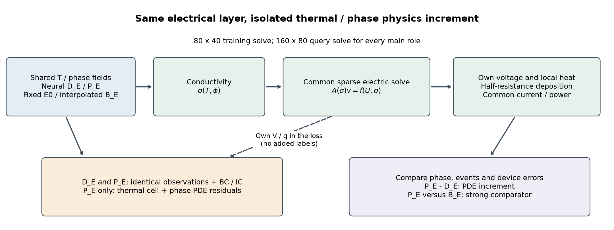
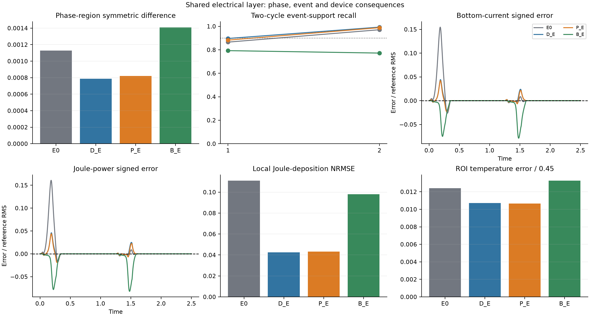
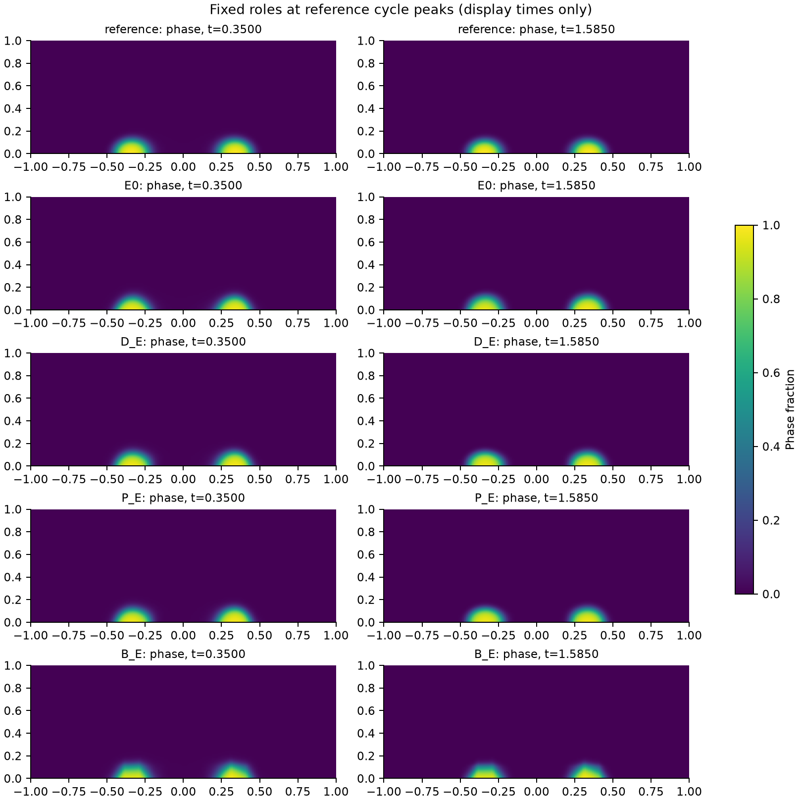
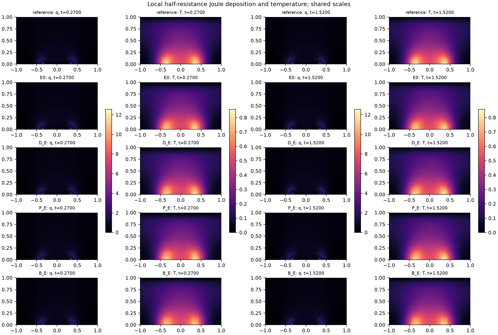

# Separating electrical consistency and remaining-physics value in sparse electrothermal phase-change reconstruction

Working manuscript, 2026-09-13. **Completed fixed-endpoint study: strong-baseline gains, without the prespecified independent thermal/phase-PDE increment.** Training, artifact recovery, actual-instance shutdown and local evaluation are complete. This draft preserves the [V27 manuscript](../paper_v27/manuscript.md); the present sources and selected evidence belong to the release containing this file, authorized separately after scientific closeout.

## Abstract

Sparse reconstruction of a coupled phase-change cell must connect local phase events to terminal electrical response. We evaluate an implicit electrical layer with half-resistance Joule deposition on a synthetic two-dimensional electrothermal phase-change problem. Neural temperature and phase determine conductivity; a sparse electrical solve supplies voltage and local heat through complete implicit derivatives. Two neural controls share this layer, observations and boundary constraints; only P_E adds thermal cell-balance and phase residuals. A same-observation interpolant B_E receives the identical electrical solve. At fixed endpoints, P_E reduces phase-set disagreement, phase RMS, current NRMSE and power NRMSE relative to B_E by 41.85%, 32.69%, 59.85% and 61.18%. However, the control without internal thermal/phase PDEs, D_E, also passes both prespecified baseline comparisons. Relative to D_E, P_E increases phase-set and phase RMS errors by 4.07% and 2.68%, while its current and power improvements of 4.20% and 5.49% fall below the 10% practical-effect threshold. A common independent unlabeled audit likewise does not show a lower remaining-PDE residual. A separate zero-training voltage replacement sharply improves contact current and power at unchanged temperature, phase and conductivity. These findings distinguish electrical-interface repair and strong-baseline reconstruction gains from an unestablished independent PINN increment. Strict two-cycle suitability and independent-case confirmation remain unmet. The object is dimensionless and PCM-inspired; no material calibration, solver replacement or computational acceleration is asserted.

## 1. Scientific question and inherited evidence

The V27 comparison showed that smaller aggregate boundary or interior-physics objectives did not imply more accurate contact current and dissipated power. Its five declared main/conditional comparisons did not pass reconstruction layer A or function layer B. These observations support investigating the electrical interface; they do not prove a unique optimization failure or guarantee a successful replacement.

The present question is narrower than whether a solver can enforce its own algebraic equations: **when every comparator receives the same electrical solve, do thermal and phase residuals improve reconstruction or device function?** Established implicit differentiation supplies the numerical mechanism [Blondel et al.](https://arxiv.org/abs/2105.15183). Its use, standard finite volumes, and discrete conservation are foundations rather than independent novelty claims. A useful contribution requires a matched P_E–D_E effect that survives comparison with B_E, followed by appropriate confirmation.

Control-volume neural residuals have precedents, including [Patel et al.'s hyperbolic-system formulation](https://arxiv.org/abs/2012.05343), and learning through differentiable numerical solvers predates this experiment, as in [Solver-in-the-Loop](https://proceedings.neurips.cc/paper/2020/hash/43e4e6a6f341e00671e123714de019a8-Abstract.html). These works motivate numerical interfaces; they do not establish the electrothermal phase-event benefit tested here. The inherited low-bandwidth temperature features likewise belong to the established [Fourier-feature family](https://arxiv.org/abs/2006.10739). No benefit is attributed to that adapter alone because the present comparison does not ablate it.

## 2. Problem, data and parent state

The domain is \([-1,1]\times[0,1]\) and \(t\in[0,2.5]\). The electrical, thermal and phase equations, parameters, two prescribed pulses, initial fields, top electrode and mixed bottom/insulating boundaries remain as in V27. Conductivity is

\[
\sigma(T,\phi)=\exp\{\beta T+\log(R)\phi^2(3-2\phi)\}.
\]

The top electrode is held at U(t); the centered bottom segment |x|≤0.35 is grounded, and the remaining electrical boundary is insulating. Temperature is zero at the top and satisfies ∂nT+0.25T=0 on the sides and bottom; phase has zero normal derivative on every boundary. Each pulse rises linearly from zero to 0.72 over local time [0,0.05], holds through 0.27, falls to zero at 0.35, and remains off until the next period of 1.25. Initially T=0 and φ=0.02+0.01 exp{−[(x/0.18)²+((z−0.12)/0.10)²]/2}.

| Parameter | Frozen dimensionless value |
|---|---:|
| Thermal diffusivity α; volumetric cooling γ | 0.10; 4.0 |
| Latent ratio L; Joule multiplier Q | 0.05; 4.0 |
| Conductivity ratio R; temperature gain β | 8.0; 0.25 |
| Interface width ε; barrier B; thermal drive D | 0.04; 1.0; 6.0 |
| Transition temperature Tc; mobility width | 0.45; 0.08 |
| Cold and hot mobility | 0.5; 5.0 |

Thus M(T)=0.5+4.5 sigmoid[(T−0.45)/0.08]. These are the materialized numerical-contract values, not fitted properties of an identified oxide. The [base contract](../../configs/phk_v2/object_numerical_contract.json) and [active object overlay](../../configs/phk_v21/object_numerical_contract.json) retain their provenance and exact inheritance.

The neural temperature and phase retain the original output maps

\[
T=2.5(1-e^{-t/0.35})(1-z)\operatorname{sigmoid}(h_T),\qquad
\phi=\operatorname{sigmoid}[\operatorname{logit}(\phi_0)+8(1-e^{-t/0.35})h_\phi].
\]

The specified parent is V27 D_I, chosen by its no-interior-PDE control role before new evaluation. Its independent heads and existing temperature adapter are retained. D_E/P_E optimize the temperature and phase parameters (29,827 parameters); the original voltage head is inactive and reserved for the conditional P_F control. Selection is not based on new reference errors.

The sole label source is the unchanged 21×11×126 sparse bundle, with 231 analytic initial positions distinguished from positive-time observations. All these observations are previously exposed development data. Neither a new holdout claim nor a new observation budget is introduced. No thermal/phase reference trajectory is solved during training. The existing 160×80 numerical reference is used only after fixed training endpoints, artifact recovery and verified cloud shutdown; it is not continuum truth or an independent blind test.

## 3. Implicit electrical and Joule interface

### 3.1 Electrical subproblem

The training electrical grid is fixed at 80×40. For an internal face joining cells \(i,j\), let

\[
R_{ei}=\frac{d_{ei}}{\sigma_i A_e},\quad
R_{ej}=\frac{d_{ej}}{\sigma_j A_e},\quad
g_e=(R_{ei}+R_{ej})^{-1}.
\]

Electrodes retain the inherited half-cell resistances and exact heater overlap; insulating faces add no exterior conductance. The symmetric assembled system is

\[A(\sigma)v=f(U,\sigma).\]

Sparse LU factorization is used without forming a dense inverse. A factorization belongs to one time and parameter state and is reused only for that forward solve's adjoint. Neural evaluation can run on GPU while the compatible sparse factorization runs on CPU. The device transfer is enclosed in a custom VJP; it does not sever conductivity gradients.

Given \(A^Tz=\partial L/\partial v\), the indirect differential is \(z^T(df-dA\,v)\). An internal conductance receives \(-(z_i-z_j)(v_i-v_j)\); a top-electrode conductance receives \(z_i(U-v_i)\), including the conductivity-dependent RHS. Ground conductance receives \(-z_i v_i\). Ordinary automatic differentiation also retains the explicit parameter dependence of local dissipation. The backend uses the documented transpose solve in [SciPy 1.14.1](https://docs.scipy.org/doc/scipy-1.14.1/reference/generated/scipy.sparse.linalg.SuperLU.solve.html).

For known zero drive, \(v=q=0\) is evaluated analytically and the linear solve is skipped. Thermal and phase training continues during those intervals. This simplification is for the prescribed waveform, not a claimed derivative with respect to an unknown control voltage.

An exact operator property clarifies the limit of electrical consistency. For any positive scalar c, every conductance scales by c, so A(cσ)=cA(σ) and f(U,cσ)=cf(U,σ). Consequently v(cσ)=v(σ), whereas terminal currents, total power and local deposition scale by c. Voltage observations alone therefore do not determine the unrestricted conductivity field's global amplitude. This is an algebraic property of the electrical subproblem, not a claim that the full coupled model is unidentifiable: T/phase observations, constitutive restrictions and thermal/phase equations add information. It explains why enforcing the electrical equations cannot by itself guarantee accurate current or heat. No such amplitude direction is asserted to be the measured cause of the present training trajectory without additional evidence.

### 3.2 Local heat deposition and thermal balance

With \(I_e=g_e(v_i-v_j)\), the two cells receive \(I_e^2R_{ei}\) and \(I_e^2R_{ej}\). Equal splitting is generally incorrect when the half resistances differ. Electrode-edge power is deposited in its adjacent cell. The resulting \(q_i\) satisfies \(\sum_i\omega_iq_i=P_J\).

The explicitly changed thermal interface is

\[
R_{T,i}=\partial_t(\bar T_i+L\bar\phi_i)+\gamma\bar T_i
-\frac{\alpha}{\omega_i}\sum_f A_f(\nabla T_\theta)_f\cdot n_{if}-Qq_i.
\]

Cell means use midpoint quadrature. Each shared face has one AD gradient and opposite normals in adjacent cells; boundary faces use the model's own gradient, with the original thermal BC residual retained. The Joule multiplier \(Q=4\) appears once. This surface quadrature is not asserted to equal the old pointwise AD thermal residual at finite grid size.

The phase equation remains

\[
R_\phi=\phi_t-M(T)\left[\epsilon^2\Delta\phi
-2B\phi(1-\phi)(1-2\phi)-6D(T_c-T)\phi(1-\phi)\right].
\]

Mobility remains outside the bracket. No autonomous energy-monotonicity penalty is imposed on the externally driven problem.

## 4. Matched objectives and execution protocol

E0 freezes the parent T/phase and applies the electrical layer. B_E uses the unchanged T/phase of B_logit_waveform_contact and the same layer; its interpolated voltage is discarded. This supplies the solver equally without introducing voltage, current or power labels.

The original three-field observation mean is retained. Voltage and temperature use scales 0.72 and 0.45 and the sparse dual-space/trapezoidal-time measure. Phase uses the complete initial-logit increment, divisor 36.84136146790473, and the equally weighted positive-time global/merged visible interface endpoint measures. Voltage observations backpropagate through the solve to T/phase; solved voltage is not a teacher.

At the common E0, a single calibration freezes

\[
a_E=L_{obs}(E0),\qquad b_E=[J_{T\phi}+5L_{BC,T\phi}+L_{IC}](E0),
\]

\[
C=\frac{L_{obs}}{\max(a_E,10^{-12})}
+\frac{\lambda(5L_{BC,T\phi}+L_{IC})}{\max(b_E,10^{-12})},\qquad
L_{D_E}=C,\quad L_{P_E}=C+\frac{\lambda J_{T\phi}}{\max(b_E,10^{-12})}.
\]

Here \(J_{T\phi}=E[(R_T/4)^2+(R_\phi/5)^2]/3\). The five eliminated electrical BC components contribute zero to the original 13-term BC average. IC retains its original three-term average. Removing components never silently renormalizes the remaining ones. The common schedule is \(\lambda=0.1\min(k/200,1)\), fixed at 0.1 for L-BFGS.

Adam uses at most four sampled observation times and one time from each of four physical windows per update. All visible spatial points at each observation time are evaluated. Its proposal is the average of global and phase time marginals, with exact inverse-proposal weighting for each original target measure. This estimator changes batching, not the observation objective. Uniform cell sampling and the original window masses retain the physical target. The bottom BC sampling retains the inherited half-heater/half-exterior mixture.

The fixed L-BFGS objective uses all 126 observed times, 32 prespecified physical times (eight per window), 128 uniform cell samples per physical time, and fixed boundary/IC pools. Repeated times are merged. Losses using a time's voltage are aggregated before one backward call. Each D_E/P_E arm has fresh Adam (1500 updates maximum, learning rate \(10^{-4}\), inherited betas/epsilon, clipping 10), followed by fresh strong-Wolfe L-BFGS (300 complete objective/gradient evaluations maximum). Trials and repeated closures count; an interrupted search restores the last accepted state and optimizer. The parent, Adam 500/1000/1500 and accepted endpoint are retained. No reference metric selects a checkpoint.

## 5. Evaluation and evidence roles

Each role generates its own T/phase on the fixed 160×80 query grid. E0, D_E, P_E and B_E then solve the electrical subproblem on that same fine grid and use the same face readout. This inference solve is counted explicitly; coarse-voltage interpolation is not described as fine-grid conservation, and the procedure is not pure neural zero-shot prediction.

V27's S, raw Ephi, ET, EV, top/bottom current, two-cycle events, power-trajectory and integrated-energy measures remain unchanged. Reconstruction A and function B are judged separately against D_E and B_E, using the preserved 10% gain, 5% noninferiority and absolute tolerances. Strict device suitability is reported separately. Local Joule and temperature maps supplement these scores. A common sampled-time/FV thermal-balance diagnostic is labeled as such; it is neither the training AD surface loss nor a continuum error estimator.

Specifically, S is the time-integrated full-domain measure of disagreement between phase sets at threshold 0.5. Ephi is the raw phase RMS on the inherited region of interest; ET uses that region and divides temperature RMS by 0.45. EV is raw full-domain voltage RMS, while current and power NRMSE divide trajectory RMS errors by the corresponding reference RMS. Energy error is the absolute signed integral of power error divided by reference energy, so it can hide temporal cancellation. Event-support recall, precision and mass ratio use the original full-domain trapezoidal-time/cell-volume measure in the two heating windows; event timing and recovery use the inherited ROI throughout each cycle. These measures describe different consequences and are not interchangeable.

The electrical identities \(I_t\simeq I_b\) and \(P_J\simeq UI_t\) are correlated consequences of the solve, not multiple independent successes. P_E–D_E identifies the incremental value of the remaining PDEs. B_E tests whether apparent benefit is explained by giving a solver only to the neural method. E0 and the published D_I share T/phase and conductivity, so their difference isolates replacing the inherited voltage representation by the electrical solve; this zero-training contrast is not a PDE-training increment.

The historical strict-device flag retains its exact event, timing, recovery and output-legality definition. It does not replace the separately reported field and electrical errors. The 10%/5% A/B criteria are prespecified practical-effect thresholds, not significance tests over independent initializations.

After training, one common audit evaluates E0/D_E/P_E on the previously frozen independent unlabeled physical pool and the full seen observations. Every state is evaluated with the same thermal/phase functional, without optimizer or parameter-gradient updates. This separates residual reduction from predictive benefit. Coordinate AD used to evaluate the residual is retained; the audit is neither unseen data validation nor a new training trial, and cannot select an endpoint.

Only if P_E passes A or B against D_E and is noninferior on the corresponding layer against B_E with at least one core error improved by 10% is P_F run. P_F starts from the same original parent, retains its voltage head, uses identical observations, local half-resistance Joule deposition, thermal/phase residuals and normalizers, and adds \((Av-f)/\omega\) as its electrical residual of scale 1. It receives the same 1500/300 cap. Its final voltage stays neural; postprocessing by a solve is prohibited. If it performs equally well or better, elimination necessity is not established.

## 6. Results

### 6.1 Valid interfaces and fixed endpoints

**VERIFIED.** The CPU tests agree with the inherited electrical solver, resolve unequal half-resistance heat allocation, and verify voltage, local-heat and joint-loss derivatives. Actual-parent GPU T/phase directional errors are 3.64×10⁻⁹ and 1.02×10⁻¹⁰. D_E and P_E each completed 1500 Adam updates and 300 complete fixed objective/gradient evaluations. Their final states are accepted states, including rollback of P_E's last unaccepted trial. E0 and B_E remained zero-training roles. The new evaluation followed verified recovery and actual cloud shutdown; stress was not accessed.

### 6.2 Both trained roles improve on an equally solved strong baseline

**VERIFIED.** The fixed nominal comparison is below. Percentages express each normalized error, not relative changes between methods. The full [endpoint table](tables/fixed-endpoints.md) also includes raw voltage error and local deposition error.

| Role | S | Raw Ephi | ET / 0.45 (%) | Current NRMSE (%) | Power NRMSE (%) | Energy error (%) |
|---|---:|---:|---:|---:|---:|---:|
| E0 | 0.001128516 | 0.02341468 | 1.24237 | 2.55490 | 2.64146 | 1.23562 |
| D_E | 0.000787031 | 0.01558212 | 1.07147 | 0.72426 | 0.72132 | 0.28820 |
| P_E | 0.000819063 | 0.01599968 | 1.06622 | 0.69382 | 0.68173 | 0.21883 |
| B_E | 0.001408438 | 0.02376978 | 1.32783 | 1.72823 | 1.75623 | 1.18494 |

The common electrical solve makes top and bottom current equal to numerical tolerance; both scores are nevertheless retained in the raw records. Relative to B_E, D_E reduces S/Ephi by 44.12%/34.45% and current/power NRMSE by 58.09%/58.93%. P_E reduces the corresponding errors by 41.85%/32.69% and 59.85%/61.18%. **Both D_E and P_E pass reconstruction A and function B against B_E.** Thus the trained reconstruction benefit is not explained solely by withholding the electrical solver from the interpolant. However, D_E also receives observations and boundary constraints and optimizes T/phase; this comparison does not isolate a particular network, adapter or implicit-gradient mechanism.

*Figure 1. Every main role receives the same electrical subproblem and local deposition rule. P_E−D_E isolates the added thermal/phase objective. Electrical elimination, implicit differentiation and finite volumes are established components.*

*Figure 2. E0/D_E/P_E/B_E at their fixed endpoints. Signed current and power errors use the reference trajectory RMS as a common display scale; the dashed zero line is exact agreement. The recall dotted line is the preserved 0.9 threshold. These curves, S, local deposition error and temperature error expose different consequences; no curve selects an endpoint.*

### 6.3 The added remaining PDEs do not pass the matched increment

**VERIFIED.** Relative to D_E, P_E increases S by 4.07% and Ephi by 2.68%. Its current and power errors decrease by 4.20% and 5.49%, short of the 10% practical-effect criterion. Temperature and voltage errors decrease by 0.49% and 2.17%; the noninferiority guards pass, but the primary gains do not. The integrated energy error decreases by 24.07%; this cannot replace the prespecified power-trajectory comparison because integration permits cancellation. Local deposition NRMSE increases by 1.90%, from 0.0424772 to 0.0432859.

Consequently, **P_E−D_E fails both A and B**, even though P_E−B_E passes both. The same-layer prerequisite for P_F is false: **P_F was not triggered and was not run.** Necessity of elimination relative to the planned matched soft-electrical control remains UNKNOWN. The [complete matched contrast](tables/matched-pde-contrast.md) preserves submetric effects; failing the practical threshold is not evidence of a statistical zero effect or an upper bound on sufficiently trained methods.

### 6.4 Electrical-interface repair is distinguishable from learning

**VERIFIED.** E0 and the published V27 D_I have identical T/phase functions, conductivity and phase/temperature scores. Replacing only D_I's voltage function by the electrical solve changes bottom-current NRMSE from 506.741% to 2.555%, power NRMSE from 28.071% to 2.641%, and energy error from 25.205% to 1.236%. Top-current NRMSE decreases from 3.929% to 2.555%, whereas raw EV increases by 3.79%. This controlled intervention supports a major electrical-interface contribution to the historical bottom-current and power errors, with a voltage-field tradeoff. It is a zero-training effect, not improved phase reconstruction or a PINN-training increment.

The further E0→D_E improvement includes continued fitting and common thermal/phase boundary constraints: S and Ephi decrease by 30.26% and 33.45%, current and power errors by 71.65% and 72.69%. It cannot be labeled a pure boundary effect. Combining these observations separates voltage-function repair, learned reconstruction and the additional internal-PDE objective without conflating them.

### 6.5 Two-cycle events and local heat retain unresolved tradeoffs

**VERIFIED.** The first-cycle recall of D_E/P_E is 0.89646/0.88249, below 0.9. P_E improves the first-cycle timing error from D_E's 0.00345 to 0.00130 and the second-cycle error from 0.00904 to 0.00753, but the second error still exceeds 0.005. Recall decreases in both cycles relative to D_E. All four roles have recovery fraction 1, yet all fail the preserved strict-device flag. A better integral or a smaller timing error cannot substitute for the joint event requirement.

*Figure 3. Shared-scale phase maps at reference-defined cycle peaks. These are post-evaluation display times only, not checkpoint or hyperparameter selection.*

*Figure 4. Local q and T at the two prescribed pulse plateau endpoints, t=0.27 and 1.52. Each field uses the same scale across roles and cycles. q includes electrode half-resistance deposition; it is not rescaled to match reference power.*

The common sampled-time/FV thermal-balance proxy is 0.49810/0.48331/0.48686/0.65463 for E0/D_E/P_E/B_E. It remains substantial and P_E does not improve it relative to D_E. This diagnostic uses a different discrete temporal/flux evaluation from the training AD cell balance; their magnitudes cannot be equated or presented as continuum error.

### 6.6 A fixed unlabeled audit does not show stronger remaining-physics satisfaction

**VERIFIED.** With the same full seen observations and independent frozen unlabeled pool, the audit gives:

| Quantity | E0 | D_E | P_E |
|---|---:|---:|---:|
| Lobs | 5.93726e-5 | 3.20042e-5 | 3.31557e-5 |
| Common thermal/phase BC | 0.240216 | 0.0620168 | 0.0590307 |
| Normalized thermal squared residual | 0.0189432 | 0.0188648 | 0.0189475 |
| Normalized phase squared residual | 0.000904191 | 0.000344628 | 0.000373048 |
| J_Tphi, original denominator 3 | 0.00661579 | 0.00640313 | 0.00644018 |

P_E reduces boundary loss by 4.81% relative to D_E, while its thermal, phase and joint internal residuals are 0.44%, 8.25% and 0.58% higher. Thus this experiment does not reproduce the historical pattern “a smaller internal residual accompanies worse events”: the common audit does not establish the first premise. This is a fixed-endpoint diagnostic, not a reference-tuned model selection.

At E0's calibration pool and λ=0.1, the weighted observation, boundary, thermal and phase terms are approximately 1, 0.0994590, 0.000496678 and 0.0000442777. The remaining PDE contribution is small in loss value under the mandated common normalization. **SUPPORTED_INTERPRETATION:** its effective optimization influence should be examined before adding modules. **HYPOTHESIS:** insufficient or conflicting parameter updates may contribute; loss magnitudes alone do not establish gradient magnitudes, a causal explanation, or the benefit of reweighting.

### 6.7 Actual computation and accepted-state accounting

| Role | Adam updates | Complete L-BFGS evaluations | Accepted L-BFGS steps | Training forward / adjoint solves | Fine-grid inference solves |
|---|---:|---:|---:|---:|---:|
| E0 | 0 | 0 | 0 | 0 / 0 | 278 |
| D_E | 1500 | 300 | 147 | 11743 / 11743 | 278 |
| P_E | 1500 | 300 | 146 | 19543 / 19543 | 278 |
| B_E | 0 | 0 | 0 | 0 / 0 | 278 |

The main run uses 3000 Adam updates and 600 full evaluations, including trial/repeated closures. Its 31,286 forward and 31,286 adjoint training solves are separate from the 1,112 fine-grid inference solves. There are 71,782 analytical zero-drive skips in training and 723 per main inference role. Preparation, derivative checks and three post-training audit objective evaluations are recorded separately. The largest main-training scaled forward/adjoint residuals are 4.15×10⁻¹⁵/3.25×10⁻¹⁴. Equal update and function-evaluation budgets do not mean equal solve counts or equal computation. No acceleration claim follows from these results.

## 7. Discussion, limits and the next scientific decision

**SUPPORTED_INTERPRETATION.** The defensible paper structure is a causal comparison of three links: electrical-interface repair at fixed conductivity, reconstruction beyond an equally solved strong interpolant, and the independent value of remaining thermal/phase physics. The first two have positive bounded evidence; the third does not pass the declared comparison. An implicit electrical/Joule interface is now a usable experimental module, but its presence, exact conservation and established numerical ingredients are not independent innovations. P_E's win over B_E alone cannot validate the additional PDE design because D_E wins as well. The current contribution is the controlled evidence and its mechanistic distinctions, not a proven superior PINN algorithm.

This is one inherited initialization, one exposed mask and one nominal synthetic dimensionless wall cell. All four roles use a fine-grid electrical solve, which changes the inference procedure and incurs real work. There is no new initialization, independent observation placement, complete protocol, formal OOD, material calibration or experimental device. The reference is a fixed numerical trajectory, not continuum truth. Strict event suitability remains false. These limits preclude general claims about oxide devices, solver replacement or universal PINN failure.

**PROPOSED_NOT_AUTHORIZED.** The most direct next study should first resolve whether the remaining PDE blocks measurably influence the trainable heads. At fixed E0 and D_E, use the same visible/unlabeled pool to separate observation, boundary, thermal and phase gradients into T/phase heads, retaining the complete electrical VJP. Compare weighted norms, directions and the relevant optimizer preconditioning without updating parameters or using reference scores to choose weights. A small loss term alone is insufficient to choose a remedy. If a specific scale or conflict mechanism is supported, test one prespecified block-level change against a same-parent D_E and original-P_E control, keeping the strong B_E and all measures fixed. New budgets and thresholds must be frozen before execution; this completed sprint authorizes no extra rescue run.

After a credible P_E−D_E signal that also survives B_E, the minimal confirmation should include the nearest matched soft-electrical P_F, two fresh initialization pipelines, one new observation rule from clean initialization, and one complete held-out protocol with a no-event control. Support-based retraining is reconstruction/adaptation; zero-shot generalization needs a separately frozen protocol and no case-specific updating. Preserve the first-cycle recall and second-cycle timing requirements. Scaling, Fourier features and optimizers remain implementation foundations unless separately attributable effects are demonstrated.

## 8. Conclusion and availability

The electrical layer substantially repairs contact current and power at fixed conductivity, and both trained neural roles outperform the equally solved sparse interpolant. These are concrete advances beyond the inherited electrical inconsistency and direct-baseline gap. They do not establish the independent value of the remaining thermal/phase PDEs: P_E−D_E fails the declared A/B increment and the common residual audit does not favor P_E. The conditional soft-electrical arm is unrun, and strict two-cycle suitability remains unmet. The next scientific priority is a targeted test of the remaining PDEs' effective influence while preserving the present strong-baseline gains.

The [selected evidence](evidence/README.md), [reproduction instructions](reproducibility.md), full fixed-endpoint tables and four figure pairs accompany this local draft. Original checkpoints, accepted optimizer states and complete own-field predictions remain in the run directory. The prior published parent and sparse data retain their fixed identity; this package belongs to the release containing this file. Original unpublished fields in runtime records remain historical closeout snapshots, not current distribution metadata. No stress or new experimental data were used.

## Appendix A. Retained mechanisms and their evidence boundaries

These are results from the preserved releases, not reruns or independent replications of the present electrical-layer comparison.

| Evidence | Previously verified finding | Role in the present argument |
|---|---|---|
| Interface exposure | Recall gains 0.08984/0.04628/0.02524 in three sampling streams; quality retained in two | Event support can depend on where supervision is supplied; the streams share a model initialization |
| Physics continuation | Events deteriorated in all three streams; physics-objective ratios 0.01281/0.00512/0.71669 | Residual decrease and event preservation are separate; only two streams passed the declared residual-decrease threshold |
| Sparse four-arm comparison | D_B/P_U/P_I/P_M did not establish the prescribed joint increment | Persistent anchors, corrected sampling and calibrated phase weighting were tested under that earlier formulation |
| V/T fitting repair | Visible T error 17.8233%→1.1375%; fixed-reference ROI T error 28.2210%→1.7475% | A large fitting gap was repairable within the same temperature envelope; no adapter-only causal claim |
| V-only continuation | Visible V error 0.8215%→0.5618%; energy error 49.20%→28.28% at fixed conductivity | A controlled voltage intervention; the old 0.5% gate remained unmet |
| Contact-aware direct comparator | Energy error 2.1874%→0.6443% with no training or new field labels | Known geometry must be given to the strong comparator; this does not enforce insulation or the full PDE |
| V27 joint/normalized controls | Six valid endpoints; no declared A/B gain in the five tested contrasts | Smaller aggregate boundary and AD physics losses did not guarantee better contact current/power; normalized electric blocks did not resolve the tested tradeoff |

The detailed definitions and endpoint evidence remain in [V24](../paper_v24/README.md), [V25](../paper_v25/README.md), [V26](../paper_v26/README.md) and [V27](../paper_v27/README.md). Together they motivate the present controlled electrical interface. They do not turn generic fitting, sampling or conservation mechanisms into multiple independent innovations.
