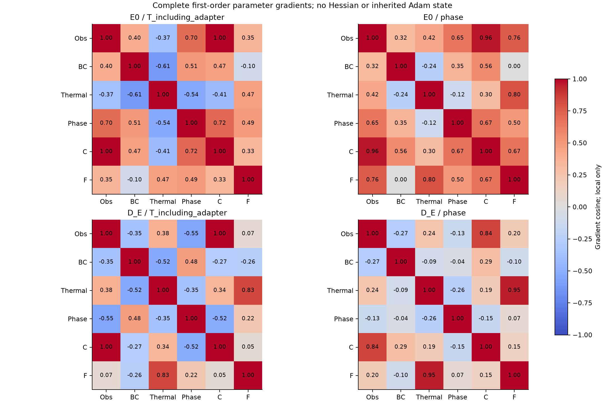
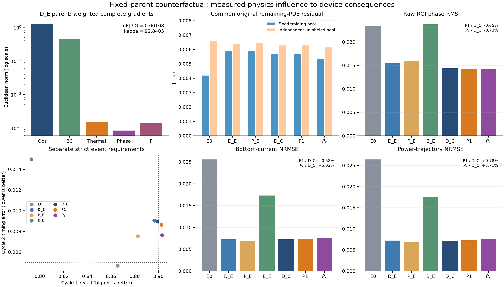
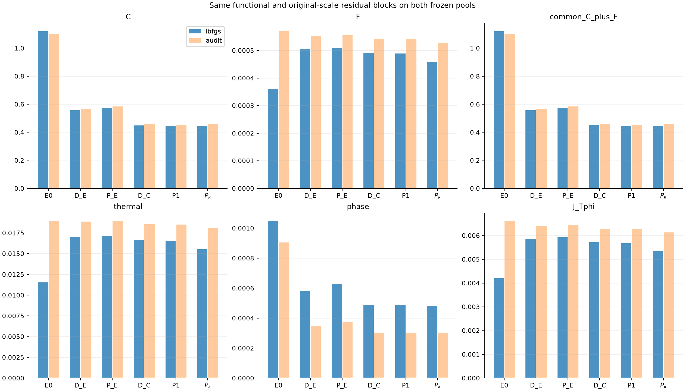
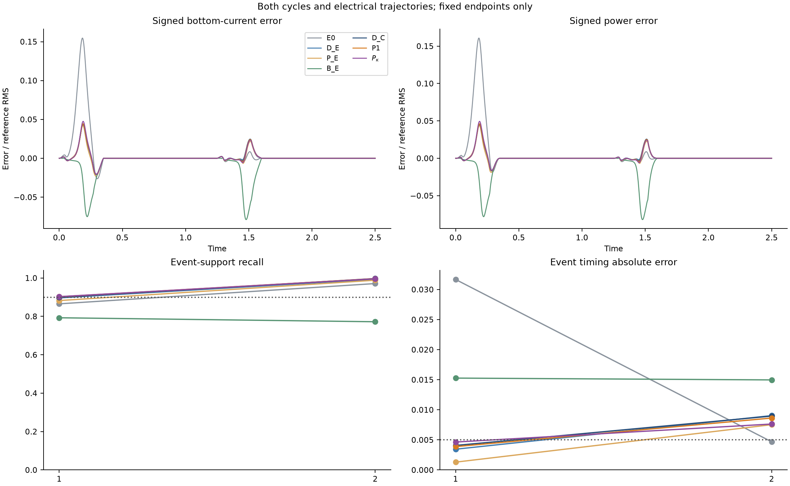

# Electrical consistency, measurable physics influence and predictive value in sparse phase-change reconstruction

Working manuscript, 2026-09-13. **Completed local fixed-parent counterfactual; no automatic publication.** This version preserves the [V28 manuscript](../paper_v28/manuscript.md) and all earlier verdicts. All new reported endpoints follow completed training, recovery, actual-instance shutdown and local nominal evaluation.

## Abstract

An electrically consistent phase-change reconstruction can outperform sparse interpolation without establishing an independent contribution from thermal and phase residuals. We study this distinction in a synthetic two-dimensional electrothermal wall cell using an implicitly differentiated electrical solve and half-resistance Joule deposition. The inherited observation-and-boundary control already outperforms an interpolant equipped with the same electrical layer. At this trained parent, complete first-order differentiation measures a remaining-PDE gradient only 0.1077% of the prescribed observation/boundary scale. A reference-blind rule fixes a global multiplier of 92.84049. Three same-parent L-BFGS arms isolate continued fitting, original-strength remaining PDEs and this multiplier. Relative to continued fitting, the weighted arm reduces the original residual by 6.59% on the training pool and 2.35% on an independent unlabeled pool, mainly through the thermal block. Its first-cycle recall crosses 0.9 and its second-cycle timing error improves by 14.73%, but phase RMS improves only 0.73% while current and power errors increase by 5.03% and 5.71%. Neither PDE arm reaches the prespecified matched prediction increment; both retain substantial gains over equally solved interpolation. These results separate electrical consistency, learned reconstruction, measurable PDE influence and device benefit. The evidence concerns one inherited initialization and exposed nominal observations; it neither establishes a superior general PINN method nor validates a calibrated oxide device.

## 1. Question and contribution boundaries

The paper connects three experimentally distinct links: replacing an inaccurate voltage function at fixed conductivity; learning beyond an equally solved strong interpolant; and obtaining an independent prediction benefit from the remaining thermal/phase PDEs. V28 supplies positive bounded evidence for the first two. The present experiment specifically targets the third while retaining its successful electrical/Joule interface.

The existing interface has known numerical foundations. Implicit differentiation, sparse factorization, finite-volume balances and L-BFGS are not new algorithms here. [Wang, Teng and Perdikaris](https://arxiv.org/abs/2001.04536) motivate measuring back-propagated gradients in composite PINN objectives; their evolving gradient-statistics annealing scheme is not the frozen one-shot coefficient tested here. [Rathore et al.](https://proceedings.mlr.press/v235/rathore24a.html) study PINN loss conditioning and optimization, but their results do not establish a performance guarantee for this coupled problem. The current custom numerical VJP supports the verified first-order derivatives; no differentiable second-order VJP or NNCG implementation is presumed.

**Evidence distinction.** D_E already embeds physics: its voltage observations propagate through sigma, the global electrical solve and the full implicit gradient to T/phase. It is not a physics-free data network. Conversely, adding a PDE penalty does not by itself prove that its information improves prediction. A practical-effect test must compare matched parents, optimizers and fixed targets, and retain the original strong D_E and B_E in the headline table.

## 2. Problem, data and parent state

The domain is \([-1,1]\times[0,1]\) and \(t\in[0,2.5]\). The electrical, thermal and phase equations, parameters, two prescribed pulses, initial fields, top electrode and mixed bottom/insulating boundaries remain as in V27. Conductivity is

\[
\sigma(T,\phi)=\exp\{\beta T+\log(R)\phi^2(3-2\phi)\}.
\]

The top electrode is held at U(t); the centered bottom segment |x|≤0.35 is grounded, and the remaining electrical boundary is insulating. Temperature is zero at the top and satisfies ∂nT+0.25T=0 on the sides and bottom; phase has zero normal derivative on every boundary. Each pulse rises linearly from zero to 0.72 over local time [0,0.05], holds through 0.27, falls to zero at 0.35, and remains off until the next period of 1.25. Initially T=0 and φ=0.02+0.01 exp{−[(x/0.18)²+((z−0.12)/0.10)²]/2}.

| Parameter | Frozen dimensionless value |
|---|---:|
| Thermal diffusivity α; volumetric cooling γ | 0.10; 4.0 |
| Latent ratio L; Joule multiplier Q | 0.05; 4.0 |
| Conductivity ratio R; temperature gain β | 8.0; 0.25 |
| Interface width ε; barrier B; thermal drive D | 0.04; 1.0; 6.0 |
| Transition temperature Tc; mobility width | 0.45; 0.08 |
| Cold and hot mobility | 0.5; 5.0 |

Thus M(T)=0.5+4.5 sigmoid[(T−0.45)/0.08]. These are the materialized numerical-contract values, not fitted properties of an identified oxide. The [base contract](../../configs/phk_v2/object_numerical_contract.json) and [active object overlay](../../configs/phk_v21/object_numerical_contract.json) retain their provenance and exact inheritance.

The neural temperature and phase retain the original output maps

\[
T=2.5(1-e^{-t/0.35})(1-z)\operatorname{sigmoid}(h_T),\qquad
\phi=\operatorname{sigmoid}[\operatorname{logit}(\phi_0)+8(1-e^{-t/0.35})h_\phi].
\]

The current common parent is the saved V28 D_E endpoint, selected by its no-remaining-interior-PDE control role. V28 itself inherited V27 D_I; these are distinct experimental parents. Its independent heads and existing temperature adapter are retained. D_C/P1/P_kappa optimize the temperature and phase parameters (29,827 parameters); the original voltage head is inactive and reserved for the conditional P_F control. This role-defined parent is fixed before the current reference evaluation. All new optimizers start fresh; the parent’s saved curvature is not inherited.

The sole label source is the unchanged 21×11×126 sparse bundle, with 231 analytic initial positions distinguished from positive-time observations. All these observations are previously exposed development data. Neither a new holdout claim nor a new observation budget is introduced. No thermal/phase reference trajectory is solved during training. The existing 160×80 numerical reference is used only after fixed training endpoints, artifact recovery and verified cloud shutdown; it is not continuum truth or an independent blind test.

## 3. Implicit electrical and Joule interface

### 3.1 Electrical subproblem

The training electrical grid is fixed at 80×40. For an internal face joining cells \(i,j\), let

\[
R_{ei}=\frac{d_{ei}}{\sigma_i A_e},\quad
R_{ej}=\frac{d_{ej}}{\sigma_j A_e},\quad
g_e=(R_{ei}+R_{ej})^{-1}.
\]

Electrodes retain the inherited half-cell resistances and exact heater overlap; insulating faces add no exterior conductance. The symmetric assembled system is

\[A(\sigma)v=f(U,\sigma).\]

Sparse LU factorization is used without forming a dense inverse. A factorization belongs to one time and parameter state and is reused only for that forward solve's adjoint. Neural evaluation can run on GPU while the compatible sparse factorization runs on CPU. The device transfer is enclosed in a custom VJP; it does not sever conductivity gradients.

Given \(A^Tz=\partial L/\partial v\), the indirect differential is \(z^T(df-dA\,v)\). An internal conductance receives \(-(z_i-z_j)(v_i-v_j)\); a top-electrode conductance receives \(z_i(U-v_i)\), including the conductivity-dependent RHS. Ground conductance receives \(-z_i v_i\). Ordinary automatic differentiation also retains the explicit parameter dependence of local dissipation. The backend uses the documented transpose solve in [SciPy 1.14.1](https://docs.scipy.org/doc/scipy-1.14.1/reference/generated/scipy.sparse.linalg.SuperLU.solve.html).

For known zero drive, \(v=q=0\) is evaluated analytically and the linear solve is skipped. Thermal and phase training continues during those intervals. This simplification is for the prescribed waveform, not a claimed derivative with respect to an unknown control voltage.

An exact operator property clarifies the limit of electrical consistency. For any positive scalar c, every conductance scales by c, so A(cσ)=cA(σ) and f(U,cσ)=cf(U,σ). Consequently v(cσ)=v(σ), whereas terminal currents, total power and local deposition scale by c. Voltage observations alone therefore do not determine the unrestricted conductivity field's global amplitude. This is an algebraic property of the electrical subproblem, not a claim that the full coupled model is unidentifiable: T/phase observations, constitutive restrictions and thermal/phase equations add information. It explains why enforcing the electrical equations cannot by itself guarantee accurate current or heat. No such amplitude direction is asserted to be the measured cause of the present training trajectory without additional evidence.

### 3.2 Local heat deposition and thermal balance

With \(I_e=g_e(v_i-v_j)\), the two cells receive \(I_e^2R_{ei}\) and \(I_e^2R_{ej}\). Equal splitting is generally incorrect when the half resistances differ. Electrode-edge power is deposited in its adjacent cell. The resulting \(q_i\) satisfies \(\sum_i\omega_iq_i=P_J\).

The thermal interface introduced in V28 and held fixed here is

\[
R_{T,i}=\partial_t(\bar T_i+L\bar\phi_i)+\gamma\bar T_i
-\frac{\alpha}{\omega_i}\sum_f A_f(\nabla T_\theta)_f\cdot n_{if}-Qq_i.
\]

Cell means use midpoint quadrature. Each shared face has one AD gradient and opposite normals in adjacent cells; boundary faces use the model's own gradient, with the original thermal BC residual retained. The Joule multiplier \(Q=4\) appears once. This surface quadrature is not asserted to equal the old pointwise AD thermal residual at finite grid size.

The phase equation remains

\[
R_\phi=\phi_t-M(T)\left[\epsilon^2\Delta\phi
-2B\phi(1-\phi)(1-2\phi)-6D(T_c-T)\phi(1-\phi)\right].
\]

Mobility remains outside the bracket. No autonomous energy-monotonicity penalty is imposed on the externally driven problem.

## 4. One fixed-parent, fixed-target experiment

### 4.1 Information and loss remain fixed

The only new scientific variable is inclusion of the remaining PDE objective and, conditionally, a single fixed multiplier. The original sparse target measure, complete phase-logit increment, network, T adapter, BC/IC terms, thermal/phase scales 4/5, and averaging denominators 3/13 are unchanged. No teacher current, power, dense fields, new observation, stress data or full thermal/phase solve enters training. All old observations remain seen development data.

With the inherited aE=5.937255597408733e-5 and bE=1.160653895023754, lambda is fixed to 0.1 with no new ramp or recalibration:

\[
C=L_{obs}/\max(a_E,10^{-12})+0.1(5L_{BC}+L_{IC})/\max(b_E,10^{-12}),\qquad
F=0.1J_{T\phi}/\max(b_E,10^{-12}).
\]

D_C minimizes C, P1 minimizes C+F and P_kappa minimizes C+kappa F. D_C isolates continued deterministic fitting; P1 tests adding the existing remaining PDE at this same parent; P_kappa–P1 tests only the global multiplier. Parent-to-endpoint changes alone do not identify a PDE effect. The original electrical face network and complete VJP are inherited, including electrode RHS and explicit local dissipation derivatives.

### 4.2 Reference-blind one-shot rule and complete first-order diagnosis

Old E0/D_E/P_E are evaluated on the original fixed L-BFGS pool with the same C+F; their previously saved independent-pool audit is reused. E0 and D_E each receive exactly four parameter-gradient scans on the original calibration pool: weighted observations, BC/IC, thermal, and phase. No optimizer updates or finite perturbation trial occur in this diagnosis. T includes the retained adapter. Electrical indirect derivatives remain active whenever the block depends on V or q; the phase block has no direct electrical dependence, but retains its T coupling.

Let g_obs and g_BC be the gradients of the weighted observation and boundary packages, and g_F the sum of weighted thermal and phase gradients. Define G=sqrt(||g_obs||^2+||g_BC||^2). Only identifiable ||g_F||/G<0.1 enables kappa=min(100,0.1G/||g_F||); the factor is frozen once. The identifiability floor is 1e-12 and no reference chooses kappa. This prescribed scale target is neither theoretically optimal nor a novel adaptive weighting algorithm. Reported cosines and unit-direction slopes are local first-order information, not accepted update directions or entire-trajectory causality. In particular, these norms do not measure how the evolving L-BFGS curvature approximation transforms a block's influence. No inherited Adam moments or Hessian are used.

### 4.3 Budget resolution, fixed pools and stopping

The user execution file specifies at most 300 complete evaluations per arm, at most 900 overall, zero Adam, and simultaneously at most 30,000 training forward and 30,000 adjoint solves. The source report's 26,800-pair estimate corresponds to its earlier 200-evaluation proposal; it cannot apply to three full 300-evaluation arms. A single pretraining count gives 34 nonzero observation times for D_C and 50 for each PDE arm. Both caps are therefore honored by a common limit of floor(30000/(34+50+50))=223, frozen before the first new update. Maximum training forward/adjoint work is 29,882 each, with no reallocation or appended continuation.

All arms start from the same D_E parameters and fresh PyTorch 2.5.1 strong-Wolfe L-BFGS: lr=1, max_iter=1, history_size=50, gradient tolerance 1e-10 and change tolerance 1e-14. Original complete observations and physical pools are fixed; every initial, repeated and line-search objective/gradient evaluation counts. Closures use exact weighted accumulation without resampling, dynamic weights or gradient clipping. The endpoint is the fixed budget or optimizer-intrinsic stopping state. An interrupted trial restores both the last accepted parameters and optimizer, never a reference-best intermediate state.

## 5. Evaluation and falsification criteria

Each new endpoint predicts its own T/phase on the original 160x80x1001 query grid and solves its own electrical subproblem there: 278 nonzero forward solves and 723 analytic zero-drive skips per endpoint. This is counted inference work. The original nominal reference is read locally only after training, recovery and confirmed shutdown. E0/D_E/P_E/B_E scores are reused from V28, without old endpoint retraining or repeated prediction.

The V28 formal definitions are unchanged: S is time-integrated threshold-set disagreement; Ephi is raw ROI phase RMS; ET is ROI temperature RMS/0.45; EV is full-domain raw voltage RMS. Current and power NRMSE use their respective reference trajectory RMS. Energy is an integrated error that can cancel across time. Global two-heating-window support recall/precision/mass is distinct from ROI cycle timing and recovery. Local q error and the original sampled-time/FV heat-balance proxy remain separately labeled diagnostics, not the AD training residual or continuum truth.

A requires at least 10% improvement in both S and Ephi with the old 5% noninferiority and absolute tolerances on the declared fields/current. B requires at least 10% improvement in bottom-current and power-trajectory NRMSE with corresponding noninferiority. P1/P_kappa must first pass against D_C and preserve the corresponding layer against both original D_E and B_E. A gain against a degraded continued control is insufficient. P_kappa is also compared directly with P1 before attributing a gain to its multiplier. The simpler P1 has priority if both qualify. Strict two-cycle suitability is kept separate and unchanged.

For each new endpoint, the same C+F and original thermal, phase and joint residuals are evaluated on both the training and independent unlabeled pools. Its own training functional is reported separately. Audit-only improvement, training-only improvement and reference prediction improvement support different statements. Electrical current balance, discrete conservation and power identity share one enforced operator and are not counted as independent method gains. P_F is a future proposal only in this sprint, even after a positive signal.

## 6. Actual results

**VERIFIED, retained V28 results.** At fixed T, phase and conductivity, replacing the V27 D_I voltage function by the electrical solution E0 reduced bottom-current NRMSE from 506.741% to 2.555% and power-trajectory NRMSE from 28.071% to 2.641%; raw voltage RMS increased by 3.79%. This is a controlled electrical-interface repair, with no improved phase reconstruction or additional training. It is distinct from the later E0-to-D_E fitting benefit. The inherited D_E and P_E both pass A/B against the equally solved B_E: their raw phase RMS is lower by 34.45% and 32.69%, and power NRMSE by 58.93% and 61.18%, respectively. These positive bounded findings remain part of the paper; the new experiment asks whether adding the remaining PDEs improves on the trained control.

### 6.1 The old deficit occurs on both pools

**VERIFIED.** The same training-pool C+F is 0.5577730985 for D_E and 0.5755936102 for P_E. Their J_Tphi values are 0.00587072093 and 0.00592212294. The earlier independent audit also favors D_E: 0.5663091091 versus 0.5844192432 for C+F and 0.00640313316 versus 0.00644017660 for J_Tphi. Thus a training-better/audit-worse pattern is not observed; the comparison does not establish an integration error or an incorrectly implemented objective. The original own training endpoint values are reproduced to floating-point precision.

### 6.2 Small net first-order norm and partial block opposition

**VERIFIED.** At the D_E calibration pool G=1.338475408, ||g_F||=0.001441693593, and their ratio is 0.001077116236. The frozen kappa is 92.84049083, below 100. The cosine between g_F and g_C is 0.05359 over all trainable parameters, 0.04766 for T including its adapter, and 0.14527 for phase. Thermal and phase gradients have cosine -0.3550 in the T head. The phase-equation gradient norm on T with adapter is 8.38985e-4 versus 9.15827e-5 on the phase head, a factor of 9.16 under this fixed parameterization. An equation cannot be equated with one trained field head. These measured norms replace the previous inference from small scalar loss. They identify weak participation and partial cancellation at this point; they do not by themselves establish a unique cause, parameterization-invariant sensitivity or benefit from increasing F.

The cross-head channel is present analytically. Write H=epsilon^2 Laplacian(phi)-2B phi(1-phi)(1-2phi)-6D(Tc-T)phi(1-phi), so R_phi=phi_t-M(T)H. Holding phi and its derivatives fixed gives dR_phi/dT=-M'(T)H-6D M(T)phi(1-phi). This identifies a temperature path even for an independent phase head, but does not prescribe a gradient sign, parameter-norm ratio or a finite training outcome. The observed 9.16 ratio is measured evidence for this specific state, not a consequence of the identity alone.

The multiplier's magnitude should not be confused with domination of the objective. Arithmetic from the saved calibration norms gives ||kappa g_F||/||g_C||=0.10795 and a 6.12-degree rotation from g_C to g_C+kappa g_F before any L-BFGS curvature transformation. On the separate fixed training pool at the parent, kappa F=0.0469598 while C=0.5572673, a ratio of 8.43%. These values characterize this particular prescribed strength target; they are not new gradient scans and do not exhaust stronger weights or other physical objectives.

*Figure 1. Complete first-order block-gradient cosines at E0 and D_E, separately for T with adapter and phase. Coordinate differentiation and the full electrical VJP are retained; the map is local, not a trajectory attribution.*

### 6.3 Fixed endpoints and preserved comparators

**VERIFIED.** Neither new added-PDE arm establishes the prespecified matched prediction increment while preserving the historical comparator requirements. The actual fixed-endpoint values are:

| role | S | Ephi | ET | EV | EI | bottom_current_NRMSE | power_trace_NRMSE | energy_error | local_joule_NRMSE | strict_device_pass |
|---|---|---|---|---|---|---|---|---|---|---|
| E0 | 0.00112851563 | 0.0234146837 | 0.0124236964 | 0.00383119271 | 0.0255490439 | 0.0255490439 | 0.0264146359 | 0.0123561814 | 0.111024622 | False |
| D_E | 0.00078703125 | 0.0155821211 | 0.0107147352 | 0.00110883739 | 0.00724256918 | 0.00724256918 | 0.00721322841 | 0.00288198505 | 0.0424771836 | False |
| P_E | 0.0008190625 | 0.0159996773 | 0.0106622423 | 0.00108482431 | 0.00693818679 | 0.00693818679 | 0.00681730628 | 0.00218830694 | 0.0432858707 | False |
| B_E | 0.0014084375 | 0.0237697822 | 0.0132782551 | 0.00255844987 | 0.0172822894 | 0.0172822894 | 0.017562293 | 0.01184941 | 0.0981319028 | False |
| D_C | 0.000781953125 | 0.0143587127 | 0.0102268278 | 0.00109020126 | 0.00725526014 | 0.00725526014 | 0.00719509624 | 0.00279652797 | 0.0399023375 | False |
| P1 | 0.0007725 | 0.0142650985 | 0.0101227659 | 0.0011018174 | 0.00729715416 | 0.00729715416 | 0.00725088576 | 0.00276541019 | 0.0395942824 | False |
| P_kappa | 0.00077140625 | 0.014253669 | 0.010022266 | 0.00114762709 | 0.00761998387 | 0.00761998387 | 0.00760610227 | 0.00290092219 | 0.0404053167 | False |

The table reports raw normalized errors, not percentage changes. The strict flag retains the full historical definition. Strict passing roles in this table: none.

P1 and P_kappa retain both A and B against B_E: phase RMS decreases by 39.99%/40.03% and power NRMSE by 58.71%/56.69%. Continued fitting already explains most of the new phase gain: D_C lowers phase RMS by 7.85% relative to the original D_E, whereas P1/P_kappa add only 0.65%/0.73% relative to D_C. Their S gains over D_C are 1.21%/1.35%, below the 10% target. P1 preserves noninferiority to original D_E; P_kappa does not preserve its current-error requirement. The latter is not merely a borderline guard failure: current and power move away from the required improvement, increasing by 5.03%/5.71% over D_C. Against P1, the multiplier yields only 0.08% lower phase RMS while increasing current/power errors by 4.42%/4.90%. No independent benefit of kappa passes the frozen A/B rule.

*Figure 2. The same inherited and new fixed roles are connected through measured first-order influence, remaining-PDE residuals, phase accuracy, critical event requirements and terminal errors. The plotted limits do not choose an endpoint.*

### 6.4 Matched differences and actual physical-objective effects

Negative percentage change means a lower error. A/B below are the original practical-effect predicates, not significance tests over independent seeds.

| candidate | baseline | A | B | S | Ephi | ET | EV | EI | bottom_current_NRMSE | power_trace_NRMSE | energy_error | local_joule_NRMSE |
|---|---|---|---|---|---|---|---|---|---|---|---|---|
| P1 | D_C | False | False | -1.20891198 | -0.651967891 | -1.0175387 | 1.06550429 | 0.577429624 | 0.577429624 | 0.775382531 | -1.11272932 | -0.772022602 |
| P1 | D_E | False | False | -1.84633711 | -8.45213949 | -5.52481535 | -0.633095037 | 0.753668756 | 0.753668756 | 0.522059655 | -4.04495038 | -6.78694053 |
| P1 | B_E | True | True | -45.1519858 | -39.9864148 | -23.7643368 | -56.9341806 | -57.7766926 | -57.7766926 | -58.7133311 | -76.6620431 | -59.6519773 |
| P_kappa | D_C | False | False | -1.34878609 | -0.731567363 | -2.00024632 | 5.26745237 | 5.0270248 | 5.0270248 | 5.71230753 | 3.73299367 | 1.26052578 |
| P_kappa | D_E | False | False | -1.98530872 | -8.52548932 | -6.46277428 | 3.49823126 | 5.21106084 | 5.21106084 | 5.44657452 | 0.657086461 | -4.87759946 |
| P_kappa | B_E | True | True | -45.2296428 | -40.0344988 | -24.521212 | -55.1436554 | -55.9087127 | -55.9087127 | -56.6907222 | -75.518425 | -58.8255037 |
| P_kappa | P1 | False | False | -0.141585761 | -0.0801218405 | -0.992809844 | 4.15764816 | 4.42404941 | 4.42404941 | 4.89893948 | 4.9002495 | 2.0483622 |

**VERIFIED.** Relative to D_C, P1 lowers the original joint residual J by 0.636% on the training pool and 0.156% on the audit pool. P_kappa lowers it by 6.591% and 2.345%, respectively; relative to P1 the reductions are 5.994% and 2.193%. Thus the stronger fixed target has a measurable, albeit modest, residual effect on both pools. The thermal block accounts for most of it: P_kappa versus D_C changes thermal residual by -6.753%/-2.386% and phase residual by -1.068%/+0.124% on training/audit. Audit phase satisfaction is essentially unchanged, rather than an additional established improvement. The lowest common C+F among the three new roles is P1 on both pools, even though P_kappa has the lowest J. Different components and objectives therefore retain distinct rankings.

Both pools' actual component values and each arm's training functional are provided in the [complete objective table](tables/common-objectives.md). E0 has no training objective; D_C excludes F from optimization but is still audited with the same C+F after freezing. The interpolated B_E is not assigned a neural AD training functional, so it has no corresponding bar in the residual panels; this absence is not a zero residual.

*Figure 3. Same-function comparisons preserve original residual normalization and show C, F, C+F and the separate thermal/phase terms. Unlabeled audit satisfaction is not an independent measured-field test.*

### 6.5 Events, electrical trajectories and computation

The [complete cycle table](tables/cycle-events.md) preserves recall, precision, mass, timing, event time and recovery. Power-trajectory error cannot be replaced by energy cancellation; strict cycle requirements cannot be replaced by phase RMS alone.

**VERIFIED.** First-cycle recall changes from D_C's 0.899166 to 0.902434 for P1 and 0.902884 for P_kappa, crossing the unchanged 0.9 requirement. Precision, mass, intrinsic event checks and recovery satisfy the preserved criteria for both PDE arms; recovery is 1 in both cycles. Their remaining strict failure is second-cycle timing: 0.0086333 and 0.0076375 exceed 0.005. P_kappa improves that timing error by 14.73% relative to D_C and 11.53% relative to P1, while its first-cycle error is 19.70% larger than P1's, though still below 0.005. These event-specific effects are retained rather than erased by the overall failed increment.

The common sampled-time/FV heat-balance proxy is 0.478420/0.477393/0.467069 for D_C/P1/P_kappa. P_kappa improves this diagnostic by 2.37% over D_C, while its local q NRMSE increases by 1.26%. It therefore does not turn modest thermal-balance improvement into a better local heat field or terminal response. The proxy has a distinct temporal and flux discretization from the AD training target and is not a continuum-error certificate.

*Figure 4. Signed electrical trajectory errors and both cycle recall/timing values for all fixed roles. Every neural and interpolated role has the same electrical readout procedure; exact two-terminal equality is a solver property.*

| role | Adam | evaluations | accepted | termination | forward | adjoint | inference |
|---|---|---|---|---|---|---|---|
| D_C | 0 | 223 | 107 | EVALUATION_BUDGET_EXHAUSTED_TRIAL_ROLLED_BACK | 7582 | 7582 | 278 |
| P1 | 0 | 223 | 108 | EVALUATION_BUDGET_EXHAUSTED_TRIAL_ROLLED_BACK | 11150 | 11150 | 278 |
| P_kappa | 0 | 223 | 108 | EVALUATION_BUDGET_EXHAUSTED_TRIAL_ROLLED_BACK | 11150 | 11150 | 278 |

Actual new execution totals are 669 complete evaluations, 323 accepted L-BFGS steps, zero Adam, 29882 training forward and 29882 adjoint solves. First-order diagnosis used exactly eight scans; all pretraining comparisons and final common-pool diagnostics together used 550 forward and 100 adjoint solves, separate from training. Fine-grid inference used 834 forward solves and no adjoints. Equal evaluation caps are not equal compute, and no speedup is claimed.

## 7. Discussion and limits

**SUPPORTED_INTERPRETATION.** The new study separates a loss-value observation from measured first-order parameter influence and then tests a single fixed strength intervention. It establishes a modest residual decrease on both pools and specific event gains, accompanied by worse electrical predictions. The simple explanation that increasing the remaining-PDE contribution at this prescribed scale is sufficient for a useful matched method gain is not supported. This does not exhaust possible strengths or explain every earlier failure: the measured initial gradient is not an L-BFGS update fraction, and the finite intervention remains parent-, objective- and budget-specific. Generic gradient measurement, kappa selection and L-BFGS are known tools, not new independent innovations.

The earlier fixed-conductivity electrical repair and both V28 strong-baseline gains remain verified. D_E's observation gradients already couple fields through the electrical solve; a comparison with B_E cannot attribute all gains to remaining thermal/phase physics. A smaller common residual establishes constraint satisfaction on its measured pool, not a better field, event or device response. Conversely, a submetric improvement below the frozen practical threshold remains a reportable bounded effect, not a global method success or statistical zero effect.

**UNKNOWN.** Elimination necessity relative to same-interface soft P_F, two independent initialization pipelines, clean new observation rules, full held-out protocols and a no-event control remain untested. No old warm-start can be relabeled as a clean holdout. Support-based retraining is adaptation/reconstruction, not zero-shot generalization. Synthetic dimensionless results do not establish oxide-device calibration, experimental validation, continuum accuracy or solver replacement.

**PROPOSED_NOT_AUTHORIZED.** P_F is not triggered as a rescue. The next bounded question is whether the small residual advantage is stable to the electrical resolution and thermal quadrature defining the objective. The proposed zero-update study keeps four saved functions and the original audit times fixed, compares two electrical grids with conservative deposition aggregation on the same thermal cells, and compares midpoint with fixed higher-order cell/face quadrature. It changes no training target or labels. A reversal or numerical-rule variation comparable to the matched residual difference would limit that claim to the original discretization; stability would still not establish continuum convergence or predictive value. One such study should resolve the numerical question before any separately authorized interface correction. If it supplies no numerical explanation, the next task must justify a concrete missing-information need and strong same-information baselines, rather than automatically removing observations or extending the present fit.

## 8. Conclusion and availability

The electrical/Joule interface retains its learned advantage over equally solved interpolation. The new fixed-parent experiment adds measured complete gradients and demonstrates that a modest two-pool residual reduction and first-cycle support improvement can coexist with worse terminal current and power. P1/P_kappa reach first-cycle recall above 0.9 but fail the joint timing requirement and the independent A/B method increment. Most new phase RMS improvement is shared with continued fitting. These distinctions provide a bounded mechanism-and-counterfactual contribution, while the independent positive value of remaining thermal/phase PDEs and the necessity of elimination remain unresolved. The [claim matrix](claim_evidence_matrix.md) and [next research decision](../../docs/plans/NEXT_ACTIONS.md) preserve the actual scope. P_F and new-case confirmation have not been executed.

The [selected evidence](evidence/README.md), [reproduction instructions](reproducibility.md), four standalone figure pairs and complete tables accompany this manuscript in the user-authorized release package. Full own-field arrays remain in the original local run directory; no stress is used. The release identity is the Git commit containing this package, distinct from the preserved execution-time publication flags.

## Appendix A. Retained mechanisms and their evidence boundaries

These are results from the preserved releases, not reruns or independent replications of the present electrical-layer comparison.

| Evidence | Previously verified finding | Role in the present argument |
|---|---|---|
| Interface exposure | Recall gains 0.08984/0.04628/0.02524 in three sampling streams; quality retained in two | Event support can depend on where supervision is supplied; the streams share a model initialization |
| Physics continuation | Events deteriorated in all three streams; physics-objective ratios 0.01281/0.00512/0.71669 | Residual decrease and event preservation are separate; only two streams passed the declared residual-decrease threshold |
| Sparse four-arm comparison | D_B/P_U/P_I/P_M did not establish the prescribed joint increment | Persistent anchors, corrected sampling and calibrated phase weighting were tested under that earlier formulation |
| V/T fitting repair | Visible T error 17.8233%→1.1375%; fixed-reference ROI T error 28.2210%→1.7475% | A large fitting gap was repairable within the same temperature envelope; no adapter-only causal claim |
| V-only continuation | Visible V error 0.8215%→0.5618%; energy error 49.20%→28.28% at fixed conductivity | A controlled voltage intervention; the old 0.5% gate remained unmet |
| Contact-aware direct comparator | Energy error 2.1874%→0.6443% with no training or new field labels | Known geometry must be given to the strong comparator; this does not enforce insulation or the full PDE |
| V27 joint/normalized controls | Six valid endpoints; no declared A/B gain in the five tested contrasts | Smaller aggregate boundary and AD physics losses did not guarantee better contact current/power; normalized electric blocks did not resolve the tested tradeoff |

The detailed definitions and endpoint evidence remain in [V24](../paper_v24/README.md), [V25](../paper_v25/README.md), [V26](../paper_v26/README.md) and [V27](../paper_v27/README.md). Together they motivate the present controlled electrical interface. They do not turn generic fitting, sampling or conservation mechanisms into multiple independent innovations.

## Appendix B. Conditions connecting field, event and device error

These elementary consequences of the stated definitions explain the evidence chain; they are not proposed training modules or claims of new mathematical priority. No new numerical validation is implied.

**Threshold sets.** With a common positive measure mu, let A and Ahat be the phase-threshold sets at 0.5. For any delta>0, a disagreement outside the reference threshold band requires an absolute phase error of at least delta. Consequently,

\[
\mu(\widehat A\triangle A)
\leq \mu\{\lvert\phi-0.5\rvert\leq\delta\}
+\delta^{-2}\int\lvert\widehat\phi-\phi\rvert^2\,d\mu.
\]

The argument applies to a positive discrete quadrature as well as a continuous measure. It explains why the amount of near-threshold support matters. It is not legitimate to substitute the reported ROI phase RMS into a full-domain S bound when their domains or measures differ; nor does an integral-in-time S bound a time-uniform event error.

**Event time.** Let f(t) be the reference ROI phase fraction and tau its threshold. If f has a unique bracketed crossing t*, a consistently signed slope bounded away from zero by m on that bracket, and a prediction obeys a uniform fraction error at most epsilon there, a predicted crossing in the same bracket has timing error at most epsilon/m. Multiple crossings, tangency, missing recovery or insufficient temporal control invalidate that shortcut. No transversality constant or numerical timing guarantee is certified here. The explicit two-cycle timing and recovery measurements are therefore retained even when phase RMS improves.

**Device response.** On the same discrete face network with positive conductances, fixed geometry and fixed electrode voltages, the solved internal potential v* is stationary for the dissipated power P=sum_e g_e(Delta_e v*)^2 with respect to free voltage values. Along a differentiable conductivity perturbation at fixed drive,

\[
dP=\sum_e (\Delta_e v^*)^2\,dg_e.
\]

The implicit voltage term cancels by electrical stationarity, including electrode edges. This identity does not hold for an arbitrary inaccurate voltage field without the stationarity defect term. For the specified constitutive relation,

\[
d\log\sigma_i=\beta\,dT_i+6\log(R)\phi_i(1-\phi_i)\,d\phi_i.
\]

Thus comparable phase errors need not cause comparable power errors: temperature, local phase and the electrical voltage-drop pattern matter jointly. These are state-to-functional sensitivities at a solved electrical state, not residual-to-functional adjoints through the time-dependent thermal/phase dynamics. They cannot justify weighting a PDE residual by device sensitivity without that missing propagation argument. The zero-drive case is treated analytically, never by dividing power by zero voltage.
