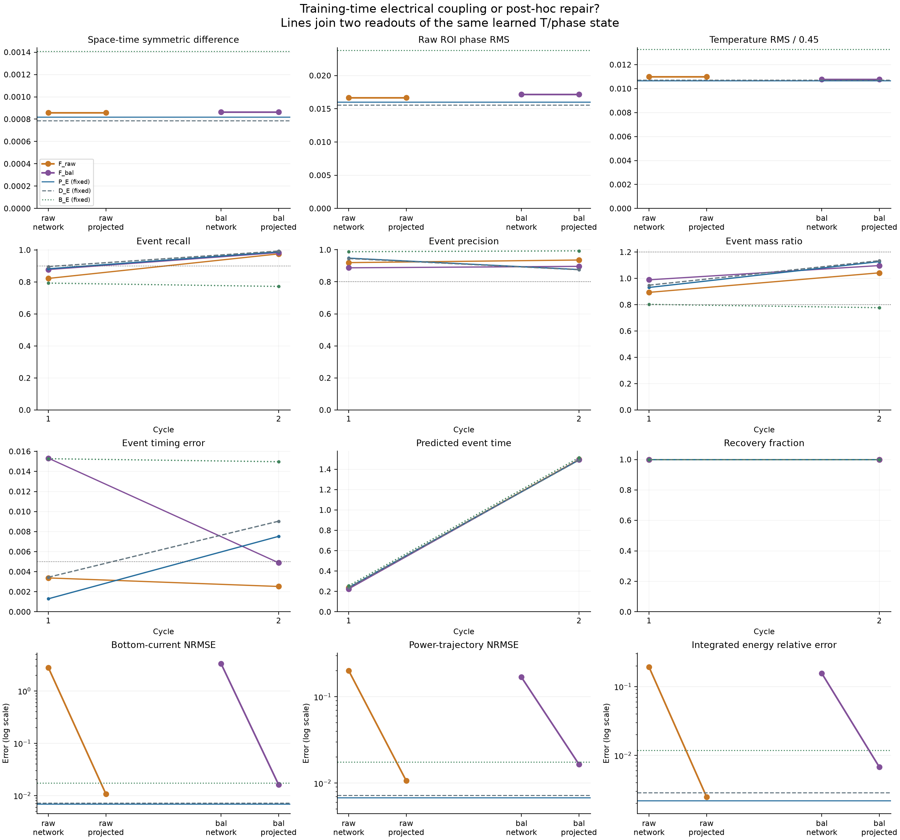
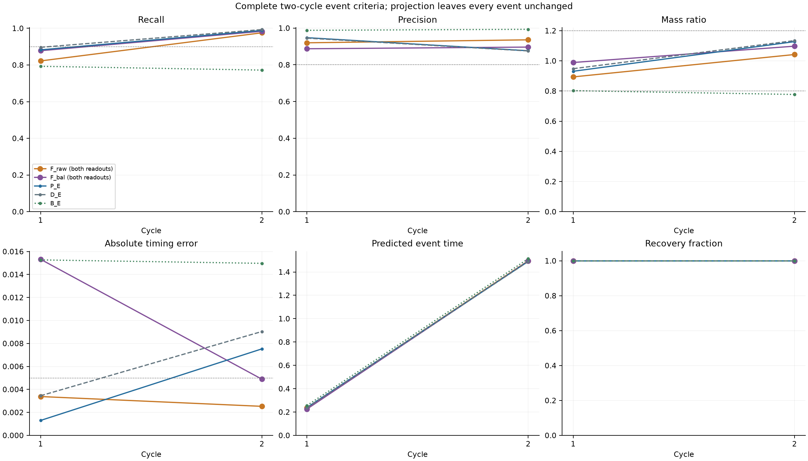
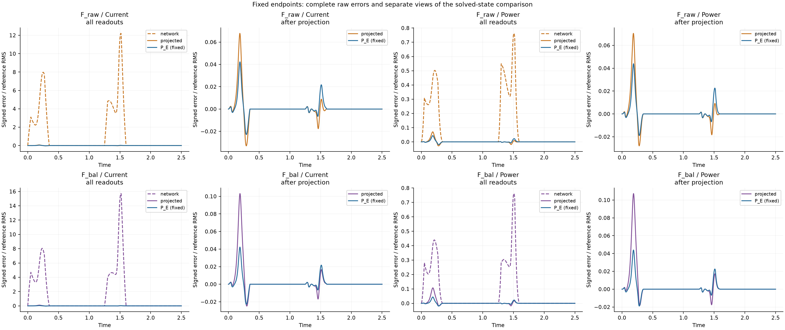

# Training-time electrical coupling versus post-hoc repair in sparse phase-change reconstruction

Working manuscript, 2026-09-14. Completed local V30 comparison (campaign started 2026-09-13). V28/V29 and their historical conclusions are preserved.

## Abstract

An electrically solved prediction may be accurate because learning produced a better state, because its final voltage was repaired, or both. We separate these possibilities in a synthetic two-dimensional electrothermal phase-change cell. The existing eliminated P_E model is compared with two soft electrical PINNs using the same sparse observations, thermal/phase residual interface and prescribed optimization caps. A single reference-blind gradient rule fixes the second electric weight at 0.02549394. Both soft endpoints retain a direct network readout and a projected readout obtained by solving voltage at exactly the same learned temperature and phase. The fixed eliminated method passes layer B against both projected soft controls. Current/power errors are lower by 35.22%/35.99% and 56.85%/58.70% against the two projected controls, respectively. Phase-reconstruction layer A and full strict device usability are not established. Complete field, two-cycle event and current/power metrics distinguish prediction increments from identities of the electrical solver. The analysis also shows why projection necessarily lowers discrete total dissipation at fixed conductivity without guaranteeing a smaller reference error. The result concerns one inherited parent and exposed nominal observations; initial voltage maps and active parameters differ between training methods. The independent value of remaining thermal/phase PDEs, clean-initialization robustness and oxide-device calibration are not established by this experiment.

## 1. Scientific question and related methods

Electrical consistency can arise during learning or through a numerical correction after learning. These operations need not produce the same temperature and phase fields. We test whether the positive reconstruction achieved by an electrically eliminated model can also be obtained by a soft electrical PINN followed by an identical electrical solve at inference. The distinction matters because a large reduction in current error after solving for voltage does not, by itself, establish a better learning algorithm or a better coupled thermal/phase trajectory.

The retained evidence supplies three different controls. V28 replaced voltage at fixed T/phase and obtained a substantial electrical-readout repair; its trained D_E and P_E also outperformed B_E, an interpolant given the same electrical solve. V29 then measured the remaining thermal/phase residual gradients and increased their prescribed influence. This reduced their fixed residual modestly, with specific event changes, but did not establish a matched prediction increment over continued fitting. The present experiment targets training-time electrical coupling; it does not repeat the V29 strength sweep or claim that remaining-PDE necessity has already been proved.

The numerical ingredients have established precedents. [Um et al., Solver-in-the-Loop (NeurIPS 2020)](https://ge.in.tum.de/publications/2020-um-solver-in-the-loop/) train corrections through iterative PDE solvers and discuss the distribution of states encountered during training. Our stationary electrical constraint inside a coordinate-field reconstruction is a different setting; we do not introduce differentiable solver coupling itself. [Blondel et al., Efficient and Modular Implicit Differentiation (NeurIPS 2022)](https://proceedings.neurips.cc/paper_files/paper/2022/hash/228b9279ecf9bbafe582406850c57115-Abstract.html) provide a general optimality-map approach to implicit differentiation. The linear-system VJP used here is a specialization, not new implicit-differentiation theory. Composite-gradient measurement and ordinary Adam/L-BFGS likewise remain implementation tools, not separate novelty claims. The proposed contribution is the controlled distinction among electrical repair, learned state quality and independently useful physics in this two-dimensional phase-change problem.

## 2. Physical problem and information boundary

The synthetic dimensionless wall cell occupies [-1,1]×[0,1], with time in [0,2.5]. The centered bottom electrode |x|≤0.35 is grounded, the top electrode is driven by U(t), and other electrical faces are insulating. Each pulse rises linearly to 0.72 over local time [0,0.05], stays constant through 0.27 and decreases to zero at 0.35; the period is 1.25. Temperature is zero on the top and obeys ∂nT+0.25T=0 elsewhere. Phase has homogeneous Neumann conditions.

The frozen conductivity and phase kinetics are

\[
\sigma=\exp\{0.25T+\log(8)\phi^2(3-2\phi)\},
\qquad M(T)=0.5+4.5\operatorname{sigmoid}[(T-0.45)/0.08],
\]

\[
R_\phi=\phi_t-M(T)\left[\epsilon^2\Delta\phi
-2B\phi(1-\phi)(1-2\phi)-6D(T_c-T)\phi(1-\phi)\right].
\]

The thermal parameters are diffusivity α=0.1, cooling γ=4, latent ratio L=0.05 and Joule multiplier Q=4. Phase parameters are ε=0.04, B=1, D=6 and Tc=0.45. Initially T=0 and φ=0.02+0.01 exp{−[(x/0.18)²+((z−0.12)/0.10)²]/2}. These are inherited numerical-contract parameters, not an experimental calibration to a named oxide.

The [base numerical contract](../../configs/phk_v2/object_numerical_contract.json) and [active object overlay](../../configs/phk_v21/object_numerical_contract.json) preserve the parameter provenance and exact inheritance. No material, geometry or constitutive parameter is changed by this comparison.

Three independent 64×4 modified-MLP field heads and the existing smooth temperature adapter are retained. Their legal output maps include

\[
T=2.5(1-e^{-t/0.35})(1-z)\operatorname{sigmoid}(h_T),\qquad
\phi=\operatorname{sigmoid}\{\operatorname{logit}\phi_0+8(1-e^{-t/0.35})h_\phi\}.
\]

The original voltage representation preserves the drive-dependent range and exact top voltage; it does not enforce the complete bottom mixed boundary. No architecture or envelope is changed in this experiment.

All newly trained models inherit the exact V28 E0 parent, chosen by its original role and stored as `paper/paper_v28/evidence/parent.pt`. This is the earlier V27 D_I state, not the trained V28 D_E or a V29 endpoint. The sole label source remains the 21×11×126 sparse bundle; 231 analytic initial positions are counted separately from positive-time observations. V/T observation losses retain the spatial dual-volume and trapezoidal time measures. The phase loss retains the full initial-logit increment, the established scale and the equal mixture of global and visibly straddling-cell endpoint measures, with duplicate weights merged. Previously exposed observations are development data; deleting slices afterwards would not create a clean holdout.

Training receives sparse labels, coordinates, known physical laws and frozen unlabeled pools only. No dense teacher state, current or power label, new thermal/phase trajectory, full reference array or sealed stress enters training or endpoint selection. The common numerical reference and its 160×80 grid are evaluated locally after model freezing, artifact recovery and confirmed instance shutdown. They are neither continuum truth nor an independent blind case.

## 3. Shared electrical and thermal interfaces

On the 80×40 training grid, an internal face e between cells i and j has half resistances R_ei=d_ei/(σ_i A_e), R_ej=d_ej/(σ_j A_e) and conductance g_e=1/(R_ei+R_ej). Electrode faces retain half-cell resistance and the original heater overlap; insulating faces add no outward conductance. The assembly defines

\[
A(\sigma)v=f(U,\sigma).
\]

The eliminated method E uses the numerical solution, with a complete first-order implicit gradient. For Aᵀz=∂L/∂v, the indirect differential is zᵀ(df−dA v), including the conductivity dependence of the boundary RHS. Direct conductivity derivatives of Joule heat are also retained. No dense inverse or differentiable second-order VJP is assumed. Voltage observations in E consequently update T/phase through conductivity and the electrical solve.

Both soft controls instead use their trainable voltage head Vθ and the explicit cell residual

\[
r_{e,i}=[A(\sigma)V_\theta-f(U,\sigma)]_i/\omega_i.
\]

Their observations compare Vθ directly with the same sparse voltage labels. The matrix-vector operation, conductivity and heating remain fully differentiable; neither electrical forward nor adjoint linear solves occur during soft training. The electrode terms already reside in the face operator. No second electrical BC package is added, and the inherited BC/IC averaging denominators 13 and 3 are preserved even for satisfied or inactive terms.

The enforcement coverage also differs by construction. E solves all 3200 electrical cell balances at each used time. F computes the full explicit face operation but penalizes electric residuals on the original 128 sampled physical cells at each physical time; its fixed-stage sample is retained. Thermal/phase sampling and known physical information are matched, while exact full-grid electrical enforcement and sampled soft enforcement remain distinct. This is another component of the tested method package. A future full-grid soft electric average would be a separate control, not an unreported change to either current arm.

For either voltage function, I_e=g_e(v_i−v_j) produces local powers I_e²R_ei and I_e²R_ej. Electrode power enters its adjacent cell. Summing deposited power gives ∑ω_iq_i=P_J for any supplied voltage field; equality with electrode input power additionally requires electrical balance. The heat source is therefore consistent with the same face network, without assuming that a soft network voltage is already a solution.

The shared thermal residual is

\[
R_{T,i}=\partial_t(\bar T_i+L\bar\phi_i)+\gamma\bar T_i
-\frac{\alpha}{\omega_i}\sum_f A_f(\nabla T_\theta)_f\cdot n_{if}-Qq_i.
\]

Cell means use midpoint quadrature. Shared faces use the same AD gradient with opposite normals; physical boundary faces use the model gradient and the common thermal BC penalty. Q=4 appears once. The phase residual keeps M(T) outside its bracket. This is the V28 cell-balance interface, not an asserted equivalence to an earlier pointwise thermal residual or an autonomous monotonic phase-energy law. At prescribed U=0, voltage and Joule heat are analytically zero; thermal and phase training continues.

## 4. Matched training and paired inference

### 4.1 Fixed historical comparator and two new controls

E is the already completed V28 P_E endpoint with 1500 Adam updates and up to 300 complete fixed-target L-BFGS evaluations. It is reused without retraining or selection among later endpoints. The V28 D_E, E0 and B_E results are retained in the main table. V29 D_C/P1/Pκ have a different, longer optimization history and appear only as labeled background, never as the matched E comparator.

All new soft arms start from the same E0 weights and use fresh optimizers. E begins with a solved voltage while F begins with the original V head. Their T/phase functions and inherited adapter agree initially, but their initial voltage values, active parameter sets, voltage-observation maps and subsequent optimization paths differ. Consequently this comparison tests a training-method package. It is not an isolated removal of one VJP at otherwise identical intermediate states.

Write the common weighted observation-and-boundary target as

\[
C_F=L_{\mathrm{obs},F}/a_E+\lambda(5L_{\mathrm{BC}}+L_{\mathrm{IC}})/b_E,
\quad F_{T\phi}=\frac{\lambda}{3b_E}\mathbb E_\rho[(R_T/4)^2+(R_\phi/5)^2],
\quad E_e=\frac{\lambda}{3b_E}\mathbb E_\rho[r_e^2].
\]

The V28 aE/bE and all calibration, training and audit pools are reused. The residual measure is the original uniform spacetime measure represented by four weighted windows. λ ramps linearly to 0.1 during the first 200 Adam updates and stays fixed at 0.1 thereafter. F_raw minimizes C_F+F_Tφ+E_e; F_bal minimizes C_F+F_Tφ+η_bal E_e. No other term, parameterization, sampling rule or objective denominator differs between these two controls.

### 4.2 One reference-blind strength calibration

At E0 and λ=0.1, five scans form full weighted gradients for observation, BC/IC, thermal, phase and electric terms over every active soft-model parameter. Define

\[
G_0=\sqrt{\|g_o\|^2+\|g_b\|^2+\|g_T\|^2+\|g_\phi\|^2},\qquad
\eta_{\rm bal}=G_0/\|g_e\|.
\]

This root-sum-square reference is not the norm of their vector sum or an actual optimizer step. The coefficient is computed once, without reference errors, dynamic adjustment or an outcome-dependent cap. A 1e−12 identifiability floor and a numerical equivalence check against one were declared before calculation. Complete gradient vectors and their parameter layout are saved. An artificial small-grid check confirms both exact agreement with the inherited soft interface at η=1 and agreement between summed block derivatives, the full derivative and a finite parameter-direction difference. These are implementation checks, not independent scientific replications.

### 4.3 Frozen optimization and endpoint rule

Each new arm receives at most 1500 Adam updates (lr 1e−4, β=(0.9,0.999), ε=1e−8, clip norm 10), followed by 300 complete objective/gradient evaluations using fresh strong-Wolfe L-BFGS. Initial, repeated and trial closures all count. L-BFGS uses lr 1, one internal iteration per call, history 50, gradient tolerance 1e−10 and change tolerance 1e−14. Its full observations, 32-time integration pool, quadrature weights and objective stay fixed; it neither resamples nor clips the derivative inside a closure. A budget interruption rolls model and optimizer back to the last accepted state.

Both arms share random streams and checkpoint nodes Adam500/1000/1500. Fixed accepted endpoints alone enter the formal comparison. There is no endpoint selection by a field, event or device reference score and no arm-specific rescue. Numerical failure or an insufficiently optimized required control cannot establish E's superiority. The saved adjudication accepts the full cap or documented gradient convergence as completion; a failed line search or no accepted progress retains its diagnostic endpoint but does not become a successful opponent for the method claim. Actual evaluations, accepted steps, full-grid and face work are recorded separately. Equal update caps do not imply equal compute or a speedup.

### 4.4 Two readouts of exactly one learned state

For each soft endpoint, the `network` readout uses its own V/T/phase and explicit Joule deposition on the common 160×80 grid. The `projected` readout keeps the exact same T/phase arrays and recomputes only voltage and Joule heat from their conductivity, prescribed U and known boundaries. It does not fit a voltage label, optimize a parameter or solve a new thermal/phase trajectory. Each nonzero drive time requires one electrical forward solve; zero-drive times are analytic. The cap is 278 solves per endpoint and 556 total, with no inference adjoint.

The soft electric residual is trained on 80×40 cells, while every formal readout uses 160×80 cells. Its direct network-voltage defect can therefore include representation and discretization-transfer effects. Comparing E only with that raw readout would not isolate learning. The primary projected comparison gives both methods the same fine-grid electrical procedure; this matching is not an independent grid-convergence study.

The three contrasts answer different questions:

| Contrast | Identified comparison | Limitation |
|---|---|---|
| E versus F/network | Whole trained method and raw electrical readout | Combines state learning with electrical consistency |
| F/projected versus F/network | Fixed-state electrical repair | Cannot improve the unchanged phase field or event set |
| E versus F/projected | Training-method effect surviving the same inference solve | Includes initialization/parameterization/optimization-path differences, not only the implicit gradient |

Projection is not asserted to repair the full thermal/phase dynamics retrospectively. In particular, changing q after learning need not make the unchanged T/phase functions satisfy the training heat balance. Exact T/phase equality across paired arrays, S, phase/temperature errors and complete event summaries is checked explicitly.

There is also an exact algebraic reason to separate dissipation reduction from prediction improvement. For positive conductances on the connected, electrode-anchored face graph, the total deposited power at any cell voltage v is

\[
\mathcal P(v)=v^TAv-2v^Tf+C(U,\sigma).
\]

The projected voltage v† satisfies Av†=f, giving

\[
\mathcal P(v)-\mathcal P(v^\dagger)
=(v-v^\dagger)^TA(v-v^\dagger)\geq0.
\]

This conditional discrete identity follows by expansion with fixed σ, electrode voltages and geometry; it is not new variational theory. It predicts lower or equal total Joule power after projection at each time, but not smaller error relative to an external reference, lower heat in every cell or a better thermal trajectory. The saved power traces supply a numerical sign check only, without an additional matrix reconstruction, solve or change to the A/B decision. At zero drive both voltages are analytically zero.

## 5. Evaluation and claim rules

The original metrics and domains are preserved: full-domain spacetime symmetric difference S, raw ROI phase RMS Eφ, ROI temperature RMS divided by 0.45 (ET), unscaled full-domain voltage RMS (EV), current NRMSE, power-trajectory NRMSE, integrated energy error and local Joule-density error. Formal EV is not the historical visible-data RMS divided by 0.72 used for a fitting gate. A small volume voltage error does not certify boundary flux. Integrated energy can hide signed temporal cancellations, so it cannot replace the power trajectory.

Layer A requires at least 10% lower S and Eφ, with no more than 5% degradation in ET/EI/EV subject to the inherited near-zero tolerances. Layer B requires at least 10% lower bottom-current and power-trajectory NRMSE while preserving S/Eφ/ET/EV/EI within the same limits. The original explicit absolute floors remain in the frozen configuration. These are practical-effect predicates on fixed endpoints, not significance tests over seeds.

Training-time coupling is supported only if E passes the **same layer** against both valid, complete F_raw/projected and F_bal/projected. Passing A against one and B against the other cannot be combined into a success. Raw-network victories alone and an invalid comparator also cannot satisfy this claim.

Strict device usability is evaluated separately. Both cycles must retain recall≥0.9, precision≥0.8, mass ratio in [0.8,1.2], timing error≤0.005 and the inherited intrinsic-event and recovery conditions; the global phase maximum must also reach 0.9. All values are reported; no rounding, alternative event definition or retrospective threshold adjustment replaces a failure. Electrical conservation identities are related consequences of the same solved face system, not multiple independent prediction successes.

## 6. Results at the fixed endpoints

### 6.1 Actual calibration and execution

**VERIFIED.** The one-shot calibration gives G0=1.70912279, ||ge||=67.0403625 and ηbal=0.0254939372458. The unscaled electric-gradient norm is 39.225 times the prescribed root-sum-square reference. The balanced coefficient therefore reduces electrical pressure in this target; it is not an independently optimized hyperparameter or a measured Adam/L-BFGS update fraction.

| block | weighted_loss | norm |
|---|---|---|
| observation | 1.01286394 | 1.12969689 |
| boundary | 0.099459044 | 1.26607726 |
| thermal | 0.00692844208 | 0.204772007 |
| phase | 4.4277656e-05 | 0.0015694174 |
| electric | 4.07626607 | 67.0403625 |

The actual new totals are 3000 Adam updates, 600 complete fixed-target evaluations and 290 accepted L-BFGS steps. Training used 0 electrical forward and 0 adjoint solves. Paired projected inference used 557 actual forward solves with zero adjoints: 556 saved successful predictions and 1 discarded solve from the repaired inference assertion. The original 556-solve cap and any explicit recovery amendment are preserved separately. The five calibration scans are counted separately. Every terminal records the final accepted model and optimizer, including rolled-back trials.

| role | status | Adam | evaluations | accepted | forward | adjoint | projection | failed_projection | eta | full_grid_network | explicit_faces | thermal_phase_groups | observation_groups |
|---|---|---|---|---|---|---|---|---|---|---|---|---|---|
| F_raw | EVALUATION_BUDGET_EXHAUSTED_TRIAL_ROLLED_BACK | 1500 | 300 | 146 | 0 | 0 | 279 | 1 | 1 | 7800 | 7800 | 15600 | 43734 |
| F_bal | EVALUATION_BUDGET_EXHAUSTED_TRIAL_ROLLED_BACK | 1500 | 300 | 144 | 0 | 0 | 278 | 0 | 0.0254939372 | 7800 | 7800 | 15600 | 43734 |

The explicit network/face work in the table is genuine computation, even though F does not factor or solve an electrical system during training. The two F budgets are not pooled and described as equal compute to one E. Both training endpoints were recovered intact. The cloud inference assertion failed without changing T/phase; current-instance shutdown was confirmed before local CPU inference recovery and subsequent reference scoring. The original failed-job receipt remains separate from the completed local prediction receipt.

### 6.2 Field and device endpoints

**VERIFIED.** The fixed eliminated method passes layer B against both projected soft controls. A/B remain separate from strict device usability. The values below are normalized ratios where normalization is defined; Ephi and EV retain their original raw RMS definitions. Tables display nine significant digits, while decisions use the full stored precision. V29 rows have a longer and different training history and are not eligible matched controls.

| role | S | Ephi | ET | EV | EI | bottom_current_NRMSE | power_trace_NRMSE | energy_error | local_joule_NRMSE | strict_device_pass |
|---|---|---|---|---|---|---|---|---|---|---|
| E0 | 0.00112851563 | 0.0234146837 | 0.0124236964 | 0.00383119271 | 0.0255490439 | 0.0255490439 | 0.0264146359 | 0.0123561814 | 0.111024622 | False |
| D_E | 0.00078703125 | 0.0155821211 | 0.0107147352 | 0.00110883739 | 0.00724256918 | 0.00724256918 | 0.00721322841 | 0.00288198505 | 0.0424771836 | False |
| P_E | 0.0008190625 | 0.0159996773 | 0.0106622423 | 0.00108482431 | 0.00693818679 | 0.00693818679 | 0.00681730628 | 0.00218830694 | 0.0432858707 | False |
| B_E | 0.0014084375 | 0.0237697822 | 0.0132782551 | 0.00255844987 | 0.0172822894 | 0.0172822894 | 0.017562293 | 0.01184941 | 0.0981319028 | False |
| F_raw/network | 0.000858203125 | 0.0166913896 | 0.0109855392 | 0.00443234495 | 0.0492472553 | 2.793 | 0.201181324 | 0.192658977 | 5.10761169 | False |
| F_raw/projected | 0.000858203125 | 0.0166913896 | 0.0109855392 | 0.00175489131 | 0.0107111197 | 0.0107111197 | 0.0106512066 | 0.00249371223 | 0.06256156 | False |
| F_bal/network | 0.000862890625 | 0.0171664543 | 0.0107847749 | 0.00372828897 | 0.0568848231 | 3.32088205 | 0.168942334 | 0.15643199 | 3.71041314 | False |
| F_bal/projected | 0.000862890625 | 0.0171664543 | 0.0107847749 | 0.00241372938 | 0.0160777035 | 0.0160777035 | 0.0165053011 | 0.00677478353 | 0.073705359 | False |
| V29_D_C | 0.000781953125 | 0.0143587127 | 0.0102268278 | 0.00109020126 | 0.00725526014 | 0.00725526014 | 0.00719509624 | 0.00279652797 | 0.0399023375 | False |
| V29_P1 | 0.0007725 | 0.0142650985 | 0.0101227659 | 0.0011018174 | 0.00729715416 | 0.00729715416 | 0.00725088576 | 0.00276541019 | 0.0395942824 | False |
| V29_P_kappa | 0.00077140625 | 0.014253669 | 0.010022266 | 0.00114762709 | 0.00761998387 | 0.00761998387 | 0.00760610227 | 0.00290092219 | 0.0404053167 | False |

*Figure 1. Upper panels show field errors and all six two-cycle event quantities. Lower panels connect each fixed soft model's network and projected electrical readouts. Fixed P_E, D_E and B_E are retained. The final row uses logarithmic vertical axes so that raw errors and the smaller projected differences remain visible. Projection changes voltage/Joule heat but leaves all temperature/phase and event values unchanged; the two readouts are not independent trained models.*

### 6.3 Three contrasts and the same-layer rule

Negative percentage changes denote lower error. The A/B predicate uses the original absolute floors, whereas displayed ordinary percentage changes use the actual nonzero baseline. A victory against one soft configuration or victories on different layers cannot satisfy the declared training-coupling claim.

| candidate | baseline | A / B | ΔS | ΔEphi | ΔET | Δbottom current | Δpower | Δenergy |
|---|---|---|---|---|---|---|---|---|
| P_E | F_raw/network | A not passed / B PASS | -4.56% | -4.14% | -2.94% | -99.75% | -96.61% | -98.86% |
| P_E | F_raw/projected | A not passed / B PASS | -4.56% | -4.14% | -2.94% | -35.22% | -35.99% | -12.25% |
| F_raw/projected | F_raw/network | A not passed / B PASS | +0.00% | +0.00% | +0.00% | -99.62% | -94.71% | -98.71% |
| P_E | F_bal/network | A not passed / B PASS | -5.08% | -6.80% | -1.14% | -99.79% | -95.96% | -98.60% |
| P_E | F_bal/projected | A not passed / B PASS | -5.08% | -6.80% | -1.14% | -56.85% | -58.70% | -67.70% |
| F_bal/projected | F_bal/network | A not passed / B PASS | +0.00% | +0.00% | +0.00% | -99.52% | -90.23% | -95.67% |

Both required controls valid and complete: **True**. Same-layer support: A=**False**, B=**True**. The full Boolean gain and noninferiority components are retained in the [method decision](evidence/evaluation/method-decision.json); an overall failed layer does not erase its individual effects.

### 6.4 Complete events and electrical repair

**VERIFIED.** The paired field equality also preserves S, Ephi, ET and every event entry. Strict requirements use both cycles and remain independent of A/B. Their complete values, including timing and recovery, are:

| role | cycle | recall | precision | mass_ratio | timing_absolute | event_time | recovery_fraction |
|---|---|---|---|---|---|---|---|
| E0 | 1 | 0.865479946 | 0.793431109 | 1.09080667 | 0.0316666667 | 0.208933333 | 1 |
| E0 | 2 | 0.971115538 | 0.924718435 | 1.0501743 | 0.00468 | 1.49372 | 1 |
| D_E | 1 | 0.89646237 | 0.945348699 | 0.948287517 | 0.00345 | 0.23715 | 1 |
| D_E | 2 | 0.993276892 | 0.875548727 | 1.13446215 | 0.00904 | 1.48936 | 1 |
| P_E | 1 | 0.882492114 | 0.947846079 | 0.931050023 | 0.0013 | 0.2393 | 1 |
| P_E | 2 | 0.988545817 | 0.876669979 | 1.12761454 | 0.00752857143 | 1.49087143 | 1 |
| B_E | 1 | 0.792924741 | 0.98792813 | 0.80261379 | 0.0152714286 | 0.255871429 | 1 |
| B_E | 2 | 0.772161355 | 0.993432645 | 0.777265936 | 0.0149714286 | 1.51337143 | 1 |
| F_raw/network | 1 | 0.822217215 | 0.91995462 | 0.89375845 | 0.00338 | 0.23722 | 1 |
| F_raw/network | 2 | 0.97559761 | 0.936088878 | 1.04220618 | 0.00252857143 | 1.49587143 | 1 |
| F_raw/projected | 1 | 0.822217215 | 0.91995462 | 0.89375845 | 0.00338 | 0.23722 | 1 |
| F_raw/projected | 2 | 0.97559761 | 0.936088878 | 1.04220618 | 0.00252857143 | 1.49587143 | 1 |
| F_bal/network | 1 | 0.877872916 | 0.887471526 | 0.989184317 | 0.015325 | 0.225275 | 1 |
| F_bal/network | 2 | 0.983939243 | 0.896539989 | 1.09748506 | 0.00489090909 | 1.49350909 | 1 |
| F_bal/projected | 1 | 0.877872916 | 0.887471526 | 0.989184317 | 0.015325 | 0.225275 | 1 |
| F_bal/projected | 2 | 0.983939243 | 0.896539989 | 1.09748506 | 0.00489090909 | 1.49350909 | 1 |
| V29_D_C | 1 | 0.899166291 | 0.944161836 | 0.952343398 | 0.004075 | 0.236525 | 1 |
| V29_D_C | 2 | 0.997260956 | 0.876655357 | 1.1375747 | 0.00895714286 | 1.48944286 | 1 |
| V29_P1 | 1 | 0.902433529 | 0.944798301 | 0.955159982 | 0.00388 | 0.23672 | 1 |
| V29_P1 | 2 | 0.996638446 | 0.87831907 | 1.13471116 | 0.00863333333 | 1.48976667 | 1 |
| V29_P_kappa | 1 | 0.902884182 | 0.939727955 | 0.96079315 | 0.00464444444 | 0.235955556 | 1 |
| V29_P_kappa | 2 | 0.995891434 | 0.881723986 | 1.12948207 | 0.0076375 | 1.4907625 | 1 |

*Figure 2. The complete two-cycle event comparison is provided separately for readability. Dashed limits display existing requirements and do not select an endpoint.*

The fixed-state energy diagnostic reports actual deposited power rather than its error against the reference. Its sign is checked against the algebraic minimization property in Section 4.4; the quadratic matrix expression is not separately recomputed. This diagnostic does not contribute a new success gate.

| role | minimum_power_gap | numerical_tolerance | nonnegative_within_tolerance | network_integrated_power | projected_integrated_power | integral_power_gap |
|---|---|---|---|---|---|---|
| F_raw | 0 | 1.17870353e-10 | True | 0.510042986 | 0.428718432 | 0.0813245539 |
| F_bal | 0 | 1.17750571e-10 | True | 0.494550443 | 0.430549241 | 0.0640012021 |

*Figure 3. Signed bottom-current and Joule-power errors before and after projection, with fixed P_E. Each quantity retains an all-readout panel and a separate after-projection panel on its own explicitly labeled linear scale. The [electrical-defect table](tables/electrical-defects.md) separately preserves finite-volume balance, terminal mismatch and input-power defect. Integral energy error cannot replace the power trajectory, and related electrical identities are not independent empirical wins.*

### 6.5 Conditional numerical sensitivity

The conditional numerical-sensitivity decision is **NOT_TRIGGERED_MAIN_METHOD_SIGNAL_ESTABLISHED**. The frozen B layer passes against both valid complete projected controls. The predeclared numerical-sensitivity branch requires no main increment plus a next decision depending on the thermal interface; that prerequisite is false. Preserve the present interface and plan independent/strong-control confirmation instead.

Actual conditional electrical forward solves: 0; parameter gradients, adjoints, optimizer updates and new thermal/phase trajectories: zero. Its full reasoning and, if triggered, all fixed-function results are preserved in the [decision record](evidence/numerical-sensitivity-decision.json). No interface training follows automatically from that check.

## 7. Interpretation, limitations and next evidence

### 7.1 What the new positive result identifies

**VERIFIED.** Both required soft controls are valid fixed endpoints and completed 1500 Adam updates plus 300 complete fixed-target evaluations. E passes the same predeclared device-function layer B against both projected controls. Relative to F_raw/projected, its bottom-current and power errors are lower by **35.2244% and 35.9950%**; relative to F_bal/projected, they are lower by **56.8459% and 58.6963%**. All five specified noninferiority conditions pass in both comparisons. This is a positive result in the actual frozen comparison, not a victory over a missing, numerically invalid or unfinished opponent.

The absolute normalized errors give the scale of that result. E has **0.69382% current NRMSE and 0.68173% power NRMSE**, compared with **1.07111% / 1.06512%** for F_raw/projected and **1.60777% / 1.65053%** for F_bal/projected. The reductions therefore correspond to approximately 0.3773/0.3834 and 0.9140/0.9688 percentage points. The two projected soft controls already have fairly small device errors; the new claim is the improvement remaining after that strong repair, not the much larger contrast with their raw voltages.

**SUPPORTED_INTERPRETATION.** The result rejects the tested explanation that E's entire device benefit is supplied by the final electrical solve. Both sides of the primary comparison use the same fine-grid electrical operation, known boundaries and constitutive law. Their different predictions therefore reflect different learned T/phase states as seen through that common operation. This does not establish a lower global conductivity-field error, which was not scored, or isolate one causal parameter-gradient route. Initial voltage maps, active parameters, voltage-observation derivatives, electrical enforcement coverage and subsequent optimization paths are parts of the training-method intervention.

### 7.2 Post-hoc repair is effective, but it does not explain the whole result

**VERIFIED.** For F_raw, projection reduces bottom-current NRMSE from **279.3000% to 1.0711%**, and power NRMSE from **20.1181% to 1.0651%**. For F_bal the corresponding changes are **332.0882% to 1.6078%** and **16.8942% to 1.6505%**. Each pair retains exactly the same T, phase, S, Ephi, ET and cycle summaries. Projection is therefore an effective electrical-readout operation, not an improvement in the phase events or a new independent model. The raw scores are retained rather than overwritten.

E also has smaller local Joule-density error than the two projected controls: the reductions are **30.8108% and 41.2717%**. Its local-q NRMSE is about 4.3286%, versus 6.2562% and 7.3705%. This is additional field evidence consistent with the device result, not a proof that the unchanged soft-model thermal trajectory becomes dynamically correct after replacing q.

The algebraic dissipation argument and empirical accuracy comparison answer different questions. At fixed conductivity, projection minimizes total discrete Joule dissipation; both saved power traces obey the predicted nonnegative gap. Whether that lower dissipation is closer to the reference is a separate measured result. Terminal current equality, input-power agreement and the small solved electric residual are related properties of the same face system, not three independent reasons to claim success.

### 7.3 The positive device result does not imply an event Pareto improvement

**VERIFIED.** E lowers S by 4.5608%/5.0792% and raw phase RMS by 4.1441%/6.7968% relative to the two projected controls. These improvements do **not** reach the predeclared 10% layer-A effect. Layer A remains unpassed.

The complete event table contains a substantive tradeoff. E's first-cycle recall is **0.882492**, below 0.9, and its second-cycle timing error is **0.00752857**, above 0.005. F_raw and F_bal have smaller second-cycle timing errors, **0.00252857 and 0.00489091**, respectively. Their second-cycle precisions also exceed E's, although their other event weaknesses remain: F_raw has first-cycle recall 0.822217; F_bal has first-cycle recall 0.877873 and timing error 0.015325. No required new or primary historical endpoint passes the full strict device predicate. Better current/power and modestly lower phase RMS cannot replace these event-specific requirements.

### 7.4 What remains unproved about the physics and control strength

**UNKNOWN.** The independent predictive necessity of the remaining thermal/phase penalties remains unresolved. The retained V28 D_E control is close to E in device response and has slightly lower S/Ephi, and the V29 residual-strength intervention did not establish its frozen predictive increment. The new E-versus-F comparison includes these remaining residuals on both sides; it cannot retroactively turn E-versus-D_E into a positive ablation.

The one-shot coefficient eta_bal=0.02549394 gives a different, reference-blind soft control, not a claim that its weight is optimal. It reduces some raw electrical errors while worsening others and leaves larger projected device errors than eta=1. The five-block gradient calibration is neither a measured optimizer-update fraction nor sufficient evidence for a unique training failure mechanism.

One remaining alternative deserves a narrowly targeted control: E enforces all electrical grid equations at a used time, whereas F penalizes the existing sampled 128 cells. The new result is valid for that declared package. A full-grid electric soft penalty, using the already computed face residual and retaining the other samples and eta=1, would test whether electrical sampling coverage explains much of the surviving gap. Such a control is proposed for confirmation; it was not run or silently substituted here.

### 7.5 Paper claim and next evidence

The present defensible claim is: **in this inherited-parent, sparse nominal reconstruction, electrical elimination during hybrid-PINN training yields a predeclared device-function increment over two same-interface soft PINNs even after both receive the same electrical inference repair.** It is not a universal necessity theorem for elimination, an isolated VJP attribution, independent-initialization robustness, strict event usability, experimental oxide validation or a speedup claim.

The scientific story now connects the preserved evidence more directly: interface exposure and physics forgetting motivate separate event evaluation; the electrical interface repair establishes a sound readout; the equal-solver interpolation control establishes reconstruction value; and V30 separates post-hoc electrical repair from a training-method effect that survives it. The solver, implicit derivative, L-BFGS and scalar calibration are attributed ingredients of this story, not four newly invented algorithms.

The immediate priority is stronger confirmation of this bounded positive signal, with a coverage-matched soft control and two fresh initializations, while retaining D_E so that the thermal/phase-PDE question stays visible. Clean observation placement and a complete new pulse protocol follow without reusing contaminated weights. The numerical-sensitivity branch did not trigger, because its required absence of a main increment is false. No further module, training, case or stress experiment is authorized by this discussion.

## 8. Conclusion and availability

The fixed eliminated method passes layer B against both projected soft controls. The newly separated contrasts identify what is changed by a final electrical solve and what survives at a learned-state level. They preserve the earlier same-layer interpolation gains and the unresolved independent contribution of thermal/phase PDE penalties. Method-package evidence is distinct from a pure implicit-gradient attribution, strict event usability, independent-initialization confirmation and generalization to a complete new case.

The [claim matrix](claim_evidence_matrix.md), [selected evidence](evidence/README.md) and [reproduction guide](reproducibility.md) accompany this local manuscript. Full predictions remain in the original local run. The actual compute-closure receipt applies to this campaign; no old shutdown record or sealed stress is used. Publication and further scientific execution require their own authorization.

## Appendix A. Retained mechanisms and their evidence boundaries

These are results from the preserved releases, not reruns or independent replications of the present electrical-layer comparison.

| Evidence | Previously verified finding | Role in the present argument |
|---|---|---|
| Interface exposure | Recall gains 0.08984/0.04628/0.02524 in three sampling streams; quality retained in two | Event support can depend on where supervision is supplied; the streams share a model initialization |
| Physics continuation | Events deteriorated in all three streams; physics-objective ratios 0.01281/0.00512/0.71669 | Residual decrease and event preservation are separate; only two streams passed the declared residual-decrease threshold |
| Sparse four-arm comparison | D_B/P_U/P_I/P_M did not establish the prescribed joint increment | Persistent anchors, corrected sampling and calibrated phase weighting were tested under that earlier formulation |
| V/T fitting repair | Visible T error 17.8233%→1.1375%; fixed-reference ROI T error 28.2210%→1.7475% | A large fitting gap was repairable within the same temperature envelope; no adapter-only causal claim |
| V-only continuation | Visible V error 0.8215%→0.5618%; energy error 49.20%→28.28% at fixed conductivity | A controlled voltage intervention; the old 0.5% gate remained unmet |
| Contact-aware direct comparator | Energy error 2.1874%→0.6443% with no training or new field labels | Known geometry must be given to the strong comparator; this does not enforce insulation or the full PDE |
| V27 joint/normalized controls | Six valid endpoints; no declared A/B gain in the five tested contrasts | Smaller aggregate boundary and AD physics losses did not guarantee better contact current/power; normalized electric blocks did not resolve the tested tradeoff |

The detailed definitions and endpoint evidence remain in [V24](../paper_v24/README.md), [V25](../paper_v25/README.md), [V26](../paper_v26/README.md) and [V27](../paper_v27/README.md). Together they motivate the present controlled electrical interface. They do not turn generic fitting, sampling or conservation mechanisms into multiple independent innovations.

## Appendix B. Conditions connecting field, event and device error

These elementary consequences of the stated definitions explain the evidence chain; they are not proposed training modules or claims of new mathematical priority. No new numerical validation is implied.

**Threshold sets.** With a common positive measure mu, let A and Ahat be the phase-threshold sets at 0.5. For any delta>0, a disagreement outside the reference threshold band requires an absolute phase error of at least delta. Consequently,

\[
\mu(\widehat A\triangle A)
\leq \mu\{\lvert\phi-0.5\rvert\leq\delta\}
+\delta^{-2}\int\lvert\widehat\phi-\phi\rvert^2\,d\mu.
\]

The argument applies to a positive discrete quadrature as well as a continuous measure. It explains why the amount of near-threshold support matters. It is not legitimate to substitute the reported ROI phase RMS into a full-domain S bound when their domains or measures differ; nor does an integral-in-time S bound a time-uniform event error.

**Event time.** Let f(t) be the reference ROI phase fraction and tau its threshold. If f has a unique bracketed crossing t*, a consistently signed slope bounded away from zero by m on that bracket, and a prediction obeys a uniform fraction error at most epsilon there, a predicted crossing in the same bracket has timing error at most epsilon/m. Multiple crossings, tangency, missing recovery or insufficient temporal control invalidate that shortcut. No transversality constant or numerical timing guarantee is certified here. The explicit two-cycle timing and recovery measurements are therefore retained even when phase RMS improves.

**Device response.** On the same discrete face network with positive conductances, fixed geometry and fixed electrode voltages, the solved internal potential v* is stationary for the dissipated power P=sum_e g_e(Delta_e v*)^2 with respect to free voltage values. Along a differentiable conductivity perturbation at fixed drive,

\[
dP=\sum_e (\Delta_e v^*)^2\,dg_e.
\]

The implicit voltage term cancels by electrical stationarity, including electrode edges. This identity does not hold for an arbitrary inaccurate voltage field without the stationarity defect term. For the specified constitutive relation,

\[
d\log\sigma_i=\beta\,dT_i+6\log(R)\phi_i(1-\phi_i)\,d\phi_i.
\]

Thus comparable phase errors need not cause comparable power errors: temperature, local phase and the electrical voltage-drop pattern matter jointly. These are state-to-functional sensitivities at a solved electrical state, not residual-to-functional adjoints through the time-dependent thermal/phase dynamics. They cannot justify weighting a PDE residual by device sensitivity without that missing propagation argument. The zero-drive case is treated analytically, never by dividing power by zero voltage.
