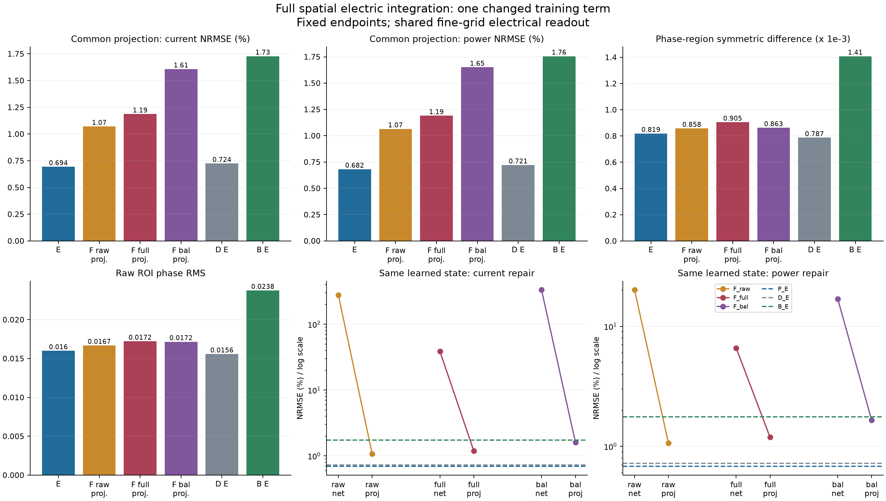
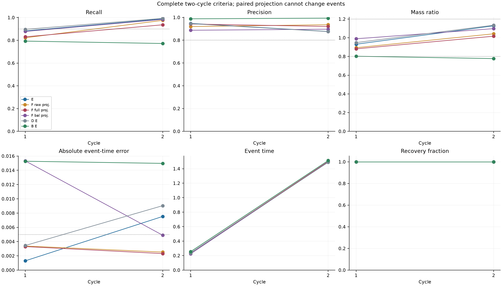
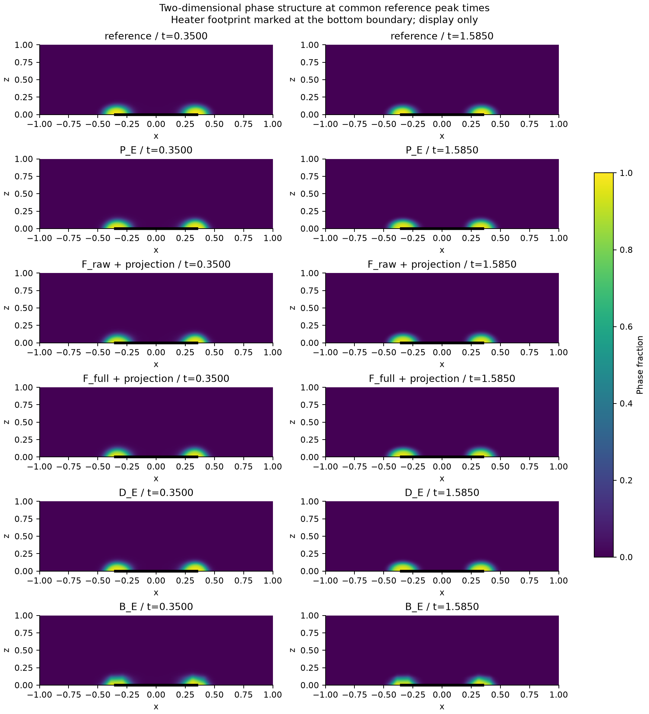
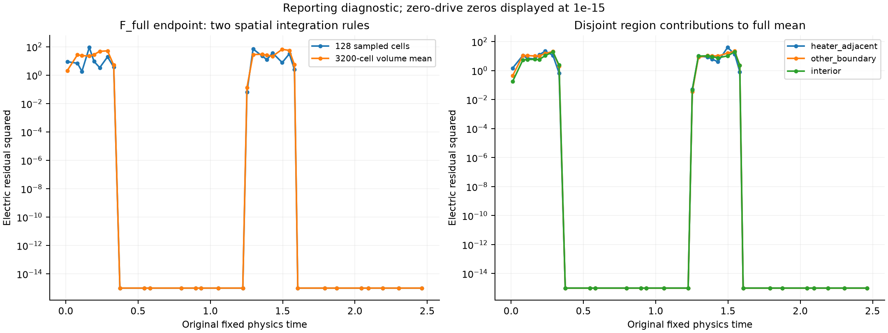
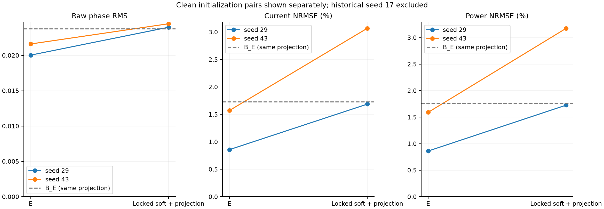

# Training-time electrical constraints beyond post-hoc repair in sparse phase-change reconstruction

Working manuscript, 2026-09-15. V31; fixed V30 and earlier results retain their original evidence boundaries.

## Abstract

A final electrical solve can repair voltage without improving a learned phase-change state. We examine training-time electrical elimination in sparse reconstruction of a synthetic two-dimensional electrothermal phase-change system, giving all compared states the same electrical projection at inference. Temperature and phase networks couple to an implicit electrical solve and consistent local Joule deposition, with explicit thermal and phase residuals retained in the PINN loss. A matched soft control replaces its 128-cell electrical-residual sample with the full 3200-cell volume mean at unchanged physics times. The fixed eliminated model retains the predeclared device-layer B advantage against this control and both existing projected soft controls; full spatial integration does not explain away that bounded result. Two fresh initialization pairs then compare E with the locked projected soft comparator. Current/power errors decrease by 49.15%/50.07% for seed 29 and 48.80%/49.85% for seed 43, with the original field noninferiority guards satisfied. The phase-layer A gate passes only for seed 29. Against a same-solver strong interpolant, seed 29 passes both layers while seed 43 falls below the unchanged 10% effect thresholds. Strict two-cycle usability remains unmet and adverse timing, recall and energy effects are retained. The evidence supports a limited training-method-package benefit, not isolated VJP causality, independent necessity of the remaining thermal/phase residuals, new-case generalization or experimental oxide-device validity.

## 1. Question, contribution and prior methods

The primary question is whether enforcing the electrical subproblem during learning changes the reconstructed state in a useful way after every method receives the same electrical solve at inference. This separates state learning from a strong numerical repair. The contribution is a controlled coupled-reconstruction method and its bounded evidence, not a new sparse solver, implicit differentiation formula, finite-volume rule or optimizer.

Differentiable solver coupling is established by [Um et al., Solver-in-the-Loop](https://ge.in.tum.de/publications/2020-um-solver-in-the-loop/). General implicit differentiation is addressed by [Blondel et al.](https://proceedings.neurips.cc/paper_files/paper/2022/hash/228b9279ecf9bbafe582406850c57115-Abstract-Conference.html). [Mitusch, Funke and Kuchta](https://arxiv.org/abs/2101.00962) study hybrid finite-element/neural PDE representations. We use these as methodological precedents, not evidence for our particular phase-change result. Hard constraints or differentiability alone do not establish a prediction advantage. Our distinguishing comparison gives soft electrical PINNs the same projection, then tests whether a full spatial penalty can account for the remaining difference.

The evidence sequence is electrical repair at fixed state, learned reconstruction against a same-solver interpolant, shared-projection training comparisons, the full spatial soft counterfactual, and conditional clean initialization confirmation. Earlier remaining-PDE strength experiments are retained as a limitation: they did not establish the independent predictive necessity of those residuals. Their inclusion in both current PINN losses is explicit and cannot be used as proof of that necessity.

## 2. Physical problem and information boundary

The synthetic dimensionless wall cell occupies [-1,1]×[0,1], with time in [0,2.5]. The centered bottom electrode |x|≤0.35 is grounded, the top electrode is driven by U(t), and other electrical faces are insulating. Each pulse rises linearly to 0.72 over local time [0,0.05], stays constant through 0.27 and decreases to zero at 0.35; the period is 1.25. Temperature is zero on the top and obeys ∂nT+0.25T=0 elsewhere. Phase has homogeneous Neumann conditions.

The frozen conductivity and phase kinetics are

\[
\sigma=\exp\{0.25T+\log(8)\phi^2(3-2\phi)\},
\qquad M(T)=0.5+4.5\operatorname{sigmoid}[(T-0.45)/0.08],
\]

\[
R_\phi=\phi_t-M(T)\left[\epsilon^2\Delta\phi
-2B\phi(1-\phi)(1-2\phi)-6D(T_c-T)\phi(1-\phi)\right].
\]

The thermal parameters are diffusivity α=0.1, cooling γ=4, latent ratio L=0.05 and Joule multiplier Q=4. Phase parameters are ε=0.04, B=1, D=6 and Tc=0.45. Initially T=0 and φ=0.02+0.01 exp{−[(x/0.18)²+((z−0.12)/0.10)²]/2}. These are inherited numerical-contract parameters, not an experimental calibration to a named oxide.

The [base numerical contract](../../configs/phk_v2/object_numerical_contract.json) and [active object overlay](../../configs/phk_v21/object_numerical_contract.json) preserve the parameter provenance and exact inheritance. No material, geometry or constitutive parameter is changed by this comparison.

Three independent 64×4 modified-MLP field heads and the existing smooth temperature adapter are retained. Their legal output maps include

\[
T=2.5(1-e^{-t/0.35})(1-z)\operatorname{sigmoid}(h_T),\qquad
\phi=\operatorname{sigmoid}\{\operatorname{logit}\phi_0+8(1-e^{-t/0.35})h_\phi\}.
\]

The original voltage representation preserves the drive-dependent range and exact top voltage; it does not enforce the complete bottom mixed boundary. No architecture or envelope is changed in this experiment.

Stage A inherits the exact V28 E0 parent, chosen by its original role and stored as `paper/paper_v28/evidence/parent.pt`. This is the earlier V27 D_I state, not the trained V28 D_E or a V29 endpoint. The sole label source remains the 21×11×126 sparse bundle; 231 analytic initial positions are counted separately from positive-time observations. V/T observation losses retain the spatial dual-volume and trapezoidal time measures. The phase loss retains the full initial-logit increment, the established scale and the equal mixture of global and visibly straddling-cell endpoint measures, with duplicate weights merged. Previously exposed observations are development data; deleting slices afterwards would not create a clean holdout.

Training receives sparse labels, coordinates, known physical laws and frozen unlabeled pools only. No dense teacher state, current or power label, new thermal/phase trajectory, full reference array or sealed stress enters training or endpoint selection. The common numerical reference and its 160×80 grid are evaluated locally after model freezing, artifact recovery and confirmed instance shutdown. They are neither continuum truth nor an independent blind case.

## 3. Electrical elimination and local heating

On the 80×40 training grid, an internal face e between cells i and j has half resistances R_ei=d_ei/(σ_i A_e), R_ej=d_ej/(σ_j A_e) and conductance g_e=1/(R_ei+R_ej). Electrode faces retain half-cell resistance and the original heater overlap; insulating faces add no outward conductance. The assembly defines

\[
A(\sigma)v=f(U,\sigma).
\]

The eliminated method E uses the numerical solution, with a complete first-order implicit gradient. For Aᵀz=∂L/∂v, the indirect differential is zᵀ(df−dA v), including the conductivity dependence of the boundary RHS. Direct conductivity derivatives of Joule heat are also retained. No dense inverse or differentiable second-order VJP is assumed. Voltage observations in E consequently update T/phase through conductivity and the electrical solve.

Both soft controls instead use their trainable voltage head Vθ and the explicit cell residual

\[
r_{e,i}=[A(\sigma)V_\theta-f(U,\sigma)]_i/\omega_i.
\]

Their observations compare Vθ directly with the same sparse voltage labels. The matrix-vector operation, conductivity and heating remain fully differentiable; neither electrical forward nor adjoint linear solves occur during soft training. The electrode terms already reside in the face operator. No second electrical BC package is added, and the inherited BC/IC averaging denominators 13 and 3 are preserved even for satisfied or inactive terms.

E solves all 3200 cell balances at each used time. Sampled F penalizes 128 cells at physics times; F_full changes only that spatial reduction to the volume mean over all 3200 cells. The original 128-cell draw and RNG advancement remain in place for the thermal and phase terms. No electric penalty is added at observation-only times. Thus full spatial integration does not equalize temporal enforcement, exact versus finite penalties, initial voltage or the observation-gradient map.

For either voltage function, I_e=g_e(v_i−v_j) produces local powers I_e²R_ei and I_e²R_ej. Electrode power enters its adjacent cell. Summing deposited power gives ∑ω_iq_i=P_J for any supplied voltage field; equality with electrode input power additionally requires electrical balance. The heat source is therefore consistent with the same face network, without assuming that a soft network voltage is already a solution.

The shared thermal residual is

\[
R_{T,i}=\partial_t(\bar T_i+L\bar\phi_i)+\gamma\bar T_i
-\frac{\alpha}{\omega_i}\sum_f A_f(\nabla T_\theta)_f\cdot n_{if}-Qq_i.
\]

Cell means use midpoint quadrature. Shared faces use the same AD gradient with opposite normals; physical boundary faces use the model gradient and the common thermal BC penalty. Q=4 appears once. The phase residual keeps M(T) outside its bracket. This is the V28 cell-balance interface, not an asserted equivalence to an earlier pointwise thermal residual or an autonomous monotonic phase-energy law. At prescribed U=0, voltage and Joule heat are analytically zero; thermal and phase training continues.

## 4. Matched spatial counterfactual and inference

E is the fixed original P_E with 1500 Adam updates and 300 fixed-objective gradient evaluations. D_E and B_E retain their original roles; neither is retrained in Stage A. F_raw and F_bal are retained valid controls. The new F_full starts from their original E0, not a trained F endpoint. All remaining loss terms, original normalization a_E/b_E, lambda ramp over 200 updates to 0.1, random streams and observation information are shared.

For the explicit electrical residual r_e=(A(sigma)V-f)/omega, the sole change is

\[
J_{e,full}(t)=\frac{\sum_i\omega_i r_{e,i}^2}{\sum_i\omega_i},\qquad
L_{full}=C_F+F_{T\phi}+\frac{\lambda}{3b_E}\sum_t m_tJ_{e,full}(t).
\]

The uniform 80 by 40 grid makes this exactly the mean of 3200 squared residuals. It is not a 25-fold loss increase. At a fixed function, the old uniform sample mean estimates this spatial target; the finite random and fixed spatial samples still lead to different optimization trajectories. Both thermal and phase residuals continue using the same original 128 cells, and no electric term is added to times used only for observations. The experiment identifies this one integration change, not all differences between electrical elimination and a soft penalty.

Each new soft run uses the inherited Adam recipe and fresh strong-Wolfe L-BFGS. Every initial, repeated and trial gradient evaluation counts. Complete observations and the original fixed integration pool define the L-BFGS objective; accepted-state rollback preserves both model and optimizer if the cap interrupts a trial. The fixed endpoint is not selected using reference performance. Actual counts are reported below; no speedup or equal-compute claim follows from equal optimization caps.

The raw network readout is retained. Projected inference recomputes only V and q from exactly the same T/phase on the 160 by 80 evaluation grid. It adds no labels and solves no thermal/phase trajectory. Positive conductances make the discrete Dirichlet power difference (v-v_dagger)^T A (v-v_dagger) nonnegative at fixed conductivity, but this does not guarantee a lower reference error. Paired T/phase arrays, S/Ephi/ET and complete events agree exactly. Electrical conservation identities are not counted as separate independent empirical benefits.

For a fixed conductivity, geometry and applied voltage, let r=Av-f and v_dagger=A^(-1)f. The positive-definite electrode-anchored matrix gives the conditional identity

\[
\mathcal P(v)-\mathcal P(v_\dagger)
=(v-v_\dagger)^T A(v-v_\dagger)=r^T A^{-1}r.
\]

In contrast, the full-grid penalty measures the squared volume-scaled residual. On a uniform N-cell grid of cell volume omega, J_e=||r||^2/(N omega^2). Its relation to the power gap depends on the spectrum of A; they are not the same metric. These elementary fixed-conductivity relations do not prove which directions training follows, and they do not apply as a monotonic comparison between learned states with different conductivity. No new adjoint, spectral scan or residual-weighting method is introduced by this explanatory derivation.

## 5. Metrics, comparator choice and confirmation

The original A/B rules are unchanged. A requires 10% improvement in S and raw Ephi with the inherited field guards. B requires 10% current and power-trajectory improvement with S/Ephi/ET/EV/EI within 5%, subject to original absolute floors. Current and power are normalized RMS errors; formal EV remains unscaled voltage RMS. Absolute errors, percentage-point differences and relative changes are all retained. Failure to pass a 10% effect gate is not an equivalence test.

Strict device criteria remain separate: both cycles require recall at least 0.9, precision at least 0.8, mass ratio 0.8–1.2 and timing error no more than 0.005, together with the inherited peak-phase, event and recovery conditions. Adverse event changes are not removed from the comparison.

For the next clean pair, a soft candidate is removed only when another has no larger projected current/power errors, at least one strictly lower beyond the 1e-6 numerical tolerance, and passes the original five field noninferiority guards against it. Exactly one nondominated complete candidate is required. This rule was frozen before the new reference scores. The single nondominated comparator is F_raw. This is a development-stage choice, not a result selected from the clean confirmations.

If enabled, seeds 29 and 43 start with fresh networks and the original zero-output T adapter. Each seed receives at most 2400 observation-only Adam updates and 600 fixed evaluations allocated 200 each to V/T/phase; no old weights, electric solves or reference-based fit gate enter parent creation. Each parent supplies one common new a_s/b_s, then branches into E and the locked soft with 1500 Adam and 300 fixed evaluations each. The initial voltage maps still differ. No new D_E or optional seed rescue is used by default. Two new seeds must not be pooled with the differently developed historical seed 17.

## 6. Results

### 6.1 Actual accepted endpoint and work

VERIFIED: F_full completed 1500 Adam updates and 300 complete objective/gradient evaluations, with 144 accepted L-BFGS updates. The stop reason is EVALUATION_BUDGET_EXHAUSTED_TRIAL_ROLLED_BACK. Training used zero electrical forward/adjoint linear solves; own-state projection used 278 forward solves and no adjoints. The current batch was recovered and its actual instance shut down before local reference scoring. These are saved execution facts, not independent replications.

### 6.2 Common projection, spatial integration and field effects

| role | valid | S | Ephi | ET | EV | EI | bottom_current_NRMSE | power_trace_NRMSE | energy_error | local_joule_NRMSE | strict |
|---|---|---|---|---|---|---|---|---|---|---|---|
| P_E | True | 0.0008190625 | 0.01599967728 | 0.01066224231 | 0.001084824307 | 0.006938186793 | 0.006938186793 | 0.00681730628 | 0.002188306939 | 0.04328587069 | False |
| D_E | True | 0.00078703125 | 0.01558212111 | 0.01071473519 | 0.001108837395 | 0.007242569184 | 0.007242569184 | 0.007213228405 | 0.002881985054 | 0.04247718362 | False |
| B_E | True | 0.0014084375 | 0.02376978221 | 0.01327825513 | 0.00255844987 | 0.01728228938 | 0.01728228938 | 0.01756229299 | 0.01184940996 | 0.09813190284 | False |
| F_raw/network | True | 0.000858203125 | 0.01669138958 | 0.01098553922 | 0.004432344951 | 0.04924725534 | 2.792999998 | 0.2011813241 | 0.1926589766 | 5.107611693 | False |
| F_raw/projected | True | 0.000858203125 | 0.01669138958 | 0.01098553922 | 0.001754891314 | 0.01071111974 | 0.01071111974 | 0.01065120658 | 0.002493712227 | 0.06256156003 | False |
| F_full/network | True | 0.000905078125 | 0.01722428775 | 0.01088826484 | 0.004836381119 | 0.04845267927 | 0.387535687 | 0.06610591612 | 0.06514554734 | 0.5466392651 | False |
| F_full/projected | True | 0.000905078125 | 0.01722428775 | 0.01088826484 | 0.001793807668 | 0.01186644635 | 0.01186644635 | 0.01190184462 | 0.0003617151 | 0.06668350474 | False |
| F_bal/network | True | 0.000862890625 | 0.01716645429 | 0.01078477488 | 0.003728288966 | 0.05688482311 | 3.320882053 | 0.1689423341 | 0.1564319896 | 3.710413142 | False |
| F_bal/projected | True | 0.000862890625 | 0.01716645429 | 0.01078477488 | 0.002413729381 | 0.01607770345 | 0.01607770345 | 0.01650530113 | 0.006774783532 | 0.07370535904 | False |

Against F_full/projected, E changes current/power errors by -41.5310%/-42.7206% relatively and -0.492826/-0.508454 percentage points. Against F_raw/projected, F_full changes the same errors by 10.7862%/11.7417%. These signed changes and the complete guard decisions are in the matched table. Same-layer support for E against all three projected controls: A=False, B=True.

The unprojected F_full is substantially better electrically than unprojected F_raw: bottom-current error falls from 279.3000% to 38.7536%, and power-trajectory error from 20.1181% to 6.6106%. Yet their projected ordering reverses, with F_raw lower on both device axes. Thus improved soft electrical compliance alone did not yield the best learned state under a common readout. This is one fixed training comparison, not a universal effect of full quadrature.

F_full/projected also has the smallest energy-integral error, 0.03617%, even though its power-trajectory error is higher. Integrating the absolute power error gives 0.77600% of reference energy. Defining cancellation as one minus the absolute signed error integral divided by the absolute-error integral gives 95.34%. E has 0.21883% energy error and 0.45031% integrated absolute power error. These values in [the time-aggregation table](tables/power-time-aggregation.md) show why a small energy error cannot replace the predeclared power-trajectory criterion. The cancellation is an arithmetic property of saved traces, not a causal decomposition of training.

### 6.3 Complete event consequences and spatial diagnostic

All event values, including costs, are retained in [the complete event table](tables/complete-events.md). The plotted points are the two cycles of one trajectory, not independent trials. Projection cannot change any event at fixed T/phase.

F_full increases first-cycle recall from F_raw's 0.822217 to 0.830667, but reduces second-cycle recall from 0.975598 to 0.936504. Both F_full timing errors, 0.00330 and 0.00232, pass the timing threshold; first-cycle recall remains below 0.9. E retains higher recall but fails second-cycle timing at 0.00752857. Consequently neither full spatial integration nor the B-layer method-package benefit establishes strict two-cycle usability or event-wise dominance.

The fixed F_full function has electric-residual integrals 5.77062059 under the original cell sample and 7.76733577 under the full volume mean. Heater-adjacent, other-boundary and interior contributions partition the full integral. This diagnostic reports spatial concentration; it does not replace formal device readouts or create a new admission gate.

### 6.4 Clean initialization confirmation

Two clean pairs were completed, starting from independent random networks with the zero-output temperature adapter. Each common observation-only parent was shared by its E and locked-soft branches. Historical seed 17 is excluded from this pair set.

| Seed | Readout | S | Raw Ephi | Current NRMSE (%) | Power NRMSE (%) | Energy error (%) |
|---|---|---:|---:|---:|---:|---:|
| 29 | E/projected | 0.00103007812 | 0.0200420628 | 0.858273 | 0.862489 | 0.275172 |
| 29 | F_raw/projected | 0.001225 | 0.0239867136 | 1.687845 | 1.727434 | 0.160928 |
| 43 | E/projected | 0.00113164062 | 0.0216191612 | 1.571784 | 1.592751 | 0.656891 |
| 43 | F_raw/projected | 0.0012525 | 0.0244820854 | 3.069658 | 3.175752 | 1.219116 |
| shared | B_E | 0.0014084375 | 0.0237697822 | 1.728229 | 1.756229 | 1.184941 |

[All field metrics](tables/clean-initializations.md), [paired absolute/relative effects](tables/clean-paired-effects.md), [all A/B adjudications](tables/clean-adjudication.md), [complete clean-seed events](tables/clean-complete-events.md), [common fitting and scales](tables/clean-common-fit.md), and [actual branch counts](tables/clean-execution.md) report every new pair separately.

Seed 29: E versus projected soft passes A=True, B=True; current/power errors decrease by 49.1498%/50.0711%. Against B_E, E passes A=True, B=True.

Seed 43: E versus projected soft passes A=False, B=True; current/power errors decrease by 48.7961%/49.8465%. Against B_E, E passes A=False, B=False.

VERIFIED: the device-layer B effect survives both clean initialization pairs against the locked projected soft comparator. This is the bounded confirmation obtained here. Phase-layer A passes only for seed 29: seed 43 improves S by 9.64945%, below the unchanged 10% effect gate, although its raw phase error improves by 11.69396%. Relative to B_E, seed 29 passes A and B; seed 43 has favorable field and device directions but its phase/current/power improvements are only 9.04771%/9.05231%/9.30851%, so neither original layer passes. No rounding, pooled average or replacement of the baseline changes those decisions. Thus the strong-interpolant effect threshold is not confirmed across both initializations.

The event tradeoffs remain substantial. Seed 29 E increases cycle-2 recall but changes its timing error from the soft control's 0.0042375 to 0.00643333, crossing the 0.005 limit in the adverse direction. Its energy-integral error also increases from 0.160928% to 0.275172%, despite the lower power-trajectory error. Seed 43 E reduces cycle-1 recall from 0.840581 to 0.802726 while improving precision and timing; its cycle-2 precision is lower than soft. Both E endpoints have cycle-1 recall below 0.9 and both timing errors above 0.005. All four new learned states fail strict two-cycle usability. These costs rule out event-wise or all-metric dominance.

The two common parents have similar visible temperature RMS (0.88038% and 0.87733%, normalized by 0.45), but different voltage RMS (0.71989% and 1.06900%, normalized by 0.72). Their phase fits, representations and once-calibrated scales also differ. These saved differences contextualize initialization sensitivity; they do not isolate poor V fitting as its unique cause. No reference outcomes from seed 29 were used to tune seed 43, and no seed rescue was performed.

These two outcomes support only a bounded assessment of initialization sensitivity; they do not identify a population success probability, a precise confidence interval, a clean observational holdout or new-case generalization. All event values and adverse effects remain in the corresponding tables.

## 7. Interpretation, scope and next scientific decision

SUPPORTED_INTERPRETATION: a difference remaining after common projection concerns the learned T/phase state and its derived conductivity, rather than only the final voltage solve. It still reflects a training-method package: initial voltage, active parameters, exact versus finite electrical constraints, temporal enforcement and observation-gradient maps differ. Full spatial averaging tests one important alternative explanation but cannot uniquely credit the implicit VJP.

The strong D_E control remains visible. The independent predictive value of the remaining thermal and phase residuals is UNKNOWN; neither the positive historical comparison to B_E nor a victory over a different soft electrical training package resolves that question. A complete coupled PINN claim needs an explicit recorded physics loss, as retained here, and cannot call generic fitting repair a separate PINN innovation.

This is a synthetic dimensionless two-dimensional phase-change-memory-inspired cell. It is not a material-calibrated oxide device, experimental result or continuum truth. Known equations and conditions permit a conventional full numerical solver; no necessity or speed advantage over that solver is claimed. New observation masks, complete protocols, material calibration and formal OOD require separate evidence. Adaptation to a case's own observations is not zero-shot generalization.

The most direct next question is whether the coupled method can retain its device and state gains over both the locked projected soft PINN and B_E on one complete new protocol. The current evidence motivates this bounded cross-case test while exposing the weaker strong-interpolant margin for seed 43. A proposed follow-up should freeze one protocol change, observations, parent fitting, methods, budgets and all metrics before its reference results are read; training on that case's own support is reconstruction/adaptation. No further nominal seed rescue or enlarged control matrix follows automatically from the present results. Strict event reliability remains a separate unresolved task; it must not be repaired by moving the timing or recall gates.
