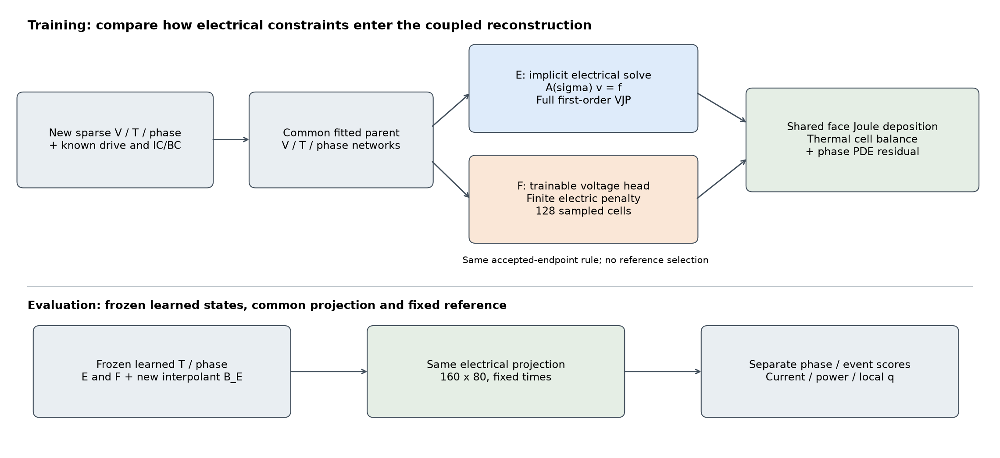
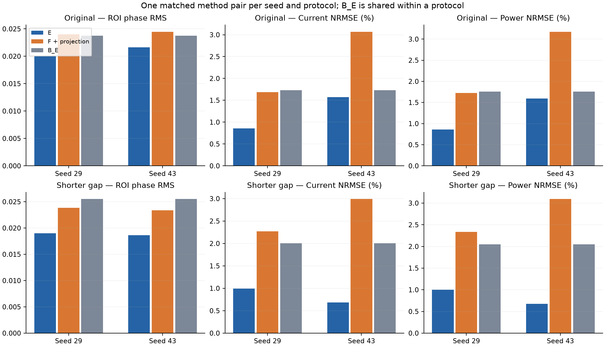
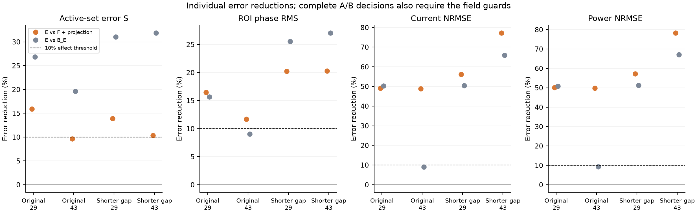
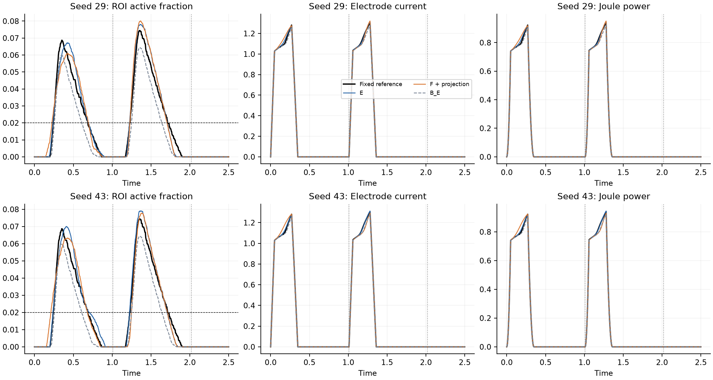
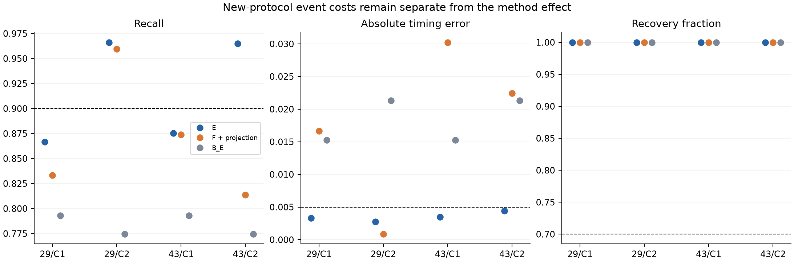
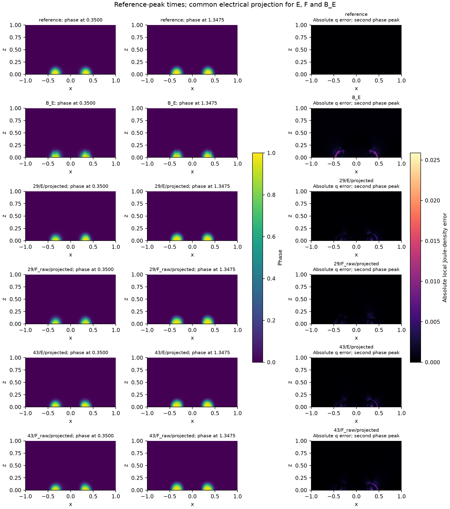

# Training-time electrical coupling under a finite pulse-history intervention

Working manuscript, V32, 2026-09-15.

## Abstract

We test training-time electrical elimination in sparse reconstruction of a two-dimensional synthetic electrothermal phase-change cell, using identical electrical projection for the compared learned states. A finite two-pulse intervention advances the second pulse from 1.25 to 1.01 while retaining the total observation domain and sampling phase. Two clean initialization pairs use the locked soft electrical PINN and a newly computed same-solver interpolant. Both new pairs pass device-layer B against the projected soft comparator. Both new pairs also pass B against the same-solver interpolant. Both pairs also pass the phase-reconstruction layer A against both controls. Relative to projected soft PINNs, phase RMS error decreases by 20.22% and 20.31%, and power NRMSE falls from 2.335% to 0.999% and from 3.095% to 0.673%. Both learned states satisfy the two timing thresholds but miss the first-cycle recall threshold. The evidence concerns a coupled training-method package under case-specific adaptation; it does not isolate implicit-gradient causality, establish the independent necessity of every retained PDE term, or validate an experimental material.

## 1. Scientific question and method contribution

Can training-time electrical constraints improve sparse phase-change reconstruction after every state receives the same electrical solve at inference, and does that benefit persist when the second pulse arrives earlier? The method combines temperature/phase networks, an implicit electrical layer and a consistent local Joule interface. Its contribution is the evidenced coupled reconstruction method, rather than a claim that sparse solvers, implicit differentiation, finite volumes or Adam/L-BFGS are individually new.

Differentiable solver coupling has precedents in [Um et al., Solver-in-the-Loop](https://ge.in.tum.de/publications/2020-um-solver-in-the-loop/), [Blondel et al., modular implicit differentiation](https://proceedings.neurips.cc/paper_files/paper/2022/hash/228b9279ecf9bbafe582406850c57115-Abstract-Conference.html), and [Mitusch et al., hybrid finite-element/neural representations](https://arxiv.org/abs/2101.00962). These previously checked sources describe tools and neighboring approaches; they do not validate this experiment. No new literature search or novelty priority claim accompanies the present confirmation.

The evidence sequence is fixed-state electrical repair, a common-projection training comparison, a full spatial soft-residual counterfactual, two clean initialization pairs, and the present complete new protocol. The strong no-remaining-PDE control D_E and negative remaining-PDE strength study stay visible. Explicit thermal and phase residuals are included in both current PINN losses, but their independent predictive necessity has not been established.

## 2. Physical model and finite-pulse intervention

The synthetic dimensionless wall cell occupies $[-1,1]\times[0,1]$ and $t\in[0,2.5]$. The centered bottom heater $|x|\leq0.35$ is grounded, the top receives $U(t)$, and the remaining electrical boundary is insulating. The top temperature is zero, other thermal boundaries satisfy $\partial_nT+0.25T=0$, and phase has homogeneous Neumann conditions.

The original two pulse starts are 0 and 1.25. The new case uses exactly two starts, 0 and 1.01. Each pulse rises to 0.72 over local time 0–0.05, holds through 0.27 and falls to zero at 0.35. No periodic extension creates a third pulse at 2.02. The total time, pulse shape, material coefficients, geometry and known IC/BC stay fixed. The 0.24 displacement is twelve original observation intervals of 0.02, preserving sampling phase. A single [finite case specification](evidence/case-and-budget.json) controls generation, network waveform, quadrature windows, interpolation and evaluation.

Conductivity and phase kinetics remain

$$\sigma=\exp\{0.25T+\log(8)\phi^2(3-2\phi)\},\qquad
M(T)=0.5+4.5\operatorname{sigmoid}[(T-0.45)/0.08],$$

$$R_\phi=\phi_t-M(T)[\epsilon^2\Delta\phi-2B\phi(1-\phi)(1-2\phi)-6D(T_c-T)\phi(1-\phi)].$$

Here $\epsilon=0.04$, $B=1$, $D=6$, $T_c=0.45$. Thermal diffusivity is 0.1, volumetric cooling 4, latent ratio 0.05 and Joule multiplier 4. Initially $T=0$ and $\phi=0.02+0.01\exp(-[(x/0.18)^2+((z-0.12)/0.10)^2]/2)$. The [base numerical contract](../../configs/phk_v2/object_numerical_contract.json) and [object overlay](../../configs/phk_v21/object_numerical_contract.json) retain parameter provenance. This is a literature-inspired numerical object, not an experimentally calibrated oxide device.

The new support trajectory uses 80×40 cells, time step 0.0025 and saving every two steps. The fixed evaluation trajectory uses 160×80 cells, time step 0.000625 and saving every four steps. Both use the inherited coupled block and logit-Newton algorithms without clipping, changed tolerances or result-adaptive rescue. The unchanged causal prefix is checked against the original trajectory at the same resolution before the second pulse. This validates the generator interface; it does not require separately trained neural functions to have identical prefixes.

## 3. Information, networks and electrical coupling

The support mask remains 21×11×126. Its 231 analytic initial positions are recorded separately from 28,875 positive-time observed positions and 86,625 scalar V/T/phase labels. Only those observations, coordinates and known physical laws enter training. Full support fields, reference fields, teacher currents/power and sealed stress do not. Each new protocol model is fitted to its own support: this is complete-case reconstruction/adaptation, not zero-shot or formal OOD generalization.

Three independent 64×4 modified-MLP heads and the existing smooth, initially zero-output temperature adapter are unchanged. The output maps retain

$$T=2.5(1-e^{-t/0.35})(1-z)\operatorname{sigmoid}(h_T),\qquad
\phi=\operatorname{sigmoid}\{\operatorname{logit}\phi_0+8(1-e^{-t/0.35})h_\phi\}.$$

Soft electrical PINN F_raw retains its trainable range-preserving voltage head and exact top voltage. E instead obtains voltage from $A(\sigma)v=f(U,\sigma)$ on the 80×40 grid. The harmonic face conductance uses half resistances $R_{ei}=d_{ei}/(\sigma_iA_e)$ and $R_{ej}$, with $g_e=(R_{ei}+R_{ej})^{-1}$. Electrode half-cell resistances and heater overlap are shared.

E backpropagates through $A^Tz=\partial L/\partial v$, including $z^T(df-dA\,v)$ and the direct conductivity derivatives of heating. The conductivity dependence of the boundary RHS is retained; the implementation does not form a dense inverse or assume a second-order VJP. F_raw uses the complete explicit derivatives of the same network, with $r_{e,i}=(A V_\theta-f)_i/\omega_i$ penalized at 128 sampled cells and fixed weight $\eta=1$.

For either voltage, $I_e=g_e(v_i-v_j)$ deposits $I_e^2R_{ei}$ and $I_e^2R_{ej}$ in the adjacent cells. Electrode dissipation enters its boundary cell. Thus $\sum_i\omega_iq_i=P_J$ by construction, while equality with terminal input power also requires electrical balance. The shared thermal residual is

$$R_{T,i}=\partial_t(\bar T_i+0.05\bar\phi_i)+4\bar T_i
-\frac{0.1}{\omega_i}\sum_f A_f(\nabla T_\theta)_f\cdot n_{if}-4q_i.$$

Cell means use midpoint quadrature and common face nodes have opposite normals. The phase residual keeps $M(T)$ outside the bracket. At zero drive, E voltage and heating are analytically zero; off-state thermal/phase training continues. No autonomous monotonic-energy constraint is introduced.

E and F receive the same T/phase architecture, observations, other BC/IC package and residual interfaces. E voltage observations influence the state through conductivity; F voltage observations act on its voltage head. Initial voltage, active parameters, exact versus finite constraints, enforcement times and gradient maps therefore differ. The comparison identifies this method package, not isolated VJP causality.

The diagram shows the forward interfaces; optimization differentiates the complete active loss through each branch. The common projection changes the voltage and Joule readout while retaining each learned state. F also retains its unprojected readout as a separately named diagnostic.

## 4. Matched optimization and evaluation

Seeds 29 and 43 start from fresh random networks and the zero-output adapter. No old trained parent, optimizer or calibration is loaded. Each seed first receives the common observation-only recipe: 2400 Adam updates and 600 fixed full-observation evaluations, 200 for each field head. There is no new voltage fit gate and no seed rescue. Both branches start from that same new parent, with fresh optimizers and one shared calibration $a_{s,c},b_{s,c}$.

Each branch uses 1500 Adam updates, followed by at most 300 full fixed-objective/gradient evaluations with strong-Wolfe L-BFGS. All trials and repeated evaluations count; interruption restores the last accepted model and optimizer. The phase complete-logit observation scale, quadrature weights, residual scales 1/4/5, averaging denominators 3/13 and lambda ramp to 0.1 over 200 updates are unchanged. The new physical windows are [0,0.35], [0.35,1.01], [1.01,1.36], [1.36,2.5], with masses 0.14/0.264/0.14/0.456. Pools are paired within a case, not claimed identical across cases. Endpoints are fixed before reference scoring.

All projected readouts use the same 160×80 electrical layer at 1001 fixed times. F retains its network readout, and projection changes only V and q, with exactly identical T/phase and events. B_E interpolates only the new sparse T/phase using the frozen initial-logit/PCHIP and spatial rules, then uses the same electrical layer. It is computed once, shared across the two seeds and never counted as two independent baselines.

The ROI is $|x|\leq0.55$, $0\leq z\leq0.55$. Active phase means $\phi\geq0.5$. S is the full-domain, full-time volume/trapezoid mean of the absolute difference between predicted and reference active-set indicators; raw $E_\phi$ is the corresponding continuous-field RMS on the ROI. Event onset is the first upward crossing of ROI active fraction 0.02, with linear time interpolation. Support recall, precision and mass ratio use full-domain cell volumes and the inherited global trapezoid weights restricted to the two heating windows. They do not use the sparse training interface measure.

Layer A requires at least 10% improvements in both full-domain active-set discrepancy S and ROI raw phase RMS, with the original field noninferiority guards. Layer B requires at least 10% improvements in current and power-trajectory NRMSE, with S/Ephi/ET/EV/EI within 5%, subject to the unchanged absolute floors. EV is unnormalized voltage RMS; T is normalized by 0.45. Failure of an advantage gate is not evidence of equivalence.

For electrically projected states, $P_J(t)=U(t)I(t)$ to solve accuracy. The power error therefore weights the current error by the known drive; these are different time-weighted measures, not independent causal replications. Signed energy integration can additionally cancel errors from different parts of a pulse.

Strict usability is separate: each cycle retains recall≥0.9, precision≥0.8, mass ratio0.8–1.2, timing error≤0.005 and the inherited peak/locality/recovery requirements. New event-support windows are the two heating intervals. Recovery cycles are [0,1.01] and [1.01,2.02]; the tail [2.02,2.5] does not extend second-cycle recovery. An absent independent second event remains an absent-event result rather than a reason to replace the case. Pre-pulse ROI state/errors, per-pulse power and signed/absolute energy indicators, and second-cycle field/device errors are report-only diagnostics.

The retained endpoint gate also requires a legal field, maximum phase at least 0.9, a detected onset in each cycle, cycle peak ROI active fraction at least 0.02, peak full-domain/outside-ROI fractions at most 0.45/0.10, and recovery $(f_{peak}-f_{end})/(f_{peak}-f_{pre})\geq0.70$. These are the operational inherited evaluator conditions; the primary solver has its separately recorded numerical validity tests.

Two protocols × two initialization seeds form paired observations, not four independent physical cases. Historical seed17 has a different development history and is not pooled into this confirmation. Electrical conservation and total-deposition identities are not counted as independent empirical benefits; no speedup over a conventional full solver is claimed.

## 5. Results

### 5.1 Generator and actual execution

VERIFIED: both authorized main trajectories completed. Their pre-intervention fields agree with the same-resolution original trajectories within the reported floating-point differences. No output clipping, case replacement or result-based checkpoint selection was used. [Generator records](evidence/reference-generation/) and [actual work](tables/execution-budget.md) separate reference solving from training and inference. The current GPU batch was recovered and its instance shutdown confirmed before scoring.

### 5.2 Paired reconstruction and functional consequences

VERIFIED: Both new pairs pass device-layer B against the projected soft comparator. Both new pairs also pass B against the same-solver interpolant.

Seed 29: E versus projected F passes A=True, B=True; E versus B_E passes A=True, B=True. Current/power error reductions relative to F are 56.1967%/57.2078%. The corresponding E errors are 0.994297%/0.999332%.

Seed 43: E versus projected F passes A=True, B=True; E versus B_E passes A=True, B=True. Current/power error reductions relative to F are 77.1999%/78.2609%. The corresponding E errors are 0.682119%/0.672758%.

| protocol | seed | role | valid | S | Ephi | ET | EV | current_percent | power_percent | energy_percent | strict |
| --- | --- | --- | --- | --- | --- | --- | --- | --- | --- | --- | --- |
| Original | 29 | E/projected | True | 0.001030078125 | 0.02004206284 | 0.01060071952 | 0.001295806378 | 0.8582725577 | 0.8624890741 | 0.2751715952 | False |
| Original | 29 | F_raw/projected | True | 0.001225 | 0.02398671358 | 0.01093077045 | 0.002603774274 | 1.687844525 | 1.727433883 | 0.1609282899 | False |
| Original | 29 | B_E | True | 0.0014084375 | 0.02376978221 | 0.01327825513 | 0.00255844987 | 1.728228938 | 1.756229299 | 1.184940996 | False |
| Shorter gap | 29 | E/projected | True | 0.001086171875 | 0.01900241378 | 0.0110217226 | 0.001568101324 | 0.9942974635 | 0.999332059 | 0.2876060863 | False |
| Shorter gap | 29 | F_raw/projected | True | 0.00126125 | 0.02381846517 | 0.01169142801 | 0.003723513476 | 2.269913966 | 2.335316112 | 0.7066266555 | False |
| Shorter gap | 29 | B_E | True | 0.00157546875 | 0.02552352964 | 0.01280018905 | 0.003005663306 | 2.003185568 | 2.048938723 | 1.505930972 | False |
| Original | 43 | E/projected | True | 0.001131640625 | 0.02161916117 | 0.01033084555 | 0.002357294103 | 1.571784304 | 1.592750502 | 0.6568905729 | False |
| Original | 43 | F_raw/projected | True | 0.0012525 | 0.02448208541 | 0.01044669066 | 0.004647528898 | 3.069658261 | 3.175752258 | 1.219115597 | False |
| Original | 43 | B_E | True | 0.0014084375 | 0.02376978221 | 0.01327825513 | 0.00255844987 | 1.728228938 | 1.756229299 | 1.184940996 | False |
| Shorter gap | 43 | E/projected | True | 0.001073515625 | 0.01861922172 | 0.01096098004 | 0.00108025084 | 0.682118875 | 0.6727584644 | 0.1627178951 | False |
| Shorter gap | 43 | F_raw/projected | True | 0.001197734375 | 0.02336322444 | 0.0114088216 | 0.004585264154 | 2.991734597 | 3.094686327 | 0.2573604185 | False |
| Shorter gap | 43 | B_E | True | 0.00157546875 | 0.02552352964 | 0.01280018905 | 0.003005663306 | 2.003185568 | 2.048938723 | 1.505930972 | False |

Absolute differences, percentage points and relative changes are all preserved in [paired effects](tables/paired-effects.md). The [complete new adjudication](tables/new-protocol-adjudication.md) reports every gain and noninferiority component, including reverse comparisons. Sharing B_E across seeds does not duplicate its evidentiary sample count.

Relative phase RMS reductions against projected F are 20.2198% and 20.3054%; against B_E they are 25.5494% and 27.0508%. The current/power reductions against F correspond to 1.2756/1.3360 percentage points for seed29 and 2.3096/2.4219 points for seed43. Seed43's S reduction against F is 10.3711%, only 0.3711 percentage points above the effect threshold; that particular A decision should not be interpreted as a large margin. The B decisions and both comparisons with B_E have considerably larger margins. No statistical equivalence or population success rate is inferred.

### 5.3 Pulse history, events and aggregation

VERIFIED: the independent second reference event status is True. The four learned-state strict decisions (29 E/F, 43 E/F) are [False, False, False, False]. No absent event is repaired by changing the pulse or recovery window.

The [reference pre-pulse history](tables/reference-history.md), [model pre-pulse errors](tables/prepulse-state.md), [second-cycle metrics](tables/second-cycle.md) and [per-pulse energy table](tables/per-pulse-power-energy.md) describe the mechanism-relevant state. Signed integrated error is retained alongside its absolute value and the integral of absolute power error. Cancellation is an arithmetic property, not an independently identified training mechanism. All precision, recall, timing, mass and recovery values, including adverse changes, appear in the [complete event table](tables/complete-events.md).

The fixed reference has a warmer and less fully relaxed state before the earlier second pulse: ROI mean temperature changes from 0.00652461 to 0.01874612, and mean phase from 0.000482909 to 0.003972463. The maximum pre-pulse phase is 0.191788, still below the active-phase threshold 0.5; an independent second event is retained. Its latency from pulse start decreases from 0.2484 to 0.2168. Together with the roundoff-level agreement before the intervention, these observations support a response to altered pulse history within the numerical model. They do not isolate thermal from phase-memory mediation.

For E, cycle1/cycle2 timing errors are 0.003333/0.002775 (seed29) and 0.003490/0.004440 (seed43), all below 0.005. First-cycle recalls are 0.866607 and 0.875507, below 0.9, so strict two-cycle reliability remains unestablished. In seed29's second cycle, the soft timing error 0.0008375 is smaller than E's 0.002775. E's tail phase RMS also exceeds projected F's in both seeds; in seed43 the second-cycle temperature error is slightly larger. Global matched gains therefore do not imply uniform superiority over time or across all event quantities.

Second-pulse power NRMSE is 0.57314%/0.36588% for E versus 1.43205%/2.57795% for projected F (seeds29/43). Seed43 F has opposite signed pulse-energy errors, +0.00511674 and -0.00400099, yielding only 0.25736% total energy error despite 3.09469% power NRMSE. This measured cancellation explains why integral energy alone is an inadequate summary. Seed43 E also has some cancellation; its second-pulse signed energy error is -0.00000445 while its integral absolute power error is 0.00062146. All values are dimensionless.

### 5.4 Cross-case scope

The [same-seed error changes](tables/cross-protocol-error-changes.md) compare original and new protocols without pooling them as four independent cases. Identical initial random tensors are checked after execution in the evidence summary, while each protocol has its own observations, fitted parent, calibration and physical pools. A method may have a favorable matched effect but remain worse in absolute terms or miss the strong-interpolant threshold. These are distinct claims.

The [common-parent and calibration table](tables/common-parents-and-calibration.md) records fitting quality and the shared scales for all four protocol/seed combinations. Its visible errors describe the observation-only parent; a_s_c is subsequently calibrated through the eliminated electrical readout. Variation across these four records does not identify a unique cause of endpoint variation.

### 5.5 Two-dimensional state and local heating

All states are shown at the same two reference-cycle peak times; no model is selected for its most favorable slice. The heating-error panel uses the shared face deposition and a common scale. [All new readouts](tables/new-protocol-all-readouts.md) retain the unprojected soft values as well as common-projection results. Projection identities alone cannot certify the local q field.

### 5.6 Retained mechanism controls

These inherited controls are a separate development comparison, not extra clean-seed repetitions. D_E has lower phase error than the corresponding P_E and remains close on device errors; its strength blocks a claim that the remaining PDE terms have independently explained the benefit. F_full changes only electrical spatial reduction and receives the same projection.

| role | origin | S | Ephi | ET | EV | current_percent | power_percent | energy_percent | strict |
| --- | --- | --- | --- | --- | --- | --- | --- | --- | --- |
| E0 | inherited development comparison, not pooled with clean pairs | 0.001128515625 | 0.02341468375 | 0.01242369635 | 0.003831192706 | 2.554904392 | 2.64146359 | 1.23561814 | False |
| D_E | inherited development comparison, not pooled with clean pairs | 0.00078703125 | 0.01558212111 | 0.01071473519 | 0.001108837395 | 0.7242569184 | 0.7213228405 | 0.2881985054 | False |
| P_E | inherited development comparison, not pooled with clean pairs | 0.0008190625 | 0.01599967728 | 0.01066224231 | 0.001084824307 | 0.6938186793 | 0.681730628 | 0.2188306939 | False |
| B_E | inherited development comparison, not pooled with clean pairs | 0.0014084375 | 0.02376978221 | 0.01327825513 | 0.00255844987 | 1.728228938 | 1.756229299 | 1.184940996 | False |
| F_raw/network | inherited development comparison, not pooled with clean pairs | 0.000858203125 | 0.01669138958 | 0.01098553922 | 0.004432344951 | 279.2999998 | 20.11813241 | 19.26589766 | False |
| F_raw/projected | inherited development comparison, not pooled with clean pairs | 0.000858203125 | 0.01669138958 | 0.01098553922 | 0.001754891314 | 1.071111974 | 1.065120658 | 0.2493712227 | False |
| F_full/network | inherited development comparison, not pooled with clean pairs | 0.000905078125 | 0.01722428775 | 0.01088826484 | 0.004836381119 | 38.7535687 | 6.610591612 | 6.514554734 | False |
| F_full/projected | inherited development comparison, not pooled with clean pairs | 0.000905078125 | 0.01722428775 | 0.01088826484 | 0.001793807668 | 1.186644635 | 1.190184462 | 0.03617151 | False |
| F_bal/projected | inherited development comparison, not pooled with clean pairs | 0.000862890625 | 0.01716645429 | 0.01078477488 | 0.002413729381 | 1.607770345 | 1.650530113 | 0.6774783532 | False |

## 6. Interpretation and limits

SUPPORTED_INTERPRETATION: a method difference remaining after the same electrical projection concerns the learned T/phase state and its conductivity, not merely the final voltage repair. The new complete protocol supplies a test of history dependence within this fixed numerical material model. The observed pre-pulse state can contextualize changes in second-pulse behavior, but it does not uniquely identify an optimizer or gradient pathway as causal.

Historical controls remain consequential. Fixed-state electrical elimination repaired severe contact/readout errors; the full spatial soft penalty did not remove the historical projected-method advantage; two fresh nominal pairs supported B against soft, with the stronger B_E threshold passed only by seed29. D_E remains strong and remaining thermal/phase PDE necessity is UNKNOWN. Those facts are retained rather than replaced by the newest comparison.

UNKNOWN: isolated VJP causality, broad material or geometry transfer, population-level initialization success probabilities, continuum accuracy, and experimental oxide-device validity. Shared projection guarantees certain discrete electrical identities, not correct local heating or reference predictions. Sparse observations plus fully specified equations also admit conventional numerical solutions; no unmeasured solver replacement or acceleration claim is made.

The conditional time-refinement branch was not triggered. Seed43's A/S result is near its threshold, but the prespecified manuscript route depends on the B advantages against both controls, which have large margins; no observed time-discretization difference puts that route in question. The numerical trigger also requires such a decision-changing discrepancy. This decision does not establish temporal or spatial convergence, and the close A/S margin remains disclosed. See [conditional decision](evidence/conditional-decision.json). No further seed rescue, threshold change or automatic control expansion was performed.

The supported manuscript contribution is a coupled reconstruction method with a controlled comparison of training-time electrical enforcement versus post-training projection, a consistent local Joule interface, and individually reported initialization/protocol confirmations. The present outcome reaches the prespecified writing route. Further work should first consolidate this bounded claim and its physical-model scope, while retaining the event failures and the strong D_E counterexample, rather than adding untested modules to the contribution list.

## Reproducibility and evidence labels

VERIFIED denotes executed, saved numerical evidence and exact readout identities; SUPPORTED_INTERPRETATION denotes bounded explanations; HYPOTHESIS denotes untested extensions; UNKNOWN marks missing evidence. The [claim matrix](claim_evidence_matrix.md), [reproduction instructions](reproduction.md) and [evidence scope](evidence/README.md) distinguish local full trajectories from the curated evidence package. Historical manuscripts remain unchanged.
