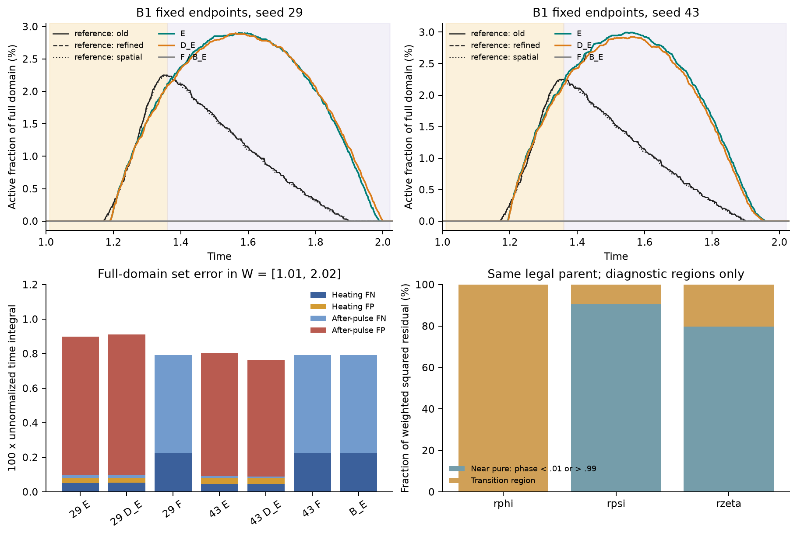
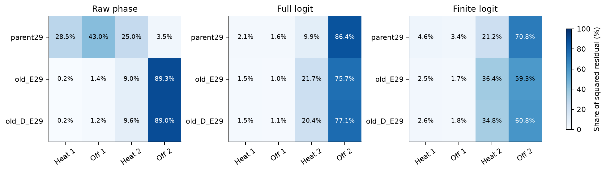

# 相态目标开发：本地证据与执行状态

任务 `PCM-20260922-RELATIVE-PHASE-MOMENTS-01`，执行日期 2026-09-23。新实验独立于已收口B1，不覆盖其0/12结论。

**VERIFIED_PHASE_MOMENTS_NO_INCREMENT_WITHIN_SCREEN_BUDGET — NO_INCREMENT_WITHIN_SCREEN_BUDGET。** 八臂数值有效且预算完整；所有候选均未对D和P建立原A_w增量。RIM相对D的W相态RMS改善1.918%、S改善2.202%；相对P分别改善2.264%、2.633%，低于原10%门。电热非劣与窗外代价不是此次失败原因。 见[完整结果、科学图和机制对照](results.md)。

## 已有数组事后分析

**VERIFIED：**七个B1对象 × 三参考，共21组160×80全域相态数组，按原阈值0.5分解缺测窗 W=[1.01,2.02] 的 S=FN+FP。加热[1.01,1.36]与随后[1.36,2.02]使用未归一化时间贡献，公共节点的梯形半权分别归属两段；总和逐组恢复原S，无新场推理或参考求解。

**VERIFIED：**E／D_E的加热后FP贡献占W总集合误差的88.20%—89.74%。原参考E29的贡献为：加热FN 0.00051758、加热FP 0.00029697、随后FN 0.00014102、随后FP 0.00803330；总和0.00898887，除以W长度1.01后恢复S=0.00889987。F与B_E的S可能更低，但来自整次事件漏检，不能解释为更好的相变重建。

**SUPPORTED_INTERPRETATION：**误差定位偏向加热结束后的多余活跃区域。原恢复指标仍通过，所以这里不能改写为“恢复门失败”，也不能仅凭分解认定梯度冲突或唯一训练根因。全部onset、recall、precision、mass ratio与recovery继续沿用既有事件表。

## 固定模型零更新诊断

诊断仅读取合法B1父态29与旧E／D_E29；使用由已知驱动划分、与参考无关的同一个panel池。分区阈值0.01／0.99只用于解释，不参与训练权重或采样。

| 模型 | raw残差能量近纯相份额 | 完整logit近纯相份额 | 有限logit近纯相份额 | 完整logit低于clip尺度的份额 |
|---|---:|---:|---:|---:|
| parent29 | 0.129% | 90.486% | 79.605% | 28.464% |
| old_E29 | 0.028% | 85.022% | 74.860% | 23.506% |
| old_D_E29 | 0.022% | 84.445% | 73.365% | 28.253% |

**VERIFIED：**可见φ标签中4502/17325（25.99%）需要原logit数值裁剪；这些标签承担父态相态观测损失的8.19%。这是无噪数值标签的变换处理，不是真实传感器噪声。

**VERIFIED（数学与数值）：**完整ψ包括空间初态及startup；rφ=s rψ和有限logit链式关系的值、参数梯度及饱和尾部导数均核验。保持潜热、T耦合、M(T)及原热面通量。局部点残差保留；零／一阶矩不能检测所有时间模式。21项聚焦与继承测试通过。

真实父态与固定制造场的8／16／32点求积均通过，保留8点。父态8→16最大目标相对变化8.16e-08，最大梯度范数相对变化8.61e-07，均显著低于预声明1%与5%门。一次32点检查在本地中断，无Python异常栈；小分块回归通过后复用8／16结果补齐，未改变点集或优化器轨迹。

## 冻结开发试验

共同B1父态29、可见标签、网络、物理与原a/b保持。D、P、L、R、I、RI、RIM、G各600 Adam + 最多100完整L-BFGS评估；P明确为新共享phase点集上的E_Q。八臂只有一个初始化，不是确认或formal OOD。

| 臂 | phase目标 | 父态固定系数 | 一次CPU完整目标/梯度耗时(s) | 正解/伴随 |
|---|---|---:|---:|---:|
| D | 无内部热/相态项 | — | 8.75 | 34/34 |
| P | raw点式 | 1 | 10.35 | 50/50 |
| L | 完整logit点式 | 0.000342331131 | 9.76 | 50/50 |
| R | 有限logit点式 | 0.000733832634 | 12.48 | 50/50 |
| I | raw点式+零阶矩 | 1.04361565 | 9.80 | 50/50 |
| RI | 有限logit+零阶矩 | 0.000740234932 | 11.46 | 50/50 |
| RIM | 有限logit+零/一阶矩 | 0.000734188868 | 8.90 | 50/50 |
| G | raw全局标量 | 0.508303361 | 8.44 | 50/50 |

以上是每臂首次CPU零更新测量，不是稳定速度比较。GPU训练成本另据实际日志报告。G只匹配一个指定的初始phase梯度范数；其系数约0.508，不能泛称“增大物理权重”，也不代表Adam更新等价。

首次测量因psutil未安装而缺少内存记录。采用系统自带计数，每臂在独立新进程中补做第二次且最后一次同父态完整目标／梯度计算；没有优化更新。两个profile共768正解和768伴随，第二次目标值逐臂与首次完全相同。峰值含进程导入、模型和完整梯度，不是孤立算子或GPU显存。

| 臂 | CPU进程峰值工作集 MiB | 计算后私有内存 MiB | 第二次耗时 s |
|---|---:|---:|---:|
| D | 331.27 | 1103.33 | 11.56 |
| P | 363.66 | 1135.06 | 9.99 |
| L | 364.67 | 1136.15 | 9.66 |
| R | 364.99 | 1136.76 | 9.74 |
| I | 367.91 | 1137.41 | 9.59 |
| RI | 367.67 | 1136.71 | 9.75 |
| RIM | 366.77 | 1133.68 | 16.52 |
| G | 364.68 | 1135.53 | 13.63 |

内存原始记录位于运行目录的profile-memory-各臂.json；两个profile的phase导数位置合计114688、phase空间二阶AD分量229376、phase端点查询12288。

**VERIFIED（初始尺度）：**在完整固定优化池、λ=0.1的零更新测量中，P的加权phase项为5.4308×10⁻⁵，占总目标0.00510%；RIM为2.1918×10⁻⁵，占0.00206%。[完整初始分量](parent-objective-components.csv)保留全部八臂。这一固定池独立于一次性校准池，因此不要求两池的loss配平完全相同。loss占比不等于梯度占比，也不能单凭此值认定优化无效或事后追加调权。

**VERIFIED（父态时间矩）：**同一校准池中，有限logit的零阶矩平方占点残差平方98.2702%，一阶矩平方占1.6328%；未校准Mζ/Pζ=0.99951479，Iζ/Pζ=0.99135099。这是离散Gauss量的数值分解，显示初始目标接近；不证明梯度方向相同、训练全程等价或时间矩普遍无效。

八个终点、共同原生读出及原参考评分均已完成，见[完整结果与机制对照](results.md)。另两参考、第二读出层和新seed未执行；后续安排依完整结果路由，不自动进入确认。

## 证据和来源

- [数组分解](evidence/saved-array-decomposition.csv)、[既有事件](evidence/saved-array-events.json)、[固定模型诊断](evidence/checkpoint-diagnostics.json)。
- [求积检查](evidence/quadrature.json)、[校准](evidence/phase-calibration.json)、[零更新工作量](evidence/profile.json)、[测试记录](evidence/tests.log)。
- [相态目标源码](../../pinn_pcm_sci/phk_v23_phase_moments.py)、[执行器](../../pinn_pcm_sci/phk_v23_phase_moments_run.py)、[冻结配置](evidence/frozen-config.json)。
- [公开证据范围与复现边界](evidence/README.md)说明精简包与本地原生数组的区别。
- [授权、三文档取舍与历史来源](../../docs/notes/2026-09-23-relative-phase-moments-authorized.md)。完整latent residual已见9月10日历史规划；不得主张本轮首次提出。
- Feng et al., *Integral Regularization PINNs for Evolution Equations*, Commun. Comput. Phys. 39(2):356–386 (2026), DOI [10.4208/cicp.OA-2025-0082](https://www.global-sci.com/cicp/article/download/23347/36216/37901)；定点阅读[预印本§3.1、式10—20](https://arxiv.org/html/2503.23729v1)。I为原变量区间残差的匹配适配，非原方法完整复现。
- Kharazmi et al., [VPINNs](https://arxiv.org/abs/1912.00873)，只核对摘要与元数据的Legendre测试／分部积分先例；Saleh et al., [ICML2024原始记录](https://proceedings.mlr.press/v235/saleh24a.html)，核对积分估计平方的偏差；De Ryck et al., [算子预条件化v2](https://arxiv.org/abs/2310.05801)，不作为当前非线性目标的现成保证。

## 已验证执行入口

项目Python 3.11／FP64，未升级依赖。以下四个模块按顺序执行并合计通过21项测试：

```powershell
.\.venv\Scripts\python.exe -m tests.test_phk_v23_phase_moments
.\.venv\Scripts\python.exe -m tests.test_phk_v23_b1
.\.venv\Scripts\python.exe -m tests.test_lf11_electrical_elimination
.\.venv\Scripts\python.exe -m tests.test_phk_v23_lf11_v_continue
```

数值准备与首次profile入口为 `python -m pinn_pcm_sci.phk_v23_phase_moments_run prepare`／`profile`；第二次内存profile为 `python -m cloud.phk_v23_phase_moments.profile_memory <arm>`。实际输出各自有防覆盖保护，不需为审阅重复运行。

GPU部署包固定源码及输入，见运行目录deployment-manifest.json与deployment-archive.json。`cloud/phk_v23_phase_moments/run_cloud.py`只按train→audit→readout执行同一任务；原生结果回收后，本地统一评分入口为 `python -m pinn_pcm_sci.phk_v23_phase_moments_evaluate`。本报告及图表由 `python paper/phase_moments_20260923/build_report.py`只读记录再生。新一轮科研复现须复制到另一个明确命名的运行目录并另行取得相应授权，不能覆盖当前终点。



四窗残差份额均按各模型／残差自己的平方积分归一化；不同坐标的绝对损失不可直接比较。可加的原始贡献和条件均值见[时间分布表](residual-time-distribution.csv)。为补齐此时间定位图，对相同三个固定模型与同一panel池补做了一次零更新导数读取，没有重采样、改权或优化器更新。



[可复用的方法段落及主张边界](method-and-claim-boundaries.md)同时给出下一工作稿的数据可用性更新措辞。
