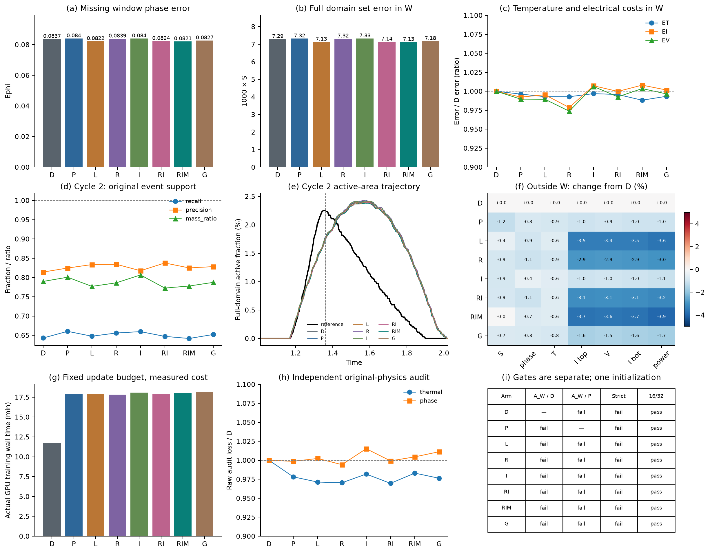
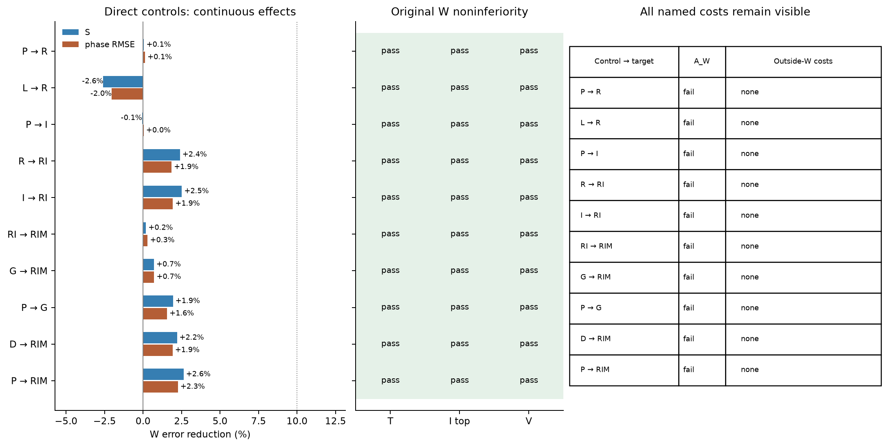

# 八臂开发试验：完整结果

**VERIFIED_PHASE_MOMENTS_NO_INCREMENT_WITHIN_SCREEN_BUDGET — NO_INCREMENT_WITHIN_SCREEN_BUDGET**

八臂数值有效且预算完整；所有候选均未对D和P建立原A_w增量。RIM相对D的W相态RMS改善1.918%、S改善2.202%；相对P分别改善2.264%、2.633%，低于原10%门。电热非劣与窗外代价不是此次失败原因。

### 科学裁决与机制边界

**VERIFIED：**56个有序内部比较的A_W、全轨迹A及B均无通过；这些比较不是56个独立样本。八个终点均未通过原严格双周期门。所有有序比较的七项窗外代价标志均为false，原非劣标准没有被放宽。

**VERIFIED：**RIM相对RI的S／Ephi改善仅0.187%／0.295%，相对简单完整logit控制L仅0.054%／0.139%，相对固定标量G为0.703%／0.718%。R相对L的S／Ephi反而增加2.589%／2.045%。RI相对R存在约2.394%／1.851%的连续改善，但仍未建立主门增量。I相对P的变化也很小。保留全部连续差异，不把它们称为显著性或模块必要性证据。

**SUPPORTED_INTERPRETATION：**本次固定预算没有支持完整组合、一阶矩、有限截断或相态度量的独立方法贡献。L和G都能获得与完整候选接近的小幅变化。这里不选择STATE_METRIC_ONLY_SIGNAL或GENERIC_INTEGRAL_OR_SCALAR_SUFFICIENT，因为没有候选先满足对D/P的原主问题。完整候选在W的S与Ephi数值最小也不足以触发确认。

### 剩余误差在哪里

**VERIFIED：**RIM第二周期onset为1.22715，原参考1.2268，时差0.00035；recovery=1仍通过。其recall=0.641734、precision=0.824945、mass ratio=0.777911，事件覆盖不足。活跃面积峰值出现在1.5425，原参考为1.3475；峰值时差0.195不等于原onset时差。RIM的W集合误差约78.24%来自加热结束后的FP；八臂该份额为78.24%—79.76%。不能因onset接近而宣称相态重建或严格事件能力成立，也不能把通过的恢复指标改写成失败。

**VERIFIED：**RIM独立原raw审计的热项／相态项为0.00611736／0.00300684。相对D分别变化−1.690%／+0.450%；相对P为+0.505%／+0.586%。这些是原尺度下的残差平方诊断，未新增一个事后物理成功阈值。

**SUPPORTED_INTERPRETATION：**初始phase损失占比很小，且短片上Mζ与Pζ已很接近，可以解释为什么本轮模块变化有限；这不是唯一优化根因的证明，也没有证明一般PINN、积分约束或更长预算都无效。

### 唯一后续动作

按预声明停止条件收口本轮，不追加训练、调权、片宽搜索、seed、第二读出或另外两参考复评分；没有触发阶段4确认申请。原论文的独立相态PDE贡献与严格事件能力仍未补齐。本轮不自动改写为D_E主导的窄稿。若继续追求更强方法创新，下一任务须提出真正不同且可区分的科学假设，并重新固定强控制、预期效应与停止条件；不能把本次失败简单改名或续跑。

同一个合法父态／seed29、原B1相态缺测条件；八个独立优化分支不是八个独立初始化。仅用既有原参考和共同160×80读出。W=[1.01,2.02]；S在全域积分，Ephi在原ROI计算。

| 臂 | W Ephi | W S | W ET | W EI | W EV | A_W 对D／P | 严格双周期 |
|---|---:|---:|---:|---:|---:|---|---|
| D | 0.08372554 | 0.007290377 | 0.01309988 | 0.0250845 | 0.004515535 | — / False | False |
| P | 0.08402212 | 0.007322672 | 0.01305129 | 0.024892 | 0.004468965 | False / — | False |
| L | 0.08223462 | 0.007133741 | 0.01300686 | 0.02496857 | 0.004468026 | False / False | False |
| R | 0.08391661 | 0.007318417 | 0.01300548 | 0.02454816 | 0.004397062 | False / False | False |
| I | 0.0839884 | 0.0073277 | 0.01305906 | 0.02526666 | 0.004544169 | False / False | False |
| RI | 0.0823633 | 0.007143216 | 0.01304371 | 0.02507956 | 0.004482353 | False / False | False |
| RIM | 0.08212006 | 0.007129873 | 0.01294567 | 0.02528719 | 0.004531365 | False / False | False |
| G | 0.08271367 | 0.007180345 | 0.01301305 | 0.02512665 | 0.004499991 | False / False | False |

原A_W要求S与Ephi同时达到10%及各自绝对容差，且ET／EI／EV各自非劣；连续改善或单项通过均不替代原门。窗外七项代价、全轨迹A/B和严格双周期另列，不能合并成一项胜负。

图中窗外色块报告相对D的连续百分比变化；实际代价标志仍使用原5%或绝对容差。raw审计在独立固定原残差池上执行，未用于调整端点。所有壁钟时间为此次单次测量，不是普遍加速比。第二周期事件onset、时差、recall、precision、mass ratio、recovery均见完整事件表。

箭头表示从控制到候选，正值是较小误差；没有统计显著性含义。RI相对R/I、一阶矩RIM相对RI与固定标量G分别检查，不能用总loss大小证明方法贡献。

## 实际工作量

| 臂 | Adam | 完整LBFGS评估 | 已接受LBFGS步 | 正解／伴随 | phase导数位置 | phase端点 | 训练分钟 |
|---|---:|---:|---:|---|---:|---:|---:|
| D | 600 | 100 | 46 | 4031 / 4031 | 0 | 0 | 11.75 |
| P | 600 | 100 | 47 | 6831 / 6831 | 1433600 | 0 | 17.87 |
| L | 600 | 100 | 47 | 6831 / 6831 | 1433600 | 0 | 17.90 |
| R | 600 | 100 | 47 | 6831 / 6831 | 1433600 | 0 | 17.82 |
| I | 600 | 100 | 47 | 6831 / 6831 | 1433600 | 358400 | 18.10 |
| RI | 600 | 100 | 47 | 6831 / 6831 | 1433600 | 358400 | 17.94 |
| RIM | 600 | 100 | 47 | 6831 / 6831 | 1433600 | 358400 | 18.03 |
| G | 600 | 100 | 47 | 6831 / 6831 | 1433600 | 0 | 18.21 |

训练合计51848次正解及51848次伴随；共同读出另2224正解、0伴随；原raw审计另128正解、0伴随。求积phase审计不调用电学求解。CPU零更新校准和profile另计，不能混同科研训练预算。

**VERIFIED（实际训练阶数检查）：**16/32稳定不能单独检验实际使用的8点。回收后、读取参考评分前，在相同固定池补做每端点一次CPU FP64的8点phase目标／梯度，与已有CUDA FP64的16点结果对照。全部目标通过=True；最大目标相对变化5.503e-08，最大梯度范数相对变化6.399e-07。沿用1%／5%数值容差；原16/32标志、训练和科学评分规则均未更改。另计65536个phase导数位置、16384个端点位置，零优化更新、零电学求解。见[8/16完整数表](endpoint-used-order.csv)。

## 可复查数表与原始记录

- [八臂×W／窗外／全轨迹的全部七项误差](all-metrics.csv)。
- [完整端口、局部焦耳热及电学一致性](full-readout-metrics.csv)。
- [两周期原定义事件](both-cycle-events.csv)。
- [56个有序比较的A_W、A/B和全部非劣子项](all-pairwise-decisions.csv)。
- [独立原变量热／相态残差](raw-physics-audit.csv)。
- [终点16/32求积的目标与梯度范数变化](endpoint-quadrature.csv)。
- [同一校准池终点时间矩与点残差平方的比例](endpoint-moment-energy.csv)。
- [实际训练与读出工作量](actual-training-cost.csv)。
- [原始统一评分](evidence/results.json)、[八个锁定终点](evidence/all-endpoints-locked.json)、[实际工作量](evidence/actual-work-summary.json)、[回收与关机记录](evidence/compute-closure-public.json)。完整原生读出数组与模型权重保留在本地运行目录，不纳入精简公开包。

旧B1的0/12、B_E连续反例、六臂负续训与原初边值限制仍保留原身份。本试验不提供跨协议／材料泛化、实验验证或严格器件可用性的额外默认背书。阶段4未执行。
